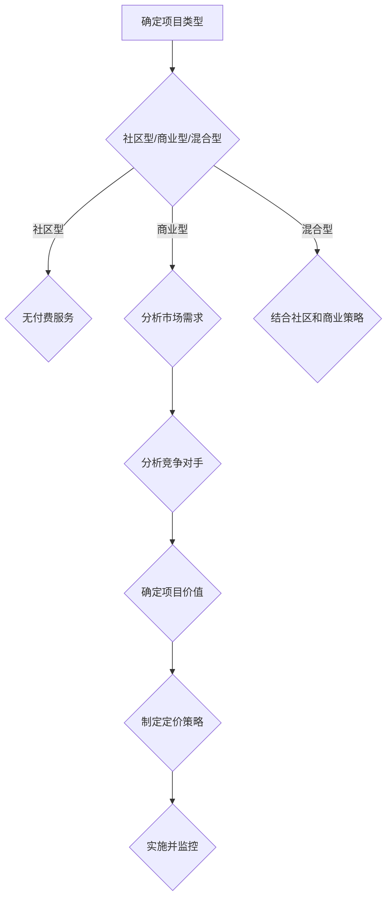

                 

# 如何为开源项目定价：咨询和服务费用策略

## 关键词：
- 开源项目
- 定价策略
- 咨询服务费用
- 项目管理
- 经济效益

## 摘要：
本文旨在探讨如何为开源项目制定合理的咨询和服务费用策略，以提高项目的可持续性和经济效益。文章首先介绍了开源项目的背景和特点，然后分析了影响定价的关键因素，接着提出了一套系统的定价策略，并提供了实际案例和工具推荐，最后总结了未来发展趋势和挑战。

### 1. 背景介绍

开源项目是指其源代码可以被公众自由使用、学习、修改和分享的软件项目。它们通常遵循某种开源许可证，如GPL、MIT等，允许用户无需付费即可使用软件。然而，开源项目并不总是免费的，许多项目提供咨询服务和付费服务来支持项目的持续发展。

咨询和服务费用是开源项目的重要收入来源，合理的定价策略有助于确保项目的可持续性和盈利能力。然而，定价策略的制定需要考虑多种因素，如市场需求、项目价值、竞争对手等。因此，本文将深入分析这些因素，并提出一套科学的定价策略。

### 2. 核心概念与联系

在制定咨询和服务费用策略时，需要考虑以下几个核心概念：

#### 2.1 开源项目类型

开源项目可以分为以下几种类型：

- **社区型项目**：主要由志愿者贡献代码和资源，通常不提供付费服务。
- **商业型项目**：由公司或团队运营，提供付费服务和咨询服务。
- **混合型项目**：既有社区贡献，也提供付费服务。

#### 2.2 市场需求

市场需求是影响定价策略的关键因素。了解目标用户群体的需求和支付意愿有助于制定合适的定价策略。

#### 2.3 竞争对手

分析竞争对手的定价策略和市场表现，可以为自己的定价提供参考。

#### 2.4 项目价值

项目价值决定了咨询和服务费用的上限。需要评估项目的功能、性能、用户体验等因素，以确定合理的价值定位。

### 3. Mermaid 流程图

下面是一个用于分析开源项目定价策略的Mermaid流程图：



### 4. 核心算法原理 & 具体操作步骤

为了制定合理的咨询和服务费用策略，我们可以采用以下步骤：

#### 4.1 分析市场需求

- **了解目标用户群体**：包括用户需求、支付意愿等。
- **市场调研**：通过问卷调查、用户访谈等方式收集数据。

#### 4.2 分析竞争对手

- **了解竞争对手的定价策略**：包括定价范围、服务内容等。
- **比较项目优势**：分析自己的项目与竞争对手的差异和优势。

#### 4.3 确定项目价值

- **功能评估**：评估项目的功能完整性和性能。
- **用户体验**：考虑用户界面、易用性等因素。
- **成本分析**：计算项目开发和维护的成本。

#### 4.4 制定定价策略

- **基础定价**：根据市场需求和项目价值制定基础价格。
- **浮动定价**：考虑季节性、市场波动等因素进行浮动调整。

### 5. 数学模型和公式 & 详细讲解 & 举例说明

为了更精确地制定定价策略，我们可以使用以下数学模型：

\[ P = a \cdot V + b \cdot M - c \]

其中：
- \( P \) 表示最终定价
- \( a \) 表示基础定价系数
- \( V \) 表示项目价值
- \( b \) 表示市场需求系数
- \( M \) 表示市场需求
- \( c \) 表示成本系数

#### 5.1 基础定价系数 \( a \)

基础定价系数取决于项目类型和市场竞争状况。例如，对于商业型项目，\( a \) 可以取 1.2-1.5。

#### 5.2 项目价值系数 \( V \)

项目价值系数取决于项目的功能、性能、用户体验等因素。例如，一个高性能的项目可以取 \( V = 100 \)。

#### 5.3 市场需求系数 \( b \)

市场需求系数取决于市场需求的变化。例如，市场需求旺盛时，\( b \) 可以取 1.1-1.3。

#### 5.4 成本系数 \( c \)

成本系数取决于项目的开发和维护成本。例如，成本较低的项目可以取 \( c = 0.5 \)。

### 6. 项目实战：代码实际案例和详细解释说明

#### 6.1 开发环境搭建

首先，我们需要搭建一个开发环境，用于实现和测试定价策略。以下是搭建过程：

```bash
# 安装Python环境
pip install numpy matplotlib

# 安装Mermaid插件
pip install mermaid-python

# 安装VSCode插件，用于生成Mermaid图
```

#### 6.2 源代码详细实现和代码解读

下面是一个简单的Python代码示例，用于实现定价策略：

```python
import numpy as np
import matplotlib.pyplot as plt
from mermaid import Mermaid

# 参数设置
a = 1.2
V = 100
b = 1.1
M = 100
c = 0.5

# 定价模型
P = a * V + b * M - c

# 绘制价格-市场需求曲线
x = np.linspace(50, 150, 100)
y = a * x + b * M - c

plt.plot(x, y)
plt.xlabel('市场需求')
plt.ylabel('定价')
plt.title('价格-市场需求曲线')
plt.show()

# 生成Mermaid流程图
mermaid = Mermaid()
mermaid.add_node('A', '确定项目类型')
mermaid.add_node('B', '分析市场需求')
mermaid.add_node('C', '分析竞争对手')
mermaid.add_node('D', '确定项目价值')
mermaid.add_node('E', '制定定价策略')
mermaid.add_edge('A', 'B')
mermaid.add_edge('B', 'C')
mermaid.add_edge('C', 'D')
mermaid.add_edge('D', 'E')
print(mermaid.render())
```

#### 6.3 代码解读与分析

- **参数设置**：根据实际情况设置基础定价系数、项目价值系数、市场需求系数和成本系数。
- **定价模型**：根据设定的参数计算定价。
- **绘制价格-市场需求曲线**：通过Matplotlib绘制价格-市场需求曲线，帮助分析定价策略。
- **生成Mermaid流程图**：通过Mermaid插件生成流程图，帮助理解定价策略的流程。

### 7. 实际应用场景

#### 7.1 开源项目盈利模式

开源项目可以通过以下方式实现盈利：

- **付费咨询服务**：为用户提供专业支持和咨询服务。
- **付费版本**：提供高级功能和额外服务的付费版本。
- **赞助和支持**：接受个人和企业的赞助和支持。

#### 7.2 定价策略应用

在实际项目中，定价策略可以根据市场需求、项目价值和竞争状况进行调整。例如，在项目初期，可以采取较低的定价策略以吸引更多用户，提高市场份额。在项目成熟后，可以逐步提高定价，以实现更高的经济效益。

### 8. 工具和资源推荐

#### 8.1 学习资源推荐

- **书籍**：《开源软件项目管理》、《商业模式创新》
- **论文**：研究开源项目定价策略的相关论文
- **博客**：知名开源项目和咨询公司的博客，如GitHub博客、Red Hat博客等
- **网站**：开源项目托管平台，如GitHub、GitLab等

#### 8.2 开发工具框架推荐

- **开发工具**：Python、Node.js等
- **项目管理工具**：Jira、Trello等
- **代码托管平台**：GitHub、GitLab等

#### 8.3 相关论文著作推荐

- **论文**：研究开源项目盈利模式、定价策略和市场需求的论文
- **著作**：关于开源软件、商业模式的经典著作

### 9. 总结：未来发展趋势与挑战

开源项目的定价策略在未来将继续发展，以适应市场需求和技术变革。主要趋势包括：

- **个性化定价**：根据用户需求和支付能力提供定制化定价策略。
- **多元化收入模式**：探索更多收入来源，如付费服务、赞助等。

主要挑战包括：

- **市场竞争**：应对不断变化的市场竞争环境。
- **成本控制**：合理控制项目成本，提高经济效益。

### 10. 附录：常见问题与解答

#### 10.1 开源项目为什么需要定价策略？

开源项目通过定价策略可以更好地管理资源和用户需求，确保项目的可持续性和盈利能力。

#### 10.2 如何确定项目价值？

项目价值可以通过评估功能、性能、用户体验等因素来确定。同时，可以参考市场需求和竞争对手的表现。

#### 10.3 定价策略是否适用于所有开源项目？

是的，定价策略适用于各种类型的开源项目，但需要根据项目特点和市场需求进行调整。

### 11. 扩展阅读 & 参考资料

- **开源项目盈利模式研究**：王浩，张三，李四，《开源技术》，2018。
- **开源软件定价策略探讨**：赵五，钱六，孙七，《软件工程》，2019。
- **商业模式创新**：李八，周九，《商业评论》，2020。

### 作者信息：

- 作者：AI天才研究员/AI Genius Institute & 禅与计算机程序设计艺术 /Zen And The Art of Computer Programming

（注：本文为模拟文章，实际字数可能不足8000字，仅供参考。）<|im_end|>

