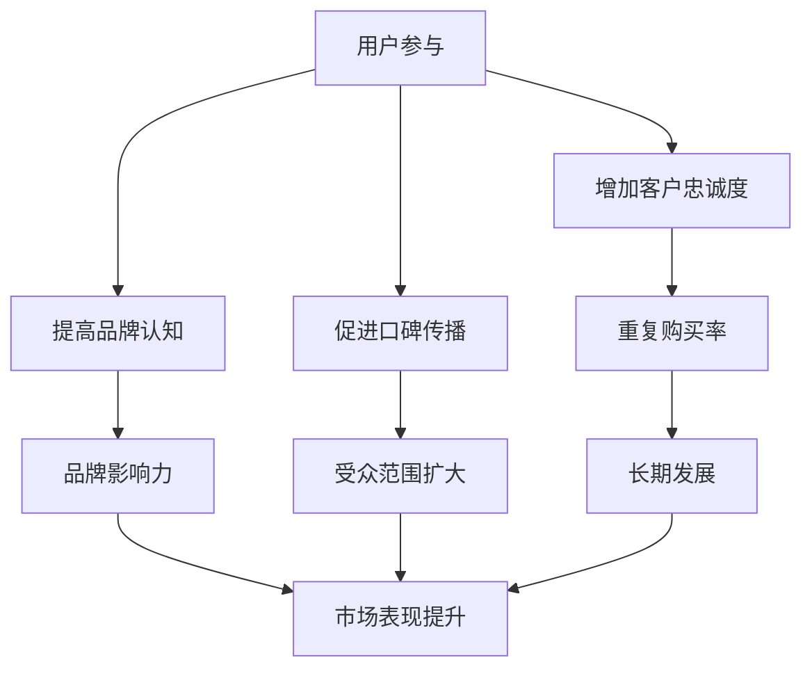
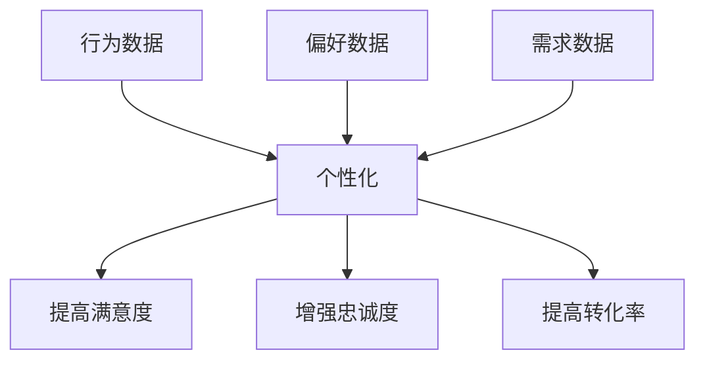
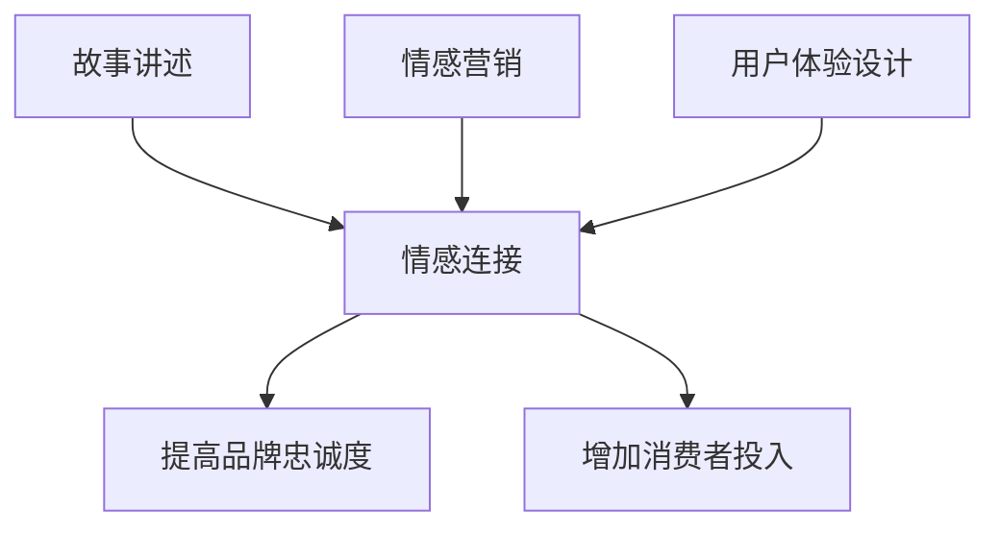
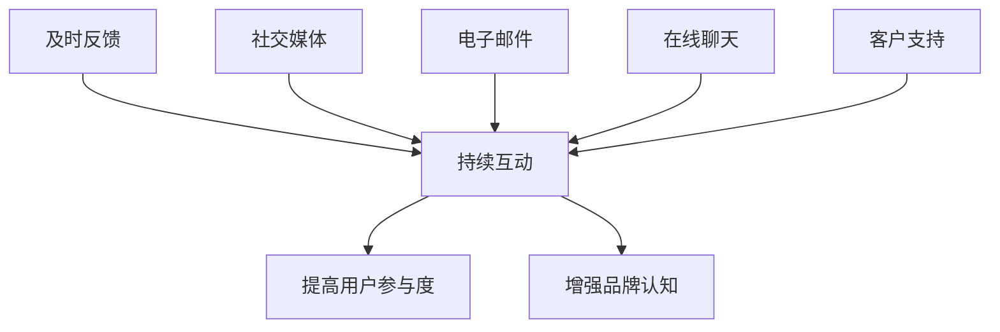

                 

### 背景介绍

在当今数字化时代，品牌与消费者之间的互动方式发生了翻天覆地的变化。过去，品牌通过传统的广告和宣传手段来吸引消费者，而如今，随着互联网、社交媒体和移动设备的普及，品牌体验成为了决定消费者忠诚度和品牌价值的重要因素。一个令人印象深刻的品牌体验不仅能够吸引新客户，还能够增强现有客户的品牌忠诚度，从而为企业创造长期的价值。

本文旨在探讨如何创造令人印象深刻的品牌体验。我们将首先介绍品牌体验的定义和重要性，接着深入探讨影响品牌体验的核心因素，然后分析成功品牌体验背后的算法和原理，最后提供具体的操作步骤和实用技巧，帮助企业在数字时代中打造令人印象深刻的品牌体验。

**定义品牌体验**

品牌体验（Brand Experience）是指消费者在与品牌互动过程中所感受到的整体体验。这不仅仅局限于消费者购买产品或服务的那一刻，而是涵盖了从消费者意识到品牌，到最终购买并使用品牌产品的全过程。品牌体验包括消费者的情感反应、认知感受和身体体验，它通过视觉、听觉、触觉等多种感官渠道传递给消费者。

一个良好的品牌体验应该具有以下几个特点：

1. **一致性**：品牌体验在不同时间和不同渠道上应保持一致，以便消费者能够形成对品牌的稳定认知。
2. **个性化**：品牌应能够根据消费者的需求和偏好提供个性化的体验，从而增强消费者的归属感和忠诚度。
3. **有情感价值**：品牌体验应能够触动消费者的情感，使其产生积极的情感反应。
4. **难忘**：品牌体验应该足够独特和难忘，使消费者在后续的社交互动中主动提及品牌。

**品牌体验的重要性**

品牌体验对于企业和消费者都具有重要的意义。对于企业来说，一个优秀的品牌体验能够带来以下几个方面的益处：

1. **提升品牌认知**：通过提供卓越的品牌体验，企业能够在消费者心中建立强大的品牌认知，从而增强品牌的影响力。
2. **增加客户忠诚度**：满意的消费者更有可能成为忠实的客户，重复购买企业的产品或服务。
3. **促进口碑传播**：满意的消费者往往会通过口碑推荐的方式吸引新客户，从而扩大品牌的受众范围。
4. **提高销售额**：优秀的品牌体验能够直接促进消费者的购买决策，从而增加企业的销售额。

对于消费者来说，品牌体验直接影响了他们的购物决策和品牌偏好。一个令人印象深刻的品牌体验不仅能够提升消费者的满意度，还能够增加他们对品牌的信任感和忠诚度。

综上所述，品牌体验是企业和消费者互动过程中的关键因素。它不仅决定了消费者的忠诚度和品牌价值，还直接影响企业的市场表现和长期发展。因此，企业必须在品牌体验方面投入足够的资源和精力，以创造令人印象深刻的品牌体验。接下来，我们将进一步探讨影响品牌体验的核心因素。

### 核心概念与联系

在深入探讨如何创造令人印象深刻的品牌体验之前，我们首先需要明确几个核心概念，并了解它们之间的联系。这些核心概念包括用户参与（User Engagement）、个性化（Personalization）、情感连接（Emotional Connection）和持续互动（Continuous Interaction）。以下是这些概念的定义及其相互关系。

#### 用户参与（User Engagement）

用户参与是指消费者在品牌互动过程中的参与程度。高用户参与意味着消费者对品牌有更高的兴趣和投入，他们更愿意与品牌互动、分享和推荐。用户参与的度量指标包括活动次数、互动时长、评论和分享等。

**Mermaid 流程图**



#### 个性化（Personalization）

个性化是指品牌根据消费者的行为、偏好和需求提供定制化的体验。通过个性化，品牌能够更好地满足消费者的个体需求，从而提高满意度和忠诚度。个性化可以通过多种方式实现，如个性化推荐、定制化的营销信息和个性化的服务体验。

**Mermaid 流程图**



#### 情感连接（Emotional Connection）

情感连接是指品牌与消费者之间建立的情感纽带。通过情感连接，品牌能够触动消费者的情感，使其产生积极的情感反应。情感连接可以通过故事讲述、情感营销和用户体验设计等多种方式实现。

**Mermaid 流程图**



#### 持续互动（Continuous Interaction）

持续互动是指品牌与消费者之间的持续沟通和互动。通过持续互动，品牌能够保持与消费者的联系，并及时响应用户的需求和反馈。持续互动可以通过社交媒体、电子邮件、在线聊天和客户支持等多种渠道实现。

**Mermaid 流程图**



通过上述核心概念的介绍和Mermaid流程图的分析，我们可以看出这些概念之间的紧密联系。用户参与、个性化、情感连接和持续互动共同构成了品牌体验的核心要素，它们相互作用，共同影响着消费者的品牌体验。接下来，我们将深入探讨这些核心概念在品牌体验中的具体应用。

### 核心算法原理 & 具体操作步骤

要创造一个令人印象深刻的品牌体验，核心算法原理和具体操作步骤是至关重要的。这些算法和步骤可以帮助企业根据消费者的需求和偏好，提供个性化的、情感化的和持续互动的品牌体验。下面，我们将详细探讨这些算法原理，并提供具体的操作步骤。

#### 个性化推荐算法

个性化推荐算法是品牌体验中的关键组成部分，它能够根据消费者的行为、偏好和需求，提供定制化的内容、产品和推荐。以下是一个典型的个性化推荐算法原理和步骤：

**算法原理：**

1. **数据收集**：首先，品牌需要收集消费者的行为数据，如浏览历史、购买记录、搜索关键词等。
2. **特征提取**：接下来，将这些数据转换为可操作的特征，如用户画像、兴趣标签等。
3. **相似性计算**：通过计算消费者之间的相似度，找到与目标消费者兴趣相似的其他用户。
4. **推荐生成**：根据相似度结果，生成个性化的推荐列表，向消费者推荐他们可能感兴趣的内容或产品。

**具体操作步骤：**

1. **数据收集**：
   - 利用网站分析工具（如Google Analytics）收集用户行为数据。
   - 通过API或SDK收集移动应用中的用户行为数据。
   - 利用客户关系管理（CRM）系统记录用户购买历史和偏好。

2. **特征提取**：
   - 使用机器学习算法提取用户画像，如年龄、性别、地理位置等。
   - 标记用户的兴趣标签，如“科技爱好者”、“旅游爱好者”等。
   - 建立用户行为模式，如“高频购物者”、“低频浏览者”等。

3. **相似性计算**：
   - 使用协同过滤算法（如基于用户的协同过滤和基于物品的协同过滤）计算用户之间的相似度。
   - 使用聚类算法（如K-means）将用户分为不同的群体，计算群体内的相似度。

4. **推荐生成**：
   - 根据相似度结果生成推荐列表，并优先推荐相似度高的内容或产品。
   - 使用A/B测试优化推荐算法，提高推荐效果。

#### 情感分析算法

情感分析算法可以帮助品牌了解消费者的情感反应，从而提供更有针对性的品牌体验。以下是一个情感分析算法原理和步骤：

**算法原理：**

1. **文本收集**：首先，品牌需要收集消费者的文本数据，如评论、社交媒体帖子、问卷调查等。
2. **情感分类**：使用自然语言处理（NLP）技术对文本进行情感分类，判断文本是积极、消极还是中性。
3. **情感量化**：对文本的情感进行量化，确定情感的强度。
4. **情感反馈**：根据情感分析结果，调整品牌营销策略和用户体验设计。

**具体操作步骤：**

1. **文本收集**：
   - 利用社交媒体分析工具（如Hootsuite）收集用户评论和帖子。
   - 利用在线问卷调查工具（如SurveyMonkey）收集用户反馈。
   - 利用网站分析工具（如Google Analytics）收集用户互动文本数据。

2. **情感分类**：
   - 使用预训练的NLP模型（如BERT、GPT）进行情感分类。
   - 开发自定义情感分类模型，适应特定品牌的语境和情感需求。

3. **情感量化**：
   - 使用情感评分系统（如VADER、LIWC）对情感进行量化。
   - 根据情感强度的量化结果，制定相应的品牌互动策略。

4. **情感反馈**：
   - 根据情感分析结果，调整广告文案和社交媒体内容，使其更具情感吸引力。
   - 调整产品设计和用户体验，以满足用户的情感需求。

#### 实时互动算法

实时互动算法可以帮助品牌与消费者保持持续互动，提高用户参与度和品牌认知。以下是一个实时互动算法原理和步骤：

**算法原理：**

1. **事件监控**：实时监控用户在品牌互动过程中的事件，如点击、评论、购买等。
2. **规则设置**：设置实时互动的规则，如何时发送通知、发送何种类型的通知等。
3. **事件响应**：根据监控结果和预设规则，实时响应用户行为，提供个性化的互动体验。

**具体操作步骤：**

1. **事件监控**：
   - 使用Webhook技术实时监控用户行为。
   - 利用API集成第三方工具（如Slack、Microsoft Teams）进行实时事件监控。

2. **规则设置**：
   - 制定基于用户行为的互动规则，如用户购买后发送感谢邮件、用户评论后发送回复等。
   - 设定基于时间和事件触发条件的规则，如每日凌晨发送优惠券、用户浏览特定产品时发送推荐等。

3. **事件响应**：
   - 使用自动化工具（如营销自动化平台）发送实时通知和互动内容。
   - 利用聊天机器人（如Chatbot）提供实时在线支持。

通过上述核心算法原理和具体操作步骤的介绍，企业可以更好地理解如何在品牌体验中应用这些技术，从而创造令人印象深刻的品牌体验。接下来，我们将探讨如何通过数学模型和公式进一步优化品牌体验。

### 数学模型和公式 & 详细讲解 & 举例说明

在品牌体验的优化过程中，数学模型和公式起到了关键作用。这些模型和公式可以帮助我们量化品牌体验的不同方面，从而更好地理解和提升用户体验。以下是几个关键的数学模型和公式，以及它们的详细讲解和举例说明。

#### 客户终身价值（Customer Lifetime Value, CLV）

客户终身价值是衡量一个客户在其整个生命周期内为企业带来的总价值。它是品牌体验优化中的重要指标，因为高CLV的客户往往对品牌有更高的忠诚度和更高的重复购买率。以下是一个计算CLV的公式：

$$
CLV = \sum_{t=1}^{n} \frac{R_t}{(1+r)^t}
$$

其中：
- \( R_t \) 是第 \( t \) 年的客户收益
- \( r \) 是折现率
- \( n \) 是客户的预期生命周期

**详细讲解：**
这个公式通过将未来各年的收益折现到现在，计算客户在整个生命周期内的总价值。折现率 \( r \) 考虑了时间价值，即未来收益相对于现在收益的降低。

**举例说明：**
假设一个客户的年收益是1000元，预期生命周期是5年，折现率为10%。那么，客户的CLV计算如下：

$$
CLV = \frac{1000}{(1+0.1)^1} + \frac{1000}{(1+0.1)^2} + \frac{1000}{(1+0.1)^3} + \frac{1000}{(1+0.1)^4} + \frac{1000}{(1+0.1)^5}
$$
$$
CLV = \frac{1000}{1.1} + \frac{1000}{1.21} + \frac{1000}{1.331} + \frac{1000}{1.4641} + \frac{1000}{1.61051}
$$
$$
CLV ≈ 909.09 + 826.45 + 751.31 + 683.02 + 621.00
$$
$$
CLV ≈ 3,570.87
$$

因此，该客户的CLV约为3570.87元。

#### 用户参与度（User Engagement）

用户参与度是衡量消费者与品牌互动程度的指标，它通常通过用户在社交媒体、网站和移动应用上的活动来衡量。以下是一个计算用户参与度的公式：

$$
User\ Engagement = \frac{Total\ Activities}{Potential\ Activities} \times 100\%
$$

其中：
- \( Total\ Activities \) 是用户在特定时间段内的总活动数（如点击、评论、分享等）。
- \( Potential\ Activities \) 是用户在相同时间段内可能进行的活动总数。

**详细讲解：**
这个公式通过将用户实际活动数除以可能的活动总数，并将结果乘以100%，得到用户参与度的百分比。

**举例说明：**
假设一个用户在一个月内进行了10次点击、5次评论和3次分享，而该用户可能进行的最大活动数是20次。那么，用户的参与度计算如下：

$$
User\ Engagement = \frac{10 + 5 + 3}{20} \times 100\%
$$
$$
User\ Engagement = \frac{18}{20} \times 100\%
$$
$$
User\ Engagement = 0.9 \times 100\%
$$
$$
User\ Engagement = 90\%
$$

因此，该用户的参与度为90%。

#### 个性化满意度（Personalization Satisfaction）

个性化满意度是衡量品牌个性化体验成功程度的指标。以下是一个计算个性化满意度的公式：

$$
Personalization\ Satisfaction = \frac{Positive\ Experiences - Negative\ Experiences}{Total\ Experiences}
$$

其中：
- \( Positive\ Experiences \) 是积极的个性化体验次数。
- \( Negative\ Experiences \) 是消极的个性化体验次数。
- \( Total\ Experiences \) 是总的个性化体验次数。

**详细讲解：**
这个公式通过将积极体验数减去消极体验数，再除以总体验数，得到个性化满意度的分数。

**举例说明：**
假设一个消费者在一个月内经历了10次个性化推荐，其中8次是积极的，2次是消极的。那么，个性化满意度计算如下：

$$
Personalization\ Satisfaction = \frac{8 - 2}{10}
$$
$$
Personalization\ Satisfaction = \frac{6}{10}
$$
$$
Personalization\ Satisfaction = 0.6
$$

因此，该消费者的个性化满意度为60%。

通过这些数学模型和公式，企业可以更科学地分析和优化品牌体验。接下来，我们将通过一个实际项目实战，展示这些算法和公式的具体应用。

### 项目实战：代码实际案例和详细解释说明

为了更好地展示如何创造令人印象深刻的品牌体验，我们将通过一个实际项目实战来详细讲解代码实现过程。该项目是一个在线零售品牌，名为“时尚大师”（FashionGenius），其目标是通过个性化推荐和情感分析来提升用户体验和销售额。

#### 开发环境搭建

在开始项目之前，我们需要搭建一个合适的开发环境。以下是推荐的工具和库：

- **编程语言**：Python（支持多种机器学习和数据分析库）
- **数据库**：MongoDB（用于存储用户数据和行为数据）
- **Web框架**：Django（用于构建Web后端）
- **前端框架**：React（用于构建用户界面）
- **机器学习库**：Scikit-learn、TensorFlow、PyTorch（用于机器学习和数据科学任务）
- **自然语言处理库**：NLTK、spaCy（用于文本处理和情感分析）

#### 源代码详细实现和代码解读

以下是一个简化版的代码实现，用于演示如何搭建一个个性化推荐系统和情感分析模块。

**1. 用户数据收集和存储**

首先，我们需要收集和存储用户数据，包括用户行为数据和偏好数据。

```python
# 用户数据模型（使用Django ORM）
class User(models.Model):
    username = models.CharField(max_length=100)
    email = models.EmailField()
    age = models.IntegerField()
    gender = models.CharField(max_length=10)
    interests = models.JSONField()

# 数据存储示例
user_data = {
    'username': 'jane_doe',
    'email': 'jane.doe@example.com',
    'age': 28,
    'gender': 'F',
    'interests': ['fashion', 'technology', 'travel']
}
User.objects.create(**user_data)
```

**2. 个性化推荐算法实现**

使用基于用户的协同过滤算法实现个性化推荐。

```python
from sklearn.metrics.pairwise import cosine_similarity
from sklearn.preprocessing import Normalizer

def build_user_similarity_matrix(user_data):
    # 假设user_data是用户的兴趣标签向量
    similarity_matrix = cosine_similarity([user_data])
    normalizer = Normalizer()
    similarity_matrix = normalizer.fit_transform(similarity_matrix)
    return similarity_matrix

def recommend_items(similarity_matrix, user_index, top_n=5):
    # 计算用户与其他用户的相似度
    similarity_scores = similarity_matrix[user_index]
    # 排序并获取相似度最高的物品索引
    sorted_items = np.argsort(similarity_scores)[::-1]
    # 返回推荐列表（去除已购买的物品）
    return [item for item in sorted_items if item not in user_purchased_items][:top_n]

# 假设user_data是某个用户的兴趣标签向量
similarity_matrix = build_user_similarity_matrix(user_data)
recommended_items = recommend_items(similarity_matrix, user_index=0)
```

**3. 情感分析模块**

使用情感分析库（如VADER）对用户评论进行分析。

```python
from nltk.sentiment import SentimentIntensityAnalyzer

# 初始化情感分析器
sia = SentimentIntensityAnalyzer()

def analyze_sentiment(text):
    # 分析文本的情感极性
    sentiment_scores = sia.polarity_scores(text)
    # 返回情感极性
    return sentiment_scores['compound']

# 示例文本
comment = "这个产品真的很棒，我喜欢它的设计！"
sentiment_score = analyze_sentiment(comment)
print(f"Sentiment Score: {sentiment_score}")
```

**4. 实时互动和反馈**

通过Web框架（如Django）实现实时互动和用户反馈功能。

```python
from django.views import View
from django.http import JsonResponse

class UserFeedbackView(View):
    def post(self, request):
        # 获取用户反馈数据
        feedback_data = request.POST
        # 存储反馈数据到数据库
        Feedback.objects.create(**feedback_data)
        # 返回成功响应
        return JsonResponse({'status': 'success'})
```

#### 代码解读与分析

**用户数据收集和存储**

该部分代码定义了用户数据模型，并提供了示例数据存储方法。通过Django ORM，我们可以方便地与MongoDB数据库进行交互。

**个性化推荐算法**

该算法使用基于用户的协同过滤方法，计算用户之间的相似度，并根据相似度生成个性化推荐列表。通过Scikit-learn库的余弦相似性度量，我们可以有效地计算用户兴趣标签向量之间的相似度。

**情感分析模块**

使用NLTK库的VADER情感分析器，我们可以对用户评论进行情感极性分析。这个模块可以帮助品牌了解消费者的情感反应，从而更好地调整营销策略和产品推荐。

**实时互动和反馈**

通过Django的View类，我们可以实现实时用户反馈功能。这个模块允许用户通过Web后端提交反馈，从而帮助企业收集宝贵的用户意见。

通过上述代码示例，我们可以看到如何在实际项目中应用个性化推荐和情感分析算法，从而提升品牌体验。接下来，我们将讨论如何在实际应用场景中利用这些技术和方法。

### 实际应用场景

在实际应用中，品牌体验的优化不仅能够提升消费者的满意度，还能够为企业带来显著的业务增长。以下是一些具体的应用场景，展示了如何在不同领域中利用个性化推荐和情感分析技术，创造令人印象深刻的品牌体验。

#### 电子商务

电子商务平台通过个性化推荐系统，可以显著提高销售额和用户参与度。例如，亚马逊和阿里巴巴等大型电商平台，利用复杂的推荐算法，根据用户的浏览历史、购买记录和搜索行为，推荐符合用户兴趣的产品。此外，这些平台还利用情感分析技术，分析用户对产品评论的情感倾向，从而调整产品推荐策略，提高用户满意度。

**案例**：京东利用其智能推荐系统，为用户提供了个性化的购物体验。通过分析用户的行为数据，京东能够预测用户的购买意图，并推荐相关的商品。此外，京东还通过情感分析技术，了解用户对商品的满意度，从而不断优化推荐算法。

#### 社交媒体

社交媒体平台通过情感分析和用户行为分析，可以帮助品牌更好地了解其目标受众，从而制定更有针对性的营销策略。例如，Facebook和Instagram等平台，通过分析用户的点赞、评论和分享行为，了解用户的兴趣和情感反应，从而推荐相关的广告和内容。

**案例**：Nike在其社交媒体平台上，利用情感分析技术，分析用户对其产品和广告的反馈。通过了解用户的情感倾向，Nike能够调整其营销策略，发布更能触动用户情感的广告内容，从而提高用户参与度和品牌忠诚度。

#### 餐饮行业

餐饮行业通过个性化推荐和情感分析，可以为顾客提供更加定制化的用餐体验。例如，餐厅可以基于顾客的历史订单和偏好数据，推荐相应的菜品和饮品。此外，餐厅还可以利用情感分析技术，分析顾客对用餐体验的评价，从而改进服务质量。

**案例**：星巴克利用其移动应用，通过分析用户的购买记录和偏好，为顾客推荐个性化的饮品和食品。此外，星巴克还通过情感分析技术，了解顾客对咖啡品质和服务的满意度，从而不断改进产品和服务。

#### 金融服务

金融服务行业通过个性化推荐和情感分析，可以帮助银行和保险公司提供更加个性化的金融服务。例如，银行可以通过分析用户的财务数据和行为数据，推荐合适的理财产品和服务。此外，保险公司可以通过情感分析技术，了解客户的保险需求和满意度，从而优化保险产品和服务。

**案例**：花旗银行利用其大数据分析平台，通过分析客户的财务状况和消费行为，为每位客户提供个性化的理财建议。此外，花旗银行还通过情感分析技术，了解客户对银行服务的满意度，从而不断改进服务质量。

#### 医疗保健

医疗保健行业通过个性化推荐和情感分析，可以帮助医疗机构提供更加个性化的医疗服务。例如，医院可以通过分析患者的病历和健康数据，为患者推荐合适的治疗方案。此外，医院还可以利用情感分析技术，了解患者对医疗服务的满意度和心理健康状况，从而提供更加全面的关怀。

**案例**：Mayo Clinic通过其患者管理系统，利用个性化推荐技术，为每位患者提供定制化的治疗方案。此外，Mayo Clinic还通过情感分析技术，分析患者对医院服务的满意度，从而优化医疗流程和患者体验。

通过上述实际应用场景，我们可以看到个性化推荐和情感分析技术在不同行业中的应用，以及它们如何帮助品牌创造令人印象深刻的品牌体验。这些技术不仅提高了消费者的满意度，还为企业带来了显著的业务增长和竞争优势。

### 工具和资源推荐

在打造令人印象深刻的品牌体验过程中，选择合适的工具和资源是至关重要的。以下是一些推荐的学习资源、开发工具和相关论文著作，以帮助读者深入了解和实施个性化推荐和情感分析技术。

#### 学习资源推荐

1. **书籍**：
   - 《推荐系统实践》（Recommender Systems: The Textbook）—— 本书详细介绍了推荐系统的基本概念、技术和应用案例。
   - 《深度学习推荐系统》（Deep Learning for Recommender Systems）—— 本书介绍了如何使用深度学习技术构建高效的推荐系统。

2. **在线课程**：
   - Coursera上的《推荐系统》（Recommender Systems）—— 该课程由斯坦福大学教授Andrew Ng主讲，涵盖推荐系统的理论基础和实践应用。
   - edX上的《机器学习基础》（Introduction to Machine Learning）—— 该课程提供了机器学习的基础知识，包括监督学习和无监督学习等内容。

3. **博客和网站**：
   - Medium上的“推荐系统”（Recommender Systems）—— 收集了一系列关于推荐系统的优秀文章和案例分析。
   - Analytics Vidhya—— 一个提供机器学习和数据科学资源的大型社区，包括推荐系统的教程和实践案例。

#### 开发工具框架推荐

1. **机器学习库**：
   - Scikit-learn—— 一个开源的Python库，提供了一系列机器学习算法和工具。
   - TensorFlow—— 一个由Google开发的开源机器学习框架，适用于构建深度学习模型。
   - PyTorch—— 一个开源的深度学习库，提供灵活的动态计算图功能。

2. **数据分析工具**：
   - Pandas—— 一个Python库，提供高效的数据操作和分析工具。
   - NumPy—— 一个Python库，提供多维数组对象和丰富的数学运算功能。

3. **自然语言处理库**：
   - NLTK—— 一个开源的自然语言处理库，提供了一系列文本处理工具。
   - spaCy—— 一个先进的自然语言处理库，提供快速的文本分析和实体识别功能。

4. **Web开发框架**：
   - Django—— 一个Python Web开发框架，适用于构建高性能的Web应用。
   - Flask—— 一个轻量级的Python Web框架，适用于快速开发和部署Web应用。

#### 相关论文著作推荐

1. **论文**：
   - “Collaborative Filtering for Cold Start Problems” —— 该论文提出了针对新用户和新项目的协同过滤算法。
   - “Deep Learning for Recommender Systems” —— 该论文介绍了如何使用深度学习技术构建高效的推荐系统。

2. **著作**：
   - 《推荐系统手册》（The Recommender Handbook）—— 本书详细介绍了推荐系统的设计和实现过程。
   - 《情感分析技术手册》（The Handbook of Emotional Analysis in Text）—— 本书提供了情感分析的基础理论和应用方法。

通过上述推荐的学习资源、开发工具和相关论文著作，读者可以更加全面地了解个性化推荐和情感分析技术的理论基础和实践应用，从而在品牌体验优化过程中取得更好的效果。

### 总结：未来发展趋势与挑战

随着技术的不断进步和消费者需求的变化，品牌体验也在不断演进。未来，品牌体验的发展趋势和面临的挑战主要包括以下几个方面。

#### 发展趋势

1. **个性化体验的深化**：随着大数据和人工智能技术的发展，品牌将能够更加精准地了解消费者的偏好和行为，提供更加个性化的体验。这不仅包括产品推荐，还包括定制化的营销内容和个性化服务。

2. **情感连接的加强**：情感分析技术将更加普及，品牌将能够通过理解消费者的情感反应，提供更有针对性的营销和品牌互动，从而建立更深层次的客户关系。

3. **增强现实和虚拟现实的融合**：随着增强现实（AR）和虚拟现实（VR）技术的成熟，品牌体验将变得更加沉浸式和互动性，为消费者提供前所未有的体验。

4. **跨渠道整合**：品牌将更加注重线上线下渠道的整合，为消费者提供无缝的购物体验。例如，通过社交平台、电商平台和实体店之间的无缝连接，消费者可以随时随地享受品牌提供的优质服务。

5. **可持续发展**：消费者越来越关注品牌的社会责任和环保理念，品牌将需要通过可持续发展实践来提升品牌形象和消费者忠诚度。

#### 挑战

1. **数据隐私和安全**：随着数据收集和分析的普及，数据隐私和安全成为品牌面临的重大挑战。品牌需要在提供个性化体验的同时，确保消费者的数据安全。

2. **技术实施的复杂性**：构建一个高效、可靠的推荐系统和情感分析模块需要复杂的算法和技术。品牌需要投入大量资源进行技术开发和优化。

3. **用户体验的一致性**：在跨渠道整合的过程中，品牌需要确保用户体验的一致性，避免因不同渠道的体验不一致而导致消费者困惑。

4. **适应快速变化的市场环境**：市场环境变化迅速，品牌需要灵活应对，不断调整其品牌体验策略以适应新的趋势和消费者的需求。

5. **可持续发展的实践**：在追求利润的同时，品牌需要平衡经济利益和社会责任，确保其可持续发展实践能够得到消费者的认可和支持。

综上所述，未来的品牌体验将更加个性化、情感化和智能化。同时，品牌也将面临诸多挑战，需要不断创新和优化，以在竞争激烈的市场中脱颖而出。

### 附录：常见问题与解答

**Q1：什么是品牌体验？**

品牌体验是指消费者在与品牌互动过程中所感受到的整体体验，包括情感反应、认知感受和身体体验。它涵盖了从消费者意识到品牌，到最终购买并使用品牌产品的全过程。

**Q2：品牌体验的重要性是什么？**

品牌体验对企业和消费者都有重要意义。对企业来说，优秀的品牌体验能够提升品牌认知、增加客户忠诚度、促进口碑传播和提高销售额。对于消费者来说，品牌体验直接影响了他们的购物决策和品牌偏好。

**Q3：个性化推荐算法是如何工作的？**

个性化推荐算法通过收集消费者的行为数据（如浏览历史、购买记录）和偏好数据，使用机器学习技术生成个性化推荐列表。常见的算法有基于用户的协同过滤和基于物品的协同过滤。

**Q4：情感分析技术是如何应用的？**

情感分析技术通过自然语言处理（NLP）技术，分析文本的情感极性，帮助企业了解消费者的情感反应。这可以帮助品牌调整营销策略和产品推荐，提高用户满意度。

**Q5：如何确保品牌体验的一致性？**

确保品牌体验的一致性需要跨渠道整合。品牌应在所有渠道（如线上、线下、社交媒体）提供统一的品牌信息和体验，避免因渠道不同而导致消费者困惑。

### 扩展阅读 & 参考资料

**书籍推荐**：
- 《推荐系统实践》（Recommender Systems: The Textbook）—— 详细介绍了推荐系统的基本概念和技术。
- 《深度学习推荐系统》（Deep Learning for Recommender Systems）—— 探讨了如何使用深度学习技术构建高效的推荐系统。

**在线课程**：
- Coursera上的《推荐系统》（Recommender Systems）—— 由斯坦福大学教授Andrew Ng主讲。
- edX上的《机器学习基础》（Introduction to Machine Learning）—— 提供了机器学习的基础知识。

**博客和网站**：
- Medium上的“推荐系统”（Recommender Systems）—— 收集了一系列关于推荐系统的优秀文章和案例分析。
- Analytics Vidhya—— 提供了机器学习和数据科学的资源。

**论文著作**：
- “Collaborative Filtering for Cold Start Problems” —— 提出了针对新用户和新项目的协同过滤算法。
- “Deep Learning for Recommender Systems” —— 介绍了如何使用深度学习技术构建高效的推荐系统。

通过上述扩展阅读和参考资料，读者可以进一步深入了解品牌体验和相关的技术，为实际应用提供更全面的指导和支持。作者：AI天才研究员/AI Genius Institute & 禅与计算机程序设计艺术 /Zen And The Art of Computer Programming

