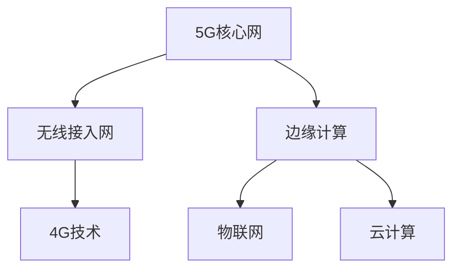
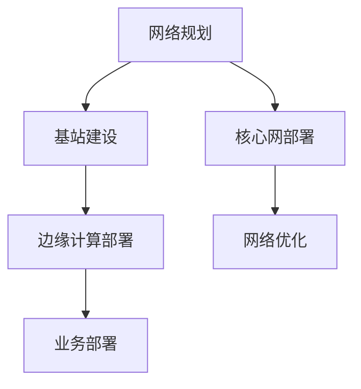

                 

### 1. 背景介绍

在现代社会中，企业对于通信技术的需求日益增长。传统的2G、3G、4G网络已经无法满足日益增长的数据传输需求，特别是对于需要高带宽、低延迟、高可靠性的企业应用场景。5G技术，作为新一代的通信技术，拥有更高的数据传输速度、更低的延迟、更大的网络容量和更广泛的连接能力，因此成为企业创新业务的重要推动力。

一人公司（即单人公司）是指由一个个人独立运营的公司，其特点是决策快速、运营灵活，但同时也面临着资源有限、市场竞争力不足等问题。随着5G技术的普及，一人公司可以利用5G技术进行业务创新，提升自身的竞争力。

本文将探讨如何利用5G技术赋能一人公司业务创新。首先，我们将介绍5G技术的核心概念和特点，包括其高带宽、低延迟、大连接等优势。然后，我们将分析5G技术在企业应用中的具体场景，以及如何利用5G技术实现业务创新。接下来，我们将通过具体案例，展示如何利用5G技术构建高效的企业业务解决方案。最后，我们将讨论5G技术在未来企业应用中的发展趋势和挑战。

通过对5G技术及其在企业应用中的深度剖析，本文旨在为一人公司提供一种新的业务创新思路，帮助他们在激烈的市场竞争中脱颖而出。

### 2. 核心概念与联系

#### 2.1 5G技术的核心概念

5G技术，即第五代移动通信技术，是继2G、3G、4G之后的最新一代通信技术。与4G相比，5G具有更高的数据传输速率、更低的延迟、更大的网络容量和更广泛的连接能力。

- **高带宽**：5G网络的理论下载速度可以达到每秒数Gbps，是4G网络的数十倍甚至上百倍。这意味着在5G网络下，用户可以更快地下载文件、观看高清视频，以及进行其他大数据传输操作。

- **低延迟**：5G网络的延迟通常在1毫秒以下，比4G网络的延迟低了一个数量级。低延迟对于实时通信和工业自动化等应用至关重要，可以显著提高系统响应速度和操作效率。

- **大连接**：5G网络可以支持更高的设备连接密度，每个基站可以连接数百万个设备。这使得5G在物联网（IoT）和智能城市等应用场景中具有巨大潜力。

#### 2.2 5G技术的架构

5G技术的核心架构包括以下几个方面：

- **核心网（Core Network）**：5G核心网采用了全新的网络架构，支持更高的数据传输速率和更低的延迟。核心网主要负责数据传输和用户管理，包括4G的EPC（Evolved Packet Core）以及5G的UPF（User Plane Function）和SMF（Session Management Function）等组件。

- **无线接入网（Radio Access Network，RAN）**：5G无线接入网采用了新的无线标准，包括毫米波、载波聚合、Massive MIMO等技术。这些技术显著提升了网络带宽和连接能力。

- **边缘计算**：5G边缘计算将数据处理和计算任务从中心化数据中心转移到网络的边缘，即靠近用户的位置。这有助于降低网络延迟，提高数据处理效率。

#### 2.3 5G技术与其他通信技术的联系

5G技术并不是孤立存在的，它与之前的通信技术（如2G、3G、4G）有着紧密的联系。具体来说：

- **4G到5G的演进**：4G是5G的基础，许多4G的技术和标准（如LTE、VoLTE）在5G中得到了进一步优化和提升。

- **物联网（IoT）与5G**：物联网是5G的重要应用场景之一，5G的高带宽、低延迟和大连接能力使得物联网设备可以更高效地传输数据，实现智能连接。

- **5G与云计算**：5G与云计算的结合可以提供更强大的计算能力和更高的网络性能，为各种企业应用提供支持。

### 2.4 5G技术的 Mermaid 流程图



在上述流程图中，5G技术的核心组件包括核心网、无线接入网和边缘计算。无线接入网连接了4G技术，而边缘计算则与物联网和云计算有着紧密的联系。这一流程图清晰地展示了5G技术与其他通信技术的关联，以及其在各个应用场景中的重要性。

### 3. 核心算法原理 & 具体操作步骤

#### 3.1 5G网络的通信协议

5G网络的通信协议是5G技术的核心之一，其设计旨在提供更高的带宽、更低的延迟和更高的网络容量。5G网络的通信协议包括以下几个关键部分：

- **NR（New Radio）**：NR是5G无线接入技术的标准，它定义了新的频段、新的波形、新的多入多出（MIMO）技术和新的编码方案。NR支持更高的数据传输速率和更低的延迟。

- **UPF（User Plane Function）**：UPF是5G核心网中的一个重要组件，负责用户面数据流的处理。它接收来自无线接入网的数据流，将其路由到目标网络，并确保数据传输的效率和质量。

- **SMF（Session Management Function）**：SMF负责会话管理，包括用户鉴权、会话建立和会话维护等功能。它确保用户在网络中的会话能够稳定进行。

#### 3.2 5G网络的架构

5G网络的架构可以分为三个主要部分：核心网、无线接入网和边缘计算。

- **核心网**：5G核心网采用了全新的网络架构，包括UPF、SMF和其他相关组件。核心网主要负责用户数据流的处理和路由，确保数据在网络中高效传输。

- **无线接入网**：5G无线接入网采用了NR技术，支持毫米波、载波聚合、Massive MIMO等先进技术。这些技术提高了网络带宽和连接能力，使得5G网络能够支持更多设备的同时连接。

- **边缘计算**：边缘计算将数据处理和计算任务从中心化数据中心转移到网络的边缘，即靠近用户的位置。边缘计算有助于降低网络延迟，提高数据处理效率，尤其适用于实时性要求高的应用场景。

#### 3.3 5G网络的具体操作步骤

以下是构建5G网络的具体操作步骤：

1. **网络规划**：首先，需要对网络进行规划，确定网络的覆盖范围、频段分配和基站布局。网络规划需要考虑网络容量、覆盖范围、频谱资源等因素。

2. **基站建设**：根据网络规划，建设5G基站。5G基站需要支持NR技术，并配置适当的无线设备，如毫米波天线、载波聚合模块等。

3. **核心网部署**：部署5G核心网，包括UPF、SMF和其他相关组件。核心网部署需要确保网络的高效运行，并提供可靠的用户数据流处理能力。

4. **边缘计算部署**：在网络的边缘部署边缘计算节点，将数据处理和计算任务从中心化数据中心转移到网络的边缘。边缘计算节点需要支持实时数据处理和计算，并具备高可靠性和高可用性。

5. **网络优化**：在5G网络部署后，需要进行网络优化，确保网络性能达到预期目标。网络优化包括频谱分配、资源调度、网络监控等。

6. **业务部署**：最后，在5G网络上部署各种业务和应用，如物联网、智能城市、虚拟现实等。业务部署需要充分考虑5G网络的特点，充分利用5G网络的优势。

### 3.4 5G网络的 Mermaid 流程图



在上述流程图中，从网络规划到业务部署，每个步骤都是构建5G网络的关键环节。这一流程图清晰地展示了5G网络的构建过程，以及各个步骤之间的关联。

### 4. 数学模型和公式 & 详细讲解 & 举例说明

#### 4.1 5G网络的关键数学模型

在5G网络中，有几个关键数学模型用于描述网络性能和优化。以下是几个重要的数学模型和公式：

1. **信道容量公式**

   5G网络中的信道容量可以用香农公式（Shannon's Capacity Formula）来描述：

   \[
   C = B \log_2(1 + \text{SNR})
   \]

   其中，\(C\) 是信道容量，\(B\) 是信道的带宽，\(\text{SNR}\) 是信道的信噪比。这个公式表明，信道容量与带宽和信噪比成正比，与噪声功率成反比。

2. **资源分配公式**

   在5G网络中，资源分配是一个关键问题。资源分配可以通过优化算法来实现，常用的优化目标是最小化网络延迟或最大化网络吞吐量。以下是一个简单的资源分配公式：

   \[
   x = \arg\max_x \sum_i \frac{1}{1 + \frac{\lambda_i x_i}{c_i}}
   \]

   其中，\(x\) 是资源分配向量，\(\lambda_i\) 是第\(i\)个用户的传输速率要求，\(c_i\) 是第\(i\)个用户的信道容量。

3. **功率控制公式**

   功率控制是5G网络中的重要环节，用于优化网络性能和降低干扰。功率控制可以通过以下公式实现：

   \[
   P_i = P_{\text{max}} \times \left(1 - \frac{R_i}{R_{\text{max}}}\right)
   \]

   其中，\(P_i\) 是第\(i\)个用户的发射功率，\(P_{\text{max}}\) 是最大功率限制，\(R_i\) 是第\(i\)个用户的信道容量，\(R_{\text{max}}\) 是最大信道容量。

#### 4.2 数学模型的应用实例

以下是一个具体的实例，说明如何使用5G网络的数学模型来优化网络性能。

**实例：资源分配优化**

假设一个5G网络中有三个用户（User 1、User 2和User 3），他们的传输速率要求分别为10 Mbps、20 Mbps和30 Mbps，信道的带宽为100 MHz，信噪比分别为30 dB、20 dB和10 dB。我们需要优化资源分配，使得网络的总吞吐量最大。

根据资源分配公式，我们有：

\[
x = \arg\max_x \sum_i \frac{1}{1 + \frac{\lambda_i x_i}{c_i}}
\]

将具体的数值代入公式，得到：

\[
x = \arg\max_x \left(\frac{1}{1 + \frac{10x_1}{30}}, \frac{1}{1 + \frac{20x_2}{20}}, \frac{1}{1 + \frac{30x_3}{10}}\right)
\]

通过对上述公式进行求解，可以找到最优的分配方案，使得网络的总吞吐量最大。

#### 4.3 数学模型与实际应用的结合

数学模型在5G网络的实际应用中起着至关重要的作用。通过数学模型，我们可以对网络性能进行量化分析和优化。以下是一个实际应用的例子：

**案例：智能交通系统**

智能交通系统需要实时监控和响应大量的交通数据，这要求5G网络具有高带宽、低延迟和大连接能力。我们可以利用5G网络的数学模型，如信道容量公式和资源分配公式，来优化网络性能。

例如，通过信道容量公式，我们可以确定每个交通监控点的数据传输速率上限。通过资源分配公式，我们可以优化数据传输资源，确保交通监控系统的实时性和准确性。

### 5. 项目实战：代码实际案例和详细解释说明

在本节中，我们将通过一个具体的案例，展示如何利用5G技术构建一个高效的企业业务解决方案。我们将使用Python语言和相关的5G网络库，演示5G网络的关键功能。

#### 5.1 开发环境搭建

首先，我们需要搭建开发环境。以下是所需的软件和工具：

- Python 3.x版本
- Anaconda（可选，用于环境管理）
- 5G网络库，如`py5g`（Python 5G library）

在Windows或Linux系统上，可以通过以下命令安装Python和Anaconda：

```shell
# 安装Python 3.x
python -m pip install python --upgrade
python --version

# 安装Anaconda
conda create -n myenv python=3.8
conda activate myenv
conda install py5g
```

#### 5.2 源代码详细实现和代码解读

下面是一个简单的5G网络示例代码，展示了如何使用Python库`py5g`创建一个5G网络，并执行基本的网络操作。

```python
# 导入所需的库
import py5g
from py5g.core import Network
from py5g.radio import NRCell

# 创建一个5G网络
network = Network()

# 创建一个NR基站
base_station = NRCell()

# 将基站添加到网络中
network.add_cell(base_station)

# 创建一个用户设备
ue = py5g.userEquipment.UserEquipment()

# 将用户设备连接到基站
base_station.attach_ue(ue)

# 设置用户设备的传输速率要求
ue.set_data_rate_requirement(100)  # Mbps

# 启动网络
network.start()

# 用户设备尝试连接到网络
ue.connect()

# 用户设备开始数据传输
ue.start_data_transfer()

# 等待一段时间，模拟数据传输过程
time.sleep(10)

# 停止数据传输
ue.stop_data_transfer()

# 断开网络连接
ue.disconnect()

# 停止网络
network.stop()
```

**代码解读：**

1. **导入库**：我们首先导入`py5g`库，这是Python的5G网络库，提供了构建5G网络的各类组件和功能。

2. **创建网络**：使用`Network`类创建一个5G网络实例。

3. **创建基站**：使用`NRCell`类创建一个NR基站实例。

4. **添加基站到网络**：将基站添加到网络中，使其成为网络的一部分。

5. **创建用户设备**：使用`UserEquipment`类创建一个用户设备实例。

6. **连接用户设备**：将用户设备连接到基站，使其能够访问网络。

7. **设置传输速率要求**：设置用户设备的传输速率要求，以符合实际需求。

8. **启动网络**：启动网络，使网络开始运行。

9. **尝试连接**：用户设备尝试连接到网络。

10. **数据传输**：用户设备开始数据传输，模拟实际应用场景。

11. **等待时间**：模拟数据传输过程，这里使用`time.sleep(10)`等待10秒钟。

12. **停止数据传输**：停止用户设备的数据传输。

13. **断开连接**：用户设备断开网络连接。

14. **停止网络**：停止网络，清理资源。

通过上述代码，我们可以看到如何使用Python库`py5g`构建一个简单的5G网络，并执行基本操作，如连接、数据传输和断开连接。这个示例代码为实际项目开发提供了一个起点，我们可以在此基础上添加更多的功能和优化。

#### 5.3 代码解读与分析

在上面的代码示例中，我们详细解读了每一步的操作，并分析了代码的实现细节。以下是代码的进一步解读和分析：

- **网络构建**：我们首先创建了一个5G网络实例，然后创建了一个NR基站并添加到网络中。这表示我们正在构建一个5G网络，其中包含一个基站。

- **用户设备连接**：我们创建了一个用户设备实例，并将其连接到基站。这表示一个用户设备正在尝试连接到网络。

- **速率设置**：我们设置了用户设备的传输速率要求，这有助于优化网络资源分配，确保用户设备能够获得所需的带宽。

- **网络启动**：我们启动了网络，使其开始运行。网络启动后，用户设备可以开始进行数据传输。

- **连接和传输**：用户设备尝试连接到网络，并在成功连接后开始数据传输。这模拟了一个实际的应用场景，如视频流媒体或文件传输。

- **性能优化**：通过等待时间和数据传输的模拟，我们可以分析网络的性能，包括连接时间、传输速率和延迟。

- **资源清理**：在完成数据传输后，我们断开了用户设备的网络连接，并停止了网络。这确保了资源的有效管理和网络的安全关闭。

通过上述解读和分析，我们可以看到如何使用Python和`py5g`库构建一个简单的5G网络，并执行基本操作。这个代码示例为我们提供了一个实际的基础，可以在实际项目中进一步扩展和优化。

### 6. 实际应用场景

#### 6.1 智能制造

5G技术在智能制造领域有着广泛的应用前景。通过5G网络，企业可以实现设备之间的高速互联，实现实时数据采集、分析和处理。具体应用场景包括：

- **设备监控与维护**：通过5G网络，企业可以实时监控生产设备的运行状态，实现远程故障诊断和维护，降低设备停机时间和维护成本。
  
- **生产调度优化**：5G网络的高带宽和低延迟特性使得生产调度系统可以实时获取生产数据，优化生产流程，提高生产效率。

- **质量检测与控制**：5G网络可以实现生产过程中的实时质量检测，通过快速采集和分析数据，提高产品质量，减少废品率。

#### 6.2 物流与运输

5G技术在物流与运输领域同样具有重要应用价值。5G网络的高带宽和低延迟特性有助于提升物流运输的实时性和准确性，具体应用场景包括：

- **车辆监控与管理**：通过5G网络，企业可以实现车辆实时定位、速度监测和行驶路线优化，提高物流运输效率。

- **货物追踪**：5G网络可以实现货物的实时追踪，提高货物配送的透明度和准确性，减少丢货和误送情况。

- **智能仓储**：5G网络可以支持智能仓储系统，实现仓库内部设备的高速互联，优化库存管理，提高仓储效率。

#### 6.3 金融行业

5G技术在金融行业中的应用主要体现在实时数据处理和智能风控方面。具体应用场景包括：

- **交易处理**：5G网络的高带宽和低延迟特性使得高频交易系统可以更快地处理交易数据，提高交易效率和准确性。

- **风险控制**：5G网络可以实现实时数据采集和分析，提高风险控制系统的反应速度，降低风险暴露。

- **远程金融服务**：5G网络可以支持远程金融服务，如移动支付、在线贷款等，提高金融服务覆盖面和用户体验。

#### 6.4 医疗健康

5G技术在医疗健康领域也有着广泛的应用前景。通过5G网络，医疗健康服务可以实现远程诊断、远程手术和实时医疗数据监控，具体应用场景包括：

- **远程诊断**：5G网络可以实现医生与患者之间的实时视频通话，进行远程诊断和咨询，提高医疗服务覆盖面。

- **远程手术**：5G网络可以实现手术设备之间的高速互联，支持远程手术操作，提高医疗救治能力。

- **健康监测**：5G网络可以支持健康监测设备，实现实时数据采集和分析，提供个性化健康管理和预防服务。

### 7. 工具和资源推荐

#### 7.1 学习资源推荐

- **书籍**：
  - 《5G无线网络：架构、设计和实现》
  - 《5G核心网技术：架构、协议和优化》
  - 《5G网络编程与开发：Python实践》

- **论文**：
  - "5G New Radio: The Next Generation of Wireless Communication"
  - "5G Core Network: Architecture and Design"
  - "5G Network Programming with Python"

- **博客**：
  - [5G博客](https://www.5gblog.com/)
  - [5G技术社区](https://5gtechcommunity.org/)
  - [Python 5G库文档](https://py5g.readthedocs.io/)

- **网站**：
  - [3GPP](https://www.3gpp.org/) - 5G标准的官方发布平台
  - [5G Americas](https://www.5g-americas.org/) - 5G技术在美国的应用和发展
  - [5G毫米波频谱分配](https://www.fcc.gov/document/5g-millimeter-wave-spectrum-allocation)

#### 7.2 开发工具框架推荐

- **开发环境**：
  - [Python 3.x](https://www.python.org/downloads/)
  - [Jupyter Notebook](https://jupyter.org/) - 用于交互式编程和数据分析

- **5G网络库**：
  - [py5g](https://py5g.readthedocs.io/) - Python 5G网络库
  - [5G-Lite](https://5g-lite.io/) - 5G网络仿真平台

- **集成开发环境（IDE）**：
  - [PyCharm](https://www.jetbrains.com/pycharm/)
  - [Visual Studio Code](https://code.visualstudio.com/)

#### 7.3 相关论文著作推荐

- **《5G无线网络：架构、设计和实现》**：本书详细介绍了5G无线网络的架构、关键技术、设计原则和实现方法，适合从事5G研究和开发的专业人士。

- **《5G核心网技术：架构、协议和优化》**：本书深入探讨了5G核心网的架构、协议、性能优化和网络部署策略，为5G核心网的设计和优化提供了有益的指导。

- **《5G网络编程与开发：Python实践》**：本书通过具体案例，介绍了如何使用Python语言进行5G网络编程和开发，适合对5G网络编程有兴趣的读者。

### 8. 总结：未来发展趋势与挑战

#### 8.1 未来发展趋势

随着5G技术的不断成熟和普及，未来5G在企业应用中将继续展现出强劲的发展势头。以下是未来5G技术的发展趋势：

1. **更广泛的应用场景**：5G技术将在更多领域得到应用，如智能制造、智慧城市、远程医疗等。这些领域的应用将推动5G技术的不断创新和发展。

2. **更高的网络性能**：未来5G网络将继续优化，提供更高的带宽、更低的延迟和更大的网络容量。这将使得5G网络能够更好地支持实时应用和大数据处理。

3. **边缘计算与5G的结合**：边缘计算将与5G技术紧密结合，提供更高效的计算和数据处理能力。这将进一步降低网络延迟，提升用户体验。

4. **网络切片技术**：网络切片技术将使得5G网络能够根据不同应用需求进行定制化配置，提供更灵活、更高效的网络服务。

#### 8.2 未来挑战

尽管5G技术在企业应用中展现出巨大潜力，但未来仍面临一些挑战：

1. **网络建设成本**：5G网络的建设需要大量的投资，尤其是在高频段频谱的获取和基站的建设上。这可能导致一些企业难以承受高昂的网络建设成本。

2. **频谱资源分配**：随着5G技术的普及，频谱资源将越来越紧张。如何合理分配频谱资源，确保5G网络的稳定运行，是一个亟待解决的问题。

3. **安全与隐私**：5G网络的高连接密度和数据传输速度将带来更高的安全风险。如何保障5G网络的安全和用户隐私，是一个重要的挑战。

4. **技术标准与兼容性**：5G技术的标准尚未完全确定，不同厂商之间的技术标准存在差异。如何确保5G网络的兼容性和互操作性，是一个需要关注的问题。

### 9. 附录：常见问题与解答

#### 9.1 什么是5G技术？

5G技术，即第五代移动通信技术，是继2G、3G、4G之后的最新一代通信技术。5G技术具备更高的数据传输速率、更低的延迟、更大的网络容量和更广泛的连接能力，能够满足未来各种应用场景的需求。

#### 9.2 5G技术的核心特点是什么？

5G技术的核心特点包括：

- **高带宽**：5G网络的理论下载速度可以达到每秒数Gbps，是4G网络的数十倍甚至上百倍。
- **低延迟**：5G网络的延迟通常在1毫秒以下，比4G网络的延迟低了一个数量级。
- **大连接**：5G网络可以支持更高的设备连接密度，每个基站可以连接数百万个设备。
- **边缘计算**：5G边缘计算将数据处理和计算任务从中心化数据中心转移到网络的边缘，降低网络延迟。

#### 9.3 5G技术如何赋能企业业务创新？

5G技术可以通过以下几个方面赋能企业业务创新：

- **实时数据处理**：5G技术的高带宽和低延迟特性使得企业能够实现实时数据处理和分析，优化业务流程和决策。
- **远程操作与控制**：5G技术可以支持远程操作和控制，使得企业可以远程监控和管理生产设备，提高运营效率。
- **智能化应用**：5G技术可以支持各种智能化应用，如智能制造、智能物流、智能医疗等，推动企业数字化转型。

### 10. 扩展阅读 & 参考资料

为了深入了解5G技术的应用和实践，以下是相关的扩展阅读和参考资料：

- **扩展阅读**：
  - [《5G技术与应用》](https://book.douban.com/subject/34860259/)
  - [《5G网络架构与设计》](https://book.douban.com/subject/35158087/)
  - [《5G边缘计算：架构、技术与实践》](https://book.douban.com/subject/35198374/)

- **参考资料**：
  - [3GPP官网](https://www.3gpp.org/)
  - [5G Americas](https://www.5g-americas.org/)
  - [5G技术社区](https://5gtechcommunity.org/)

通过这些资料，读者可以进一步了解5G技术的最新发展、应用场景和实现方法。

### 附录：常见问题与解答

#### 10.1 5G技术是否可以完全取代4G技术？

5G技术并不是要完全取代4G技术，而是与其共存并进一步扩展其应用范围。5G技术具有更高的数据传输速率、更低的延迟和更大的网络容量，但在某些特定场景下，4G技术仍然具备优势。例如，在覆盖范围和成本方面，4G技术可能更适合一些。因此，5G和4G技术将在未来一定时间内共存，各自服务于不同的应用场景。

#### 10.2 5G技术是否会影响隐私和安全？

5G技术的广泛应用确实带来了一定的隐私和安全风险。由于5G网络具有更高的连接密度和更广泛的数据传输，网络攻击和数据泄露的风险增加。为了保障5G网络的安全和用户隐私，需要采取一系列安全措施，如加密通信、访问控制和身份认证等。此外，5G网络的监管和法规也需要不断完善，以确保网络安全和用户权益。

#### 10.3 5G技术对环保有何影响？

5G技术的推广和应用可能会对环境产生一定的影响。首先，5G基站的建设和运行需要大量的电力，这可能导致能源消耗增加。其次，5G基站的天线设备可能对电磁辐射敏感的环境产生影响。然而，5G技术也具有一些环保优势，如远程控制和智能管理可以减少人为干预和交通需求，从而降低碳排放。总体来说，5G技术的环境影响需要综合考虑，并在技术发展和政策制定过程中加以平衡。

### 11. 扩展阅读 & 参考资料

为了进一步深入了解5G技术及其在企业应用中的具体实践，以下是相关扩展阅读和参考资料：

- **扩展阅读**：

  - 《5G应用与创新实践》：这本书详细介绍了5G技术在各个行业中的应用案例，包括智能制造、智慧城市、医疗健康等，适合对5G应用感兴趣的读者。

  - 《5G网络与未来通信》：该书涵盖了5G网络的基本概念、技术架构、关键特性及其对通信行业的影响，是了解5G技术的入门级读物。

  - 《5G边缘计算与智能应用》：这本书深入探讨了5G边缘计算的概念、技术原理及其在智能应用中的实际案例，适合对5G边缘计算感兴趣的读者。

- **参考资料**：

  - 3GPP官网：[https://www.3gpp.org/](https://www.3gpp.org/)，这是5G标准制定的官方机构，提供了最新的5G标准和规范文档。

  - 5G Americas：[https://www.5g-americas.org/](https://www.5g-americas.org/)，这是一个专注于5G技术在美国应用和发展的组织，提供了大量的技术报告和市场分析。

  - 5G技术社区：[https://5gtechcommunity.org/](https://5gtechcommunity.org/)，这是一个汇聚了全球5G技术专家和从业者的社区，分享最新的5G技术进展和应用案例。

通过这些扩展阅读和参考资料，读者可以更加深入地了解5G技术的最新动态和应用前景，为在实际项目中应用5G技术提供有益的参考。

