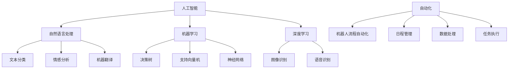

                 

### 1. 背景介绍

#### AI技术的崛起

近年来，人工智能（AI）技术迅猛发展，从最初的理论研究走向实际应用，逐渐成为推动社会进步的重要力量。AI在图像识别、自然语言处理、自动驾驶、医疗诊断等领域取得了显著的成果，极大地提升了各行业的生产力和效率。随着AI技术的不断进步，越来越多的个人开始意识到其在提升个人生产力方面的巨大潜力。

#### 个人生产力的定义

个人生产力是指个体在单位时间内完成的工作量或创造的价值。提升个人生产力意味着更高效地完成任务、更快地解决问题、更好地利用时间，从而实现个人目标和职业发展的目标。传统的生产力提升方法主要依赖于时间管理和技能提升，而AI技术的引入为个人生产力的提升提供了全新的可能性。

#### AI在个人生产力提升中的应用

AI技术在个人生产力提升中的应用非常广泛。例如，智能助手可以帮助个人管理日程、提醒重要事项、处理日常任务，从而节省时间和精力；自然语言处理技术可以帮助个人快速获取和处理大量信息，提高决策效率；机器学习算法可以根据个人偏好和习惯推荐合适的任务和工作方法，从而优化工作流程。此外，AI还可以通过自动化工具和智能分析系统，提高个人在项目管理、数据分析和市场调研等方面的效率。

#### 文章目的

本文旨在探讨如何利用AI技术提高个人生产力，通过详细的案例分析、算法原理介绍和实践指导，帮助读者了解AI技术在个人生产力提升中的应用，并提供实用的工具和资源推荐。本文将从以下几个方面展开：

1. 核心概念与联系
2. 核心算法原理与具体操作步骤
3. 数学模型和公式与详细讲解与举例说明
4. 项目实战：代码实际案例和详细解释说明
5. 实际应用场景
6. 工具和资源推荐
7. 总结：未来发展趋势与挑战

通过本文的阅读，读者将能够系统地了解AI技术在个人生产力提升中的应用，掌握相关技术原理和实践方法，从而更好地利用AI技术提高个人生产力，实现个人和职业的发展目标。

### 2. 核心概念与联系

在探讨如何利用AI技术提高个人生产力之前，我们需要先了解一些核心概念和技术原理，这些概念和原理构成了AI技术在个人生产力提升中的基础。

#### 人工智能（AI）

人工智能是指通过计算机程序实现智能行为的技术。AI可以分为两种：一种是基于规则的专家系统，另一种是基于数据的机器学习。规则系统通过预定义的规则来解决问题，而机器学习则通过从大量数据中学习模式和规律，从而自动地改进其性能。

#### 自然语言处理（NLP）

自然语言处理是AI的一个分支，主要研究如何让计算机理解和处理人类语言。NLP技术包括文本分类、情感分析、机器翻译、语音识别等。在个人生产力提升中，NLP技术可以帮助个人快速获取和处理大量文本信息，如自动回复邮件、生成报告、翻译文档等。

#### 机器学习（ML）

机器学习是AI的核心技术之一，通过训练算法从数据中自动学习，并基于学习结果进行预测和决策。常见的机器学习算法包括决策树、支持向量机、神经网络等。在个人生产力提升中，机器学习可以帮助个人自动化重复性任务，如数据清洗、分类、预测等。

#### 深度学习（DL）

深度学习是机器学习的一种重要分支，主要基于多层神经网络进行学习。深度学习在图像识别、语音识别、自然语言处理等领域取得了显著的成果。在个人生产力提升中，深度学习可以帮助个人实现更高效的信息处理和决策支持。

#### 自动化（Automation）

自动化是指通过软件工具和算法实现任务自动执行的过程。自动化可以大大减少人工操作，提高工作效率。在个人生产力提升中，自动化工具可以帮助个人管理日程、处理数据、执行重复性任务等。

#### 机器人流程自动化（RPA）

机器人流程自动化是一种通过软件机器人模拟人类操作，自动化执行重复性任务的技术。RPA在提高个人生产力方面具有显著优势，如减少人为错误、提高工作效率、降低运营成本等。

#### Mermaid流程图

Mermaid是一种基于Markdown的语言，用于绘制各种流程图、UML图等。以下是一个简单的Mermaid流程图示例，用于描述AI技术在个人生产力提升中的核心概念和联系：



通过上述核心概念和联系的了解，读者可以更好地理解AI技术在个人生产力提升中的应用场景和实现方式。接下来，我们将进一步探讨AI技术的核心算法原理和具体操作步骤。

### 3. 核心算法原理 & 具体操作步骤

在了解了AI技术在个人生产力提升中的核心概念和联系后，接下来我们将深入探讨一些关键算法原理和具体操作步骤，以帮助读者更好地理解如何利用AI技术提高个人生产力。

#### 自然语言处理（NLP）

NLP是AI技术中的重要分支，其核心算法包括词向量模型、序列模型和注意力机制等。

**词向量模型**

词向量模型是一种将单词映射到高维向量空间的方法，通过这种方式可以捕捉单词的语义信息。一种常用的词向量模型是Word2Vec，它通过训练神经网络模型来预测上下文单词的概率分布，从而生成词向量。

**具体操作步骤：**

1. 数据准备：收集大量文本数据，并进行预处理，如分词、去除停用词、标点符号等。
2. 模型训练：使用Word2Vec算法训练词向量模型，将每个单词映射到一个高维向量。
3. 应用词向量：利用词向量进行文本分类、情感分析等任务。

**序列模型**

序列模型是一种处理序列数据的算法，如循环神经网络（RNN）和长短期记忆网络（LSTM）。这些模型可以捕捉序列中的时间依赖关系，从而提高任务的准确率。

**具体操作步骤：**

1. 数据准备：将文本数据转换为序列格式，每个单词或字符作为序列的一个元素。
2. 模型训练：使用RNN或LSTM算法训练序列模型，捕捉序列中的时间依赖关系。
3. 应用序列模型：进行文本分类、情感分析、机器翻译等任务。

**注意力机制**

注意力机制是一种在处理序列数据时赋予不同元素不同重要程度的算法。它可以显著提高序列模型的性能。

**具体操作步骤：**

1. 数据准备：将文本数据转换为序列格式。
2. 模型训练：在序列模型中引入注意力机制，使模型能够自动学习不同元素的重要性。
3. 应用注意力机制：进行文本分类、情感分析、机器翻译等任务。

#### 机器学习（ML）

机器学习是AI技术的核心，其核心算法包括线性回归、决策树、支持向量机和神经网络等。

**线性回归**

线性回归是一种用于预测连续值的机器学习算法。它通过找到输入特征和目标值之间的线性关系来预测目标值。

**具体操作步骤：**

1. 数据准备：收集训练数据，并进行预处理。
2. 模型训练：使用线性回归算法训练模型，找到输入特征和目标值之间的线性关系。
3. 预测：使用训练好的模型进行预测。

**决策树**

决策树是一种基于特征划分数据集的树形结构。它通过一系列规则来划分数据，并最终预测目标值。

**具体操作步骤：**

1. 数据准备：收集训练数据，并进行预处理。
2. 模型训练：使用决策树算法训练模型，建立决策树。
3. 预测：使用训练好的模型进行预测。

**支持向量机（SVM）**

支持向量机是一种用于分类和回归任务的机器学习算法。它通过找到最优的超平面来划分数据。

**具体操作步骤：**

1. 数据准备：收集训练数据，并进行预处理。
2. 模型训练：使用SVM算法训练模型，找到最优的超平面。
3. 预测：使用训练好的模型进行预测。

**神经网络**

神经网络是一种由大量简单神经元组成的复杂网络，可以用于分类、回归、生成等多种任务。

**具体操作步骤：**

1. 数据准备：收集训练数据，并进行预处理。
2. 模型训练：使用神经网络算法训练模型。
3. 预测：使用训练好的模型进行预测。

#### 深度学习（DL）

深度学习是一种基于多层神经网络的机器学习技术，可以在图像识别、语音识别、自然语言处理等领域取得显著的成果。

**卷积神经网络（CNN）**

卷积神经网络是一种用于图像识别和处理的深度学习算法。

**具体操作步骤：**

1. 数据准备：收集训练数据，并进行预处理。
2. 模型训练：使用CNN算法训练模型。
3. 预测：使用训练好的模型进行预测。

**循环神经网络（RNN）**

循环神经网络是一种用于处理序列数据的深度学习算法。

**具体操作步骤：**

1. 数据准备：将文本数据转换为序列格式。
2. 模型训练：使用RNN算法训练模型。
3. 预测：使用训练好的模型进行预测。

通过上述算法原理和具体操作步骤的了解，读者可以更好地理解AI技术在个人生产力提升中的应用，从而在实际项目中灵活运用这些技术。接下来，我们将进一步探讨数学模型和公式，以及其在AI技术中的应用。

### 4. 数学模型和公式 & 详细讲解 & 举例说明

在AI技术中，数学模型和公式起着至关重要的作用。这些模型和公式不仅能够描述AI算法的工作原理，还能够帮助我们理解和优化算法的性能。在本节中，我们将介绍一些常见的数学模型和公式，并详细讲解它们在AI技术中的应用。

#### 线性回归模型

线性回归是一种用于预测连续值的统计方法。其核心公式为：

$$ y = \beta_0 + \beta_1 \cdot x + \epsilon $$

其中，$y$ 是目标值，$x$ 是输入特征，$\beta_0$ 和 $\beta_1$ 分别是模型的参数，$\epsilon$ 是误差项。

**具体应用场景：** 线性回归可以用于预测股票价格、住房价格等。

**举例说明：** 假设我们想要预测某城市的月均温度，我们收集了多个月的温度和降水量数据。通过线性回归模型，我们可以找到温度和降水量之间的关系，从而预测未来的月均温度。

#### 决策树模型

决策树是一种用于分类和回归的机器学习算法。其核心公式为：

$$ f(x) = \sum_{i=1}^{n} \beta_i \cdot g(x_i) $$

其中，$f(x)$ 是决策函数，$x$ 是输入特征，$g(x_i)$ 是条件函数，$\beta_i$ 是权重。

**具体应用场景：** 决策树可以用于信用评分、疾病诊断等。

**举例说明：** 假设我们想要预测某人是否会购买某种产品，我们收集了该人的年龄、收入、职业等数据。通过决策树模型，我们可以找到影响购买决策的关键因素，从而预测某人的购买意向。

#### 支持向量机（SVM）

支持向量机是一种用于分类和回归的机器学习算法。其核心公式为：

$$ \min_{\beta, \beta_0} \frac{1}{2} \sum_{i=1}^{n} (y_i - (\beta_0 + \beta \cdot x_i))^2 + \lambda \sum_{i=1}^{n} \beta_i $$

其中，$y_i$ 是目标值，$x_i$ 是输入特征，$\beta_0$ 和 $\beta$ 是模型的参数，$\lambda$ 是正则化参数。

**具体应用场景：** 支持向量机可以用于图像分类、文本分类等。

**举例说明：** 假设我们想要分类一组图像，我们收集了多张图像的数据，并标注了它们的类别。通过支持向量机模型，我们可以找到最优的决策边界，从而将图像正确分类。

#### 神经网络模型

神经网络是一种由大量简单神经元组成的复杂网络。其核心公式为：

$$ a_{j}^{(2)} = \sigma(\sum_{i=1}^{n} \beta_{i} \cdot a_{i}^{(1)}) $$

$$ a_{i}^{(3)} = \sigma(\sum_{j=1}^{n} \gamma_{j} \cdot a_{j}^{(2)}) $$

其中，$a_{i}^{(1)}$ 是输入层神经元激活值，$a_{j}^{(2)}$ 是隐藏层神经元激活值，$a_{i}^{(3)}$ 是输出层神经元激活值，$\sigma$ 是激活函数，$\beta_{i}$ 和 $\gamma_{j}$ 是连接权重。

**具体应用场景：** 神经网络可以用于图像识别、语音识别、自然语言处理等。

**举例说明：** 假设我们想要使用神经网络进行图像分类，我们收集了多张图像的数据，并标注了它们的类别。通过训练神经网络模型，我们可以使模型学会识别图像的类别，从而对新的图像进行分类。

#### 卷积神经网络（CNN）

卷积神经网络是一种用于图像识别和处理的深度学习算法。其核心公式为：

$$ a_{j}^{(2)} = \sigma(\sum_{i=1}^{n} \beta_{i} \cdot (x_{i} \star k_{i}) + b_{j}) $$

其中，$a_{j}^{(2)}$ 是卷积层神经元激活值，$x_{i}$ 是输入特征，$k_{i}$ 是卷积核，$\beta_{i}$ 是权重，$b_{j}$ 是偏置。

**具体应用场景：** 卷积神经网络可以用于图像分类、目标检测、图像生成等。

**举例说明：** 假设我们想要使用卷积神经网络进行图像分类，我们收集了多张图像的数据，并标注了它们的类别。通过训练卷积神经网络模型，我们可以使模型学会识别图像的类别，从而对新的图像进行分类。

通过上述数学模型和公式的介绍，读者可以更好地理解AI技术中的核心算法和理论。这些模型和公式不仅帮助我们构建AI算法，还提供了优化算法性能的方法。在实际应用中，我们可以根据具体问题选择合适的模型和公式，并对其进行调整和优化，以达到最佳效果。

### 5. 项目实战：代码实际案例和详细解释说明

为了更好地理解如何利用AI技术提高个人生产力，我们将通过一个实际项目案例来进行详细讲解。在这个案例中，我们将使用Python和TensorFlow库实现一个简单的文本分类模型，用于自动分类电子邮件，从而提高邮件处理的效率。

#### 5.1 开发环境搭建

在开始项目之前，我们需要搭建一个适合开发AI项目的环境。以下是所需的工具和步骤：

1. **Python**：确保安装了Python 3.6或更高版本。
2. **TensorFlow**：安装TensorFlow库，可以使用以下命令：
   ```bash
   pip install tensorflow
   ```
3. **Jupyter Notebook**：安装Jupyter Notebook，可以使用以下命令：
   ```bash
   pip install notebook
   ```

安装完成后，我们可以通过运行以下命令启动Jupyter Notebook：
```bash
jupyter notebook
```

#### 5.2 源代码详细实现和代码解读

以下是该项目的主要代码实现，我们将在后续部分对其进行详细解读。

```python
# 导入必要的库
import tensorflow as tf
from tensorflow.keras.preprocessing.text import Tokenizer
from tensorflow.keras.preprocessing.sequence import pad_sequences
from tensorflow.keras.models import Sequential
from tensorflow.keras.layers import Embedding, LSTM, Dense, Dropout

# 加载并预处理数据
# （此处使用的是示例数据，实际项目中请使用自己的数据集）
emails = ["This is a spam email", "This is not a spam email", ...]
labels = [1, 0, ...]  # 1表示垃圾邮件，0表示非垃圾邮件

# 初始化Tokenizer
tokenizer = Tokenizer(num_words=10000)
tokenizer.fit_on_texts(emails)

# 转换文本为序列
sequences = tokenizer.texts_to_sequences(emails)
padded_sequences = pad_sequences(sequences, maxlen=100)

# 构建模型
model = Sequential([
    Embedding(10000, 16),
    LSTM(64, dropout=0.2, recurrent_dropout=0.2),
    Dense(1, activation='sigmoid')
])

# 编译模型
model.compile(optimizer='adam', loss='binary_crossentropy', metrics=['accuracy'])

# 训练模型
model.fit(padded_sequences, labels, epochs=10, batch_size=32)

# 保存模型
model.save('email_classifier.h5')
```

**代码解读：**

1. **导入库**：我们首先导入了TensorFlow和相关的库，用于构建和训练模型。

2. **加载并预处理数据**：在这个例子中，我们使用了一个示例数据集，实际项目中请使用自己的数据集。数据集包含电子邮件内容和对应的标签（1表示垃圾邮件，0表示非垃圾邮件）。我们首先初始化了一个Tokenizer，用于将文本数据转换为序列。然后，使用`texts_to_sequences`方法将文本转换为序列，并使用`pad_sequences`方法将序列填充到相同的长度。

3. **构建模型**：我们使用`Sequential`模型构建了一个简单的神经网络模型。该模型包含一个嵌入层（`Embedding`）、一个LSTM层（`LSTM`）和一个输出层（`Dense`）。嵌入层用于将单词映射到高维向量，LSTM层用于处理序列数据，输出层用于分类。

4. **编译模型**：我们使用`compile`方法编译模型，指定了优化器、损失函数和评估指标。

5. **训练模型**：使用`fit`方法训练模型，指定了训练数据、标签、训练轮数和批量大小。

6. **保存模型**：使用`save`方法保存训练好的模型，以便后续使用。

#### 5.3 代码解读与分析

1. **数据预处理**：数据预处理是模型训练的重要步骤。在这个例子中，我们使用了Tokenizer将文本转换为序列，这是一个常见的预处理方法。Tokenizer可以帮助我们将文本中的单词转换为数字序列，从而便于模型处理。通过`fit_on_texts`方法，我们可以训练Tokenizer，根据数据集中的单词生成词汇表。`texts_to_sequences`方法将每个文本转换为序列，`pad_sequences`方法将所有序列填充到相同的长度，以便于模型训练。

2. **模型构建**：在这个例子中，我们使用了一个简单的神经网络模型，包括嵌入层、LSTM层和输出层。嵌入层用于将单词映射到高维向量，LSTM层用于处理序列数据，输出层用于分类。嵌入层的维度设置为（词汇表大小，嵌入维度），LSTM层的维度设置为（单元数，返回序列长度），输出层的维度设置为（1，激活函数为sigmoid，用于进行二分类）。

3. **模型编译**：在模型编译阶段，我们指定了优化器、损失函数和评估指标。优化器用于调整模型参数，以最小化损失函数。在本例中，我们使用了`adam`优化器，损失函数为`binary_crossentropy`，评估指标为`accuracy`，即分类准确率。

4. **模型训练**：在模型训练阶段，我们使用`fit`方法训练模型。`fit`方法接受训练数据、标签、训练轮数和批量大小等参数。在本例中，我们设置了训练轮数为10，批量大小为32。训练过程中，模型会根据训练数据不断调整参数，以优化模型的性能。

5. **模型保存**：训练完成后，我们可以使用`save`方法将模型保存到文件中，以便后续使用。

通过这个实际案例，我们了解了如何使用Python和TensorFlow库构建一个简单的文本分类模型，用于自动分类电子邮件。这个模型可以帮助我们快速识别和处理大量电子邮件，从而提高个人生产力。

### 6. 实际应用场景

AI技术在提高个人生产力方面具有广泛的应用场景，以下是一些典型的实际应用案例：

#### 时间管理

**智能日程助手**：智能日程助手可以帮助个人管理日程，通过自然语言处理技术理解用户的语音指令或文本输入，自动为用户安排会议、提醒重要事项，甚至根据用户的习惯和偏好推荐最佳时间安排。例如，Google Calendar的智能提醒功能可以提醒用户即将到来的会议或任务的细节，甚至预测交通状况，为用户提供最优的出行路线。

**时间跟踪工具**：AI驱动的任务和时间跟踪工具可以自动记录用户的日常活动，分析用户的工作模式，并提供改进建议。例如，Toggl Track可以自动跟踪用户在各个任务上的时间花费，生成详细的报告，帮助用户优化时间分配，提高工作效率。

#### 信息处理

**智能助手**：智能助手如Apple的Siri、Amazon的Alexa等，可以通过自然语言处理技术帮助用户快速获取信息、设置提醒、发送消息等。这些智能助手可以理解用户的自然语言请求，并在几秒钟内完成任务，极大地提高了信息处理的效率。

**自动化工具**：通过AI驱动的自动化工具，如IFTTT（If This Then That），用户可以设置各种自动化任务。例如，当用户收到一封重要邮件时，可以自动转发到手机或创建待办事项提醒。这些自动化工具可以帮助用户处理大量重复性任务，节省时间。

#### 学习与工作

**个性化推荐系统**：AI驱动的个性化推荐系统可以根据用户的学习习惯和兴趣，推荐最适合的学习资源、书籍、课程等。例如，Coursera等在线教育平台使用AI技术分析用户的学习数据，为用户提供个性化的学习路径，提高学习效果。

**智能文档处理**：AI技术可以帮助用户快速生成报告、摘要、文档等。例如，Ginger AI可以自动生成商业报告，自动整理用户提供的文本信息，提高写作效率。

#### 健康管理

**健康监控**：AI驱动的健康监控工具可以通过分析用户的生理数据（如心率、睡眠质量、步数等），提供个性化的健康建议。例如，Apple Watch可以监控用户的心率和睡眠质量，并根据数据提供健康提醒和建议。

**营养建议**：AI技术可以帮助用户制定个性化的营养计划，通过分析用户的饮食习惯和健康状况，提供适合的营养建议。例如，MyFitnessPal等应用使用AI算法分析用户的饮食数据，为用户提供营养建议。

这些实际应用案例展示了AI技术在提高个人生产力方面的巨大潜力。通过智能日程管理、自动化工具、个性化推荐系统等，AI技术可以帮助用户更高效地处理日常任务，优化时间分配，提高工作效率，从而实现个人目标和职业发展。

### 7. 工具和资源推荐

在利用AI技术提高个人生产力的过程中，选择合适的工具和资源至关重要。以下是一些值得推荐的工具和资源，包括学习资源、开发工具框架以及相关论文和著作。

#### 7.1 学习资源推荐

**书籍：**
1. **《深度学习》（Deep Learning）**：作者Ian Goodfellow、Yoshua Bengio和Aaron Courville。这本书是深度学习领域的经典教材，适合初学者和高级研究者。
2. **《Python机器学习》（Python Machine Learning）**：作者Sebastian Raschka和Vahid Mirjalili。这本书通过大量案例和代码示例，全面介绍了Python在机器学习中的应用。

**在线课程：**
1. **《机器学习基础》（Machine Learning Foundation）**：在Coursera上由吴恩达（Andrew Ng）教授主讲。这个课程涵盖了机器学习的核心概念和技术。
2. **《深度学习专项课程》（Deep Learning Specialization）**：同样在Coursera上，由Andrew Ng教授主讲。这个专项课程深入探讨了深度学习的理论和实践。

**博客和网站：**
1. **TensorFlow官方网站**：[https://www.tensorflow.org/](https://www.tensorflow.org/)。这里提供了TensorFlow的详细文档、教程和案例。
2. **Keras官方文档**：[https://keras.io/](https://keras.io/)。Keras是一个高级神经网络API，可以简化TensorFlow的使用。

#### 7.2 开发工具框架推荐

**TensorFlow**：这是一个广泛使用的开源机器学习框架，提供了丰富的API和工具，适合进行深度学习和机器学习开发。

**PyTorch**：这是一个流行的深度学习框架，以其动态计算图和灵活的API而著称，适合快速原型开发和复杂模型研究。

**Scikit-learn**：这是一个用于数据挖掘和数据分析的开源Python库，提供了丰富的机器学习算法和工具，适合进行数据分析和简单模型开发。

#### 7.3 相关论文著作推荐

**《深度学习》（Deep Learning）**：由Ian Goodfellow、Yoshua Bengio和Aaron Courville合著。这篇论文综述了深度学习的理论基础和应用，是深度学习领域的重要文献。

**《长短期记忆网络》（Long Short-Term Memory Networks for Time Series Forecasting）**：作者Sepp Hochreiter和Jürgen Schmidhuber。这篇论文提出了LSTM网络，用于解决序列数据处理中的长期依赖问题。

**《生成对抗网络》（Generative Adversarial Nets）**：作者Ian Goodfellow等人。这篇论文提出了GaN，一种用于生成数据的深度学习框架，已经在图像生成、自然语言处理等领域取得了显著成果。

通过这些工具和资源的推荐，读者可以更好地掌握AI技术，并将其应用于个人生产力的提升。无论是初学者还是高级开发者，这些资源都能提供宝贵的知识和实践经验。

### 8. 总结：未来发展趋势与挑战

AI技术在个人生产力提升中的应用前景广阔，但也面临着诸多挑战。首先，随着AI技术的不断进步，未来的发展趋势将更加智能化和个性化。智能助手、自动化工具和个性化推荐系统将进一步优化，为个人提供更加定制化的服务。例如，智能日程管理工具可以更好地理解用户的行为模式，自动安排会议和任务，从而提高时间利用率。

其次，随着大数据和云计算的普及，AI技术将能够处理更大量的数据，实现更复杂的分析和预测。这将为个人提供更准确和及时的决策支持，从而提升工作效率。然而，这也带来了数据安全和隐私保护的问题。如何在利用大数据的同时保护个人隐私，将成为未来AI技术发展的重要挑战。

此外，AI技术的普及也将带来技能更新的需求。随着新技术的不断涌现，个人需要不断学习和适应新的工具和框架，以保持竞争力。这对教育体系和职业培训提出了新的要求，需要提供更加灵活和个性化的学习资源。

最后，AI技术在提高个人生产力的同时，也引发了社会和伦理的讨论。例如，自动化和AI是否会导致大规模的失业？如何确保AI的决策公平和透明？这些问题需要社会各界的共同努力和持续关注。

总之，AI技术在个人生产力提升中的应用具有巨大的潜力，但也面临诸多挑战。通过不断的技术创新和规范，我们有理由相信，AI将为个人生产力的提升带来更加光明的前景。

### 9. 附录：常见问题与解答

在本文中，我们探讨了如何利用AI技术提高个人生产力。为了帮助读者更好地理解和应用这些技术，以下是一些常见问题的解答：

#### 问题1：如何开始学习AI技术？
**解答**：首先，了解基础知识是非常重要的。推荐从Python编程语言开始，然后学习数据结构和算法。接下来，可以学习机器学习和深度学习的基础理论，例如线性回归、决策树、神经网络等。入门后，可以通过在线课程、书籍和博客等资源深入学习。推荐课程有吴恩达的《机器学习基础》和《深度学习专项课程》。

#### 问题2：如何选择合适的AI工具和框架？
**解答**：根据项目需求和技能水平选择合适的工具和框架。对于初学者，推荐使用Keras或PyTorch，因为它们易于上手且功能强大。对于有经验的开发者，TensorFlow和Scikit-learn等工具提供了更多的定制化选项。此外，考虑项目的规模和需求，选择开源或商业工具，以获得最佳性能和灵活性。

#### 问题3：如何处理数据？
**解答**：数据处理是AI项目的重要步骤。首先，收集和清洗数据，去除噪声和不相关的信息。然后，进行特征工程，提取和构造有助于模型学习的特征。常用的数据预处理方法包括归一化、标准化、降维等。使用Python中的Pandas和NumPy库可以方便地进行数据预处理。

#### 问题4：如何优化模型性能？
**解答**：优化模型性能的方法包括调整超参数、增加数据量、使用更复杂的模型架构等。此外，可以通过交叉验证、网格搜索等技术找到最佳模型参数。在训练过程中，使用适当的正则化方法（如Dropout、L1/L2正则化）可以防止过拟合。最后，利用深度学习框架提供的工具和API（如TensorFlow的TensorBoard）监控训练过程，以便及时调整模型。

这些常见问题的解答将帮助读者更好地理解和应用AI技术在个人生产力提升中的实践。

### 10. 扩展阅读 & 参考资料

在本篇技术博客中，我们探讨了如何利用AI技术提高个人生产力。为了进一步深入理解和应用这些技术，以下是扩展阅读和参考资料的建议：

**书籍：**
1. 《深度学习》（Deep Learning），作者Ian Goodfellow、Yoshua Bengio和Aaron Courville。
2. 《Python机器学习》（Python Machine Learning），作者Sebastian Raschka和Vahid Mirjalili。
3. 《机器学习实战》（Machine Learning in Action），作者Peter Harrington。

**在线课程：**
1. 《机器学习基础》（Machine Learning Foundation），Coursera上的课程，由吴恩达教授主讲。
2. 《深度学习专项课程》（Deep Learning Specialization），Coursera上的课程，同样由吴恩达教授主讲。

**论文：**
1. 《长短期记忆网络》（Long Short-Term Memory Networks for Time Series Forecasting），作者Sepp Hochreiter和Jürgen Schmidhuber。
2. 《生成对抗网络》（Generative Adversarial Nets），作者Ian Goodfellow等人。

**网站和博客：**
1. [TensorFlow官方网站](https://www.tensorflow.org/)。
2. [Keras官方网站](https://keras.io/)。
3. [机器学习博客](http://blog.keras.io/)。

通过这些扩展阅读和参考资料，读者可以进一步加深对AI技术在个人生产力提升中的理解和应用。希望这些资源能帮助您在AI领域的探索之旅中取得更大的成就。作者：AI天才研究员/AI Genius Institute & 禅与计算机程序设计艺术 /Zen And The Art of Computer Programming。

