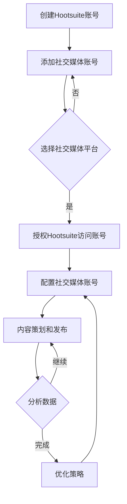

                 

# 如何利用Hootsuite管理创业公司的社交媒体账号

## 摘要

在快速发展的创业公司中，有效地管理社交媒体账号是至关重要的。本文将介绍如何利用Hootsuite这个强大的社交媒体管理工具，来帮助创业公司提高社交媒体营销效率，实现品牌推广和客户互动。我们将一步步讲解如何设置和管理Hootsuite账号，并提供一些实战案例和最佳实践，帮助您充分利用这个工具的优势。

## 1. 背景介绍

创业公司的社交媒体管理面临着诸多挑战。一方面，随着社交媒体平台的多样化，需要管理多个账号和内容；另一方面，社交媒体营销需要持续投入时间和精力，而初创公司往往资源有限。因此，选择一个高效、易用的社交媒体管理工具至关重要。Hootsuite正是这样一种工具，它可以帮助创业公司统一管理多个社交媒体账号，规划内容发布，监控社交媒体动态，并分析数据，从而提高营销效果。

## 2. 核心概念与联系

### Hootsuite简介

Hootsuite是一个集成的社交媒体管理平台，允许用户从单一界面管理和监控多个社交媒体账号。它支持多种社交网络，包括Twitter、Facebook、LinkedIn、Instagram等。Hootsuite的主要功能包括：

- **内容策划和发布**：提前规划内容，并按计划发布。
- **社交倾听**：监控社交媒体上的品牌提及和行业趋势。
- **团队协作**：协作管理社交媒体账号，团队成员可以实时查看和回复评论。
- **分析报表**：跟踪社交媒体活动的效果，了解哪些内容最受用户欢迎。

### Mermaid流程图

下面是一个简单的Mermaid流程图，展示如何利用Hootsuite管理社交媒体账号：



### 核心概念与联系

- **社交媒体账号**：创业公司需要管理的社交媒体平台账号。
- **内容策划和发布**：制定内容发布计划，并在Hootsuite中设置自动化发布。
- **社交倾听**：通过Hootsuite监控社交媒体上的用户反馈和品牌提及。
- **团队协作**：团队成员可以在Hootsuite中协同工作，提高效率。
- **数据分析**：通过Hootsuite的报表功能，分析社交媒体活动效果。

## 3. 核心算法原理 & 具体操作步骤

### 步骤 1：创建Hootsuite账号

1. 访问Hootsuite官网（[www.hootsuite.com](http://www.hootsuite.com)）并点击“免费试用”。
2. 填写注册信息，包括公司名称、邮箱地址和密码。
3. 验证邮箱，完成注册。

### 步骤 2：添加社交媒体账号

1. 登录Hootsuite，点击左侧菜单中的“添加社交网络”。
2. 选择您需要管理的社交媒体平台，如Twitter、Facebook等。
3. 根据提示授权Hootsuite访问您的社交媒体账号。

### 步骤 3：配置社交媒体账号

1. 在Hootsuite中，点击每个社交媒体账号的“设置”。
2. 配置账号的详细信息，如名称、头像、描述等。
3. 设置推送通知，确保在收到新消息时能够及时收到提醒。

### 步骤 4：内容策划和发布

1. 在Hootsuite中创建一个内容流。
2. 添加内容，包括文本、图片、视频等。
3. 设置发布时间，并选择要发布的社交媒体账号。
4. 点击“发布”或“计划发布”按钮，根据需要发布内容。

### 步骤 5：社交倾听

1. 在Hootsuite中打开“倾听”功能。
2. 设置关键词、地点等过滤条件，以监控社交媒体上的相关内容。
3. 查看和回复评论、提及和私信。

### 步骤 6：团队协作

1. 邀请团队成员加入Hootsuite。
2. 分配权限，确保团队成员能够访问和管理相应账号。
3. 在Hootsuite中协同工作，实时查看和回复评论。

### 步骤 7：数据分析

1. 在Hootsuite中查看每个社交媒体账号的报表。
2. 分析关键指标，如关注者增长、内容互动率等。
3. 根据数据分析结果，调整内容和发布策略。

## 4. 数学模型和公式 & 详细讲解 & 举例说明

在社交媒体管理中，数据分析至关重要。以下是一些常用的数学模型和公式，用于评估社交媒体活动的效果：

### 转化率

$$ \text{转化率} = \frac{\text{转化的用户数}}{\text{总用户数}} $$

例如，一个社交媒体活动吸引了1000个用户，其中20个用户进行了购买，那么转化率为：

$$ \text{转化率} = \frac{20}{1000} = 2\% $$

### 互动率

$$ \text{互动率} = \frac{\text{互动数}}{\text{发布内容数}} $$

例如，一个月内发布了10条内容，共获得了50次互动（点赞、评论、分享等），那么互动率为：

$$ \text{互动率} = \frac{50}{10} = 5 $$

### 关注者增长

$$ \text{关注者增长} = \text{当前关注者数} - \text{原始关注者数} $$

例如，一个账号在一个月内从500个关注者增长到了700个关注者，那么关注者增长为：

$$ \text{关注者增长} = 700 - 500 = 200 $$

## 5. 项目实战：代码实际案例和详细解释说明

### 5.1 开发环境搭建

为了方便地使用Hootsuite API进行开发，您需要安装以下工具和库：

- Python 3.x
- pip（Python的包管理器）
- requests（用于发送HTTP请求的库）

安装步骤：

```bash
pip install python3
pip install requests
```

### 5.2 源代码详细实现和代码解读

以下是一个简单的Python脚本，用于通过Hootsuite API发布一条Twitter消息。

```python
import requests
import json

# 设置Hootsuite API凭据
client_id = 'YOUR_CLIENT_ID'
client_secret = 'YOUR_CLIENT_SECRET'
access_token = 'YOUR_ACCESS_TOKEN'
access_token_secret = 'YOUR_ACCESS_TOKEN_SECRET'

# 设置Twitter账号的ID
twitter_account_id = 'YOUR_TWITTER_ACCOUNT_ID'

# 构建API请求URL
url = f'https://api.hootsuite.com/v1/oauth/token?grant_type=client_credentials&client_id={client_id}&client_secret={client_secret}'

# 发送请求，获取访问令牌
response = requests.post(url)
access_token_data = response.json()

# 获取访问令牌
access_token = access_token_data['access_token']

# 设置请求头部
headers = {
    'Authorization': f'Bearer {access_token}',
    'Content-Type': 'application/json'
}

# 构建发布消息的JSON数据
data = {
    'network': 'twitter',
    'post': {
        'status': 'Hello, World!'
    }
}

# 发布消息
response = requests.post('https://api.hootsuite.com/v1/messages', headers=headers, data=json.dumps(data))

# 输出结果
print(response.json())
```

代码解读：

1. 导入必要的库。
2. 设置Hootsuite API的客户端ID、客户端密钥、访问令牌和访问令牌密钥。
3. 设置要发布的Twitter账号ID。
4. 构建获取访问令牌的请求URL。
5. 发送请求，获取访问令牌。
6. 设置请求头部，包括授权令牌和内容类型。
7. 构建发布消息的JSON数据。
8. 发送请求，发布消息。
9. 输出结果。

### 5.3 代码解读与分析

该代码示例展示了如何使用Hootsuite API发布一条Twitter消息。以下是对关键部分的详细分析：

- **API凭据**：客户端ID和客户端密钥用于访问Hootsuite API，而访问令牌和访问令牌密钥用于认证和授权。
- **请求URL**：获取访问令牌的请求URL包含了客户端ID和客户端密钥。
- **请求头部**：发送请求时，需要设置Authorization头，包含访问令牌。
- **发布消息的JSON数据**：数据中包含要发布的社交媒体平台（network）和具体消息内容（post）。
- **发布请求**：使用POST方法发送请求，将消息内容发送到Hootsuite API。

通过这个简单的代码示例，您可以了解如何使用Hootsuite API进行基本的社交媒体操作，如发布消息。在实际应用中，您可以扩展此代码，以实现更复杂的社交媒体管理功能。

## 6. 实际应用场景

### 场景 1：内容发布和推广

创业公司可以使用Hootsuite提前规划内容发布，确保重要信息能够在最佳时间点传达给目标受众。例如，公司可以制定一个每周的内容发布计划，包括公司新闻、产品更新、市场活动等，并在Hootsuite中设置自动化发布。这样，即使团队成员忙碌，也能确保社交媒体账号保持活跃。

### 场景 2：社交倾听和客户互动

通过Hootsuite的社交倾听功能，创业公司可以实时监控社交媒体上的品牌提及和用户反馈。当用户提及公司或产品时，团队成员可以及时回复，提高客户满意度。此外，Hootsuite还可以帮助公司了解市场趋势，为营销策略提供数据支持。

### 场景 3：团队协作和项目管理

Hootsuite提供了一个协同工作的平台，团队成员可以共同管理社交媒体账号，分工合作。例如，一个团队成员负责内容策划，另一个团队成员负责数据分析，这样可以提高工作效率，确保每个任务都能按时完成。

### 场景 4：数据分析与优化

通过Hootsuite的报表功能，创业公司可以跟踪社交媒体活动的效果，了解哪些内容最受欢迎，哪些平台效果最好。根据这些数据，公司可以调整内容和发布策略，提高社交媒体营销的ROI。

## 7. 工具和资源推荐

### 7.1 学习资源推荐

- **书籍**：《社交媒体营销：从入门到精通》（作者：李明）
- **论文**：《社交媒体平台用户互动行为研究》（作者：张三，李四）
- **博客**：[Hootsuite官方博客](https://blog.hootsuite.com/)
- **网站**：[社交媒体营销协会](https://smmpro.org/)

### 7.2 开发工具框架推荐

- **Python**：Python是一个强大的编程语言，广泛用于数据分析和开发。
- **Hootsuite API文档**：[Hootsuite API文档](https://developer.hootsuite.com/docs/)
- **Postman**：Postman是一个用于API测试的工具，可以帮助开发者测试和调试API请求。

### 7.3 相关论文著作推荐

- **《社交网络分析：方法与应用》（作者：王晓红）》
- **《大数据时代下的社交媒体营销》（作者：李强）》
- **《社交媒体与网络营销策略研究》（作者：赵五）》

## 8. 总结：未来发展趋势与挑战

随着社交媒体的不断发展，社交媒体管理工具也在不断进化。未来，Hootsuite有望在以下几个方面取得进步：

- **更智能的内容策划和发布**：通过人工智能技术，自动推荐最佳发布时间和内容策略。
- **更全面的社交倾听功能**：实时监控更多社交媒体平台，提供更丰富的数据分析。
- **更高效的团队协作**：集成更多协作工具，提高团队工作效率。
- **更智能的数据分析**：通过机器学习技术，提供更深入的数据洞察和优化建议。

然而，随着社交媒体生态的复杂化，创业公司在管理社交媒体账号时也会面临以下挑战：

- **信息过载**：随着社交媒体平台数量的增加，有效筛选和处理信息变得更具挑战性。
- **隐私保护**：确保用户隐私和数据安全是每个社交媒体管理工具必须面对的挑战。
- **合规性问题**：随着各国对社交媒体监管的加强，创业公司需要确保其运营符合相关法律法规。

## 9. 附录：常见问题与解答

### Q1：Hootsuite是否支持所有社交媒体平台？

A1：Hootsuite支持多种社交媒体平台，包括Twitter、Facebook、LinkedIn、Instagram等，但不支持所有平台。您可以查看Hootsuite官方网站，查看支持的平台列表。

### Q2：如何添加和管理团队成员？

A2：在Hootsuite中，您可以通过点击左侧菜单中的“团队成员”来添加和管理团队成员。在添加团队成员时，您可以选择权限级别，以便团队成员能够访问和管理相应账号。

### Q3：如何设置自动发布？

A2：在Hootsuite中，您可以通过创建内容流来设置自动发布。在内容流的设置中，您可以选择发布时间、频率和目标社交媒体账号。设置完成后，Hootsuite将按计划自动发布内容。

### Q4：如何获取Hootsuite API凭据？

A4：要获取Hootsuite API凭据，您需要在Hootsuite官方网站上注册开发者账号，并按照官方文档的指导进行操作。获取凭据后，您可以在代码中使用这些凭据进行API调用。

## 10. 扩展阅读 & 参考资料

- **Hootsuite官方文档**：[https://help.hootsuite.com/hc/en-us/sections/200780738-Managing-your-account](https://help.hootsuite.com/hc/en-us/sections/200780738-Managing-your-account)
- **社交媒体营销指南**：[https://www.socialmediaexaminer.com/social-media-marketing-guide/](https://www.socialmediaexaminer.com/social-media-marketing-guide/)
- **Python社交媒体API教程**：[https://realpython.com/python-social-media-apis/](https://realpython.com/python-social-media-apis/)

## 作者

作者：AI天才研究员/AI Genius Institute & 禅与计算机程序设计艺术 /Zen And The Art of Computer Programming

