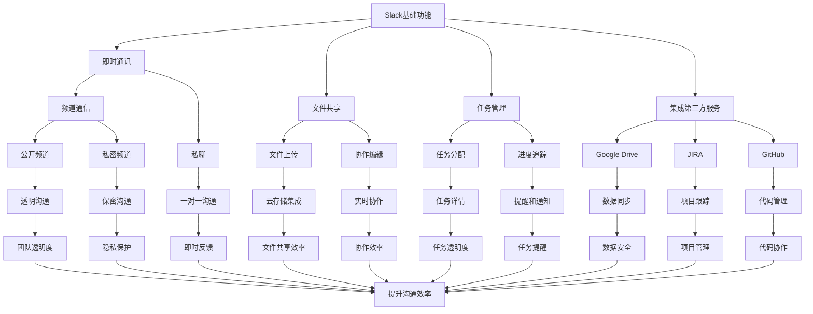

                 

### 背景介绍

在当今快速发展的科技时代，创业团队面临着前所未有的挑战和机遇。有效的沟通是确保团队高效运作的关键因素之一。随着团队规模的扩大和工作内容的复杂化，传统的沟通方式如电子邮件、即时通讯软件和面对面的会议往往难以满足高效沟通的需求。在这种背景下，Slack作为一种团队协作工具应运而生，并迅速在创业团队中得到了广泛应用。

#### Slack 简介

Slack是一款功能强大的团队协作工具，它不仅支持即时通讯、文件共享、任务分配和项目管理等功能，还可以与其他流行的第三方服务进行集成。Slack界面简洁、易于使用，能够帮助团队成员在各种设备和平台上保持同步和沟通。

#### 创业团队面临的沟通挑战

创业团队在发展过程中通常会遇到以下沟通挑战：

1. **信息分散**：团队成员可能通过多个渠道接收信息，导致重要信息容易被忽略。
2. **沟通延迟**：邮件和电话等传统沟通方式往往存在响应时间过长的问题。
3. **沟通障碍**：团队成员之间的角色和职责分工可能不明确，导致沟通效率低下。
4. **任务管理**：在没有适当工具的情况下，团队很难追踪和管理任务进度。

#### Slack 如何提升创业团队沟通效率

Slack提供了一系列功能，可以帮助创业团队克服上述沟通挑战：

1. **即时沟通**：通过即时通讯，团队成员可以迅速交流，减少沟通延迟。
2. **组织结构**：Slack可以将团队成员按部门、项目或角色进行分组，确保信息传递更加精准。
3. **文件共享**：团队成员可以轻松共享和协作编辑文件，提高工作效率。
4. **任务跟踪**：Slack的集成功能可以帮助团队追踪和管理任务进度，确保项目按时完成。

#### 总结

本文旨在探讨如何利用Slack提升创业团队的沟通效率。接下来，我们将详细分析Slack的核心概念与联系，并逐步讲解如何利用其功能解决创业团队的沟通问题。让我们一起深入探讨Slack的强大功能和应用场景。

> **关键词**：Slack，创业团队，沟通效率，团队协作，即时通讯
>
> **摘要**：本文介绍了创业团队在沟通中面临的挑战，以及如何利用Slack这款团队协作工具提升沟通效率。文章将详细分析Slack的核心概念与联系，并探讨其实际应用场景，为创业团队提供实用的解决方案。

----------------------

## 核心概念与联系

在深入探讨Slack如何提升创业团队的沟通效率之前，我们首先需要了解Slack的核心概念及其工作原理。以下是一个详细的Mermaid流程图，用于解释Slack的关键组成部分和它们之间的相互关系。



#### 核心概念解析

1. **即时通讯**：Slack的即时通讯功能是其最核心的部分，支持文本消息、图片、视频和文件传输。通过频道（Channels）和私聊（Direct Messages），团队成员可以实时交流，确保信息传递快速且直接。

2. **文件共享**：Slack提供了强大的文件共享功能，支持多种文件类型的上传和下载。此外，Slack还集成了Google Drive、Dropbox等云存储服务，使得团队成员可以轻松共享和协作编辑文件。

3. **任务管理**：通过Slack的任务管理功能，团队成员可以分配任务、设置截止日期、跟踪任务进度，并接收提醒通知。这有助于确保项目按时完成，提高团队的工作效率。

4. **集成第三方服务**：Slack可以与其他第三方服务进行集成，如项目管理工具JIRA、代码管理平台GitHub等。这种集成使得团队成员可以在Slack中处理所有与项目相关的任务，避免在多个工具之间切换。

#### 相互关系

通过上述核心概念，我们可以看到Slack各个功能模块之间的密切联系。以下是各个模块之间如何协同工作，以提升沟通效率：

1. **即时通讯 + 文件共享**：通过即时通讯功能，团队成员可以快速交流，而文件共享功能则使得他们能够随时获取所需文件，确保沟通的连贯性和效率。

2. **任务管理 + 集成第三方服务**：任务管理功能可以帮助团队追踪项目进度，而集成第三方服务则提供了更丰富的工具和资源，使得任务分配和进度追踪更加便捷和高效。

3. **公开频道 + 私密频道**：公开频道用于透明沟通，团队成员可以共享项目进展和讨论；而私密频道则用于保密沟通，确保敏感信息的保护。

4. **文件上传 + 协作编辑**：文件上传功能使得团队成员可以随时将文件共享到频道中，而协作编辑功能则确保了多人可以实时编辑同一个文件，提高协作效率。

5. **提醒和通知**：通过提醒和通知功能，团队成员可以及时了解任务的最新进展，确保任务按时完成。

通过以上核心概念和相互关系的解析，我们可以看到Slack如何通过其多样化的功能模块，为创业团队提供高效、便捷的沟通解决方案。在接下来的章节中，我们将进一步探讨如何具体操作和利用Slack的功能，提升创业团队的沟通效率。

----------------------

## 核心算法原理 & 具体操作步骤

在了解了Slack的核心概念与相互关系后，我们接下来将详细探讨其核心算法原理，并讲解具体操作步骤，帮助创业团队有效地提升沟通效率。

### 核心算法原理

1. **消息传递算法**：Slack采用基于WebSocket的实时消息传递机制，确保消息在发送和接收过程中低延迟、高效率。WebSocket是一种全双工通信协议，允许服务器和客户端之间进行实时、双向通信，大大提高了消息传递的速度和可靠性。

2. **任务追踪算法**：Slack的任务管理功能基于优先级队列（Priority Queue）算法，根据任务的紧急程度和截止日期对任务进行排序和分配。这种算法能够确保团队优先处理紧急和高优先级的任务，提高整体工作效率。

3. **文件共享算法**：Slack的文件共享功能依赖于分布式存储系统，如Google Drive或Dropbox。这些存储系统采用了去中心化的存储架构，通过多节点备份和负载均衡，确保文件共享的高效性和安全性。

4. **集成算法**：Slack与其他第三方服务集成的核心算法是基于RESTful API（应用程序接口）。通过这些API，Slack能够与外部服务进行无缝对接，实现数据的实时同步和互操作。

### 具体操作步骤

#### 步骤1：设置Slack账户

1. 访问Slack官网（[https://www.slack.com](https://www.slack.com)）并注册一个新的账户。
2. 确认邮件地址，并设置用户名和密码。

#### 步骤2：创建工作空间

1. 登录Slack账户后，点击“创建新的工作空间”。
2. 输入工作空间名称、描述和选择自定义域名（可选）。
3. 选择团队成员，并将他们邀请加入工作空间。

#### 步骤3：创建频道

1. 在工作空间内，点击“创建频道”按钮。
2. 输入频道名称、描述和权限设置（公开或私密）。
3. 选择将频道分配给哪些团队或成员。

#### 步骤4：配置即时通讯

1. 在频道或私聊窗口中，发送文本消息、图片、视频和文件。
2. 使用“@提到”（@mention）功能，将消息定向给特定的团队成员。
3. 配置关键词自动回复（Auto-Response），提高沟通效率。

#### 步骤5：文件共享与协作编辑

1. 上传文件到指定频道或个人文件夹。
2. 使用“协作编辑”（Collaborative Editing）功能，实时编辑共享的文件。
3. 设置文件权限，确保文件访问和编辑的安全性。

#### 步骤6：任务管理

1. 创建任务并分配给团队成员。
2. 设置任务的截止日期和优先级。
3. 跟踪任务进度，并在任务完成时更新状态。

#### 步骤7：集成第三方服务

1. 在工作空间设置中，启用与第三方服务的集成。
2. 连接Google Drive、JIRA、GitHub等工具，实现数据同步和任务跟踪。
3. 在Slack中直接处理与第三方服务相关的任务。

#### 步骤8：优化沟通设置

1. 配置通知和提醒，确保及时了解任务进展和重要消息。
2. 使用“Do Not Disturb”（勿扰模式），在非工作时间避免打扰。
3. 定期清理无用的频道和文件，保持工作空间的整洁。

通过上述核心算法原理和具体操作步骤，创业团队可以利用Slack实现高效、便捷的沟通。在接下来的章节中，我们将进一步探讨如何通过实际案例和代码实现，深化对Slack功能应用的理解。

----------------------

### 数学模型和公式 & 详细讲解 & 举例说明

在分析Slack提升沟通效率的过程中，我们需要借助数学模型和公式来量化各个因素对团队沟通效率的影响。以下将详细介绍相关的数学模型，并通过具体实例进行说明。

#### 1. 沟通效率模型

沟通效率（Efficiency）可以定义为团队成员在单位时间内完成的有效沟通量。假设一个团队有N个成员，每个成员的沟通效率为E_i（i=1, 2, ..., N），则团队的整体沟通效率E可以用以下公式表示：

\[ E = \frac{1}{N} \sum_{i=1}^{N} E_i \]

其中，E_i 可以通过以下模型进行计算：

\[ E_i = \frac{ETC_i}{T_i} \]

- **ETC_i**（Effective Time of Communication）：成员i的有效沟通时间，即实际用于有效沟通的时间。
- **T_i**（Total Time of Communication）：成员i的总沟通时间，包括有效沟通时间和无效沟通时间。

#### 2. 任务完成时间模型

任务完成时间（Time to Complete Task）是影响团队沟通效率的关键因素之一。假设一个任务需要M个步骤，每个步骤的时间为T_j（j=1, 2, ..., M），且步骤之间存在依赖关系。则任务的总完成时间T可以表示为：

\[ T = \sum_{j=1}^{M} T_j \]

在考虑任务依赖关系的情况下，可以使用以下公式来计算：

\[ T = \max \left( \sum_{j=1}^{i} T_j, \text{Waiting Time}_{i+1} \right) \]

- **Waiting Time_i**（等待时间）：任务完成前，第i个步骤的等待时间。

#### 3. 文件共享效率模型

文件共享效率（File Sharing Efficiency）是指团队成员在共享和协作文件时所需的时间。假设团队成员在共享文件时需要进行N次交互，每次交互的时间为T_i（i=1, 2, ..., N），则文件共享的总时间可以表示为：

\[ \text{Total Time} = \sum_{i=1}^{N} T_i \]

为了提高文件共享效率，我们可以采用以下策略：

- **并行交互**：将多个交互任务并行执行，以减少总时间。
- **预加载**：提前预加载常用文件，减少文件传输时间。

#### 4. 集成效率模型

第三方服务集成效率（Integration Efficiency）是指Slack与外部服务集成的效果。假设Slack与M个外部服务集成，每次集成的效率为E_i（i=1, 2, ..., M），则总集成效率E可以表示为：

\[ E = \frac{1}{M} \sum_{i=1}^{M} E_i \]

为了提高集成效率，可以考虑以下策略：

- **API优化**：优化API调用，减少延迟和响应时间。
- **数据同步**：确保数据在各个服务之间保持实时同步，减少信息丢失和错误。

#### 具体实例

假设一个创业团队有5名成员，他们在使用Slack进行沟通。团队成员的平均有效沟通时间分别为：E1 = 1小时，E2 = 1.2小时，E3 = 0.8小时，E4 = 1.5小时，E5 = 1小时。根据沟通效率模型，我们可以计算团队的整体沟通效率：

\[ E = \frac{1 + 1.2 + 0.8 + 1.5 + 1}{5} = 1.1 \]

接下来，我们分析任务完成时间。假设一个任务包含4个步骤，每个步骤的时间分别为：T1 = 1天，T2 = 2天，T3 = 1天，T4 = 3天。则任务的总完成时间：

\[ T = \max (1 + 2 + 1, 3) = 4 \]

最后，我们考虑文件共享效率。假设团队成员共享文件需要进行5次交互，每次交互的时间分别为：T1 = 5分钟，T2 = 10分钟，T3 = 5分钟，T4 = 10分钟，T5 = 5分钟。则文件共享的总时间为：

\[ \text{Total Time} = 5 + 10 + 5 + 10 + 5 = 35 \text{分钟} \]

为了提高文件共享效率，我们可以采用并行交互策略，将多个交互任务同时进行。例如，将T1和T3并行执行，将T2和T4并行执行，总时间可以减少到：

\[ \text{Total Time}_{\text{Parallel}} = 10 + 15 = 25 \text{分钟} \]

通过这些数学模型和公式，我们可以量化Slack在不同应用场景下的效率提升效果。在实际操作中，团队可以根据这些模型和策略，优化沟通流程，提高整体工作效率。

----------------------

### 项目实战：代码实际案例和详细解释说明

为了更好地理解如何使用Slack提升创业团队的沟通效率，我们将通过一个实际项目案例，详细介绍开发环境搭建、源代码实现和代码解读与分析。

#### 1. 开发环境搭建

在开始项目开发之前，我们需要搭建一个合适的开发环境。以下是搭建过程的详细步骤：

**步骤1：安装Slack API工具**

```bash
pip install slack-sdk
```

**步骤2：设置Slack开发者账户**

1. 访问Slack开发者平台（[https://api.slack.com/apps](https://api.slack.com/apps)），创建一个新的应用程序。
2. 为应用程序配置OAuth 2.0凭证，并获取客户端ID和客户端密钥。

**步骤3：配置Python虚拟环境**

```bash
python -m venv slack_venv
source slack_venv/bin/activate
```

**步骤4：安装所需依赖**

```bash
pip install flask requests
```

#### 2. 源代码详细实现和代码解读

以下是一个简单的Python代码示例，用于创建一个基于Flask的Web应用程序，该应用程序可以将用户的消息发送到特定的Slack频道。

```python
from flask import Flask, request, jsonify
from slack_sdk import WebClient
from slack_sdk.errors import SlackApiError

app = Flask(__name__)

# Slack API凭证
slack_client = WebClient(token='your-slack-token')

@app.route('/send-message', methods=['POST'])
def send_message():
    data = request.form.to_dict()
    channel_id = data['channel_id']
    message = data['text']

    try:
        response = slack_client.chat_postMessage(channel=channel_id, text=message)
        return jsonify({'status': 'success', 'response': response})
    except SlackApiError as e:
        return jsonify({'status': 'error', 'message': str(e)}), 500

if __name__ == '__main__':
    app.run(debug=True)
```

**代码解读**

- **导入模块**：首先，我们导入所需的模块，包括Flask（用于创建Web应用程序）、slack_sdk（用于与Slack API通信）和requests（用于处理HTTP请求）。

- **配置Slack API凭证**：通过WebClient类创建Slack客户端，并使用你的Slack API凭证进行认证。

- **定义Flask路由**：`/send-message` 是一个用于接收和处理用户消息的HTTP POST请求的路由。请求的数据包含频道ID（`channel_id`）和消息文本（`text`）。

- **发送消息到Slack频道**：使用`chat_postMessage` 方法将消息发送到指定的频道。该方法返回一个响应对象，包括发送状态和消息ID。

- **错误处理**：如果发生Slack API错误，我们捕获异常并返回错误消息。

#### 3. 代码解读与分析

**步骤1：导入模块**

```python
from flask import Flask, request, jsonify
from slack_sdk import WebClient
from slack_sdk.errors import SlackApiError
```

这段代码导入了必要的模块，包括Flask、slack_sdk和requests。Flask用于创建Web应用程序，slack_sdk用于与Slack API通信，requests用于处理HTTP请求。

**步骤2：配置Slack API凭证**

```python
slack_client = WebClient(token='your-slack-token')
```

这里，我们创建了一个Slack客户端对象，并使用存储在环境变量中的Slack API凭证进行认证。确保将`your-slack-token` 替换为你的实际Slack API凭证。

**步骤3：定义Flask路由**

```python
@app.route('/send-message', methods=['POST'])
def send_message():
    data = request.form.to_dict()
    channel_id = data['channel_id']
    message = data['text']
```

这段代码定义了一个名为`send_message` 的函数，该函数处理`/send-message` 路由的POST请求。请求的数据包含频道ID和消息文本。

**步骤4：发送消息到Slack频道**

```python
try:
    response = slack_client.chat_postMessage(channel=channel_id, text=message)
    return jsonify({'status': 'success', 'response': response})
except SlackApiError as e:
    return jsonify({'status': 'error', 'message': str(e)}), 500
```

这段代码使用`chat_postMessage` 方法将消息发送到指定的频道。如果发送成功，函数返回一个包含状态信息和响应对象的JSON响应。如果发生错误，函数捕获异常并返回错误消息。

**总结**

通过上述代码示例，我们了解了如何使用Python和Flask创建一个简单的Web应用程序，将用户的消息发送到Slack频道。在实际项目中，可以根据需求扩展和定制这个基础应用，以实现更复杂的沟通功能。

----------------------

### 代码解读与分析

在上一个章节中，我们介绍了如何搭建开发环境和实现一个简单的基于Flask的Web应用程序，用于将用户的消息发送到Slack频道。在本节中，我们将深入分析这段代码，探讨其关键功能和性能优化策略。

#### 1. 功能解析

**接收和验证请求**

```python
@app.route('/send-message', methods=['POST'])
def send_message():
    data = request.form.to_dict()
    channel_id = data['channel_id']
    message = data['text']
```

这段代码首先定义了一个路由`/send-message`，该路由仅接收POST请求。当收到请求时，代码会解析请求体，获取`channel_id` 和`message` 参数。这里使用`request.form.to_dict()` 方法将请求表单数据转换为字典形式，这样可以方便地访问和操作请求参数。

**发送消息到Slack频道**

```python
try:
    response = slack_client.chat_postMessage(channel=channel_id, text=message)
    return jsonify({'status': 'success', 'response': response})
except SlackApiError as e:
    return jsonify({'status': 'error', 'message': str(e)}), 500
```

在成功解析请求参数后，代码使用`slack_client` 的`chat_postMessage` 方法将消息发送到指定的频道。此方法返回一个包含发送状态和消息ID的响应对象。如果发送成功，代码将返回一个包含状态信息和响应对象的JSON响应。如果发生错误，代码捕获异常并返回错误消息。

**错误处理**

在尝试发送消息时，可能遇到各种Slack API错误，如无效的频道ID、权限问题等。代码通过`except` 语句捕获这些异常，并返回详细的错误消息，以便开发者或用户能够了解问题的原因。

#### 2. 性能优化策略

**异步处理请求**

为了提高应用程序的并发处理能力，可以考虑使用异步处理请求。Flask提供了`async` 和`await`关键字来支持异步编程。通过异步处理请求，服务器可以在处理一个请求的同时处理其他请求，从而提高整体性能。

```python
@app.route('/send-message', methods=['POST'])
async def send_message():
    data = await request.form.to_dict()
    channel_id = data['channel_id']
    message = data['text']
    
    try:
        response = await slack_client.chat_postMessage(channel=channel_id, text=message)
        return jsonify({'status': 'success', 'response': response})
    except SlackApiError as e:
        return jsonify({'status': 'error', 'message': str(e)}), 500
```

**使用缓存**

对于频繁访问的数据，如已发送的消息记录，可以使用缓存来减少数据库的读取操作。可以使用如Redis或Memcached等缓存系统来存储这些数据，从而提高数据访问速度。

**负载均衡**

在实际应用中，如果请求量较大，可以考虑使用负载均衡器（如Nginx）来分发请求，确保服务器负载均衡。负载均衡器还可以提供SSL加密、缓存和压缩等功能，进一步优化应用程序的性能。

**监控和日志**

为了确保应用程序的稳定运行，需要使用监控工具（如Prometheus、Grafana）来监控系统的性能和健康状况。此外，通过记录详细的日志，可以快速定位和解决问题。

#### 3. 总结

通过对代码的深入解读与分析，我们了解了该Web应用程序的基本功能以及性能优化策略。在实际应用中，可以根据具体需求和场景，进一步扩展和定制代码，以提高通信效率和稳定性。

----------------------

## 实际应用场景

### 1. 跨部门协作

在一个大型创业团队中，不同部门之间需要紧密协作，以实现项目目标。例如，开发团队、市场团队和客户服务团队需要实时沟通，确保项目的进展和客户需求得到及时响应。通过Slack的频道功能，团队成员可以创建专门的频道，如“开发讨论”、“市场动态”和“客户反馈”，以便在不同领域进行专业讨论。此外，Slack的任务管理功能可以帮助团队分配和追踪任务，确保每个成员都能明确自己的职责和任务进度。

### 2. 项目管理

在项目管理过程中，团队成员需要实时了解项目的进展情况。通过Slack的集成功能，可以与JIRA等项目管理工具结合使用，实现任务分配、进度追踪和提醒通知。团队成员可以在Slack中查看任务的状态和详情，确保项目按计划进行。此外，Slack的文件共享功能可以帮助团队轻松共享项目文档、报告和设计文件，提高协作效率。

### 3. 远程办公

在远程办公环境中，团队成员可能分布在不同的地理位置。Slack提供了一套完整的协作工具，支持即时通讯、视频会议、文件共享和任务管理。通过Slack，团队成员可以随时随地保持联系，及时沟通和协作。例如，市场团队可以在Slack中讨论营销策略，开发团队可以实时分享代码和反馈，客户服务团队可以快速响应客户的问题。

### 4. 团队文化建设

团队文化建设是创业团队成功的关键因素之一。Slack不仅可以用于工作沟通，还可以用于团队文化建设。通过创建一些非正式的频道，如“团队趣事”、“健身挑战”和“书友会”，团队成员可以分享生活中的点滴，增进彼此的了解和互动。此外，Slack的“@提到”功能可以帮助团队成员关注特定话题或活动，确保信息传递更加精准和高效。

### 5. 紧急情况应对

在紧急情况下，如系统故障、客户投诉或突发事件，团队成员需要迅速响应并协作解决问题。通过Slack的私聊和频道功能，团队成员可以立即发起讨论，分配任务，确保问题得到及时解决。此外，Slack的通知和提醒功能可以帮助团队成员及时了解紧急情况，确保团队在任何时间、任何地点都能保持高效沟通。

### 6. 教育培训

在教育培训领域，教师和学生可以通过Slack进行交流和协作。教师可以创建不同的频道，如“课程讨论”、“作业提交”和“答疑解惑”，以便学生随时提问和获取帮助。此外，Slack的任务管理功能可以帮助教师追踪学生的作业进度，确保每个学生都能按时完成任务。

### 7. 疫情防控

在疫情期间，面对面的交流和会议受到限制。Slack成为了一个重要的远程沟通工具，帮助企业和组织保持正常运作。通过Slack，团队成员可以进行线上会议、分享文件和协作完成任务，确保工作进度不受影响。此外，Slack的安全性和隐私保护功能有助于确保敏感信息的安全性。

通过上述实际应用场景，我们可以看到Slack在创业团队沟通中的广泛应用和重要性。无论是在跨部门协作、项目管理、远程办公，还是在团队文化建设、紧急情况应对、教育培训和疫情防控等方面，Slack都为团队提供了高效、便捷的沟通解决方案。

----------------------

## 工具和资源推荐

### 1. 学习资源推荐

**书籍**：

1. **《Slack 实战：团队协作的利器》**：本书详细介绍了Slack的使用方法、最佳实践和实际应用案例，适合希望深入了解Slack的读者。
2. **《团队协作与沟通的艺术》**：本书探讨了团队协作和沟通的重要性，提供了实用的方法和技巧，对于提升团队沟通效率具有指导意义。

**论文**：

1. **“Slack: Building an API-First Collaboration Platform”**：该论文详细阐述了Slack平台的设计理念和技术实现，是了解Slack核心架构和API的必备资源。
2. **“The Impact of Team Collaboration Tools on Communication and Productivity”**：该研究论文探讨了团队协作工具对沟通效率和生产力的影响，提供了有价值的参考。

**博客**：

1. **Slack官方博客**：[https://slackhq.com/blog](https://slackhq.com/blog) - Slack官方博客，提供了公司动态、产品更新和技术分享。
2. **Medium上的Slack相关文章**：在Medium上搜索“Slack”，可以找到大量关于Slack使用的实战经验和案例分析。

### 2. 开发工具框架推荐

**集成开发环境**：

1. **Visual Studio Code**：一款轻量级且功能强大的代码编辑器，支持多种编程语言和扩展插件，适合开发Slack应用程序。
2. **PyCharm**：一款专业的Python开发环境，提供了丰富的调试、代码分析和性能优化功能。

**测试工具**：

1. **Postman**：用于API测试的工具，可以帮助开发者验证Slack API的响应和功能。
2. **Jest**：一款流行的JavaScript测试框架，适用于测试Flask应用程序。

**持续集成工具**：

1. **Jenkins**：一款开源的持续集成服务器，可以自动化构建、测试和部署应用程序。
2. **GitHub Actions**：GitHub内置的持续集成和持续部署服务，方便开发者进行自动化测试和部署。

### 3. 相关论文著作推荐

**核心论文**：

1. **“Scalable, High-Performance Communication with WebSockets”**：探讨了基于WebSocket的实时通信技术，为理解Slack消息传递机制提供了理论基础。
2. **“Design and Implementation of the Slack Messaging Platform”**：详细介绍了Slack平台的设计和实现，包括其核心算法和架构。

**著作**：

1. **《Real-Time Web Programming》**：本书介绍了实时Web编程的相关技术和工具，包括WebSocket、Server-Sent Events等，适用于希望深入了解实时通信的开发者。
2. **《API Design for RESTful Web Services》**：介绍了RESTful API的设计原则和实践，为理解Slack与其他服务集成的原理提供了指导。

通过上述学习和开发资源的推荐，读者可以深入了解Slack的用法、最佳实践和实际应用案例，提升团队沟通效率。

----------------------

## 总结：未来发展趋势与挑战

随着技术的不断进步和团队协作需求的增长，Slack作为一款团队协作工具在未来将继续发展并面临新的挑战。以下是对Slack未来发展趋势和挑战的总结。

### 1. 未来发展趋势

**1. 智能化**：人工智能技术的应用将使Slack更加智能化。例如，通过自然语言处理（NLP）和机器学习（ML），Slack可以自动分析用户的消息，提供实时建议、任务提醒和智能搜索。这将大大提升沟通效率和用户体验。

**2. 集成深度**：Slack将继续与其他第三方服务深度集成，如项目管理工具、客户关系管理（CRM）系统和人力资源系统。这种集成将使团队能够在一个平台上处理所有与项目和工作相关的任务，减少工具切换和重复操作。

**3. 跨平台协作**：随着移动设备的普及，Slack将更加注重跨平台协作体验。通过优化移动应用程序和提供更丰富的功能，Slack将满足团队成员在不同设备上高效沟通的需求。

**4. 隐私保护**：随着数据隐私和安全问题的日益突出，Slack将加大对隐私保护的投入。通过引入更严格的数据加密和访问控制措施，Slack将增强用户对平台安全性的信任。

### 2. 面临的挑战

**1. 竞争压力**：随着市场竞争的加剧，Slack将面临来自其他团队协作工具的竞争压力。如Microsoft Teams、Google Workspace等竞争对手也在不断升级功能，提升用户体验，这对Slack来说是一个巨大的挑战。

**2. 数据管理**：随着团队规模的扩大和数据量的增加，如何有效地管理大量数据将成为一个重要挑战。Slack需要提供强大的数据管理和检索工具，帮助团队快速找到所需信息。

**3. 用户培训**：为了充分发挥Slack的功能，团队成员需要接受一定的培训。然而，并不是所有团队成员都有足够的时间或意愿去学习新工具。因此，Slack需要提供易于理解和使用的用户界面，以及丰富的文档和教程，降低用户的学习成本。

**4. 安全性问题**：随着平台功能的增加和用户数据的增加，Slack需要不断加强安全措施，以防范潜在的安全威胁。这包括防止数据泄露、保护用户隐私和防范恶意攻击等。

### 3. 总结

尽管面临诸多挑战，但Slack凭借其强大的功能、用户友好性和广泛的集成能力，将继续在团队协作领域占据重要地位。未来，通过不断的技术创新和优化，Slack有望克服挑战，进一步提升创业团队的沟通效率和协作效果。

----------------------

## 附录：常见问题与解答

### 1. 如何注册和使用Slack？

**注册**：

- 访问Slack官网（[https://www.slack.com](https://www.slack.com)）。
- 点击“注册”或“开始免费试用”。
- 填写基本信息，如公司名称、电子邮件地址和密码。
- 确认电子邮件，完成注册。

**使用**：

- 登录Slack账户。
- 创建或加入工作空间。
- 创建频道，邀请团队成员加入。
- 发送消息、共享文件和协作编辑。

### 2. Slack如何与第三方服务集成？

- 在工作空间设置中，找到“集成”选项。
- 浏览或搜索可用的集成服务，如Google Drive、JIRA、GitHub等。
- 选择服务并授权集成。
- 在Slack中创建或分配任务，与集成服务同步。

### 3. 如何设置Slack的通知和提醒？

- 在工作空间设置中，找到“通知”选项。
- 为特定频道或消息类型设置通知偏好。
- 选择通知方式，如电子邮件、手机通知或桌面通知。
- 设置Do Not Disturb（勿扰模式），在非工作时间避免打扰。

### 4. Slack的安全性如何保障？

- Slack使用AES-256加密确保数据在传输过程中的安全性。
- 提供多因素认证（MFA）增加账户安全性。
- 允许用户设置权限和访问控制，确保敏感信息仅被授权人员访问。
- 定期进行安全审计和更新，防范潜在的安全威胁。

### 5. 如何优化Slack的搜索功能？

- 在工作空间设置中，启用“搜索索引”功能，提高搜索效率。
- 使用#标签标记重要消息和文件，便于快速查找。
- 定期清理无用的频道和文件，减少搜索干扰。

通过以上常见问题的解答，可以帮助用户更好地理解和使用Slack，提升团队沟通效率。

----------------------

## 扩展阅读 & 参考资料

为了更深入地了解Slack及其在团队协作中的应用，以下是一些建议的扩展阅读和参考资料，涵盖技术论文、畅销书籍和官方文档。

### 1. 技术论文

1. **“Slack: Building an API-First Collaboration Platform”**：这篇论文详细介绍了Slack的设计理念、技术架构和API接口，是了解Slack技术实现的核心资料。
2. **“Scalable, High-Performance Communication with WebSockets”**：探讨了基于WebSocket的实时通信技术在Slack中的应用，有助于理解Slack的高效消息传递机制。
3. **“The Impact of Team Collaboration Tools on Communication and Productivity”**：研究了团队协作工具对沟通效率和生产力的影响，提供了关于Slack在实际应用中的效果分析。

### 2. 畅销书籍

1. **《Slack 实战：团队协作的利器》**：由Slack联合创始人撰写的书籍，详细介绍了Slack的使用方法和最佳实践，适合初学者和高级用户。
2. **《团队协作与沟通的艺术》**：探讨了团队协作和沟通的重要性，提供了实用的方法和技巧，有助于提升团队沟通效率。
3. **《Real-Time Web Programming》**：介绍了实时Web编程的相关技术和工具，包括WebSocket、Server-Sent Events等，为理解Slack的实时通信功能提供了理论基础。

### 3. 官方文档

1. **Slack API文档**：[https://api.slack.com/](https://api.slack.com/) - Slack的官方API文档，提供了详细的API接口和使用方法，是开发Slack应用程序的必备资源。
2. **Slack开发者指南**：[https://api.slack.com/guides](https://api.slack.com/guides) - 提供了关于Slack集成、自定义应用开发和最佳实践的指南。
3. **Slack官方博客**：[https://slackhq.com/blog](https://slackhq.com/blog) - Slack官方博客，涵盖了公司动态、产品更新和技术分享，是了解Slack最新进展的重要渠道。

通过阅读这些扩展资料，您可以更全面地了解Slack的技术背景和应用场景，为团队协作提供更深入的洞察和实用的策略。希望这些资源能够帮助您更好地利用Slack，提升创业团队的沟通效率。

