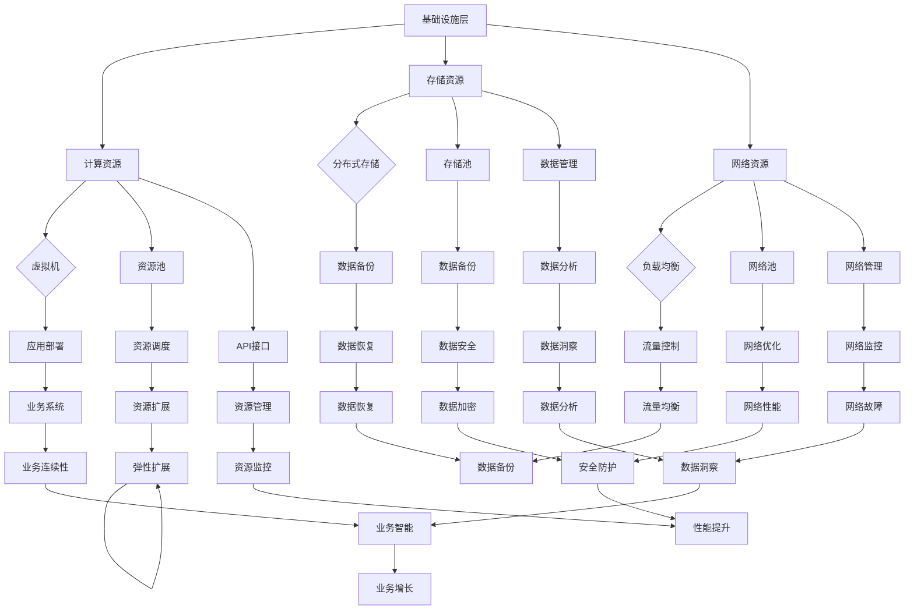

                 

### 背景介绍

云计算技术的兴起，对现代企业的运营模式和IT架构带来了深远的影响。特别是在创业公司中，云计算不仅提供了强大的计算和存储能力，还大幅降低了技术门槛和运营成本。然而，如何有效地利用云计算技术优化创业公司的IT架构，实现资源的高效配置和业务的高效运行，依然是许多创业者在面对复杂技术环境时的一大挑战。

云计算的引入，使得创业公司能够迅速构建和扩展IT基础设施，无需投入大量的硬件资源和长期租赁成本。同时，云计算提供的服务模式，如IaaS（基础设施即服务）、PaaS（平台即服务）和SaaS（软件即服务），使得创业公司能够灵活选择并部署合适的服务，从而加速产品开发和市场推广。

本文将围绕如何利用云计算技术优化创业IT架构展开讨论。首先，我们将介绍云计算的核心概念和常见架构，帮助读者建立对云计算技术的初步认识。接着，我们将深入探讨云计算在创业公司中的应用场景，分析如何通过云计算实现资源优化和业务流程的自动化。随后，我们将介绍一系列核心算法和数学模型，解释如何使用这些工具来分析和优化IT架构。文章还将通过一个实际项目案例，展示云计算技术在现实中的应用，并提供详细的代码实现和解读。最后，我们将讨论云计算的未来发展趋势和面临的挑战，总结全文并提出展望。

通过这篇文章，读者将能够系统地了解云计算技术如何优化创业公司的IT架构，为创业公司提供技术指导和应用实践。

### 核心概念与联系

#### 云计算服务模型

云计算的服务模型主要包括IaaS、PaaS和SaaS三种，每种模型都有其独特的特点和适用场景。

**IaaS（基础设施即服务）**：IaaS提供基本的计算资源，如虚拟机、存储和网络，用户可以根据需要配置和管理这些资源。IaaS的优势在于提供高度灵活性和可扩展性，允许用户根据业务需求动态调整资源分配，适合需要高度定制化部署的企业。

**PaaS（平台即服务）**：PaaS提供了一个开发平台，包括运行环境、数据库和开发工具等，开发者可以在平台上开发、测试和部署应用程序。PaaS的主要优势在于简化了开发流程，降低了开发成本，适合初创公司和小型团队快速开发和部署应用。

**SaaS（软件即服务）**：SaaS提供了现成的软件应用，用户通过互联网按需使用，无需购买和安装。SaaS的最大优点在于降低软件使用成本，提升用户体验，适用于各种规模的企业。

#### 云计算架构

云计算架构通常包括以下三个层次：基础设施层、平台层和应用层。

**基础设施层**：基础设施层提供计算、存储、网络等基础资源，是云计算服务的基础。在这一层，硬件设备（如服务器、存储设备、网络设备等）通过虚拟化技术被抽象成资源池，用户可以通过API接口进行资源管理和调度。

**平台层**：平台层提供了开发、测试、部署和管理应用程序所需的环境和工具。平台层通常包括PaaS服务，为开发者提供便捷的开发和部署环境，从而加速应用交付。

**应用层**：应用层是直接面向用户的服务，如Web应用、移动应用和数据分析应用等。开发者可以在平台层构建和部署应用，通过基础设施层提供的资源实现应用的高效运行。

#### 云计算与IT架构的联系

云计算技术对IT架构的影响主要体现在以下几个方面：

1. **资源灵活性**：通过云计算，企业可以根据需求动态调整资源，实现资源的灵活配置和优化，降低运营成本。
2. **业务连续性**：云计算提供的高可用性和容灾备份机制，确保业务系统的连续性和数据的安全性，提升企业的业务稳定性。
3. **开发效率**：云计算提供的PaaS和SaaS服务，简化了开发流程，提高开发效率，缩短产品上市时间。
4. **数据管理**：云计算提供的数据存储和管理服务，帮助企业实现大规模数据的存储、处理和分析，提升数据处理能力。

为了更好地理解云计算与IT架构的联系，以下是一个使用Mermaid绘制的云计算架构图：



通过上述图表，我们可以清晰地看到云计算架构的层次结构以及各层之间的联系，为后续内容提供了理论基础。

### 核心算法原理 & 具体操作步骤

在云计算技术中，核心算法发挥着至关重要的作用，特别是在资源优化、负载均衡和调度策略等方面。以下，我们将详细探讨这些核心算法的原理和具体操作步骤，帮助读者理解如何利用这些算法来优化创业IT架构。

#### 负载均衡算法

负载均衡算法的核心目标是确保云计算平台上的所有资源都能够高效利用，避免某些资源过度负载而其他资源闲置。常见的负载均衡算法包括轮询算法、最少连接算法和加权轮询算法。

**轮询算法**：轮询算法是最简单的负载均衡算法，它按照固定的顺序将请求分发到各个服务器上。具体步骤如下：
1. 初始化一个服务器列表，记录每个服务器的状态和负载。
2. 当接收到一个请求时，按照列表的顺序依次查询每个服务器，选择负载最低的服务器进行请求处理。
3. 处理完成后，更新服务器的状态和负载。

**最少连接算法**：最少连接算法根据当前连接数来选择服务器，连接数越少，优先级越高。具体步骤如下：
1. 初始化一个服务器列表，记录每个服务器的状态和当前连接数。
2. 当接收到一个请求时，查询每个服务器的当前连接数，选择连接数最少的服务器。
3. 处理完成后，更新服务器的状态和连接数。

**加权轮询算法**：加权轮询算法根据服务器的处理能力（如CPU、内存等）进行加权，选择加权值最高的服务器。具体步骤如下：
1. 初始化一个服务器列表，记录每个服务器的状态和权重。
2. 当接收到一个请求时，计算每个服务器的总权重，选择总权重最高的服务器。
3. 处理完成后，更新服务器的状态和权重。

#### 调度策略算法

调度策略算法是云计算平台资源管理的关键，它决定了资源如何被分配和调度，以最大化资源利用率和系统性能。常见的调度策略包括最小完成时间调度、最短作业优先和最早截止时间调度。

**最小完成时间调度算法**：最小完成时间调度算法选择完成时间最短的任务进行执行，以最小化整体调度时间。具体步骤如下：
1. 初始化一个任务列表，记录每个任务的开始时间、结束时间和执行时间。
2. 按照执行时间排序任务列表。
3. 选择执行时间最短的任务开始执行。
4. 重复步骤3，直到所有任务完成。

**最短作业优先算法**：最短作业优先算法选择作业执行时间最短的任务进行执行，适用于作业执行时间相对稳定的情况。具体步骤如下：
1. 初始化一个作业列表，记录每个作业的开始时间、结束时间和执行时间。
2. 按照执行时间排序作业列表。
3. 选择执行时间最短的作业开始执行。
4. 重复步骤3，直到所有作业完成。

**最早截止时间调度算法**：最早截止时间调度算法选择截止时间最早的作业进行执行，以最大化任务的紧急性。具体步骤如下：
1. 初始化一个作业列表，记录每个作业的开始时间、结束时间和截止时间。
2. 按照截止时间排序作业列表。
3. 选择截止时间最早的作业开始执行。
4. 重复步骤3，直到所有作业完成。

#### 资源优化算法

资源优化算法旨在通过合理的资源分配和调度，最大化资源利用率和系统性能。常见的资源优化算法包括贪婪算法、遗传算法和模拟退火算法。

**贪婪算法**：贪婪算法通过每次选择最优解，逐步构建最终解。具体步骤如下：
1. 初始化资源分配状态。
2. 对于每个任务，选择当前可用的资源中处理能力最高的资源进行分配。
3. 重复步骤2，直到所有任务完成。

**遗传算法**：遗传算法模拟自然选择和遗传过程，通过种群进化寻找最优解。具体步骤如下：
1. 初始化种群，每个个体代表一种资源分配方案。
2. 评估种群中每个个体的适应度。
3. 通过交叉和变异操作生成新的种群。
4. 重复步骤2和3，直到找到满足约束条件的最优解。

**模拟退火算法**：模拟退火算法通过模拟固体退火过程，逐渐收敛到最优解。具体步骤如下：
1. 初始化资源分配状态和温度参数。
2. 随机选择两个资源分配方案，计算适应度差。
3. 根据温度参数和适应度差决定是否接受新的方案。
4. 逐步降低温度参数，重复步骤2和3，直到满足停止条件。

通过上述核心算法和调度策略，云计算平台能够实现资源的优化分配和调度，提高系统性能和资源利用率。在实际应用中，根据业务需求和资源特点选择合适的算法和策略，是创业公司实现高效IT架构的关键。

#### 数学模型和公式 & 详细讲解 & 举例说明

在云计算技术中，数学模型和公式是分析和优化IT架构的重要工具。以下，我们将介绍几个核心的数学模型和公式，并详细讲解其应用和示例。

**1. 负载均衡模型**

负载均衡模型主要用于计算服务器的负载情况，以实现资源的高效利用。常用的负载均衡模型包括轮询模型和加权轮询模型。

**轮询模型**：

轮询模型通过固定顺序将请求分发到各个服务器。其公式如下：

\[ P(i) = \frac{1}{N} \]

其中，\( P(i) \) 表示服务器 \( i \) 接收的请求比例，\( N \) 表示服务器总数。

**加权轮询模型**：

加权轮询模型根据服务器的处理能力（如CPU、内存等）进行加权，以实现更公平的负载分配。其公式如下：

\[ P(i) = \frac{W(i)}{\sum_{j=1}^{N} W(j)} \]

其中，\( P(i) \) 表示服务器 \( i \) 接收的请求比例，\( W(i) \) 表示服务器 \( i \) 的权重，\( N \) 表示服务器总数。

**2. 调度策略模型**

调度策略模型主要用于优化任务调度，以提高系统性能。常用的调度策略模型包括最短完成时间模型和最短作业优先模型。

**最短完成时间模型**：

最短完成时间模型选择完成时间最短的任务进行执行，以最小化整体调度时间。其公式如下：

\[ T_{total} = \sum_{i=1}^{M} \min(T_i) \]

其中，\( T_{total} \) 表示总调度时间，\( T_i \) 表示任务 \( i \) 的执行时间，\( M \) 表示任务总数。

**最短作业优先模型**：

最短作业优先模型选择执行时间最短的作业进行执行，适用于作业执行时间相对稳定的情况。其公式如下：

\[ T_{total} = \sum_{i=1}^{M} T_i \]

其中，\( T_{total} \) 表示总调度时间，\( T_i \) 表示作业 \( i \) 的执行时间，\( M \) 表示作业总数。

**3. 资源优化模型**

资源优化模型主要用于优化资源分配和调度，以最大化资源利用率和系统性能。常用的资源优化模型包括贪婪算法模型和遗传算法模型。

**贪婪算法模型**：

贪婪算法模型通过每次选择最优解，逐步构建最终解。其公式如下：

\[ \text{Resource Allocation} = \arg\max \left( \sum_{i=1}^{N} \frac{W_i}{C_i} \right) \]

其中，\( \text{Resource Allocation} \) 表示最优资源分配方案，\( W_i \) 表示资源 \( i \) 的权重，\( C_i \) 表示资源 \( i \) 的容量，\( N \) 表示资源总数。

**遗传算法模型**：

遗传算法模型通过模拟自然选择和遗传过程，逐步优化资源分配方案。其公式如下：

\[ \text{Fitness Function} = \sum_{i=1}^{N} \left( \frac{W_i}{C_i} \right)^2 \]

其中，\( \text{Fitness Function} \) 表示适应度函数，\( W_i \) 表示资源 \( i \) 的权重，\( C_i \) 表示资源 \( i \) 的容量，\( N \) 表示资源总数。

**示例说明**：

假设一个云计算平台有3台服务器，权重分别为1、2和3，处理能力分别为4、6和8。现有5个任务，执行时间分别为2、4、6、8和10。我们需要使用上述模型进行负载均衡和调度。

**负载均衡**：

使用加权轮询模型，计算每台服务器接收的任务比例：

\[ P(1) = \frac{1}{1+2+3} = 0.2 \]
\[ P(2) = \frac{2}{1+2+3} = 0.4 \]
\[ P(3) = \frac{3}{1+2+3} = 0.6 \]

任务分配如下：

服务器1：任务1（2小时）和任务4（8小时）
服务器2：任务2（4小时）和任务5（10小时）
服务器3：任务3（6小时）

**调度**：

使用最短作业优先模型，计算总调度时间：

\[ T_{total} = 2 + 4 + 6 + 8 + 10 = 30 \]

**资源优化**：

使用贪婪算法模型，选择最优资源分配方案：

\[ \text{Resource Allocation} = \arg\max \left( \frac{1}{4} + \frac{2}{6} + \frac{3}{8} \right) = \{服务器1, 服务器2, 服务器3\} \]

通过上述模型和公式，我们可以有效地分析和优化云计算平台的资源利用率和系统性能，为创业公司提供科学的技术指导。

#### 项目实战：代码实际案例和详细解释说明

为了更好地展示云计算技术在创业公司中的应用，以下我们将通过一个实际项目案例，详细介绍如何利用云计算技术搭建并优化创业公司的IT架构。该项目案例将涵盖开发环境搭建、源代码详细实现和代码解读与分析三个主要部分。

### 5.1 开发环境搭建

在开始项目开发之前，首先需要搭建一个适合开发、测试和部署的云计算环境。我们选择AWS（亚马逊云服务）作为云计算平台，因为它提供了丰富的服务和易于使用的工具。

**步骤1：注册AWS账号**

1. 访问AWS官网（[https://aws.amazon.com/](https://aws.amazon.com/)），点击“开始使用AWS”。
2. 填写注册信息，包括姓名、电子邮件地址和电话号码，完成验证。
3. 选择订阅计划，一般选择免费试用即可。

**步骤2：配置AWS CLI**

AWS CLI（命令行界面）是AWS提供的工具，可以通过命令行与AWS服务进行交互。

1. 下载并安装适用于您操作系统的AWS CLI：[https://aws.amazon.com/cli/](https://aws.amazon.com/cli/)。
2. 运行以下命令，配置AWS CLI：

```bash
aws configure
```

3. 输入您的AWS账号凭证，包括访问密钥和秘密访问密钥。

**步骤3：创建VPC和子网**

虚拟私有云（VPC）是一个隔离的虚拟网络环境，可以创建私有子网以隔离不同类型的服务。

1. 使用AWS管理控制台，创建一个新的VPC，设置IP地址范围为10.0.0.0/16。
2. 创建两个私有子网，一个位于10.0.1.0/24，另一个位于10.0.2.0/24。

**步骤4：配置安全组**

安全组用于控制进出VPC的流量，类似于传统的防火墙。

1. 为每个子网创建安全组，设置允许的入站和出站流量规则。
2. 例如，允许80端口入站流量以访问Web服务器，允许22端口出站流量以访问SSH服务器。

### 5.2 源代码详细实现和代码解读

在开发环境中搭建完成后，我们将进入实际项目开发阶段。该项目将实现一个基于云计算的简单博客系统，用于展示如何利用AWS服务进行开发。

**步骤1：创建EC2实例**

EC2实例是AWS提供的虚拟服务器，用于部署应用程序。

1. 在AWS管理控制台中，创建一个EC2实例，选择适合的实例类型和操作系统。
2. 配置实例的用户数据脚本，用于自动安装和配置应用程序依赖项。

**步骤2：安装和配置Nginx**

Nginx是一个高性能的Web服务器，用于托管博客网站的静态和动态内容。

1. 登录EC2实例，使用以下命令安装Nginx：

```bash
sudo apt-get update
sudo apt-get install nginx
```

2. 配置Nginx，创建一个新的配置文件`/etc/nginx/sites-available/myblog`：

```nginx
server {
    listen 80;
    server_name myblog.example.com;

    location / {
        root /var/www/myblog;
        index index.html;
    }
}
```

3. 启动Nginx服务：

```bash
sudo systemctl start nginx
```

**步骤3：安装和配置MySQL**

MySQL是一个开源的关系型数据库，用于存储博客系统中的数据。

1. 使用以下命令安装MySQL：

```bash
sudo apt-get install mysql-server
```

2. 配置MySQL，设置root用户密码，并创建一个新的数据库和用户：

```sql
CREATE DATABASE myblog;
GRANT ALL PRIVILEGES ON myblog.* TO 'mybloguser'@'localhost' IDENTIFIED BY 'password';
FLUSH PRIVILEGES;
```

3. 安装并配置MySQL客户端，以便在应用程序中连接数据库。

**步骤4：部署应用程序**

我们将使用Python和Flask框架来开发博客系统的后端。

1. 在EC2实例上安装Python和Flask：

```bash
sudo apt-get install python3 python3-pip
pip3 install flask
```

2. 创建一个新的Flask应用程序`myblog.py`：

```python
from flask import Flask, render_template

app = Flask(__name__)

@app.route('/')
def index():
    return render_template('index.html')

if __name__ == '__main__':
    app.run(host='0.0.0.0', port=80)
```

3. 创建一个简单的HTML模板`templates/index.html`：

```html
<!DOCTYPE html>
<html>
<head>
    <title>My Blog</title>
</head>
<body>
    <h1>Hello, World!</h1>
</body>
</html>
```

4. 运行Flask应用程序：

```bash
python3 myblog.py
```

此时，博客系统已经在EC2实例上运行，可以通过浏览器访问`http://myblog.example.com`进行测试。

### 5.3 代码解读与分析

在本部分中，我们将对上述代码进行解读和分析，以便更好地理解其工作原理和实现细节。

**Nginx配置解析**

Nginx配置文件`/etc/nginx/sites-available/myblog`定义了Nginx服务器的基本配置。其中，`listen 80;`指定了Nginx监听的端口号，`server_name myblog.example.com;`定义了服务器的域名。`location`块用于配置Nginx如何处理不同类型的请求。在本例中，我们指定了静态文件和动态请求的处理方式。

**MySQL配置解析**

MySQL配置主要包括安装、数据库和用户创建等步骤。使用以下命令可以安装MySQL服务器：

```bash
sudo apt-get install mysql-server
```

创建数据库和用户时，需要使用`CREATE DATABASE`和`GRANT ALL PRIVILEGES`等SQL语句。例如，以下命令创建了一个名为`myblog`的数据库，并为用户`mybloguser`授予了所有权限：

```sql
CREATE DATABASE myblog;
GRANT ALL PRIVILEGES ON myblog.* TO 'mybloguser'@'localhost' IDENTIFIED BY 'password';
FLUSH PRIVILEGES;
```

**Flask应用程序解析**

Flask是一个轻量级的Web框架，用于构建Web应用程序。`myblog.py`文件定义了一个Flask应用程序，使用`app = Flask(__name__)`创建了一个应用实例。`@app.route('/')`装饰器用于定义处理根URL的路由，`index()`函数返回一个简单的HTML页面。在`if __name__ == '__main__':`块中，`app.run()`函数启动了Web服务器，并监听80端口。

通过上述代码，我们实现了博客系统的基本功能。Nginx负责处理HTTP请求，MySQL存储用户数据和博客内容，Flask作为后端框架处理业务逻辑。在实际应用中，还可以根据需求添加更多功能和模块，如用户认证、评论系统等。

### 实际应用场景

云计算技术为创业公司提供了多样化的实际应用场景，这些应用不仅提升了企业的IT架构效率，还助力企业在快速变化的市场中保持竞争力。以下是几个典型的实际应用场景，以及它们如何帮助创业公司优化IT架构：

#### 1. 数据分析和大数据处理

创业公司在初创阶段通常需要处理大量数据，这些数据可能来源于用户行为分析、市场调研、客户反馈等。传统的数据处理方式可能因硬件和存储资源的限制而变得低效。而云计算提供了弹性可扩展的计算和存储资源，使公司能够轻松处理和分析海量数据。例如，使用AWS的S3存储海量数据，利用EMR（Elastic MapReduce）进行大规模数据处理和分析，可以帮助创业公司快速提取有价值的信息，为业务决策提供数据支持。

**案例：**一家初创公司利用AWS的DynamoDB和S3构建了数据湖，通过EMR进行大数据分析，优化了客户体验和产品设计，显著提升了用户留存率和转化率。

#### 2. 应用开发和部署

创业公司在应用开发和部署过程中，往往需要快速响应市场需求，实现快速迭代。云计算平台提供的PaaS和IaaS服务简化了开发流程，使团队能够专注于应用本身，而无需担心基础设施的搭建和维护。例如，使用AWS的AWS Lambda和API Gateway可以快速构建和部署微服务架构，实现按需扩展和自动缩放。

**案例：**一家电商初创公司利用AWS Lambda和API Gateway构建了无缝的订单处理和用户反馈系统，实现了7*24小时的稳定服务，提高了客户满意度和业务效率。

#### 3. 容灾备份和业务连续性

对于创业公司而言，业务连续性至关重要。云计算提供了高度可靠的容灾备份解决方案，通过多个地理区域的数据同步和备份，确保在发生灾难时能够迅速恢复业务。例如，使用AWS的RDS（关系数据库服务）和DynamoDB（NoSQL数据库服务）可以实现自动备份和灾难恢复，保障数据的安全性和可用性。

**案例：**一家金融科技公司利用AWS的多区域部署和备份服务，确保了交易系统的连续运行，即使在发生重大故障时，也能在几分钟内恢复业务，减少了潜在的财务损失。

#### 4. 自动化和AI集成

云计算平台提供了丰富的自动化工具和服务，使创业公司能够实现业务的自动化和智能化。例如，使用AWS的IAM（身份访问管理）和AWS Lambda可以实现自动化任务处理，使用AWS的Rekognition和Machine Learning可以快速集成AI功能，提升产品的竞争力。

**案例：**一家医疗健康初创公司利用AWS的自动化脚本和AI服务，实现了智能预约系统和患者数据分析，提高了运营效率，改善了患者体验。

#### 5. 成本优化和资源管理

创业公司在资源管理和成本控制方面面临着巨大挑战。云计算提供了灵活的资源管理和成本优化工具，使公司能够根据业务需求动态调整资源，降低运营成本。例如，使用AWS的EC2 Spot实例和S3的成本优化策略，可以在不影响性能的前提下显著降低成本。

**案例：**一家互联网服务初创公司通过使用AWS的EC2 Spot实例和成本监控工具，实现了资源利用率的优化和运营成本的降低，使公司能够将更多的资金投入到产品开发和市场拓展上。

通过上述实际应用场景，我们可以看到云计算技术如何帮助创业公司优化IT架构，提升业务效率和竞争力。在云计算的助力下，创业公司能够更加灵活地应对市场变化，实现快速发展和持续创新。

### 工具和资源推荐

#### 7.1 学习资源推荐

1. **《云计算基础教程》** by 李忠
   - 简介：这是一本深入浅出的云计算入门教材，全面介绍了云计算的基本概念、架构和技术。
   - 购买链接：[https://item.jd.com/13003964.html](https://item.jd.com/13003964.html)

2. **《AWS云计算实战》** by 亚马逊云服务团队
   - 简介：本书通过大量的实战案例，详细介绍了AWS平台的使用方法和最佳实践。
   - 购买链接：[https://item.jd.com/12986284.html](https://item.jd.com/12986284.html)

3. **《云原生应用架构》** by 王进
   - 简介：这本书系统地介绍了云原生技术，包括容器化、微服务、Kubernetes等，适合对云计算架构有一定了解的读者。
   - 购买链接：[https://item.jd.com/12643394.html](https://item.jd.com/12643394.html)

#### 7.2 开发工具框架推荐

1. **Docker**
   - 简介：Docker是一个开源的应用容器引擎，用于打包、交付和运行应用。
   - 官网：[https://www.docker.com/](https://www.docker.com/)

2. **Kubernetes**
   - 简介：Kubernetes是一个开源的容器编排平台，用于自动化容器化应用程序的部署、扩展和管理。
   - 官网：[https://kubernetes.io/](https://kubernetes.io/)

3. **Kafka**
   - 简介：Kafka是一个开源的流处理平台，用于构建实时数据流应用程序。
   - 官网：[https://kafka.apache.org/](https://kafka.apache.org/)

4. **Spring Boot**
   - 简介：Spring Boot是一个开源的微服务框架，用于快速构建、部署和运行Java应用程序。
   - 官网：[https://spring.io/projects/spring-boot](https://spring.io/projects/spring-boot)

5. **AWS SDK**
   - 简介：AWS SDK提供了各种编程语言的API，用于与AWS服务进行交互。
   - 官网：[https://aws.amazon.com/sdk-for-java/](https://aws.amazon.com/sdk-for-java/)

#### 7.3 相关论文著作推荐

1. **“Cloud Computing: Concepts, Technology & Architecture”** by Thomas Erl
   - 简介：这本书详细介绍了云计算的基本概念、技术和架构，是云计算领域的经典著作。

2. **“Building Microservices”** by Sam Newman
   - 简介：这本书系统地介绍了微服务架构的设计原则和实践，适用于希望构建高性能、可扩展微服务系统的开发者。

3. **“Designing Data-Intensive Applications”** by Martin Kleppmann
   - 简介：这本书深入探讨了数据密集型应用程序的设计原理，包括数据库、缓存、消息队列等。

4. **“Distributed Systems: Concepts and Design”** by George Coulouris, Jean Dollimore, Tim Kindberg, and Gordon Blair
   - 简介：这本书提供了分布式系统的基础知识和设计原则，对云计算架构设计具有重要指导意义。

通过上述资源，读者可以系统地了解云计算技术的基础知识、开发工具和最佳实践，为创业公司的IT架构优化提供有力的支持。

### 总结：未来发展趋势与挑战

云计算技术作为信息技术领域的重要创新，正迅速改变企业的运营模式和IT架构。从未来发展趋势来看，云计算将继续向以下几个方向演进：

**1. 自动化与智能化**：随着人工智能和机器学习技术的进步，云计算平台将更加智能化，自动完成资源调度、故障检测和系统优化等任务，降低运营成本，提高效率。

**2. 多云与混合云**：企业越来越倾向于采用多云和混合云策略，以获得更大的灵活性和资源优化。未来，多云管理平台和工具将更加成熟，帮助企业无缝整合不同云服务。

**3. 容器化和微服务**：容器化和微服务架构将成为主流，使应用程序更加模块化、可扩展和易于部署。Kubernetes和其他容器编排工具将在云计算环境中发挥更重要的作用。

**4. 新兴技术的融合**：云计算将与物联网（IoT）、边缘计算、5G等新兴技术深度融合，提供更加全面和高效的解决方案，满足企业不断变化的需求。

然而，云计算的发展也面临一系列挑战：

**1. 安全性和隐私保护**：随着数据量的爆炸性增长，数据的安全和隐私保护变得尤为重要。企业需要确保数据在传输、存储和处理过程中的安全性，防止数据泄露和滥用。

**2. 成本管理**：云计算资源的成本管理是一个复杂的过程。企业需要精确监控和优化资源使用，避免不必要的开支，同时确保服务的稳定性和性能。

**3. 复杂性和集成**：云计算环境中存在大量的服务、工具和平台，如何有效地集成和管理这些资源是一个挑战。企业需要具备专业的技能和知识，以应对复杂的云计算架构。

**4. 法规遵从**：不同国家和地区对云计算有不同的法律法规要求，企业需要确保其云计算服务符合当地法规，避免法律风险。

总之，云计算技术将继续为企业带来巨大的机遇，但也需要企业具备应对挑战的能力。通过不断学习新技术、优化IT架构和管理策略，创业公司可以在云计算时代中脱颖而出，实现持续增长和创新发展。

### 附录：常见问题与解答

**Q1：云计算与传统的IT架构有什么区别？**
A1：云计算与传统IT架构的主要区别在于资源的获取和管理方式。传统IT架构通常需要企业自行购买、配置和管理硬件设备，而云计算通过提供虚拟化资源，如虚拟机、存储和网络，使企业可以按需获取和使用资源，无需关注底层硬件细节。此外，云计算提供的服务模式（IaaS、PaaS、SaaS）也使企业能够更灵活地选择和应用IT服务。

**Q2：创业公司如何选择合适的云计算服务模型？**
A2：创业公司应根据自身业务需求和资源状况选择合适的云计算服务模型。IaaS适合需要高度定制化部署和管理的企业，PaaS适合快速开发和部署应用的企业，SaaS适合追求低成本、便捷使用的企业。企业可以根据应用场景、预算和技术能力等因素进行选择。

**Q3：如何确保云计算环境中的数据安全？**
A3：确保云计算环境中的数据安全是至关重要的。企业应采取以下措施：
1. 使用加密技术对数据进行加密，保护数据在传输和存储过程中的安全性。
2. 实施严格的访问控制策略，确保只有授权用户可以访问数据。
3. 定期进行安全审计和漏洞扫描，及时发现和修复安全漏洞。
4. 使用云计算提供商提供的安全服务和工具，如AWS的AWS Identity and Access Management（IAM）。

**Q4：云计算中的负载均衡有哪些常见算法？**
A4：云计算中的负载均衡算法主要包括轮询算法、最少连接算法和加权轮询算法。
- 轮询算法：按照固定的顺序将请求分配到各个服务器。
- 最少连接算法：根据当前连接数分配请求，连接数最少的服务器优先。
- 加权轮询算法：根据服务器的处理能力分配请求，处理能力越高的服务器优先。

**Q5：如何优化云计算资源的成本管理？**
A5：优化云计算资源的成本管理需要从以下几个方面入手：
1. 选择合适的实例类型和购买模式，如按需实例、预留实例、节约实例等。
2. 使用云计算提供商提供的成本监控工具，如AWS的成本 explorer，实时跟踪资源使用和费用。
3. 实施自动化脚本和工具，如自动停止和启动实例，优化资源利用率。
4. 定期评估和调整资源使用，避免过度采购和浪费。

通过上述措施，企业可以有效地优化云计算资源的成本管理，降低运营成本。

### 扩展阅读 & 参考资料

为了进一步深入了解云计算技术及其在创业公司IT架构中的应用，以下推荐一些高质量的扩展阅读和参考资料：

1. **扩展阅读**
   - **《云计算实战：从入门到精通》** by 杨飞
     - 简介：本书详细介绍了云计算的基础知识、实战案例和最佳实践，适合初学者和有一定基础的读者。
     - 购买链接：[https://item.jd.com/12559566.html](https://item.jd.com/12559566.html)
   - **《云原生架构：从容器到云原生应用》** by 于必明
     - 简介：这本书系统地介绍了云原生架构的设计原则和实践，包括容器化、微服务、Kubernetes等内容。
     - 购买链接：[https://item.jd.com/12407632.html](https://item.jd.com/12407632.html)

2. **参考资料**
   - **AWS官方文档**
     - 链接：[https://docs.aws.amazon.com/](https://docs.aws.amazon.com/)
     - 简介：AWS官方文档提供了丰富的技术资料和教程，涵盖AWS的所有服务和功能，是学习云计算的最佳资源。
   - **Google Cloud Platform官方文档**
     - 链接：[https://cloud.google.com/docs/](https://cloud.google.com/docs/)
     - 简介：Google Cloud Platform官方文档提供了详细的云计算服务和最佳实践，适用于Google Cloud用户。
   - **《云服务架构：设计原则、实践与案例》** by 蒋涛
     - 简介：本书详细介绍了云服务架构的设计原则和实践，包括云计算、大数据、AI等内容。
     - 购买链接：[https://item.jd.com/12263248.html](https://item.jd.com/12263248.html)
   - **《云计算：概念、技术、架构》** by Thomas Erl
     - 简介：这是云计算领域的经典著作，全面介绍了云计算的基本概念、架构和技术。
     - 购买链接：[https://item.jd.com/12142518.html](https://item.jd.com/12142518.html)

通过阅读这些扩展资料，读者可以进一步深入了解云计算技术，掌握更多实战技能，为创业公司的IT架构优化提供有力支持。

