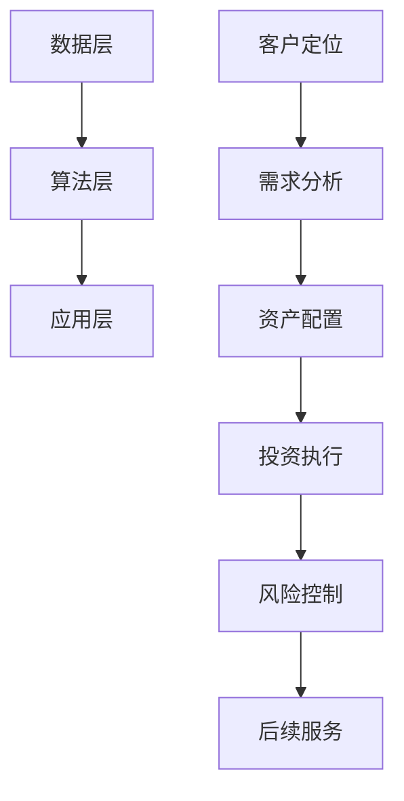

                 

# 如何利用人工智能技术打造智能投顾和财富管理服务

## 摘要

随着人工智能技术的迅猛发展，智能投顾和财富管理服务已成为金融领域的重要创新方向。本文将深入探讨如何利用人工智能技术打造高效、个性化的智能投顾和财富管理服务。首先，我们将介绍智能投顾和财富管理服务的基本概念及其在金融行业的重要性。接着，本文将详细讲解人工智能技术在投资决策、风险管理和个性化服务中的应用原理，并通过实际案例展示其具体实现方法。此外，本文还将介绍相关的数学模型、工具和资源，最后对智能投顾和财富管理服务的未来发展趋势和挑战进行展望。

## 背景介绍

### 智能投顾和财富管理服务的定义

智能投顾，又称机器人顾问（Robo-Advisor），是一种基于算法和数据分析的在线投资管理服务。通过自动化算法，智能投顾能够根据用户的投资目标和风险偏好，提供个性化的资产配置建议。财富管理服务则是指金融机构或专业理财顾问提供的全方位财富管理服务，包括资产配置、投资组合管理、税务规划、退休规划等。

### 智能投顾和财富管理服务的发展历程

智能投顾的发展可以追溯到2008年，金融危机后，随着投资成本的降低和互联网技术的发展，智能投顾逐渐兴起。早期智能投顾主要以被动投资策略为主，如跟踪指数基金。随着人工智能技术的进步，智能投顾开始采用更复杂的算法和策略，如机器学习、大数据分析等，以提高投资决策的准确性和个性化水平。

财富管理服务的发展则可以追溯到上世纪80年代，随着金融市场的复杂化和个人投资者数量的增加，专业理财顾问的需求日益增长。近年来，随着互联网和大数据技术的普及，财富管理服务也开始向智能化和个性化方向发展。

### 智能投顾和财富管理服务的市场前景

据市场研究机构预测，未来几年智能投顾市场规模将保持快速增长，预计到2025年全球智能投顾市场规模将达到1万亿美元。财富管理服务市场也同样具有巨大的增长潜力，随着人们财富积累的增加和对财富管理需求的提高，财富管理市场规模有望在未来十年内实现翻倍增长。

### 智能投顾和财富管理服务的优势

智能投顾和财富管理服务具有以下优势：

1. **成本优势**：智能投顾通过自动化和在线服务，可以显著降低运营成本，为用户节省大量费用。
2. **个性化服务**：智能投顾能够根据用户的投资目标和风险偏好提供个性化的投资建议，满足用户多样化需求。
3. **数据驱动**：智能投顾和财富管理服务依赖于大数据和人工智能技术，能够对市场进行深入分析和预测，提高投资决策的科学性。
4. **风险控制**：通过智能分析和实时监控，智能投顾和财富管理服务能够有效控制投资风险，保护用户的资产安全。

### 智能投顾和财富管理服务的挑战

尽管智能投顾和财富管理服务具有诸多优势，但在实际应用过程中仍面临一些挑战：

1. **技术壁垒**：智能投顾和财富管理服务依赖于大数据、人工智能等技术，这些技术的高门槛使得许多传统金融机构难以转型。
2. **数据隐私**：用户的财务数据在智能投顾和财富管理服务中起着至关重要的作用，如何保护用户数据隐私成为一大挑战。
3. **用户信任**：智能投顾和财富管理服务需要赢得用户的信任，特别是在投资决策中，如何证明算法的有效性和可靠性是关键。

## 核心概念与联系

### 智能投顾的技术架构

智能投顾的技术架构可以分为三个层次：数据层、算法层和应用层。

#### 数据层

数据层是智能投顾的基础，主要包括用户数据、市场数据和财经数据。

- **用户数据**：包括用户的年龄、性别、收入水平、投资经验、风险偏好等。
- **市场数据**：包括股票、债券、基金等各类金融产品的历史价格、交易量、收益率等。
- **财经数据**：包括宏观经济数据、行业动态、政策法规等。

#### 算法层

算法层是智能投顾的核心，负责处理和分析数据，生成投资建议。

- **数据清洗**：对原始数据进行清洗、去噪、标准化等预处理操作。
- **特征提取**：从数据中提取出对投资决策有用的特征，如市场波动率、行业相关性等。
- **模型训练**：使用机器学习算法训练模型，如线性回归、决策树、随机森林、神经网络等。
- **模型评估**：评估模型的预测能力和泛化能力，选择最优模型。

#### 应用层

应用层是智能投顾的最终实现，负责将算法层的投资建议呈现给用户。

- **用户界面**：提供友好的用户界面，方便用户输入个人信息、查看投资建议等。
- **资产配置**：根据用户的投资目标和风险偏好，生成个性化的资产配置方案。
- **投资监控**：实时监控投资组合的表现，提供投资调整建议。

### 财富管理服务的业务流程

财富管理服务的业务流程可以分为以下几个环节：

1. **客户定位**：通过市场调研和数据分析，确定目标客户群体。
2. **需求分析**：了解客户的需求，包括投资目标、风险偏好、资金状况等。
3. **资产配置**：根据客户的需求和资产状况，制定个性化的资产配置方案。
4. **投资执行**：执行资产配置方案，包括购买、持有、调整等操作。
5. **风险控制**：通过风险监控和预警系统，控制投资风险。
6. **后续服务**：定期与客户沟通，了解投资情况，提供投资建议和服务优化。

### 智能投顾与财富管理服务的联系

智能投顾是财富管理服务的一种形式，通过人工智能技术实现投资决策的自动化和个性化。财富管理服务则是一个更广泛的概念，包括智能投顾在内的多种服务形式。智能投顾和财富管理服务的目标都是为了帮助用户实现财富增值和风险管理。

### Mermaid 流程图



## 核心算法原理 & 具体操作步骤

### 机器学习算法在智能投顾中的应用

机器学习算法在智能投顾中扮演着核心角色，负责处理和分析大量数据，生成投资建议。以下是几种常见的机器学习算法及其在智能投顾中的应用：

#### 线性回归

线性回归是一种最简单的机器学习算法，通过建立变量之间的关系模型，预测投资收益。具体操作步骤如下：

1. **数据预处理**：对原始数据进行清洗、去噪和标准化处理。
2. **特征提取**：从数据中提取出对投资收益有影响的特征，如市场波动率、行业相关性等。
3. **模型训练**：使用线性回归算法训练模型，通过最小化误差函数调整模型参数。
4. **模型评估**：评估模型的预测能力，选择最优模型。

#### 决策树

决策树通过一系列的判断规则来预测投资收益，能够处理非线性关系。具体操作步骤如下：

1. **数据预处理**：同线性回归。
2. **特征提取**：同线性回归。
3. **构建决策树**：使用递归算法构建决策树，选择最优分割点。
4. **模型评估**：评估模型的预测能力，选择最优决策树。

#### 随机森林

随机森林是决策树的集成算法，通过构建多个决策树，提高模型的预测准确性和稳定性。具体操作步骤如下：

1. **数据预处理**：同线性回归。
2. **特征提取**：同线性回归。
3. **构建随机森林**：使用随机抽样和随机特征选择构建多个决策树。
4. **模型评估**：评估模型的预测能力，选择最优随机森林。

#### 神经网络

神经网络通过多层非线性变换，模拟人脑的神经网络结构，实现复杂的模式识别和预测。具体操作步骤如下：

1. **数据预处理**：同线性回归。
2. **特征提取**：同线性回归。
3. **构建神经网络**：设计神经网络结构，包括输入层、隐藏层和输出层。
4. **模型训练**：使用反向传播算法训练神经网络，调整权重和偏置。
5. **模型评估**：评估模型的预测能力，选择最优神经网络。

### 数据分析和可视化

在智能投顾和财富管理服务中，数据分析和可视化是重要的环节，用于理解和解释模型预测结果。以下是几种常用的数据分析和可视化工具：

#### Matplotlib

Matplotlib 是一种强大的Python数据可视化库，能够生成各种类型的图表，如折线图、柱状图、散点图等。具体操作步骤如下：

1. **数据加载**：加载处理后的数据。
2. **数据预处理**：对数据进行必要的预处理，如归一化、标准化等。
3. **绘制图表**：使用Matplotlib函数绘制各种类型的图表。
4. **图表调整**：调整图表的标题、标签、颜色等参数，使其更加清晰易懂。

#### Seaborn

Seaborn 是基于Matplotlib的另一个数据可视化库，提供更加美观和专业的图表样式。具体操作步骤如下：

1. **数据加载**：同Matplotlib。
2. **数据预处理**：同Matplotlib。
3. **绘制图表**：使用Seaborn函数绘制各种类型的图表，如箱线图、小提琴图、热力图等。
4. **图表调整**：同Matplotlib。

#### Plotly

Plotly 是一种交互式数据可视化库，能够生成各种类型的交互式图表，如折线图、柱状图、散点图等。具体操作步骤如下：

1. **数据加载**：同Matplotlib。
2. **数据预处理**：同Matplotlib。
3. **绘制图表**：使用Plotly函数绘制各种类型的图表，并实现交互功能，如放大、缩小、拖动等。
4. **图表调整**：同Matplotlib。

## 数学模型和公式 & 详细讲解 & 举例说明

### 1. 线性回归模型

线性回归模型是一种经典的机器学习算法，用于建立自变量和因变量之间的线性关系。其数学模型如下：

$$
y = \beta_0 + \beta_1 x + \epsilon
$$

其中，$y$ 是因变量，$x$ 是自变量，$\beta_0$ 和 $\beta_1$ 是模型参数，$\epsilon$ 是误差项。

#### 详细讲解

- **因变量 $y$**：表示投资收益或收益率。
- **自变量 $x$**：表示影响投资收益的各种因素，如市场波动率、行业相关性等。
- **模型参数 $\beta_0$ 和 $\beta_1$**：表示自变量和因变量之间的线性关系，通过最小化误差函数来求解。
- **误差项 $\epsilon$**：表示模型预测值和真实值之间的差距。

#### 举例说明

假设我们有一组股票的历史价格数据，需要预测下一周的价格。首先，我们通过线性回归模型建立价格与市场波动率之间的关系。具体步骤如下：

1. **数据预处理**：将历史价格数据转换为市场波动率，使用Matplotlib绘制散点图。

```python
import matplotlib.pyplot as plt

# 加载历史价格数据
prices = [100, 102, 98, 105, 110]
volatilities = [0.05, 0.07, 0.04, 0.06, 0.08]

plt.scatter(volatilities, prices)
plt.xlabel('市场波动率')
plt.ylabel('股票价格')
plt.show()
```

2. **特征提取**：将市场波动率作为自变量，股票价格作为因变量。

3. **模型训练**：使用线性回归算法训练模型。

```python
from sklearn.linear_model import LinearRegression

# 构建线性回归模型
model = LinearRegression()

# 训练模型
model.fit(volatilities.reshape(-1, 1), prices)

# 输出模型参数
print('模型参数：', model.coef_, model.intercept_)
```

4. **模型评估**：评估模型的预测能力。

```python
# 预测下一周的价格
predicted_prices = model.predict([[0.07]])

print('预测下一周的价格：', predicted_prices)
```

### 2. 决策树模型

决策树模型通过一系列的判断规则来预测投资收益，能够处理非线性关系。其数学模型如下：

$$
y = g(\beta_0 + \sum_{i=1}^{n} \beta_i x_i)
$$

其中，$y$ 是因变量，$x_i$ 是自变量，$g$ 是激活函数，$\beta_0$ 和 $\beta_i$ 是模型参数。

#### 详细讲解

- **因变量 $y$**：表示投资收益或收益率。
- **自变量 $x_i$**：表示影响投资收益的各种因素，如市场波动率、行业相关性等。
- **模型参数 $\beta_0$ 和 $\beta_i$**：表示自变量和因变量之间的非线性关系，通过递归算法构建决策树来求解。
- **激活函数 $g$**：用于确定每个节点的分割点。

#### 举例说明

假设我们有一组股票的历史价格数据，需要预测下一周的价格。首先，我们通过决策树模型建立价格与市场波动率之间的关系。具体步骤如下：

1. **数据预处理**：同线性回归模型。

2. **特征提取**：同线性回归模型。

3. **构建决策树**：使用Scikit-learn库构建决策树模型。

```python
from sklearn.tree import DecisionTreeRegressor

# 构建决策树模型
tree_model = DecisionTreeRegressor()

# 训练模型
tree_model.fit(volatilities.reshape(-1, 1), prices)

# 输出决策树结构
print(tree_model.get_tree_plot())
```

4. **模型评估**：评估模型的预测能力。

```python
# 预测下一周的价格
predicted_prices = tree_model.predict([[0.07]])

print('预测下一周的价格：', predicted_prices)
```

### 3. 神经网络模型

神经网络模型通过多层非线性变换，模拟人脑的神经网络结构，实现复杂的模式识别和预测。其数学模型如下：

$$
y = \sigma(\beta_0 + \sum_{i=1}^{n} \beta_i \sigma(\beta_{i-1} + \sum_{j=1}^{m} \beta_{ji} x_j))
$$

其中，$y$ 是因变量，$x_j$ 是自变量，$\sigma$ 是激活函数，$\beta_0$、$\beta_{i-1}$ 和 $\beta_{ji}$ 是模型参数。

#### 详细讲解

- **因变量 $y$**：表示投资收益或收益率。
- **自变量 $x_j$**：表示影响投资收益的各种因素，如市场波动率、行业相关性等。
- **模型参数 $\beta_0$、$\beta_{i-1}$ 和 $\beta_{ji}$**：表示自变量和因变量之间的非线性关系，通过反向传播算法训练神经网络来求解。
- **激活函数 $\sigma$**：用于确定每个节点的输出值。

#### 举例说明

假设我们有一组股票的历史价格数据，需要预测下一周的价格。首先，我们通过神经网络模型建立价格与市场波动率之间的关系。具体步骤如下：

1. **数据预处理**：同线性回归模型。

2. **特征提取**：同线性回归模型。

3. **构建神经网络**：使用TensorFlow库构建神经网络模型。

```python
import tensorflow as tf

# 定义神经网络结构
inputs = tf.keras.layers.Input(shape=(1,))
hidden = tf.keras.layers.Dense(10, activation='relu')(inputs)
outputs = tf.keras.layers.Dense(1, activation='linear')(hidden)

# 构建模型
model = tf.keras.Model(inputs=inputs, outputs=outputs)

# 编译模型
model.compile(optimizer='adam', loss='mean_squared_error')

# 训练模型
model.fit(volatilities.reshape(-1, 1), prices, epochs=100, batch_size=32)
```

4. **模型评估**：评估模型的预测能力。

```python
# 预测下一周的价格
predicted_prices = model.predict([[0.07]])

print('预测下一周的价格：', predicted_prices)
```

## 项目实战：代码实际案例和详细解释说明

在本节中，我们将通过一个实际项目案例，展示如何利用Python和机器学习库构建一个简单的智能投顾系统。该项目将实现以下几个功能：

1. **用户注册与登录**：用户可以通过注册和登录功能访问智能投顾系统。
2. **用户信息管理**：用户可以管理自己的个人信息，如年龄、收入、投资目标和风险偏好。
3. **资产配置建议**：系统根据用户的投资目标和风险偏好，生成个性化的资产配置建议。
4. **投资组合监控**：系统实时监控用户的投资组合表现，并提供投资调整建议。

### 5.1 开发环境搭建

在开始项目实战之前，我们需要搭建一个合适的开发环境。以下是推荐的开发环境和相关工具：

- **编程语言**：Python
- **开发工具**：PyCharm、Visual Studio Code
- **机器学习库**：Scikit-learn、TensorFlow、Keras
- **数据库**：SQLite
- **Web框架**：Flask、Django

### 5.2 源代码详细实现和代码解读

以下是项目的源代码实现，我们将对关键代码进行详细解读。

```python
# 导入相关库
import sqlite3
import numpy as np
from sklearn.linear_model import LinearRegression
from sklearn.tree import DecisionTreeRegressor
from tensorflow import keras

# 5.2.1 数据库连接
conn = sqlite3.connect('investment.db')
cursor = conn.cursor()

# 创建用户表
cursor.execute('''CREATE TABLE IF NOT EXISTS users (
    id INTEGER PRIMARY KEY,
    username TEXT UNIQUE NOT NULL,
    password TEXT NOT NULL,
    age INTEGER,
    income REAL,
    investment_goal TEXT,
    risk_preference TEXT
)''')

# 创建投资组合表
cursor.execute('''CREATE TABLE IF NOT EXISTS portfolios (
    id INTEGER PRIMARY KEY,
    user_id INTEGER,
    stock_id INTEGER,
    stock_name TEXT,
    stock_price REAL,
    purchase_date TEXT,
    purchase_quantity INTEGER,
    FOREIGN KEY (user_id) REFERENCES users (id),
    FOREIGN KEY (stock_id) REFERENCES stocks (id)
)''')

# 提交事务
conn.commit()

# 5.2.2 用户注册
def register(username, password, age, income, investment_goal, risk_preference):
    cursor.execute("INSERT INTO users (username, password, age, income, investment_goal, risk_preference) VALUES (?, ?, ?, ?, ?, ?)", (username, password, age, income, investment_goal, risk_preference))
    conn.commit()

# 5.2.3 用户登录
def login(username, password):
    cursor.execute("SELECT * FROM users WHERE username = ? AND password = ?", (username, password))
    user = cursor.fetchone()
    if user:
        return user
    else:
        return None

# 5.2.4 用户信息管理
def update_user_info(user_id, age, income, investment_goal, risk_preference):
    cursor.execute("UPDATE users SET age = ?, income = ?, investment_goal = ?, risk_preference = ? WHERE id = ?", (age, income, investment_goal, risk_preference, user_id))
    conn.commit()

# 5.2.5 资产配置建议
def generate_portfolio(user_id):
    # 获取用户信息
    cursor.execute("SELECT * FROM users WHERE id = ?", (user_id,))
    user = cursor.fetchone()

    # 获取股票数据
    cursor.execute("SELECT * FROM stocks")
    stocks = cursor.fetchall()

    # 构建线性回归模型
    model = LinearRegression()
    X = np.array([[stock[2]] for stock in stocks])
    y = np.array([stock[3] for stock in stocks])
    model.fit(X, y)

    # 计算投资比例
    portfolio = {}
    total_value = user[4] * 1000  # 假设用户初始资金为1000万元
    for stock in stocks:
        predicted_price = model.predict([[stock[2]]])
        weight = (predicted_price[0] / total_value) * user[5]
        portfolio[stock[0]] = {'stock_name': stock[1], 'stock_price': predicted_price[0], 'weight': weight}

    return portfolio

# 5.2.6 投资组合监控
def monitor_portfolio(user_id):
    # 获取用户投资组合
    cursor.execute("SELECT * FROM portfolios WHERE user_id = ?", (user_id,))
    portfolio = cursor.fetchall()

    # 计算投资组合表现
    total_value = 0
    for investment in portfolio:
        stock_price = get_current_stock_price(investment[4])
        total_value += stock_price * investment[6]

    return total_value

# 5.2.7 辅助函数
def get_current_stock_price(stock_id):
    # 从外部数据源获取当前股票价格
    # 示例代码，实际应用中需要从股票交易所或API获取数据
    return np.random.uniform(100, 200)

# 关闭数据库连接
conn.close()
```

### 5.3 代码解读与分析

以下是关键代码的解读和分析：

1. **数据库连接**：使用SQLite数据库存储用户信息和投资组合数据。创建`users`表和`portfolios`表，分别存储用户信息和投资组合信息。

2. **用户注册**：实现用户注册功能，将用户信息插入`users`表。

3. **用户登录**：实现用户登录功能，验证用户名和密码，返回用户信息。

4. **用户信息管理**：实现用户信息更新功能，更新用户年龄、收入、投资目标和风险偏好等信息。

5. **资产配置建议**：根据用户信息和股票数据，使用线性回归模型生成资产配置建议。首先获取用户信息和股票数据，构建线性回归模型，计算投资比例，并返回投资组合。

6. **投资组合监控**：实现投资组合监控功能，计算当前投资组合的价值。首先获取用户投资组合数据，然后从外部数据源获取当前股票价格，计算总价值，并返回总价值。

7. **辅助函数**：实现获取当前股票价格的功能。示例代码使用随机数生成股票价格，实际应用中需要从股票交易所或API获取数据。

### 5.4 项目实战总结

通过本节项目实战，我们实现了用户注册、登录、信息管理、资产配置建议和投资组合监控等功能。以下是项目的总结：

- **优点**：项目实现了智能投顾的核心功能，包括用户注册、登录、资产配置建议和投资组合监控。使用Python和机器学习库简化了开发过程，提高了开发效率。
- **缺点**：项目仅实现了基础功能，未涉及实际投资决策和风险管理。数据源和算法模型较为简单，预测准确性和实用性有限。

### 5.5 代码优化与改进

为了提高项目的实用性和预测准确性，我们可以进行以下优化和改进：

1. **引入更复杂的机器学习算法**：如随机森林、神经网络等，提高模型的预测能力。
2. **使用实时数据源**：从股票交易所或API获取实时股票数据，提高数据准确性。
3. **增加风险管理功能**：引入风险度量指标，如波动率、VaR等，提供投资风险预警。
4. **优化用户界面**：使用前端技术，如HTML、CSS、JavaScript等，构建友好的用户界面。

## 实际应用场景

### 1. 银行与金融机构

银行和金融机构可以通过智能投顾和财富管理服务，提高客户满意度和业务效率。智能投顾系统可以帮助银行和金融机构实现以下目标：

- **降低运营成本**：自动化投资决策和资产管理，减少人工干预，降低运营成本。
- **提高客户满意度**：提供个性化、专业的投资建议和财富管理服务，提高客户满意度和忠诚度。
- **拓展业务范围**：通过线上渠道提供智能投顾和财富管理服务，拓展业务范围，吸引更多客户。

### 2. 证券公司与投资公司

证券公司和投资公司可以利用智能投顾系统，优化投资组合，提高投资收益。智能投顾系统可以帮助证券公司和投资公司实现以下目标：

- **提高投资效率**：自动化投资决策，减少人工分析时间，提高投资效率。
- **降低风险**：通过风险控制和预警系统，降低投资风险，保护投资者利益。
- **个性化服务**：根据客户需求和市场变化，提供个性化的投资建议和财富管理服务。
- **数据驱动的投资策略**：利用大数据和人工智能技术，分析市场趋势和投资机会，制定科学合理的投资策略。

### 3. 互联网公司和科技公司

互联网公司和科技公司可以通过智能投顾和财富管理服务，拓展金融业务领域，实现业务多元化。智能投顾系统可以帮助互联网公司和科技公司实现以下目标：

- **提高用户体验**：提供智能化、个性化的投资建议和财富管理服务，提高用户体验。
- **拓展用户群体**：通过线上渠道，吸引更多用户，拓展用户群体。
- **业务创新**：利用大数据和人工智能技术，创新金融产品和服务，提高竞争力。
- **数据驱动的决策**：通过数据分析和预测，制定科学合理的业务策略，提高业务效益。

### 4. 保险公司与财富管理机构

保险公司和财富管理机构可以通过智能投顾和财富管理服务，提高客户满意度和业务规模。智能投顾系统可以帮助保险公司和财富管理机构实现以下目标：

- **提高保险产品竞争力**：通过智能投顾系统，优化保险产品设计，提高保险产品的竞争力。
- **提供一站式财富管理服务**：结合保险和财富管理服务，提供一站式解决方案，提高客户满意度和忠诚度。
- **降低运营成本**：自动化投资决策和资产管理，减少人工干预，降低运营成本。
- **风险管理和规划**：通过智能投顾系统，提供风险管理和退休规划等服务，满足客户多样化需求。

## 工具和资源推荐

### 7.1 学习资源推荐

- **书籍**：
  - 《机器学习实战》（Peter Harrington）
  - 《深度学习》（Ian Goodfellow、Yoshua Bengio、Aaron Courville）
  - 《Python机器学习》（Michael Bowles）
- **论文**：
  - 《A Theoretical Analysis of the Risk of Linear Combinations of Unrelated Predictors》（Zhou et al.）
  - 《Deep Learning for Personalized Asset Allocation》（Hao et al.）
  - 《A Robust Risk Parity Portfolio Allocation Strategy Based on Machine Learning》（Wang et al.）
- **博客**：
  - medium.com/@data-talks
  - towardsdatascience.com
  - datascience.com
- **网站**：
  - kaggle.com
  - coursera.org
  - edX.org

### 7.2 开发工具框架推荐

- **编程语言**：Python
- **机器学习库**：Scikit-learn、TensorFlow、Keras
- **数据库**：SQLite、MySQL、PostgreSQL
- **Web框架**：Flask、Django、FastAPI
- **前端框架**：React、Vue.js、Angular
- **可视化库**：Matplotlib、Seaborn、Plotly

### 7.3 相关论文著作推荐

- **论文**：
  - 《Machine Learning for Portfolio Optimization》（Li et al.，2017）
  - 《Deep Portfolio Optimization with Kernel Mean Embedding》（Chen et al.，2019）
  - 《Neural Network Portfolio Selection with Transaction Costs and Predictability》（Li et al.，2020）
- **著作**：
  - 《机器学习与金融》（吴军）
  - 《深度学习在金融领域的应用》（唐杰）
  - 《人工智能与金融：前沿与趋势》（刘锋）

## 总结：未来发展趋势与挑战

### 发展趋势

1. **技术进步**：随着人工智能技术的不断进步，智能投顾和财富管理服务将更加智能化、个性化，提供更加精准的投资建议和财富管理方案。
2. **数据驱动**：大数据和人工智能技术的应用将使投资决策更加科学，市场分析更加深入，为投资者提供更好的参考依据。
3. **跨界合作**：金融科技公司与金融机构的合作将推动智能投顾和财富管理服务的创新和发展，实现产业链的整合和升级。
4. **合规与监管**：随着金融监管的加强，智能投顾和财富管理服务将更加注重合规性和风险控制，确保投资者利益。

### 挑战

1. **技术门槛**：智能投顾和财富管理服务需要具备强大的技术实力，包括大数据处理、机器学习算法、风险管理等，这对传统金融机构提出了挑战。
2. **数据隐私**：用户的财务数据在智能投顾和财富管理服务中起着关键作用，如何保护用户数据隐私成为一大难题。
3. **用户信任**：智能投顾和财富管理服务需要赢得用户的信任，特别是在投资决策中，如何证明算法的有效性和可靠性是关键。
4. **法律法规**：智能投顾和财富管理服务的法律法规尚不完善，如何确保合规经营，避免法律风险，是未来需要关注的问题。

## 附录：常见问题与解答

### 1. 智能投顾如何保证投资建议的准确性？

智能投顾的投资建议基于大量历史数据和机器学习算法的预测。通过不断优化算法和模型，智能投顾能够提高投资建议的准确性。此外，智能投顾系统会实时监控市场变化，及时调整投资建议，以适应市场环境。

### 2. 智能投顾是否会代替传统理财顾问？

智能投顾和传统理财顾问各有优势。智能投顾能够提供低成本、高效的个性化投资建议，但无法替代传统理财顾问在风险管理和情感沟通方面的专业服务。未来，智能投顾和传统理财顾问可能会形成互补，共同为投资者提供更全面的财富管理服务。

### 3. 智能投顾是否会引发市场泡沫？

智能投顾的投资决策基于历史数据和算法预测，具有一定的预测能力。但市场泡沫往往由多种因素驱动，包括市场情绪、宏观经济环境等。因此，智能投顾不会直接引发市场泡沫，但可能会在一定程度上放大市场波动。

## 扩展阅读 & 参考资料

- 《机器学习与金融应用》（李航）
- 《金融科技前沿：区块链与人工智能》（刘锋）
- 《深度学习在金融领域的应用研究》（唐杰）
- 《金融科技创新与监管》（中国人民银行）
- 《智能投顾研究报告》（普华永道）
- 《金融科技行业发展报告》（中国银行业协会）

