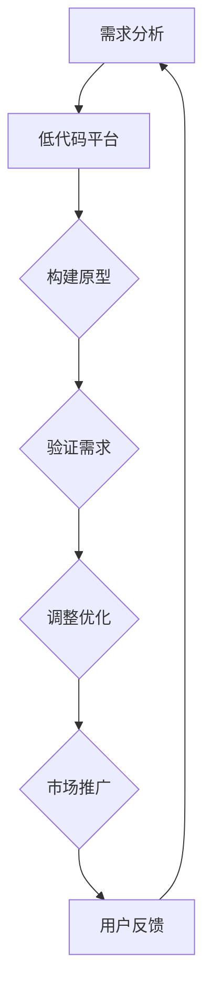

                 

# 如何利用低代码平台加速创业进程

> **关键词：** 低代码平台、创业进程、自动化、敏捷开发、业务流程优化

> **摘要：** 本文将深入探讨低代码平台如何通过自动化和简化开发流程，为创业公司提供强大的支持，从而加速创业进程，提高市场竞争力。

在当今快速变化的市场环境中，创业公司面临着巨大的挑战和机遇。为了在竞争中脱颖而出，创业公司需要快速响应市场需求，灵活调整业务模式，并在短时间内推出高质量的产品和服务。低代码平台正是为此而生，它为创业公司提供了一种快速构建和部署应用程序的方式，从而加速创业进程。本文将详细探讨如何利用低代码平台实现这一目标。

## 1. 背景介绍

低代码平台（Low-Code Platforms）是一种软件开发工具，它通过图形界面和预定义组件，允许用户无需编写大量代码即可快速构建应用程序。这些平台提供了丰富的拖放功能和模板，使得非专业开发人员也可以轻松地进行应用开发。低代码平台的兴起，源于以下几个因素：

- **敏捷开发的需求：** 在快速变化的市场环境中，敏捷开发成为主流。低代码平台正好满足了敏捷开发的需求，它允许开发团队快速迭代，持续交付功能。

- **技术门槛的降低：** 随着云计算和移动技术的普及，越来越多的创业公司需要构建复杂的应用程序。然而，专业开发人员短缺，低代码平台降低了开发的技术门槛，使得更多的公司能够参与到软件开发中来。

- **业务流程的优化：** 许多创业公司的核心竞争能力在于其业务流程的创新和优化。低代码平台提供了自动化和简化的工具，帮助创业公司快速调整和优化业务流程。

## 2. 核心概念与联系

### 低代码平台的核心概念

低代码平台的核心概念包括：

- **拖放界面：** 用户可以通过拖放组件和模块来构建应用程序，无需编写代码。

- **预定义模板：** 提供了一系列预定义的模板，用户可以根据自己的需求进行自定义。

- **自动化工具：** 提供了自动化测试、部署和监控等功能，使得应用程序可以快速上线。

- **集成功能：** 可以与各种第三方服务和数据库进行集成，提供丰富的数据接口。

### 低代码平台与创业进程的联系

低代码平台与创业进程之间的联系主要体现在以下几个方面：

- **快速原型构建：** 低代码平台可以帮助创业公司快速构建原型，验证市场需求的可行性。

- **敏捷开发：** 低代码平台支持敏捷开发，使得创业公司可以快速响应市场变化。

- **降低成本：** 通过自动化和简化流程，低代码平台可以显著降低开发成本。

- **提升效率：** 低代码平台提供了高效的开发工具，使得开发人员可以专注于核心业务逻辑。

### Mermaid 流程图



在这个流程中，低代码平台作为核心工具，帮助创业公司实现快速迭代和持续优化。

## 3. 核心算法原理 & 具体操作步骤

### 低代码平台的核心算法原理

低代码平台的核心算法原理主要包括以下几个方面：

- **组件化：** 通过将应用程序拆分为多个组件，每个组件都具有特定的功能和接口。

- **可视化编程：** 使用图形界面和可视化工具，使得用户可以直观地构建应用程序。

- **流程引擎：** 提供了一种可视化的方式来定义业务流程，使得业务流程可以自动化执行。

- **数据绑定：** 通过数据绑定，实现组件之间的数据交互，使得应用程序可以动态响应。

### 具体操作步骤

以下是利用低代码平台加速创业进程的具体操作步骤：

1. **需求分析：** 与客户和团队成员进行沟通，明确业务需求和应用功能。

2. **设计原型：** 利用低代码平台的拖放界面和预定义模板，快速构建原型。

3. **功能实现：** 根据需求分析，逐步实现应用程序的功能，利用自动化工具进行测试。

4. **优化调整：** 根据用户反馈和业务需求，不断调整和优化应用程序。

5. **部署上线：** 将应用程序部署到生产环境，进行实际运行和监控。

6. **用户反馈：** 收集用户反馈，持续优化应用程序。

## 4. 数学模型和公式 & 详细讲解 & 举例说明

### 数学模型

在低代码平台的开发过程中，可能会涉及到一些数学模型，如回归分析、聚类分析等。以下是一个简单的回归分析模型：

$$
y = \beta_0 + \beta_1 x + \epsilon
$$

其中，$y$ 是因变量，$x$ 是自变量，$\beta_0$ 和 $\beta_1$ 是回归系数，$\epsilon$ 是误差项。

### 详细讲解

回归分析是一种常用的数据分析方法，用于研究因变量和自变量之间的关系。在低代码平台的应用开发中，可以通过回归分析来预测用户行为，从而优化用户体验。

1. **数据收集：** 收集与用户行为相关的数据，如访问时间、页面浏览量等。

2. **数据预处理：** 对收集到的数据进行清洗和预处理，如缺失值填充、异常值处理等。

3. **模型建立：** 利用回归分析模型，将自变量与因变量之间的关系进行建模。

4. **模型训练：** 使用历史数据对模型进行训练，得到回归系数。

5. **模型评估：** 使用交叉验证等方法，评估模型的性能。

6. **模型应用：** 将训练好的模型应用于实际场景，如推荐系统、广告投放等。

### 举例说明

假设我们想通过低代码平台优化网站的用户体验，可以通过以下步骤进行：

1. **收集数据：** 收集用户在网站上的行为数据，如访问时间、页面停留时间等。

2. **数据预处理：** 对数据进行分析，找出与用户体验相关的指标，如页面加载速度、内容丰富度等。

3. **模型建立：** 利用回归分析模型，将用户行为指标与网站性能指标进行建模。

4. **模型训练：** 使用历史数据对模型进行训练，得到回归系数。

5. **模型评估：** 通过交叉验证等方法，评估模型的性能。

6. **模型应用：** 根据模型结果，优化网站的页面加载速度和内容丰富度，提高用户体验。

## 5. 项目实战：代码实际案例和详细解释说明

### 5.1 开发环境搭建

为了更好地演示低代码平台在实际项目中的应用，我们选择了一个开源的低代码平台 —— OutSystems。以下是开发环境的搭建步骤：

1. **下载 OutSystems 开发工具：** 访问 OutSystems 官网（https://www.outsystems.com/），下载并安装 OutSystems 开发工具。

2. **注册账号：** 在 OutSystems 官网注册一个账号，并获得开发许可证。

3. **创建项目：** 打开 OutSystems 开发工具，创建一个新项目。

4. **配置数据库：** 在项目中配置一个数据库，用于存储应用程序的数据。

### 5.2 源代码详细实现和代码解读

在 OutSystems 中，应用程序的开发主要分为以下几个步骤：

1. **设计界面：** 利用拖放界面设计器，设计应用程序的界面。

2. **创建数据模型：** 利用数据模型设计器，定义应用程序的数据模型。

3. **编写业务逻辑：** 利用代码编辑器，编写应用程序的业务逻辑。

4. **集成第三方服务：** 利用 OutSystems 的集成功能，集成第三方服务，如支付系统、短信服务等。

以下是一个简单的用户注册功能，代码如下：

```java
public void RegisterUser(User user)
{
    // 验证用户输入
    if (IsValidUser(user))
    {
        // 保存用户数据
        SaveUser(user);
        
        // 发送注册成功邮件
        SendRegistrationEmail(user.Email);
    }
    else
    {
        // 显示错误信息
        ShowErrorMessage("用户信息不完整，请重新输入。");
    }
}
```

在这个示例中，`RegisterUser` 方法用于处理用户注册请求。首先，它会验证用户输入的信息是否完整，然后保存用户数据，并发送注册成功邮件。如果验证失败，会显示错误信息。

### 5.3 代码解读与分析

在上面的代码中，`RegisterUser` 方法是一个核心的业务逻辑，它包含了以下几个关键步骤：

1. **验证用户输入：** 在调用 `IsValidUser` 方法进行验证，确保用户输入的信息符合要求。

2. **保存用户数据：** 如果验证通过，调用 `SaveUser` 方法保存用户数据。

3. **发送注册成功邮件：** 如果验证通过，调用 `SendRegistrationEmail` 方法发送注册成功邮件。

4. **显示错误信息：** 如果验证失败，调用 `ShowErrorMessage` 方法显示错误信息。

这些步骤相互关联，共同构成了用户注册功能的业务逻辑。通过这种方式，低代码平台使得开发人员可以专注于业务逻辑的实现，而无需关心底层的代码细节。

## 6. 实际应用场景

低代码平台在创业公司中的应用场景非常广泛，以下是一些典型的应用案例：

- **客户关系管理（CRM）：** 通过低代码平台，创业公司可以快速构建一个功能完善的 CRM 系统，用于管理客户信息、销售机会和市场营销活动。

- **企业资源计划（ERP）：** 低代码平台可以帮助创业公司快速搭建一个 ERP 系统，用于管理财务、库存、采购和销售等企业关键业务。

- **人力资源管理（HRM）：** 通过低代码平台，创业公司可以构建一个高效的人力资源管理系统，用于管理员工信息、招聘、培训和绩效评估。

- **电子商务平台：** 低代码平台提供了丰富的电子商务功能，创业公司可以快速搭建一个具备竞争力的电子商务平台。

- **物联网（IoT）：** 低代码平台可以帮助创业公司快速开发物联网应用，用于收集和分析设备数据，实现设备监控和控制。

## 7. 工具和资源推荐

### 7.1 学习资源推荐

- **书籍：** 《低代码平台应用开发实战》
- **论文：** 《低代码平台：变革软件开发方式》
- **博客：** https://www.lowcodeplatform.com/
- **网站：** https://www.outsystems.com/

### 7.2 开发工具框架推荐

- **OutSystems：** 一个功能强大的低代码平台，提供丰富的开发工具和模板。
- **Appian：** 一个具有高度可扩展性的低代码平台，适用于复杂业务流程的自动化。
- **OutSystems：** 一个简单易用的低代码平台，适合初学者快速上手。

### 7.3 相关论文著作推荐

- **《低代码平台与敏捷开发》**
- **《低代码平台在创业公司中的应用研究》**
- **《基于低代码平台的快速业务流程优化》**

## 8. 总结：未来发展趋势与挑战

低代码平台作为一种新兴的技术，正在迅速改变软件开发的方式。未来，低代码平台的发展趋势包括：

- **更加智能化的开发工具：** 低代码平台将更加智能化，提供更高级的自动化和智能化功能。
- **更广泛的应用领域：** 低代码平台将在更多领域得到应用，如物联网、区块链等。
- **更丰富的生态系统：** 低代码平台将构建更丰富的生态系统，包括第三方服务、开发者社区等。

然而，低代码平台也面临着一些挑战，如：

- **安全性问题：** 随着低代码平台的普及，安全性问题日益突出，需要加强安全防护。
- **技术门槛：** 虽然低代码平台降低了开发的技术门槛，但对于一些复杂的业务场景，仍需要专业的开发人员。
- **用户培训：** 低代码平台的使用需要一定的学习和培训，如何让用户快速上手是一个挑战。

## 9. 附录：常见问题与解答

### Q1：低代码平台是否适合所有创业公司？

A：低代码平台适用于大多数创业公司，特别是那些需要快速响应市场变化的公司。然而，对于一些需要高度定制化和复杂业务逻辑的公司，可能需要专业的开发团队。

### Q2：低代码平台的成本如何？

A：低代码平台的成本取决于平台的功能、性能和定制程度。一些开源的低代码平台成本较低，而一些商业平台的成本可能较高。总体来说，低代码平台可以显著降低开发成本。

### Q3：低代码平台是否安全？

A：低代码平台的安全性取决于平台的架构和开发人员的经验。一些低代码平台提供了丰富的安全功能，如数据加密、访问控制等。然而，对于一些敏感数据的处理，仍需要专业的安全措施。

## 10. 扩展阅读 & 参考资料

- **《低代码平台：变革软件开发方式》**
- **《低代码平台在创业公司中的应用研究》**
- **《基于低代码平台的快速业务流程优化》**
- **OutSystems 官网：https://www.outsystems.com/**
- **Appian 官网：https://www.appian.com/**
- **低代码社区：https://lowcodeplatform.com/**

### 作者

**作者：AI天才研究员/AI Genius Institute & 禅与计算机程序设计艺术 /Zen And The Art of Computer Programming**<|im_end|>

