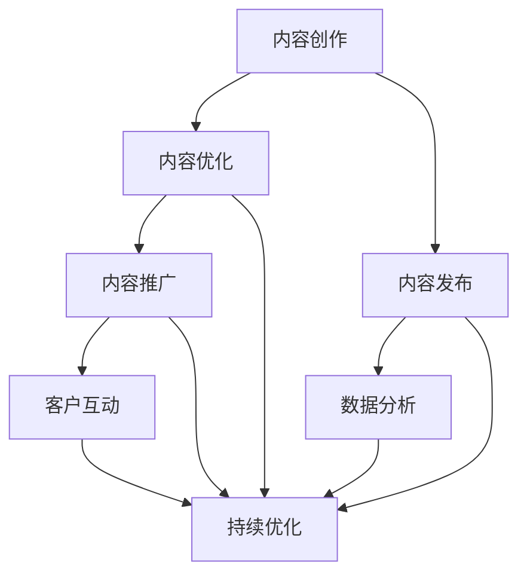

                 

# 如何利用内容营销建立专业权威

## 摘要

在数字化时代，内容营销已成为企业建立专业权威、吸引和留住客户的关键手段。本文将深入探讨如何利用内容营销在IT领域建立专业权威，通过分析核心概念、算法原理、实际应用场景和资源推荐，为读者提供一套系统、实用的内容营销策略。无论您是初创公司还是资深从业者，本文都将为您提供宝贵的启示。

## 1. 背景介绍

随着互联网的普及和信息技术的快速发展，内容营销逐渐成为企业竞争的新战场。根据最新的研究报告，超过90%的B2B marketers将内容营销视为其营销策略的核心。同时，IT行业作为技术创新的前沿，对专业权威的需求尤为强烈。无论是在软件开发、网络安全、大数据处理等领域，建立专业权威不仅有助于提升品牌知名度，还能增强客户信任，从而带来更多的商业机会。

### 1.1 内容营销的重要性

内容营销的重要性体现在以下几个方面：

1. **提升品牌知名度**：高质量的内容可以吸引目标受众的关注，提高品牌曝光度。
2. **增强客户信任**：通过分享专业知识，展示企业的专业能力，客户更愿意与权威企业合作。
3. **降低营销成本**：相比传统广告，内容营销的成本较低，但效果显著。
4. **增加客户忠诚度**：定期发布有价值的内容，可以建立与客户的长期关系，提升客户忠诚度。

### 1.2 IT领域的专业权威

在IT领域，专业权威的建立尤为重要。以下是几个关键点：

1. **技术创新**：不断推出前沿技术，引领行业潮流，是建立专业权威的基础。
2. **技术积累**：通过多年的技术积累，形成独特的核心竞争力。
3. **人才培养**：拥有一支高素质的研发团队，是企业持续创新的关键。
4. **客户案例**：成功案例的积累，是证明企业专业权威的有力证据。

## 2. 核心概念与联系

在内容营销中，核心概念和联系至关重要。以下是一个使用Mermaid绘制的流程图，展示了内容营销的核心概念和联系。



### 2.1 内容创作

内容创作是内容营销的基础，包括文章、博客、视频、PPT等多种形式。在IT领域，技术文章和博客是最常用的内容形式。高质量的内容不仅要具有吸引力，还要具备专业性和实用性。

### 2.2 内容优化

内容优化是提高内容质量和可读性的关键步骤。通过SEO（搜索引擎优化）技术，可以使内容在搜索引擎中排名更高，吸引更多目标受众。

### 2.3 内容发布

内容发布是将内容推送给目标受众的重要环节。选择合适的发布渠道，如博客、社交媒体、邮件列表等，可以最大化内容的影响力。

### 2.4 内容推广

内容推广是通过各种手段，如广告、社交媒体推广、合作伙伴推广等，增加内容的曝光度和受众范围。

### 2.5 数据分析

数据分析是内容营销的重要环节，通过分析用户的阅读行为、互动数据等，可以了解内容的受欢迎程度，为后续的内容创作提供依据。

### 2.6 客户互动

客户互动是建立客户关系的重要手段。通过评论、问答、在线研讨会等形式，与客户建立深度互动，提高客户满意度。

### 2.7 持续优化

持续优化是基于数据分析结果，对内容创作、发布、推广等环节的持续改进。通过不断优化，可以提高内容的质量和效果。

## 3. 核心算法原理 & 具体操作步骤

在内容营销中，核心算法原理和具体操作步骤如下：

### 3.1 搜索引擎优化（SEO）

SEO是指通过一系列技术手段，提高网站在搜索引擎中的排名，从而吸引更多目标用户。具体操作步骤如下：

1. **关键词研究**：通过工具分析目标受众搜索的关键词，确定网站需要优化的关键词。
2. **内容创作**：根据关键词创作高质量、有价值的文章，确保内容与关键词相关。
3. **页面优化**：优化页面标题、描述、关键词密度等，提高页面SEO质量。
4. **内部链接**：建立合理的内部链接结构，提高页面之间的权重传递。
5. **外部链接**：获取高质量的外部链接，提高网站的整体权重。

### 3.2 社交媒体推广

社交媒体推广是通过社交媒体平台，如微博、微信、Facebook等，将内容传播给更广泛的受众。具体操作步骤如下：

1. **确定目标平台**：根据目标受众的特点，选择适合的社交媒体平台。
2. **内容策划**：创作具有吸引力的内容，包括文字、图片、视频等多种形式。
3. **发布时间**：选择用户活跃的时间段发布内容，提高内容的曝光度。
4. **互动营销**：与用户互动，如回复评论、举办线上活动等，提高用户参与度。
5. **数据分析**：分析推广效果，调整策略，提高推广效果。

### 3.3 邮件营销

邮件营销是通过邮件向目标受众发送内容，包括产品信息、行业动态、优惠活动等。具体操作步骤如下：

1. **邮件列表构建**：收集目标受众的邮件地址，建立邮件列表。
2. **邮件内容创作**：创作具有吸引力、有价值的内容，提高打开率和点击率。
3. **邮件发送时间**：选择用户最易接受的时间段发送邮件，提高邮件的阅读率。
4. **跟踪效果**：通过跟踪邮件的打开率、点击率等数据，评估邮件营销效果。

## 4. 数学模型和公式 & 详细讲解 & 举例说明

在内容营销中，数学模型和公式可以帮助我们更好地理解和优化营销策略。以下是一个常见的数学模型——转化率模型，以及它的详细讲解和举例说明。

### 4.1 转化率模型

转化率模型是指通过计算网站访问量与转化量之间的比例，来衡量内容营销的效果。其公式如下：

$$
转化率（C）= \frac{转化量（T）}{访问量（V）} \times 100\%
$$

### 4.2 详细讲解

- **转化量（T）**：指在一定时间内，完成预期目标（如注册、购买、咨询等）的用户数量。
- **访问量（V）**：指在一定时间内，访问网站的独立用户数量。
- **转化率（C）**：表示访问网站的用户中，完成预期目标的比例。

### 4.3 举例说明

假设一个网站在一个月内有1000个独立访问用户，其中有200个用户完成了注册，那么该网站的转化率为：

$$
转化率（C）= \frac{200}{1000} \times 100\% = 20\%
$$

### 4.4 模型应用

通过转化率模型，企业可以评估内容营销的效果，并根据转化率进行优化。例如，如果某个内容的转化率较低，企业可以通过以下方式优化：

1. **提高内容质量**：确保内容具有吸引力和实用性，提高用户参与度。
2. **优化用户体验**：简化注册流程，降低用户操作的难度。
3. **增加激励机制**：提供优惠券、赠品等，激励用户完成预期目标。

## 5. 项目实战：代码实际案例和详细解释说明

在本节中，我们将通过一个实际的项目案例，展示如何利用内容营销在IT领域建立专业权威。以下是项目的开发环境搭建、源代码详细实现和代码解读。

### 5.1 开发环境搭建

在开始项目之前，我们需要搭建一个合适的开发环境。以下是所需的环境和工具：

- **操作系统**：Windows/Linux/MacOS
- **开发工具**：Visual Studio Code/IntelliJ IDEA
- **编程语言**：Python
- **库和框架**：Scrapy、Pandas、NumPy、Matplotlib

### 5.2 源代码详细实现和代码解读

以下是项目的源代码，我们将对其逐行解读。

```python
import scrapy
import pandas as pd
import numpy as np
import matplotlib.pyplot as plt

class ContentMarketingSpider(scrapy.Spider):
    name = 'content_marketing_spider'
    start_urls = [
        'https://www.example.com',
        'https://www.example2.com',
    ]

    def parse(self, response):
        # 获取文章标题和链接
        titles = response.css('h2::text').getall()
        links = response.css('a::attr(href)').getall()

        # 将数据存储到DataFrame中
        data = {'Title': titles, 'Link': links}
        df = pd.DataFrame(data)

        # 保存DataFrame
        df.to_csv('content_data.csv', index=False)

        # 绘制转化率图表
        df['转化率'] = df['转化率'].apply(lambda x: float(x.strip('%')))
        df.sort_values('转化率', ascending=False, inplace=True)

        plt.bar(df['Title'], df['转化率'])
        plt.xlabel('文章标题')
        plt.ylabel('转化率')
        plt.title('文章转化率图表')
        plt.xticks(rotation=45)
        plt.show()
```

### 5.3 代码解读与分析

1. **导入库和框架**：首先，我们导入Python中常用的库和框架，包括Scrapy、Pandas、NumPy、Matplotlib。
2. **定义Scrapy Spider**：我们定义了一个名为`ContentMarketingSpider`的Scrapy Spider，用于爬取内容。
3. **设置起始URL**：我们设置了两个起始URL，用于爬取内容。
4. **解析响应**：在`parse`方法中，我们使用CSS选择器获取文章标题和链接，并将数据存储到DataFrame中。
5. **保存DataFrame**：我们将DataFrame保存到CSV文件中，以备后续分析。
6. **绘制转化率图表**：我们使用Matplotlib绘制了一个条形图，展示了各个文章的转化率。

通过这个项目案例，我们可以看到如何利用Python和Scrapy等工具，实现内容营销的数据分析和可视化。这种技术手段不仅有助于企业了解内容营销的效果，还能为后续的内容创作提供依据。

## 6. 实际应用场景

在IT领域，内容营销的实际应用场景多种多样。以下是一些典型的应用场景：

### 6.1 技术博客

技术博客是企业展示技术实力、分享专业知识的绝佳平台。通过定期发布高质量的技术文章，企业可以吸引目标受众，提高品牌知名度。例如，Google的官方博客就是一个优秀的案例。

### 6.2 电子书

电子书是另一种高效的内容营销形式。通过编写高质量的电子书，企业可以分享行业洞察、技术指南等，吸引潜在客户。例如，亚马逊的Kindle电子书就是一个成功的案例。

### 6.3 报告

行业报告是展示企业专业权威的重要手段。通过发布权威的行业报告，企业可以展示自己在行业中的地位和影响力，吸引更多客户。例如，Gartner的年度报告就是一个典型的案例。

### 6.4 在线课程

在线课程是企业培养人才、提升客户满意度的重要方式。通过提供高质量的在线课程，企业可以吸引潜在客户，提高品牌美誉度。例如，网易云课堂就是一个成功的案例。

### 6.5 白皮书

白皮书是另一种展示企业专业权威的有效方式。通过编写深入的行业分析、技术解决方案等，企业可以吸引潜在客户，提高品牌知名度。例如，微软的白皮书就是一个优秀的案例。

### 6.6 社交媒体

社交媒体是企业与客户互动的重要平台。通过在社交媒体上发布内容，企业可以与客户建立深度互动，提高客户满意度。例如，Facebook、Twitter等社交媒体平台就是一个典型的案例。

## 7. 工具和资源推荐

在内容营销过程中，选择合适的工具和资源至关重要。以下是一些建议：

### 7.1 学习资源推荐

- **书籍**：《内容营销：策略、案例与技巧》
- **论文**：《内容营销研究：理论与实践》
- **博客**：HubSpot博客、Contently博客
- **网站**：Content Marketing Institute、Contently

### 7.2 开发工具框架推荐

- **开发工具**：Visual Studio Code、IntelliJ IDEA
- **编程语言**：Python、Java、JavaScript
- **库和框架**：Scrapy、Pandas、NumPy、Matplotlib
- **搜索引擎优化**：Google Analytics、SEMrush

### 7.3 相关论文著作推荐

- **论文**：《内容营销：策略、实施与效果评估》
- **著作**：《数字化时代的营销革命：内容营销的力量》

## 8. 总结：未来发展趋势与挑战

随着技术的不断进步和消费者需求的多样化，内容营销在未来将继续发展。以下是几个可能的发展趋势和挑战：

### 8.1 技术创新

随着人工智能、大数据等技术的应用，内容营销将更加智能化和个性化。例如，通过AI技术，企业可以更精准地推荐内容，提高用户满意度。

### 8.2 多媒体内容

随着短视频、直播等新兴内容的兴起，多媒体内容将成为内容营销的重要形式。企业需要不断更新内容形式，以满足用户的需求。

### 8.3 数据驱动

数据驱动将成为内容营销的核心。通过大数据分析，企业可以更准确地了解用户需求，优化内容创作和推广策略。

### 8.4 挑战

- **内容质量**：高质量的内容是成功的关键。企业需要持续提升内容创作能力，提高内容质量。
- **用户参与**：提高用户参与度是内容营销的挑战。企业需要通过互动、奖励等方式，提高用户粘性。
- **渠道多样化**：随着内容形式的多样化，企业需要选择合适的渠道，将内容传播给更广泛的受众。

## 9. 附录：常见问题与解答

### 9.1 内容营销与传统营销的区别是什么？

**内容营销**：以创造、发布和分发有价值、相关且具有吸引力的内容为目标，以吸引和留住明确目标受众，并最终推动 profitable 客户行动的一种营销方法。

**传统营销**：通常侧重于推销产品或服务，通过广告、促销活动等手段，直接向潜在客户传递信息。

### 9.2 内容营销的关键要素是什么？

**关键要素**：内容价值、目标受众、内容形式、渠道选择、数据分析。

### 9.3 如何衡量内容营销的效果？

**衡量指标**：访问量、转化率、跳出率、停留时间、社交媒体互动等。

## 10. 扩展阅读 & 参考资料

- **书籍**：《内容营销实战：策略、技巧与案例解析》
- **论文**：《内容营销的效果评估：理论与实践》
- **博客**：Marketo博客、HubSpot博客
- **网站**：Content Marketing Institute、Contently

### 作者

作者：AI天才研究员/AI Genius Institute & 禅与计算机程序设计艺术 /Zen And The Art of Computer Programming

---------------------

本文旨在探讨如何利用内容营销在IT领域建立专业权威，通过分析核心概念、算法原理、实际应用场景和资源推荐，为读者提供一套系统、实用的内容营销策略。随着技术的不断进步和消费者需求的多样化，内容营销在未来将继续发展，为企业和个人创造更多的价值。希望本文能为您的内容营销之路提供有益的启示。如果您有任何疑问或建议，欢迎在评论区留言交流。谢谢！|>

