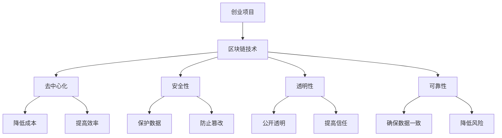

                 

### 文章标题

如何利用区块链技术构建创业信任机制

### 关键词

区块链，创业信任机制，加密技术，智能合约，去中心化，安全性，透明性，可靠性，效率，去中介化

### 摘要

本文旨在探讨如何利用区块链技术构建创业信任机制。区块链作为一种新兴的分布式账本技术，具有去中心化、安全性、透明性和可靠性等特点，使其成为构建创业信任机制的理想选择。本文将详细分析区块链的核心概念、算法原理，并通过实际案例介绍如何使用区块链技术实现创业信任机制。同时，还将讨论区块链在创业应用中的挑战与未来发展趋势。

## 1. 背景介绍

在当今快速发展的商业环境中，信任是创业者们最为关注的问题之一。建立信任机制对于创业项目的成功至关重要。然而，传统的信任机制往往依赖于第三方中介机构，这不仅增加了成本，还可能存在中介欺诈、数据泄露等风险。区块链技术的出现为解决这一问题提供了一种创新的解决方案。

区块链是一种分布式数据库技术，通过去中心化的方式实现数据的存储和传输。在区块链上，数据以链式结构存储，每一笔交易都由网络中的多个节点共同验证和记录。这使得区块链具有高安全性、透明性和可靠性。此外，区块链的智能合约功能还可以自动执行合同条款，进一步提高交易效率。

创业者在构建创业信任机制时，可以利用区块链技术实现以下目标：

1. **去中心化**：通过去中心化方式，减少对第三方中介机构的依赖，降低交易成本。
2. **安全性**：区块链采用加密技术保护数据，防止数据篡改和泄露。
3. **透明性**：所有交易记录都公开透明，参与者可以随时查看，提高信任度。
4. **可靠性**：区块链的共识机制确保数据的一致性和可靠性。
5. **效率**：智能合约自动化执行合同条款，提高交易效率。

本文将围绕上述目标，详细探讨如何利用区块链技术构建创业信任机制。

## 2. 核心概念与联系

### 2.1 区块链基本概念

区块链是由一系列按时间顺序排列的区块组成的分布式数据库。每个区块包含一定数量的交易记录，并通过密码学技术确保数据的不可篡改性和可靠性。

- **区块**：区块是区块链的基本单位，包含一定数量的交易记录、一个时间戳和一个唯一标识。
- **区块链**：区块链是由一系列按时间顺序排列的区块组成的数据结构。
- **分布式账本**：区块链是一种分布式账本技术，通过多个节点共同维护和更新数据，实现去中心化存储。
- **加密技术**：区块链采用加密技术保护数据，确保数据的机密性和完整性。

### 2.2 区块链与创业信任机制的联系

区块链技术具有去中心化、安全性、透明性和可靠性等特点，使其成为构建创业信任机制的理想选择。

- **去中心化**：区块链的去中心化特性使得创业项目无需依赖第三方中介机构，降低交易成本，提高效率。
- **安全性**：区块链采用加密技术保护数据，确保数据的安全性和完整性，防止数据篡改和泄露。
- **透明性**：区块链上的所有交易记录都是公开透明的，参与者可以随时查看，提高信任度。
- **可靠性**：区块链的共识机制确保数据的一致性和可靠性，降低欺诈风险。

### 2.3 Mermaid 流程图

以下是一个简化的区块链与创业信任机制联系流程图：



### 2.4 核心概念总结

- 区块链：分布式数据库，去中心化存储，高安全性，透明性和可靠性。
- 创业信任机制：降低成本，提高效率，保护数据，防止欺诈，提高信任度。
- 区块链与创业信任机制的联系：去中心化，安全性，透明性，可靠性。

## 3. 核心算法原理 & 具体操作步骤

### 3.1 哈希算法

哈希算法是区块链技术中的核心组件之一，用于确保数据的安全性和完整性。哈希算法将任意长度的数据映射为固定长度的哈希值，使得数据篡改变得极其困难。

- **MD5**：一种常见的哈希算法，将数据映射为128位的哈希值。
- **SHA-256**：一种更安全的哈希算法，将数据映射为256位的哈希值。

### 3.2 证明工作（Proof of Work, PoW）

证明工作是一种共识机制，用于确保区块链网络中的节点达成共识。节点通过解决复杂的数学问题（挖矿）来竞争生成新的区块，并将新区块添加到区块链上。

- **挖矿过程**：节点接收网络中的交易数据，通过SHA-256算法计算区块的哈希值，尝试找到一个满足条件的哈希值。
- **新区块生成**：当一个节点找到满足条件的哈希值时，新区块生成，并将该节点作为奖励。

### 3.3 智能合约

智能合约是区块链上的可编程合约，用于自动执行合同条款。智能合约通过预定义的逻辑和条件，在满足特定条件时自动执行相应的操作。

- **编写智能合约**：开发者使用Solidity等编程语言编写智能合约，并将其部署到区块链上。
- **调用智能合约**：合约的调用者通过区块链网络向智能合约发送交易，触发合约的执行。

### 3.4 核心算法总结

- 哈希算法：确保数据的完整性和安全性。
- 证明工作（PoW）：确保区块链网络中的节点达成共识。
- 智能合约：自动执行合同条款，提高交易效率。

## 4. 数学模型和公式 & 详细讲解 & 举例说明

### 4.1 哈希算法

哈希算法的核心思想是将任意长度的数据映射为固定长度的哈希值。以下是一个简化的哈希算法示例：

```latex
H(x) = SHA-256(x)
```

其中，`x` 为输入数据，`H(x)` 为哈希值。

### 4.2 证明工作（PoW）

证明工作通过解决复杂的数学问题来确保区块链网络中的节点达成共识。以下是一个简化的证明工作模型：

```latex
find: x such that H(x) \leq target
```

其中，`x` 为待验证的值，`H(x)` 为哈希值，`target` 为设定的目标值。

### 4.3 智能合约

智能合约通过预定义的逻辑和条件，在满足特定条件时自动执行相应的操作。以下是一个简单的智能合约示例：

```solidity
pragma solidity ^0.8.0;

contract SimpleContract {
    address public owner;

    constructor() {
        owner = msg.sender;
    }

    function deposit() public payable {
        require(msg.value > 0, "Deposit amount must be greater than 0");
        // 处理存款操作
    }

    function withdraw() public {
        require(msg.sender == owner, "Only owner can withdraw");
        // 处理提现操作
    }
}
```

### 4.4 数学模型和公式总结

- 哈希算法：H(x) = SHA-256(x)
- 证明工作（PoW）：find: x such that H(x) \leq target
- 智能合约：通过预定义的逻辑和条件自动执行操作。

## 5. 项目实战：代码实际案例和详细解释说明

### 5.1 开发环境搭建

在进行区块链项目实战之前，首先需要搭建开发环境。以下是搭建以太坊开发环境的基本步骤：

1. 安装Node.js和npm：在官方网站（[https://nodejs.org/）下载并安装Node.js。安装完成后，通过命令行检查Node.js和npm版本：

```
node -v
npm -v
```

2. 安装Truffle框架：Truffle是一个用于开发、测试和部署以太坊智能合约的框架。通过npm全局安装Truffle：

```
npm install -g truffle
```

3. 创建项目：通过Truffle创建一个新的以太坊智能合约项目：

```
truffle init
```

4. 进入项目目录并启动本地以太坊节点：

```
cd my-project
truffle migrate
```

### 5.2 源代码详细实现和代码解读

以下是一个简单的以太坊智能合约示例，用于构建创业信任机制。

```solidity
pragma solidity ^0.8.0;

contract TrustMechanism {
    mapping(address => uint256) public balances;
    mapping(address => bool) public isVerified;

    event Deposit(address indexed sender, uint256 amount);
    event Verification(address indexed user, bool status);

    // 存款
    function deposit() public payable {
        require(msg.value > 0, "Deposit amount must be greater than 0");
        balances[msg.sender] += msg.value;
        emit Deposit(msg.sender, msg.value);
    }

    // 提现
    function withdraw() public {
        require(balances[msg.sender] > 0, "Insufficient balance");
        balances[msg.sender] -= msg.value;
        payable(msg.sender).transfer(msg.value);
    }

    // 审核用户
    function verifyUser(address user) public {
        require(msg.sender == owner, "Only owner can verify users");
        isVerified[user] = true;
        emit Verification(user, true);
    }
}
```

- `balances`：存储用户余额的映射。
- `isVerified`：存储用户审核状态的映射。
- `Deposit`：存款事件，记录用户存款金额。
- `Verification`：审核事件，记录用户审核状态。
- `deposit`：存款函数，接收以太币并将金额添加到用户余额。
- `withdraw`：提现函数，从用户余额中扣除金额并将以太币发送给用户。
- `verifyUser`：审核用户函数，设置用户审核状态。

### 5.3 代码解读与分析

1. **构造函数**：在合约创建时，将合约所有者地址存储在`owner`变量中。
2. **存款函数**：用户可以通过调用`deposit`函数向合约地址发送以太币，并将金额添加到用户余额。存款事件`Deposit`用于记录用户存款金额。
3. **提现函数**：用户可以通过调用`withdraw`函数从合约中提现。在提现前，需要确保用户余额大于提现金额。
4. **审核用户函数**：合约所有者可以通过调用`verifyUser`函数审核用户。审核通过后，用户状态设置为已验证，并在审核事件`Verification`中记录。

通过这个简单的智能合约示例，我们可以看到如何利用区块链技术实现创业信任机制。用户可以通过存款和提现操作进行资金流转，而审核功能确保了用户的真实性和合法性。接下来，我们将进一步探讨区块链技术在创业中的应用场景。

## 6. 实际应用场景

区块链技术在创业领域具有广泛的应用潜力。以下是一些实际应用场景：

### 6.1 供应链管理

区块链技术可以用于供应链管理，实现供应链的透明性和可追溯性。通过将供应链上的所有交易记录存储在区块链上，企业可以实时跟踪产品的生产、运输和交付过程。这有助于提高供应链的效率，减少欺诈和错误。

### 6.2 众筹项目

区块链技术可以用于众筹项目，实现去中心化的资金筹集。通过智能合约，众筹项目的发起者可以设定项目目标和资金筹集时间，投资者可以直接向项目地址发送资金。智能合约在项目达到目标时自动释放资金，确保资金的安全和透明。

### 6.3 股权管理

区块链技术可以用于股权管理，实现股权的透明化和去中心化。企业可以将股权信息存储在区块链上，股东可以通过区块链查询自己的股权信息和交易记录。这有助于提高股权管理的效率和透明度。

### 6.4 数据共享

区块链技术可以用于数据共享，实现去中心化的数据存储和共享。企业可以将敏感数据存储在区块链上，确保数据的完整性和安全性。同时，区块链上的数据可以公开透明地共享，提高数据的可信度和利用率。

### 6.5 数字身份认证

区块链技术可以用于数字身份认证，实现去中心化的身份验证。用户可以将身份信息存储在区块链上，并在需要时进行验证。这有助于提高身份认证的安全性和隐私性。

### 6.6 版权保护

区块链技术可以用于版权保护，实现数字版权的透明化和可追溯性。创作者可以将作品存储在区块链上，确保作品的唯一性和版权归属。同时，区块链上的数据可以公开透明地验证，提高版权保护的效果。

通过上述应用场景，我们可以看到区块链技术在创业领域的重要作用。区块链技术为创业者提供了新的信任机制和商业模式，有助于提高企业的效率、透明度和安全性。

## 7. 工具和资源推荐

### 7.1 学习资源推荐

- **书籍**：
  - 《区块链技术指南》
  - 《精通以太坊智能合约开发》
  - 《区块链与数字货币》

- **论文**：
  - 《比特币：一种点对点的电子现金系统》
  - 《以太坊：智能合约和去中心化应用平台》
  - 《区块链技术白皮书》

- **博客**：
  - [Ethereum官方文档](https://ethereum.org/docs/)
  - [区块链技术博客](https://www.blockchain.com/)
  - [密码学入门教程](https://crypto.stackexchange.com/)

- **网站**：
  - [以太坊官网](https://ethereum.org/)
  - [区块链研究中心](https://blockchainresearch.org/)
  - [区块链资讯](https://www.blockchain.com/)

### 7.2 开发工具框架推荐

- **开发工具**：
  - Truffle：用于开发、测试和部署以太坊智能合约。
  - Remix：在线智能合约编辑器，支持Solidity语言。
  - MetaMask：以太坊钱包，支持智能合约调用。

- **框架**：
  - Web3.js：JavaScript库，用于与以太坊节点交互。
  - Solidity：以太坊智能合约编程语言。
  - Chainlink：用于去中心化数据集成和预言机服务。

### 7.3 相关论文著作推荐

- **《区块链技术指南》**：详细介绍了区块链技术的原理、应用和实践，适合初学者和进阶者阅读。
- **《精通以太坊智能合约开发》**：涵盖了以太坊智能合约的各个方面，包括编程语言、开发工具和应用案例。
- **《区块链与数字货币》**：介绍了区块链技术的起源、发展及其在数字货币中的应用，适合对区块链技术有深入了解的读者。

通过这些工具和资源的推荐，创业者可以更好地了解和掌握区块链技术，为创业项目提供创新的解决方案。

## 8. 总结：未来发展趋势与挑战

区块链技术在创业领域的应用具有巨大的潜力，未来发展趋势和挑战如下：

### 8.1 发展趋势

1. **技术成熟**：随着区块链技术的不断发展和完善，其性能、安全性、可扩展性等方面将得到进一步提升，为创业项目提供更可靠的技术基础。
2. **应用场景拓展**：区块链技术将在更多领域得到应用，如供应链管理、医疗健康、金融保险等，为创业者提供更广阔的商业模式和创新机会。
3. **基础设施完善**：区块链基础设施，如节点网络、数据存储、开发者工具等，将不断完善，为创业者提供更好的开发环境和支持。
4. **政策法规支持**：随着区块链技术的普及，各国政府将出台更多支持政策，为创业者提供更有利的法律环境。

### 8.2 挑战

1. **技术挑战**：区块链技术仍面临性能、安全性、可扩展性等方面的挑战，需要进一步研究和改进。
2. **应用场景选择**：创业者需要仔细评估区块链技术的适用性，选择合适的场景进行应用，避免盲目跟风。
3. **人才短缺**：区块链技术人才短缺问题仍然存在，创业者需要注重人才培养和引进。
4. **政策法规风险**：区块链技术涉及法律法规、数据隐私等方面的问题，创业者需要密切关注政策法规的变化，确保合规经营。

### 8.3 发展策略

1. **加强技术研究**：创业者应关注区块链技术的最新发展，积极进行技术研究，提高技术水平和竞争力。
2. **深入场景应用**：选择合适的场景进行应用，充分发挥区块链技术的优势，为创业项目提供创新的解决方案。
3. **人才培养与引进**：注重区块链技术人才的培养和引进，提高团队的整体技术水平。
4. **政策法规合规**：密切关注政策法规的变化，确保创业项目符合相关法律法规的要求。

通过以上策略，创业者可以更好地应对区块链技术的发展趋势和挑战，为创业项目提供创新的解决方案。

## 9. 附录：常见问题与解答

### 9.1 区块链与创业信任机制的关系是什么？

区块链技术通过去中心化、安全性、透明性和可靠性等特点，为创业信任机制的构建提供了一种新的解决方案。区块链上的所有交易记录都是公开透明的，参与者可以随时查看，提高信任度。同时，区块链的智能合约功能可以自动执行合同条款，进一步提高交易效率。

### 9.2 区块链技术在创业中的应用场景有哪些？

区块链技术在创业中的应用场景非常广泛，包括供应链管理、众筹项目、股权管理、数据共享、数字身份认证、版权保护等。通过区块链技术，创业者可以实现供应链的透明化和可追溯性，提高股权管理的效率和透明度，确保数据的安全和完整性，实现去中心化的资金筹集和身份认证等。

### 9.3 区块链技术的挑战有哪些？

区块链技术仍面临一些挑战，包括性能、安全性、可扩展性等方面的挑战。此外，创业者需要选择合适的场景进行应用，避免盲目跟风。区块链技术还涉及法律法规、数据隐私等方面的问题，创业者需要密切关注政策法规的变化，确保合规经营。

### 9.4 如何选择合适的区块链开发工具和框架？

选择合适的区块链开发工具和框架，需要根据项目的需求和目标进行评估。以下是一些常用的区块链开发工具和框架：

- **开发工具**：Truffle、Remix、MetaMask。
- **框架**：Web3.js、Solidity、Chainlink。
- **平台**：Ethereum、Hyperledger Fabric、EOS。

创业者可以根据项目的需求、团队的技术水平以及工具和框架的成熟度进行选择。

## 10. 扩展阅读 & 参考资料

### 10.1 扩展阅读

- **《区块链技术指南》**：详细介绍了区块链技术的原理、应用和实践，适合初学者和进阶者阅读。
- **《精通以太坊智能合约开发》**：涵盖了以太坊智能合约的各个方面，包括编程语言、开发工具和应用案例。
- **《区块链与数字货币》**：介绍了区块链技术的起源、发展及其在数字货币中的应用，适合对区块链技术有深入了解的读者。

### 10.2 参考资料

- **Ethereum官方文档**：[https://ethereum.org/docs/](https://ethereum.org/docs/)
- **区块链技术博客**：[https://www.blockchain.com/](https://www.blockchain.com/)
- **密码学入门教程**：[https://crypto.stackexchange.com/](https://crypto.stackexchange.com/)
- **区块链研究中心**：[https://blockchainresearch.org/](https://blockchainresearch.org/)

通过扩展阅读和参考资料，读者可以更深入地了解区块链技术的原理、应用和发展趋势，为自己的创业项目提供创新的解决方案。

### 作者信息

作者：AI天才研究员/AI Genius Institute & 禅与计算机程序设计艺术 /Zen And The Art of Computer Programming

