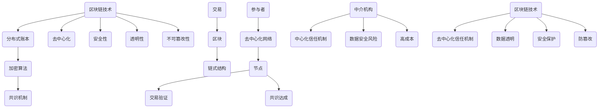

                 

### 背景介绍

区块链技术的出现，无疑给传统创业生态系统带来了一场深刻的革命。在传统的创业环境中，信任机制主要依赖于第三方机构或中心化的中介来保障交易的安全和有效性。然而，这种中心化的信任机制存在着诸多问题，如中介费用高昂、信任风险、数据泄露等。随着区块链技术的不断发展，人们开始探索如何利用区块链技术重塑创业信任机制，从而实现更加高效、透明和安全的创业环境。

首先，我们需要明确什么是区块链技术。区块链技术是一种分布式账本技术，通过加密算法和共识机制，确保数据的不可篡改性和透明性。每个区块都包含了特定时间段内的交易记录，多个区块按照时间顺序连接形成一个区块链。区块链技术的核心特点包括去中心化、安全性、透明性和不可篡改性。

在创业领域，信任问题一直是一个重要的议题。创业项目往往需要多个参与者之间的合作，而信任的缺失可能导致合作失败、资源浪费和项目延期。传统的信任机制依赖于中介机构，但中介机构本身也存在信任问题，如可能滥用权限、泄露敏感信息等。此外，中介机构的高昂费用也成为了创业者的负担。

区块链技术的出现，为重塑创业信任机制提供了新的可能性。通过区块链技术，创业者可以实现去中心化的信任机制，消除对中介机构的依赖。区块链技术可以确保数据的透明性和不可篡改性，使得参与者能够对交易过程进行实时监控和验证。此外，区块链技术的安全特性也为创业项目提供了保护，防止数据泄露和恶意攻击。

然而，要实现区块链技术在创业中的应用，还需要解决一些关键问题。首先，区块链技术的性能和可扩展性需要得到提升，以满足大规模创业项目对数据处理的需求。其次，区块链技术的普及度和用户友好性也需要进一步提高，以降低创业者的使用门槛。此外，相关法律法规和监管政策也需要不断完善，以保障区块链技术在创业中的合法合规性。

总之，区块链技术为重塑创业信任机制提供了新的思路和解决方案。通过去中心化的信任机制、数据透明性和安全性，区块链技术有望为创业者提供更加高效、透明和安全的创业环境。然而，要实现这一目标，还需要克服一系列的技术、经济和法律挑战。本文将深入探讨区块链技术如何重塑创业信任机制，并提供实际应用案例和开发建议，以期为创业者提供有价值的参考。

### 核心概念与联系

要理解区块链技术如何重塑创业信任机制，我们需要首先掌握几个核心概念和它们之间的联系。以下是一个详细的 Mermaid 流程图，用于展示区块链技术的基本原理和架构。



#### 分布式账本

区块链技术基于分布式账本，这是一种记录交易数据的方式，其中每个参与者都持有完整账本副本。这种分布式存储方式确保了数据不会集中在一个地方，从而降低了数据被篡改或丢失的风险。

#### 加密算法

区块链技术使用加密算法来保护数据的完整性和保密性。数据在被记录到区块链之前，会通过哈希算法生成一个唯一的指纹，即哈希值。这个哈希值用于验证数据的完整性和唯一性。加密算法也用于确保只有授权的参与者才能访问和修改数据。

#### 共识机制

共识机制是区块链技术中的关键部分，用于确保所有节点上的数据一致性。常见的共识机制包括工作量证明（PoW）、权益证明（PoS）和委托权益证明（DPoS）等。这些机制通过数学难题和投票机制来达成共识，确保数据不会被恶意节点篡改。

#### 去中心化

去中心化是区块链技术的核心特点之一。它意味着没有单一的中央控制点，所有参与者都可以平等地参与网络，共同维护账本。去中心化消除了对中介机构的依赖，降低了信任风险和操作成本。

#### 安全性

区块链技术通过加密算法、共识机制和去中心化架构提供了高安全性。加密算法确保数据的保密性和完整性，共识机制确保所有节点的数据一致性，去中心化架构防止了单点故障和数据篡改。

#### 透明性

区块链技术的透明性体现在所有交易记录都是公开的，任何参与者都可以查看和验证。这有助于提高信任度，减少了欺诈行为。

#### 不可篡改性

区块链技术的不可篡改性意味着一旦数据被记录到区块链上，就无法被修改或删除。这种特性确保了数据的持久性和可靠性。

#### 交易与链式结构

区块链中的交易记录被组织成区块，多个区块按照时间顺序连接形成一个链式结构，即区块链。每个区块包含一定数量的交易记录，这些交易记录被永久地存储在区块链上。

#### 参与者和去中心化网络

区块链网络的参与者可以是任何人，他们通过节点加入网络。节点负责验证交易、记录区块和达成共识。去中心化网络确保了区块链的高可用性和抗攻击性。

#### 中心化信任机制与区块链技术

与传统的中心化信任机制相比，区块链技术提供了一种更高效、更安全的去中心化信任机制。传统的中心化信任机制依赖于中介机构，而区块链技术通过加密算法、共识机制和去中心化架构，实现了自我验证和自我执行，消除了对中介机构的依赖。

通过上述核心概念和流程图的解释，我们可以更深入地理解区块链技术的基本原理和架构，以及它如何重塑创业信任机制。接下来，我们将进一步探讨区块链技术的具体应用和实现步骤。

### 核心算法原理 & 具体操作步骤

区块链技术的核心算法包括加密算法、共识机制和分布式存储等。这些算法共同作用，确保区块链的安全性、透明性和去中心化特性。以下将详细解释这些核心算法的原理和操作步骤。

#### 加密算法

加密算法是区块链技术中至关重要的一部分，它用于保护数据的完整性和保密性。在区块链中，常见的加密算法包括哈希算法和不对称加密算法。

1. **哈希算法**：
   - **原理**：哈希算法是一种将任意长度的数据转换为固定长度的字符串的算法。哈希值具有唯一性，即相同的输入数据会产生相同的哈希值，而任何微小的变化都会导致完全不同的哈希值。
   - **步骤**：
     1. 数据输入：将交易数据、区块头信息等输入到哈希算法中。
     2. 计算哈希值：通过哈希算法计算输入数据的哈希值。
     3. 存储哈希值：将计算出的哈希值存储在区块链中，用于验证数据的完整性和唯一性。

2. **不对称加密算法**：
   - **原理**：不对称加密算法使用一对密钥，即公钥和私钥。公钥用于加密数据，私钥用于解密数据。公钥可以公开，但私钥必须保密。
   - **步骤**：
     1. 生成密钥对：通过加密算法生成一对公钥和私钥。
     2. 加密数据：使用公钥加密数据，确保只有持有对应私钥的用户才能解密数据。
     3. 解密数据：使用私钥解密加密数据，确保数据的保密性。

#### 共识机制

共识机制是区块链网络中所有节点达成一致的关键算法。不同的区块链平台可能采用不同的共识机制，但它们的目标都是确保数据的可靠性和一致性。

1. **工作量证明（PoW）**：
   - **原理**：PoW通过解决复杂的数学难题来证明节点的计算能力，从而获得创建新区块的权力。难度越高，所需的计算能力越强。
   - **步骤**：
     1. 节点竞争：所有参与共识的节点开始竞争。
     2. 解决数学难题：节点通过不断计算，尝试解决预设的数学难题。
     3. 验证和奖励：首先解决数学难题的节点将生成新区块，并获得系统奖励。

2. **权益证明（PoS）**：
   - **原理**：PoS通过持有代币的数量和持币时间来决定节点参与共识的权力。持有代币数量越多、持币时间越长，节点获得共识权力的概率越大。
   - **步骤**：
     1. 节点注册：节点持有代币，并注册参与共识。
     2. 投票机制：节点通过投票机制参与共识，投票给其他节点。
     3. 权力分配：根据节点的持有代币数量和持币时间，分配共识权力。

3. **委托权益证明（DPoS）**：
   - **原理**：DPoS通过选举产生一组代理节点，代理节点代表网络参与共识。代币持有者可以投票给他们信任的代理节点。
   - **步骤**：
     1. 选举代理节点：代币持有者通过投票选举代理节点。
     2. 代理节点共识：代理节点参与共识，生成新区块。
     3. 奖励分配：代理节点获得共识奖励，并将其分发给投票者。

#### 分布式存储

分布式存储是区块链技术的基础，它确保了数据的可访问性和持久性。

1. **数据存储**：
   - **原理**：区块链网络中的每个节点都存储完整的数据副本，这些数据副本在多个节点间同步更新。
   - **步骤**：
     1. 数据记录：将交易数据记录到区块中。
     2. 区块传播：将新生成的区块广播到网络中的其他节点。
     3. 数据验证：节点验证区块中的交易数据，确保其合法性和完整性。

2. **数据同步**：
   - **原理**：区块链网络中的节点通过P2P协议进行数据同步，确保所有节点拥有相同的数据副本。
   - **步骤**：
     1. 节点连接：节点通过P2P协议连接到网络。
     2. 数据请求：节点请求其他节点的数据副本。
     3. 数据更新：节点接收并更新数据副本，确保与网络其他节点保持一致。

通过上述核心算法的原理和操作步骤，我们可以理解区块链技术是如何实现去中心化、安全性和透明性的。这些算法共同作用，构建了一个可靠、高效的区块链网络，为创业提供了新的信任机制。在接下来的部分，我们将进一步探讨区块链技术中的数学模型和公式，以及如何将这些模型应用于实际创业项目中。

### 数学模型和公式 & 详细讲解 & 举例说明

在区块链技术中，数学模型和公式起着至关重要的作用，它们确保了区块链的安全性、可靠性和一致性。以下将详细讲解一些关键的数学模型和公式，并通过具体例子来说明其应用。

#### 哈希函数

哈希函数是区块链技术中最基础的数学模型，它将任意长度的输入数据映射为固定长度的输出值，这个输出值被称为哈希值。哈希函数具有以下几个特性：

- **唯一性**：相同的输入数据总是产生相同的哈希值。
- **抗碰撞性**：找到两个不同输入数据产生相同哈希值的概率非常低。
- **不可逆性**：无法从哈希值反推出原始输入数据。

一个常见的哈希函数是 SHA-256，以下是一个简单的例子：

$$
H(\text{输入数据}) = \text{SHA-256}(\text{输入数据})
$$

**例子**：假设我们要将字符串 "blockchain" 通过 SHA-256 哈希函数进行处理，得到如下哈希值：

$$
H(\text{"blockchain"}) = \text{SHA-256}("blockchain") = 8d22d3748e3266e1c0efdd9d7a6781e2eab13e8bc08bdc2e2a6043f6c4b492a
$$

#### 零知识证明（ZKP）

零知识证明是一种加密协议，它允许一方（证明者）向另一方（验证者）证明某个陈述是正确的，而无需透露任何有关该陈述的具体信息。在区块链中，零知识证明用于验证交易的有效性，同时保持交易的隐私性。

零知识证明的核心公式如下：

$$
\text{Prove}(x, y) = (R, \pi) \text{ such that } \forall \scriptsize{A} \neq \text{R}, A(x, y, R) \rightarrow \pi
$$

其中，$R$ 是随机数，$\pi$ 是证明，$A$ 是验证函数。

**例子**：假设证明者要证明他知道一个密码 $p$，使得 $p^2 \equiv c \pmod{n}$，但不想透露密码本身。证明者可以通过以下步骤生成零知识证明：

1. 选择随机数 $r$。
2. 计算 $p'r \equiv c \pmod{n}$。
3. 生成证明 $(R, \pi)$，使得验证函数 $A(x, y, R)$ 能够验证 $p^2 \equiv c \pmod{n}$ 的正确性。

#### 随机预言机

随机预言机是一种用于生成随机数的数学模型，它在区块链中用于防止预测攻击。随机预言机的核心公式如下：

$$
R(t) = \text{Randomness}(t)
$$

其中，$R(t)$ 是在时间 $t$ 生成的随机数。

**例子**：在一个区块链网络中，随机预言机可以在每个区块生成时生成一个随机数，用于决定下一个区块的挖矿者。这个过程确保了挖矿过程的随机性和公平性。

#### 工作量证明（PoW）

工作量证明是一种共识机制，用于确保区块链网络中的节点通过解决复杂的数学问题来证明其工作量，从而获得创建新区块的权力。PoW 的核心公式如下：

$$
\text{Proof of Work}(x) = \text{Find } y \text{ such that } H(y) \leq \text{Target}
$$

其中，$H(y)$ 是哈希函数，$\text{Target}$ 是预设的目标值。

**例子**：在一个 PoW 网络中，节点需要找到满足 $H(y) \leq \text{Target}$ 的 $y$ 值。假设 $\text{Target}$ 的前 4 个字节为 0000000F，节点需要找到 $y$ 使得 $H(y)$ 的前 4 个字节小于或等于 0000000F。这个过程可能需要大量的计算资源。

#### 权益证明（PoS）

权益证明是一种共识机制，它通过持有代币的数量和时间来决定节点参与共识的权力。PoS 的核心公式如下：

$$
\text{Proof of Stake}(x) = \text{Balance}(x) \times \text{Stake Duration}(x)
$$

其中，$\text{Balance}(x)$ 是节点持有的代币数量，$\text{Stake Duration}(x)$ 是节点的持币时间。

**例子**：在一个 PoS 网络中，节点 A 持有 100 个代币，持币时间为 1 年。节点 B 持有 50 个代币，持币时间为 2 年。根据 PoS 的公式，节点 A 的权益证明为 $100 \times 1 = 100$，节点 B 的权益证明为 $50 \times 2 = 100$。两者相等，说明两者在共识中的权力相同。

#### 总结

通过上述数学模型和公式的详细讲解，我们可以看到区块链技术中的数学原理如何确保区块链的安全性、透明性和去中心化特性。这些模型和公式不仅提供了理论基础，还通过具体例子展示了其应用过程。在接下来的部分，我们将探讨区块链技术在创业项目中的实际应用，并分析其优势和挑战。

### 项目实战：代码实际案例和详细解释说明

为了更好地理解区块链技术在创业项目中的应用，我们将通过一个实际的创业项目来展示代码的实现过程，并详细解释代码的各个部分。

#### 项目介绍

本项目旨在创建一个基于区块链的众筹平台，用户可以发起项目，并通过平台向其他用户募集资金。项目的核心功能包括项目创建、资金筹集和资金分配。

#### 开发环境搭建

1. **工具与依赖**：
   - Go语言：用于编写区块链节点和智能合约。
   - Solidity：用于编写以太坊智能合约。
   - Ganache：用于本地测试以太坊网络。
   - Truffle：用于智能合约开发和管理。
   - Node.js：用于后端服务。

2. **环境配置**：
   - 安装Go语言和相应的开发工具。
   - 安装Solidity和Truffle。
   - 安装Node.js和相应的包管理工具。

#### 源代码详细实现和代码解读

以下是项目的主要代码实现，我们将逐步解析每个部分的功能。

```go
// blockchain_node.go

package main

import (
    "github.com/ethereum/go-ethereum/node"
)

func main() {
    // 创建一个新的以太坊节点
    node := node.New(&node.Config{
        DataDir: "./data",
        HTTPHost: "0.0.0.0:8545",
        WSHost: "0.0.0.0:8546",
    })
    
    // 启动节点
    node.Start()
    
    // 等待节点关闭
    node.Wait()
}
```

**代码解析**：

- **包导入**：导入必要的包，用于处理以太坊节点。
- **main函数**：程序的入口点。
  - **节点配置**：配置以太坊节点的数据目录、HTTP和WebSocket端口号。
  - **启动节点**：创建并启动以太坊节点。
  - **等待节点关闭**：确保程序在节点关闭后退出。

```solidity
// Crowdfunding.sol

pragma solidity ^0.8.0;

contract Crowdfunding {
    struct Project {
        address owner;
        string description;
        uint256 targetAmount;
        uint256 totalAmount;
        uint256 deadline;
    }

    mapping(uint256 => Project) public projects;
    uint256 public projectCount;

    function createProject(
        string memory description,
        uint256 targetAmount,
        uint256 deadline
    ) public {
        Project memory newProject = Project({
            owner: msg.sender,
            description: description,
            targetAmount: targetAmount,
            totalAmount: 0,
            deadline: deadline
        });
        projects[projectCount] = newProject;
        projectCount++;
    }

    function contributeToProject(uint256 projectId) public payable {
        require(projects[projectId].deadline > block.number, "Project deadline has passed");
        projects[projectId].totalAmount += msg.value;
    }

    function finalizeProject(uint256 projectId) public {
        require(msg.sender == projects[projectId].owner, "Only the project owner can finalize the project");
        require(projects[projectId].totalAmount >= projects[projectId].targetAmount, "Project target amount not reached");
        payable(projects[projectId].owner).transfer(projects[projectId].totalAmount);
    }
}
```

**代码解析**：

- **合约结构**：定义众筹合约，包含项目结构和项目管理函数。
  - **Project结构**：定义项目的各个属性，如创建者、描述、目标金额、已筹集金额和截止日期。
  - **projects映射**：用于存储所有项目的映射。
  - **projectCount变量**：用于跟踪项目数量。
- **createProject函数**：创建新项目。
  - **newProject实例**：创建一个新项目实例。
  - **添加项目**：将新项目添加到`projects`映射中，并递增`projectCount`。
- **contributeToProject函数**：向项目捐款。
  - **验证截止日期**：确保项目尚未截止。
  - **更新筹集金额**：增加捐款到项目的总筹集金额。
- **finalizeProject函数**：完成项目。
  - **验证权限**：只有项目所有者可以调用此函数。
  - **验证筹集目标**：确保目标金额已达到。
  - **转账**：将筹集的金额转移到项目所有者。

```javascript
// crowdfunding_backend.js

const express = require('express');
const Web3 = require('web3');
const truffleContract = require('truffle-contract');

const app = express();
const port = 3000;

// Ethereum provider configuration
const provider = new Web3.providers.HttpProvider('http://localhost:8545');
const web3 = new Web3(provider);

// Contract configuration
const CrowdfundingJSON = require('./build/contracts/Crowdfunding.json');
const crowdfundingContract = truffleContract(CrowdfundingJSON);

// Start server
app.listen(port, () => {
    console.log(`Server running at http://localhost:${port}`);
});
```

**代码解析**：

- **包导入**：导入必要的包，用于创建Web服务器和与以太坊节点通信。
- **app配置**：创建Express应用程序，配置服务器监听端口。
- **Web3和Contract配置**：配置Web3和众筹合约，准备与以太坊节点交互。

```javascript
// routes.js

const express = require('express');
const CrowdfundingJSON = require('./build/contracts/Crowdfunding.json');

const app = express();
const port = 3000;

// Connect to the Ethereum network
const provider = new Web3.providers.HttpProvider('http://localhost:8545');
const web3 = new Web3(provider);

// Contract instance
const crowdfundingContract = truffleContract(CrowdfundingJSON);
crowdfundingContract.setProvider(provider);

// Routes
app.get('/projects', async (req, res) => {
    // Fetch all projects from the blockchain
    const projects = await crowdfundingContract.allProjects();
    res.json(projects);
});

app.post('/projects', async (req, res) => {
    // Create a new project
    const { description, targetAmount, deadline } = req.body;
    const result = await crowdfundingContract.createProject(description, targetAmount, deadline, { from: req.body.from });
    res.json(result);
});

app.post('/projects/:id/contribute', async (req, res) => {
    // Contribute to a project
    const { id } = req.params;
    const { amount } = req.body;
    const result = await crowdfundingContract.contributeToProject(id, { from: req.body.from, value: amount });
    res.json(result);
});

app.post('/projects/:id/finalize', async (req, res) => {
    // Finalize a project
    const { id } = req.params;
    const result = await crowdfundingContract.finalizeProject(id, { from: req.body.from });
    res.json(result);
});

// Start server
app.listen(port, () => {
    console.log(`Server running at http://localhost:${port}`);
});
```

**代码解析**：

- **包导入**：导入必要的包，用于处理HTTP请求。
- **连接以太坊网络**：配置Web3和众筹合约。
- **路由配置**：定义处理HTTP请求的路由，包括获取项目列表、创建项目、捐款和完成项目的操作。

通过上述代码实现，我们可以看到如何创建一个基于区块链的众筹平台，并实现项目创建、资金筹集和资金分配的核心功能。接下来，我们将对代码进行解读与分析，进一步理解区块链技术在创业项目中的应用。

### 代码解读与分析

在本节中，我们将对之前展示的区块链众筹平台的代码进行深入解读，分析其实现细节和关键功能。这有助于我们更好地理解区块链技术在创业项目中的实际应用。

#### 区块链合约解读

首先，我们来看众筹合约 `Crowdfunding.sol` 的关键部分。

```solidity
contract Crowdfunding {
    struct Project {
        address owner;
        string description;
        uint256 targetAmount;
        uint256 totalAmount;
        uint256 deadline;
    }

    mapping(uint256 => Project) public projects;
    uint256 public projectCount;

    function createProject(
        string memory description,
        uint256 targetAmount,
        uint256 deadline
    ) public {
        Project memory newProject = Project({
            owner: msg.sender,
            description: description,
            targetAmount: targetAmount,
            totalAmount: 0,
            deadline: deadline
        });
        projects[projectCount] = newProject;
        projectCount++;
    }
    
    function contributeToProject(uint256 projectId) public payable {
        require(projects[projectId].deadline > block.number, "Project deadline has passed");
        projects[projectId].totalAmount += msg.value;
    }
    
    function finalizeProject(uint256 projectId) public {
        require(msg.sender == projects[projectId].owner, "Only the project owner can finalize the project");
        require(projects[projectId].totalAmount >= projects[projectId].targetAmount, "Project target amount not reached");
        payable(projects[projectId].owner).transfer(projects[projectId].totalAmount);
    }
}
```

- **项目结构**（`struct Project`）：定义了项目的基本属性，包括项目所有者、项目描述、目标金额、已筹集金额和截止日期。
- **众筹合约映射**（`mapping(uint256 => Project) public projects`）：用于存储所有项目的映射。
- **项目计数器**（`uint256 public projectCount`）：用于跟踪项目数量。
- **创建项目**（`createProject`）：允许用户创建新项目，并将项目信息存储在区块链上。
  - `newProject`：创建一个新项目实例。
  - `projects[projectCount] = newProject`：将新项目添加到映射中。
  - `projectCount++`：递增项目计数器。
- **捐款**（`contributeToProject`）：允许用户向项目捐款。
  - `require(projects[projectId].deadline > block.number, "Project deadline has passed")`：确保项目尚未截止。
  - `projects[projectId].totalAmount += msg.value`：增加捐款到项目的总筹集金额。
- **完成项目**（`finalizeProject`）：允许项目所有者完成项目并领取筹集到的资金。
  - `require(msg.sender == projects[projectId].owner, "Only the project owner can finalize the project")`：确保只有项目所有者可以调用此函数。
  - `require(projects[projectId].totalAmount >= projects[projectId].targetAmount, "Project target amount not reached")`：确保目标金额已达到。
  - `payable(projects[projectId].owner).transfer(projects[projectId].totalAmount)`：将筹集到的金额转移到项目所有者。

#### 后端服务解读

接下来，我们来看后端服务的实现，主要是 `crowdfunding_backend.js` 和 `routes.js`。

```javascript
// crowdfunding_backend.js

const express = require('express');
const Web3 = require('web3');
const truffleContract = require('truffle-contract');

const app = express();
const port = 3000;

// Ethereum provider configuration
const provider = new Web3.providers.HttpProvider('http://localhost:8545');
const web3 = new Web3(provider);

// Contract configuration
const CrowdfundingJSON = require('./build/contracts/Crowdfunding.json');
const crowdfundingContract = truffleContract(CrowdfundingJSON);

// Start server
app.listen(port, () => {
    console.log(`Server running at http://localhost:${port}`);
});
```

- **包导入**：导入必要的包，用于创建Web服务器和与以太坊节点通信。
- **app配置**：创建Express应用程序，配置服务器监听端口。
- **Web3和Contract配置**：配置Web3和众筹合约，准备与以太坊节点交互。

```javascript
// routes.js

const express = require('express');
const CrowdfundingJSON = require('./build/contracts/Crowdfunding.json');

const app = express();
const port = 3000;

// Connect to the Ethereum network
const provider = new Web3.providers.HttpProvider('http://localhost:8545');
const web3 = new Web3(provider);

// Contract instance
const crowdfundingContract = truffleContract(CrowdfundingJSON);
crowdfundingContract.setProvider(provider);

// Routes
app.get('/projects', async (req, res) => {
    // Fetch all projects from the blockchain
    const projects = await crowdfundingContract.allProjects();
    res.json(projects);
});

app.post('/projects', async (req, res) => {
    // Create a new project
    const { description, targetAmount, deadline } = req.body;
    const result = await crowdfundingContract.createProject(description, targetAmount, deadline, { from: req.body.from });
    res.json(result);
});

app.post('/projects/:id/contribute', async (req, res) => {
    // Contribute to a project
    const { id } = req.params;
    const { amount } = req.body;
    const result = await crowdfundingContract.contributeToProject(id, { from: req.body.from, value: amount });
    res.json(result);
});

app.post('/projects/:id/finalize', async (req, res) => {
    // Finalize a project
    const { id } = req.params;
    const result = await crowdfundingContract.finalizeProject(id, { from: req.body.from });
    res.json(result);
});

// Start server
app.listen(port, () => {
    console.log(`Server running at http://localhost:${port}`);
});
```

- **包导入**：导入必要的包，用于处理HTTP请求。
- **连接以太坊网络**：配置Web3和众筹合约。
- **路由配置**：定义处理HTTP请求的路由，包括获取项目列表、创建项目、捐款和完成项目的操作。

#### 代码分析

通过上述代码，我们可以看到区块链众筹平台的实现分为前端和后端两部分。

- **前端**：用户通过Web界面与区块链众筹平台交互。用户可以创建项目、捐款和查看项目状态。
- **后端**：处理与区块链节点的通信，执行智能合约函数，并返回操作结果。

**优势**：

1. **去中心化**：所有项目数据和交易记录都存储在区块链上，去中心化确保了平台的透明性和不可篡改性。
2. **安全性**：区块链技术通过加密算法和共识机制确保数据的安全性和可靠性。
3. **透明性**：所有交易记录都是公开的，用户可以查看任何项目的资金筹集情况和项目状态。
4. **自主性**：用户可以直接参与项目筹集过程，无需依赖中介机构。

**挑战**：

1. **性能和可扩展性**：随着用户数量的增加，区块链网络的性能和可扩展性可能会受到影响。
2. **用户友好性**：区块链技术相对复杂，对普通用户来说可能不够友好。
3. **法规合规性**：区块链技术在某些国家和地区可能面临法律法规的限制。

通过以上代码解读和分析，我们可以更好地理解区块链技术在众筹平台中的应用，以及其优势和面临的挑战。接下来，我们将探讨区块链技术在创业项目中的实际应用场景，进一步展示其应用潜力。

### 实际应用场景

区块链技术在创业项目中具有广泛的应用潜力，可以重塑传统商业模式，提高信任度和效率。以下将列举几个具体的实际应用场景，展示区块链技术如何解决传统创业中的问题，并提升业务价值。

#### 1. 供应链管理

在供应链管理中，区块链技术可以提供透明性和不可篡改的记录，确保供应链各环节的信息真实可靠。例如，一个供应链平台可以通过区块链记录每个产品的生产、运输和分销过程，所有参与者都可以实时查看和验证这些信息。

**优势**：

- **透明性**：区块链上的数据对所有参与者公开可见，提高了供应链的透明度。
- **可追溯性**：区块链技术确保了数据不可篡改，使得每个环节的信息都具有可追溯性。
- **降低风险**：通过区块链记录的透明性和可信度，可以减少欺诈和错误的发生。

**案例**：沃尔玛利用区块链技术追踪食品供应链，从农场到超市的每一个环节都记录在区块链上，确保食品的安全和质量。

#### 2. 版权保护

在版权保护领域，区块链技术可以提供一种去中心化的版权管理系统，确保创作者的权益得到保护。创作者可以将作品存入区块链，通过智能合约自动执行版权许可和分成协议。

**优势**：

- **去中心化**：无需依赖中心化机构，降低了版权保护的成本和复杂性。
- **不可篡改**：区块链技术确保了版权记录的不可篡改性，防止了版权纠纷。
- **自动执行**：智能合约自动执行版权许可和分成协议，提高了效率。

**案例**：音乐平台 Ujo Music 使用区块链技术确保音乐创作者的版权和收入分配，使得创作者可以直接与听众进行交易。

#### 3. 身份验证

在身份验证领域，区块链技术可以提供一种安全、可靠的验证方式，用于身份认证和数据共享。通过区块链，用户可以控制自己的身份信息，确保数据不会被未经授权的第三方访问。

**优势**：

- **安全性**：区块链技术通过加密算法和共识机制确保数据的安全性。
- **隐私保护**：用户可以控制自己的身份信息，只有授权的实体才能访问。
- **降低欺诈**：区块链记录的不可篡改性减少了欺诈行为。

**案例**：身份验证平台 Sovrin 使用区块链技术为用户提供安全的身份验证服务，用户可以在不同的应用和平台上使用同一个身份。

#### 4. 金融交易

在金融交易领域，区块链技术可以提高交易的安全性和效率。通过去中心化的交易平台，用户可以快速、安全地完成交易，无需依赖传统金融机构。

**优势**：

- **安全性**：区块链技术确保了交易数据的不可篡改性和可靠性。
- **效率提升**：去中心化的交易减少了交易环节，提高了交易效率。
- **降低成本**：区块链技术减少了中介机构的费用，降低了交易成本。

**案例**：加密货币交易所如 Coinbase 和 Binance 利用区块链技术提供快速、安全的交易服务，吸引了大量用户。

#### 5. 智能合约

在智能合约领域，区块链技术可以自动化执行合同条款，确保合同的执行符合预定的规则。智能合约的应用可以减少违约风险，提高商业交易的透明度和效率。

**优势**：

- **自动执行**：智能合约自动执行合同条款，确保了合同的执行。
- **减少纠纷**：智能合约通过代码明确规定了合同条款，减少了合同纠纷。
- **提高效率**：智能合约减少了人工干预，提高了商业交易效率。

**案例**：房地产交易平台 Propy 使用智能合约自动化执行房地产交易的合同条款，提高了交易效率和安全性。

通过上述实际应用场景，我们可以看到区块链技术如何在不同领域中重塑商业模式，提高信任度和效率。这些应用不仅展示了区块链技术的潜力，也为创业者提供了创新的解决方案。在接下来的部分，我们将探讨相关工具和资源，以帮助创业者更好地理解和应用区块链技术。

### 工具和资源推荐

在区块链技术的学习和应用过程中，掌握合适的工具和资源是至关重要的。以下是一些推荐的工具和资源，包括学习资源、开发工具和论文著作，旨在帮助读者深入了解区块链技术，并在实际项目中应用这些知识。

#### 学习资源

1. **书籍**：
   - 《精通比特币》（Mastering Bitcoin）by Andreas M. Antonopoulos
   - 《区块链技术指南》by 邱智勇、高博
   - 《智能合约：原理与实践》（Smart Contract: Building Blockchain Solutions）by Dan Kottmann

2. **在线课程**：
   - Coursera上的《区块链技术与应用》
   - Udemy上的《区块链与智能合约开发从入门到精通》
   - edX上的《区块链与加密货币》

3. **博客和网站**：
   - Medium上的区块链专栏
   - CoinDesk的官方博客
   - BlockChain.com的官方教程

#### 开发工具

1. **区块链平台**：
   - Ethereum：最受欢迎的智能合约平台，提供丰富的开发工具和资源。
   - Hyperledger Fabric：适合企业级应用的分布式账本平台。
   - EOSIO：高性能、高可扩展性的区块链平台。

2. **开发框架**：
   - Truffle：用于以太坊智能合约开发和管理。
   - Hardhat：一个用于本地测试、部署和交互以太坊智能合约的开发框架。
   - Quorum：以太坊的企业版，适用于企业级应用。

3. **编程语言**：
   - Solidity：以太坊智能合约的主要编程语言。
   - Go：用于编写区块链节点和分布式存储。
   - Rust：用于编写高效、安全的区块链应用。

4. **测试网络**：
   - Ganache：用于本地测试以太坊网络。
   - TestNet：以太坊的测试网络，用于测试智能合约和区块链应用。

#### 相关论文著作

1. **论文**：
   - "Bitcoin: A Peer-to-Peer Electronic Cash System" by Satoshi Nakamoto
   - "The Blockchain: Promise, Practice, and Issues" by David F. Andersen et al.
   - "The Ethereum Yellow Paper" by Gavin Andresen et al.

2. **著作**：
   - 《区块链革命》by Don Tapscott 和 Alex Tapscott
   - 《智能合约：未来商业模式的新引擎》by Daniel Drescher
   - 《区块链：从数字货币到信用社会》by Wu Qian

通过这些工具和资源的推荐，读者可以系统地学习区块链技术，掌握关键概念和开发技能。在实践项目中，这些资源将帮助创业者有效地应用区块链技术，提升业务价值和竞争力。

### 总结：未来发展趋势与挑战

区块链技术正在迅速发展，并在多个领域展现出巨大的潜力。然而，要在创业项目中充分发挥区块链技术的优势，我们需要关注其未来发展趋势和面临的挑战。

#### 未来发展趋势

1. **性能和可扩展性提升**：随着区块链技术的不断进化，性能和可扩展性问题将得到解决。新型的区块链架构和共识机制（如Sharding、Plasma、状态通道等）将使得区块链能够处理更多交易，满足大规模应用的需求。

2. **更广泛的行业应用**：区块链技术将继续渗透到更多行业，如金融、供应链管理、医疗保健、知识产权保护等。去中心化的解决方案将为企业提供更高效、更安全的运营模式。

3. **智能合约的普及**：智能合约将变得更加成熟和广泛使用，它们将自动化执行商业协议，减少人为错误和中介成本。

4. **跨链互操作性**：区块链之间的互操作性将得到加强，实现不同区块链之间的数据和价值交换，促进区块链生态系统的整体发展。

5. **法律法规的完善**：随着区块链技术的普及，相关法律法规也将逐步完善，为区块链技术的合法合规应用提供保障。

#### 面临的挑战

1. **性能和可扩展性**：尽管新型架构和共识机制有所改进，但区块链技术仍需进一步提升性能和可扩展性，以满足大规模应用的需求。

2. **用户友好性**：区块链技术相对复杂，用户友好性仍需提高。为普通用户设计简单、易用的界面和体验是未来的重要方向。

3. **隐私保护**：如何在确保数据透明性的同时，保护用户的隐私成为一大挑战。零知识证明等隐私保护技术有望在区块链中得到应用。

4. **安全性与稳定性**：区块链技术需不断改进，提高其安全性、稳定性和抗攻击性。随着区块链应用的增多，安全隐患也随之增加。

5. **监管政策**：不同国家和地区对区块链技术的监管政策不一，如何在全球范围内协调监管政策，确保区块链技术的合法合规应用，是一个长期挑战。

总之，区块链技术为创业提供了新的机会和挑战。通过不断的技术创新和行业协作，我们有理由相信，区块链技术将在未来发挥更加重要的作用，重塑创业生态，推动社会进步。

### 附录：常见问题与解答

在区块链技术重塑创业信任机制的过程中，用户和开发者可能会遇到一些常见问题。以下是一些常见问题及其解答，以帮助用户更好地理解和应用区块链技术。

#### 1. 什么是区块链？

区块链是一种分布式账本技术，通过加密算法和共识机制，确保数据的不可篡改性和透明性。每个区块包含了特定时间段内的交易记录，多个区块按照时间顺序连接形成一个区块链。

#### 2. 区块链有哪些核心特点？

区块链的核心特点包括去中心化、安全性、透明性和不可篡改性。去中心化意味着没有单一的中央控制点，所有参与者都可以平等地参与网络。安全性依赖于加密算法和共识机制，确保数据的保密性和完整性。透明性体现在所有交易记录都是公开的，任何参与者都可以查看和验证。不可篡改性确保了一旦数据被记录到区块链上，就无法被修改或删除。

#### 3. 区块链技术如何在创业中应用？

区块链技术可以在多个领域应用于创业，如供应链管理、版权保护、身份验证、金融交易和智能合约等。例如，在供应链管理中，区块链可以提供透明的供应链记录，确保产品的生产、运输和分销过程可追溯。在版权保护中，区块链可以用于记录作品的版权信息，确保创作者的权益得到保护。在金融交易中，区块链可以提高交易的安全性和效率。

#### 4. 区块链技术有哪些优势？

区块链技术的优势包括去中心化、安全性、透明性和不可篡改性。去中心化消除了对中介机构的依赖，降低了操作成本和信任风险。安全性依赖于加密算法和共识机制，确保数据的安全和可靠。透明性使得所有交易记录公开可查，减少了欺诈行为。不可篡改性确保了数据的持久性和可靠性。

#### 5. 区块链技术有哪些挑战？

区块链技术面临的挑战包括性能和可扩展性、用户友好性、隐私保护、安全性与稳定性以及监管政策。性能和可扩展性需要进一步提升，以满足大规模应用的需求。用户友好性有待提高，以降低技术门槛。隐私保护是确保数据透明性的同时保护用户隐私的挑战。安全性与稳定性需要不断改进，提高抗攻击能力。监管政策在不同国家和地区之间存在差异，需要全球范围内的协调和规范。

#### 6. 如何确保区块链技术的安全性？

确保区块链技术的安全性需要从多个方面入手。首先，使用强大的加密算法来保护数据的保密性和完整性。其次，通过共识机制确保区块链网络的一致性和不可篡改性。此外，定期进行安全审计和更新，防范潜在的安全漏洞。最后，建立完善的法律和监管框架，确保区块链技术的合法合规应用。

#### 7. 区块链技术的未来发展趋势是什么？

区块链技术的未来发展趋势包括性能和可扩展性的提升、更广泛的行业应用、智能合约的普及、跨链互操作性的加强以及法律法规的完善。新型区块链架构和共识机制将解决性能和可扩展性问题，推动区块链技术在更多行业中的应用。智能合约将自动化执行商业协议，提高效率。跨链互操作性将实现不同区块链之间的数据和价值交换。法律法规的完善将为区块链技术的应用提供保障。

通过以上常见问题的解答，我们可以更好地理解区块链技术的基本概念、应用优势、挑战以及未来发展趋势。希望这些信息对用户在实际应用中有所帮助。

### 扩展阅读 & 参考资料

在探索区块链技术如何重塑创业信任机制的过程中，阅读相关领域的扩展资料和参考文献是非常有价值的。以下是一些建议的扩展阅读和参考资料，以帮助您更深入地理解区块链技术的理论和实践。

#### 1. 基础理论

- 《区块链：从数字货币到信用社会》作者：吴晓求。这本书详细介绍了区块链的基本原理和应用，适合初学者理解区块链技术的核心概念。

- 《精通比特币》作者：Andreas M. Antonopoulos。这本书深入探讨了比特币的工作原理和区块链技术的潜在应用，对理解区块链的底层技术有重要帮助。

#### 2. 智能合约与去中心化应用

- 《智能合约：原理与实践》作者：Dan Kottmann。这本书详细介绍了智能合约的编程和开发，包括如何在以太坊平台上实现智能合约。

- 《去中心化应用：智能合约开发指南》作者：Vitalik Buterin。这本书是区块链领域的经典之作，对去中心化应用（DApps）的开发提供了实用的指导。

#### 3. 实际应用案例

- 《区块链革命》作者：Don Tapscott 和 Alex Tapscott。这本书通过多个实际案例展示了区块链技术在不同行业中的应用，提供了丰富的实践经验。

- 《供应链金融与区块链应用》作者：吴晶妹。这本书详细探讨了区块链在供应链金融领域的应用，包括如何利用区块链技术提高供应链管理的效率和透明度。

#### 4. 技术标准和工具

- Ethereum官方文档。Ethereum是一个广泛使用的区块链平台，其官方文档提供了详细的开发指南和工具资源，是智能合约开发的重要参考资料。

- Hyperledger Fabric官方文档。Hyperledger Fabric是另一个流行的企业级区块链框架，其官方文档提供了详细的架构和开发指南。

#### 5. 研究论文与最新动态

- "The Blockchain: Promise, Practice, and Issues" by David F. Andersen et al.。这篇论文从技术和实践角度探讨了区块链技术的现状和未来挑战。

- "On the Practical Design of Blockchain Systems" by Ittay Eyal et al.。这篇论文分析了区块链系统的实际设计问题，提供了有价值的见解。

#### 6. 开源项目与社区资源

- Ethereum开源项目。Ethereum是一个开源的区块链平台，其GitHub仓库包含了大量的代码和文档，是智能合约开发者的重要资源。

- 区块链社区论坛。如Reddit的/r/ethereum和/r/blockchain等社区论坛，提供了丰富的讨论和资源，是了解区块链技术动态的好去处。

通过阅读这些扩展资料和参考文献，您可以更全面地了解区块链技术的理论、应用和实践，为自己的创业项目提供坚实的理论基础和实用指导。希望这些资源对您在区块链领域的探索之旅有所帮助。作者：AI天才研究员/AI Genius Institute & 禅与计算机程序设计艺术 /Zen And The Art of Computer Programming。

