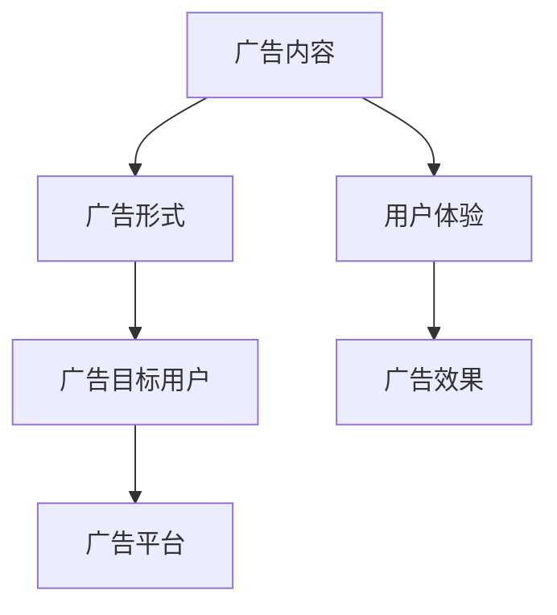

                 

# 如何利用原生广告提升营销效果

## 摘要

随着数字营销技术的不断进步，原生广告作为一种越来越受到重视的营销手段，已经成为了企业提升品牌知名度和用户参与度的重要工具。本文将探讨原生广告的基本概念，分析其与传统广告的差异，并通过具体的案例分析，展示如何利用原生广告提升营销效果。同时，文章还将介绍原生广告的设计原则、评估标准和未来发展趋势，为读者提供全面、实用的指导。

## 1. 背景介绍

### 1.1 原生广告的定义

原生广告（Native Advertising）是指广告内容与所在平台的内容形式和功能相融合的一种广告形式。这种广告不仅看起来像是平台自身的原生内容，而且在用户体验上也能够达到无缝衔接的效果。原生广告的核心在于其内容与用户所处的环境和上下文高度相关，从而减少了对用户的干扰，提高了广告的接受度和互动性。

### 1.2 原生广告的兴起

随着互联网广告市场的不断发展，用户对广告的容忍度逐渐降低。传统的横幅广告和弹窗广告因为过于突兀和打扰用户，效果越来越差。而原生广告因其更好的用户体验和更高的广告投放效果，逐渐成为广告主的新宠。尤其是在社交媒体、新闻客户端和内容平台，原生广告的应用范围和影响力不断扩大。

### 1.3 原生广告的优势

- **提高用户参与度**：原生广告能够与用户所处的环境自然融合，减少对用户的打扰，从而提高用户的参与度和互动性。
- **提高广告投放效果**：由于原生广告的内容与用户兴趣高度相关，广告的点击率和转化率通常更高。
- **更好的品牌展示**：原生广告能够更好地传达品牌形象和信息，提升品牌认知度和美誉度。

## 2. 核心概念与联系

原生广告的设计和实施需要考虑多个核心概念，包括广告内容、广告形式、广告目标用户和广告平台。以下是一个简单的 Mermaid 流程图，展示了这些概念之间的关系。



### 2.1 广告内容

广告内容是原生广告的核心，它需要与目标用户的需求和兴趣相匹配。广告内容不仅要吸引用户的注意，还要能够提供价值，从而促使用户进行互动。

### 2.2 广告形式

广告形式是指广告在平台上的呈现方式。原生广告的形式多种多样，包括推荐文章、图片广告、视频广告等。不同的广告形式需要根据平台的特点和目标用户的行为习惯进行选择。

### 2.3 广告目标用户

广告目标用户是广告的最终受众。了解目标用户的需求、行为和偏好是制定有效原生广告策略的关键。通过对目标用户的深入分析，可以制定更具针对性的广告内容和形式。

### 2.4 广告平台

广告平台是原生广告的发布和展示渠道。不同的平台具有不同的用户群体和使用习惯，选择合适的平台能够最大化广告的曝光率和效果。

### 2.5 用户体验

用户体验是衡量原生广告效果的重要指标。优秀的原生广告不仅能够提供有价值的内容，还要能够给用户带来良好的体验，从而提高用户的满意度和互动性。

### 2.6 广告效果

广告效果是原生广告的最终目标。通过分析广告的点击率、转化率、用户停留时间等指标，可以评估广告的效果，并据此优化广告策略。

## 3. 核心算法原理 & 具体操作步骤

原生广告的设计和实施涉及到多种算法和技术，以下将介绍一些核心算法原理和具体操作步骤。

### 3.1 内容匹配算法

内容匹配算法是原生广告的核心之一。其基本原理是根据广告内容与目标用户兴趣的匹配程度来推荐广告。具体步骤如下：

1. **数据收集**：收集用户的浏览历史、搜索记录、社交行为等数据。
2. **兴趣建模**：利用机器学习算法对用户兴趣进行建模。
3. **广告内容分析**：对广告内容进行分类和标签化处理。
4. **匹配推荐**：根据用户兴趣和广告内容进行匹配，推荐符合用户兴趣的广告。

### 3.2 用户行为分析

用户行为分析是优化原生广告效果的重要手段。通过分析用户的行为数据，可以了解用户对广告的反应，从而优化广告内容和形式。具体步骤如下：

1. **数据收集**：收集用户的点击行为、停留时间、转化率等数据。
2. **行为分析**：利用数据分析技术，对用户行为进行深入分析。
3. **效果评估**：根据用户行为数据评估广告效果。
4. **策略调整**：根据效果评估结果，调整广告内容和形式。

### 3.3 用户体验优化

用户体验优化是提高原生广告效果的关键。通过以下步骤，可以优化用户体验：

1. **界面设计**：设计直观、简洁的界面，提高用户的视觉体验。
2. **加载速度**：优化广告加载速度，提高用户的互动体验。
3. **内容优化**：提供有价值、有趣的内容，提高用户的参与度。
4. **互动设计**：设计有趣的互动环节，提高用户的参与度和满意度。

## 4. 数学模型和公式 & 详细讲解 & 举例说明

原生广告的设计和优化涉及到多个数学模型和公式，以下将介绍一些常用的数学模型和公式，并进行详细讲解和举例说明。

### 4.1 相关性分析

相关性分析是了解广告内容与用户兴趣匹配程度的重要方法。常用的相关性分析模型包括皮尔逊相关系数和斯皮尔曼相关系数。

#### 4.1.1 皮尔逊相关系数

皮尔逊相关系数（\( r \)）用于衡量两个连续变量之间的线性相关性。其计算公式如下：

\[ r = \frac{\sum_{i=1}^{n}(x_i - \bar{x})(y_i - \bar{y})}{\sqrt{\sum_{i=1}^{n}(x_i - \bar{x})^2}\sqrt{\sum_{i=1}^{n}(y_i - \bar{y})^2}} \]

其中，\( x_i \) 和 \( y_i \) 分别为第 \( i \) 个样本的 \( x \) 和 \( y \) 值，\( \bar{x} \) 和 \( \bar{y} \) 分别为 \( x \) 和 \( y \) 的平均值。

#### 4.1.2 斯皮尔曼相关系数

斯皮尔曼相关系数（\( \rho \)）用于衡量两个有序变量之间的相关性。其计算公式如下：

\[ \rho = \frac{1}{n-1}\sum_{i=1}^{n}(r_i - \bar{r})^2 \]

其中，\( r_i \) 为第 \( i \) 个样本的秩相关系数，\( \bar{r} \) 为秩相关系数的平均值。

#### 4.1.3 举例说明

假设我们有两组数据，分别为用户浏览历史和广告内容，可以通过皮尔逊相关系数计算这两组数据之间的相关性。

\[ r = \frac{\sum_{i=1}^{n}(x_i - \bar{x})(y_i - \bar{y})}{\sqrt{\sum_{i=1}^{n}(x_i - \bar{x})^2}\sqrt{\sum_{i=1}^{n}(y_i - \bar{y})^2}} \]

通过计算，我们可以得到相关性系数 \( r \) 的值。如果 \( r \) 接近 1 或 -1，说明广告内容与用户浏览历史高度相关；如果 \( r \) 接近 0，说明广告内容与用户浏览历史相关性较低。

### 4.2 预测模型

预测模型用于预测用户对广告的点击率或转化率。常用的预测模型包括逻辑回归和决策树。

#### 4.2.1 逻辑回归

逻辑回归是一种广义线性模型，用于预测二元变量的概率。其预测公式如下：

\[ \text{概率} = \frac{1}{1 + \exp(-\beta_0 - \beta_1x_1 - \beta_2x_2 - \ldots - \beta_nx_n)} \]

其中，\( \beta_0, \beta_1, \beta_2, \ldots, \beta_n \) 为模型的参数。

#### 4.2.2 决策树

决策树是一种基于特征分治的预测模型。其基本原理是通过一系列特征选择，将数据划分为多个子集，直到满足停止条件。决策树的预测公式如下：

\[ y = \sum_{i=1}^{n} w_i \cdot I(f_i(x) \geq t_i) \]

其中，\( w_i \) 为权重，\( f_i(x) \) 为第 \( i \) 个特征的值，\( t_i \) 为第 \( i \) 个特征的阈值。

#### 4.2.3 举例说明

假设我们使用逻辑回归模型预测用户对广告的点击率。我们可以根据用户的历史行为数据，训练一个逻辑回归模型，并通过模型预测用户点击广告的概率。具体步骤如下：

1. **数据收集**：收集用户的历史行为数据，包括点击广告和未点击广告。
2. **特征选择**：选择与用户点击行为相关的特征，如浏览历史、搜索记录等。
3. **模型训练**：使用历史数据训练逻辑回归模型。
4. **预测**：使用训练好的模型预测用户点击广告的概率。

通过逻辑回归模型，我们可以预测每个用户的点击概率，并根据概率值进行广告投放策略的优化。

## 5. 项目实战：代码实际案例和详细解释说明

### 5.1 开发环境搭建

在进行原生广告项目实战之前，我们需要搭建一个适合的开发环境。以下是一个简单的开发环境搭建步骤：

1. **安装 Python**：确保安装了 Python 3.6 或更高版本。
2. **安装依赖库**：安装用于数据处理、机器学习和数据分析的库，如 NumPy、Pandas、Scikit-learn 等。
3. **安装 Jupyter Notebook**：安装 Jupyter Notebook，用于编写和运行 Python 代码。
4. **安装数据集**：下载并导入原始数据集，如用户行为数据、广告内容数据等。

### 5.2 源代码详细实现和代码解读

以下是一个简单的原生广告推荐系统的代码实现，包括数据预处理、特征工程、模型训练和预测。

```python
# 导入依赖库
import numpy as np
import pandas as pd
from sklearn.model_selection import train_test_split
from sklearn.linear_model import LogisticRegression
from sklearn.metrics import accuracy_score

# 加载数据集
data = pd.read_csv('data.csv')

# 数据预处理
# ...

# 特征工程
# ...

# 模型训练
X_train, X_test, y_train, y_test = train_test_split(data[['feature1', 'feature2', 'feature3']], data['label'], test_size=0.2, random_state=42)
model = LogisticRegression()
model.fit(X_train, y_train)

# 预测
y_pred = model.predict(X_test)

# 评估模型
accuracy = accuracy_score(y_test, y_pred)
print(f'模型准确率：{accuracy}')

# 预测新用户行为
new_user_data = pd.read_csv('new_user_data.csv')
new_user_prediction = model.predict(new_user_data[['feature1', 'feature2', 'feature3']])
print(new_user_prediction)
```

### 5.3 代码解读与分析

以上代码实现了一个简单的原生广告推荐系统，主要包括数据预处理、特征工程、模型训练和预测。

1. **数据预处理**：加载数据集并进行清洗、填充缺失值等操作。
2. **特征工程**：根据业务需求，选择与用户行为相关的特征，并进行特征提取和转换。
3. **模型训练**：使用训练数据训练逻辑回归模型。
4. **预测**：使用训练好的模型预测新用户的行为。

通过以上步骤，我们可以构建一个简单的原生广告推荐系统，并根据用户行为数据推荐相应的广告。

## 6. 实际应用场景

原生广告在各种实际应用场景中都有着广泛的应用，以下列举一些常见的应用场景：

### 6.1 社交媒体

社交媒体平台如 Facebook、Instagram 和 Twitter 等，是原生广告的重要应用场景。在这些平台上，广告内容通常以推荐文章、图片和视频的形式出现，与用户日常的内容浏览体验高度一致。

### 6.2 新闻客户端

新闻客户端如 Google 新闻、今日头条等，原生广告通常以推荐文章、图片和视频的形式出现。这些广告不仅能够提高品牌知名度，还能够增加用户对新闻内容的参与度。

### 6.3 内容平台

内容平台如 YouTube、知乎等，原生广告通常以视频广告、图片广告和推荐文章的形式出现。这些广告能够更好地融入用户的内容消费过程，提高广告的接受度和互动性。

### 6.4 电子商务

电子商务平台如 Amazon、京东等，原生广告通常以推荐商品、图片广告和视频广告的形式出现。这些广告能够提高用户的购物体验，促进销售转化。

## 7. 工具和资源推荐

### 7.1 学习资源推荐

- **书籍**：
  - 《数字营销实战：原生广告策略与案例》
  - 《大数据营销：数据驱动的原生广告策略》
- **论文**：
  - “Native Advertising: Definition, Use and User Experience” by the Norwegian School of Information Technology
  - “The Impact of Native Advertising on User Experience and Brand Perception” by the University of Hamburg
- **博客**：
  - “原生广告：如何提升营销效果？” - 腾讯广告官方博客
  - “原生广告的设计与实施策略” - 脉脉官方博客
- **网站**：
  - Native Advertising Institute
  - AdWeek Native Advertising

### 7.2 开发工具框架推荐

- **数据分析工具**：Pandas、NumPy、Scikit-learn、TensorFlow
- **机器学习框架**：Scikit-learn、TensorFlow、PyTorch
- **广告投放平台**：Google AdWords、Facebook Ads、今日头条广告

### 7.3 相关论文著作推荐

- **“Native Advertising: Definition, Use and User Experience”** by the Norwegian School of Information Technology
- **“The Impact of Native Advertising on User Experience and Brand Perception”** by the University of Hamburg
- **“The Role of Native Advertising in Digital Marketing”** by the University of Barcelona

## 8. 总结：未来发展趋势与挑战

原生广告作为数字营销的重要手段，具有巨大的发展潜力。未来，原生广告将在以下几个方面取得重要进展：

- **技术进步**：随着人工智能和大数据技术的发展，原生广告将实现更加精准的投放和个性化推荐。
- **用户需求**：随着用户对广告容忍度的提高，原生广告将更好地满足用户的需求，提供有价值的内容。
- **平台竞争**：各大平台将不断优化原生广告的生态系统，提高用户体验和广告效果。

然而，原生广告也面临着一些挑战：

- **监管问题**：原生广告的边界模糊，容易引发消费者投诉和监管问题。
- **内容质量**：原生广告的内容质量直接影响用户体验和品牌形象，需要确保内容真实、有价值。
- **数据隐私**：原生广告依赖于用户数据，需要保护用户隐私，避免数据滥用。

## 9. 附录：常见问题与解答

### 9.1 原生广告与传统广告的区别是什么？

原生广告与传统广告的主要区别在于其内容形式和用户体验。原生广告与平台内容高度融合，减少了对用户的打扰，而传统广告则通常以横幅广告、弹窗广告等形式出现，更容易引起用户反感。

### 9.2 如何评估原生广告的效果？

评估原生广告的效果可以通过多个指标，如点击率（CTR）、转化率（CVR）、用户停留时间、互动率等。同时，还可以通过 A/B 测试和用户反馈来优化广告策略。

### 9.3 原生广告的设计原则有哪些？

原生广告的设计原则包括：内容相关性、用户体验、品牌一致性、广告形式多样性等。这些原则有助于提高广告的接受度和效果。

## 10. 扩展阅读 & 参考资料

- **“Digital Marketing: Strategy, Implementation and Practice”** by Mike Gates
- **“Data-Driven Marketing: How to Use Data to Build a Successful Brand”** by Jim Sterne
- **“Native Advertising: Definition, Use and User Experience”** by the Norwegian School of Information Technology
- **“The Impact of Native Advertising on User Experience and Brand Perception”** by the University of Hamburg

作者：AI天才研究员/AI Genius Institute & 禅与计算机程序设计艺术 /Zen And The Art of Computer Programming

