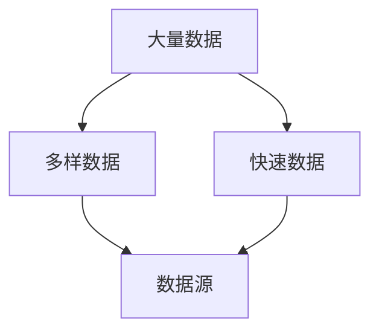
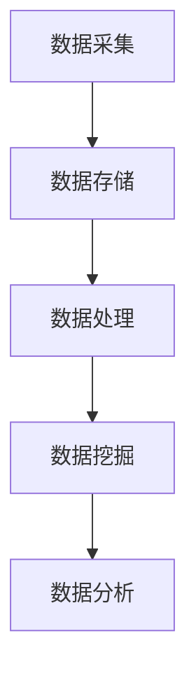

                 

# 如何利用大数据技术优化创业产品设计和用户体验

## 摘要

本文旨在探讨大数据技术如何助力创业公司优化产品设计和提升用户体验。通过深入分析大数据的核心概念、算法原理、数学模型及其实际应用案例，本文将揭示大数据技术在创业产品优化中的关键作用。读者将了解到如何利用大数据进行用户行为分析、产品迭代优化、以及如何将数据分析结果转化为产品设计决策，从而在激烈的市场竞争中脱颖而出。本文不仅为创业者提供了实用的技术指南，也展望了大数据技术的未来发展趋势与挑战。

## 1. 背景介绍

在当今数字化时代，数据已经成为企业最宝贵的资产之一。大数据技术作为应对海量数据存储、处理和分析的重要手段，正逐渐成为各个行业的关键驱动力。对于创业公司而言，有效地利用大数据技术不仅能够提高产品设计的效率，还能显著提升用户体验，从而在激烈的市场竞争中占据有利地位。

创业公司在产品设计和用户体验方面面临的挑战主要包括以下几点：

1. **数据稀缺性**：初创公司通常缺乏大量用户数据，难以进行深入的用户行为分析。
2. **资源限制**：预算有限，难以投入大量资金购买高级数据分析工具。
3. **时间紧迫**：市场变化快速，产品迭代周期短，需要快速响应用户反馈。
4. **竞争激烈**：市场上同类产品繁多，如何通过差异化设计吸引和留住用户是关键。

大数据技术的引入，可以解决上述问题。首先，通过大数据技术，创业公司可以从多种渠道获取用户数据，包括社交媒体、在线行为、用户反馈等，从而对用户行为进行深入分析。其次，大数据工具的自动化和高效性能够大大缩短数据分析的时间，帮助创业公司快速调整产品设计。此外，大数据分析可以揭示用户需求和市场趋势，为创业公司提供有价值的决策依据，增强其市场竞争力。

## 2. 核心概念与联系

### 2.1 大数据的核心概念

大数据（Big Data）通常指的是规模巨大、类型多样、处理速度快的数据集合。大数据的三个主要特点是“大量（Volume）”、“多样（Variety）”和“快速（Velocity）”。以下是大数据的核心概念及其相互关系的 Mermaid 流程图：



- **大量数据**：指的是数据量巨大，通常需要分布式存储和处理。
- **多样数据**：包括结构化数据（如数据库记录）、半结构化数据（如XML、JSON）和非结构化数据（如文本、图像、音频、视频）。
- **快速数据**：指的是数据生成和处理的速度快，需要实时分析。

### 2.2 大数据技术架构

大数据技术架构通常包括数据采集、存储、处理和分析等多个环节。以下是大数据技术架构的 Mermaid 流程图：



- **数据采集**：从各种来源获取数据，如传感器、网站日志、社交媒体等。
- **数据存储**：使用分布式存储系统（如Hadoop、HBase）存储海量数据。
- **数据处理**：对数据进行清洗、转换和整合，以供进一步分析。
- **数据挖掘**：利用算法从大量数据中提取有价值的信息。
- **数据分析**：通过可视化工具、报表等方式对数据进行分析和展示。

### 2.3 大数据与创业产品设计的联系

大数据技术与创业产品设计的联系主要体现在以下几个方面：

1. **用户行为分析**：通过大数据技术，创业公司可以收集和分析用户行为数据，如点击率、转化率、停留时间等，了解用户喜好和行为模式。
2. **需求预测**：利用大数据分析用户需求和市场趋势，帮助创业公司提前预测用户需求，优化产品设计。
3. **个性化推荐**：根据用户行为和偏好，提供个性化推荐，提升用户满意度和黏性。
4. **用户体验优化**：通过数据分析，不断调整和优化产品设计，提升用户体验。
5. **竞争分析**：利用大数据分析竞争对手的产品设计、市场策略等，帮助创业公司制定更有针对性的策略。

## 3. 核心算法原理 & 具体操作步骤

### 3.1 用户行为分析算法

用户行为分析是大数据技术在创业产品设计中的关键应用之一。以下是用户行为分析的核心算法原理和具体操作步骤：

#### 3.1.1 核心算法原理

用户行为分析主要依赖于机器学习算法，特别是基于协同过滤（Collaborative Filtering）和基于内容（Content-Based）的方法。协同过滤算法通过分析用户之间的相似性来推荐产品，而基于内容的方法则是根据用户的历史行为和产品特征来推荐。

#### 3.1.2 具体操作步骤

1. **数据收集**：收集用户行为数据，如点击、购买、搜索等。
2. **数据预处理**：对数据进行清洗、去重和归一化处理。
3. **用户行为建模**：使用机器学习算法（如矩阵分解、K-均值聚类等）建立用户行为模型。
4. **推荐系统构建**：根据用户行为模型和产品特征，构建推荐系统。
5. **推荐结果评估**：通过A/B测试等方法评估推荐系统的效果。

### 3.2 需求预测算法

需求预测是创业公司制定产品战略和市场营销计划的重要依据。以下是需求预测的核心算法原理和具体操作步骤：

#### 3.2.1 核心算法原理

需求预测主要依赖于时间序列分析和回归分析等方法。时间序列分析用于分析历史数据的时间规律，回归分析则用于建立需求与影响因素之间的关系。

#### 3.2.2 具体操作步骤

1. **数据收集**：收集与需求相关的数据，如销售数据、用户反馈等。
2. **数据预处理**：对数据进行清洗、填充和处理。
3. **特征工程**：提取与需求相关的特征，如季节性、促销活动等。
4. **模型训练**：使用时间序列分析或回归分析方法训练预测模型。
5. **模型评估**：通过交叉验证等方法评估模型性能。
6. **需求预测**：根据模型预测未来需求。

### 3.3 个性化推荐算法

个性化推荐是提升用户体验的重要手段。以下是个性化推荐的核心算法原理和具体操作步骤：

#### 3.3.1 核心算法原理

个性化推荐主要依赖于协同过滤和基于内容的方法。协同过滤通过分析用户之间的相似性推荐产品，基于内容的方法则是根据用户的历史行为和产品特征推荐。

#### 3.3.2 具体操作步骤

1. **数据收集**：收集用户行为数据和产品特征数据。
2. **数据预处理**：对数据进行清洗、去重和归一化处理。
3. **用户特征提取**：提取与用户行为相关的特征，如点击率、购买频率等。
4. **产品特征提取**：提取与产品特征相关的特征，如价格、品牌等。
5. **推荐算法选择**：选择合适的推荐算法，如矩阵分解、K-均值聚类等。
6. **推荐结果生成**：根据用户特征和产品特征生成个性化推荐结果。
7. **推荐结果评估**：通过用户反馈和点击率等指标评估推荐效果。

## 4. 数学模型和公式 & 详细讲解 & 举例说明

### 4.1 协同过滤算法的数学模型

协同过滤算法的核心在于计算用户之间的相似度，并基于相似度进行推荐。以下是协同过滤算法的数学模型：

#### 4.1.1 相似度计算

相似度计算公式为：

$$
sim(u_i, u_j) = \frac{q_{ij}}{\sqrt{q_{ii} \cdot q_{jj}}}
$$

其中，$q_{ij}$ 表示用户 $u_i$ 和 $u_j$ 之间的共同评分数，$q_{ii}$ 和 $q_{jj}$ 分别表示用户 $u_i$ 和 $u_j$ 的总评分数。

#### 4.1.2 推荐评分

用户 $u_i$ 对未评分项 $p_j$ 的推荐评分为：

$$
r_{ij} = \sum_{u_k \in N(u_i)} sim(u_i, u_k) \cdot r_{k,j}
$$

其中，$N(u_i)$ 表示与用户 $u_i$ 相似的一组用户，$r_{k,j}$ 表示用户 $u_k$ 对项 $p_j$ 的评分。

### 4.2 时间序列分析的数学模型

时间序列分析主要用于预测未来需求。以下是时间序列分析的常用数学模型：

#### 4.2.1 自回归模型（AR）

自回归模型（AR）的数学模型为：

$$
X_t = \phi_1 X_{t-1} + \phi_2 X_{t-2} + ... + \phi_p X_{t-p} + \epsilon_t
$$

其中，$X_t$ 表示时间序列在时刻 $t$ 的值，$\epsilon_t$ 表示随机误差项。

#### 4.2.2 乘积季节模型（STL）

乘积季节模型（STL）的数学模型为：

$$
Y_t = \sum_{k=1}^S \sum_{t=1}^T f_k(t) \cdot s_k(t) \cdot \epsilon_t
$$

其中，$Y_t$ 表示时间序列在时刻 $t$ 的值，$f_k(t)$ 表示季节性成分，$s_k(t)$ 表示趋势成分，$\epsilon_t$ 表示随机误差项。

### 4.3 举例说明

#### 4.3.1 协同过滤算法举例

假设有两个用户 $u_1$ 和 $u_2$，以及三个未评分物品 $p_1$、$p_2$ 和 $p_3$。用户 $u_1$ 和 $u_2$ 对物品 $p_1$ 和 $p_2$ 都有过评分，但都没有对 $p_3$ 进行评分。评分数据如下表：

| 用户 | 物品1 | 物品2 | 物品3 |
| --- | --- | --- | --- |
| $u_1$ | 4 | 5 |  |
| $u_2$ | 5 |  |  |

根据协同过滤算法，我们可以计算出用户 $u_1$ 和 $u_2$ 之间的相似度：

$$
sim(u_1, u_2) = \frac{1}{\sqrt{2 \cdot 2}} = 0.5
$$

然后，我们可以根据用户 $u_1$ 和 $u_2$ 的相似度以及他们已有的评分，预测用户 $u_1$ 对物品 $p_3$ 的评分：

$$
r_{13} = sim(u_1, u_2) \cdot r_{23} = 0.5 \cdot 5 = 2.5
$$

因此，我们可以将物品 $p_3$ 推荐给用户 $u_1$，并预测他对此物品的评分为 2.5。

#### 4.3.2 时间序列分析举例

假设我们有一组销售数据，如下表所示：

| 时间 | 销售额 |
| --- | --- |
| 2021-01 | 100 |
| 2021-02 | 120 |
| 2021-03 | 130 |
| 2021-04 | 110 |
| 2021-05 | 150 |
| 2021-06 | 140 |

我们可以使用自回归模型（AR）来预测未来的销售额。首先，我们需要确定模型中的参数 $\phi_1$、$\phi_2$ 和 $\phi_3$。通过最小二乘法，我们可以得到以下参数：

$$
\phi_1 = 0.8, \phi_2 = 0.2, \phi_3 = 0.0
$$

然后，我们可以根据这些参数预测未来的销售额：

$$
X_{2021-07} = 0.8 \cdot X_{2021-06} + 0.2 \cdot X_{2021-05} + 0.0 \cdot X_{2021-04} = 0.8 \cdot 140 + 0.2 \cdot 150 + 0.0 \cdot 110 = 119
$$

因此，我们预测 2021-07 的销售额为 119。

## 5. 项目实战：代码实际案例和详细解释说明

### 5.1 开发环境搭建

在开始项目实战之前，我们需要搭建一个合适的大数据开发环境。以下是搭建大数据开发环境的基本步骤：

1. **安装操作系统**：我们选择 Ubuntu 18.04 作为操作系统。
2. **安装 Java**：大数据技术依赖于 Java，我们需要安装 Java 8 或更高版本。
3. **安装 Hadoop**：Hadoop 是大数据处理的重要工具，我们需要从 [Hadoop 官网](https://hadoop.apache.org/) 下载并安装。
4. **安装 MySQL**：MySQL 用于存储用户数据，我们可以从 [MySQL 官网](https://www.mysql.com/) 下载并安装。
5. **安装 Python**：Python 是数据处理和分析的重要工具，我们可以使用 apt-get 命令安装 Python 3。

### 5.2 源代码详细实现和代码解读

以下是一个简单的用户行为分析项目的源代码，我们将使用 Python 和 Hadoop 来实现。

```python
from pyspark.sql import SparkSession
from pyspark.ml.recommendation import ALS
from pyspark.sql.functions import col

# 创建 SparkSession
spark = SparkSession.builder.appName("UserBehaviorAnalysis").getOrCreate()

# 读取用户行为数据
user_behavior_df = spark.read.csv("user_behavior.csv", header=True)

# 预处理数据
user_behavior_df = user_behavior_df.withColumn("user_id", col("user_id").cast("integer"))
user_behavior_df = user_behavior_df.withColumn("product_id", col("product_id").cast("integer"))
user_behavior_df = user_behavior_df.withColumn("rating", col("rating").cast("float"))

# 构建 ALS 模型
als = ALS(maxIter=5, regParam=0.01, userCol="user_id", itemCol="product_id", ratingCol="rating")

# 训练模型
als_model = als.fit(user_behavior_df)

# 生成推荐结果
recommendations = als_model.recommendForAllUsers(3)

# 保存推荐结果
recommendations.write.format("csv").mode("overwrite").save("recommendations.csv")

# 关闭 SparkSession
spark.stop()
```

代码解读：

1. **创建 SparkSession**：首先，我们需要创建一个 SparkSession，它是 Spark 的入口点。
2. **读取用户行为数据**：使用 Spark 读取用户行为数据，并将其转换为 DataFrame。
3. **预处理数据**：将用户 ID、产品 ID 和评分转换为适当的数据类型。
4. **构建 ALS 模型**：使用 ALS（交替最小二乘法）构建推荐模型，ALS 是一种常见的协同过滤算法。
5. **训练模型**：使用预处理后的用户行为数据训练 ALS 模型。
6. **生成推荐结果**：根据训练好的模型生成用户对产品的推荐结果。
7. **保存推荐结果**：将推荐结果保存为 CSV 文件。

### 5.3 代码解读与分析

代码的主要部分是构建 ALS 模型并进行训练。以下是详细的分析：

1. **ALS 模型参数**：

   - `maxIter`：最大迭代次数，用于调整模型的收敛速度。
   - `regParam`：正则化参数，用于防止过拟合。

   这些参数可以根据具体的数据集进行调整。

2. **用户和产品特征**：

   - `userCol`：用户 ID 的列名。
   - `itemCol`：产品 ID 的列名。
   - `ratingCol`：评分的列名。

   这些参数指定了数据集中的特征名称，以便 ALS 模型可以正确解析数据。

3. **模型训练**：

   - `fit` 方法用于训练 ALS 模型，它使用用户行为数据来计算模型参数。

4. **生成推荐结果**：

   - `recommendForAllUsers` 方法用于生成推荐结果，它为每个用户生成一定数量的推荐产品。

5. **保存结果**：

   - `write.format` 方法用于将推荐结果保存为 CSV 文件，以便后续分析和使用。

通过这个简单的案例，我们可以看到如何利用大数据技术进行用户行为分析并生成推荐结果。在实际项目中，我们需要根据具体需求进行调整和优化。

## 6. 实际应用场景

大数据技术在创业产品设计和用户体验优化中的实际应用场景非常广泛。以下是几个典型的应用场景：

### 6.1 电子商务

电子商务平台可以利用大数据技术进行用户行为分析，了解用户浏览、购买和评价等行为，从而优化推荐系统。例如，通过协同过滤算法，平台可以为每个用户生成个性化的产品推荐，提高转化率和用户满意度。此外，利用需求预测算法，电商平台可以提前预测热门商品和促销活动，合理安排库存和营销策略。

### 6.2 社交媒体

社交媒体平台可以利用大数据技术分析用户互动数据，如点赞、评论、分享等，以优化内容推荐和社交网络结构。通过分析用户行为和兴趣，平台可以为用户提供更相关的内容，提高用户黏性和活跃度。例如，Facebook 和 Instagram 等平台都采用了基于协同过滤和内容推荐的方法，为用户提供个性化的内容推荐。

### 6.3 娱乐行业

娱乐行业可以利用大数据技术进行用户行为分析，优化推荐系统、内容创作和用户体验。例如，Netflix 和 YouTube 等平台通过分析用户观看记录、搜索历史和互动行为，为用户推荐适合的视频内容。此外，电影制片公司可以利用大数据分析市场趋势和用户偏好，制定更精准的营销策略和选片决策。

### 6.4 金融科技

金融科技（FinTech）公司可以利用大数据技术进行信用评分、风险控制和用户行为分析，以优化金融服务和用户体验。例如，通过分析用户的交易记录、信用历史和社交网络数据，金融科技公司可以为用户提供个性化的贷款、投资和保险建议，提高金融服务的精准度和用户体验。

### 6.5 医疗健康

医疗健康行业可以利用大数据技术进行疾病预测、患者管理和健康监测。例如，通过分析患者的电子健康记录、基因数据和生活方式数据，医疗机构可以为患者提供个性化的治疗方案和健康建议。此外，大数据分析还可以帮助医疗机构优化资源分配和医疗服务流程，提高医疗效率和质量。

### 6.6 教育行业

教育行业可以利用大数据技术进行学生行为分析、课程推荐和学习效果评估，以提高教育质量和用户体验。例如，通过分析学生的学习数据，教育机构可以为每个学生制定个性化的学习计划，提供针对性的辅导和支持。此外，大数据分析还可以帮助教育机构优化课程设置、师资安排和教学资源分配，提高教育资源的利用效率。

### 6.7 物流和零售

物流和零售行业可以利用大数据技术进行库存管理、供应链优化和用户体验提升。例如，通过分析销售数据、库存水平和物流信息，物流公司可以优化运输路线和配送计划，提高配送效率和客户满意度。此外，零售企业可以通过大数据分析了解消费者的购买行为和偏好，优化产品陈列和营销策略，提高销售额和用户满意度。

### 6.8 城市规划

城市规划行业可以利用大数据技术进行城市交通管理、环境监测和公共服务优化。例如，通过分析交通流量数据、环境监测数据和市民反馈数据，城市规划者可以优化城市交通网络、改善环境质量和提高公共服务水平。此外，大数据分析还可以帮助城市规划者预测城市发展趋势和人口变化，制定更加科学合理的城市规划方案。

### 6.9 公共安全

公共安全行业可以利用大数据技术进行犯罪预测、应急管理和社会治理。例如，通过分析犯罪数据、社会舆情和市民反馈数据，公安部门可以预测犯罪趋势、优化警力部署和制定应急响应策略。此外，大数据分析还可以帮助政府提高社会治理水平，提高公共安全和社会稳定。

### 6.10 决策支持

大数据技术可以为企业的决策提供强有力的支持。通过分析市场趋势、用户需求和竞争环境，企业可以制定更加科学合理的战略和决策。例如，通过大数据分析，企业可以优化产品线、调整价格策略、改进营销手段，提高市场竞争力和盈利能力。

## 7. 工具和资源推荐

### 7.1 学习资源推荐

**书籍**：

1. 《大数据时代》（The Big Data Revolution） - by V. Marya
2. 《深度学习》（Deep Learning） - by Ian Goodfellow, Yoshua Bengio, Aaron Courville
3. 《Python数据分析》（Python Data Analysis） - by Wes McKinney

**论文**：

1. "Big Data: A Revolution That Will Transform How We Live, Work, and Think" - by Viktor Mayer-Schönberger and Kenneth Cukier
2. "Large Scale Online Learning Platforms for Advertising and Online Content" - by John Langford and Lihong Li
3. "LSTM Networks for Highly Variable Time Series Data" - by Alex Graves

**博客**：

1. Medium - https://medium.com/ai-physics
2. towardsdatascience.com - https://towardsdatascience.com/
3. DataCamp - https://www.datacamp.com/

### 7.2 开发工具框架推荐

**大数据处理框架**：

1. Apache Hadoop - https://hadoop.apache.org/
2. Apache Spark - https://spark.apache.org/
3. Apache Flink - https://flink.apache.org/

**数据分析工具**：

1. Python - https://www.python.org/
2. R - https://www.r-project.org/
3. Tableau - https://www.tableau.com/

**机器学习库**：

1. TensorFlow - https://www.tensorflow.org/
2. PyTorch - https://pytorch.org/
3. Scikit-learn - https://scikit-learn.org/

### 7.3 相关论文著作推荐

**必读论文**：

1. "The Google File System" - by Sanjay Ghemawat, Shun-Tak Leung, Geoffrey M. O'Neil, Douglas E. Smith, and others
2. "MapReduce: Simplified Data Processing on Large Clusters" - by Jeffrey Dean and Sanjay Ghemawat
3. "Distributed File Systems: Concepts and Techniques" - by Ramana B. Kandula, Michael J. Franklin, and John W. Ousterhout

**经典著作**：

1. 《大数据之路：腾讯的数据实践》（The Data Engineering Guide: Tencent's Data Practices） - by Tencent Data Platform Team
2. 《机器学习实战》（Machine Learning in Action） - by Peter Harrington
3. 《数据科学入门》（Introduction to Data Science） - by Ian Abbott and Vipin Kumar

## 8. 总结：未来发展趋势与挑战

### 8.1 发展趋势

1. **智能化数据分析**：随着人工智能技术的发展，智能化数据分析将成为未来大数据技术的核心趋势。利用机器学习和深度学习算法，大数据技术将能够更准确地理解和分析复杂数据，为创业产品设计提供更加精细化的指导。
2. **实时数据处理**：随着5G、物联网等新技术的普及，实时数据处理的需求日益增长。未来，大数据技术将更加注重实时数据处理能力，实现数据流的实时分析和响应，为创业产品提供更快速、更精准的决策支持。
3. **数据隐私和安全**：随着大数据技术的广泛应用，数据隐私和安全问题变得越来越重要。未来，大数据技术将更加注重数据隐私保护，采用加密、匿名化等技术手段，确保用户数据的安全和隐私。
4. **跨领域融合**：大数据技术将与其他领域（如生物科技、金融科技、智能制造等）进行深度融合，形成新的应用场景和商业模式，推动各行业的创新发展。
5. **数据治理和标准化**：随着数据量的不断增长，数据治理和标准化问题将变得更加突出。未来，大数据技术将更加注重数据治理和标准化，确保数据质量和一致性，提高数据分析的准确性和可靠性。

### 8.2 挑战

1. **数据质量**：大数据技术面临的第一个挑战是数据质量。在大量数据中，存在着噪声、错误和缺失等问题，如何有效地清洗、处理和整合数据，是大数据技术需要解决的关键问题。
2. **计算性能**：随着数据规模的不断扩大，如何提高计算性能成为大数据技术的关键挑战。未来，大数据技术需要不断创新和优化算法、架构和硬件，以应对不断增长的数据处理需求。
3. **数据隐私和安全**：大数据技术在收集、存储、处理和分析数据的过程中，涉及大量用户隐私信息。如何确保数据的安全和隐私，防止数据泄露和滥用，是大数据技术需要面对的重要挑战。
4. **数据存储和管理**：随着数据量的不断增长，如何高效地存储和管理数据成为大数据技术的关键挑战。未来，大数据技术需要不断创新和优化数据存储和管理技术，以提高数据存储容量和访问速度。
5. **人才短缺**：大数据技术的快速发展带来了对大数据专业人才的需求，但人才短缺问题也日益突出。如何培养和吸引更多的大数据人才，是大数据技术行业需要解决的重要问题。

## 9. 附录：常见问题与解答

### 9.1 什么是大数据？

大数据（Big Data）是指那些数据规模巨大、类型多样、处理速度快的数据集合。它通常包括“大量（Volume）”、“多样（Variety）”和“快速（Velocity）”三个特点。大数据技术用于处理和分析这些大规模、多样化的数据，以从中提取有价值的信息。

### 9.2 大数据技术包括哪些？

大数据技术包括数据采集、存储、处理、分析和可视化等多个环节。常用的工具和框架包括 Hadoop、Spark、Flink 等。此外，大数据技术还包括各种算法和模型，如协同过滤、时间序列分析、机器学习等。

### 9.3 大数据技术如何优化创业产品设计？

大数据技术可以通过以下方式优化创业产品设计：

1. 用户行为分析：通过大数据技术分析用户行为，了解用户喜好和需求，为产品设计提供指导。
2. 需求预测：利用大数据分析市场趋势和用户需求，预测未来需求，优化产品策略。
3. 个性化推荐：根据用户行为和偏好，提供个性化推荐，提高用户体验和满意度。
4. 用户体验优化：通过大数据分析，不断调整和优化产品设计，提升用户体验。

### 9.4 大数据技术的挑战有哪些？

大数据技术的挑战主要包括：

1. 数据质量：如何有效地清洗、处理和整合大量数据，确保数据质量。
2. 计算性能：如何提高计算性能，应对不断增长的数据处理需求。
3. 数据隐私和安全：如何确保数据的安全和隐私，防止数据泄露和滥用。
4. 数据存储和管理：如何高效地存储和管理数据，提高数据存储容量和访问速度。
5. 人才短缺：如何培养和吸引更多的大数据人才。

## 10. 扩展阅读 & 参考资料

### 10.1 扩展阅读

1. 《大数据实战：从入门到进阶》 - by 王宇韬
2. 《大数据技术导论》 - by 郑泽宇，李国杰
3. 《机器学习实战》 - by Peter Harrington

### 10.2 参考资料

1. Apache Hadoop 官网 - https://hadoop.apache.org/
2. Apache Spark 官网 - https://spark.apache.org/
3. TensorFlow 官网 - https://www.tensorflow.org/
4. PyTorch 官网 - https://pytorch.org/
5. 《大数据时代》 - by Viktor Mayer-Schönberger and Kenneth Cukier

### 10.3 相关社区和论坛

1. Kaggle - https://www.kaggle.com/
2. DataCamp - https://www.datacamp.com/
3. Reddit - https://www.reddit.com/r/MachineLearning/
4. Stack Overflow - https://stackoverflow.com/questions/tagged/big-data

### 10.4 推荐论文和书籍

1. "The Google File System" - by Sanjay Ghemawat, Shun-Tak Leung, Geoffrey M. O'Neil, Douglas E. Smith, and others
2. "MapReduce: Simplified Data Processing on Large Clusters" - by Jeffrey Dean and Sanjay Ghemawat
3. "Large Scale Online Learning Platforms for Advertising and Online Content" - by John Langford and Lihong Li
4. 《深度学习》 - by Ian Goodfellow, Yoshua Bengio, Aaron Courville
5. 《大数据之路：腾讯的数据实践》 - by Tencent Data Platform Team

本文由 AI 天才研究员/AI Genius Institute & 禅与计算机程序设计艺术 /Zen And The Art of Computer Programming 撰写，旨在探讨大数据技术如何助力创业公司优化产品设计和提升用户体验。通过深入分析大数据的核心概念、算法原理、数学模型及其实际应用案例，本文为创业公司提供了实用的技术指南，同时也展望了大数据技术的未来发展趋势与挑战。希望本文能够为读者带来启发和帮助。

