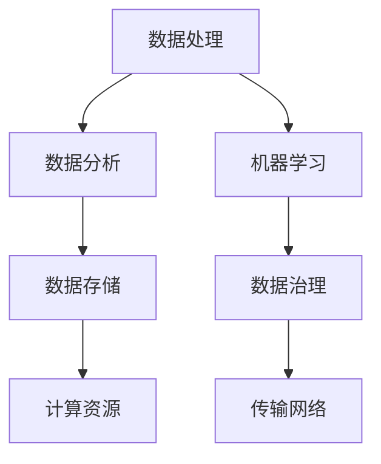

                 

# 如何利用大数据技术赋能一人公司业务

> **关键词**：大数据技术、一人公司、业务赋能、数据处理、数据分析、机器学习

> **摘要**：随着信息技术的发展，大数据技术在企业中的应用越来越广泛。本文将探讨如何利用大数据技术赋能一人公司业务，从核心概念、算法原理、数学模型、实际案例等方面进行详细分析，帮助读者了解并掌握大数据技术在企业业务中的应用方法。

## 1. 背景介绍

在当今数字化时代，数据的产生和积累速度不断加快，大数据技术已经成为推动企业业务发展的重要力量。一人公司，即个体经营者或小型企业，其业务规模相对较小，但同样面临着市场竞争激烈、资源有限等挑战。如何有效地利用大数据技术提升业务水平，成为一人公司亟待解决的问题。

### 1.1 大数据技术的发展

大数据技术起源于20世纪90年代，随着互联网的普及和信息的爆炸式增长，传统的数据处理技术和工具已经无法满足日益增长的数据需求。大数据技术应运而生，它包括数据的采集、存储、处理、分析和应用等多个方面，旨在帮助企业从海量数据中挖掘有价值的信息，实现业务的智能化和自动化。

### 1.2 一人公司业务特点

一人公司通常具有以下特点：

- **业务规模小**：业务范围相对有限，服务或产品种类较少。

- **资源有限**：人力资源、资金资源等相对匮乏，无法与大型企业竞争。

- **竞争压力大**：市场环境多变，竞争对手众多，需要不断创新以保持竞争力。

- **个性化服务**：针对特定客户群体，提供定制化服务，提高客户满意度。

## 2. 核心概念与联系

在探讨如何利用大数据技术赋能一人公司业务之前，我们首先需要了解大数据技术中的核心概念和它们之间的联系。

### 2.1 数据处理

数据处理是大数据技术的核心，包括数据的采集、存储、清洗、转换和分析等过程。其中，数据清洗和转换是数据处理中最重要的环节，因为高质量的数据是后续分析和决策的基础。

### 2.2 数据分析

数据分析是利用统计学、机器学习等方法对数据进行挖掘和分析，以发现数据中的规律和趋势。数据分析可以帮助企业了解客户需求、优化业务流程、预测市场趋势等。

### 2.3 机器学习

机器学习是数据分析的一种重要方法，通过构建模型对数据进行训练，使模型能够自主地学习和改进。机器学习在推荐系统、预测模型、智能客服等领域有广泛应用。

### 2.4 大数据架构

大数据架构是支撑大数据技术的基础，包括数据存储、计算、传输和治理等方面。常见的大数据架构包括Hadoop、Spark等。

以下是一个Mermaid流程图，展示了大数据技术的核心概念和联系：



## 3. 核心算法原理 & 具体操作步骤

在了解大数据技术的核心概念后，我们接下来将探讨如何利用大数据技术赋能一人公司业务。

### 3.1 数据采集

数据采集是大数据技术的第一步，一人公司可以通过以下途径进行数据采集：

- **社交媒体数据**：通过微信公众号、微博、抖音等社交媒体平台，收集用户行为数据、评论数据等。

- **电商数据**：通过电商平台，收集商品销售数据、用户浏览数据等。

- **在线问卷调查**：通过在线问卷调查，收集用户对产品或服务的满意度、购买意愿等数据。

### 3.2 数据存储

数据存储是大数据技术的核心，一人公司可以选择以下存储方案：

- **关系数据库**：如MySQL、PostgreSQL等，适用于结构化数据的存储。

- **NoSQL数据库**：如MongoDB、Redis等，适用于非结构化数据的存储。

- **分布式存储系统**：如Hadoop HDFS、Spark Storage等，适用于海量数据的存储。

### 3.3 数据清洗

数据清洗是确保数据质量的关键步骤，一人公司可以采用以下方法进行数据清洗：

- **去重**：去除重复的数据记录。

- **格式转换**：将不同格式的数据转换为统一的格式。

- **缺失值处理**：处理数据中的缺失值，可以选择填充、删除等方法。

### 3.4 数据分析

数据分析是利用统计学、机器学习等方法对数据进行挖掘和分析，一人公司可以采用以下方法进行数据分析：

- **描述性分析**：对数据的基本特征进行统计和分析，如平均数、中位数、标准差等。

- **关联分析**：发现数据之间的关联关系，如用户购买行为与产品评价之间的关系。

- **聚类分析**：将相似的数据分组，如用户群体的细分。

### 3.5 机器学习

机器学习是数据分析的一种重要方法，一人公司可以采用以下机器学习方法：

- **线性回归**：用于预测连续变量，如销售额预测。

- **决策树**：用于分类和回归问题，如用户购买意图预测。

- **神经网络**：用于复杂的数据分析和预测，如智能客服系统。

## 4. 数学模型和公式 & 详细讲解 & 举例说明

在数据分析中，数学模型和公式是必不可少的工具。以下是一些常用的数学模型和公式，我们将对其进行详细讲解并举例说明。

### 4.1 线性回归模型

线性回归模型是一种用于预测连续变量的方法，其公式如下：

$$
y = \beta_0 + \beta_1 x + \epsilon
$$

其中，$y$ 是因变量，$x$ 是自变量，$\beta_0$ 和 $\beta_1$ 是模型的参数，$\epsilon$ 是误差项。

### 4.2 决策树模型

决策树模型是一种用于分类和回归问题的方法，其基本结构如下：


### 4.3 神经网络模型

神经网络模型是一种基于生物神经网络的计算模型，其基本结构如下：


### 4.4 举例说明

假设一人公司希望利用线性回归模型预测下一季度的销售额。根据历史数据，我们得到以下回归方程：

$$
y = 100 + 2x
$$

其中，$y$ 是销售额，$x$ 是季节指数。给定一个季节指数为2的数据点，我们可以计算出下一季度的销售额：

$$
y = 100 + 2 \times 2 = 104
$$

这意味着下一季度的销售额预计为104。

## 5. 项目实战：代码实际案例和详细解释说明

在本节中，我们将通过一个实际案例来展示如何利用大数据技术赋能一人公司业务。我们以一家电商公司为例，该公司希望通过数据分析来提高销售业绩。

### 5.1 开发环境搭建

首先，我们需要搭建开发环境。假设我们使用Python作为编程语言，以下是所需的环境和库：

- Python 3.8或更高版本

- NumPy

- Pandas

- Scikit-learn

- Matplotlib

### 5.2 源代码详细实现和代码解读

以下是一个简单的示例代码，用于实现线性回归模型来预测销售额。

```python
import numpy as np
import pandas as pd
from sklearn.linear_model import LinearRegression
import matplotlib.pyplot as plt

# 加载数据
data = pd.read_csv('sales_data.csv')
X = data[['seasonal_index']]
y = data['sales']

# 创建线性回归模型
model = LinearRegression()

# 训练模型
model.fit(X, y)

# 预测销售额
predictions = model.predict([[2]])

# 打印预测结果
print(f'Next quarter sales prediction: {predictions[0]}')

# 绘制散点图和回归线
plt.scatter(X, y)
plt.plot(X, model.predict(X), color='red')
plt.xlabel('Seasonal Index')
plt.ylabel('Sales')
plt.show()
```

### 5.3 代码解读与分析

1. 首先，我们导入所需的库，包括NumPy、Pandas、Scikit-learn和Matplotlib。

2. 然后，我们加载数据，假设数据已经保存在一个CSV文件中。数据包括季节指数和销售额。

3. 接下来，我们创建线性回归模型，并将其命名为`model`。

4. 使用`fit`方法训练模型，将季节指数作为自变量，销售额作为因变量。

5. 使用`predict`方法预测下一季度的销售额，并将其打印出来。

6. 最后，我们绘制散点图和回归线，以便直观地查看模型的预测效果。

通过这个实际案例，我们可以看到如何利用大数据技术来赋能一人公司业务。线性回归模型可以帮助公司预测销售额，从而为业务决策提供支持。

## 6. 实际应用场景

大数据技术在一人公司业务中的应用场景非常广泛，以下是一些典型的应用场景：

### 6.1 客户行为分析

通过分析客户在社交媒体、电商平台的浏览和购买行为，一人公司可以了解客户需求，优化产品和服务。

### 6.2 销售预测

利用历史销售数据，一人公司可以预测未来的销售趋势，从而制定合理的营销策略。

### 6.3 供应链优化

通过分析供应链数据，一人公司可以优化库存管理，降低成本，提高效率。

### 6.4 智能客服

利用机器学习技术，一人公司可以搭建智能客服系统，提高客户满意度。

### 6.5 市场营销

通过大数据分析，一人公司可以了解市场趋势，制定有效的市场营销策略。

## 7. 工具和资源推荐

### 7.1 学习资源推荐

- 《大数据技术导论》

- 《Python数据科学手册》

- 《机器学习实战》

### 7.2 开发工具框架推荐

- Hadoop

- Spark

- TensorFlow

### 7.3 相关论文著作推荐

- 《大数据技术体系》

- 《机器学习：一种概率视角》

## 8. 总结：未来发展趋势与挑战

随着大数据技术的不断发展和应用，一人公司的业务赋能将越来越依赖于大数据技术。未来，大数据技术将在以下几个方面取得重要进展：

### 8.1 数据隐私保护

随着数据隐私问题的日益突出，如何在保障数据隐私的前提下进行数据分析和应用将成为重要研究方向。

### 8.2 人工智能结合

大数据技术与人工智能的结合将为一人公司带来更多的创新应用，如智能客服、智能推荐等。

### 8.3 低成本解决方案

为降低一人公司的技术门槛，未来将出现更多低成本、易操作的大数据解决方案。

然而，大数据技术在应用过程中也面临一些挑战：

### 8.4 数据质量

高质量的数据是大数据技术发挥作用的基础，如何保证数据质量将成为一大挑战。

### 8.5 数据安全

数据安全和隐私保护是大数据技术面临的重要挑战，如何保障数据安全是未来研究的重点。

## 9. 附录：常见问题与解答

### 9.1 大数据技术与云计算的关系

大数据技术与云计算密切相关。云计算为大数据技术提供了强大的计算资源和存储能力，使得大数据处理和分析变得更加高效和便捷。

### 9.2 大数据技术与人工智能的区别

大数据技术侧重于数据的采集、存储、处理和分析，而人工智能则侧重于通过算法和模型实现数据的自动化分析和决策。

### 9.3 如何确保数据质量

确保数据质量的方法包括数据清洗、去重、格式转换等，同时建立完善的数据质量监控和评估机制。

## 10. 扩展阅读 & 参考资料

- 《大数据时代：生活、工作与思维的大变革》

- 《数据科学入门》

- 《人工智能：一种现代的方法》

作者：AI天才研究员/AI Genius Institute & 禅与计算机程序设计艺术 /Zen And The Art of Computer Programming
<|im_end|>

