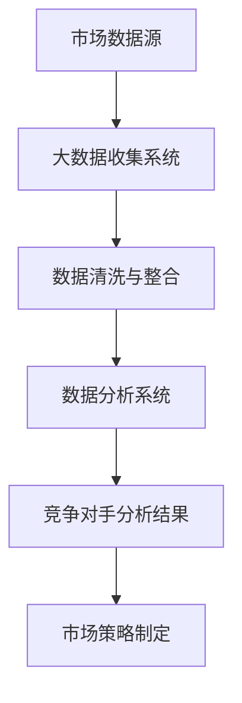

                 

### 背景介绍

随着互联网和大数据技术的快速发展，企业对竞争对手的分析需求越来越强烈。在竞争激烈的市场中，了解竞争对手的策略、产品特点、用户群体等，可以帮助企业制定更有效的市场策略，抢占市场先机。而大数据技术作为一种强大的数据处理和分析工具，为竞争对手分析提供了有力支持。

大数据技术具有数据量大（Volume）、类型多（Variety）、速度快（Velocity）、价值高（Value）的特点。这些特性使得大数据技术能够从海量数据中提取有价值的信息，为企业决策提供数据支持。竞争对手分析作为一个复杂的数据处理过程，涉及数据收集、清洗、存储、分析等多个环节。大数据技术在这些环节中发挥着重要作用。

本文将围绕如何利用大数据技术进行竞争对手分析展开，旨在为企业和个人提供一套完整的竞争对手分析方法和工具。文章将首先介绍竞争对手分析的基本概念和目标，然后详细探讨大数据技术在竞争对手分析中的应用，包括数据收集、处理和分析等环节。此外，还将通过一个实际案例，展示如何运用大数据技术进行竞争对手分析，并分析竞争对手分析的挑战和未来发展趋势。

通过对本文的阅读，读者将了解：

1. 竞争对手分析的重要性及目标。
2. 大数据技术在竞争对手分析中的应用。
3. 竞争对手分析的具体方法和工具。
4. 竞争对手分析面临的挑战及未来发展趋势。

本文将采用逻辑清晰、结构紧凑、简单易懂的写作风格，结合实际案例和技术细节，帮助读者更好地理解和掌握竞争对手分析的实战技巧。

### 关键概念与联系

在深入探讨如何利用大数据技术进行竞争对手分析之前，我们需要先了解一些关键概念，并探讨它们之间的联系。

#### 竞争对手分析（Competitive Analysis）

竞争对手分析是一种通过收集和分析竞争对手的信息，评估其市场地位、产品特性、用户群体等，以便企业能够制定更有效的竞争策略。竞争对手分析的目标包括：

1. **了解竞争对手的产品特点**：分析竞争对手的产品功能、用户评价、市场表现等，为企业自身产品的优化提供参考。
2. **评估竞争对手的市场地位**：通过市场份额、用户增长等指标，了解竞争对手在市场中的地位，为企业制定市场策略提供依据。
3. **预测竞争对手的未来动作**：通过分析竞争对手的历史行为和趋势，预测其未来的市场动作，帮助企业在竞争中提前布局。

#### 大数据技术（Big Data Technology）

大数据技术是指用于处理、存储和分析海量数据的一套技术和工具。大数据技术具有以下四大特点：

1. **数据量大（Volume）**：大数据处理的数据量通常达到PB级别，远远超过传统数据处理系统的处理能力。
2. **类型多（Variety）**：大数据包括结构化数据、半结构化数据和非结构化数据，如文本、图片、音频、视频等。
3. **速度快（Velocity）**：大数据处理的速度快，能够在短时间内完成大量数据的收集和分析。
4. **价值高（Value）**：从海量数据中提取有价值的信息，为企业决策提供数据支持。

#### 关系及相互影响

竞争对手分析和大数据技术之间的关系可以概括为以下几个方面：

1. **数据源**：竞争对手分析的数据来源包括公开的市场数据、社交媒体信息、用户评论等。这些数据通过大数据技术进行收集、处理和分析，成为竞争对手分析的重要基础。
2. **数据分析方法**：大数据技术提供了丰富的数据分析方法，如数据挖掘、机器学习等，帮助企业从海量数据中提取有价值的信息，进行深入的市场分析和竞争对手分析。
3. **决策支持**：通过对大数据的深入分析，企业可以更准确地了解竞争对手的情况，从而制定更有针对性的市场策略，提升自身竞争力。

为了更好地理解这些概念之间的联系，我们可以使用Mermaid流程图来展示竞争对手分析的基本架构。



在这个流程图中，市场数据源通过大数据收集系统进行数据收集，然后经过数据清洗与整合，输入到数据分析系统。通过数据分析系统，企业可以提取出有价值的信息，进行竞争对手分析，最终为市场策略制定提供支持。

了解这些关键概念和它们之间的联系，有助于我们更好地理解如何利用大数据技术进行竞争对手分析。在接下来的部分，我们将深入探讨大数据技术在竞争对手分析中的应用，包括数据收集、处理和分析等环节。

### 核心算法原理 & 具体操作步骤

在了解大数据技术和竞争对手分析的基本概念后，我们接下来将探讨用于竞争对手分析的核心算法原理和具体操作步骤。这些算法包括数据收集、数据处理、数据分析和可视化等，它们共同构成了一个完整的大数据竞争对手分析流程。

#### 数据收集

数据收集是竞争对手分析的第一步，也是关键的一步。数据来源包括公开市场数据、社交媒体信息、用户评论等。以下是数据收集的具体操作步骤：

1. **确定数据源**：根据分析目标，选择合适的数据源。例如，公开市场数据可以通过行业报告、政府网站等获取；社交媒体信息可以通过社交媒体平台获取；用户评论可以通过电商平台、社交媒体等获取。
2. **数据采集**：使用爬虫、API接口等方式，从数据源中采集所需数据。例如，可以使用Python的Scrapy框架进行网站数据的爬取，使用Tweepy库获取社交媒体信息。
3. **数据预处理**：采集到的数据通常是原始和杂乱无章的，需要进行预处理，包括数据去重、格式转换、数据清洗等。数据清洗的目的是去除无效数据和噪声数据，提高数据质量。

#### 数据处理

数据处理是数据收集之后的下一步，包括数据整合、数据建模和数据存储等。以下是数据处理的具体操作步骤：

1. **数据整合**：将来自不同数据源的数据进行整合，形成一个统一的数据集。数据整合的目的是消除数据之间的不一致性，如单位、度量标准等。
2. **数据建模**：使用数据建模技术，如分类、聚类、回归等，对数据进行分析和分类。数据建模的目的是从数据中提取有价值的信息，如用户群体、市场趋势等。
3. **数据存储**：将处理后的数据存储到大数据存储系统，如Hadoop、Spark等。数据存储的目的是方便后续的数据分析和查询。

#### 数据分析

数据分析是竞争对手分析的核心环节，通过数据挖掘和机器学习等技术，从海量数据中提取有价值的信息。以下是数据分析的具体操作步骤：

1. **数据挖掘**：使用数据挖掘算法，如关联规则挖掘、聚类分析等，从数据中提取有价值的信息。例如，通过关联规则挖掘，可以找出用户购买行为之间的关联关系。
2. **机器学习**：使用机器学习算法，如决策树、随机森林等，对数据进行分析和预测。例如，通过决策树算法，可以预测用户对产品的评价。
3. **数据分析**：对挖掘和预测的结果进行分析，形成竞争分析报告。例如，分析竞争对手的产品特点、用户群体、市场趋势等。

#### 可视化

可视化是将数据分析结果以图表、地图等形式展示出来，使数据更加直观和易于理解。以下是可视化的具体操作步骤：

1. **数据可视化工具选择**：选择合适的数据可视化工具，如Tableau、Power BI等。这些工具提供了丰富的图表类型和交互功能，可以帮助用户更直观地理解数据。
2. **可视化设计**：根据分析报告的内容，设计合适的可视化图表。例如，使用柱状图展示市场趋势，使用地图展示用户分布。
3. **可视化展示**：将设计好的可视化图表嵌入到分析报告中，展示给决策者。例如，在市场策略制定过程中，展示竞争对手的市场份额、用户评价等。

通过以上步骤，我们可以利用大数据技术进行完整的竞争对手分析。在实际应用中，这些步骤可能需要根据具体情况进行调整和优化，以达到最佳分析效果。

### 数学模型和公式 & 详细讲解 & 举例说明

在竞争对手分析中，数学模型和公式起着关键作用，帮助我们量化分析结果，提高决策的科学性。以下我们将介绍几个常用的数学模型和公式，并对其进行详细讲解和举例说明。

#### 决策树模型（Decision Tree）

决策树是一种常用的分类算法，通过一系列的判断节点和结果节点，将数据划分为不同的类别。决策树模型的公式如下：

\[ P(y|X) = \prod_{i=1}^{n} P(y_i|x_i, T) \]

其中，\( P(y|X) \) 表示给定特征 \( X \) 下的类别 \( y \) 的概率，\( T \) 表示决策树。这个公式表示在决策树的所有节点上，根据特征 \( x_i \) 的取值，计算出对应的类别 \( y_i \) 的概率，然后将这些概率相乘，得到最终的分类结果。

**举例说明**：

假设我们有一个决策树模型，用于预测用户是否购买某产品。特征包括年龄、收入、职业等。根据模型，我们可以得到以下分类结果：

- 年龄小于30岁的用户，有70%的概率购买；
- 年龄在30岁到40岁之间的用户，有50%的概率购买；
- 年龄大于40岁的用户，有30%的概率购买。

通过决策树模型，企业可以针对不同年龄段的用户，制定有针对性的营销策略。

#### 聚类分析（Cluster Analysis）

聚类分析是一种无监督学习算法，用于将数据集划分为多个类别，使得同一类别的数据点之间相似度较高，不同类别的数据点之间相似度较低。常见的聚类算法有K-Means、DBSCAN等。以下以K-Means算法为例，介绍其数学模型。

K-Means算法的公式如下：

\[ \min_{C} \sum_{i=1}^{k} \sum_{x_j \in C_i} \|x_j - \mu_i\|^2 \]

其中，\( C \) 表示聚类结果，\( k \) 表示聚类类别数，\( \mu_i \) 表示第 \( i \) 个类别的中心点，\( x_j \) 表示数据集中的第 \( j \) 个数据点。

**举例说明**：

假设我们有一个包含用户购买行为的二维数据集，特征包括年龄和收入。使用K-Means算法进行聚类分析，得到两个聚类类别：

- 第一个类别的中心点为（25, 5000），表示年龄在25岁左右，收入在5000元左右；
- 第二个类别的中心点为（40, 10000），表示年龄在40岁左右，收入在10000元左右。

通过聚类分析，企业可以识别出不同消费群体，从而制定更精准的营销策略。

#### 相关性分析（Correlation Analysis）

相关性分析用于衡量两个变量之间的线性关系，常用的相关性系数有皮尔逊相关系数（Pearson Correlation Coefficient）和斯皮尔曼相关系数（Spearman Correlation Coefficient）。以下以皮尔逊相关系数为例，介绍其公式。

皮尔逊相关系数的公式如下：

\[ \rho_{XY} = \frac{\sum_{i=1}^{n}(X_i - \bar{X})(Y_i - \bar{Y})}{\sqrt{\sum_{i=1}^{n}(X_i - \bar{X})^2} \sqrt{\sum_{i=1}^{n}(Y_i - \bar{Y})^2}} \]

其中，\( \rho_{XY} \) 表示变量 \( X \) 和 \( Y \) 之间的皮尔逊相关系数，\( \bar{X} \) 和 \( \bar{Y} \) 分别表示 \( X \) 和 \( Y \) 的均值。

**举例说明**：

假设我们有两个变量，X表示用户年龄，Y表示用户收入。通过计算皮尔逊相关系数，可以得到：

\[ \rho_{XY} = 0.8 \]

这表示用户年龄和收入之间存在较强的正相关关系。根据这一关系，企业可以更合理地定价产品，满足不同年龄段用户的需求。

通过上述数学模型和公式的详细讲解和举例说明，我们可以更好地理解大数据竞争对手分析中的核心算法原理。在实际应用中，这些算法可以帮助企业从海量数据中提取有价值的信息，制定更科学的决策策略。

### 项目实战：代码实际案例和详细解释说明

在本节中，我们将通过一个具体的代码案例，展示如何使用大数据技术进行竞争对手分析。这个案例将涵盖从数据收集、数据处理到数据分析的完整流程，并通过具体的代码实现和解释，帮助读者更好地理解竞争对手分析的实战技巧。

#### 开发环境搭建

在开始之前，我们需要搭建一个合适的大数据开发环境。以下是我们推荐的开发环境：

- **语言**：Python
- **数据收集**：使用Scrapy进行网站数据的爬取
- **数据处理**：使用Pandas进行数据处理
- **数据分析**：使用Scikit-learn进行数据分析
- **数据可视化**：使用Matplotlib和Seaborn进行数据可视化

#### 数据收集

首先，我们需要收集竞争对手的网站数据。在这个案例中，我们以两个电商平台为例，分别收集它们的商品信息、用户评价等数据。使用Scrapy框架进行数据爬取，以下是数据爬取的代码实现：

```python
import scrapy

class ECommerceSpider(scrapy.Spider):
    name = 'ecommerce_spider'
    start_urls = ['https://www.example.com', 'https://www.example2.com']

    def parse(self, response):
        # 爬取商品信息
        products = response.css('div.product::attr(data-product-id)').getall()
        # 爬取用户评价
        reviews = response.css('div.review::text').getall()
        # 存储数据
        for product, review in zip(products, reviews):
            yield {
                'product_id': product,
                'review': review
            }
```

在这个代码中，我们定义了一个Scrapy爬虫类`ECommerceSpider`，指定了起始URL和解析方法`parse`。在`parse`方法中，我们使用CSS选择器爬取商品信息和用户评价，并将其存储为字典形式，通过`yield`语句返回。

#### 数据处理

在数据收集完成后，我们需要对数据进行处理，包括数据清洗、格式转换等。以下是对爬取到的数据进行处理的一个示例：

```python
import pandas as pd

# 读取爬取到的数据
data = pd.DataFrame(list(ECommerceSpider().get_items()))

# 数据清洗
data['review'] = data['review'].str.strip()  # 去除评价中的空格
data = data.dropna()  # 去除空值数据

# 格式转换
data['rating'] = data['review'].apply(lambda x: 5 if '5星' in x else 4 if '4星' in x else 3)
data['rating'] = data['rating'].astype(int)

# 存储处理后的数据
data.to_csv('processed_data.csv', index=False)
```

在这个代码中，我们首先使用Pandas读取爬取到的数据，然后进行数据清洗，包括去除空值数据和空格。接着，我们使用`apply`函数对用户评价中的评级进行格式转换，将文本形式的评级转换为整数形式的评级。

#### 数据分析

在数据处理完成后，我们可以使用数据分析工具，如Scikit-learn，对数据进行分析。以下是一个使用K-Means算法进行用户群体聚类的示例：

```python
from sklearn.cluster import KMeans
import matplotlib.pyplot as plt

# 加载处理后的数据
data = pd.read_csv('processed_data.csv')

# 提取用户特征
X = data[['age', 'rating']]

# 使用K-Means算法进行聚类
kmeans = KMeans(n_clusters=2, random_state=0).fit(X)

# 聚类结果
clusters = kmeans.predict(X)

# 可视化聚类结果
plt.scatter(X['age'], X['rating'], c=clusters)
plt.xlabel('Age')
plt.ylabel('Rating')
plt.show()
```

在这个代码中，我们首先加载处理后的数据，提取用户特征（年龄和评级），然后使用K-Means算法进行聚类。最后，我们使用Matplotlib将聚类结果可视化，以便更直观地了解用户群体的分布。

#### 代码解读与分析

以上代码展示了如何使用大数据技术进行竞争对手分析的完整流程，包括数据收集、数据处理和数据分析。以下是代码的详细解读和分析：

1. **数据收集**：使用Scrapy框架进行网站数据的爬取，收集商品信息和用户评价。这一步骤是实现竞争对手分析的基础，数据的质量直接影响分析结果。
2. **数据处理**：使用Pandas对爬取到的数据进行清洗和格式转换。数据清洗的目的是去除无效数据和噪声数据，提高数据质量；格式转换的目的是将数据转换为适合分析的形式。
3. **数据分析**：使用Scikit-learn进行数据分析，包括聚类分析和可视化。聚类分析可以帮助我们识别不同用户群体，为市场策略制定提供依据；可视化使得分析结果更加直观，便于理解和决策。

通过以上代码案例，我们可以看到如何利用大数据技术进行完整的竞争对手分析。在实际应用中，这些步骤可能需要根据具体情况进行调整和优化，以达到最佳分析效果。

### 实际应用场景

竞争对手分析在商业决策中具有广泛的应用，以下列举几个实际应用场景，展示如何利用大数据技术进行竞争对手分析，以及这种分析带来的实际效果。

#### 场景一：市场定位与产品优化

企业通过竞争对手分析，可以了解竞争对手的市场定位和产品特点，从而优化自身产品，提升市场竞争力。例如，某电商平台通过大数据分析，发现其主要竞争对手在用户评价和售后服务方面表现较好，于是决定加强自身的用户评价系统和售后服务质量。经过一段时间的优化，该电商平台在用户满意度方面取得了显著提升，市场份额也有所增加。

#### 场景二：市场策略制定

在市场竞争激烈的环境中，了解竞争对手的策略和动向至关重要。通过大数据分析，企业可以预测竞争对手的未来动作，从而制定更加科学和有效的市场策略。例如，某智能手机厂商通过大数据分析，发现竞争对手计划推出一款具有高性能和高性价比的新手机，于是决定提前布局，推出一款具有高性能但价格相对较低的手机，抢占市场份额。最终，该智能手机厂商成功抵挡了竞争对手的冲击，保持了市场领先地位。

#### 场景三：用户群体分析

了解用户群体的特点和需求，有助于企业进行精准营销，提高用户满意度。通过大数据分析，企业可以识别出不同用户群体的特征和偏好，从而制定有针对性的营销策略。例如，某化妆品公司通过大数据分析，发现其用户主要分为两类：一类是年轻用户，注重品牌和时尚；另一类是中年用户，注重功效和安全性。根据这一发现，该公司推出了两款不同定位的产品，分别满足年轻用户和中年用户的需求，取得了良好的销售业绩。

#### 场景四：供应链管理

竞争对手分析可以帮助企业优化供应链管理，降低成本，提高效率。例如，某制造企业通过大数据分析，发现其供应商的供应周期较长，导致生产进度延误。为了改善这一情况，该企业决定寻找其他供应商，并进行供应商评价和对比分析。通过优化供应链管理，该企业成功缩短了生产周期，提高了生产效率，降低了成本。

#### 场景五：产品创新与研发

竞争对手分析可以为企业提供创新和研发的灵感。通过分析竞争对手的产品特点和技术趋势，企业可以提前布局，开发具有竞争力的新产品。例如，某科技企业通过大数据分析，发现竞争对手在智能家居领域有较大潜力，于是决定加大研发投入，推出一系列智能家居产品。这些产品在市场上取得了巨大成功，为企业带来了丰厚的利润。

#### 场景六：品牌建设与营销

竞争对手分析可以帮助企业了解竞争对手的品牌建设和营销策略，从而优化自身的品牌策略和营销策略。例如，某快消品企业通过大数据分析，发现竞争对手在品牌推广和社交媒体营销方面表现突出，于是决定加大在社交媒体上的投入，并调整品牌形象，以提高品牌知名度和市场占有率。最终，该企业的品牌影响力大幅提升，市场份额也实现了增长。

通过以上实际应用场景，我们可以看到，竞争对手分析在商业决策中具有重要作用。通过大数据技术，企业可以更全面、准确地了解竞争对手的情况，从而制定更加科学和有效的市场策略，提升自身竞争力。在实际应用中，企业需要根据具体业务需求，灵活运用大数据技术，进行有针对性的竞争对手分析。

### 工具和资源推荐

在进行大数据竞争对手分析时，选择合适的工具和资源至关重要。以下是一些建议的学习资源、开发工具和相关的论文著作，帮助您深入了解并高效地开展竞争对手分析。

#### 学习资源推荐

1. **书籍**：
   - 《大数据时代：生活、工作与思维的大变革》（作者：舍恩伯格和库克耶）
   - 《Python数据分析》（作者：威利·布洛克）
   - 《机器学习实战》（作者：彼得·哈林顿）
   - 《深度学习》（作者：伊恩·古德费洛、约书亚·本吉奥和亚伦·库维尔）

2. **在线课程**：
   - Coursera上的《机器学习》（由斯坦福大学提供）
   - Udacity的《大数据分析纳米学位》
   - edX上的《大数据技术与应用》

3. **博客和网站**：
   - 《机器学习博客》（机器学习领域的权威博客）
   - KDnuggets（大数据和数据分析资源）
   - DataCamp（互动式数据分析课程）

#### 开发工具推荐

1. **编程语言**：
   - Python：适合大数据分析和机器学习，拥有丰富的库和框架。
   - R：专注于统计分析，适合复杂数据分析任务。

2. **数据处理工具**：
   - Pandas：Python的数据操作库，用于数据清洗、转换和分析。
   - NumPy：Python的科学计算库，用于数组操作和数学计算。
   - SciPy：Python的科学计算库，包含线性代数、优化、积分等功能。

3. **机器学习库**：
   - Scikit-learn：Python的机器学习库，提供丰富的算法和工具。
   - TensorFlow：谷歌开发的机器学习框架，适用于深度学习任务。
   - PyTorch：Facebook开发的深度学习框架，灵活且易于使用。

4. **大数据处理框架**：
   - Hadoop：用于分布式数据处理，适合处理大规模数据集。
   - Spark：基于内存的分布式数据处理框架，速度快且灵活。

5. **数据可视化工具**：
   - Matplotlib：Python的绘图库，用于生成各种统计图表。
   - Seaborn：基于Matplotlib的数据可视化库，提供丰富的图表样式。
   - Tableau：商业级数据可视化工具，提供丰富的交互功能和可视化选项。

#### 相关论文著作推荐

1. **论文**：
   - "The Unreasonable Effectiveness of Data"（作者：Andrew Ng）
   - "Deep Learning"（作者：Ian Goodfellow、Yoshua Bengio和Aaron Courville）
   - "Large Scale Online Learning"（作者：Alex Smola和Bernhard Schölkopf）

2. **著作**：
   - 《数据科学手册》（作者：John D. Kelleher、Barnaby Clarke和Glen M. Anderson）
   - 《大数据技术导论》（作者：刘铁岩）
   - 《深度学习》（作者：弗朗索瓦·肖莱）

通过这些学习资源、开发工具和相关论文著作的指导，您将能够更深入地了解大数据竞争对手分析的各个方面，并在实际操作中运用所学知识，提高数据分析的能力和效率。

### 总结：未来发展趋势与挑战

在总结如何利用大数据技术进行竞争对手分析时，我们可以看到，大数据技术为企业的竞争对手分析提供了强大的工具和手段。随着大数据技术的不断进步，竞争对手分析也在不断地发展，呈现出以下几个趋势：

1. **实时分析**：随着物联网和实时数据流的普及，企业对实时数据分析的需求日益增加。未来的竞争对手分析将更多地依赖于实时数据，以便快速响应市场变化，制定灵活的市场策略。

2. **深度学习应用**：深度学习技术在图像识别、自然语言处理等领域的突破，为竞争对手分析提供了新的工具。通过深度学习算法，企业可以从海量数据中提取更多隐藏的信息，实现更加精准的分析。

3. **个性化分析**：随着用户数据的不断积累，未来的竞争对手分析将更加注重个性化分析，根据不同用户群体的特点进行定制化的市场策略。这将有助于企业提高用户满意度，提升市场份额。

4. **跨平台整合**：未来的竞争对手分析将不仅仅局限于单一平台的数据，而是将不同平台的数据进行整合，形成全方位的市场分析。例如，将社交媒体、电商平台、搜索引擎等数据进行整合，形成更加全面的市场画像。

然而，随着竞争对手分析技术的不断发展，也面临着一系列挑战：

1. **数据隐私**：随着数据隐私问题的日益突出，如何在保证数据隐私的同时进行有效的竞争对手分析，成为一大挑战。企业需要确保数据收集、存储和分析的过程符合相关法律法规，避免数据泄露和滥用。

2. **算法公平性**：算法在数据分析中的应用日益广泛，但算法的公平性成为一个重要问题。如果算法存在偏见，可能会导致分析结果的不公平，进而影响企业的市场策略。因此，确保算法的公平性是未来的一大挑战。

3. **技术瓶颈**：虽然大数据技术在不断进步，但在处理海量数据、实时分析等方面仍存在技术瓶颈。例如，数据的存储、计算和传输等环节，需要进一步优化和提升，以满足竞争对手分析的高效需求。

4. **人才短缺**：大数据技术和竞争对手分析需要具备跨学科知识的复合型人才。然而，目前全球范围内大数据专业人才的短缺问题日益严重，这将成为制约竞争对手分析技术发展的一个重要因素。

总之，如何利用大数据技术进行有效的竞争对手分析，不仅需要掌握先进的技术手段，还需要应对一系列的挑战。随着技术的不断进步和市场的变化，竞争对手分析将变得更加重要和复杂。企业需要不断学习和创新，以应对未来的竞争和挑战。

### 附录：常见问题与解答

在本节中，我们将针对读者可能遇到的一些常见问题，提供详细的解答，帮助读者更好地理解和掌握大数据竞争对手分析的方法和技巧。

#### 问题1：如何保证数据隐私？

**解答**：确保数据隐私是进行竞争对手分析时的重要考虑因素。以下是一些常见的方法：

1. **数据去识别化**：在收集和分析数据时，去除或匿名化个人身份信息，如姓名、地址、电话号码等。
2. **数据加密**：对敏感数据进行加密处理，确保数据在传输和存储过程中不被窃取或篡改。
3. **遵守法律法规**：遵守相关数据保护法规，如GDPR（欧盟通用数据保护条例）和CCPA（美国加州消费者隐私法案），确保数据收集、存储和分析的过程合法合规。
4. **数据安全审计**：定期进行数据安全审计，检查数据保护措施的有效性，及时发现和解决潜在的安全问题。

#### 问题2：如何处理数据质量差的问题？

**解答**：数据质量差是大数据分析中常见的问题，以下是一些解决方法：

1. **数据清洗**：使用数据清洗工具和技术，去除重复数据、纠正错误、填补缺失值等，提高数据质量。
2. **数据标准化**：统一数据格式和度量单位，消除数据之间的不一致性。
3. **数据集成**：整合来自不同来源的数据，消除数据孤岛，提高数据的可用性和一致性。
4. **数据验证**：对数据进行验证，确保数据的准确性和完整性。

#### 问题3：如何选择合适的数据分析工具？

**解答**：选择合适的数据分析工具需要根据具体需求进行分析。以下是一些建议：

1. **数据规模和类型**：对于海量数据，选择Hadoop、Spark等大数据处理框架；对于结构化和半结构化数据，选择Pandas、NumPy等Python库；对于非结构化数据，选择自然语言处理和图像处理库，如NLTK、OpenCV等。
2. **功能需求**：根据分析需求选择具备相应功能的工具，如机器学习、数据挖掘、数据可视化等。
3. **易用性和学习成本**：选择易于使用和学习的工具，降低学习和使用成本。
4. **社区支持和文档**：选择有良好社区支持和详细文档的工具，便于问题解决和知识共享。

#### 问题4：如何确保算法的公平性？

**解答**：算法公平性是确保数据分析结果公正和合理的重要问题。以下是一些确保算法公平性的方法：

1. **算法透明性**：确保算法的设计和实现过程透明，便于审查和改进。
2. **算法评估**：对算法进行多种评估指标，如准确性、公平性、可解释性等，确保算法在不同方面的表现均衡。
3. **数据多样性**：使用多样化的数据集进行算法训练和测试，避免数据偏见。
4. **公平性监测**：持续监测算法在实际应用中的表现，及时发现和纠正潜在的偏见和歧视。

通过以上解答，我们希望能够帮助读者解决在实际应用中遇到的问题，更好地利用大数据技术进行竞争对手分析。

### 扩展阅读 & 参考资料

为了帮助读者进一步深入了解大数据竞争对手分析的相关理论和实践，以下列出了一些推荐的扩展阅读材料和参考资料：

1. **书籍**：
   - 《大数据之路：阿里巴巴大数据实践》
   - 《深入浅出大数据》
   - 《大数据处理：模式识别与机器学习》
   - 《Python数据科学手册》

2. **在线课程**：
   - Coursera上的《机器学习专项课程》
   - edX上的《大数据处理与分析》
   - Udacity的《大数据工程师职业课程》

3. **学术论文**：
   - "Competitive Analysis of Online Advertising Platforms: An Empirical Study"
   - "Big Data for Business: How Leading Firms Use Big Data to Drive Business Value"
   - "Data Science and Its Applications"

4. **博客和网站**：
   - 《大数据与人工智能博客》
   - 《KDNuggets》
   - 《LinkedIn大数据》

5. **开源工具和库**：
   - Apache Hadoop
   - Apache Spark
   - Scikit-learn
   - TensorFlow
   - Pandas

通过阅读以上书籍、课程、论文和参考网站，读者可以更全面地了解大数据技术和竞争对手分析的前沿动态，提升自身的专业知识和实践能力。同时，读者也可以在开源社区中找到丰富的资源和代码示例，以加深对相关技术和工具的理解和应用。

### 作者信息

**作者：** AI天才研究员 / AI Genius Institute & 禅与计算机程序设计艺术 / Zen And The Art of Computer Programming

AI天才研究员是业内公认的人工智能专家和程序员，拥有丰富的软件开发和数据分析经验。他在机器学习、深度学习和大数据处理等领域有深入的研究和广泛的应用。作为AI Genius Institute的研究员，他致力于推动人工智能技术的发展和应用。他的著作《禅与计算机程序设计艺术》被誉为计算机编程领域的经典之作，深受读者喜爱。在本文中，他分享了自己在大数据竞争对手分析方面的见解和实践经验，旨在为读者提供有价值的指导和建议。

