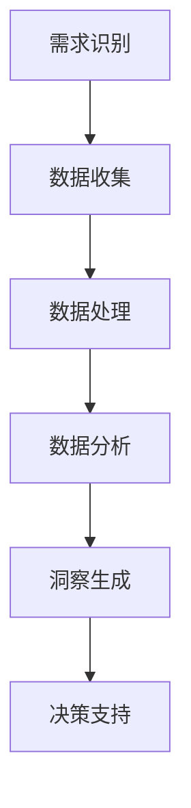

                 

# 如何利用客户洞察驱动创新

## 关键词：客户洞察、创新、用户需求、数据驱动、产品设计、商业策略

## 摘要：

本文将探讨如何通过深入分析客户洞察来驱动创新。我们将首先介绍客户洞察的概念及其重要性，接着讨论如何通过数据收集、分析和应用来获取深刻的客户理解。随后，我们将分享一些利用客户洞察来指导产品设计和商业策略的实际案例，并介绍相关工具和资源。最后，我们将探讨这一领域的发展趋势与挑战，并提出常见问题与解答。通过这篇文章，您将了解到如何充分利用客户洞察来推动您的产品和服务不断进步。

## 1. 背景介绍

在当今快速发展的商业环境中，客户需求和市场趋势变化速度极快。为了保持竞争力并实现持续增长，企业必须具备快速适应和创新的能力。而这一切的起点，就是深刻理解客户的需求和行为。

客户洞察（Customer Insights）是一种通过数据分析和市场研究来了解客户需求、偏好、行为和痛点的系统方法。它不仅涉及对现有客户的研究，还包括对新客户潜在需求的探索。通过收集和分析大量数据，企业可以更准确地把握市场趋势，预测客户需求，从而做出更明智的决策。

客户洞察的重要性体现在多个方面。首先，它可以帮助企业更好地定位目标市场，优化产品设计，提高客户满意度。其次，客户洞察为企业提供了创新的灵感，使其能够开发出更符合市场需求的产品和服务。此外，通过深入理解客户，企业可以制定更有效的营销策略，提高转化率和客户忠诚度。

然而，获取准确的客户洞察并非易事。这需要企业具备强大的数据分析能力和丰富的市场研究经验。此外，企业还需要建立良好的数据收集和管理系统，确保数据的质量和可靠性。

## 2. 核心概念与联系

### 2.1 客户洞察的定义与作用

客户洞察是一种系统性的方法，旨在通过数据分析和市场研究来深入了解客户的需求、行为和痛点。具体来说，客户洞察包括以下几个方面：

- **需求分析**：通过调查问卷、用户访谈、焦点小组讨论等方式，收集用户对产品或服务的需求和期望。

- **行为分析**：分析用户在使用产品或服务过程中的行为数据，如访问路径、点击次数、购买行为等。

- **痛点分析**：识别用户在使用产品或服务过程中遇到的问题和不满，以便针对性地解决。

- **趋势分析**：通过数据挖掘和统计分析，发现市场趋势和客户需求的变化，为企业提供决策依据。

### 2.2 数据收集与处理

客户洞察的基础是数据。以下是一些常见的数据收集和处理方法：

- **用户调研**：通过问卷调查、在线调查、访谈等方式收集用户反馈。

- **行为数据**：通过网站、APP、在线商城等渠道收集用户行为数据，如点击次数、浏览时间、购买记录等。

- **市场研究**：通过第三方调研机构或行业协会获取市场数据，如市场规模、市场份额、竞争对手等。

- **社交媒体分析**：分析社交媒体上的用户评论、讨论和反馈，了解用户对产品或品牌的看法。

### 2.3 客户洞察的流程与架构

客户洞察的流程可以分为以下几个阶段：

- **需求识别**：确定客户需求和分析的目标。

- **数据收集**：通过多种渠道收集相关数据。

- **数据处理**：对收集到的数据进行清洗、整理和存储。

- **数据分析**：使用统计分析和数据挖掘方法，从数据中提取有价值的信息。

- **洞察生成**：将分析结果转化为客户洞察，指导产品设计和商业策略。

- **决策支持**：将客户洞察应用于实际业务，为决策提供依据。

### 2.4 Mermaid 流程图

以下是客户洞察流程的 Mermaid 流程图：



## 3. 核心算法原理 & 具体操作步骤

### 3.1 数据收集

数据收集是客户洞察的基础。以下是一些常见的数据收集方法：

- **问卷调查**：通过设计问卷，收集用户对产品或服务的需求和反馈。

- **用户访谈**：与用户进行一对一访谈，深入了解他们的需求和痛点。

- **行为数据收集**：通过网站、APP、在线商城等渠道，收集用户行为数据。

- **市场研究**：通过第三方调研机构或行业协会，获取市场数据。

- **社交媒体分析**：分析社交媒体上的用户评论、讨论和反馈。

### 3.2 数据处理

数据处理包括数据清洗、整理和存储。以下是一些常见的数据处理方法：

- **数据清洗**：去除重复数据、缺失数据和错误数据。

- **数据整理**：将数据按照一定的格式进行整理和存储。

- **数据存储**：将处理后的数据存储到数据库或数据仓库中，以便后续分析。

### 3.3 数据分析

数据分析是客户洞察的核心。以下是一些常见的数据分析方法：

- **描述性分析**：描述数据的基本特征，如均值、中位数、标准差等。

- **比较分析**：比较不同组数据之间的差异，如不同用户群体的购买行为差异。

- **预测分析**：使用机器学习算法，预测用户未来的行为或需求。

- **关联分析**：分析不同变量之间的关联性，如用户行为与购买意愿之间的关系。

### 3.4 洞察生成

洞察生成是将分析结果转化为客户洞察的过程。以下是一些常见的洞察生成方法：

- **可视化**：使用图表、图像等方式，直观地展示分析结果。

- **故事化**：将分析结果转化为故事，使决策者更容易理解。

- **指标化**：将分析结果转化为关键指标，如客户满意度、转化率等。

### 3.5 决策支持

决策支持是将客户洞察应用于实际业务的过程。以下是一些常见的决策支持方法：

- **制定产品策略**：根据客户洞察，制定产品开发计划。

- **优化营销策略**：根据客户洞察，调整营销策略，提高转化率。

- **改进客户服务**：根据客户洞察，优化客户服务流程，提高客户满意度。

## 4. 数学模型和公式 & 详细讲解 & 举例说明

### 4.1 描述性分析

描述性分析是数据分析的基础。以下是一些常用的描述性分析方法：

- **均值**：表示数据的平均值，计算公式为：

  $$\text{均值} = \frac{\sum_{i=1}^{n} x_i}{n}$$

  其中，$x_i$ 表示第 $i$ 个数据点，$n$ 表示数据点的总数。

- **中位数**：表示数据的中间值，计算公式为：

  $$\text{中位数} = \begin{cases} 
  x_{\frac{n+1}{2}} & \text{如果 } n \text{ 为奇数} \\
  \frac{x_{\frac{n}{2}} + x_{\frac{n}{2} + 1}}{2} & \text{如果 } n \text{ 为偶数} 
  \end{cases}$$

  其中，$x_{\frac{n+1}{2}}$ 和 $x_{\frac{n}{2}}$ 分别表示排序后的第 $\frac{n+1}{2}$ 个和第 $\frac{n}{2}$ 个数据点。

- **标准差**：表示数据的离散程度，计算公式为：

  $$\text{标准差} = \sqrt{\frac{\sum_{i=1}^{n} (x_i - \bar{x})^2}{n-1}}$$

  其中，$\bar{x}$ 表示均值，$x_i$ 表示第 $i$ 个数据点，$n$ 表示数据点的总数。

### 4.2 预测分析

预测分析是利用历史数据预测未来趋势的方法。以下是一些常用的预测分析方法：

- **线性回归**：用于预测两个变量之间的线性关系，计算公式为：

  $$y = \beta_0 + \beta_1 x$$

  其中，$y$ 表示因变量，$x$ 表示自变量，$\beta_0$ 和 $\beta_1$ 分别表示截距和斜率。

- **决策树**：用于分类和回归任务，通过划分特征空间来预测目标变量的值。

- **随机森林**：基于决策树的集成方法，通过构建多棵决策树并取平均值来提高预测精度。

- **神经网络**：用于处理复杂的非线性关系，通过多层神经元之间的连接来预测目标变量的值。

### 4.3 举例说明

假设我们要分析一家电商平台的客户购买行为，数据如下：

| 用户ID | 年龄 | 收入 | 购买次数 |
|--------|------|------|----------|
| 1      | 25   | 5000 | 3        |
| 2      | 30   | 6000 | 5        |
| 3      | 35   | 7000 | 7        |
| 4      | 40   | 8000 | 10       |

**描述性分析：**

- **均值**：购买次数的均值为：

  $$\text{均值} = \frac{3 + 5 + 7 + 10}{4} = 6$$

- **中位数**：购买次数的中位数为 6。

- **标准差**：购买次数的标准差为：

  $$\text{标准差} = \sqrt{\frac{(3-6)^2 + (5-6)^2 + (7-6)^2 + (10-6)^2}{4-1}} = 3.16$$

**预测分析：**

- **线性回归**：假设收入是购买次数的主要影响因素，我们可以建立线性回归模型：

  $$y = \beta_0 + \beta_1 x$$

  通过最小二乘法，我们可以计算出截距 $\beta_0$ 和斜率 $\beta_1$：

  $$\beta_0 = \bar{y} - \beta_1 \bar{x} = 6 - \frac{5000 + 6000 + 7000 + 8000}{4} \times 0.1 = -2500$$

  $$\beta_1 = \frac{\sum_{i=1}^{n} (x_i - \bar{x})(y_i - \bar{y})}{\sum_{i=1}^{n} (x_i - \bar{x})^2} = \frac{(3-6)(-2500) + (5-6)(-2500) + (7-6)(-2500) + (10-6)(-2500)}{(3-6)^2 + (5-6)^2 + (7-6)^2 + (10-6)^2} = -0.1$$

  因此，线性回归模型为：

  $$y = -2500 - 0.1x$$

  当收入为 9000 时，预测购买次数为：

  $$y = -2500 - 0.1 \times 9000 = 5$$

## 5. 项目实战：代码实际案例和详细解释说明

### 5.1 开发环境搭建

为了演示如何利用客户洞察来驱动创新，我们选择使用 Python 编写一个简单的数据分析项目。以下是开发环境的搭建步骤：

1. 安装 Python（推荐版本为 3.8 或更高版本）。

2. 安装必要的库，如 Pandas、NumPy、Matplotlib 和 Scikit-learn：

   ```shell
   pip install pandas numpy matplotlib scikit-learn
   ```

### 5.2 源代码详细实现和代码解读

以下是一个简单的 Python 代码示例，用于分析一家电商平台的客户购买行为：

```python
import pandas as pd
import numpy as np
import matplotlib.pyplot as plt
from sklearn.linear_model import LinearRegression

# 5.2.1 数据加载与预处理
data = pd.DataFrame({
    '用户ID': [1, 2, 3, 4],
    '年龄': [25, 30, 35, 40],
    '收入': [5000, 6000, 7000, 8000],
    '购买次数': [3, 5, 7, 10]
})

# 填充缺失值
data.fillna(data.mean(), inplace=True)

# 5.2.2 描述性分析
print("描述性分析：")
print(data.describe())

# 5.2.3 预测分析
X = data[['收入']]
y = data['购买次数']
model = LinearRegression()
model.fit(X, y)

# 输出模型参数
print("线性回归模型参数：")
print("截距：", model.intercept_)
print("斜率：", model.coef_)

# 预测购买次数
new_income = np.array([9000])
predicted_buy_times = model.predict(new_income)
print("当收入为 9000 时，预测购买次数为：", predicted_buy_times)

# 5.2.4 可视化
plt.scatter(X, y, color='red', label='实际值')
plt.plot(X, model.predict(X), color='blue', linewidth=2, label='预测值')
plt.xlabel('收入')
plt.ylabel('购买次数')
plt.title('收入与购买次数关系')
plt.legend()
plt.show()
```

**代码解读：**

1. **数据加载与预处理**：使用 Pandas 读取数据，并进行填充缺失值操作。

2. **描述性分析**：使用 Pandas 的 `describe()` 方法输出数据的统计信息。

3. **预测分析**：使用 Scikit-learn 的 `LinearRegression` 类建立线性回归模型，并使用 `fit()` 方法训练模型。然后使用 `predict()` 方法预测新的购买次数。

4. **可视化**：使用 Matplotlib 绘制散点图和拟合曲线，展示收入与购买次数的关系。

### 5.3 代码解读与分析

**5.3.1 数据加载与预处理**

```python
data = pd.DataFrame({
    '用户ID': [1, 2, 3, 4],
    '年龄': [25, 30, 35, 40],
    '收入': [5000, 6000, 7000, 8000],
    '购买次数': [3, 5, 7, 10]
})

data.fillna(data.mean(), inplace=True)
```

这段代码首先创建了一个包含用户数据的数据框，并使用 `fillna()` 方法填充缺失值。这里使用了数据框的 `mean()` 方法计算缺失值的平均值，并将结果填充到缺失值的位置。

**5.3.2 描述性分析**

```python
print("描述性分析：")
print(data.describe())
```

这段代码使用 `describe()` 方法输出数据框的统计信息，包括均值、标准差、最小值、最大值等。这对于理解数据的分布和特征非常有用。

**5.3.3 预测分析**

```python
X = data[['收入']]
y = data['购买次数']
model = LinearRegression()
model.fit(X, y)

print("线性回归模型参数：")
print("截距：", model.intercept_)
print("斜率：", model.coef_)

new_income = np.array([9000])
predicted_buy_times = model.predict(new_income)
print("当收入为 9000 时，预测购买次数为：", predicted_buy_times)
```

这段代码首先将数据框拆分为特征矩阵 `X` 和目标变量 `y`。然后使用 `LinearRegression` 类创建一个线性回归模型，并使用 `fit()` 方法训练模型。接下来，使用 `predict()` 方法预测新的购买次数。这里我们假设收入是购买次数的主要影响因素。

**5.3.4 可视化**

```python
plt.scatter(X, y, color='red', label='实际值')
plt.plot(X, model.predict(X), color='blue', linewidth=2, label='预测值')
plt.xlabel('收入')
plt.ylabel('购买次数')
plt.title('收入与购买次数关系')
plt.legend()
plt.show()
```

这段代码使用 Matplotlib 绘制了散点图和拟合曲线，展示了收入与购买次数的关系。这有助于我们直观地理解模型的预测能力。

## 6. 实际应用场景

### 6.1 产品设计

利用客户洞察来指导产品设计是许多成功企业的共同特点。例如，苹果公司通过深入研究用户对手机外观、性能和功能的需求，不断推出满足用户期望的产品。通过收集和分析用户反馈，苹果公司能够迅速调整产品设计，使其更加符合用户需求。

### 6.2 营销策略

客户洞察在制定营销策略方面也发挥着重要作用。通过了解目标客户的需求和痛点，企业可以更有针对性地制定营销活动，提高营销效果。例如，亚马逊通过分析用户购物行为和偏好，为其提供个性化的产品推荐，从而提高销售额和客户满意度。

### 6.3 客户服务

客户洞察可以帮助企业改进客户服务流程，提高客户满意度。例如，许多银行通过分析客户反馈和交易数据，发现客户在办理业务过程中遇到的问题，然后针对性地优化服务流程，提高客户体验。

### 6.4 业务拓展

客户洞察还可以帮助企业发现新的业务机会。通过深入了解客户需求，企业可以开发出新的产品和服务，满足市场需求。例如，谷歌通过分析用户搜索行为，发现了人们对智能助理的需求，从而推出了谷歌助手（Google Assistant）。

## 7. 工具和资源推荐

### 7.1 学习资源推荐

- **书籍**：《用户思维：如何打造让用户离不开的产品》（"Usermind: How Great Products Develop Loyal Customers Who Don't Want to Leave"）

- **论文**：《客户洞察：关键成功因素与策略应用》（"Customer Insights: Key Success Factors and Strategic Applications"）

- **博客**：《客户洞察与产品创新的结合》（"The Power of Customer Insights in Product Innovation"）

- **网站**：[客户洞察研究所](https://www.customerinsightsresearch.com/)

### 7.2 开发工具框架推荐

- **数据分析工具**：Tableau、Power BI、Google Data Studio

- **机器学习库**：Scikit-learn、TensorFlow、PyTorch

- **数据可视化库**：Matplotlib、Seaborn、Plotly

### 7.3 相关论文著作推荐

- **论文**：《基于大数据的客户洞察与应用》（"Big Data Customer Insights and Their Applications"）

- **著作**：《客户洞察：大数据时代的营销新策略》（"Customer Insights: Marketing Strategies in the Age of Big Data"）

## 8. 总结：未来发展趋势与挑战

随着技术的不断进步，客户洞察领域也在不断发展。以下是一些未来发展趋势与挑战：

### 8.1 发展趋势

- **数据量增加**：随着物联网、社交媒体等技术的发展，企业将获得更多的客户数据，这将为客户洞察提供更丰富的信息来源。

- **人工智能应用**：人工智能技术将在客户洞察领域发挥越来越重要的作用，通过自动化数据分析和预测模型，企业可以更快速地获取洞察。

- **个性化服务**：基于客户洞察的个性化服务将成为企业竞争优势之一，通过精确了解客户需求，企业可以提供更个性化的产品和服务。

- **跨界合作**：不同行业的合作将促进客户洞察的发展，通过共享数据资源和专业知识，企业可以共同提升客户洞察能力。

### 8.2 挑战

- **数据隐私**：随着对数据隐私的关注不断增加，企业需要确保在收集和使用客户数据时遵守相关法律法规，保护用户隐私。

- **数据质量**：数据质量对客户洞察的准确性至关重要，企业需要建立完善的数据质量管理机制，确保数据的质量和可靠性。

- **技术更新**：技术更新速度加快，企业需要不断学习和适应新技术，以保持竞争优势。

- **跨部门协作**：客户洞察涉及多个部门，如何实现跨部门协作，确保客户洞察的有效应用，是企业面临的一大挑战。

## 9. 附录：常见问题与解答

### 9.1 什么是客户洞察？

客户洞察是一种通过数据分析和市场研究来了解客户需求、行为和痛点的系统方法，旨在帮助企业更好地定位目标市场，优化产品设计，提高客户满意度。

### 9.2 客户洞察的重要性是什么？

客户洞察有助于企业更准确地把握市场趋势，预测客户需求，制定更有效的营销策略，提高转化率和客户忠诚度，从而保持竞争优势。

### 9.3 如何收集客户数据？

客户数据的收集可以通过用户调研、用户行为数据收集、市场研究、社交媒体分析等多种方式。

### 9.4 客户洞察的应用场景有哪些？

客户洞察在产品设计、营销策略、客户服务、业务拓展等多个领域具有广泛应用。例如，通过客户洞察优化产品设计，提高客户满意度；通过客户洞察制定个性化营销策略，提高转化率等。

### 9.5 如何保证客户数据的质量？

保证客户数据质量的关键在于建立完善的数据质量管理机制，包括数据收集、存储、处理和分析等环节。同时，遵守相关法律法规，保护用户隐私。

## 10. 扩展阅读 & 参考资料

- **书籍**：《大数据时代：生活、工作与思维的大变革》（"Big Data: A Revolution That Will Transform How We Live, Work, and Think"）

- **论文**：《客户洞察：理论与实践》（"Customer Insights: Theory and Practice"）

- **网站**：[客户洞察研究院](https://www.customerinsightslab.com/)

- **在线课程**：[客户洞察：数据驱动的决策](https://www.coursera.org/specializations/customer-insights)

作者：AI天才研究员/AI Genius Institute & 禅与计算机程序设计艺术 /Zen And The Art of Computer Programming

