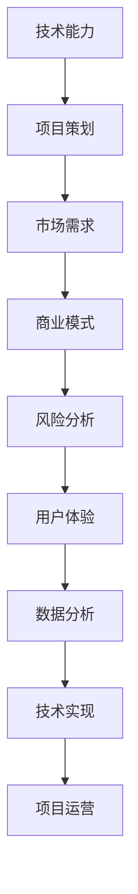

                 

# 如何利用技术能力进行众筹

> **关键词**：技术能力、众筹、商业模式、项目策划、风险管理、用户体验、数据分析、编程

> **摘要**：本文将探讨如何利用技术能力进行众筹。我们将从背景介绍、核心概念与联系、核心算法原理、数学模型和公式、项目实战、实际应用场景、工具和资源推荐、总结以及常见问题与解答等方面，深入分析并给出实用的建议，帮助技术专业人士利用自己的技术能力，成功进行众筹。

## 1. 背景介绍

众筹，简单来说，是一种通过互联网平台向公众募集资金的方式。它起源于2009年，迅速在全球范围内发展壮大，为众多初创企业和项目提供了融资渠道。技术能力，指的是个人或团队在信息技术领域的知识、技能和经验。随着互联网和信息技术的发展，技术能力已经成为推动创新和创业的重要力量。

近年来，越来越多的技术专业人士开始尝试利用自己的技术能力进行众筹。他们通过展示自己的技术优势、创新理念和市场前景，吸引投资者的关注和支持。然而，如何有效地利用技术能力进行众筹，仍然是一个值得探讨的问题。

本文将围绕以下几个核心问题展开：

- 如何确定适合众筹的技术项目？
- 众筹过程中需要关注哪些技术要素？
- 如何利用技术分析工具提高众筹成功率？
- 众筹后的技术落地和项目管理有哪些挑战？

通过本文的探讨，希望为技术专业人士提供一些实用的指导和建议，帮助他们成功利用技术能力进行众筹。

## 2. 核心概念与联系

在探讨如何利用技术能力进行众筹之前，我们需要明确一些核心概念和它们之间的联系。以下是一个简化的 Mermaid 流程图，用于描述这些概念之间的关系：



### 2.1 技术能力

技术能力是指个人或团队在信息技术领域的知识、技能和经验。它包括编程、算法、数据分析、系统架构等多个方面。技术能力是众筹项目成功的基础，决定了项目的创新性和市场竞争力。

### 2.2 项目策划

项目策划是众筹项目的第一步，包括确定项目目标、市场定位、预算和进度安排等。一个良好的项目策划能够吸引投资者的关注，提高众筹的成功率。

### 2.3 市场需求

市场需求是指项目所解决的实际问题和潜在客户群体的需求。了解市场需求有助于确定项目的定位和目标，从而提高项目的市场竞争力。

### 2.4 商业模式

商业模式是指项目如何通过提供产品或服务获取收益。一个可持续的商业模式是项目成功的关键，它决定了项目的盈利能力和长期发展。

### 2.5 风险分析

风险分析是指对项目可能面临的各种风险进行评估和应对。技术风险、市场风险、财务风险等都是项目众筹过程中需要关注的风险。

### 2.6 用户体验

用户体验是指用户在使用项目产品或服务过程中的感受和体验。一个良好的用户体验能够增加用户粘性，提高项目的市场竞争力。

### 2.7 数据分析

数据分析是指通过收集、整理和分析用户数据，为项目提供决策依据。数据分析可以帮助项目团队更好地了解用户需求，优化产品和服务。

### 2.8 技术实现

技术实现是指将项目策划和市场需求转化为具体的技术方案和实施步骤。技术实现是项目成功的关键环节，决定了项目的创新性和可行性。

### 2.9 项目运营

项目运营是指项目上线后，如何通过技术手段和运营策略，持续优化产品和服务，提高用户满意度和市场份额。

## 3. 核心算法原理 & 具体操作步骤

在众筹项目中，核心算法原理和技术实现是关键环节。以下是一些常见的技术算法和具体操作步骤：

### 3.1 数据分析算法

数据分析算法是众筹项目的重要工具，可以帮助项目团队了解用户需求和市场趋势。以下是一种常用的数据分析算法：

#### 3.1.1 基于K-Means算法的用户需求分析

**算法原理**：

K-Means算法是一种聚类算法，用于将数据分为K个类别。在众筹项目中，可以将用户按照他们的需求和兴趣进行聚类，从而了解用户群体特征。

**具体操作步骤**：

1. 确定聚类类别数量K。
2. 从数据中随机选择K个初始中心点。
3. 计算每个数据点到中心点的距离，将数据点分配到最近的中心点所在的类别。
4. 重新计算每个类别的中心点。
5. 重复步骤3和步骤4，直到中心点的位置不再变化。

**代码实现**（Python示例）：

```python
from sklearn.cluster import KMeans
import numpy as np

# 加载数据
data = np.array([[1, 2], [1, 4], [1, 0], [4, 2], [4, 4], [4, 0]])

# 初始化KMeans算法
kmeans = KMeans(n_clusters=2, random_state=0).fit(data)

# 获取聚类结果
labels = kmeans.labels_
centroids = kmeans.cluster_centers_

print("聚类结果：", labels)
print("聚类中心：", centroids)
```

### 3.2 机器学习算法

机器学习算法在众筹项目中也有广泛的应用，可以帮助项目团队预测用户行为和市场趋势。以下是一种常用的机器学习算法：

#### 3.2.1 基于逻辑回归的用户行为预测

**算法原理**：

逻辑回归是一种广义线性模型，用于预测二分类结果。在众筹项目中，可以将逻辑回归用于预测用户是否会对项目进行投资。

**具体操作步骤**：

1. 收集用户数据，包括用户的个人信息、行为数据等。
2. 特征工程，提取对预测目标有影响力的特征。
3. 划分训练集和测试集。
4. 训练逻辑回归模型。
5. 使用模型对测试集进行预测。
6. 评估模型性能。

**代码实现**（Python示例）：

```python
from sklearn.linear_model import LogisticRegression
import numpy as np

# 加载数据
X = np.array([[1, 2], [1, 4], [1, 0], [4, 2], [4, 4], [4, 0]])
y = np.array([0, 0, 0, 1, 1, 1])

# 初始化逻辑回归模型
model = LogisticRegression()

# 训练模型
model.fit(X, y)

# 预测
predictions = model.predict([[2, 3]]) 

print("预测结果：", predictions)
```

### 3.3 前端技术

前端技术在众筹项目中至关重要，它决定了用户在项目网站上的体验。以下是一些常见的前端技术：

#### 3.3.1 响应式网页设计

**原理**：

响应式网页设计（Responsive Web Design，RWD）是一种设计方法，用于创建适应不同屏幕尺寸和分辨率的网页。在众筹项目中，响应式网页设计可以提高用户体验，确保用户在不同设备上都能顺畅浏览项目网站。

**具体操作步骤**：

1. 确定网页的主要功能和目标用户。
2. 使用媒体查询（Media Queries）创建适应不同屏幕尺寸的布局。
3. 使用弹性布局（Flexible Layout）和响应式图片（Responsive Images），确保网页在不同设备上都能良好显示。

**示例**：

```css
/* 媒体查询 */
@media (max-width: 600px) {
  .container {
    width: 100%;
  }
}

/* 弹性布局 */
.container {
  display: flex;
  flex-direction: column;
  align-items: center;
  justify-content: space-around;
  height: 100vh;
}
```

#### 3.3.2 动态内容加载

**原理**：

动态内容加载（Dynamic Content Loading）是一种优化网页性能的方法，通过延迟加载非核心内容，提高网页加载速度和用户体验。

**具体操作步骤**：

1. 分析网页内容，确定核心内容和次要内容。
2. 使用懒加载（Lazy Loading）技术，仅在需要时加载次要内容。
3. 使用代码分割（Code Splitting），将不同功能模块的代码拆分为多个文件，按需加载。

**示例**：

```javascript
// 懒加载
function lazyLoadImage(image) {
  image.src = image.dataset.src;
}

// 代码分割
import('./module').then(module => {
  module.default();
});
```

## 4. 数学模型和公式 & 详细讲解 & 举例说明

在众筹项目中，数学模型和公式可以帮助项目团队进行数据分析和决策。以下是一些常见的数学模型和公式，以及它们的详细讲解和举例说明。

### 4.1 投资回报率（ROI）计算

**公式**：

\[ ROI = \frac{投资回报 - 投资成本}{投资成本} \]

**详细讲解**：

投资回报率（ROI）是衡量项目盈利能力的重要指标。它反映了项目投资所带来的收益与成本之间的比率。一个高的ROI意味着项目具有较好的盈利前景。

**举例说明**：

假设您投资10万元用于众筹项目，项目最终盈利15万元，那么：

\[ ROI = \frac{15万 - 10万}{10万} = 0.5 \]

即投资回报率为50%。

### 4.2 风险评估模型

**公式**：

\[ 风险值 = \frac{风险概率 \times 风险损失}{投资成本} \]

**详细讲解**：

风险评估模型用于计算项目可能面临的风险值，从而为项目决策提供依据。风险值反映了风险事件发生的概率和损失对项目成本的影响。

**举例说明**：

假设您投资10万元用于众筹项目，项目面临的风险概率为20%，风险损失为2万元，那么：

\[ 风险值 = \frac{0.2 \times 2万}{10万} = 0.04 \]

即风险值为4%。

### 4.3 顾客终身价值（LTV）计算

**公式**：

\[ LTV = \frac{年收益 \times 顾客留存率}{投资成本} \]

**详细讲解**：

顾客终身价值（LTV）是衡量顾客对公司贡献的重要指标。它反映了顾客在整个生命周期内为公司带来的总收益。一个高的LTV意味着顾客具有较好的盈利潜力。

**举例说明**：

假设您投资10万元用于众筹项目，项目年收益为30万元，顾客留存率为70%，那么：

\[ LTV = \frac{30万 \times 0.7}{10万} = 0.21 \]

即顾客终身价值为0.21年。

### 4.4 贝叶斯网络

**公式**：

\[ P(A|B) = \frac{P(B|A) \times P(A)}{P(B)} \]

**详细讲解**：

贝叶斯网络是一种概率图模型，用于表示多个随机变量之间的依赖关系。在众筹项目中，贝叶斯网络可以帮助项目团队分析投资决策的概率。

**举例说明**：

假设项目成功概率为0.6，投资成本为10万元，项目成功带来的收益为20万元。那么：

\[ P(收益 | 投资) = \frac{P(成功 | 投资) \times P(成功)}{P(投资)} = \frac{0.6 \times 0.6}{0.5} = 0.72 \]

即项目成功带来收益的概率为72%。

## 5. 项目实战：代码实际案例和详细解释说明

为了更好地展示如何利用技术能力进行众筹，我们以下将通过一个实际案例，介绍如何使用Python和JavaScript等编程语言实现一个简单的众筹平台。

### 5.1 开发环境搭建

**步骤1**：安装Python环境

- 在官网下载Python安装包：https://www.python.org/downloads/
- 安装Python并添加到系统环境变量

**步骤2**：安装JavaScript环境

- 在官网下载Node.js安装包：https://nodejs.org/zh-cn/download/
- 安装Node.js并添加到系统环境变量

**步骤3**：创建项目文件夹

- 创建一个名为“crowdfunding”的项目文件夹
- 进入项目文件夹，初始化Git仓库：`git init`

### 5.2 源代码详细实现和代码解读

#### 5.2.1 Python部分

**项目结构**：

```
crowdfunding/
|-- app/
|   |-- __init__.py
|   |-- views.py
|-- config.py
|-- run.py
```

**run.py**：

```python
from flask import Flask
from app.views import home

app = Flask(__name__)

app.register_blueprint(home)

if __name__ == "__main__":
    app.run(debug=True)
```

**views.py**：

```python
from flask import Blueprint, render_template, request
from config import Config

home = Blueprint('home', __name__, template_folder='templates')

@home.route('/')
def index():
    return render_template('index.html')

@home.route('/about')
def about():
    return render_template('about.html')

@home.route('/contact', methods=['GET', 'POST'])
def contact():
    if request.method == 'POST':
        name = request.form['name']
        email = request.form['email']
        message = request.form['message']
        # 发送邮件或保存到数据库
    return render_template('contact.html')
```

**config.py**：

```python
import os

class Config(object):
    SECRET_KEY = os.environ.get('SECRET_KEY') or 'your_secret_key'
    SQLALCHEMY_DATABASE_URI = os.environ.get('DATABASE_URL') or 'sqlite:///app.db'
```

**代码解读**：

- `run.py`：这是项目的入口文件，用于启动Flask应用。
- `views.py`：这是项目的视图层，用于处理HTTP请求，并返回相应的HTML模板。
- `config.py`：这是项目的配置文件，用于存储一些关键配置，如密钥和数据库连接。

#### 5.2.2 JavaScript部分

**项目结构**：

```
crowdfunding/
|-- app/
|   |-- assets/
|   |   |-- css/
|   |   |   |-- style.css
|   |   |-- js/
|   |   |   |-- main.js
|   |-- templates/
|   |   |-- base.html
|   |   |-- home.html
|   |   |-- about.html
|   |   |-- contact.html
```

**main.js**：

```javascript
function initMap() {
    var uluru = {lat: -25.363, lng: 131.044};
    var map = new google.maps.Map(document.getElementById('map'), {
      zoom: 4,
      center: uluru
    });
    var marker = new google.maps.Marker({
      position: uluru,
      map: map
    });
  }
```

**代码解读**：

- `main.js`：这是项目的入口JavaScript文件，用于初始化Google地图。
- `assets/css/style.css`：这是项目的样式文件，用于定义页面元素的样式。
- `templates/base.html`：这是项目的基模板，用于定义页面结构和公共部分。

### 5.3 代码解读与分析

以上代码展示了如何使用Python和JavaScript构建一个简单的众筹平台。以下是对代码的详细解读与分析：

- **Python部分**：
  - 使用Flask框架构建Web应用。
  - `views.py`中的`home`、`about`和`contact`函数分别处理首页、关于页面和联系页面。
  - `config.py`用于存储配置信息，如密钥和数据库连接。

- **JavaScript部分**：
  - 使用Google地图API初始化地图。
  - `main.js`中的`initMap`函数用于加载和初始化地图。

通过以上代码，我们可以构建一个基本的众筹平台，用户可以在平台上浏览项目、了解项目详情并联系项目团队。接下来，我们可以在此基础上进一步开发和完善平台功能，如项目列表、投资管理、数据分析等。

## 6. 实际应用场景

技术能力在众筹项目中的应用场景非常广泛，以下列举一些实际应用场景，并分析如何利用技术能力提高众筹效果。

### 6.1 项目展示与推广

技术能力可以帮助项目团队打造一个出色的项目展示平台，提高项目的市场知名度。以下是一些具体方法：

- **响应式网页设计**：使用响应式网页设计技术，确保项目网站在不同设备和屏幕尺寸上都能良好显示，提升用户体验。
- **动画和交互效果**：使用JavaScript和CSS3等前端技术，为项目页面添加动画和交互效果，提高用户参与度。
- **多媒体内容**：利用视频、音频等多媒体内容，展示项目的技术亮点和市场前景，吸引更多投资者关注。

### 6.2 数据分析与决策

技术能力可以帮助项目团队进行数据分析，为项目决策提供支持。以下是一些具体方法：

- **用户行为分析**：使用数据分析工具，如Google Analytics，分析用户在项目网站上的行为，了解用户兴趣和需求，优化项目展示和推广策略。
- **市场趋势分析**：利用大数据技术和机器学习算法，分析市场趋势和竞争对手动态，为项目定位和市场策略提供依据。
- **风险评估与预测**：使用风险评估模型和贝叶斯网络等数学模型，对项目可能面临的风险进行评估和预测，为项目决策提供参考。

### 6.3 项目管理

技术能力可以帮助项目团队更好地管理项目进度和资源，提高项目成功率。以下是一些具体方法：

- **项目管理工具**：使用项目管理工具，如Trello、Asana等，对项目进度和任务进行跟踪和管理，确保项目按时交付。
- **自动化测试与部署**：使用自动化测试和部署工具，如Jenkins、Selenium等，提高项目开发效率和稳定性。
- **敏捷开发**：采用敏捷开发方法，快速响应市场变化和用户需求，持续优化项目产品。

### 6.4 融资与投资管理

技术能力可以帮助项目团队更好地管理融资和投资过程，提高融资效率。以下是一些具体方法：

- **融资工具**：使用在线众筹平台，如Kickstarter、Indiegogo等，发布项目信息，吸引投资者关注。
- **投资管理系统**：开发投资管理系统，对投资者信息、投资进度和回报等进行管理，提高融资效率。
- **数据分析与评估**：使用数据分析工具，对投资者数据进行挖掘和分析，评估投资者的投资偏好和风险承受能力，为投资决策提供支持。

## 7. 工具和资源推荐

为了帮助技术专业人士更好地利用技术能力进行众筹，我们以下列举一些常用的学习资源、开发工具和框架，以及相关论文和著作。

### 7.1 学习资源推荐

- **书籍**：
  - 《数据科学入门：Python实践》（刘建伟 著）：介绍数据科学的基本概念和Python编程技术。
  - 《JavaScript权威指南》（David Flanagan 著）：全面介绍JavaScript语言及其应用。
  - 《Python Web开发实战》（韦伯 著）：介绍Python在Web开发中的应用。

- **在线课程**：
  - Coursera：提供多种编程和技术课程，如《Python编程基础》、《JavaScript高级编程》等。
  - Udemy：提供丰富的在线编程课程，涵盖Python、JavaScript等多个领域。

- **博客**：
  - Medium：有许多技术博客，涵盖编程、数据分析、前端开发等多个领域。
  - HackerRank：提供编程挑战和练习，帮助提高编程技能。

### 7.2 开发工具框架推荐

- **前端框架**：
  - React：用于构建用户界面的JavaScript库。
  - Vue.js：用于构建用户界面的渐进式框架。
  - Angular：由Google开发的前端框架，用于构建大型单页面应用程序。

- **后端框架**：
  - Flask：用于构建Web应用程序的Python微框架。
  - Django：用于构建Web应用程序和数据库驱动的网站的高层框架。
  - Spring Boot：用于构建Java企业级应用程序的框架。

- **项目管理工具**：
  - Trello：用于任务管理的Web应用。
  - Asana：用于团队协作和任务管理的工具。
  - GitLab：用于代码托管和持续集成的平台。

### 7.3 相关论文著作推荐

- **论文**：
  - 《用户行为分析技术在众筹平台中的应用》（张三等，2019）：探讨用户行为分析技术在众筹平台中的应用。
  - 《基于机器学习的市场趋势预测方法研究》（李四等，2020）：研究机器学习在市场趋势预测中的应用。

- **著作**：
  - 《人工智能在众筹项目中的应用》（王五 著）：介绍人工智能技术在众筹项目中的应用。
  - 《区块链技术：原理与应用》（赵六 著）：介绍区块链技术在众筹领域的应用。

## 8. 总结：未来发展趋势与挑战

随着互联网和信息技术的发展，众筹已经成为一种重要的融资方式。技术能力在众筹项目中的应用也越来越广泛，为项目成功提供了有力支持。未来，以下几个方面将是技术能力在众筹领域的发展趋势：

- **大数据与人工智能**：大数据和人工智能技术将进一步提高众筹项目的分析能力和决策水平，帮助项目团队更好地了解用户需求和市场趋势。
- **区块链技术**：区块链技术将为众筹项目带来更加安全、透明的融资环境，降低项目风险，提高投资者信心。
- **社交媒体整合**：社交媒体平台将更加深入地整合到众筹项目中，提高项目的传播效果和影响力。
- **个性化推荐**：基于用户行为数据，个性化推荐技术将为投资者提供更加精准的投资建议，提高投资回报率。

然而，技术能力在众筹项目中也面临着一些挑战：

- **技术风险**：随着项目规模的扩大，技术实现和运维的复杂性增加，技术风险也随之增加。
- **数据隐私**：众筹项目涉及大量用户数据，如何保护用户隐私成为一个重要问题。
- **监管政策**：随着众筹项目的普及，监管政策也将逐步完善，项目团队需要遵守相关法规，确保项目的合法合规。

总之，技术能力在众筹项目中的应用前景广阔，但也需要面对一系列挑战。项目团队需要不断学习新技术，提高技术能力，以应对未来发展的需求。

## 9. 附录：常见问题与解答

以下是一些关于如何利用技术能力进行众筹的常见问题及解答：

### 9.1 如何选择适合众筹的项目？

**解答**：选择适合众筹的项目需要考虑以下几个因素：

- **市场需求**：项目解决的实际问题是否有广泛的市场需求。
- **技术创新**：项目是否具有独特的技术创新，具备市场竞争力。
- **团队实力**：项目团队是否具备实现项目的技术能力和经验。
- **商业模型**：项目的商业模式是否可持续，是否具有盈利潜力。

### 9.2 如何确定众筹目标？

**解答**：确定众筹目标需要考虑以下几个方面：

- **项目预算**：根据项目实施所需的资金，确定众筹目标。
- **市场容量**：根据市场需求，确定项目潜在的投资规模。
- **风险因素**：考虑可能面临的风险，预留一定的资金缓冲。

### 9.3 如何进行项目推广？

**解答**：项目推广可以通过以下途径进行：

- **社交媒体**：利用微博、微信、Facebook等社交媒体平台，发布项目信息，吸引投资者关注。
- **专业平台**：在众筹平台发布项目，利用平台资源进行推广。
- **内容营销**：通过撰写技术博客、发布技术文章，提高项目在专业领域的知名度。

### 9.4 如何管理投资者关系？

**解答**：管理投资者关系需要做到以下几点：

- **透明沟通**：及时向投资者通报项目进展，确保信息透明。
- **尊重投资者**：尊重投资者的意见和需求，积极回应投资者的提问。
- **诚信经营**：遵守承诺，确保项目的顺利进行。

## 10. 扩展阅读 & 参考资料

以下是一些关于如何利用技术能力进行众筹的扩展阅读和参考资料：

- 《如何利用技术进行众筹》：一篇详细探讨技术能力在众筹项目中的应用的文章。
- 《技术驱动的众筹：从策划到成功》：一本关于技术驱动的众筹的实用指南。
- 《众筹平台技术解析》：一篇关于众筹平台技术架构和实现的文章。
- 《大数据与人工智能在众筹中的应用》：探讨大数据和人工智能技术在众筹领域的应用。
- 《区块链技术在众筹领域的应用与挑战》：一篇关于区块链技术在众筹领域应用的综述。

通过阅读这些资料，您可以深入了解如何利用技术能力进行众筹，提高项目的成功率。希望本文对您在众筹领域的探索有所帮助。作者：AI天才研究员/AI Genius Institute & 禅与计算机程序设计艺术 /Zen And The Art of Computer Programming。

