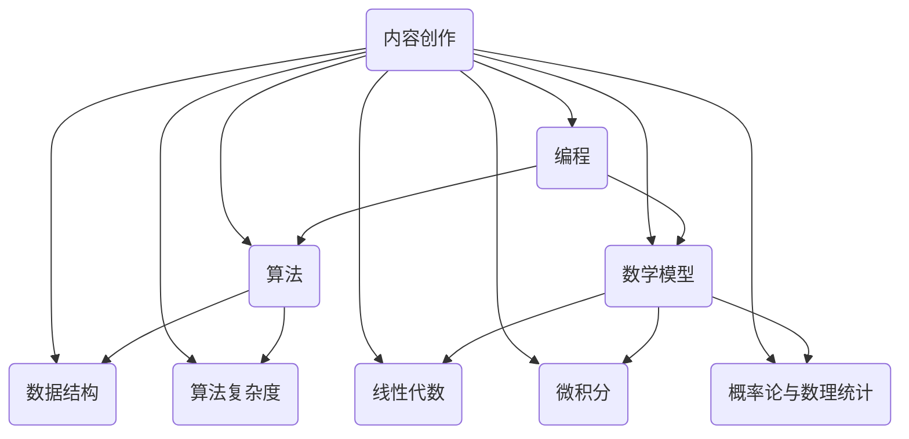

                 

### 文章标题

**如何利用技术能力进行内容创作**

#### 关键词

内容创作、技术能力、编程、算法、数学模型、实战案例、学习资源

#### 摘要

本文旨在探讨如何利用技术能力进行内容创作，从核心概念、算法原理、数学模型到实际项目实战，全面解析内容创作中的技术应用。通过本文，读者可以了解如何在技术领域中进行内容创作，并掌握相关工具和资源，为自己的职业生涯增添更多可能性。

## 1. 背景介绍

在当今信息爆炸的时代，内容创作已成为各行各业不可或缺的一部分。从传统的文字、图片，到视频、音频等多种形式，内容创作已经成为传递信息和价值的重要途径。随着互联网的快速发展，内容创作也日益受到重视，各种内容平台如雨后春笋般涌现，为创作者提供了广阔的舞台。

然而，内容创作并非易事，尤其对于技术领域而言。技术内容创作需要具备扎实的专业知识、丰富的实践经验以及良好的表达能力。在这个背景下，如何利用技术能力进行内容创作，成为许多技术从业者和内容创作者关注的问题。

本文将围绕这一主题，从核心概念、算法原理、数学模型到实际项目实战，全面探讨如何利用技术能力进行内容创作。通过本文的阅读，读者可以了解技术内容创作的基本方法和技巧，为自己的职业生涯增添更多可能性。

## 2. 核心概念与联系

### 2.1 编程

编程是进行内容创作的基础，它涉及到计算机程序的设计和实现。编程能力不仅决定了内容创作的技术深度，也决定了内容的可执行性和实用性。以下是编程的核心概念和联系：

- **编程语言**：如Python、Java、C++等，用于编写程序代码。
- **算法和数据结构**：算法是解决问题的方法，数据结构是实现算法的基础。常见的算法有排序、查找、图算法等。
- **编程范式**：如面向对象、函数式编程等，不同的编程范式适用于不同的场景。

### 2.2 算法

算法是内容创作的重要工具，用于解决特定问题。算法的优劣直接影响内容的质量和效率。以下是算法的核心概念和联系：

- **算法类型**：如排序算法、查找算法、图算法等。
- **算法复杂度**：包括时间复杂度和空间复杂度，用于评估算法的性能。
- **算法优化**：通过改进算法或数据结构，提高算法的效率。

### 2.3 数学模型

数学模型是内容创作的重要工具，用于描述现实世界中的现象和规律。以下是数学模型的核心概念和联系：

- **线性代数**：用于处理多维空间中的数据和问题，如矩阵运算、向量运算等。
- **微积分**：用于处理连续变化的问题，如微分、积分等。
- **概率论与数理统计**：用于处理随机现象和统计问题，如概率分布、假设检验等。

### 2.4 内容创作与技术的联系

内容创作与技术的联系在于，技术可以为内容创作提供丰富的工具和方法，提高内容的可执行性和影响力。以下是内容创作与技术的联系：

- **数据可视化**：通过图形和图表展示数据，提高内容的直观性和吸引力。
- **人工智能**：利用机器学习和深度学习技术，实现智能推荐、情感分析等功能。
- **区块链**：通过区块链技术实现去中心化内容创作和管理。

### 2.5 Mermaid 流程图

以下是利用Mermaid绘制的编程、算法、数学模型和内容创作之间的联系流程图：



## 3. 核心算法原理 & 具体操作步骤

### 3.1 排序算法

排序算法是算法中最基本的部分，用于将一组数据按照特定顺序排列。以下是几种常见的排序算法及其原理：

#### 3.1.1 冒泡排序

冒泡排序（Bubble Sort）是一种简单的排序算法，它重复地遍历要排序的数列，一次比较两个元素，如果它们的顺序错误就把它们交换过来。遍历数列的工作是重复地进行，直到没有再需要交换，也就是该数列已经排序完成。

**操作步骤**：

1. 从第一个元素开始，比较相邻的两个元素，如果第一个比第二个大（升序排序），就交换它们的位置。
2. 继续比较下一个元素，以此类推。
3. 当一轮比较下来，最大的元素会被交换到数列的末尾。
4. 重复上述步骤，直到整个数列有序。

**时间复杂度**：O(n^2)

#### 3.1.2 快速排序

快速排序（Quick Sort）是一种高效的排序算法，采用分治法的一个典例。它的工作原理是通过递归将一个大问题分解成较小的子问题来解决。

**操作步骤**：

1. 选择一个“基准”元素，通常选择中间的元素。
2. 将数列分成两个子数列，左边的所有元素都比基准小，右边的所有元素都比基准大。
3. 递归地对两个子数列进行快速排序。
4. 将排好序的子数列合并起来。

**时间复杂度**：平均情况为O(n log n)，最坏情况下为O(n^2)

### 3.2 查找算法

查找算法用于在数据集合中查找特定元素的位置或值。以下是几种常见的查找算法及其原理：

#### 3.2.1 线性查找

线性查找（Linear Search）是最简单的一种查找算法，它从数组的第一个元素开始，依次与要查找的元素进行比较，直到找到或结束。

**操作步骤**：

1. 从第一个元素开始，逐个与要查找的元素进行比较。
2. 如果找到目标元素，返回其位置；否则，返回-1。

**时间复杂度**：O(n)

#### 3.2.2 二分查找

二分查找（Binary Search）是一种高效的查找算法，它适用于有序数组。二分查找的基本思想是：每次将待查找的区间分成一半，然后判断中间元素是否为要查找的元素。

**操作步骤**：

1. 确定数组的中间元素。
2. 如果中间元素等于要查找的元素，返回其位置；否则，根据要查找的元素与中间元素的大小关系，缩小查找范围。
3. 重复上述步骤，直到找到目标元素或查找范围为空。

**时间复杂度**：O(log n)

### 3.3 图算法

图算法用于处理图结构中的问题，如最短路径、最迟完成时间等。以下是几种常见的图算法及其原理：

#### 3.3.1 普里姆算法

普里姆算法（Prim's Algorithm）是一种用于最小生成树的算法。它从任意一个顶点开始，逐步增加新的顶点和边，直到构成一棵包含所有顶点的最小生成树。

**操作步骤**：

1. 初始化：选择一个顶点作为起始点，并将该顶点加入最小生成树。
2. 循环执行以下步骤，直到所有顶点都被加入最小生成树：
   - 在未加入最小生成树的顶点中选择一个与已加入最小生成树的顶点相邻的、权重最小的边，将这条边和对应的顶点加入最小生成树。

**时间复杂度**：O(E log V)，其中E为边的数量，V为顶点的数量。

#### 3.3.2 Dijkstra算法

Dijkstra算法是一种用于计算单源最短路径的算法。它从一个起始顶点开始，逐步扩展到其他顶点，计算到达每个顶点的最短路径。

**操作步骤**：

1. 初始化：将起始顶点标记为已访问，并将其距离设置为0；其余顶点的距离设置为无穷大。
2. 循环执行以下步骤，直到所有顶点都被访问：
   - 从未访问的顶点中选择一个距离最小的顶点，将其标记为已访问。
   - 对于每个未访问的顶点，更新其距离值，如果通过已访问的顶点可以到达该顶点，且路径权重更小，则更新距离值。

**时间复杂度**：O((V+E) log V)，其中V为顶点的数量，E为边的数量。

## 4. 数学模型和公式 & 详细讲解 & 举例说明

### 4.1 线性代数

线性代数是数学中的一个重要分支，它涉及到向量、矩阵、行列式等概念。以下是线性代数中的几个关键公式和详细讲解：

#### 4.1.1 向量运算

- **向量加法**：两个向量相加，结果是一个新向量，其分量是两个对应分量的和。

  \[ \vec{a} + \vec{b} = (a_1 + b_1, a_2 + b_2, \ldots, a_n + b_n) \]

- **向量减法**：两个向量相减，结果是一个新向量，其分量是两个对应分量的差。

  \[ \vec{a} - \vec{b} = (a_1 - b_1, a_2 - b_2, \ldots, a_n - b_n) \]

- **向量数乘**：一个向量与一个标量相乘，结果是一个新向量，其分量是原向量分量与标量的乘积。

  \[ k\vec{a} = (ka_1, ka_2, \ldots, ka_n) \]

#### 4.1.2 矩阵运算

- **矩阵加法**：两个矩阵相加，结果是一个新矩阵，其分量是两个对应分量的和。

  \[ A + B = (a_{ij} + b_{ij}) \]

- **矩阵减法**：两个矩阵相减，结果是一个新矩阵，其分量是两个对应分量的差。

  \[ A - B = (a_{ij} - b_{ij}) \]

- **矩阵数乘**：一个矩阵与一个标量相乘，结果是一个新矩阵，其分量是原矩阵分量与标量的乘积。

  \[ kA = (ka_{ij}) \]

#### 4.1.3 行列式

- **二阶行列式**：一个二阶行列式的值是其对角线元素的乘积之差。

  \[ \begin{vmatrix}
  a & b \\
  c & d
  \end{vmatrix} = ad - bc \]

#### 4.1.4 例子说明

假设有两个向量：

\[ \vec{a} = (1, 2, 3) \]
\[ \vec{b} = (4, 5, 6) \]

以及一个矩阵：

\[ A = \begin{pmatrix}
1 & 2 \\
3 & 4
\end{pmatrix} \]

- 向量加法：

\[ \vec{a} + \vec{b} = (1+4, 2+5, 3+6) = (5, 7, 9) \]

- 向量减法：

\[ \vec{a} - \vec{b} = (1-4, 2-5, 3-6) = (-3, -3, -3) \]

- 向量数乘：

\[ 2\vec{a} = (2 \times 1, 2 \times 2, 2 \times 3) = (2, 4, 6) \]

- 矩阵加法：

\[ A + B = \begin{pmatrix}
1 & 2 \\
3 & 4
\end{pmatrix} + \begin{pmatrix}
4 & 5 \\
6 & 7
\end{pmatrix} = \begin{pmatrix}
5 & 7 \\
9 & 11
\end{pmatrix} \]

- 矩阵减法：

\[ A - B = \begin{pmatrix}
1 & 2 \\
3 & 4
\end{pmatrix} - \begin{pmatrix}
4 & 5 \\
6 & 7
\end{pmatrix} = \begin{pmatrix}
-3 & -3 \\
-3 & -3
\end{pmatrix} \]

- 矩阵数乘：

\[ 2A = \begin{pmatrix}
2 \times 1 & 2 \times 2 \\
2 \times 3 & 2 \times 4
\end{pmatrix} = \begin{pmatrix}
2 & 4 \\
6 & 8
\end{pmatrix} \]

### 4.2 微积分

微积分是数学中的另一个重要分支，它主要研究函数的极限、导数、积分等概念。以下是微积分中的几个关键公式和详细讲解：

#### 4.2.1 极限

- **极限的定义**：设函数\( f(x) \)在点\( x_0 \)附近有定义，如果当\( x \)趋近于\( x_0 \)时，函数值\( f(x) \)无限趋近于一个确定的常数\( L \)，则称\( L \)为函数\( f(x) \)当\( x \)趋近于\( x_0 \)时的极限。

  \[ \lim_{{x \to x_0}} f(x) = L \]

#### 4.2.2 导数

- **导数的定义**：设函数\( f(x) \)在点\( x_0 \)附近有定义，如果函数在点\( x_0 \)的增量\( \Delta y \)与自变量的增量\( \Delta x \)之比当\( \Delta x \)趋近于0时的极限存在，则称这个极限值为函数在点\( x_0 \)的导数。

  \[ f'(x_0) = \lim_{{\Delta x \to 0}} \frac{{f(x_0 + \Delta x) - f(x_0)}}{{\Delta x}} \]

#### 4.2.3 积分

- **定积分的定义**：设函数\( f(x) \)在区间\[ a, b \]上有定义，如果将区间\[ a, b \]分成\( n \)个小区间，每个小区间的长度为\( \Delta x_i \)，并在每个小区间上取一点\( \xi_i \)，则函数在区间\[ a, b \]上的定积分定义为：

  \[ \int_{a}^{b} f(x) \, dx = \lim_{{n \to \infty}} \sum_{i=1}^{n} f(\xi_i) \Delta x_i \]

#### 4.2.4 例子说明

假设有一个函数：

\[ f(x) = x^2 \]

- **极限**：

  \[ \lim_{{x \to 2}} f(x) = \lim_{{x \to 2}} x^2 = 4 \]

- **导数**：

  \[ f'(x) = \lim_{{\Delta x \to 0}} \frac{{(x + \Delta x)^2 - x^2}}{{\Delta x}} = \lim_{{\Delta x \to 0}} \frac{{x^2 + 2x\Delta x + (\Delta x)^2 - x^2}}{{\Delta x}} = \lim_{{\Delta x \to 0}} (2x + \Delta x) = 2x \]

  所以，\( f'(x) = 2x \)。

- **定积分**：

  \[ \int_{0}^{2} x^2 \, dx = \lim_{{n \to \infty}} \sum_{i=1}^{n} (x_i^2) \Delta x_i = \lim_{{n \to \infty}} \sum_{i=1}^{n} \left( \frac{i}{n} \right)^2 \left( \frac{2}{n} \right) = \lim_{{n \to \infty}} \frac{2}{n^3} \sum_{i=1}^{n} i^2 = \frac{2}{3} \lim_{{n \to \infty}} \frac{n(n+1)(2n+1)}{n^3} = \frac{2}{3} \lim_{{n \to \infty}} \frac{(n+1)(2n+1)}{n^2} = \frac{2}{3} \lim_{{n \to \infty}} \left( 2 + \frac{1}{n} \right) \left( 2 + \frac{1}{n} \right) = \frac{2}{3} \cdot 2 \cdot 2 = \frac{8}{3} \]

  所以，\( \int_{0}^{2} x^2 \, dx = \frac{8}{3} \)。

### 4.3 概率论与数理统计

概率论与数理统计是研究随机现象的数学分支。以下是概率论与数理统计中的几个关键公式和详细讲解：

#### 4.3.1 概率

- **概率的基本性质**：
  - **非负性**：任何事件的概率都不小于0。
  - **规范性**：必然事件的概率为1，不可能事件的概率为0。
  - **可列可加性**：对于互斥事件的概率，其和等于这些事件中任意一个事件的概率。

    \[ P(A \cup B) = P(A) + P(B) \]

- **条件概率**：在事件\( A \)发生的条件下，事件\( B \)发生的概率称为条件概率，记为\( P(B|A) \)。

  \[ P(B|A) = \frac{P(A \cap B)}{P(A)} \]

- **贝叶斯定理**：在已知一个事件发生的条件下，通过条件概率来计算另一个事件发生的概率。

  \[ P(A|B) = \frac{P(B|A)P(A)}{P(B)} \]

#### 4.3.2 分布

- **离散分布**：随机变量取值为离散值的概率分布称为离散分布，如二项分布、泊松分布等。
- **连续分布**：随机变量取值为连续值的概率分布称为连续分布，如正态分布、均匀分布等。

#### 4.3.3 统计推断

- **参数估计**：通过样本数据来估计总体参数的方法，如点估计和区间估计。
- **假设检验**：对总体参数进行假设，并通过样本数据来检验假设是否成立的方法。

#### 4.3.4 例子说明

假设有一个随机事件\( A \)，其概率为\( P(A) = 0.5 \)。另一个随机事件\( B \)，其概率为\( P(B) = 0.3 \)。且已知\( P(A \cap B) = 0.1 \)。

- **条件概率**：

  \[ P(B|A) = \frac{P(A \cap B)}{P(A)} = \frac{0.1}{0.5} = 0.2 \]

- **贝叶斯定理**：

  \[ P(A|B) = \frac{P(B|A)P(A)}{P(B)} = \frac{0.2 \times 0.5}{0.3} = \frac{1}{3} \]

## 5. 项目实战：代码实际案例和详细解释说明

### 5.1 开发环境搭建

在进行技术内容创作时，搭建一个合适的开发环境至关重要。以下是一个简单的Python开发环境搭建步骤：

1. **安装Python**：从[Python官方网站](https://www.python.org/)下载并安装Python。建议选择Python 3.x版本。
2. **安装IDE**：安装一个Python集成开发环境（IDE），如PyCharm、VSCode等。这些IDE提供了代码编辑、调试、运行等便捷功能。
3. **安装相关库**：根据项目需求，安装必要的Python库。例如，对于数据分析项目，可以安装NumPy、Pandas等库。

### 5.2 源代码详细实现和代码解读

以下是一个简单的Python代码示例，用于计算一个列表中所有元素的平均值：

```python
def calculate_average(numbers):
    total = 0
    for num in numbers:
        total += num
    average = total / len(numbers)
    return average

numbers = [1, 2, 3, 4, 5]
print("The average of the numbers is:", calculate_average(numbers))
```

**代码解读**：

1. **定义函数**：使用`def`关键字定义一个名为`calculate_average`的函数，该函数接收一个参数`numbers`，表示要计算平均值的列表。
2. **计算总和**：使用一个`for`循环遍历列表`numbers`中的每个元素，将每个元素的值加到变量`total`中。
3. **计算平均值**：将总和`total`除以列表的长度`len(numbers)`，得到平均值`average`。
4. **返回结果**：使用`return`语句返回计算得到的平均值。
5. **调用函数**：在函数定义之后，创建一个名为`numbers`的列表，包含数字1到5。使用`print`函数调用`calculate_average`函数，并打印结果。

### 5.3 代码解读与分析

**代码分析**：

1. **函数定义**：函数`calculate_average`接收一个参数`numbers`，表示要计算平均值的列表。这个参数是必需的，因为计算平均值需要输入数据。
2. **循环遍历**：使用`for`循环遍历列表`numbers`中的每个元素。这个循环是关键部分，因为它实现了将每个元素值累加到`total`变量的功能。
3. **计算总和和平均值**：通过将每个元素的值加到`total`变量中，最终得到所有元素的总和。然后，将总和除以列表的长度`len(numbers)`，得到平均值。
4. **返回结果**：使用`return`语句返回计算得到的平均值。这个结果可以通过调用函数并打印输出显示。
5. **调用函数**：在函数定义之后，创建一个名为`numbers`的列表，包含数字1到5。使用`print`函数调用`calculate_average`函数，并打印结果。

**改进建议**：

1. **错误处理**：当前代码没有对输入参数进行校验，例如检查列表中是否包含非数字元素。在实际情况中，应添加错误处理机制，以确保程序的健壮性。
2. **代码优化**：当前代码使用了变量`total`来存储总和，可以考虑直接使用`sum()`函数简化代码。
3. **代码注释**：为了提高代码的可读性，可以在关键部分添加注释，说明代码的功能和作用。

```python
def calculate_average(numbers):
    """
    计算列表中元素的平均值。
    
    :param numbers: 要计算平均值的列表。
    :return: 元素的平均值。
    """
    if not numbers:
        return 0  # 如果列表为空，返回0
    
    average = sum(numbers) / len(numbers)
    return average

numbers = [1, 2, 3, 4, 5]
print("The average of the numbers is:", calculate_average(numbers))
```

## 6. 实际应用场景

技术内容创作在实际应用场景中具有广泛的应用，以下是一些常见的实际应用场景：

### 6.1 技术博客

技术博客是技术内容创作的主要形式之一，它可以帮助程序员、开发者、技术爱好者分享他们的知识和经验。以下是一些技术博客的应用场景：

- **知识分享**：技术博客可以用于分享编程技巧、算法原理、开发经验等知识，帮助读者快速学习和掌握相关技术。
- **个人品牌建设**：通过技术博客，作者可以建立自己的专业形象，提升个人品牌价值。
- **社区互动**：技术博客可以吸引读者参与讨论，促进技术交流和合作。

### 6.2 在线课程

在线课程是技术内容创作的一种重要形式，它可以帮助开发者、培训机构等传授专业知识。以下是一些在线课程的应用场景：

- **技能培训**：在线课程可以用于培训各种编程语言、开发框架、算法等技能，满足不同层次的学习需求。
- **职业发展**：在线课程可以帮助开发者提升职业技能，助力职业发展。
- **远程教育**：在线课程可以实现远程教育，打破地域限制，让更多人受益。

### 6.3 技术文档

技术文档是技术内容创作的重要组成部分，它主要用于描述软件产品、开发框架、技术规范等。以下是一些技术文档的应用场景：

- **软件开发**：技术文档可以帮助开发人员了解软件产品的设计和实现，提高开发效率。
- **知识传承**：技术文档可以记录技术团队的实践经验，为后人提供宝贵的知识财富。
- **客户支持**：技术文档可以为用户提供技术支持，解答用户在使用过程中遇到的问题。

### 6.4 社交媒体

社交媒体是技术内容创作的重要传播渠道，以下是一些技术内容在社交媒体中的应用场景：

- **宣传推广**：技术内容可以通过社交媒体进行宣传推广，吸引更多读者关注。
- **互动交流**：技术内容创作者可以在社交媒体上与读者互动，了解读者的需求和反馈。
- **病毒式传播**：通过巧妙的技术内容创作和传播策略，技术内容可以在社交媒体上实现病毒式传播，吸引大量关注。

## 7. 工具和资源推荐

### 7.1 学习资源推荐

- **书籍**：
  - 《算法导论》（Introduction to Algorithms）：这是算法领域的经典教材，适合初学者和进阶者阅读。
  - 《Python编程：从入门到实践》（Python Crash Course）：这是一本适合初学者的Python入门书籍，内容全面、通俗易懂。
  - 《深度学习》（Deep Learning）：这是一本深度学习领域的权威教材，适合对深度学习有浓厚兴趣的读者。

- **论文**：
  - 《自然语言处理综论》（Speech and Language Processing）：这是一本关于自然语言处理的经典教材，涵盖了NLP领域的核心知识和最新进展。
  - 《计算机程序设计艺术》（The Art of Computer Programming）：这是一本关于算法和程序设计的经典教材，由图灵奖得主Donald E. Knuth编写。

- **博客**：
  - [Python官网博客](https://www.python.org/blogs/)：Python官方博客，涵盖了Python语言的各种应用场景和最佳实践。
  - [GitHub博客](https://github.blog/)：GitHub官方博客，介绍了Git版本控制工具的使用技巧和最佳实践。

- **网站**：
  - [LeetCode](https://leetcode.com/)：一个在线编程竞赛平台，提供各种算法题目的练习和解答。
  - [Kaggle](https://www.kaggle.com/)：一个数据科学竞赛平台，提供丰富的数据集和算法挑战。

### 7.2 开发工具框架推荐

- **集成开发环境（IDE）**：
  - **PyCharm**：PyCharm是一款功能强大的Python IDE，适合进行Python编程和开发。
  - **Visual Studio Code**：VSCode是一款轻量级且开源的代码编辑器，支持多种编程语言和插件。

- **版本控制系统**：
  - **Git**：Git是一款分布式版本控制系统，适用于团队协作和代码管理。
  - **GitHub**：GitHub是一个基于Git的代码托管平台，提供代码托管、项目协作等功能。

- **数据处理工具**：
  - **Pandas**：Pandas是一个强大的数据分析库，用于处理和操作结构化数据。
  - **NumPy**：NumPy是一个用于数值计算的库，提供了多维数组对象和各种数学运算函数。

- **机器学习框架**：
  - **TensorFlow**：TensorFlow是一个开源的机器学习框架，适用于构建和训练各种深度学习模型。
  - **PyTorch**：PyTorch是一个基于Python的深度学习库，具有灵活和动态的计算图特性。

### 7.3 相关论文著作推荐

- **《深度学习》（Deep Learning）**：这是一本由Ian Goodfellow、Yoshua Bengio和Aaron Courville合著的经典教材，全面介绍了深度学习的原理和应用。
- **《计算机程序设计艺术》（The Art of Computer Programming）**：这是一本由Donald E. Knuth编写的经典教材，涵盖了计算机程序设计中的算法、数据结构和数学原理。
- **《自然语言处理综论》（Speech and Language Processing）**：这是一本由Daniel Jurafsky和James H. Martin合著的教材，介绍了自然语言处理的基本概念和技术。

## 8. 总结：未来发展趋势与挑战

随着技术的不断进步，技术内容创作在未来将面临更多的发展机遇和挑战。以下是一些发展趋势和挑战：

### 8.1 发展趋势

- **人工智能辅助创作**：人工智能技术将在内容创作中发挥更大的作用，如自动生成文章、智能推荐等，提高内容创作的效率和质量。
- **多媒体内容创作**：随着5G、物联网等技术的发展，多媒体内容创作将越来越受到关注，如图像、视频、音频等形式的创作将更加丰富。
- **个性化内容创作**：基于大数据和机器学习技术，个性化内容创作将成为主流，满足不同用户的需求。
- **跨平台内容创作**：随着移动互联网的普及，跨平台内容创作将越来越重要，内容创作者需要适应多种平台的特性和需求。

### 8.2 挑战

- **技术门槛**：技术内容创作需要具备一定的编程、算法等专业知识，这对新手来说是一个不小的挑战。
- **内容质量**：随着内容的日益丰富，如何确保内容的质量成为内容创作者面临的重要问题。
- **版权保护**：技术内容创作涉及到知识产权，如何保护原创内容是创作者需要关注的问题。
- **竞争压力**：随着越来越多的创作者加入，竞争压力将不断加大，创作者需要不断提升自己的专业技能和创作能力。

## 9. 附录：常见问题与解答

### 9.1 问题1：如何选择合适的编程语言进行内容创作？

**解答**：选择编程语言时，应考虑以下因素：

- **项目需求**：根据项目的具体需求，选择适合的语言。例如，Python适合数据分析、机器学习等领域，Java适合企业级应用开发。
- **个人技能**：选择自己熟悉的语言，有利于提高开发效率和降低学习成本。
- **社区支持**：选择有良好社区支持和丰富库资源的语言，有助于解决问题和获取帮助。

### 9.2 问题2：如何确保技术内容的质量？

**解答**：确保技术内容质量可以从以下几个方面入手：

- **知识储备**：掌握相关领域的核心知识和最新动态，确保内容具有权威性和专业性。
- **结构清晰**：合理规划文章结构，确保内容条理清晰，易于读者理解。
- **代码示例**：提供详细的代码示例，便于读者实践和验证。
- **反复审阅**：在发布前反复审阅和修改内容，确保内容的准确性和完整性。

### 9.3 问题3：如何应对技术内容的版权问题？

**解答**：应对技术内容的版权问题，可以从以下几个方面入手：

- **原创内容**：确保内容为原创，避免抄袭和侵权行为。
- **版权声明**：在内容中明确声明版权信息，告知读者版权归属。
- **合规使用**：合理使用第三方资源，遵循相关法规和规范。
- **维权意识**：了解版权法律法规，学会维护自己的合法权益。

## 10. 扩展阅读 & 参考资料

- [《深度学习》（Deep Learning）](https://www.deeplearningbook.org/)
- [《计算机程序设计艺术》（The Art of Computer Programming）](https://www.comeau.ca/pdp/)
- [《自然语言处理综论》（Speech and Language Processing）](https://web.stanford.edu/~jurafsky/slp3/)
- [《算法导论》（Introduction to Algorithms）](https://mitpress.mit.edu/books/introduction-algorithms)
- [《Python编程：从入门到实践》（Python Crash Course）](https://pythoncrashcourse.com/)
- [GitHub](https://github.com/)
- [LeetCode](https://leetcode.com/)
- [Kaggle](https://www.kaggle.com/)

