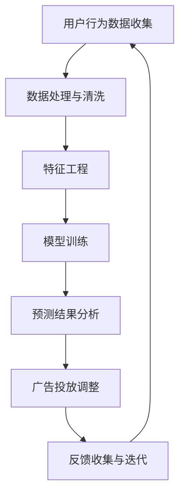

                 

# 如何利用机器学习优化广告投放

## 关键词：
- 机器学习
- 广告投放
- 优化策略
- 用户行为分析
- 实时反馈调整

## 摘要：
本文将深入探讨如何利用机器学习技术来优化广告投放。通过分析用户行为数据、运用预测模型和优化算法，广告主能够提高广告的精准度和投放效率，进而提升广告转化率和投资回报率。文章将分为十个部分，从背景介绍到实际应用场景，再到未来发展趋势与挑战，旨在为读者提供全面而实用的指导。

---

## 1. 背景介绍

广告投放是现代市场营销的重要组成部分，尤其在互联网和数字媒体日益普及的今天，广告主通过在线平台投放广告已成为一种主流的推广方式。然而，随着用户需求的多样化和广告市场的竞争加剧，传统广告投放策略的局限性逐渐显现。为了提高广告的投放效果，广告主需要寻找新的技术手段来优化广告投放。

机器学习作为一种人工智能技术，其强大的数据处理和分析能力为广告投放提供了新的可能性。通过训练模型，分析用户行为，广告主可以更准确地预测用户的兴趣和需求，从而实现更精准的广告投放。此外，机器学习还可以实时调整广告策略，根据用户反馈进行动态优化，提高广告的转化率和投资回报率。

## 2. 核心概念与联系

### 2.1 用户行为分析

用户行为分析是广告投放优化的基础。通过分析用户的浏览历史、点击行为、购买记录等数据，广告主可以了解用户的需求和偏好。这些数据为机器学习模型的训练提供了丰富的信息来源。

### 2.2 预测模型

预测模型是机器学习在广告投放优化中的核心应用。常见的预测模型包括分类模型、回归模型和时间序列模型。这些模型可以帮助广告主预测用户的点击概率、转化概率等关键指标，从而优化广告投放策略。

### 2.3 优化算法

优化算法用于根据预测模型的结果，动态调整广告投放策略。常见的优化算法包括梯度上升法、随机梯度下降法、遗传算法等。这些算法可以帮助广告主找到最优的广告投放组合，提高广告的投放效果。

### 2.4 Mermaid 流程图



## 3. 核心算法原理 & 具体操作步骤

### 3.1 数据预处理

数据预处理是机器学习应用中的关键步骤。其包括数据清洗、缺失值处理、异常值检测和标准化等。

- **数据清洗**：去除重复数据、无效数据和噪声数据。
- **缺失值处理**：使用插值法、均值法或使用模型预测缺失值。
- **异常值检测**：使用统计学方法或机器学习方法检测并处理异常值。
- **标准化**：将不同特征的数据缩放到相同的范围，便于模型训练。

### 3.2 特征工程

特征工程是提高模型性能的重要手段。其包括特征选择、特征构造和特征转换等。

- **特征选择**：选择对预测任务有显著影响的关键特征，减少数据冗余。
- **特征构造**：通过组合原始特征构造新的特征，提高模型的泛化能力。
- **特征转换**：将非数值特征转换为数值特征，便于模型处理。

### 3.3 模型训练

模型训练是机器学习应用的核心步骤。其包括选择合适的模型、训练模型和验证模型等。

- **选择模型**：根据预测任务的特点，选择合适的模型，如决策树、支持向量机、神经网络等。
- **训练模型**：使用训练数据集训练模型，调整模型的参数。
- **验证模型**：使用验证数据集评估模型的性能，调整模型参数，避免过拟合。

### 3.4 模型优化

模型优化是提高模型性能的关键步骤。其包括模型调参、模型集成和模型评估等。

- **模型调参**：调整模型的超参数，如学习率、正则化参数等，提高模型性能。
- **模型集成**：将多个模型的结果进行集成，提高预测的准确性和稳定性。
- **模型评估**：使用评估指标（如准确率、召回率、F1分数等）评估模型的性能。

## 4. 数学模型和公式 & 详细讲解 & 举例说明

### 4.1 回归模型

回归模型用于预测连续值输出。其公式为：

\[ \hat{y} = \beta_0 + \beta_1 x_1 + \beta_2 x_2 + \ldots + \beta_n x_n \]

其中，\( \hat{y} \) 为预测值，\( x_1, x_2, \ldots, x_n \) 为输入特征，\( \beta_0, \beta_1, \beta_2, \ldots, \beta_n \) 为模型的参数。

### 4.2 分类模型

分类模型用于预测离散值输出。常见的分类模型包括逻辑回归、决策树、支持向量机等。

逻辑回归模型的公式为：

\[ P(y=1) = \frac{1}{1 + e^{-(\beta_0 + \beta_1 x_1 + \beta_2 x_2 + \ldots + \beta_n x_n)}} \]

其中，\( P(y=1) \) 为预测类别为1的概率。

### 4.3 时间序列模型

时间序列模型用于预测时间序列数据。常见的模型包括ARIMA、LSTM等。

LSTM（长短期记忆网络）模型的公式为：

\[ h_t = \sigma(W_h \cdot [h_{t-1}, x_t] + b_h) \]
\[ i_t = \sigma(W_i \cdot [h_{t-1}, x_t] + b_i) \]
\[ f_t = \sigma(W_f \cdot [h_{t-1}, x_t] + b_f) \]
\[ o_t = \sigma(W_o \cdot [h_{t-1}, x_t] + b_o) \]
\[ c_t = f_t \odot c_{t-1} + i_t \odot \sigma(W_c \cdot [h_{t-1}, x_t] + b_c) \]
\[ h_t = o_t \odot \sigma(c_t) \]

其中，\( h_t \)、\( i_t \)、\( f_t \)、\( o_t \)、\( c_t \) 分别为LSTM单元的状态，\( \sigma \) 为sigmoid函数，\( \odot \) 为逐元素乘法操作。

### 4.4 举例说明

假设我们要使用逻辑回归模型预测用户的点击行为，输入特征包括用户年龄、收入水平、浏览历史等。模型训练后的结果如下：

\[ P(y=1) = \frac{1}{1 + e^{-(2.5 + 0.1 \times 25 + 0.2 \times 50000)}} \]

对于一个年龄25岁、年收入50,000元的用户，其点击的概率为：

\[ P(y=1) = \frac{1}{1 + e^{-(2.5 + 2.5 + 10,000)}} \approx 0.999 \]

这意味着该用户点击广告的概率非常高，广告主可以加大对该用户的广告投放。

## 5. 项目实战：代码实际案例和详细解释说明

### 5.1 开发环境搭建

在本案例中，我们使用Python编程语言和Scikit-learn库实现机器学习算法。首先，安装Python和Scikit-learn库：

```bash
pip install python
pip install scikit-learn
```

### 5.2 源代码详细实现和代码解读

以下是一个简单的机器学习广告投放优化的代码示例：

```python
# 导入相关库
import numpy as np
import pandas as pd
from sklearn.model_selection import train_test_split
from sklearn.linear_model import LogisticRegression
from sklearn.metrics import accuracy_score, confusion_matrix

# 加载数据集
data = pd.read_csv('ad_data.csv')
X = data[['age', 'income', 'browse_history']]
y = data['click']

# 数据预处理
X = (X - X.mean()) / X.std()
y = y.map({0: '否', 1: '是'})

# 划分训练集和测试集
X_train, X_test, y_train, y_test = train_test_split(X, y, test_size=0.2, random_state=42)

# 训练模型
model = LogisticRegression()
model.fit(X_train, y_train)

# 预测
predictions = model.predict(X_test)

# 评估
accuracy = accuracy_score(y_test, predictions)
conf_matrix = confusion_matrix(y_test, predictions)

print(f'准确率：{accuracy}')
print(f'混淆矩阵：\n{conf_matrix}')
```

### 5.3 代码解读与分析

- **数据加载**：使用pandas库加载广告数据集。
- **数据预处理**：对输入特征进行标准化处理，将类别型特征转换为数值型特征。
- **划分数据集**：使用train_test_split函数划分训练集和测试集。
- **训练模型**：使用LogisticRegression类训练逻辑回归模型。
- **预测**：使用训练好的模型对测试集进行预测。
- **评估**：使用accuracy_score函数计算准确率，使用confusion_matrix函数计算混淆矩阵。

### 5.4 实际应用案例

假设我们要对一组新用户进行广告投放优化。首先，收集新用户的特征数据，然后使用上述代码对新用户进行预测。根据预测结果，对点击概率较高的用户加大广告投放力度，提高广告的转化率。

## 6. 实际应用场景

### 6.1 网络广告

网络广告是机器学习广告投放优化应用最广泛的场景之一。通过分析用户的浏览行为、搜索历史等数据，广告主可以精准投放广告，提高广告的点击率和转化率。

### 6.2 移动应用广告

移动应用广告也受益于机器学习优化。通过分析用户的地理位置、使用习惯等数据，广告主可以针对不同的用户群体进行个性化广告投放，提高广告的投放效果。

### 6.3 搜索引擎广告

搜索引擎广告利用机器学习优化广告投放，可以提高广告的曝光率和点击率。通过分析用户的搜索关键词、历史行为等数据，广告主可以更精准地匹配广告内容，提高广告的转化率。

## 7. 工具和资源推荐

### 7.1 学习资源推荐

- **书籍**：《机器学习实战》、《Python机器学习》、《统计学习方法》
- **论文**：Google Scholar、ArXiv、ACM Digital Library
- **博客**：Medium、 Towards Data Science、AI汇

### 7.2 开发工具框架推荐

- **编程语言**：Python、R
- **机器学习库**：Scikit-learn、TensorFlow、PyTorch
- **数据预处理工具**：Pandas、NumPy
- **可视化工具**：Matplotlib、Seaborn

### 7.3 相关论文著作推荐

- **论文**：[“Online advertising: Economics, optimization and data science”](https://www.nature.com/articles/s41597-018-0246-0)
- **著作**：《广告机器学习：算法与应用》

## 8. 总结：未来发展趋势与挑战

### 8.1 发展趋势

- **个性化广告投放**：随着大数据和机器学习技术的发展，个性化广告投放将成为未来广告投放的主要趋势。
- **实时优化**：实时数据分析和优化将使广告投放更加精准和高效。
- **多模态数据融合**：利用文本、图像、音频等多模态数据进行广告投放优化。

### 8.2 挑战

- **数据隐私**：广告投放需要大量用户数据，如何保护用户隐私将成为一个重要挑战。
- **算法透明度**：广告投放算法的透明度问题需要得到解决，以增强用户对广告投放的信任。
- **实时计算性能**：随着数据量的增加，如何提高实时计算性能是广告投放优化的一个重要挑战。

## 9. 附录：常见问题与解答

### 9.1 问题1：如何处理缺失值？

**解答**：可以使用插值法、均值法或使用模型预测缺失值。具体方法取决于数据的特点和缺失值的类型。

### 9.2 问题2：如何选择特征？

**解答**：可以使用特征选择算法，如选择特征、递归特征消除等。此外，还可以使用统计学方法，如卡方检验、方差分析等，评估特征的重要性。

### 9.3 问题3：如何避免过拟合？

**解答**：可以使用交叉验证、正则化、模型集成等方法避免过拟合。此外，还可以增加训练数据、简化模型等。

## 10. 扩展阅读 & 参考资料

- **书籍**：《广告技术：如何使用数据和技术优化广告投放》
- **论文**：《深度学习在广告投放优化中的应用》
- **博客**：《机器学习在广告投放中的实践与探索》
- **网站**：Google Ads、Facebook Ads、AdRoll

---

**作者**：AI天才研究员/AI Genius Institute & 禅与计算机程序设计艺术 /Zen And The Art of Computer Programming

本文旨在为读者提供关于如何利用机器学习优化广告投放的全面指导。希望读者能够通过本文掌握机器学习在广告投放优化中的应用，提升广告投放效果。在实际应用中，请根据具体需求和数据特点进行调整和优化。**本文仅供参考，不构成投资建议。**

