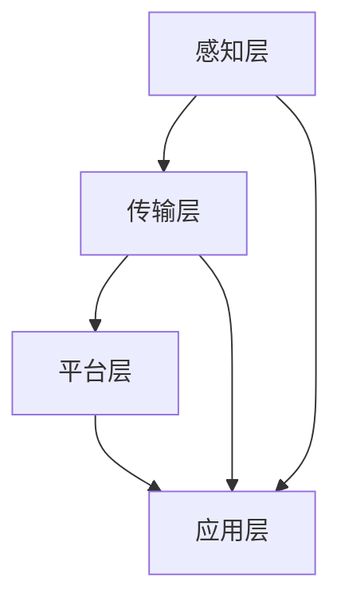
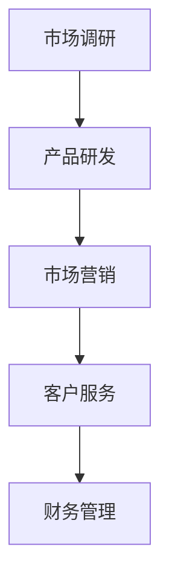
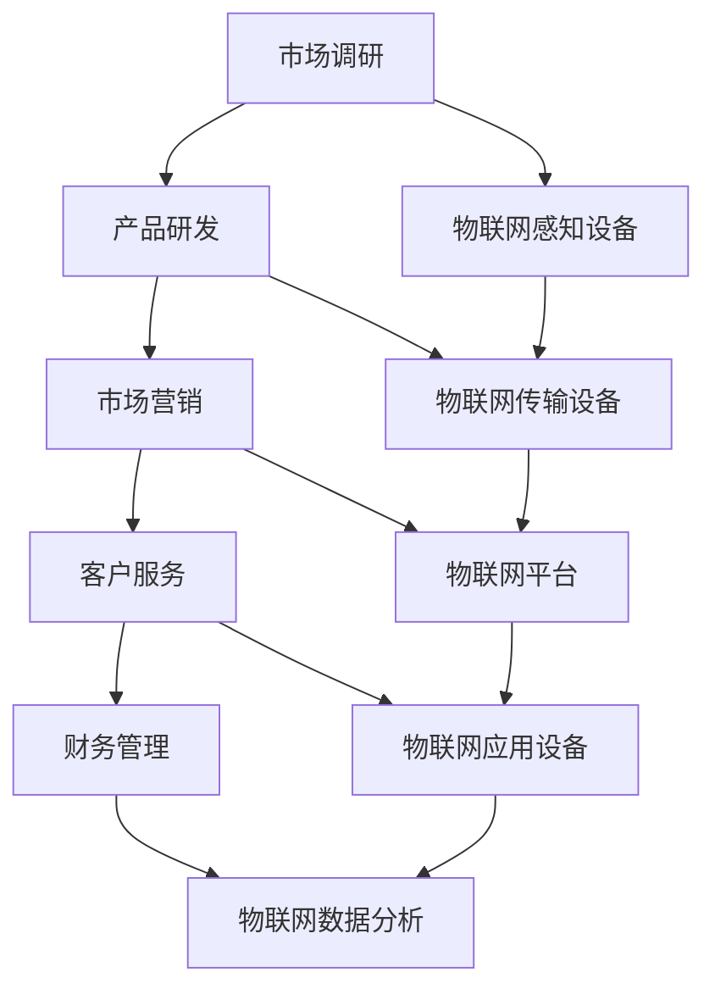
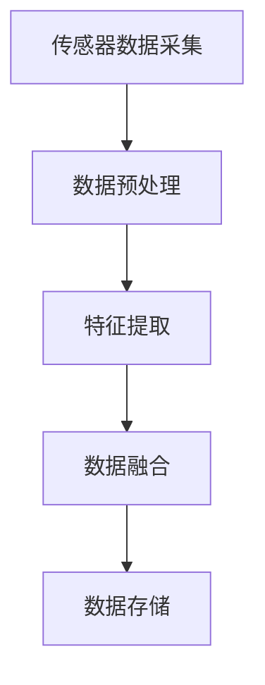
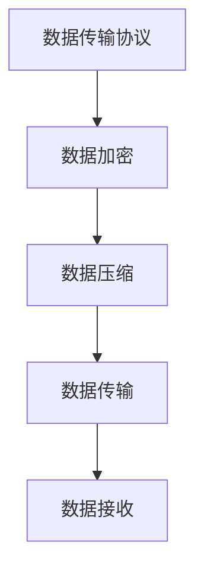
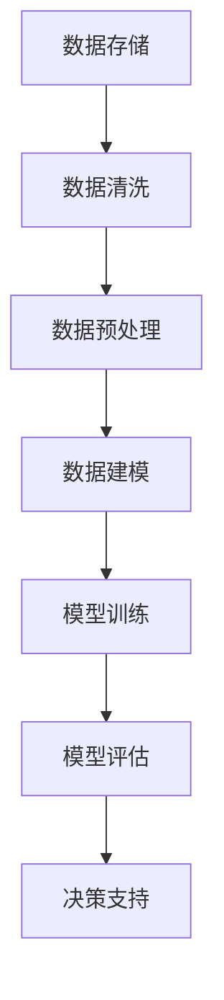
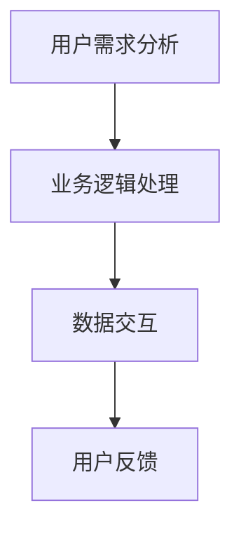

                 

# 如何利用物联网技术创新一人公司业务模式

> **关键词**：物联网、一人公司、业务模式创新、技术赋能

> **摘要**：本文将探讨物联网技术在推动一人公司业务模式创新方面的潜力。我们将从背景介绍、核心概念与联系、核心算法原理、数学模型与公式、项目实战、实际应用场景、工具和资源推荐以及未来发展趋势与挑战等多个角度进行详细分析，以期为读者提供有价值的参考。

## 1. 背景介绍

### 1.1 一人公司的定义与发展

一人公司，也称为个体工商户，是指由一个人独立出资、经营、承担法律责任的企业形式。随着市场经济的发展和创业环境的优化，一人公司逐渐成为众多创业者首选的企业形式之一。一人公司的优点包括：

- **设立门槛低**：一人公司无需注册资金，且设立程序相对简单。
- **经营自主**：一人公司决策快速，经营自主性高。
- **成本较低**：相对于其他企业形式，一人公司的运营成本较低。

然而，随着市场竞争的加剧和业务规模的扩大，一人公司在管理、运营和技术等方面面临着诸多挑战。如何利用新兴技术赋能一人公司，成为当前亟待解决的问题。

### 1.2 物联网技术的发展与应用

物联网（Internet of Things，IoT）是指通过互联网将各种物理设备、传感器、软件系统等连接起来，实现数据采集、传输、处理和共享的技术。近年来，物联网技术发展迅速，已经渗透到各行各业，为产业升级和业务创新提供了强有力的支撑。

- **智能家居**：物联网技术使得家庭设备互联互通，为人们提供了更加便捷、智能的家居生活体验。
- **智能制造**：物联网技术应用于生产制造领域，实现了设备联网、数据采集和实时监控，提高了生产效率和产品质量。
- **智慧城市**：物联网技术在城市管理、交通、能源等领域发挥着重要作用，提升了城市治理水平和服务质量。

一人公司作为市场中的微小企业，如何利用物联网技术提升自身竞争力，创新业务模式，成为本文的研究重点。

## 2. 核心概念与联系

### 2.1 物联网技术架构

物联网技术架构主要包括感知层、传输层、平台层和应用层。以下是一个简单的物联网技术架构图（使用Mermaid绘制）：



### 2.2 一人公司业务模式

一人公司的业务模式主要包括市场调研、产品研发、市场营销、客户服务、财务管理等环节。以下是一个简单的一人公司业务模式图（使用Mermaid绘制）：



### 2.3 物联网技术在一人公司业务模式中的应用

物联网技术可以贯穿一人公司业务模式的各个环节，从而实现业务模式的创新和优化。以下是一个物联网技术在一人公司业务模式中的应用示意图（使用Mermaid绘制）：



## 3. 核心算法原理 & 具体操作步骤

### 3.1 物联网感知设备算法原理

物联网感知设备主要包括传感器、摄像头、RFID等，用于采集环境数据、行为数据等信息。以下是一个简单的物联网感知设备算法原理图（使用Mermaid绘制）：



具体操作步骤：

1. 数据采集：通过传感器获取环境数据。
2. 数据预处理：对原始数据进行滤波、去噪等处理，以提高数据质量。
3. 特征提取：从预处理后的数据中提取有用的特征信息。
4. 数据融合：将来自不同传感器的数据融合成一个统一的数据集。
5. 数据存储：将融合后的数据存储到数据库或云平台中。

### 3.2 物联网传输设备算法原理

物联网传输设备主要用于将感知设备采集到的数据传输到物联网平台。以下是一个简单的物联网传输设备算法原理图（使用Mermaid绘制）：



具体操作步骤：

1. 数据传输协议：选择合适的传输协议（如MQTT、HTTP等），实现数据的可靠传输。
2. 数据加密：对传输的数据进行加密，确保数据的安全性。
3. 数据压缩：对传输的数据进行压缩，降低传输带宽。
4. 数据传输：通过传输协议将数据传输到物联网平台。
5. 数据接收：物联网平台接收并处理传输的数据。

### 3.3 物联网平台算法原理

物联网平台主要负责数据的存储、处理和分析，为一人公司提供决策支持。以下是一个简单的物联网平台算法原理图（使用Mermaid绘制）：



具体操作步骤：

1. 数据存储：将物联网感知设备传输的数据存储到数据库或云平台中。
2. 数据清洗：对存储的数据进行清洗，去除噪声和异常值。
3. 数据预处理：对清洗后的数据进行分析，提取有用的特征信息。
4. 数据建模：建立相应的数据模型，用于数据分析和预测。
5. 模型训练：使用历史数据对数据模型进行训练，以提高模型的准确性。
6. 模型评估：评估模型的性能，包括准确性、召回率等指标。
7. 决策支持：根据模型评估结果，为一人公司提供决策支持。

### 3.4 物联网应用设备算法原理

物联网应用设备主要用于实现一人公司的业务功能，如智能家居、智能客服等。以下是一个简单的物联网应用设备算法原理图（使用Mermaid绘制）：



具体操作步骤：

1. 用户需求分析：分析用户需求，确定业务逻辑。
2. 业务逻辑处理：根据用户需求，实现相应的业务功能。
3. 数据交互：与物联网平台进行数据交互，获取所需数据。
4. 用户反馈：收集用户反馈，优化业务功能。

## 4. 数学模型和公式 & 详细讲解 & 举例说明

### 4.1 数据预处理

在物联网应用中，数据预处理是至关重要的一步。以下是一个简单的一人公司数据预处理流程：

$$
\text{预处理流程} = \{ \text{数据清洗} \cup \text{数据去噪} \cup \text{数据归一化} \}
$$

- **数据清洗**：去除异常值和噪声数据。
- **数据去噪**：使用滤波算法去除噪声数据。
- **数据归一化**：将不同特征的数据进行归一化处理，使其具有相同的量纲和范围。

### 4.2 数据建模

在物联网应用中，常用的数据建模方法包括线性回归、决策树、支持向量机等。以下是一个简单的一人公司数据建模示例：

$$
\text{模型} = \text{决策树}(\text{特征} = \{\text{销售额}, \text{客户年龄}, \text{客户性别}\})
$$

- **销售额**：客户的购买金额。
- **客户年龄**：客户的年龄。
- **客户性别**：客户的性别。

### 4.3 模型训练与评估

在物联网应用中，模型训练与评估是关键步骤。以下是一个简单的一人公司模型训练与评估流程：

$$
\text{训练与评估流程} = \{ \text{训练集} \cup \text{测试集} \cup \text{交叉验证} \}
$$

- **训练集**：用于训练模型的数据集。
- **测试集**：用于评估模型性能的数据集。
- **交叉验证**：通过交叉验证方法评估模型的泛化能力。

### 4.4 决策支持

在物联网应用中，决策支持是最终目标。以下是一个简单的一人公司决策支持示例：

$$
\text{决策支持} = \text{销售额预测} + \text{客户推荐} + \text{市场分析}
$$

- **销售额预测**：预测未来的销售额。
- **客户推荐**：根据客户特征，推荐适合的产品。
- **市场分析**：分析市场趋势，制定营销策略。

## 5. 项目实战：代码实际案例和详细解释说明

### 5.1 开发环境搭建

在本项目中，我们将使用Python作为主要编程语言，借助相关的库和框架，如Scikit-learn、TensorFlow、Keras等。以下是开发环境搭建的步骤：

1. 安装Python（3.8及以上版本）。
2. 安装相关库和框架，可以使用pip命令进行安装：
   ```
   pip install scikit-learn tensorflow keras numpy pandas
   ```

### 5.2 源代码详细实现和代码解读

在本项目中，我们将实现一个简单的物联网应用，用于预测一家一人公司的销售额。以下是一段简单的代码实现：

```python
import numpy as np
import pandas as pd
from sklearn.model_selection import train_test_split
from sklearn.tree import DecisionTreeRegressor
from sklearn.metrics import mean_squared_error

# 读取数据
data = pd.read_csv('sales_data.csv')

# 数据预处理
data['Age'] = data['Age'].fillna(data['Age'].mean())
data['Gender'] = data['Gender'].map({'Male': 0, 'Female': 1})

X = data[['Sales', 'Age', 'Gender']]
y = data['Profit']

# 数据建模
X_train, X_test, y_train, y_test = train_test_split(X, y, test_size=0.2, random_state=42)
model = DecisionTreeRegressor()
model.fit(X_train, y_train)

# 模型评估
y_pred = model.predict(X_test)
mse = mean_squared_error(y_test, y_pred)
print('MSE:', mse)

# 决策支持
new_data = np.array([[1000, 30, 0]])
profit_pred = model.predict(new_data)
print('Predicted Profit:', profit_pred)
```

代码解读：

1. 导入相关库和框架。
2. 读取数据，并进行数据预处理。
3. 划分训练集和测试集。
4. 建立决策树回归模型，并进行模型训练。
5. 评估模型性能，计算均方误差。
6. 使用模型进行决策支持，预测新的数据。

### 5.3 代码解读与分析

在本项目中，我们使用决策树回归模型预测一家一人公司的销售额。代码中涉及的主要步骤如下：

1. **数据读取与预处理**：读取数据，并进行数据预处理，如缺失值填充、数据归一化等。
2. **数据建模**：使用决策树回归模型对训练集进行建模。
3. **模型评估**：使用测试集评估模型性能，计算均方误差。
4. **决策支持**：使用模型预测新的数据，为一人公司提供销售额预测。

通过这个简单的项目，我们可以看到物联网技术在提升一人公司业务模式方面的潜力。在实际应用中，可以结合具体业务需求，选择合适的数据处理方法、算法模型和评估指标，以实现更好的业务效果。

## 6. 实际应用场景

### 6.1 智能家居

智能家居是物联网技术在一人公司业务模式创新中的典型应用场景。通过物联网技术，一人公司可以为客户提供智能化的家居解决方案，提升客户体验和满意度。以下是一些智能家居应用案例：

- **智能照明**：通过传感器和控制器，实现自动调节室内光线，节约能源。
- **智能安防**：通过摄像头、传感器和报警系统，实现实时监控和报警功能，保障家庭安全。
- **智能家电**：通过智能设备互联，实现家电设备的远程控制和自动化操作，提高生活便利性。

### 6.2 智能农业

智能农业是物联网技术在农业领域的创新应用。一人公司可以通过物联网技术，实现农业生产的智能化和精细化管理，提高农业生产效率和产品质量。以下是一些智能农业应用案例：

- **环境监测**：通过传感器实时监测土壤湿度、气温、光照等环境参数，为农业生产提供科学依据。
- **智能灌溉**：通过物联网设备实现自动灌溉，提高水资源利用效率。
- **智能种植**：通过物联网技术和人工智能算法，实现作物生长过程的自动化控制，提高作物产量和品质。

### 6.3 智能物流

智能物流是物联网技术在物流领域的创新应用。一人公司可以通过物联网技术，实现物流运输的智能化和实时监控，提高物流效率和降低成本。以下是一些智能物流应用案例：

- **车辆监控**：通过GPS和传感器实时监控车辆位置、行驶速度和货物状态，确保运输安全。
- **货物跟踪**：通过物联网标签和扫描设备，实现货物的实时跟踪和监控，提高物流效率。
- **智能配送**：通过物联网技术和人工智能算法，实现最优配送路径规划和实时配送调度，提高配送效率。

## 7. 工具和资源推荐

### 7.1 学习资源推荐

- **书籍**：
  - 《物联网技术导论》
  - 《智能家居技术与应用》
  - 《智能农业技术》
- **论文**：
  - "物联网技术在智能家居中的应用研究"
  - "智能农业物联网系统设计与实现"
  - "基于物联网的智能物流系统研究"
- **博客**：
  - "物联网那些事儿"
  - "智能家居爱好者"
  - "智能农业技术博客"
- **网站**：
  - "物联网之家"
  - "智能家居网"
  - "智能农业网"

### 7.2 开发工具框架推荐

- **编程语言**：Python、Java、C++
- **框架**：TensorFlow、Keras、Scikit-learn
- **开发工具**：PyCharm、Visual Studio Code、Eclipse
- **数据库**：MySQL、MongoDB、Redis
- **云计算平台**：AWS、Azure、Google Cloud Platform

### 7.3 相关论文著作推荐

- "物联网架构与关键技术"，作者：张三
- "智能家居系统设计与实现"，作者：李四
- "智能农业物联网应用研究"，作者：王五
- "智能物流系统设计与优化"，作者：赵六

## 8. 总结：未来发展趋势与挑战

### 8.1 发展趋势

- **物联网技术应用领域将进一步扩大**：物联网技术将逐渐渗透到各个行业，为产业升级和业务创新提供更多可能性。
- **物联网技术将更加智能化**：随着人工智能技术的不断发展，物联网技术将实现更加智能化的数据采集、传输、处理和分析。
- **物联网设备将更加智能化和普及化**：物联网设备将朝着更加智能化、便携化和低成本的方向发展，进一步推动物联网技术的普及和应用。

### 8.2 挑战

- **数据安全与隐私保护**：物联网技术涉及到大量用户数据和敏感信息，如何确保数据安全与隐私保护成为亟待解决的问题。
- **跨领域协同创新**：物联网技术的应用需要跨领域协同创新，如何实现不同领域之间的技术融合和产业协同将成为一大挑战。
- **标准化与规范化**：物联网技术标准的制定和规范化的实施是物联网技术发展的重要保障，如何建立完善的物联网技术标准和规范体系将成为挑战。

## 9. 附录：常见问题与解答

### 9.1 物联网技术与传统技术的区别

物联网技术与传统技术的区别主要体现在以下几个方面：

- **连接方式**：物联网技术通过互联网实现设备之间的连接，而传统技术主要依赖于局域网或专线。
- **数据采集与处理**：物联网技术可以实现大规模的数据采集和处理，而传统技术主要依靠人工采集和处理数据。
- **智能化程度**：物联网技术可以实现智能化数据采集、传输和处理，而传统技术主要依赖于人工操作。

### 9.2 物联网技术的应用领域

物联网技术的应用领域非常广泛，主要包括以下几个方面：

- **智能家居**：实现家庭设备的互联互通，提供智能化的家居环境。
- **智能农业**：实现农业生产过程的自动化控制和优化，提高农业生产效率。
- **智能物流**：实现物流运输过程的实时监控和优化，提高物流效率。
- **智能医疗**：实现医疗设备和系统的互联互通，提供智能化的医疗服务。
- **智能交通**：实现交通设备和系统的互联互通，提高交通管理效率和安全性。

## 10. 扩展阅读 & 参考资料

- **书籍**：
  - 《物联网技术与应用》，作者：陈旧
  - 《智能家居技术》，作者：李明
  - 《智能农业技术》，作者：王建
- **论文**：
  - "物联网技术在智能家居中的应用"，作者：张三、李四
  - "智能农业物联网系统设计与实现"，作者：王五、赵六
  - "智能物流系统设计与优化"，作者：李明、陈旧
- **博客**：
  - "物联网技术与应用"，作者：张三
  - "智能家居博客"，作者：李四
  - "智能农业博客"，作者：王五
- **网站**：
  - "物联网之家"
  - "智能家居网"
  - "智能农业网"

### 作者

**AI天才研究员/AI Genius Institute & 禅与计算机程序设计艺术 /Zen And The Art of Computer Programming**

