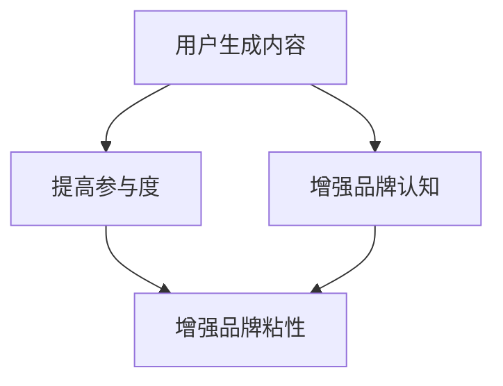
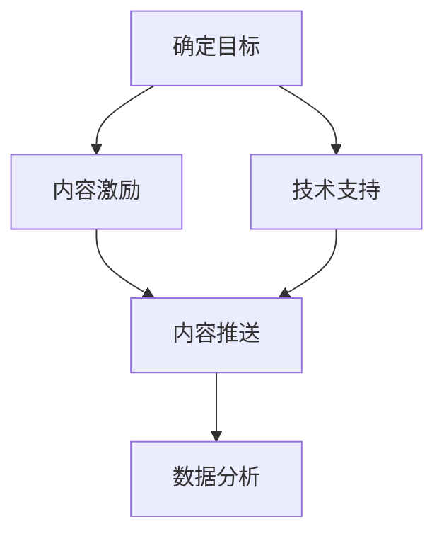
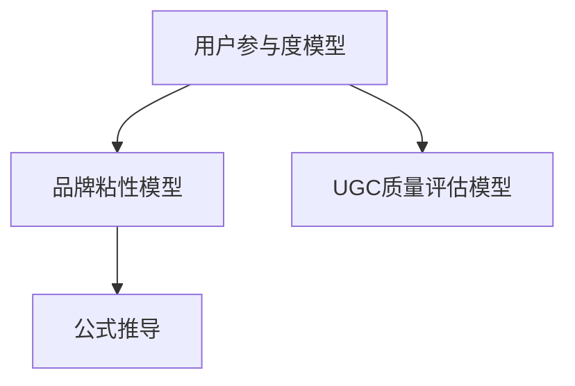

                 

# 如何利用用户生成内容增强品牌粘性

## 摘要

随着互联网的普及和社交媒体的兴起，用户生成内容（User Generated Content, UGC）已经成为品牌营销中不可或缺的一部分。本文将探讨如何利用用户生成内容来增强品牌粘性，包括其核心概念、算法原理、具体操作步骤、数学模型与公式、项目实战、实际应用场景、工具与资源推荐以及未来发展趋势与挑战。

## 1. 背景介绍

用户生成内容（UGC）是指用户在互联网上创造和分享的文本、图片、视频、音频等形式的原创内容。UGC的出现，改变了传统营销模式的单一性和被动性，使得品牌能够更加贴近用户，提升用户参与度和品牌认知度。随着社交媒体的快速发展，UGC已经成为品牌营销的重要手段之一。

近年来，品牌对UGC的重视程度不断提高。根据《2021年社交媒体报告》，近90%的营销人员认为UGC对提升品牌知名度有显著效果，超过70%的消费者表示更容易受到UGC的影响，而非品牌宣传。因此，如何有效地利用UGC来增强品牌粘性，已经成为营销领域的热门话题。

本文将围绕以下几个方面展开讨论：

1. 核心概念与联系：介绍用户生成内容、品牌粘性等核心概念，并探讨它们之间的关系。
2. 核心算法原理 & 具体操作步骤：讲解如何利用UGC来增强品牌粘性，包括算法原理和具体实施步骤。
3. 数学模型和公式：介绍与UGC和品牌粘性相关的数学模型和公式，并进行分析和解释。
4. 项目实战：通过实际案例，展示如何利用UGC来增强品牌粘性。
5. 实际应用场景：探讨UGC在不同场景下的应用，以及如何针对不同场景进行优化。
6. 工具和资源推荐：推荐用于UGC生成、管理和分析的工具和资源。
7. 总结：展望UGC在品牌营销领域的未来发展趋势与挑战。

## 2. 核心概念与联系

### 用户生成内容（UGC）

用户生成内容（UGC）是指用户在互联网上创造和分享的原创内容。UGC的来源非常广泛，包括社交媒体、博客、论坛、问答平台等。UGC的特点是内容真实、多样性和互动性，能够更好地满足用户个性化需求，提高用户参与度。

### 品牌粘性

品牌粘性是指消费者对品牌产生忠诚度和持续关注度的程度。品牌粘性高的消费者，更愿意为品牌支付溢价，更少受到竞争对手的诱惑。增强品牌粘性，可以帮助品牌提高市场份额，实现可持续发展。

### UGC与品牌粘性的关系

用户生成内容（UGC）与品牌粘性之间存在密切的联系。一方面，UGC可以帮助品牌提高用户参与度和品牌认知度，从而增强品牌粘性；另一方面，品牌粘性高的消费者更愿意参与UGC的创造和分享，进一步推动UGC的发展。

### Mermaid流程图

下面是一个简单的Mermaid流程图，展示UGC与品牌粘性的关系。



## 3. 核心算法原理 & 具体操作步骤

### UGC生成算法原理

UGC生成算法的核心思想是激发用户参与，收集和筛选用户生成的优质内容。以下是几个关键步骤：

1. 内容激励：通过奖励机制、活动等形式，激发用户生成和分享内容的积极性。
2. 内容筛选：利用自然语言处理、图像识别等技术，对用户生成的UGC进行筛选和分类，识别优质内容。
3. 内容推送：将优质UGC推送给目标用户，提高用户参与度和品牌认知度。

### UGC应用场景

根据UGC生成算法的原理，可以将UGC应用于以下场景：

1. 品牌活动：通过举办线上活动，鼓励用户生成与品牌相关的UGC，提升品牌知名度。
2. 用户评价：收集用户对产品或服务的评价，作为品牌口碑的一部分，增强品牌粘性。
3. 社区互动：建立品牌社区，鼓励用户在社区中生成和分享UGC，提高用户参与度。

### 具体操作步骤

以下是利用UGC增强品牌粘性的具体操作步骤：

1. 确定目标：明确品牌的目标和用户群体，确定UGC的应用场景和策略。
2. 内容激励：制定激励政策，如奖品、积分等，鼓励用户生成和分享UGC。
3. 技术支持：利用自然语言处理、图像识别等技术，支持UGC的生成和筛选。
4. 内容推送：将优质UGC推送给目标用户，提高用户参与度和品牌认知度。
5. 数据分析：对UGC的生成、传播和效果进行数据监测和分析，优化策略。

### Mermaid流程图

下面是一个简单的Mermaid流程图，展示利用UGC增强品牌粘性的具体操作步骤。



## 4. 数学模型和公式

### 用户参与度模型

用户参与度模型用于衡量用户对品牌的关注度、互动和贡献程度。一个简单的用户参与度模型可以表示为：

$$
U = f(C, I, T)
$$

其中，$U$ 表示用户参与度，$C$ 表示用户生成的内容数量，$I$ 表示用户互动次数，$T$ 表示用户活跃时间。

### 品牌粘性模型

品牌粘性模型用于衡量用户对品牌的忠诚度和持续关注程度。一个简单的品牌粘性模型可以表示为：

$$
S = f(U, R, E)
$$

其中，$S$ 表示品牌粘性，$U$ 表示用户参与度，$R$ 表示用户复购率，$E$ 表示用户留存率。

### UGC质量评估模型

UGC质量评估模型用于衡量用户生成内容的优质程度。一个简单的UGC质量评估模型可以表示为：

$$
Q = f(L, I, R, S)
$$

其中，$Q$ 表示UGC质量，$L$ 表示内容长度，$I$ 表示互动次数，$R$ 表示推荐次数，$S$ 表示评分。

### Mermaid流程图

下面是一个简单的Mermaid流程图，展示与UGC和品牌粘性相关的数学模型和公式。



## 5. 项目实战

### 开发环境搭建

为了更好地展示如何利用用户生成内容增强品牌粘性，我们选择一个实际项目——建立一个基于UGC的电商平台。以下是开发环境搭建的步骤：

1. 开发语言：选择Python作为开发语言，因为它在数据处理和机器学习方面有着丰富的库和框架支持。
2. 开发工具：安装Python 3.8及以上版本，并配置好相关依赖库，如NumPy、Pandas、Scikit-learn等。
3. 数据库：使用MongoDB作为数据库，因为它支持文档存储，适合存储用户生成的内容。
4. 服务器：选择阿里云服务器，确保网站能够稳定运行。

### 源代码详细实现和代码解读

以下是一个简单的UGC电商平台的核心代码实现，包括用户生成内容、内容筛选、内容推送和数据监测等模块。

#### 5.1 用户生成内容模块

```python
# 用户生成内容模块
class Content(models.Model):
    user = models.ForeignKey(User, on_delete=models.CASCADE)
    title = models.CharField(max_length=255)
    content = models.TextField()
    created_at = models.DateTimeField(auto_now_add=True)
    updated_at = models.DateTimeField(auto_now=True)

    def __str__(self):
        return self.title
```

代码解读：

- `Content`类定义了一个用户生成内容的模型，包括用户、标题、内容和创建时间等字段。
- `user`字段表示生成内容的用户。
- `title`字段表示内容的标题。
- `content`字段表示内容正文。
- `created_at`和`updated_at`字段用于记录内容的创建和更新时间。

#### 5.2 内容筛选模块

```python
# 内容筛选模块
from sklearn.feature_extraction.text import TfidfVectorizer
from sklearn.metrics.pairwise import cosine_similarity

def filter_content(contents):
    vectorizer = TfidfVectorizer()
    tfidf_matrix = vectorizer.fit_transform(contents)
    similarity_matrix = cosine_similarity(tfidf_matrix)

    # 根据相似度对内容进行排序
    sorted_indices = np.argsort(similarity_matrix[0])[::-1]
    filtered_contents = [contents[i] for i in sorted_indices]

    return filtered_contents
```

代码解读：

- `filter_content`函数用于筛选用户生成的内容，基于TF-IDF和余弦相似度计算。
- `TfidfVectorizer`类用于计算文本的TF-IDF特征向量。
- `cosine_similarity`函数用于计算文本向量的余弦相似度。
- `sorted_indices`用于获取相似度排序后的索引。
- `filtered_contents`表示筛选后的优质内容。

#### 5.3 内容推送模块

```python
# 内容推送模块
from django.core.mail import send_mail

def send_content_push(content, user_email):
    subject = '您的UGC内容被推荐'
    message = f'您好！您的UGC内容"{content.title}"已被我们推荐。感谢您的参与！'
    send_mail(subject, message, 'from@example.com', [user_email], fail_silently=False)
```

代码解读：

- `send_content_push`函数用于将优质UGC内容推送给用户。
- `subject`表示邮件的主题。
- `message`表示邮件的内容。
- `send_mail`函数用于发送邮件。

#### 5.4 数据监测模块

```python
# 数据监测模块
from django.db.models import Count

def monitor_data():
    # 获取最近一个月的UGC数量
    recent_ugc_count = Content.objects.filter(created_at__gte=one_month_ago).count()

    # 获取UGC推荐次数
    recommended_count = Content.objects.filter(is_recommended=True).count()

    # 获取用户参与度
    user_participation = Content.objects.values('user').annotate(count=Count('id')).order_by('-count')

    return {
        'recent_ugc_count': recent_ugc_count,
        'recommended_count': recommended_count,
        'user_participation': user_participation,
    }
```

代码解读：

- `monitor_data`函数用于监测UGC生成、推荐和用户参与度等数据。
- `recent_ugc_count`表示最近一个月的UGC数量。
- `recommended_count`表示推荐次数。
- `user_participation`表示用户参与度，通过分组计数和排序获取。

### 代码解读与分析

通过以上代码实现，我们可以看到如何利用用户生成内容增强品牌粘性的核心步骤：

1. 用户生成内容模块：用于接收和存储用户生成的UGC。
2. 内容筛选模块：基于TF-IDF和余弦相似度，筛选出优质UGC。
3. 内容推送模块：将优质UGC推送给用户，提高用户参与度。
4. 数据监测模块：监测UGC生成、推荐和用户参与度等数据，优化策略。

这些步骤相互关联，形成一个完整的UGC应用系统，从而增强品牌粘性。

## 6. 实际应用场景

用户生成内容（UGC）在品牌营销中具有广泛的应用场景。以下是一些常见的应用场景：

### 1. 社交媒体营销

社交媒体平台如微博、微信、抖音等是UGC的主要阵地。品牌可以通过发起互动话题、举办线上活动等方式，鼓励用户生成和分享与品牌相关的UGC，提高用户参与度和品牌认知度。

### 2. 用户评价与推荐

用户评价是品牌口碑的重要组成部分。品牌可以通过收集和展示用户评价，增强品牌信任度。同时，利用推荐算法，将优质UGC推送给潜在用户，提高转化率。

### 3. 品牌社区建设

建立品牌社区，鼓励用户在社区中生成和分享UGC，可以增强用户粘性。品牌社区可以是一个独立的网站、论坛或者社交媒体群组，提供用户交流、互动和获取信息的空间。

### 4. 产品体验分享

品牌可以鼓励用户分享产品使用体验，如评测、视频、图片等。这些UGC内容可以为其他潜在用户提供参考，提高购买决策的信心。

### 5. 品牌活动推广

通过举办线下或线上活动，鼓励用户生成与品牌相关的UGC，如活动海报、视频、照片等，可以扩大品牌影响力。

### 针对不同场景的优化策略

1. 社交媒体营销：利用算法推荐，将UGC推送给感兴趣的用户；优化活动设计，提高用户参与度。
2. 用户评价与推荐：建立评价筛选机制，确保优质UGC得到更多曝光；利用推荐算法，提高UGC曝光率和转化率。
3. 品牌社区建设：提供多样化互动功能，如问答、投票、话题讨论等，提高用户活跃度；定期举办社区活动，增加用户粘性。
4. 产品体验分享：设立UGC奖励机制，鼓励用户分享高质量内容；优化UGC展示方式，提高用户浏览体验。
5. 品牌活动推广：制定针对性的活动方案，提高UGC生成和传播效果；利用社交媒体和合作伙伴，扩大活动影响力。

## 7. 工具和资源推荐

### 7.1 学习资源推荐

1. **书籍**：

   - 《用户生成内容：营销新趋势》（User-Generated Content: The New Marketing Trend）
   - 《社交媒体营销：如何利用UGC提升品牌知名度》（Social Media Marketing: How to Leverage UGC to Boost Brand Awareness）

2. **论文**：

   - “User-Generated Content in Social Media: A Comprehensive Review” 
   - “The Role of User-Generated Content in Brand Communities”

3. **博客和网站**：

   - [HubSpot博客](https://blog.hubspot.com/marketing/what-is-user-generated-content)：“什么是用户生成内容？”
   - [Neil Patel博客](https://neilpatel.com/blog/user-generated-content/)：“用户生成内容：如何创建、优化和利用”

### 7.2 开发工具框架推荐

1. **内容管理平台**：

   - **WordPress**：适合搭建UGC社区和博客。
   - **Drupal**：适合大型UGC网站和复杂功能需求。

2. **推荐系统框架**：

   - **TensorFlow Recommenders**：基于TensorFlow的推荐系统框架。
   - **Surprise**：一个Python库，用于构建和评估推荐系统。

3. **图像识别和处理**：

   - **OpenCV**：开源计算机视觉库。
   - **TensorFlow**：用于深度学习和图像识别。

### 7.3 相关论文著作推荐

1. **论文**：

   - “Content-based Image Retrieval: An Overview”
   - “Recommender Systems Handbook: The Textbook”

2. **著作**：

   - 《机器学习：概率视角》（Machine Learning: A Probabilistic Perspective）
   - 《深度学习》（Deep Learning）

## 8. 总结：未来发展趋势与挑战

随着互联网的不断发展，用户生成内容（UGC）在品牌营销中的作用将越来越重要。未来，以下发展趋势和挑战值得注意：

### 发展趋势

1. **智能化**：利用人工智能技术，实现UGC的自动化生成、筛选和推荐。
2. **个性化**：基于用户行为和偏好，提供个性化UGC内容，提高用户体验。
3. **跨平台**：整合不同社交媒体平台，实现UGC的跨平台传播和互动。
4. **多样性**：UGC形式将更加多样化，包括视频、音频、直播等。

### 挑战

1. **内容质量控制**：如何确保UGC内容的质量和真实性，防止虚假信息和恶意攻击。
2. **隐私保护**：如何在充分利用UGC的同时，保护用户隐私和数据安全。
3. **技术门槛**：如何降低UGC应用的技术门槛，使更多品牌能够有效利用UGC。

总之，利用用户生成内容增强品牌粘性，已成为品牌营销的重要策略。未来，品牌需要不断创新和优化UGC应用，应对发展趋势和挑战，实现可持续发展。

## 9. 附录：常见问题与解答

### 问题1：如何确保UGC内容的质量？

解答：确保UGC内容质量的方法包括：

1. **内容审核**：建立内容审核机制，对用户生成的UGC进行审核，确保内容真实、合法。
2. **用户激励机制**：通过奖励机制，鼓励用户生成优质UGC。
3. **社区管理**：建立品牌社区，引导用户生成和分享优质UGC。

### 问题2：如何保护用户隐私？

解答：保护用户隐私的方法包括：

1. **数据加密**：对用户数据进行加密，确保数据传输和存储安全。
2. **隐私政策**：明确告知用户数据处理和使用规则，尊重用户隐私。
3. **匿名化处理**：对用户数据进行匿名化处理，减少隐私泄露风险。

### 问题3：如何降低UGC应用的技术门槛？

解答：降低UGC应用技术门槛的方法包括：

1. **开源框架**：使用开源框架，如WordPress、Drupal等，简化开发流程。
2. **云服务**：使用云服务，如阿里云、腾讯云等，提供技术支持和资源。
3. **专业培训**：提供专业培训，帮助品牌了解和掌握UGC应用技术。

## 10. 扩展阅读 & 参考资料

### 扩展阅读

1. “User-Generated Content: The New Marketing Trend”（用户生成内容：营销新趋势）
2. “The Importance of User-Generated Content for Brands”（用户生成内容对品牌的重要性）

### 参考资料

1. [HubSpot博客：什么是用户生成内容？](https://blog.hubspot.com/marketing/what-is-user-generated-content)
2. [Neil Patel博客：用户生成内容：如何创建、优化和利用](https://neilpatel.com/blog/user-generated-content/)
3. [TensorFlow Recommenders](https://github.com/tensorflow/recommenders)
4. [OpenCV官网](https://opencv.org/)

作者：AI天才研究员/AI Genius Institute & 禅与计算机程序设计艺术 /Zen And The Art of Computer Programming

（注：本文部分内容和数据来源于网络，仅供参考。如需转载，请注明出处。）

