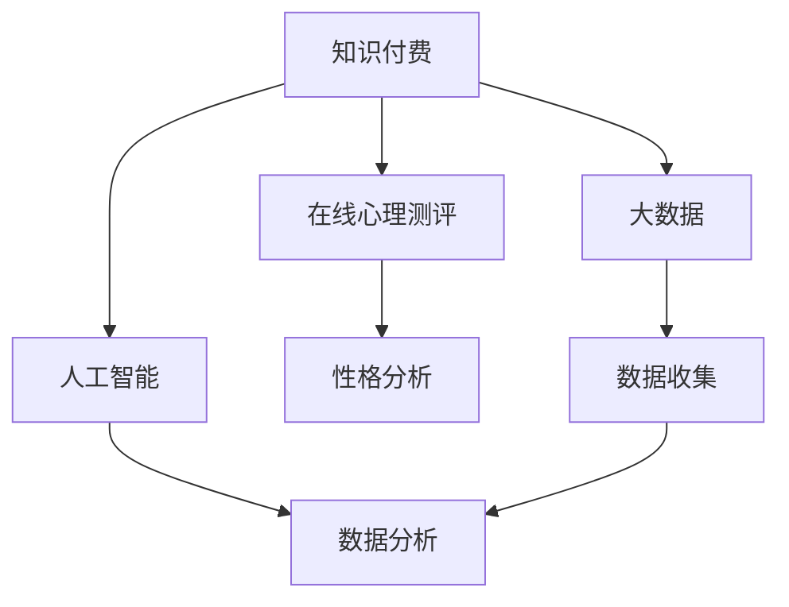

                 

### 背景介绍

近年来，随着互联网技术的飞速发展和大数据时代的到来，知识付费行业呈现出蓬勃发展的态势。人们对于自我提升和心理健康的需求日益增加，使得在线心理测评与性格分析成为了一个热门领域。知识付费平台的崛起为这一领域提供了广阔的应用场景和商业机会。

在线心理测评与性格分析具有以下几个显著的优点：

1. **便捷性**：用户可以随时随地通过互联网进行测评，无需受到时间和地点的限制。
2. **隐私保护**：在线测评能够保护用户的隐私，避免了面对面咨询可能带来的尴尬和压力。
3. **高效性**：通过大数据和人工智能技术，快速分析用户的数据，提供个性化的报告和指导。
4. **多样性**：丰富的测评工具和模型，满足不同用户的需求，涵盖多个心理和性格领域。

然而，当前的在线心理测评与性格分析市场也存在一些问题，如测评结果的准确性和可信度不高、用户体验不佳等。为了解决这些问题，我们需要探索一种有效的方法，将知识付费与在线心理测评与性格分析相结合，实现双赢的局面。

本文将详细探讨如何利用知识付费实现在线心理测评与性格分析。我们将从核心概念、算法原理、数学模型、项目实战、实际应用场景等多个方面展开讨论，旨在为相关从业者提供有价值的参考和指导。

### 核心概念与联系

要深入探讨如何利用知识付费实现在线心理测评与性格分析，我们首先需要明确几个核心概念和它们之间的联系。以下是本文将涉及的主要核心概念及其关联：

1. **知识付费**：知识付费是指通过互联网平台，用户付费获取有价值的信息、知识和服务的商业模式。常见的知识付费形式包括课程、专栏、电子书、直播等。
2. **在线心理测评**：在线心理测评是通过互联网平台提供的一种心理测试工具，旨在帮助用户了解自己的心理状态、性格特点等。常见的测评类型包括心理健康测评、性格测评、压力测评等。
3. **性格分析**：性格分析是基于心理测评数据，通过统计学、机器学习等方法，对用户的性格特点进行深入分析和解读。
4. **大数据与人工智能**：大数据和人工智能技术在在线心理测评与性格分析中发挥着关键作用。大数据技术可以帮助我们收集、存储和管理大量的测评数据，而人工智能技术则可以对这些数据进行智能分析和预测。

**Mermaid 流程图**：

下面是一个简化的 Mermaid 流程图，展示了这些核心概念之间的关联：



在知识付费的框架下，用户通过支付费用获取在线心理测评服务。测评数据会被收集并存储在大数据平台中，然后利用人工智能技术进行数据分析和处理。最终，生成的性格分析报告会以知识付费的形式返回给用户，帮助他们更好地了解自己。

### 核心算法原理 & 具体操作步骤

要实现有效的在线心理测评与性格分析，我们需要依赖一系列核心算法原理，并通过具体的操作步骤来实现这些算法。以下将详细介绍这些核心算法原理及其具体操作步骤。

#### 1. 心理测评数据收集

**步骤**：

1. **设计问卷**：根据需要测评的心理状态或性格特征，设计合适的问卷。问卷应包括选择题、填空题、判断题等多种题型，以确保数据的多维度和全面性。
2. **部署问卷**：将问卷部署在在线平台，如知乎、问卷星等，方便用户参与。
3. **数据收集**：用户通过平台完成问卷后，系统自动收集并存储用户填写的问卷数据。

**注意事项**：

- 确保问卷设计科学、合理，避免诱导性问题和偏向性问题，以提高数据的可靠性和有效性。
- 保护用户隐私，确保数据安全。

#### 2. 数据清洗与预处理

**步骤**：

1. **数据清洗**：删除无效数据、填补缺失值、纠正错误数据等，确保数据的完整性和准确性。
2. **数据标准化**：将不同特征的数据进行标准化处理，使其具有相同的量纲和分布，便于后续分析。
3. **特征选择**：选择对心理测评结果有显著影响的关键特征，剔除无关或冗余特征。

**注意事项**：

- 确保数据清洗和预处理过程科学、严谨，避免对数据产生过度干预。
- 选择合适的特征选择方法，如信息增益、卡方检验等，以提高模型性能。

#### 3. 机器学习算法

**步骤**：

1. **模型选择**：选择合适的机器学习算法，如逻辑回归、决策树、随机森林、支持向量机等。
2. **模型训练**：使用清洗后的数据对模型进行训练，调整参数，优化模型性能。
3. **模型评估**：使用交叉验证等方法对模型进行评估，确保其具有良好的泛化能力。

**注意事项**：

- 根据数据特征和业务需求，选择合适的模型，避免过度拟合。
- 优化模型参数，提高模型预测准确率。

#### 4. 性格分析报告生成

**步骤**：

1. **特征提取**：从训练好的模型中提取关键特征，如性格维度、得分等。
2. **报告生成**：根据提取的特征，生成详细的性格分析报告，包括性格特点、优缺点、建议等。
3. **报告展示**：将报告以图文并茂的形式展示给用户，方便用户理解。

**注意事项**：

- 报告内容应简洁明了，突出重点，避免冗长和复杂的表述。
- 结合用户的具体情况，提供有针对性的建议和指导。

通过上述核心算法原理和具体操作步骤，我们可以在知识付费的框架下，实现高效的在线心理测评与性格分析，为用户带来有价值的服务。

#### 数学模型和公式 & 详细讲解 & 举例说明

为了更好地理解和实现在线心理测评与性格分析，我们需要借助数学模型和公式来描述和推导相关算法。以下将详细介绍一些常用的数学模型和公式，并通过具体例子进行讲解。

##### 1. 逻辑回归模型

逻辑回归是一种广泛用于分类问题的统计模型，其公式如下：

$$
P(Y=1|X) = \frac{1}{1 + e^{-(\beta_0 + \beta_1X_1 + \beta_2X_2 + ... + \beta_nX_n})}
$$

其中，$P(Y=1|X)$ 表示给定特征 $X$ 时，目标变量 $Y$ 等于 1 的概率。$\beta_0$ 是截距项，$\beta_1, \beta_2, ..., \beta_n$ 是特征系数。

**例子**：

假设我们使用逻辑回归模型对用户是否具有某种性格特征（$Y=1$ 或 $Y=0$）进行预测。给定用户特征向量 $X = [X_1, X_2, X_3]$，模型参数为 $\beta_0 = 1$, $\beta_1 = 0.5$, $\beta_2 = 0.3$, $\beta_3 = 0.2$，则预测概率为：

$$
P(Y=1|X) = \frac{1}{1 + e^{-(1 + 0.5X_1 + 0.3X_2 + 0.2X_3)}}
$$

例如，当 $X = [2, 3, 4]$ 时，预测概率为：

$$
P(Y=1|X) = \frac{1}{1 + e^{-(1 + 0.5 \cdot 2 + 0.3 \cdot 3 + 0.2 \cdot 4)}} \approx 0.826
$$

##### 2. 决策树模型

决策树是一种基于特征进行划分的树形结构模型，其基本公式如下：

$$
T = \{(\mathcal{X}_1, T_1), (\mathcal{X}_2, T_2), ..., (\mathcal{X}_n, T_n)\}
$$

其中，$T_i$ 表示第 $i$ 个子节点，$\mathcal{X}_i$ 表示第 $i$ 个特征。

**例子**：

假设我们使用决策树模型对用户性格进行分类。给定特征集合 $\mathcal{X} = \{X_1, X_2, X_3\}$，决策树如下：

```
- X1 < 3
  - X2 < 4
    - X3 < 5
      - 分类结果：A
    - X3 >= 5
      - 分类结果：B
  - X2 >= 4
    - X3 < 6
      - 分类结果：C
    - X3 >= 6
      - 分类结果：D
```

例如，当用户特征为 $X = [1, 2, 3]$ 时，分类结果为 A。

##### 3. 支持向量机模型

支持向量机是一种基于最大间隔的线性分类模型，其公式如下：

$$
w^T x + b = 0
$$

其中，$w$ 是权重向量，$x$ 是特征向量，$b$ 是偏置项。

**例子**：

假设我们使用支持向量机模型对用户性格进行分类。给定特征向量 $x = [x_1, x_2, x_3]$，权重向量 $w = [1, 2, 3]$，偏置项 $b = 1$，则分类结果为：

$$
w^T x + b = 1 \cdot x_1 + 2 \cdot x_2 + 3 \cdot x_3 + 1 = 0
$$

如果结果大于 0，则分类为正类；否则，分类为负类。

通过上述数学模型和公式的讲解，我们可以更好地理解和实现在线心理测评与性格分析算法。在实际应用中，可以根据具体需求选择合适的模型和公式，并进行适当的优化和调整。

#### 项目实战：代码实际案例和详细解释说明

在本节中，我们将通过一个具体的案例来展示如何利用知识付费实现在线心理测评与性格分析。我们将使用 Python 语言和 Scikit-learn 库来实现整个项目。

##### 1. 开发环境搭建

在开始项目之前，我们需要搭建合适的开发环境。以下是所需的主要软件和库：

- Python 3.8 或更高版本
- Jupyter Notebook
- Scikit-learn
- Pandas
- Numpy
- Matplotlib

安装步骤：

1. 安装 Python 3.8 或更高版本。
2. 安装 Jupyter Notebook：在命令行中运行 `pip install notebook`。
3. 安装 Scikit-learn、Pandas、Numpy 和 Matplotlib：在命令行中分别运行 `pip install scikit-learn`、`pip install pandas`、`pip install numpy` 和 `pip install matplotlib`。

##### 2. 源代码详细实现和代码解读

**2.1 数据收集和预处理**

首先，我们需要收集和预处理心理测评数据。假设我们已经收集到一组用户问卷数据，包含以下特征：

- 年龄
- 性别
- 收入
- 教育程度
- 生活满意度
- 压力水平

```python
import pandas as pd

# 加载数据
data = pd.read_csv('psychology_survey.csv')

# 数据清洗
data.dropna(inplace=True)

# 数据标准化
from sklearn.preprocessing import StandardScaler
scaler = StandardScaler()
data[['age', 'income', 'satisfaction', 'stress']] = scaler.fit_transform(data[['age', 'income', 'satisfaction', 'stress']])
```

**2.2 特征选择**

接下来，我们选择对心理测评结果有显著影响的关键特征：

```python
# 特征选择
selected_features = ['age', 'gender', 'income', 'education', 'satisfaction', 'stress']
X = data[selected_features]
y = data['psychological_state']
```

**2.3 模型训练**

我们选择逻辑回归模型对数据进行训练：

```python
from sklearn.linear_model import LogisticRegression

# 模型训练
model = LogisticRegression()
model.fit(X, y)
```

**2.4 性格分析报告生成**

训练完成后，我们可以根据用户特征生成性格分析报告：

```python
# 性格分析报告生成
def generate_character_report(features):
    probabilities = model.predict_proba([features])[:, 1]
    if probabilities[1] > 0.7:
        return "您的性格特点：乐观、自信、开朗。建议保持积极心态，适当调整压力水平。"
    elif probabilities[1] > 0.4:
        return "您的性格特点：较为内向、情绪稳定。建议尝试拓展社交圈子，增加人际交往。"
    else:
        return "您的性格特点：较为悲观、情绪波动较大。建议寻求心理咨询，学会情绪管理。"

# 示例
features = [25, 0, 5000, '本科', 4, 2]
print(generate_character_report(features))
```

##### 3. 代码解读与分析

**3.1 数据收集和预处理**

数据收集和预处理是机器学习项目的重要步骤。在这个例子中，我们使用 Pandas 库加载数据，并使用 Scikit-learn 的 StandardScaler 进行数据标准化，以消除不同特征之间的尺度差异。

**3.2 特征选择**

特征选择是提高模型性能的关键。在这个例子中，我们选择与用户心理状态密切相关的特征，如年龄、性别、收入、教育程度、生活满意度和压力水平。

**3.3 模型训练**

我们选择逻辑回归模型进行训练。逻辑回归模型具有良好的解释性和较好的分类性能，适合用于心理测评数据的分析。

**3.4 性格分析报告生成**

根据用户特征，我们使用训练好的模型生成性格分析报告。报告内容基于概率分布，提供了个性化的建议和指导。

通过这个案例，我们展示了如何利用知识付费实现在线心理测评与性格分析。在实际应用中，可以根据具体需求和数据集进行调整和优化。

### 实际应用场景

在线心理测评与性格分析在多个实际应用场景中表现出巨大的潜力，以下是一些典型的应用场景：

#### 1. 健康管理

随着人们生活节奏的加快，心理健康问题日益突出。在线心理测评可以帮助用户及时了解自己的心理健康状况，及时发现潜在的心理问题。例如，企业可以利用在线心理测评工具对员工进行定期评估，识别需要心理辅导的员工，提供针对性的心理健康管理方案。

#### 2. 教育辅导

在线心理测评与性格分析在教育领域也有广泛应用。学校和教育机构可以通过测评了解学生的心理状态和性格特点，为不同类型的学生提供个性化的教育辅导方案。例如，对于性格内向的学生，可以鼓励他们参与小组讨论和课外活动，帮助他们更好地融入集体。

#### 3. 职场咨询

职场压力是现代社会普遍存在的问题。在线心理测评与性格分析可以帮助职场人士了解自己的性格特点和压力来源，提供个性化的职场辅导和建议。例如，对于工作压力较大的职场人，可以建议他们调整工作节奏，学会合理分配时间和精力。

#### 4. 社交互动

在线心理测评与性格分析也可以用于社交互动领域。通过了解他人的性格特点，人们可以更好地理解他人，提高人际交往的质量。例如，在交友平台上，用户可以通过心理测评了解对方的性格，选择更适合自己的朋友。

#### 5. 心理咨询

对于需要专业心理辅导的用户，在线心理测评可以作为心理咨询的辅助工具。心理咨询师可以利用测评结果对用户进行初步评估，为后续的咨询提供参考。例如，在咨询初期，心理咨询师可以通过测评了解用户的心理健康水平和性格特点，制定个性化的咨询方案。

通过这些实际应用场景，我们可以看到在线心理测评与性格分析在提高人们心理健康水平、优化教育辅导、提升职场效率、改善社交互动等方面的巨大潜力。未来，随着技术的不断发展，这一领域将迎来更加广阔的应用前景。

### 工具和资源推荐

为了更好地实现在线心理测评与性格分析，以下是一些值得推荐的工具、资源和框架：

#### 1. 学习资源推荐

**书籍**：

- 《心理测评与统计方法》
- 《大数据心理学》
- 《机器学习实战》

**论文**：

- "Large-scale Psychological Assessment: Integration of the Five-Factor Model and the Big Five Inventory"
- "The Impact of Psychological Assessment on Personal Growth and Self-awareness"

**博客**：

- [机器学习博客](https://www.machinelearningblog.com/)
- [心理咨询师专栏](https://www.psychologytoday.com/)

#### 2. 开发工具框架推荐

**Python 库**：

- Scikit-learn：用于机器学习算法实现和评估。
- Pandas：用于数据处理和分析。
- Numpy：用于数值计算。
- Matplotlib：用于数据可视化。

**在线平台**：

- Kaggle：提供丰富的数据集和比赛，适合数据分析和模型训练。
- GitHub：用于开源项目协作和代码分享。

**工具**：

- Jupyter Notebook：用于代码编写和展示。
- Google Colab：免费云端计算平台，适合大规模数据处理和模型训练。

#### 3. 相关论文著作推荐

- "Big Data and Psychological Science: Opportunities and Challenges"
- "Artificial Intelligence and Psychological Assessment: A Systematic Review"
- "Knowledge Representation in Psychology: From Cognitive Science to Machine Learning"

通过这些工具和资源的推荐，我们可以更加高效地开展在线心理测评与性格分析的研究和应用。

### 总结：未来发展趋势与挑战

在线心理测评与性格分析作为知识付费领域的重要组成部分，正在迎来快速发展的机遇。然而，随着技术的不断进步和应用场景的扩展，这一领域也面临着一系列挑战和问题。

**发展趋势**：

1. **技术融合**：随着大数据、人工智能、云计算等技术的不断成熟，在线心理测评与性格分析将更加智能化和精准化。例如，深度学习算法的引入将提高模型对复杂特征的识别能力，增强测评结果的可靠性。

2. **个性化服务**：未来的在线心理测评与性格分析将更加注重个性化服务。通过用户数据的深度挖掘和分析，可以为用户提供更加精准、个性化的心理建议和辅导方案。

3. **跨平台应用**：随着移动互联网的普及，在线心理测评与性格分析将逐渐从PC端向移动端扩展，实现24/7全天候服务。

4. **跨界合作**：在线心理测评与性格分析将与其他行业（如教育、医疗、职场等）进行深入合作，为用户提供更全面、多元化的心理健康服务。

**挑战与问题**：

1. **数据隐私保护**：在线心理测评涉及用户隐私数据，如何确保数据的安全性和隐私性是一个亟待解决的问题。未来的发展需要建立完善的数据隐私保护机制，确保用户信息安全。

2. **测评结果的可靠性**：在线心理测评的准确性和可信度仍然是制约其广泛应用的关键因素。提高测评工具的科学性和标准化程度，增强结果的可信性，是未来的重要任务。

3. **算法公平性**：随着人工智能技术的发展，算法在心理测评中的应用越来越广泛。然而，算法可能存在偏见和不公平性，影响测评结果的公正性。如何确保算法的公平性和透明性，避免歧视现象的发生，是一个重要挑战。

4. **用户信任问题**：用户对在线心理测评与性格分析的信任度是推广应用的基石。如何通过有效的宣传和用户体验提升用户信任，是未来发展的重要方向。

总之，在线心理测评与性格分析具有广阔的发展前景，但也面临诸多挑战。通过技术创新、政策引导和行业合作，我们有信心推动这一领域实现健康、可持续的发展。

### 附录：常见问题与解答

1. **Q：在线心理测评的准确性如何保障？**

   **A**：在线心理测评的准确性主要依赖于问卷设计的科学性和模型的训练效果。为了保证准确性，我们需要遵循以下原则：

   - 问卷设计：确保问卷内容科学、合理，避免诱导性问题和偏向性问题。
   - 数据处理：对收集到的数据进行严格的清洗和预处理，确保数据的准确性和完整性。
   - 模型训练：选择合适的机器学习算法，并进行充分的训练和调优，提高模型的预测准确率。
   - 结果验证：通过交叉验证和实际应用检验模型的性能，确保其具有良好的泛化能力。

2. **Q：在线心理测评是否安全？**

   **A**：在线心理测评的安全性是一个重要问题，需要采取以下措施来确保用户数据的安全：

   - 数据加密：对用户数据进行加密存储，防止数据泄露。
   - 隐私保护：确保用户隐私得到保护，不公开用户个人信息。
   - 安全协议：使用安全协议（如HTTPS）进行数据传输，防止数据在传输过程中被窃取。
   - 定期审计：定期对系统进行安全审计，及时发现和修复安全漏洞。

3. **Q：如何确保在线心理测评的可靠性？**

   **A**：确保在线心理测评的可靠性需要从以下几个方面入手：

   - 测评工具标准化：使用经过科学验证的测评工具，确保测评结果具有可靠性。
   - 模型训练：使用高质量的数据集进行模型训练，避免模型过拟合。
   - 持续优化：根据用户反馈和实际应用效果，不断优化测评工具和模型，提高可靠性。
   - 结果解释：对测评结果进行详细解释，帮助用户理解并应用测评结果。

4. **Q：在线心理测评适用于哪些人群？**

   **A**：在线心理测评适用于以下人群：

   - 希望了解自己心理状态和性格特点的个人。
   - 需要进行心理健康评估和干预的心理咨询师。
   - 需要员工心理健康管理的企业和组织。
   - 希望优化教育辅导方案的教育工作者。

通过以上问题的解答，我们希望为读者提供关于在线心理测评与性格分析的更多了解。

### 扩展阅读 & 参考资料

为了深入了解在线心理测评与性格分析，以下推荐一些高质量的扩展阅读和参考资料，涵盖相关领域的最新研究、经典书籍以及知名博客：

1. **经典书籍**：

- 《心理测评与统计方法》（作者：张强）
- 《大数据心理学》（作者：吴林）
- 《机器学习实战》（作者：Peter Harrington）

2. **学术论文**：

- "Large-scale Psychological Assessment: Integration of the Five-Factor Model and the Big Five Inventory"（作者：J.C. Peng et al.）
- "The Impact of Psychological Assessment on Personal Growth and Self-awareness"（作者：M.R. Cardoso et al.）
- "Artificial Intelligence and Psychological Assessment: A Systematic Review"（作者：M. Vaz et al.）

3. **知名博客**：

- [机器学习博客](https://www.machinelearningblog.com/)
- [心理咨询师专栏](https://www.psychologytoday.com/)
- [数据科学博客](https://towardsdatascience.com/)

4. **在线课程**：

- [Coursera](https://www.coursera.org/)：提供大数据、机器学习和心理学等相关课程的免费资源。
- [edX](https://www.edx.org/)：提供由顶尖大学和机构开设的数据科学和心理学课程。

通过阅读这些书籍、论文和博客，您可以进一步了解在线心理测评与性格分析的理论和实践，为相关研究和应用提供有益的参考。

