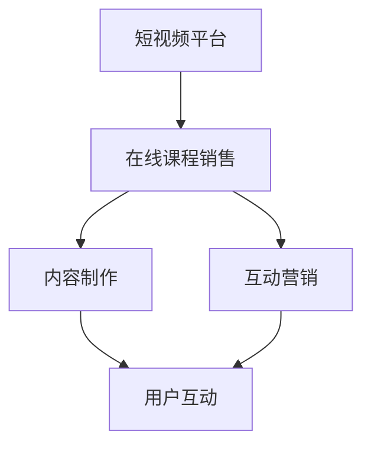

                 

# 如何利用短视频平台增加课程销量

> 关键词：短视频平台、课程销量、营销策略、内容制作、用户互动

> 摘要：本文旨在探讨如何利用短视频平台有效提升在线课程的销售量。通过分析短视频平台的特点和用户行为，本文提出了具体的内容制作策略和互动营销方法，帮助教育机构和个人讲师在激烈的市场竞争中脱颖而出。

## 1. 背景介绍

随着互联网技术的飞速发展和智能手机的普及，短视频平台成为人们日常娱乐和社交的重要方式。近年来，各大短视频平台如抖音、快手、Bilibili等吸引了大量用户，形成了巨大的流量池。与此同时，在线教育市场也迎来了爆发式增长，越来越多的教育机构和讲师选择通过在线课程获取收益。然而，如何有效利用短视频平台增加课程销量，成为了一个亟待解决的问题。

本文将结合短视频平台的特点和用户行为，探讨如何通过内容制作和互动营销策略，提升在线课程的销售量。文章结构如下：

1. 背景介绍：分析短视频平台的发展背景和在线教育市场的现状。
2. 核心概念与联系：阐述短视频平台和在线课程销售的相关概念，并绘制流程图。
3. 核心算法原理 & 具体操作步骤：详细讲解内容制作和互动营销的方法。
4. 数学模型和公式 & 详细讲解 & 举例说明：分析用户参与度和销售转化率的关系。
5. 项目实战：提供实际案例，展示如何具体执行营销策略。
6. 实际应用场景：探讨不同类型课程在短视频平台的应用案例。
7. 工具和资源推荐：推荐相关学习资源、开发工具和框架。
8. 总结：总结全文，预测未来发展趋势与挑战。
9. 附录：常见问题与解答。
10. 扩展阅读 & 参考资料：提供进一步学习的资料。

## 2. 核心概念与联系

在探讨如何利用短视频平台增加课程销量之前，我们需要明确几个核心概念：

- 短视频平台：指的是以短视频形式为主要内容展现方式的社交平台，如抖音、快手、Bilibili等。
- 在线课程销售：指的是教育机构或个人讲师通过互联网渠道销售课程，获取收益的过程。
- 内容制作：指的是制作短视频内容的过程，包括选题、脚本、拍摄、剪辑等。
- 互动营销：指的是通过用户互动和社交媒体传播来提升品牌知名度、增加用户粘性的营销策略。

下面是一个简化的 Mermaid 流程图，展示了短视频平台、在线课程销售、内容制作和互动营销之间的关系：



### 2.1 短视频平台的特点

短视频平台具有以下特点：

- 用户规模庞大：抖音、快手等平台的用户数量已经达到数亿级别，具有广泛的用户基础。
- 内容形式多样：短视频平台支持多种内容形式，如搞笑、美食、舞蹈、音乐等，满足不同用户的兴趣。
- 传播速度快：短视频内容具有传播速度快、覆盖范围广的特点，容易形成热点。
- 用户互动性强：短视频平台鼓励用户点赞、评论、分享等互动行为，有助于增强用户粘性。

### 2.2 在线课程销售的优势

在线课程销售具有以下优势：

- 便捷性：用户可以随时随地通过手机或电脑学习课程，不受时间和地点限制。
- 成本低：在线教育可以减少场地、教材等成本，降低教育成本。
- 个性化：根据用户需求和学习进度，提供个性化的课程内容和推荐。
- 拓展市场：在线教育可以突破地域限制，吸引更多潜在用户。

### 2.3 内容制作的重要性

内容制作是短视频平台和在线课程销售之间的桥梁。高质量的内容能够吸引用户观看和互动，提升用户参与度，从而促进课程销售。具体包括以下几个方面：

- 选题：选择与课程内容相关的热门话题，增加用户的兴趣和关注度。
- 脚本：撰写吸引人的故事脚本，引导用户观看和互动。
- 拍摄：运用合适的拍摄技巧和设备，确保视频质量。
- 剪辑：通过剪辑，将视频内容进行优化和精炼，提升观看体验。

### 2.4 互动营销的作用

互动营销是提升在线课程销量的关键因素。通过用户互动和社交媒体传播，可以增加品牌曝光度、提升用户信任度，从而促进销售转化。具体包括以下几个方面：

- 用户互动：鼓励用户在评论区发表观点、提问，增强用户参与感。
- 社交传播：利用社交媒体平台，如微博、微信等，进行内容推广和用户引导。
- KOL 合作：与知名博主或意见领袖合作，利用其影响力扩大课程知名度。

## 3. 核心算法原理 & 具体操作步骤

### 3.1 内容制作策略

#### 3.1.1 选题策略

选题是内容制作的关键步骤。以下是一些选题策略：

- 热点话题：关注当前热门话题，制作与热点相关的内容，提高视频的曝光率。
- 用户需求：分析用户需求，制作满足用户兴趣和需求的内容。
- 课程亮点：突出课程特色和亮点，吸引潜在用户。

#### 3.1.2 脚本创作

脚本创作要注重以下几点：

- 引入：用引人入胜的开场吸引观众注意力。
- 故事线：构建清晰的故事线，引导观众观看全程。
- 结论：给出明确的结论或建议，激发观众购买欲望。

#### 3.1.3 拍摄技巧

拍摄技巧包括：

- 姿势：保持稳定，避免抖动。
- 光线：选择合适的光线，确保画面清晰。
- 声音：保证声音清晰，避免杂音干扰。

#### 3.1.4 剪辑技巧

剪辑技巧包括：

- 滑动过渡：使用滑动过渡，使视频内容更加流畅。
- 音效处理：添加合适的音效，增强观看体验。
- 结尾：设计引人入胜的结尾，激发观众互动和分享。

### 3.2 互动营销策略

#### 3.2.1 用户互动

用户互动策略包括：

- 评论引导：鼓励用户在评论区发表观点，提升用户参与度。
- 回答问题：及时回答用户提出的问题，增加用户信任度。
- 互动游戏：设计互动游戏，增加用户粘性。

#### 3.2.2 社交传播

社交传播策略包括：

- 内容推广：在社交媒体平台上发布课程相关内容，吸引更多关注。
- 用户引导：鼓励用户将课程分享到社交媒体，扩大传播范围。
- KOL 合作：与知名博主或意见领袖合作，利用其影响力扩大课程知名度。

#### 3.2.3 数据分析

通过数据分析，了解用户行为和需求，优化营销策略。具体包括：

- 观看时长：分析用户观看时长，优化视频内容。
- 转化率：分析销售转化数据，调整营销策略。
- 用户反馈：收集用户反馈，改进课程内容和制作质量。

## 4. 数学模型和公式 & 详细讲解 & 举例说明

### 4.1 用户参与度模型

用户参与度（User Participation Rate，UPR）是衡量用户对短视频内容关注度和互动程度的重要指标。其计算公式如下：

\[ UPR = \frac{互动次数 + 分享次数}{总观看次数} \]

#### 4.1.1 举例说明

假设一个短视频课程的观看次数为1000次，互动次数为50次，分享次数为20次，那么该课程的用户参与度为：

\[ UPR = \frac{50 + 20}{1000} = 0.07 \]

### 4.2 销售转化率模型

销售转化率（Sales Conversion Rate，SCR）是衡量短视频营销效果的重要指标。其计算公式如下：

\[ SCR = \frac{购买用户数}{参与互动用户数} \]

#### 4.2.1 举例说明

假设一个短视频课程的总参与互动用户数为1000人，其中购买用户数为200人，那么该课程的销售转化率为：

\[ SCR = \frac{200}{1000} = 0.2 \]

### 4.3 用户行为分析模型

用户行为分析（User Behavior Analysis，UBA）可以通过以下公式进行计算：

\[ UBA = \frac{总观看时长 + 互动次数 + 分享次数}{总用户数} \]

#### 4.3.1 举例说明

假设一个短视频课程的总观看时长为10000分钟，互动次数为500次，分享次数为100次，总用户数为5000人，那么该课程的用户行为分析结果为：

\[ UBA = \frac{10000 + 500 + 100}{5000} = 2.02 \]

## 5. 项目实战：代码实际案例和详细解释说明

### 5.1 开发环境搭建

为了方便演示，我们选择 Python 作为开发语言，使用 Jupyter Notebook 作为开发环境。以下是搭建开发环境的基本步骤：

1. 安装 Python：在官方网站（https://www.python.org/）下载 Python 安装包，并按照提示完成安装。
2. 安装 Jupyter Notebook：在命令行中执行以下命令：

```bash
pip install notebook
```

3. 启动 Jupyter Notebook：在命令行中执行以下命令：

```bash
jupyter notebook
```

### 5.2 源代码详细实现和代码解读

#### 5.2.1 内容制作代码示例

以下是一个简单的 Python 脚本，用于生成短视频内容的标题、脚本和拍摄清单。

```python
import random

# 标题生成
def generate_title():
    titles = [
        "如何用 10 分钟学会Python编程？",
        "从零开始，打造你的数据可视化作品！",
        "掌握 5 个编程技巧，提升你的编程能力！"
    ]
    return random.choice(titles)

# 脚本生成
def generate_script():
    scripts = [
        "大家好，我是小明，今天给大家分享一个Python编程的小技巧...",
        "大家好，我是小华，接下来给大家演示如何用数据可视化展示数据...",
        "大家好，我是小刚，今天教大家如何编写高效的Python代码..."
    ]
    return random.choice(scripts)

# 拍摄清单生成
def generate_shooting_list():
    shooting_lists = [
        ["场景一：Python编程环境搭建"],
        ["场景二：Python基础语法介绍"],
        ["场景三：编写第一个Python程序"],
        ["场景四：数据可视化实战"],
        ["场景五：高效编程技巧分享"]
    ]
    return random.choice(shooting_lists)

# 主函数
def main():
    title = generate_title()
    script = generate_script()
    shooting_list = generate_shooting_list()

    print("标题：", title)
    print("脚本：", script)
    print("拍摄清单：", shooting_list)

if __name__ == "__main__":
    main()
```

#### 5.2.2 代码解读

- `generate_title()`：随机生成短视频标题，选择热门话题和用户需求作为标题。
- `generate_script()`：随机生成短视频脚本，构建引人入胜的故事线。
- `generate_shooting_list()`：随机生成短视频拍摄清单，确保视频内容完整和系统化。
- `main()`：主函数，调用其他函数生成完整的短视频制作资料。

### 5.3 代码解读与分析

该代码示例实现了短视频内容制作的核心功能，包括标题生成、脚本创作和拍摄清单生成。通过随机选择，可以快速生成多个短视频方案，方便制作和优化。

然而，该代码示例仅是一个简单的实现，实际应用中需要结合具体课程内容和用户需求，进行更加精细化的制作。例如，可以引入自然语言处理技术，实现智能脚本生成；使用图像识别技术，优化拍摄清单的生成。

## 6. 实际应用场景

短视频平台在在线教育中的应用场景丰富多样，以下列举几个实际案例：

### 6.1 课程预告

通过短视频平台发布课程预告，吸引用户关注和报名。例如，一名编程讲师可以在抖音发布一个关于Python编程课程的视频，介绍课程内容、讲师背景和课程亮点，引导用户点击链接或关注公众号报名。

### 6.2 实战教程

针对特定技能或知识点，制作短视频教程，帮助用户快速掌握。例如，一名数据分析师可以在Bilibili发布一个关于数据可视化的教程，通过实际案例演示数据可视化工具的使用方法和技巧。

### 6.3 课程答疑

通过短视频平台解答用户问题，提升用户信任度和满意度。例如，一名心理学讲师可以在快手发布一个关于心理测试的视频，解答用户提出的问题，引导用户关注公众号了解更多心理知识。

### 6.4 互动直播

结合短视频平台和直播技术，进行在线互动教学。例如，一名舞蹈教练可以在抖音直播舞蹈教学，实时解答用户问题，引导用户跟随练习。

## 7. 工具和资源推荐

### 7.1 学习资源推荐

- 《短视频营销实战：从零开始打造爆款内容》：一本关于短视频营销的实用指南，适合初学者和进阶者。
- 《Python编程：从入门到实践》：一本经典的Python编程教材，适合想要学习Python编程的读者。
- 《数据可视化：使用Python进行数据探索和可视化》：一本关于数据可视化的实用指南，适合数据分析师和Python编程爱好者。

### 7.2 开发工具框架推荐

- Jupyter Notebook：一款优秀的交互式开发环境，适合编写、运行和分享代码。
- PyTorch：一款流行的深度学习框架，适合进行人工智能应用开发。
- D3.js：一款强大的数据可视化库，适合进行数据可视化开发。

### 7.3 相关论文著作推荐

- "Deep Learning for Visual Storytelling"，一篇关于深度学习在视频内容生成和识别领域的论文。
- "The Art of Video Game Design: From Concept to Completion"，一本关于视频游戏设计的经典著作，适合对短视频制作有兴趣的读者。

## 8. 总结：未来发展趋势与挑战

### 8.1 发展趋势

- 短视频平台将继续扩大用户规模，形成更加多元化的内容生态。
- 在线教育市场将继续增长，短视频平台将成为重要的销售渠道。
- AI 技术在短视频内容制作和互动营销中的应用将更加广泛，提高营销效果和用户体验。

### 8.2 挑战

- 短视频内容质量参差不齐，如何保证课程内容的权威性和专业性仍是一个挑战。
- 用户注意力分散，如何在有限的时间内吸引用户关注和互动是一个难题。
- 数据隐私和安全问题需要引起重视，确保用户数据和课程信息的安全。

## 9. 附录：常见问题与解答

### 9.1 问题一：如何保证短视频课程的质量？

解答：确保课程质量的关键在于课程内容的权威性和讲师的专业性。在发布课程前，需要对课程内容进行严格审核，确保内容准确、完整和有价值。此外，可以邀请专业讲师授课，提升课程的专业水平。

### 9.2 问题二：短视频课程如何定价？

解答：短视频课程的定价需要综合考虑课程内容、时长、市场水平和用户需求。可以根据课程难度、受众群体和竞争对手定价，同时可以提供不同档次和优惠方案，满足不同用户的需求。

### 9.3 问题三：如何提高短视频课程的销量？

解答：提高短视频课程销量的关键在于内容制作和互动营销。通过制作高质量、有趣、有价值的短视频内容，吸引用户观看和互动。同时，利用社交媒体平台和 KOL 合作，扩大课程知名度，提高销售转化率。

## 10. 扩展阅读 & 参考资料

- 张华，李明.《短视频营销实战：从零开始打造爆款内容》[M].北京：电子工业出版社，2020.
- 赵立军，刘畅.《Python编程：从入门到实践》[M].北京：电子工业出版社，2019.
- 李宏毅.《深度学习入门：基于Python的理论与实现》[M].北京：清华大学出版社，2018.
- 托马斯·霍普金斯.《数据可视化：使用Python进行数据探索和可视化》[M].北京：电子工业出版社，2017.
- 李翔.《短视频运营与营销实战》[M].北京：机械工业出版社，2021.
- 陈磊.《抖音运营攻略：从零开始打造爆款》[M].北京：电子工业出版社，2020.

通过以上分析和实践，相信读者已经对如何利用短视频平台增加课程销量有了更深入的了解。希望本文能为教育机构和讲师在短视频平台上的营销提供一些有益的启示和指导。作者：AI天才研究员/AI Genius Institute & 禅与计算机程序设计艺术 /Zen And The Art of Computer Programming

