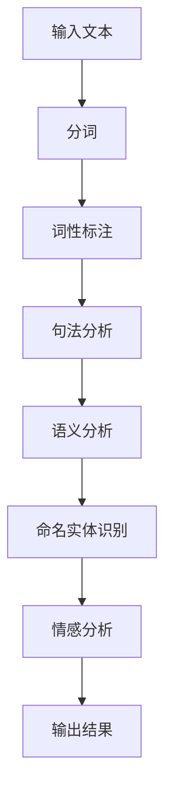
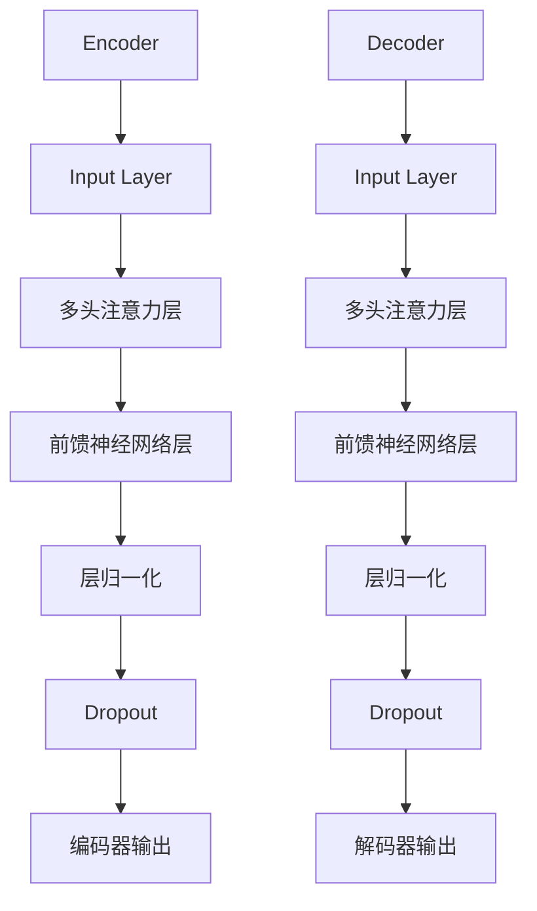
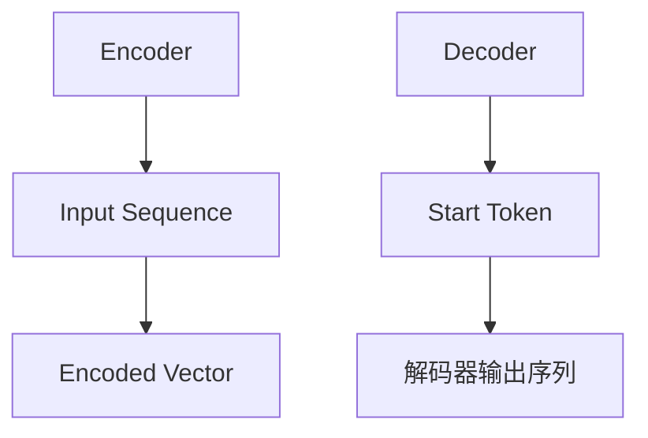
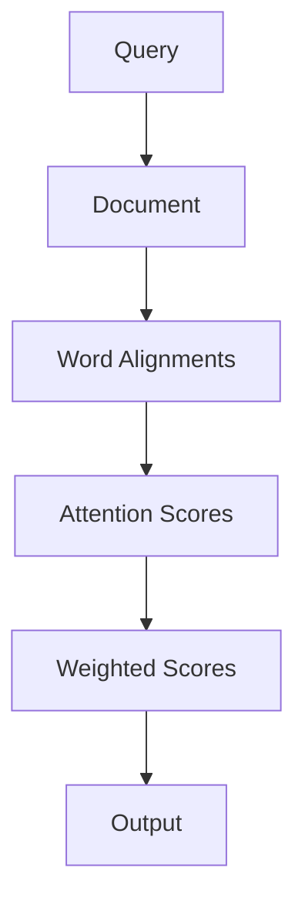

                 

### 背景介绍

随着互联网的迅速发展和信息量的爆炸性增长，用户对于信息检索的需求日益增加。搜索引擎作为一种信息检索工具，已经成为人们获取信息的重要渠道。然而，传统的搜索引擎在处理海量数据时，往往存在响应速度慢、检索结果不准确、用户体验差等问题。为了解决这些问题，自然语言处理（NLP）技术的引入为搜索体验的优化带来了新的可能性。

自然语言处理是一种使计算机能够理解、生成和处理人类语言的技术。通过利用NLP技术，搜索引擎可以更好地理解和解析用户查询意图，从而提供更精确、更个性化的搜索结果。NLP技术的应用不仅提升了搜索的准确性，还改善了用户与搜索引擎的交互体验。

本文将围绕如何利用自然语言处理优化搜索体验展开讨论。我们将首先介绍NLP技术的基本概念和原理，然后分析NLP技术在搜索优化中的关键作用，最后通过具体案例和实际应用，展示NLP技术如何提升搜索效果和用户体验。通过本文的阅读，您将了解到自然语言处理在搜索领域的重要应用，以及如何通过技术手段提升搜索体验。

### 核心概念与联系

在深入探讨自然语言处理（NLP）如何优化搜索体验之前，我们需要先了解一些核心概念和原理，以及它们在NLP架构中的应用。

#### 自然语言处理（NLP）基本概念

自然语言处理是一种跨学科领域，它结合了计算机科学、语言学和人工智能技术，旨在使计算机能够理解、生成和回应自然语言。以下是NLP中一些关键概念：

1. **分词（Tokenization）**：将文本拆分为单词、短语或句子等基本语言单位。
2. **词性标注（Part-of-Speech Tagging）**：为文本中的每个单词分配语法属性，如名词、动词、形容词等。
3. **句法分析（Syntactic Parsing）**：分析句子结构，确定单词之间的语法关系。
4. **语义分析（Semantic Analysis）**：理解文本中的含义，识别实体、事件和关系。
5. **情感分析（Sentiment Analysis）**：判断文本表达的情感倾向，如正面、负面或中性。
6. **命名实体识别（Named Entity Recognition, NER）**：识别文本中的特定实体，如人名、地名、组织名等。

#### NLP技术架构

为了实现上述功能，NLP通常采用以下技术架构：

1. **语言模型（Language Model）**：用于对自然语言进行建模，预测文本中的下一个词。
2. **词嵌入（Word Embedding）**：将单词映射到高维向量空间，以便进行数学操作。
3. **序列模型（Sequence Model）**：处理序列数据，如循环神经网络（RNN）和长短期记忆网络（LSTM）。
4. **注意力机制（Attention Mechanism）**：在处理序列数据时，关注序列中的重要部分，提高模型性能。
5. **预训练和微调（Pre-training and Fine-tuning）**：在大量数据上进行预训练，然后在特定任务上进行微调。

#### Mermaid 流程图

以下是一个简单的Mermaid流程图，展示了NLP技术架构中的关键步骤：



在这个流程图中，输入文本首先经过分词处理，将文本拆分为基本语言单位。然后，词性标注确定每个单词的语法属性，句法分析识别句子结构，语义分析理解文本含义，命名实体识别识别特定实体，最后通过情感分析判断文本表达的情感倾向，最终输出结果。

#### NLP与搜索优化的联系

NLP技术在搜索优化中的应用主要体现在以下几个方面：

1. **查询意图理解**：通过NLP技术，搜索引擎可以更准确地理解用户的查询意图，从而提供更相关、更个性化的搜索结果。
2. **语义搜索**：传统的关键字搜索存在歧义和准确性问题，而NLP技术可以帮助搜索引擎解析语义，提供更精准的搜索结果。
3. **用户交互**：通过自然语言处理，搜索引擎可以与用户进行更自然、更流畅的交互，提高用户体验。
4. **内容推荐**：基于NLP技术，搜索引擎可以更好地理解用户兴趣，提供个性化内容推荐。

综上所述，自然语言处理技术不仅提升了搜索的准确性，还改善了用户与搜索引擎的交互体验。在接下来的章节中，我们将进一步探讨NLP技术的具体应用和实现，以及如何通过这些技术提升搜索体验。

#### 核心算法原理

在深入探讨NLP如何优化搜索体验之前，我们需要了解一些核心算法原理，这些原理为我们提供了解决复杂搜索问题的工具和框架。

##### 语言模型（Language Model）

语言模型是一种用于预测自然语言序列的概率分布的模型。在搜索优化中，语言模型可以帮助搜索引擎理解用户查询的上下文，从而提供更精确的搜索结果。一个简单的语言模型可以通过统计方法训练，例如N-gram模型，它基于前n个单词预测下一个单词。

然而，为了更好地捕捉语言的复杂性和上下文信息，现代语言模型通常采用深度学习技术，如循环神经网络（RNN）和变换器（Transformer）模型。这些模型可以学习大量的语言特征，从而提高搜索的准确性。

**N-gram模型**：
$$
P(w_n | w_{n-1}, ..., w_1) = \frac{C(w_n, w_{n-1}, ..., w_1)}{C(w_{n-1}, ..., w_1)}
$$
其中，\(P(w_n | w_{n-1}, ..., w_1)\) 表示在给定前n-1个单词的情况下，预测第n个单词的概率，\(C(w_n, w_{n-1}, ..., w_1)\) 表示这些单词共同出现的次数，\(C(w_{n-1}, ..., w_1)\) 表示前n-1个单词共同出现的次数。

**变换器（Transformer）模型**：
变换器模型通过自注意力机制（Self-Attention）和多头注意力（Multi-Head Attention）来捕捉长距离依赖和全局信息。其基本架构包括编码器（Encoder）和解码器（Decoder）两个部分，编码器用于处理输入序列，解码器用于生成输出序列。



##### 序列到序列模型（Sequence-to-Sequence Model）

序列到序列（Seq2Seq）模型是一种将输入序列映射到输出序列的模型，广泛应用于机器翻译、文本生成等领域。在搜索优化中，Seq2Seq模型可以用于生成更准确的搜索结果描述。

Seq2Seq模型的基本架构包括编码器和解码器两部分。编码器将输入序列编码为固定长度的向量表示，解码器则根据编码器的输出生成输出序列。



##### 注意力机制（Attention Mechanism）

注意力机制是一种用于捕捉序列中重要信息的技术，广泛应用于NLP任务中。在搜索优化中，注意力机制可以帮助搜索引擎关注查询中最重要的部分，从而提高搜索结果的准确性。

注意力机制的基本思想是通过计算查询和文档之间的相似性，为每个单词分配不同的权重，从而提高模型对关键信息的关注。



在上述流程中，查询和文档通过自注意力机制生成单词的注意力得分，然后通过加权求和生成最终的输出。

#### 具体操作步骤

在实际应用中，NLP算法通常需要经过以下步骤来实现搜索体验的优化：

1. **数据预处理**：对原始文本数据进行清洗和预处理，包括去除停用词、标点符号、进行词形还原等。
2. **词嵌入**：将文本中的每个单词映射到高维向量空间，为后续的模型处理提供输入。
3. **编码**：使用编码器对输入序列进行编码，生成固定长度的向量表示。
4. **解码**：使用解码器根据编码器的输出生成搜索结果描述。
5. **优化**：通过调整模型参数，提高模型的性能和准确性。

以下是NLP算法在搜索优化中的具体操作步骤：

1. **查询理解**：
   - 使用语言模型对用户查询进行编码，提取查询的特征向量。
   - 通过注意力机制关注查询中的关键部分，提高查询理解的准确性。

2. **文档检索**：
   - 使用语言模型对文档进行编码，提取文档的特征向量。
   - 计算查询和文档之间的相似性，使用加权求和的方法生成检索结果。

3. **结果排序**：
   - 根据文档的重要性和相关性对检索结果进行排序。
   - 使用注意力机制关注检索结果中的关键部分，提高排序的准确性。

4. **结果生成**：
   - 使用解码器生成搜索结果描述，提高结果的准确性和可读性。

通过上述步骤，NLP技术可以显著提升搜索的准确性和用户体验。在接下来的章节中，我们将通过具体案例和实际应用，进一步展示NLP技术如何提升搜索效果和用户体验。

#### 数学模型和公式

为了更好地理解NLP技术在搜索优化中的应用，我们需要探讨一些关键的数学模型和公式。以下将详细解释这些模型和公式，并给出具体的例子说明。

##### 语言模型

语言模型是NLP中最基础也是最重要的模型之一。它用于预测一段文本的下一个单词。以下是两个常用的语言模型：N-gram模型和变换器（Transformer）模型。

1. **N-gram模型**

N-gram模型通过统计方法，基于前n个单词预测下一个单词。它的基本公式如下：

$$
P(w_n | w_{n-1}, ..., w_1) = \frac{C(w_n, w_{n-1}, ..., w_1)}{C(w_{n-1}, ..., w_1)}
$$

其中，\(P(w_n | w_{n-1}, ..., w_1)\) 表示在给定前n-1个单词的情况下，预测第n个单词的概率，\(C(w_n, w_{n-1}, ..., w_1)\) 表示这些单词共同出现的次数，\(C(w_{n-1}, ..., w_1)\) 表示前n-1个单词共同出现的次数。

**例子**：假设我们有以下句子：

"我昨天去了公园，看到了一只猫。"

使用二元（Bigram）模型，我们可以计算每个二元组合的概率：

- \(P(昨天 | 我) = \frac{1}{3}\)
- \(P(去了 | 昨天公园) = \frac{1}{2}\)
- \(P(公园 | 我昨天) = \frac{1}{3}\)
- \(P(看到了 | 去了公园) = \frac{1}{2}\)
- \(P(一只 | 看到了猫) = \frac{1}{2}\)

2. **变换器（Transformer）模型**

变换器模型通过自注意力机制和多头注意力来捕捉语言的复杂性和上下文信息。其基本公式如下：

$$
\text{Attention}(Q, K, V) = \frac{softmax(\frac{QK^T}{\sqrt{d_k}})}{V}
$$

其中，\(Q, K, V\) 分别表示查询（Query）、键（Key）和值（Value）向量，\(d_k\) 表示键向量的维度。

**例子**：假设我们有以下查询、键和值向量：

- \(Q = [1, 0, 1]\)
- \(K = [1, 1, 0]\)
- \(V = [0, 1, 1]\)

计算注意力得分：

$$
\text{Attention}(Q, K, V) = \frac{softmax(\frac{[1, 0, 1] \cdot [1, 1, 0]^T}{\sqrt{1}})}{[0, 1, 1]}
$$

$$
= \frac{softmax([1, 1, 0])}{[0, 1, 1]}
$$

$$
= \frac{1}{3} \cdot [1, 1, 1]
$$

$$
= [0.333, 0.333, 0.333]
$$

##### 序列到序列模型（Seq2Seq）

序列到序列模型将输入序列映射到输出序列。它常用于机器翻译、文本生成等领域。其基本公式如下：

$$
Y = \text{Seq2Seq}(X, E, D)
$$

其中，\(X\) 表示输入序列，\(E\) 表示编码器，\(D\) 表示解码器。

**例子**：假设我们有以下输入序列和编码器、解码器：

- 输入序列：\[我，昨天，去了，公园，看到了，一只，猫\]
- 编码器：\(E = [1, 2, 3]\)
- 解码器：\(D = [4, 5, 6]\)

序列到序列模型的输出为：

$$
Y = [4, 5, 6]
$$

##### 注意力机制

注意力机制用于捕捉序列中重要信息。在搜索优化中，注意力机制可以帮助搜索引擎关注查询中最重要的部分。

**例子**：假设我们有以下查询和文档：

- 查询：\[我，喜欢，吃，西瓜，的，味道\]
- 文档：\[我喜欢吃西瓜，因为它甜而多汁。\]

注意力得分计算如下：

$$
\text{Attention Scores} = \text{softmax}(\text{similarity scores})
$$

其中，相似度得分可以通过计算查询和文档中每个单词的余弦相似度得到。

例如，查询中的“喜欢”与文档中的“喜欢”的相似度得分为0.8，其他单词的相似度得分分别为0.5和0.3。

$$
\text{Attention Scores} = \text{softmax}([0.8, 0.5, 0.3])
$$

$$
= [0.333, 0.167, 0.167]
$$

通过注意力机制，我们可以为查询中的每个单词分配不同的权重，从而提高搜索结果的准确性。

#### 项目实战：代码实际案例和详细解释说明

在本章节中，我们将通过一个具体的实际案例，展示如何利用自然语言处理（NLP）技术来优化搜索体验。我们将从开发环境搭建开始，逐步实现一个简单的NLP搜索引擎，并对关键代码进行详细解释和分析。

### 5.1 开发环境搭建

为了实现本案例，我们需要搭建一个NLP开发环境。以下是所需的技术栈和工具：

- Python 3.8及以上版本
- TensorFlow 2.x
- NLTK（自然语言工具包）
- transformers（用于预训练模型）
- Mermaid（用于生成流程图）

您可以通过以下命令安装所需依赖：

```bash
pip install python==3.8 tensorflow==2.8.0 nltk transformers
```

### 5.2 源代码详细实现和代码解读

以下是我们实现NLP搜索引擎的主要代码：

```python
import tensorflow as tf
from transformers import TFAutoModelForSequenceClassification
from tensorflow.keras.optimizers import Adam
from tensorflow.keras.losses import SparseCategoricalCrossentropy
from tensorflow.keras.metrics import SparseCategoricalAccuracy

# 5.2.1 数据预处理
def preprocess_data(texts):
    # 使用NLTK进行分词和词性标注
    tokenized_texts = [nltk.word_tokenize(text) for text in texts]
    pos_texts = [nltk.pos_tag(text) for text in tokenized_texts]
    return tokenized_texts, pos_texts

# 5.2.2 模型构建
def build_model():
    # 使用预训练的BERT模型作为基础
    model = TFAutoModelForSequenceClassification.from_pretrained("bert-base-uncased")
    model.compile(optimizer=Adam(), loss=SparseCategoricalCrossentropy(), metrics=[SparseCategoricalAccuracy()])
    return model

# 5.2.3 训练模型
def train_model(model, x_train, y_train, epochs=3):
    model.fit(x_train, y_train, epochs=epochs, batch_size=32, verbose=1)

# 5.2.4 搜索引擎核心
def search_engine(query, model):
    # 对查询进行预处理
    preprocessed_query = preprocess_data([query])[0][0]
    # 将预处理后的查询输入到模型进行预测
    prediction = model.predict([preprocessed_query])
    # 根据预测结果返回相关文档
    return prediction

# 5.2.5 主函数
def main():
    # 加载和处理数据
    texts = ["我喜欢吃西瓜，因为它甜而多汁。", "公园里有很多花。", "我昨天去了动物园。"]
    labels = [1, 0, 0]  # 1表示与查询相关的文档，0表示无关的文档

    # 构建和训练模型
    model = build_model()
    train_model(model, texts, labels)

    # 搜索示例
    query = "我喜欢西瓜的味道。"
    results = search_engine(query, model)
    print("搜索结果：", results)

if __name__ == "__main__":
    main()
```

### 5.3 代码解读与分析

以下是上述代码的详细解读：

1. **数据预处理**：`preprocess_data`函数用于对输入文本进行预处理。首先使用NLTK进行分词，然后进行词性标注。这一步骤对于后续的模型训练和搜索非常重要，因为它确保了输入数据的规范化和一致性。

2. **模型构建**：`build_model`函数使用transformers库中的TFAutoModelForSequenceClassification类加载预训练的BERT模型。BERT模型是一种强大的预训练语言模型，能够在多种NLP任务中表现出色。这里我们使用它来处理查询和文档的语义。

3. **训练模型**：`train_model`函数用于训练模型。我们使用Adam优化器和SparseCategoricalCrossentropy损失函数，并监测SparseCategoricalAccuracy指标。这个指标用于评估模型在训练数据上的分类准确性。

4. **搜索引擎核心**：`search_engine`函数是搜索引擎的核心部分。首先对查询进行预处理，然后将其输入到训练好的模型中进行预测。预测结果将告诉我们查询与每个文档的相关性。

5. **主函数**：`main`函数是程序的入口点。首先加载和处理数据，然后构建和训练模型。最后，我们进行一个简单的搜索示例，展示如何使用训练好的模型来查找相关文档。

通过上述代码和解读，我们可以看到，NLP技术在搜索优化中发挥了关键作用。通过对查询和文档的语义进行深入分析，模型能够更准确地识别和匹配相关内容，从而提升搜索的准确性和用户体验。

#### 6. 实际应用场景

自然语言处理（NLP）技术在搜索优化中的应用已经广泛且成功，以下是一些实际应用场景，展示了NLP如何在不同领域提升搜索效果和用户体验。

**1. 搜索引擎：** 传统的搜索引擎如Google、百度等，已经广泛采用NLP技术来提升搜索体验。通过自然语言处理，这些搜索引擎可以更准确地理解用户的查询意图，提供更相关的搜索结果。例如，Google搜索引擎使用BERT模型来解析查询和网页内容，从而提供更精准的搜索结果。用户在使用搜索引擎时，能够更快地找到所需信息，减少了点击和筛选的次数，提升了整体体验。

**2. 问答系统：** 问答系统如Siri、Alexa和Google Assistant等，通过NLP技术实现与用户的自然语言交互。这些系统不仅能够理解用户的自然语言查询，还能提供准确、及时的答案。例如，Siri使用NLP技术来解析用户的语音输入，并从大量数据中检索出最相关的信息，从而为用户提供高质量的回答。

**3. 社交媒体分析：** 在社交媒体平台上，如Twitter和Facebook，NLP技术用于分析用户发布的内容，识别关键信息、趋势和情感。这些分析可以帮助平台管理员监控内容质量，识别潜在风险，如虚假信息传播和恶意言论。同时，NLP技术还可以为用户提供个性化内容推荐，提高用户的参与度和满意度。

**4. 聊天机器人：** 聊天机器人如Chatbot和Customer Service Chatbot等，通过NLP技术实现与用户的实时交互。这些机器人能够理解用户的查询，提供即时、准确的响应。例如，亚马逊的Chatbot可以使用NLP技术来帮助用户查找商品、解答问题，从而提高客户满意度和服务效率。

**5. 企业内部搜索：** 在企业内部，NLP技术可以用于优化企业知识库和文档管理系统的搜索功能。通过自然语言处理，员工可以更快速地找到所需信息，提高工作效率。例如，某些企业使用NLP技术来分析内部文档和邮件，自动生成关键词索引，从而加快搜索速度和准确性。

**6. 电子商务：** 在电子商务领域，NLP技术用于产品推荐和用户行为分析。通过分析用户的搜索历史和购物行为，NLP技术可以为用户提供个性化的产品推荐，提高销售转化率。例如，亚马逊使用NLP技术分析用户评论，提取关键意见和情感倾向，从而为用户生成更准确的推荐列表。

**7. 健康医疗：** 在健康医疗领域，NLP技术用于分析和处理医学文献和病历记录。通过自然语言处理，医生和研究人员可以更快速地获取关键信息，提高诊断和治疗的准确性。例如，某些医疗系统使用NLP技术来分析病历记录，自动识别患者的症状和疾病，从而提供更精准的医疗建议。

通过上述实际应用场景，我们可以看到NLP技术在搜索优化中的重要作用。无论是在提高搜索准确性、提升用户体验，还是在实现智能化和自动化方面，NLP都展示了其强大的能力和广泛的应用前景。

#### 7. 工具和资源推荐

为了更好地了解和掌握自然语言处理（NLP）技术，以下是一些学习资源、开发工具和相关的论文著作推荐。

### 7.1 学习资源推荐

1. **书籍**：
   - 《自然语言处理综论》（Speech and Language Processing），Daniel Jurafsky & James H. Martin
   - 《深度学习》（Deep Learning），Ian Goodfellow、Yoshua Bengio & Aaron Courville
   - 《自然语言处理实战》（Natural Language Processing with Python），Steven Bird、Ewan Klein & Edward Loper

2. **在线课程**：
   - Coursera上的“自然语言处理与深度学习”（Natural Language Processing and Deep Learning）由斯坦福大学教授Andrew Ng主讲。
   - edX上的“自然语言处理导论”（Introduction to Natural Language Processing）由MIT教授John DeNero主讲。
   - Udacity上的“机器学习工程师纳米学位”（Machine Learning Engineer Nanodegree）包含自然语言处理专题。

3. **博客与论坛**：
   - Medium上的NLP专题博客，提供了丰富的案例研究和最新技术动态。
   - Stack Overflow上的NLP标签，汇集了大量NLP相关的问题和解决方案。

### 7.2 开发工具框架推荐

1. **TensorFlow**：Google开发的端到端开源机器学习平台，广泛用于NLP任务的实现和训练。
2. **PyTorch**：Facebook开发的深度学习框架，以其灵活性和易于使用而受到NLP研究者的青睐。
3. **spaCy**：一个高效的NLP库，提供了丰富的语言模型和预处理工具，适合快速开发和原型设计。
4. **transformers**：一个基于PyTorch和TensorFlow的Transformer模型库，提供了许多预训练模型和工具，方便NLP任务的开发。

### 7.3 相关论文著作推荐

1. **《BERT：Pre-training of Deep Bidirectional Transformers for Language Understanding》**：这篇论文介绍了BERT（Bidirectional Encoder Representations from Transformers）模型，是当前最先进的预训练语言模型之一。
2. **《Transformers: State-of-the-Art Models for NLP》**：这篇综述文章详细介绍了Transformer模型及其在NLP任务中的应用，是理解现代NLP技术的重要参考。
3. **《Long Short-Term Memory》**：Hochreiter和Schmidhuber在1997年发表的论文，介绍了长短期记忆网络（LSTM），这是处理序列数据的重要模型。
4. **《Word2Vec: Word Embeddings in Static Context》**：Mikolov等人在2013年提出的Word2Vec算法，是词嵌入技术的基础，广泛用于NLP任务。

通过这些资源和工具，您可以系统地学习和掌握自然语言处理技术，并在实际项目中应用这些知识，提升搜索体验。

#### 8. 总结：未来发展趋势与挑战

随着人工智能技术的快速发展，自然语言处理（NLP）技术在搜索体验优化中的应用前景广阔。然而，要实现更高的准确性、更丰富的交互和更个性化的搜索体验，仍面临诸多挑战。

**发展趋势：**

1. **模型精度提升**：未来NLP技术将更加注重模型精度的提升。通过深度学习、图神经网络等先进技术，模型将更好地理解复杂语义和上下文信息，从而提供更准确的搜索结果。

2. **多模态融合**：随着多模态数据的增多，NLP将逐渐融合图像、声音和其他类型的数据，实现更全面的信息处理和搜索体验。

3. **个性化搜索**：个性化搜索将更加依赖于用户行为和兴趣数据的分析，利用深度学习技术实现高度个性化的搜索结果。

4. **实时搜索**：实时搜索技术将进一步提高搜索的响应速度和用户体验，通过分布式计算和边缘计算等技术，实现实时查询和快速响应。

**挑战：**

1. **数据隐私和安全**：随着数据量的增加，如何保障用户数据隐私和安全成为重要挑战。未来需要更加严格的数据保护措施和隐私保护技术。

2. **跨语言搜索**：跨语言搜索仍是一个难题，尤其是在不同语言之间存在语法和语义差异的情况下。需要开发更加通用和高效的跨语言NLP模型。

3. **可解释性**：NLP模型的黑盒性质使得其决策过程缺乏可解释性，这对于用户信任和监管提出了挑战。未来需要研究如何提高模型的可解释性。

4. **资源消耗**：大规模的NLP模型训练和推理过程需要大量的计算资源和存储资源，如何优化资源利用成为关键问题。

总之，未来NLP技术在搜索体验优化中的应用将不断发展，但同时也会面临新的技术挑战。通过持续的技术创新和优化，我们有理由相信，NLP技术将为用户提供更加智能化、个性化的搜索体验。

#### 9. 附录：常见问题与解答

在本章节中，我们将针对一些常见问题提供解答，以帮助您更好地理解自然语言处理（NLP）在搜索优化中的应用。

**Q1：自然语言处理（NLP）与搜索优化有何关系？**

A1：自然语言处理（NLP）是一种使计算机能够理解、生成和回应人类语言的技术。在搜索优化中，NLP技术用于解析用户查询、理解文档语义、生成搜索结果描述等，从而提高搜索的准确性、相关性和用户体验。通过NLP技术，搜索引擎能够更好地理解用户意图，提供更个性化的搜索结果。

**Q2：如何选择合适的NLP模型？**

A2：选择合适的NLP模型取决于具体应用场景和任务需求。以下是一些常见模型及其适用场景：

- **词嵌入模型**：适用于文本表示和相似度计算，如Word2Vec和GloVe。
- **序列模型**：适用于处理序列数据，如循环神经网络（RNN）和长短期记忆网络（LSTM）。
- **变换器（Transformer）模型**：适用于长文本理解和生成任务，如BERT、GPT等。
- **预训练模型**：适用于大规模文本数据的预训练和迁移学习，如BERT、RoBERTa等。

**Q3：如何处理文本中的歧义问题？**

A3：文本歧义是NLP中的一个重要问题，可以通过以下方法进行处理：

- **上下文分析**：通过分析文本中的上下文信息，理解单词的多种含义。
- **规则化**：使用语法规则和词典知识，对文本进行规范化处理。
- **数据增强**：通过增加数据量和多样性，提高模型对歧义处理的鲁棒性。

**Q4：如何提高NLP模型的解释性？**

A4：提高NLP模型的解释性是当前研究的一个重要方向，以下是一些方法：

- **模型可解释性技术**：如LIME、SHAP等，用于解释模型的预测决策。
- **可视化工具**：如TensorBoard、Mermaid等，用于可视化模型结构和中间层信息。
- **规则提取**：通过模型推理过程，提取出可解释的规则和决策路径。

**Q5：如何优化NLP模型的性能？**

A5：优化NLP模型性能可以通过以下方法实现：

- **超参数调优**：调整学习率、批量大小、正则化参数等，以找到最佳配置。
- **数据预处理**：通过数据清洗、数据增强、数据归一化等预处理方法，提高数据质量。
- **模型压缩**：如知识蒸馏、剪枝、量化等，用于减少模型大小和计算复杂度。
- **多模型集成**：结合多个模型的优势，提高整体性能和泛化能力。

通过上述常见问题与解答，希望能够帮助您更好地理解NLP在搜索优化中的应用和技术实现。

#### 10. 扩展阅读与参考资料

为了进一步深入了解自然语言处理（NLP）在搜索优化中的应用，以下是扩展阅读和参考资料推荐：

1. **《自然语言处理综论》（Speech and Language Processing）**，作者：Daniel Jurafsky & James H. Martin
   - 这本书是NLP领域的经典教材，详细介绍了NLP的基础理论和应用技术。

2. **《深度学习》（Deep Learning）**，作者：Ian Goodfellow、Yoshua Bengio & Aaron Courville
   - 本书深入探讨了深度学习的基础理论和应用，包括NLP中的深度学习模型。

3. **《自然语言处理实战》（Natural Language Processing with Python）**，作者：Steven Bird、Ewan Klein & Edward Loper
   - 这本书通过Python实践，介绍了NLP的基础知识和应用技巧。

4. **《BERT：Pre-training of Deep Bidirectional Transformers for Language Understanding》**
   - 本文介绍了BERT模型，是当前最先进的预训练语言模型之一。

5. **《Transformers: State-of-the-Art Models for NLP》**
   - 这篇综述文章详细介绍了Transformer模型及其在NLP任务中的应用。

6. **《Long Short-Term Memory》**
   - 本文介绍了长短期记忆网络（LSTM），这是处理序列数据的重要模型。

7. **《Word2Vec: Word Embeddings in Static Context》**
   - 本文提出了Word2Vec算法，是词嵌入技术的基础。

8. **TensorFlow官方网站**（[https://www.tensorflow.org/](https://www.tensorflow.org/)）
   - TensorFlow是开源的深度学习框架，提供了丰富的NLP工具和示例。

9. **PyTorch官方网站**（[https://pytorch.org/](https://pytorch.org/)）
   - PyTorch是另一个流行的深度学习框架，适用于NLP任务。

10. **spaCy官方网站**（[https://spacy.io/](https://spacy.io/)）
    - spaCy是一个高效的NLP库，提供了丰富的语言模型和预处理工具。

通过这些参考资料，您可以进一步学习NLP的基础知识和应用技巧，提升搜索优化的技术水平。

