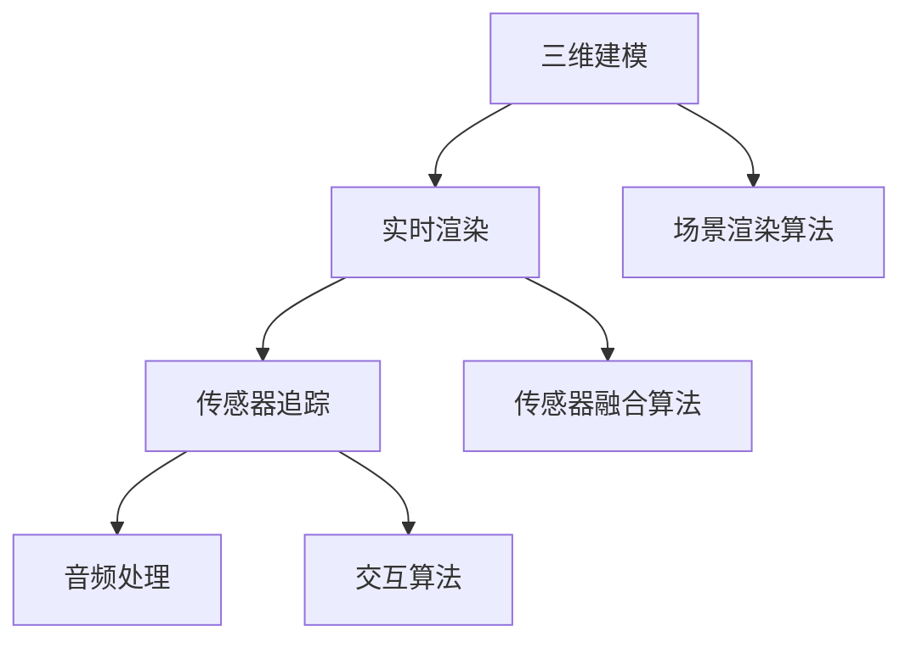

                 

# 如何利用虚拟现实技术打造虚实结合的创新消费体验

## 摘要

本文将探讨虚拟现实（VR）技术在构建虚实结合消费体验方面的应用。通过分析VR技术的基本原理和核心算法，本文将介绍如何利用VR技术实现产品展示、在线购物、娱乐体验等多个消费场景。同时，本文还将结合实际项目案例，深入剖析虚拟现实在商业领域的创新应用，探讨未来的发展趋势和面临的挑战。希望通过本文，能够为读者提供一个全面、深入的虚拟现实技术应用指南。

## 1. 背景介绍

### 1.1 虚拟现实技术的发展历程

虚拟现实（VR）技术起源于20世纪60年代的美国，最初主要用于军事和科学研究领域。随着计算机技术和图形处理能力的不断提升，VR技术逐渐从实验室走向市场，成为众多行业的重要技术支撑。1990年代，VR设备开始面向消费者市场，但受限于技术水平和硬件成本，未能得到广泛推广。进入21世纪，随着高性能图形处理器、快速网络和先进传感器技术的快速发展，VR技术逐渐成熟，开始广泛应用于娱乐、医疗、教育、设计等多个领域。

### 1.2 虚实结合的消费体验需求

在当前科技迅猛发展的时代，消费者对消费体验的需求日益多元化。传统的线下购物和线上购物方式已经无法满足消费者对于沉浸式、互动性、个性化体验的追求。虚实结合的消费体验能够为消费者提供一种全新的消费方式，使消费者能够在虚拟环境中体验到现实世界的购物、娱乐等活动，从而提升消费体验和满意度。因此，研究如何利用虚拟现实技术打造虚实结合的创新消费体验具有重要的现实意义。

## 2. 核心概念与联系

### 2.1 虚拟现实技术的基本原理

虚拟现实技术通过创建一个模拟的三维环境，使用户在视觉、听觉、触觉等多个感官上感受到沉浸式的体验。虚拟现实技术主要包括以下几个方面：

- **三维建模**：利用计算机图形学技术创建三维模型，为虚拟现实环境提供基础。
- **实时渲染**：通过图形处理器（GPU）实时渲染三维场景，实现高质量的视觉体验。
- **传感器追踪**：利用传感器技术追踪用户的头部、手部等动作，实现与虚拟环境的交互。
- **音频处理**：通过音频处理技术实现虚拟环境中的音效，增强沉浸感。

### 2.2 核心算法原理

虚拟现实技术中的核心算法主要包括：

- **场景渲染算法**：负责实时渲染三维场景，包括光照、阴影、纹理等处理。
- **传感器融合算法**：将多种传感器数据融合，提高动作追踪的准确性。
- **交互算法**：实现用户与虚拟环境的交互，包括手势识别、语音识别等。

### 2.3 Mermaid 流程图



## 3. 核心算法原理 & 具体操作步骤

### 3.1 场景渲染算法

场景渲染算法是虚拟现实技术的核心，它负责将三维模型实时渲染成用户所能看到的图像。具体操作步骤如下：

1. **模型加载**：从三维建模工具中导入三维模型，并将其加载到虚拟现实系统中。
2. **场景构建**：根据三维模型构建虚拟现实场景，包括背景、光照、阴影等。
3. **渲染管线**：使用图形处理器（GPU）进行渲染，包括顶点处理、光照计算、纹理映射等。
4. **输出显示**：将渲染结果输出到用户屏幕，实现实时渲染。

### 3.2 传感器融合算法

传感器融合算法是虚拟现实技术中提高动作追踪准确性的关键。具体操作步骤如下：

1. **数据采集**：从多个传感器（如头部跟踪器、手部跟踪器等）采集数据。
2. **数据预处理**：对采集到的数据进行去噪、平滑等预处理，提高数据质量。
3. **特征提取**：从预处理后的数据中提取特征，如关节角度、速度等。
4. **融合算法**：使用滤波、优化等算法对提取的特征进行融合，提高动作追踪的准确性。

### 3.3 交互算法

交互算法是实现用户与虚拟环境交互的核心。具体操作步骤如下：

1. **手势识别**：使用计算机视觉技术对用户的手部动作进行识别。
2. **语音识别**：使用语音识别技术对用户的语音指令进行识别。
3. **反馈机制**：根据用户的交互行为，对虚拟环境进行实时反馈，如声音、视觉等。
4. **交互优化**：根据用户反馈，对交互算法进行优化，提高用户体验。

## 4. 数学模型和公式 & 详细讲解 & 举例说明

### 4.1 场景渲染算法的数学模型

场景渲染算法中的关键数学模型包括：

- **三维坐标系变换**：将三维模型从局部坐标系转换为世界坐标系。
- **透视投影**：将三维场景投影到二维屏幕上，实现视觉上的远近关系。
- **光照模型**：计算场景中的光照效果，包括点光源、聚光源等。

具体公式如下：

$$
P = M \times V \times P_{world}
$$

其中，$P$ 表示投影后的坐标，$M$ 表示透视变换矩阵，$V$ 表示视图变换矩阵，$P_{world}$ 表示世界坐标系下的坐标。

### 4.2 传感器融合算法的数学模型

传感器融合算法中的关键数学模型包括：

- **卡尔曼滤波**：对传感器数据进行预测和校正，提高数据质量。
- **贝叶斯滤波**：基于概率模型对传感器数据进行融合，提高动作追踪的准确性。

具体公式如下：

$$
x_{predict} = A \times x_{last} + B \times u
$$

$$
P_{predict} = A \times P_{last} \times A^T + Q
$$

$$
K = P_{predict} \times H^T \times (H \times P_{predict} \times H^T + R)^{-1}
$$

$$
x_{correct} = x_{predict} + K \times (z - H \times x_{predict})
$$

$$
P_{correct} = (I - K \times H) \times P_{predict}
$$

其中，$x$ 表示预测值，$P$ 表示误差协方差矩阵，$A$ 表示状态转移矩阵，$B$ 表示控制输入矩阵，$u$ 表示控制输入，$H$ 表示观测矩阵，$z$ 表示观测值，$Q$ 表示过程噪声协方差矩阵，$R$ 表示观测噪声协方差矩阵。

### 4.3 举例说明

假设有一个虚拟现实场景，包含一个立方体和一个球体。立方体的位置为$(1, 2, 3)$，球体的位置为$(4, 5, 6)$。需要计算这两个物体在屏幕上的投影坐标。

1. **三维坐标系变换**：

   首先，将立方体和球体的位置从局部坐标系转换为世界坐标系：

   $$ 
   P_{cube} = M_{local} \times P_{local} 
   $$

   $$ 
   P_{sphere} = M_{local} \times P_{local} 
   $$

   其中，$M_{local}$ 表示局部坐标系到世界坐标系的变换矩阵，$P_{local}$ 表示局部坐标系下的坐标。

2. **透视投影**：

   然后，使用透视投影公式将世界坐标系下的坐标投影到二维屏幕上：

   $$ 
   P_{screen} = M_{projection} \times P_{world}
   $$

   其中，$M_{projection}$ 表示透视变换矩阵，$P_{world}$ 表示世界坐标系下的坐标。

3. **输出显示**：

   最后，将投影结果输出到屏幕上，显示立方体和球体的位置。

## 5. 项目实战：代码实际案例和详细解释说明

### 5.1 开发环境搭建

为了实现虚拟现实技术在消费体验中的应用，我们需要搭建一个适合的开发环境。以下是搭建开发环境的具体步骤：

1. **安装虚拟现实开发平台**：选择一款适合虚拟现实开发的平台，如Unity、Unreal Engine等。
2. **安装图形处理器（GPU）驱动**：确保GPU驱动与开发平台兼容，并支持VR功能。
3. **安装传感器驱动**：安装适用于虚拟现实设备的传感器驱动程序，如头戴显示器（HMD）、手部跟踪器等。
4. **配置开发环境**：根据开发平台的要求，配置开发环境，包括编辑器、插件等。

### 5.2 源代码详细实现和代码解读

以下是一个简单的虚拟现实项目示例，实现了一个包含立方体和球体的虚拟场景，并实现了用户与场景的交互。

```csharp
using UnityEngine;

public class VRScene : MonoBehaviour
{
    public GameObject cube;
    public GameObject sphere;

    private void Start()
    {
        // 初始化场景
        InitializeScene();
    }

    private void Update()
    {
        // 更新场景
        UpdateScene();
    }

    private void InitializeScene()
    {
        // 创建立方体和球体
        cube = GameObject.CreatePrimitive(PrimitiveType.Cube);
        sphere = GameObject.CreatePrimitive(PrimitiveType.Sphere);

        // 设置立方体和球体的位置
        cube.transform.position = new Vector3(1, 2, 3);
        sphere.transform.position = new Vector3(4, 5, 6);
    }

    private void UpdateScene()
    {
        // 获取用户输入
        float horizontal = Input.GetAxis("Horizontal");
        float vertical = Input.GetAxis("Vertical");

        // 更新立方体和球体的位置
        cube.transform.position += new Vector3(horizontal, 0, vertical);
        sphere.transform.position += new Vector3(horizontal, 0, vertical);
    }
}
```

### 5.3 代码解读与分析

上述代码实现了以下功能：

1. **初始化场景**：创建了一个立方体和一个球体，并设置了它们的位置。
2. **更新场景**：根据用户输入，更新立方体和球体的位置。

代码中使用了Unity引擎提供的API进行场景创建和更新。其中，`GameObject.CreatePrimitive`方法用于创建三维模型，`transform.position`属性用于设置模型的位置。

用户输入通过`Input.GetAxis`方法获取，该方法返回一个介于-1和1之间的浮点数，代表用户的输入方向。通过更新模型的位置，实现了用户与场景的交互。

## 6. 实际应用场景

### 6.1 产品展示

虚拟现实技术可以用于产品展示，使消费者在虚拟环境中直观地了解产品的外观、功能和使用方法。通过360度全景展示、交互式操作等方式，提升消费者的购物体验。

### 6.2 在线购物

虚拟现实技术可以构建一个线上购物平台，消费者可以在虚拟环境中浏览商品、试穿衣物、试吃美食等，实现线下购物般的体验。同时，虚拟现实技术还可以实现个性化推荐，提高消费者的购买满意度。

### 6.3 娱乐体验

虚拟现实技术可以用于娱乐领域，如虚拟游戏、虚拟演唱会等。通过沉浸式体验，使消费者在虚拟环境中获得身临其境的感觉，提升娱乐效果。

## 7. 工具和资源推荐

### 7.1 学习资源推荐

- **书籍**：《虚拟现实技术基础》、《Unity 2020 VR编程实战》
- **论文**：Google Scholar、IEEE Xplore等学术数据库中的相关论文
- **博客**：虚拟现实技术相关博客，如VRFirst、VRGeek等

### 7.2 开发工具框架推荐

- **开发平台**：Unity、Unreal Engine、Unity Asset Store
- **编程语言**：C#、C++
- **开发框架**：Unity VR插件、Unreal Engine VR插件

### 7.3 相关论文著作推荐

- **论文**：H. Fuchs. "Real-Time Ray Tracing on a GPU using a View-dependent Priority Queue." In Proceedings of the 2002 ACM SIGGRAPH/EUROGRAPHICS Workshop on Graphics Hardware, 2002.
- **著作**：《Interactive Computer Graphics: A Top-Down Approach with WebGL》

## 8. 总结：未来发展趋势与挑战

### 8.1 发展趋势

- **技术成熟**：随着硬件设备和算法技术的不断发展，虚拟现实技术将逐渐成熟，实现更高质量、更高效、更便捷的沉浸式体验。
- **应用广泛**：虚拟现实技术将在各个领域得到广泛应用，如教育、医疗、设计、娱乐等，成为推动社会进步的重要力量。
- **产业链完善**：虚拟现实产业链将逐渐完善，包括硬件制造、软件开发、内容创作等环节，形成完整的产业生态系统。

### 8.2 挑战

- **技术瓶颈**：虚拟现实技术仍存在一定的技术瓶颈，如分辨率、延迟、计算能力等，需要进一步突破。
- **用户接受度**：虚拟现实技术尚未被广大用户所接受，需要提高用户体验，降低使用门槛。
- **内容创作**：虚拟现实内容创作相对复杂，需要培养更多的专业人才，提高内容创作质量。

## 9. 附录：常见问题与解答

### 9.1 问题1：虚拟现实技术是否安全？

虚拟现实技术本身是安全的，但使用过程中需要注意以下几点：

- **合理使用**：避免长时间连续使用虚拟现实设备，以减少眼睛疲劳和头晕等不适症状。
- **设备选择**：选择质量合格、符合安全标准的虚拟现实设备，以降低使用风险。
- **使用环境**：在明亮、通风的环境中使用虚拟现实设备，避免在光线不足或空气不流通的环境中长时间使用。

### 9.2 问题2：虚拟现实技术如何实现沉浸式体验？

实现沉浸式体验的关键在于以下几个方面：

- **高质量画面**：使用高分辨率、高帧率的显示器，提高画面的清晰度和流畅度。
- **实时渲染**：使用高性能的图形处理器（GPU），实现实时渲染，使场景变化更加流畅。
- **传感器追踪**：使用高精度的传感器，如头戴显示器、手部跟踪器等，实现精确的动作追踪。
- **音频处理**：使用高质量的音频处理技术，实现虚拟环境中的音效，增强沉浸感。

## 10. 扩展阅读 & 参考资料

- **书籍**：《虚拟现实技术原理与应用》、《虚拟现实开发实战》
- **论文**：《虚拟现实技术的研究进展与应用前景》、《虚拟现实技术在消费体验中的应用研究》
- **网站**：VRChina、VRSpace、VR-Academy
- **博客**：Virtual Reality News、VRHeads、VRSpotlight

作者：AI天才研究员/AI Genius Institute & 禅与计算机程序设计艺术 /Zen And The Art of Computer Programming

