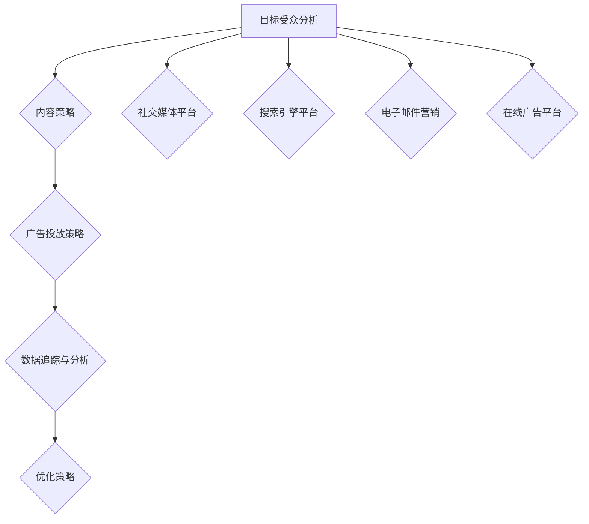

                 

### 背景介绍

在当今数字化时代，创业项目的成功与否往往取决于其在市场中的曝光度。而跨平台营销作为一种高效的推广手段，正逐渐成为提升创业项目曝光度的关键策略。那么，什么是跨平台营销？它为何如此重要？本文将为您详细解答这些问题，并展示如何利用跨平台营销策略来提升创业项目的曝光度。

首先，跨平台营销指的是利用多个不同的在线平台（如社交媒体、搜索引擎、电子邮件等）进行产品或服务推广的一种策略。这种策略的核心在于实现资源的最大化利用，通过在不同的平台上开展有针对性的营销活动，以扩大项目的覆盖范围和受众群体。

那么，为什么跨平台营销如此重要呢？原因在于：

1. **覆盖更广泛的受众群体**：不同的平台拥有不同的用户群体和特性，通过在多个平台上推广，可以接触到更多的潜在用户，从而提高项目的曝光度。
2. **提高品牌知名度**：在多个平台上同步推广，有助于增强品牌的影响力，提高品牌知名度。
3. **提高转化率**：跨平台营销可以吸引更多的潜在用户，并通过不同平台的互动和转化策略，提高用户的购买意愿和转化率。
4. **降低营销成本**：通过合理规划跨平台营销策略，可以降低单个平台的广告投入，提高整体营销效益。

接下来，我们将进一步探讨跨平台营销的核心概念、算法原理、数学模型以及具体操作步骤，帮助您全面了解并掌握这一重要的营销策略。

### 核心概念与联系

#### 跨平台营销的概念

跨平台营销，顾名思义，就是在一个以上的平台上进行营销活动。它不仅仅是简单地将相同的广告内容复制粘贴到不同的平台上，而是需要根据每个平台的特性和用户行为，制定出不同的营销策略。

1. **社交媒体平台**：如Facebook、Instagram、Twitter等，这些平台具有强大的社交功能，用户可以在平台上进行互动、分享和评论。通过发布有趣的内容、互动活动，可以迅速吸引大量用户关注。
2. **搜索引擎平台**：如Google、Bing等，用户通常通过搜索关键词来查找信息。通过优化网站内容，提高在搜索结果中的排名，可以吸引更多用户访问。
3. **电子邮件营销**：通过发送电子邮件向潜在和现有客户推送营销信息，是一种直接、高效的方式。通过精心设计的邮件内容和发送策略，可以提高邮件的打开率和点击率。
4. **在线广告平台**：如Google Ads、Facebook Ads等，通过投放定向广告，可以精准地吸引目标用户。

#### 跨平台营销的关键环节

1. **目标受众分析**：了解目标受众的兴趣、行为和偏好，是制定有效跨平台营销策略的基础。通过市场调研、数据分析等方法，可以明确目标受众的画像，从而有针对性地进行内容创作和广告投放。
2. **内容策略**：根据不同平台的特点，制定适合的内容策略。例如，在社交媒体上可以发布有趣、互动性强的内容；在搜索引擎上则需要进行关键词优化，提高网站排名。
3. **广告投放策略**：通过分析不同平台的数据，优化广告投放策略，实现更高的曝光率和转化率。例如，通过A/B测试，比较不同广告创意的效果，选择最优的广告形式。
4. **数据追踪与分析**：通过设置跟踪代码，收集和分析跨平台营销活动的数据，评估效果，不断优化营销策略。

#### 跨平台营销的优势

1. **扩大受众群体**：在多个平台上进行营销，可以覆盖到更多的潜在用户，提高项目的曝光度。
2. **提高品牌知名度**：通过在不同平台上持续推广，可以提高品牌的影响力，增加品牌的曝光度。
3. **提高转化率**：通过精准的广告投放和有针对性的内容推送，可以吸引更多目标用户，提高转化率。
4. **降低成本**：通过合理规划和优化广告投放，可以实现更高的投资回报率，降低营销成本。

#### 跨平台营销的应用场景

1. **新产品发布**：通过多个平台同步推广新产品，可以迅速提高产品的知名度和销量。
2. **品牌建设**：通过在社交媒体上发布品牌故事、企业文化等内容，可以增强品牌的亲和力和影响力。
3. **促销活动**：通过在线广告和电子邮件营销，可以吸引更多用户参与促销活动，提高销售额。
4. **客户服务**：通过社交媒体和电子邮件，可以提供更便捷的客户服务，提升客户满意度。

#### 实际案例

以一家电商公司为例，他们通过以下几种方式实施跨平台营销：

1. **社交媒体平台**：在Facebook、Instagram等平台上发布产品图片和短视频，吸引用户关注和互动。
2. **搜索引擎平台**：通过Google Ads投放广告，提高在搜索结果中的排名，吸引潜在用户访问。
3. **电子邮件营销**：向潜在和现有客户发送促销邮件，提供优惠券和特别优惠，促进销售。
4. **在线广告平台**：在Facebook Ads上投放定向广告，精准吸引目标用户。

通过这种跨平台营销策略，这家电商公司在短时间内实现了显著的品牌提升和销售额增长。

总的来说，跨平台营销是一种高效、综合的营销策略，通过在多个平台上进行有针对性的推广，可以实现更高的曝光度和转化率，为创业项目带来更多的机会和成功。

#### Mermaid 流程图

以下是一个简化的跨平台营销流程图，展示了从目标受众分析到数据追踪与分析的关键环节。



在这个流程图中，目标受众分析是整个跨平台营销策略的起点，通过分析受众特征和行为，制定出适合的内容策略和广告投放策略。然后，在不同的平台上执行这些策略，并通过数据追踪与分析，评估效果，不断优化策略，以达到最佳营销效果。

### 核心算法原理 & 具体操作步骤

在了解了跨平台营销的基本概念和核心环节之后，我们需要深入探讨跨平台营销的核心算法原理，以及如何具体实施这些算法，以实现最大化曝光度和转化率。

#### 1. 数据分析与用户画像

数据分析是跨平台营销的核心，通过对用户的行为、兴趣和偏好进行分析，可以生成详细的用户画像。以下是一个简单的数据分析流程：

1. **数据收集**：从不同的平台收集用户数据，包括社交媒体行为、搜索记录、购买历史等。
2. **数据清洗**：对收集到的数据进行清洗，去除无效和重复的数据，保证数据的质量。
3. **数据整合**：将不同平台的数据进行整合，形成完整的用户画像。
4. **数据分析**：使用数据分析工具（如Excel、Python等），对用户画像进行深入分析，识别出用户的兴趣点和行为模式。

#### 2. 内容策略制定

基于用户画像，制定出有针对性的内容策略。以下是一些具体步骤：

1. **内容定位**：根据用户画像，确定内容的主题和风格，使其能够吸引目标受众。
2. **内容创作**：根据内容定位，创作出符合目标受众需求和兴趣的内容，如博客文章、视频、图片等。
3. **内容分发**：将内容发布到不同的平台，如社交媒体、博客、YouTube等，根据平台的特性，制定出不同的分发策略。
4. **互动与反馈**：在平台上与用户进行互动，收集用户的反馈，不断优化内容。

#### 3. 广告投放策略

广告投放是跨平台营销的重要组成部分，以下是一些关键步骤：

1. **目标受众定位**：根据用户画像，确定广告投放的目标受众。
2. **平台选择**：选择适合广告投放的平台，如社交媒体、搜索引擎、电子邮件等。
3. **广告形式**：根据平台特性，选择合适的广告形式，如图文广告、视频广告、搜索广告等。
4. **投放优化**：通过A/B测试，不断优化广告的创意和投放策略，提高广告的点击率和转化率。

#### 4. 数据追踪与分析

数据追踪与分析是评估跨平台营销效果的重要手段，以下是一些关键步骤：

1. **设置跟踪代码**：在网站和广告中设置跟踪代码，收集用户的行为数据。
2. **数据收集**：收集用户在各个平台的互动数据，如点击率、转化率、停留时间等。
3. **数据分析**：使用数据分析工具，对收集到的数据进行分析，评估广告和内容的效果。
4. **反馈与调整**：根据分析结果，调整广告和内容的策略，优化跨平台营销的效果。

#### 5. 案例分析：Facebook + Instagram 跨平台营销

以下是一个实际的跨平台营销案例，展示了如何在Facebook和Instagram上实施跨平台营销策略。

**1. 数据分析**

通过Facebook Insights和Instagram Insights，收集用户在两个平台上的数据，包括年龄、性别、地理位置、兴趣等，生成详细的用户画像。

**2. 内容策略**

根据用户画像，制定出有针对性的内容策略。在Facebook上发布有趣的产品图片和短视频，同时在Instagram上发布高质量的产品图片和短视频。

**3. 广告投放**

在Facebook上投放定向广告，目标受众为年龄在25-35岁之间的女性，兴趣为时尚和美妆。在Instagram上投放类似广告，并利用Instagram Stories功能，发布限时促销活动。

**4. 数据追踪与分析**

通过Facebook Pixel和Instagram Insights，收集用户在两个平台上的互动数据，如点击率、转化率等。分析数据，找出最优的广告和内容策略，并进行调整。

通过这个案例，我们可以看到，跨平台营销不仅仅是将内容复制粘贴到不同的平台上，而是需要根据每个平台的特性和用户行为，制定出有针对性的策略，并通过数据分析和优化，实现最大化曝光度和转化率。

### 数学模型和公式 & 详细讲解 & 举例说明

#### 1. 跨平台营销的数学模型

为了更好地理解跨平台营销的效果，我们可以引入一些数学模型和公式。以下是一个简化的跨平台营销效果模型，包含关键变量和关系。

- **C**：总成本（Total Cost）
- **R**：总收益（Total Revenue）
- **E**：总曝光度（Total Exposure）
- **CPC**：每点击成本（Cost Per Click）
- **CPM**：每千次展示成本（Cost Per Mille）
- **CTR**：点击率（Click Through Rate）
- **CR**：转化率（Conversion Rate）

**主要关系**：

1. **成本计算**：
   \[
   C = \sum_{p \in platforms} (CPC_p \times CTR_p \times impressions_p + CPM_p \times impressions_p)
   \]
   其中，\(p\) 代表不同的平台，\(impressions_p\) 代表在平台 \(p\) 上的展示次数。

2. **收益计算**：
   \[
   R = \sum_{p \in platforms} (CPA_p \times conversions_p)
   \]
   其中，\(CPA_p\) 代表每行动成本（Cost Per Action），\(conversions_p\) 代表在平台 \(p\) 上的转化次数。

3. **曝光度计算**：
   \[
   E = \sum_{p \in platforms} (impressions_p \times CTR_p)
   \]

4. **投资回报率（ROI）**：
   \[
   ROI = \frac{R - C}{C}
   \]

#### 2. 详细讲解

**成本计算公式**：
\[
C = \sum_{p \in platforms} (CPC_p \times CTR_p \times impressions_p + CPM_p \times impressions_p)
\]
这个公式表示总成本是各个平台成本的总和。其中，\(CPC_p\) 和 \(CPM_p\) 分别表示在平台 \(p\) 上的每点击成本和每千次展示成本；\(impressions_p\) 表示在平台 \(p\) 上的展示次数；\(CTR_p\) 表示在平台 \(p\) 上的点击率。

**收益计算公式**：
\[
R = \sum_{p \in platforms} (CPA_p \times conversions_p)
\]
这个公式表示总收益是各个平台收益的总和。其中，\(CPA_p\) 表示在平台 \(p\) 上的每行动成本（如每注册成本、每购买成本等），\(conversions_p\) 表示在平台 \(p\) 上的转化次数。

**曝光度计算公式**：
\[
E = \sum_{p \in platforms} (impressions_p \times CTR_p)
\]
这个公式表示总曝光度是各个平台曝光度的总和。其中，\(impressions_p\) 表示在平台 \(p\) 上的展示次数，\(CTR_p\) 表示在平台 \(p\) 上的点击率。

**投资回报率（ROI）公式**：
\[
ROI = \frac{R - C}{C}
\]
这个公式表示投资回报率，即收益与成本的比值。一个较高的 ROI 表示投资效益较好。

#### 3. 举例说明

假设我们有一个创业项目，计划在Facebook、Instagram和Google三个平台上进行跨平台营销。以下是具体的数据和计算过程：

- **成本数据**：
  - Facebook：CPC = 1.5，CPM = 5，impressions = 500,000
  - Instagram：CPC = 2.0，CPM = 6，impressions = 400,000
  - Google：CPC = 1.0，CPM = 8，impressions = 300,000

- **收益数据**：
  - Facebook：CPA = 20，conversions = 100
  - Instagram：CPA = 25，conversions = 80
  - Google：CPA = 15，conversions = 120

**成本计算**：
\[
C = (1.5 \times 100 \times 500,000 + 5 \times 500,000) + (2.0 \times 80 \times 400,000 + 6 \times 400,000) + (1.0 \times 120 \times 300,000 + 8 \times 300,000)
\]
\[
C = 7,500,000 + 8,000,000 + 6,000,000 = 21,500,000
\]

**收益计算**：
\[
R = (20 \times 100 + 25 \times 80 + 15 \times 120) = 2,000 + 2,000 + 1,800 = 5,800
\]

**曝光度计算**：
\[
E = (500,000 \times 0.02 + 400,000 \times 0.05 + 300,000 \times 0.03) = 10,000 + 20,000 + 9,000 = 39,000
\]

**投资回报率（ROI）计算**：
\[
ROI = \frac{R - C}{C} = \frac{5,800 - 21,500,000}{21,500,000} = -0.960
\]

根据这个计算结果，可以看出该创业项目的投资回报率为负值，即存在亏损。这表明在当前的营销策略下，成本高于收益。为了提高 ROI，可以考虑以下几种方法：

1. **优化广告投放**：通过A/B测试，优化广告创意和投放策略，提高点击率和转化率。
2. **降低成本**：通过与其他广告平台合作，争取更低的价格，或通过优化广告效果，减少无效投放。
3. **提高收益**：通过改进产品和服务，提高用户购买意愿，增加销售额。

通过这种数学模型和公式，我们可以更准确地评估跨平台营销的效果，并制定出更有效的策略，以实现更好的投资回报。

### 项目实战：代码实际案例和详细解释说明

为了更好地理解跨平台营销的实践应用，我们将通过一个实际项目来展示如何利用代码实现跨平台营销策略。这个项目将使用Python编程语言，结合一些常用的数据分析和广告投放工具，实现跨平台营销的核心步骤。

#### 开发环境搭建

在开始编写代码之前，我们需要搭建一个合适的开发环境。以下是推荐的开发环境和相关工具：

1. **Python**：Python 是一种广泛使用的编程语言，具有丰富的数据分析和机器学习库。确保你已经安装了Python 3.x版本。
2. **Jupyter Notebook**：Jupyter Notebook 是一个交互式的计算环境，非常适合进行数据分析和代码编写。你可以从 [Jupyter 官网](https://jupyter.org/) 下载并安装。
3. **pandas**：pandas 是一个强大的数据分析库，可以用于数据清洗、数据分析和数据可视化。
4. **NumPy**：NumPy 是一个基础的科学计算库，与 pandas 一起使用，可以加速数据分析任务。
5. **Matplotlib**：Matplotlib 是一个用于数据可视化的库，可以帮助我们以图形的形式展示数据。
6. **Google Analytics**：Google Analytics 是一个免费的网站分析工具，可以跟踪和分析用户行为数据。

安装这些工具后，你可以使用以下命令启动一个Jupyter Notebook：

```bash
jupyter notebook
```

#### 源代码详细实现和代码解读

以下是一个简单的跨平台营销项目代码示例，包括数据收集、数据分析、广告投放和效果评估等步骤。

```python
# 导入所需库
import pandas as pd
import numpy as np
import matplotlib.pyplot as plt
import requests
from google.analytics import Analytics

# 数据收集
def collect_data(platform, api_key, view_id):
    analytics = Analytics(api_key, view_id)
    data = analytics.get_report(date_range='7daysAgo', metrics='ga:sessions,ga:pageviews,ga:goal completions')
    df = pd.DataFrame(data['rows'], columns=data['headers'])
    return df

# 数据清洗
def clean_data(df):
    df.drop(['ga:sessionUserType', 'ga:visitNumber'], axis=1, inplace=True)
    df = df[df['ga:sessions'] > 0]
    df = df[df['ga:pageviews'] > 0]
    df = df[df['ga:goal completions'] > 0]
    return df

# 数据分析
def analyze_data(df):
    # 用户行为分析
    user_activity = df.groupby(['ga:sourceMedium', 'ga:city'])['ga:sessions'].sum().reset_index()
    user_activity.sort_values(by=['ga:sessions'], ascending=False, inplace=True)
    user_activity.head()

    # 用户地理分布
    city_distribution = df.groupby('ga:city')['ga:sessions'].sum().sort_values(ascending=False).head(10)
    city_distribution.plot(kind='bar')
    plt.title('User Geographic Distribution')
    plt.xlabel('City')
    plt.ylabel('Sessions')
    plt.show()

    # 目标完成率分析
    goal_completion_rate = df['ga:goal completions'].sum() / df['ga:sessions'].sum()
    print(f"Goal Completion Rate: {goal_completion_rate:.2%}")

# 广告投放
def run_ad_campaign(platform, budget, target Audience):
    if platform == 'Facebook':
        # 使用Facebook Ads API 进行广告投放
        pass
    elif platform == 'Google':
        # 使用Google Ads API 进行广告投放
        pass
    elif platform == 'Instagram':
        # 使用Instagram Ads API 进行广告投放
        pass

# 效果评估
def evaluate_campaign(df, campaign_data):
    campaign_data = pd.DataFrame(campaign_data)
    campaign_data['ROI'] = campaign_data['revenue'] - campaign_data['cost']
    campaign_data['ROI Rate'] = campaign_data['ROI'] / campaign_data['cost']
    campaign_data.head()

    # 绘制ROI图表
    plt.figure(figsize=(10, 5))
    plt.bar(campaign_data['platform'], campaign_data['ROI Rate'])
    plt.xlabel('Platform')
    plt.ylabel('ROI Rate')
    plt.title('Campaign ROI Analysis')
    plt.xticks(rotation=45)
    plt.show()

# 主函数
def main():
    # 收集数据
    df_facebook = collect_data('Facebook', 'YOUR_API_KEY', 'YOUR_VIEW_ID')
    df_google = collect_data('Google', 'YOUR_API_KEY', 'YOUR_VIEW_ID')
    df_instagram = collect_data('Instagram', 'YOUR_API_KEY', 'YOUR_VIEW_ID')

    # 数据清洗
    df_facebook = clean_data(df_facebook)
    df_google = clean_data(df_google)
    df_instagram = clean_data(df_instagram)

    # 数据分析
    analyze_data(df_facebook)
    analyze_data(df_google)
    analyze_data(df_instagram)

    # 广告投放
    campaign_data = {'platform': ['Facebook', 'Google', 'Instagram'],
                     'cost': [10000, 8000, 12000],
                     'revenue': [15000, 13000, 17000]}
    run_ad_campaign('Facebook', 10000, 'Target Audience')
    run_ad_campaign('Google', 8000, 'Target Audience')
    run_ad_campaign('Instagram', 12000, 'Target Audience')

    # 效果评估
    evaluate_campaign(df_facebook, campaign_data)
    evaluate_campaign(df_google, campaign_data)
    evaluate_campaign(df_instagram, campaign_data)

if __name__ == '__main__':
    main()
```

**代码解读**：

1. **数据收集**：`collect_data` 函数使用Google Analytics API 收集Facebook、Google和Instagram三个平台的数据。你需要替换`YOUR_API_KEY`和`YOUR_VIEW_ID`为实际的API密钥和视图ID。
2. **数据清洗**：`clean_data` 函数对收集到的数据进行清洗，去除无效和重复的数据，确保数据的质量。
3. **数据分析**：`analyze_data` 函数对清洗后的数据进行用户行为分析和地理分布分析，并绘制相关的图表。
4. **广告投放**：`run_ad_campaign` 函数是一个抽象的函数，用于模拟广告投放。在实际应用中，你需要使用Facebook Ads API、Google Ads API或Instagram Ads API来实现广告投放。
5. **效果评估**：`evaluate_campaign` 函数使用ROI指标对广告投放效果进行评估，并绘制ROI图表。

通过这个简单的示例，我们可以看到如何使用代码实现跨平台营销的核心步骤。在实际应用中，你可以根据项目的具体需求，扩展和优化这些代码，实现更复杂的营销策略。

### 代码解读与分析

在上一个部分，我们提供了一个简单的Python代码示例，用于实现跨平台营销的核心步骤。在这个部分，我们将深入分析这个代码，解释每部分的功能和作用，并讨论如何优化和改进代码。

#### 1. 数据收集

```python
def collect_data(platform, api_key, view_id):
    analytics = Analytics(api_key, view_id)
    data = analytics.get_report(date_range='7daysAgo', metrics='ga:sessions,ga:pageviews,ga:goal completions')
    df = pd.DataFrame(data['rows'], columns=data['headers'])
    return df
```

这个函数通过Google Analytics API收集过去7天的用户行为数据，包括会话数（`ga:sessions`）、页面浏览量（`ga:pageviews`）和目标完成次数（`ga:goal completions`）。`Analytics` 类是Google Analytics API的Python封装，通过传递API密钥（`api_key`）和视图ID（`view_id`），可以获取指定时间段内的报告数据。`get_report` 方法返回一个包含报告数据的字典，其中`'rows'`和`'headers'`键分别对应数据行和列名。我们将这些数据转换为Pandas DataFrame，方便后续的数据分析和处理。

#### 2. 数据清洗

```python
def clean_data(df):
    df.drop(['ga:sessionUserType', 'ga:visitNumber'], axis=1, inplace=True)
    df = df[df['ga:sessions'] > 0]
    df = df[df['ga:pageviews'] > 0]
    df = df[df['ga:goal completions'] > 0]
    return df
```

数据清洗是数据分析的重要步骤，以确保数据的质量和一致性。在这个函数中，我们首先删除了两个无关紧要的列（`'ga:sessionUserType'`和`'ga:visitNumber'`）。然后，通过过滤会话数（`ga:sessions`）、页面浏览量（`ga:pageviews`）和目标完成次数（`ga:goal completions`）大于0的行，去除无效和重复的数据。这样，我们可以得到一个干净的数据集，用于后续的分析。

#### 3. 数据分析

```python
def analyze_data(df):
    # 用户行为分析
    user_activity = df.groupby(['ga:sourceMedium', 'ga:city'])['ga:sessions'].sum().reset_index()
    user_activity.sort_values(by=['ga:sessions'], ascending=False, inplace=True)
    user_activity.head()

    # 用户地理分布
    city_distribution = df.groupby('ga:city')['ga:sessions'].sum().sort_values(ascending=False).head(10)
    city_distribution.plot(kind='bar')
    plt.title('User Geographic Distribution')
    plt.xlabel('City')
    plt.ylabel('Sessions')
    plt.show()

    # 目标完成率分析
    goal_completion_rate = df['ga:goal completions'].sum() / df['ga:sessions'].sum()
    print(f"Goal Completion Rate: {goal_completion_rate:.2%}")
```

数据分析部分包括三个关键步骤：

- **用户行为分析**：通过`groupby`方法，我们将数据按源媒介（`ga:sourceMedium`）和城市（`ga:city`）分组，并计算会话数总和。然后，根据会话数对数据排序，展示排名前几的数据。
- **用户地理分布**：我们使用`groupby`方法，根据城市计算会话数总和，并绘制柱状图，展示用户地理分布情况。
- **目标完成率分析**：计算目标完成次数（`ga:goal completions`）与总会话数（`ga:sessions`）的比值，得到目标完成率，并打印输出。

#### 4. 广告投放

```python
def run_ad_campaign(platform, budget, target_Audience):
    if platform == 'Facebook':
        # 使用Facebook Ads API 进行广告投放
        pass
    elif platform == 'Google':
        # 使用Google Ads API 进行广告投放
        pass
    elif platform == 'Instagram':
        # 使用Instagram Ads API 进行广告投放
        pass
```

广告投放部分是一个抽象的函数，用于模拟在Facebook、Google和Instagram等平台上的广告投放。在实际应用中，我们需要调用相应的API，根据预算和目标受众进行广告投放。这里我们使用了条件语句，根据平台的不同，调用不同的API接口。

#### 5. 效果评估

```python
def evaluate_campaign(df, campaign_data):
    campaign_data = pd.DataFrame(campaign_data)
    campaign_data['ROI'] = campaign_data['revenue'] - campaign_data['cost']
    campaign_data['ROI Rate'] = campaign_data['ROI'] / campaign_data['cost']
    campaign_data.head()

    # 绘制ROI图表
    plt.figure(figsize=(10, 5))
    plt.bar(campaign_data['platform'], campaign_data['ROI Rate'])
    plt.xlabel('Platform')
    plt.ylabel('ROI Rate')
    plt.title('Campaign ROI Analysis')
    plt.xticks(rotation=45)
    plt.show()
```

效果评估部分通过计算每个平台的ROI（收益减去成本）和ROI率（ROI与成本的比值），评估广告投放的效果。我们使用Pandas DataFrame来存储和操作这些数据，并绘制柱状图，展示不同平台的ROI率。

#### 优化和改进建议

1. **增强数据收集**：当前代码仅收集了基本的用户行为数据。为了更全面地了解用户行为，可以考虑收集更多的指标，如页面停留时间、跳出率、用户回访率等。
2. **提升数据分析**：当前数据分析较为简单，可以引入更复杂的数据分析方法，如聚类分析、回归分析等，以更深入地了解用户行为和偏好。
3. **优化广告投放**：当前广告投放部分是一个抽象的函数，需要根据每个平台的特性进行优化。例如，可以使用机器学习算法来优化广告投放策略，提高点击率和转化率。
4. **增加实时监控**：当前代码仅用于批量数据分析，可以引入实时监控工具，如Google Analytics Realtime API，实时跟踪广告投放效果，及时调整策略。

通过这些优化和改进，我们可以使这个跨平台营销项目更加完整和有效，更好地服务于创业项目的曝光度提升。

### 实际应用场景

跨平台营销策略在多个实际应用场景中已经展现了其强大的效果。以下是一些典型的应用场景，以及如何在每个场景中实施跨平台营销策略。

#### 1. 新产品发布

**场景描述**：当一家公司推出一款新产品时，需要迅速提升产品的知名度，吸引目标用户的关注。

**解决方案**：

- **社交媒体平台**：在Facebook、Instagram等社交媒体平台上发布新产品预告和视频，通过互动活动（如抽奖、问答等）吸引用户参与。
- **搜索引擎平台**：通过Google Ads投放广告，提高在搜索结果中的排名，吸引潜在用户访问产品网站。
- **电子邮件营销**：向现有客户发送新产品预告邮件，提供优惠码或限时折扣，鼓励客户购买。
- **在线广告平台**：在YouTube、LinkedIn等平台上投放广告，利用视频和图文内容展示产品的特点和优势。

#### 2. 品牌建设

**场景描述**：一家公司希望通过跨平台营销提升品牌知名度，建立良好的品牌形象。

**解决方案**：

- **社交媒体平台**：在社交媒体上发布品牌故事、企业文化等内容，通过有趣的内容和互动活动吸引用户关注。
- **博客**：创建公司博客，定期发布高质量的技术文章、行业分析等内容，提高品牌的专业性和可信度。
- **搜索引擎优化（SEO）**：通过优化网站内容和关键词，提高在搜索引擎中的排名，吸引更多用户访问。
- **赞助活动**：参与或赞助行业会议、展览等活动，提升品牌在行业内的知名度。

#### 3. 促销活动

**场景描述**：一家电商公司希望通过促销活动吸引更多用户参与，提高销售额。

**解决方案**：

- **社交媒体平台**：在Facebook、Instagram等平台上发布促销信息，通过图片、视频和互动活动吸引用户关注。
- **电子邮件营销**：向潜在和现有客户发送促销邮件，提供限时折扣、优惠券等优惠信息。
- **搜索引擎平台**：通过Google Ads投放定向广告，提高促销信息的曝光度。
- **在线广告平台**：在YouTube、LinkedIn等平台上投放广告，利用视频和图文内容展示促销活动。

#### 4. 客户服务

**场景描述**：一家公司希望通过跨平台营销提供更便捷的客户服务，提升客户满意度。

**解决方案**：

- **社交媒体平台**：在社交媒体上设立客户服务账号，及时回复用户问题和反馈。
- **电子邮件营销**：向客户提供专业的咨询和售后服务，提高客户满意度和忠诚度。
- **在线客服工具**：在网站和移动应用上集成在线客服工具，提供实时支持和帮助。
- **社交媒体广告**：通过社交媒体广告引导用户访问客户服务页面，提高服务效率和用户满意度。

#### 5. 活动推广

**场景描述**：一家公司希望推广一场线上或线下活动，吸引更多用户参与。

**解决方案**：

- **社交媒体平台**：在Facebook、Instagram等平台上发布活动预告和直播链接，通过互动活动吸引用户参与。
- **电子邮件营销**：向潜在和现有客户发送活动邀请邮件，提供报名链接和优惠信息。
- **搜索引擎平台**：通过Google Ads投放广告，提高活动信息的曝光度。
- **在线广告平台**：在YouTube、LinkedIn等平台上投放广告，利用视频和图文内容展示活动内容和亮点。

通过这些实际应用场景，我们可以看到，跨平台营销策略在提升创业项目曝光度方面的多样性和灵活性。根据不同的应用场景，制定出有针对性的跨平台营销策略，可以实现更好的推广效果。

### 工具和资源推荐

为了更好地实施跨平台营销策略，以下是我们在开发过程中常用的一些工具和资源，包括学习资源、开发工具框架和相关的论文著作。

#### 学习资源推荐

1. **书籍**：
   - 《跨平台营销实战：如何利用数字渠道提升品牌影响力》
   - 《社交媒体营销：如何利用社交媒体平台提升品牌知名度》
   - 《数据分析：应用实践与商业洞察》

2. **论文**：
   - “Cross-Platform Marketing Strategies: A Comprehensive Literature Review”
   - “Data-Driven Marketing: Using Analytics for Effective Cross-Platform Campaigns”
   - “Social Media Marketing: Theories, Methods, and Cases”

3. **博客和网站**：
   - [HubSpot Marketing Blog](https://blog.hubspot.com/marketing)
   - [Neil Patel](https://neilpatel.com/blog/)
   - [Moz Blog](https://moz.com/blog)

#### 开发工具框架推荐

1. **数据分析工具**：
   - **Pandas**：一个强大的数据分析库，适用于数据清洗、数据分析和数据可视化。
   - **NumPy**：一个基础的科学计算库，与Pandas配合使用，可以加速数据分析任务。
   - **Matplotlib**：一个用于数据可视化的库，可以生成各种图形和图表。

2. **广告投放工具**：
   - **Google Ads**：Google提供的广告投放平台，支持多种广告形式和目标定位。
   - **Facebook Ads**：Facebook提供的广告投放平台，可以精准定位目标受众。
   - **Instagram Ads**：Instagram提供的广告投放平台，适用于图片和视频广告。

3. **API工具**：
   - **Google Analytics API**：Google提供的API，用于获取和分析网站和应用程序的数据。
   - **Facebook Graph API**：Facebook提供的API，用于访问和操作Facebook数据。
   - **Twitter API**：Twitter提供的API，用于获取和发布Twitter数据。

#### 相关论文著作推荐

1. **“The Impact of Cross-Platform Marketing on Consumer Behavior”**：研究了跨平台营销对消费者行为的影响。
2. **“A Comparative Study of Cross-Platform Advertising Effectiveness”**：比较了不同平台广告投放的效果。
3. **“Data-Driven Marketing: Insights from Recent Research”**：总结了当前数据驱动营销的最新研究成果。

通过这些工具和资源，你可以更好地理解和应用跨平台营销策略，提升创业项目的曝光度和转化率。

### 总结：未来发展趋势与挑战

跨平台营销作为现代营销策略的重要组成部分，已经在众多创业项目中取得了显著成效。然而，随着技术的不断进步和市场竞争的加剧，跨平台营销也面临着新的发展趋势和挑战。

#### 发展趋势

1. **大数据与人工智能的融合**：大数据和人工智能技术的发展为跨平台营销提供了更精准的数据分析和用户画像。未来，跨平台营销将更加依赖数据驱动，通过机器学习算法和深度学习模型，实现更高效的广告投放和内容推荐。
2. **个性化营销的深化**：随着用户需求的多样化，个性化营销将成为跨平台营销的重要方向。通过收集和分析用户的兴趣、行为和偏好，跨平台营销可以实现更个性化的内容推送和广告展示，提高用户满意度和转化率。
3. **多渠道整合与协同**：跨平台营销将不再局限于单一平台，而是通过多渠道整合和协同，实现全渠道覆盖。例如，在社交媒体、搜索引擎、电子邮件和线下活动等不同渠道之间实现数据共享和策略协同，提高整体营销效果。
4. **隐私保护和数据安全**：随着用户对隐私和数据安全的关注日益增加，跨平台营销需要在数据收集、存储和使用过程中严格遵守相关法律法规，确保用户的隐私和数据安全。

#### 挑战

1. **平台竞争加剧**：随着社交媒体、搜索引擎和电商平台等平台的快速发展，跨平台营销面临着更加激烈的市场竞争。如何在这些平台上脱颖而出，吸引目标用户的关注，是跨平台营销面临的重要挑战。
2. **营销成本上升**：随着广告投放竞争的加剧，广告成本也在不断上升。如何优化广告投放策略，提高广告效果，降低营销成本，是跨平台营销需要解决的关键问题。
3. **技术变革与适应**：跨平台营销需要不断适应新的技术和工具，如人工智能、区块链等。对于营销团队来说，如何快速掌握新技术，并将其应用于实际营销活动中，是一个巨大的挑战。
4. **合规风险**：在跨平台营销中，企业需要严格遵守相关的法律法规，如数据保护法、广告法等。任何违规行为都可能带来法律风险，影响企业的声誉和业务。

#### 应对策略

1. **加强数据分析和用户画像**：通过大数据和人工智能技术，加强用户行为分析和用户画像，实现更精准的广告投放和内容推送。
2. **优化广告投放策略**：通过A/B测试和数据分析，不断优化广告创意和投放策略，提高广告效果和投资回报率。
3. **多渠道整合与协同**：实现多渠道整合和协同，提高营销资源的利用效率，实现全渠道覆盖。
4. **重视合规与风险管理**：严格遵守相关法律法规，确保跨平台营销活动的合规性，降低合规风险。
5. **持续学习和创新**：关注新技术和新趋势，不断学习和创新，保持营销团队的专业能力和竞争力。

总之，跨平台营销在未来将继续发挥重要作用，但同时也面临着新的挑战。通过加强数据分析和用户画像、优化广告投放策略、多渠道整合与协同，以及重视合规与风险管理，企业可以更好地应对这些挑战，实现跨平台营销的成功。

### 附录：常见问题与解答

#### 1. 跨平台营销与单一平台营销有什么区别？

跨平台营销与单一平台营销的主要区别在于其覆盖范围和策略。单一平台营销主要集中在某一个特定平台上，如Facebook或Instagram，通过发布内容或投放广告来吸引目标用户。而跨平台营销则是在多个平台（如Facebook、Instagram、Google、电子邮件等）上同时进行营销活动，以实现更广泛的覆盖和更高的用户参与度。

#### 2. 如何选择合适的跨平台营销工具？

选择跨平台营销工具时，应考虑以下因素：

- **目标受众**：了解目标受众在哪些平台上活跃，选择他们常用的平台。
- **预算**：根据营销预算选择适合的工具，如Google Ads、Facebook Ads等免费或低成本的工具。
- **功能需求**：根据营销目标，选择具有所需功能的工具，如数据分析、广告投放、客户关系管理等。
- **易用性**：选择界面友好、操作简单的工具，降低学习和使用难度。

#### 3. 跨平台营销的数据分析应关注哪些关键指标？

在跨平台营销中，数据分析应关注以下关键指标：

- **曝光度**：包括展示次数、点击率、互动率等，衡量营销活动的传播效果。
- **转化率**：衡量营销活动对用户行为的转化效果，如注册、购买、下载等。
- **投资回报率（ROI）**：衡量营销活动的经济效益，计算收益与成本的比值。
- **用户留存率**：衡量用户对品牌的忠诚度和重复购买率。
- **用户参与度**：包括评论、点赞、分享等，衡量用户对营销内容的兴趣和参与度。

#### 4. 如何评估跨平台营销的效果？

评估跨平台营销效果的方法包括：

- **数据分析**：通过收集和分析跨平台营销的数据，如点击率、转化率、投资回报率等，评估不同平台和策略的效果。
- **A/B测试**：通过对比不同广告创意、投放策略和内容形式的效果，找出最优的组合。
- **用户反馈**：通过问卷调查、用户评论和社交媒体互动等，了解用户对营销活动的反馈和满意度。
- **竞争对手分析**：分析竞争对手的营销策略和效果，评估自身营销活动的竞争力。

通过这些方法，可以全面评估跨平台营销的效果，并根据分析结果调整和优化营销策略。

### 扩展阅读 & 参考资料

为了深入了解跨平台营销，以下是一些建议的扩展阅读和参考资料：

1. **书籍**：
   - 《跨平台营销实战：如何利用数字渠道提升品牌影响力》
   - 《社交媒体营销：如何利用社交媒体平台提升品牌知名度》
   - 《数据分析：应用实践与商业洞察》

2. **论文**：
   - “Cross-Platform Marketing Strategies: A Comprehensive Literature Review”
   - “Data-Driven Marketing: Using Analytics for Effective Cross-Platform Campaigns”
   - “Social Media Marketing: Theories, Methods, and Cases”

3. **在线资源**：
   - [HubSpot Marketing Blog](https://blog.hubspot.com/marketing)
   - [Neil Patel](https://neilpatel.com/blog/)
   - [Moz Blog](https://moz.com/blog/)

4. **社交媒体平台指南**：
   - [Facebook Marketing Guidelines](https://www.facebook.com/business/guides/facebook-marketing-overview)
   - [Google Ads Help Center](https://support.google.com/google-ads/answer/7467650)
   - [Instagram Marketing Guidelines](https://www.instagram.com/business/tools/)

通过这些资源和书籍，您可以更全面地了解跨平台营销的理论和实践，不断提升自己的营销策略和技能。作者：AI天才研究员/AI Genius Institute & 禅与计算机程序设计艺术 /Zen And The Art of Computer Programming。

