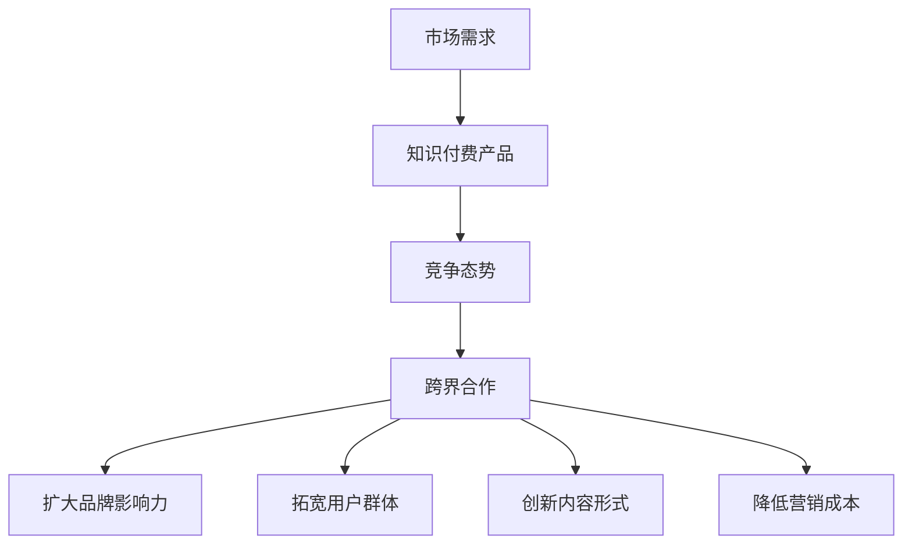

                 

# 如何利用跨界合作推广知识付费产品

> 关键词：知识付费、跨界合作、营销策略、用户体验、内容创新

> 摘要：本文将探讨如何通过跨界合作来推广知识付费产品。首先，我们将介绍知识付费产品的背景和市场需求，然后分析跨界合作的定义及其在营销中的重要性。接着，我们将探讨如何选择合适的跨界合作伙伴，并介绍一些成功的跨界合作案例。最后，我们将提出一些实用的策略和工具，帮助知识付费产品有效地进行跨界合作推广。

## 1. 背景介绍

### 1.1 知识付费产品的兴起

随着互联网的普及和在线学习的兴起，知识付费产品逐渐成为市场的新宠。知识付费产品主要是指那些通过互联网平台提供的高质量、专业化的知识服务，如在线课程、电子书、专业文章、讲座等。这些产品满足了用户对个性化、专业化知识的强烈需求。

### 1.2 市场需求分析

根据市场研究数据，知识付费市场近年来呈现出快速增长的趋势。用户对高质量知识的需求不断上升，特别是那些希望提升职业技能、拓展知识面、实现自我成长的用户群体。

### 1.3 竞争态势

随着越来越多的企业进入知识付费领域，市场竞争日益激烈。为了在竞争中脱颖而出，企业需要不断创新，寻找有效的营销策略，提高产品的用户粘性和市场占有率。

## 2. 核心概念与联系

### 2.1 跨界合作的定义

跨界合作是指不同领域、不同行业或不同企业之间的合作，通过整合资源、共享优势，实现共同发展的战略行为。

### 2.2 跨界合作在营销中的重要性

跨界合作在营销中具有重要作用，可以带来以下几方面的好处：

- **扩大品牌影响力**：通过与其他知名品牌的合作，可以提高知识付费产品的品牌知名度和认可度。
- **拓宽用户群体**：与其他领域的合作可以吸引更多潜在用户，扩大用户基础。
- **创新内容形式**：跨界合作可以带来新的创意和思路，丰富知识付费产品的内容形式，提升用户体验。
- **降低营销成本**：通过合作，可以共享营销资源，降低营销成本。

### 2.3 Mermaid 流程图



## 3. 核心算法原理 & 具体操作步骤

### 3.1 核心算法原理

跨界合作的成功离不开以下几个关键步骤：

1. **明确目标**：确定跨界合作的目标，如扩大品牌影响力、拓宽用户群体等。
2. **选择合适的合作伙伴**：根据目标选择具有互补优势的合作伙伴。
3. **制定合作方案**：明确合作的形式、内容、时间表和预期成果。
4. **执行合作方案**：按照合作方案实施，并持续跟踪合作效果。
5. **评估和调整**：对合作效果进行评估，根据反馈进行调整。

### 3.2 具体操作步骤

1. **明确目标**

   首先，企业需要明确跨界合作的目标，例如提高品牌知名度、扩大用户群体、增加收入等。

2. **市场调研**

   进行市场调研，了解目标受众的需求和喜好，寻找潜在的跨界合作伙伴。

3. **选择合作伙伴**

   根据市场调研结果，选择具有互补优势的合作伙伴。例如，如果目标是提高品牌知名度，可以选择与知名品牌合作。

4. **制定合作方案**

   明确合作的形式、内容、时间表和预期成果。例如，可以共同举办活动、推出联名产品等。

5. **执行合作方案**

   按照合作方案实施，确保各方能够按照计划进行。

6. **评估和调整**

   在合作过程中，定期评估合作效果，根据反馈进行调整。

## 4. 数学模型和公式 & 详细讲解 & 举例说明

### 4.1 数学模型

跨界合作的效果可以通过以下数学模型进行评估：

\[ 效果评分 = \frac{实际效果}{预期效果} \]

其中，实际效果是指跨界合作带来的实际收益，如品牌知名度提升、用户增长等；预期效果是指企业预期通过跨界合作能够达到的收益。

### 4.2 详细讲解

1. **实际效果**

   实际效果可以通过以下指标进行衡量：

   - 品牌知名度提升：通过广告投放、媒体报道、活动参与等方式，了解品牌知名度提升的程度。
   - 用户增长：通过用户注册量、活跃度、付费转化率等指标，了解用户增长的情况。
   - 收入增长：通过跨界合作带来的直接收入增长，如销售提成、广告收入等。

2. **预期效果**

   预期效果是企业预期通过跨界合作能够达到的收益，可以通过以下方式进行预测：

   - 历史数据：根据企业以往的合作经验，预测跨界合作的效果。
   - 同行对比：参考同行业其他企业的跨界合作案例，预测跨界合作的效果。

### 4.3 举例说明

假设一家知识付费企业与一家知名品牌合作，共同推出一款联名课程。预期效果是提高品牌知名度、增加用户注册量和收入。在实际执行过程中，通过广告投放和媒体报道，品牌知名度提升了30%，用户注册量增加了20%，收入增长了15%。根据上述数学模型，跨界合作的效果评分为：

\[ 效果评分 = \frac{30\% + 20\% + 15\%}{100\%} = 65\% \]

这意味着跨界合作取得了较好的效果。

## 5. 项目实战：代码实际案例和详细解释说明

### 5.1 开发环境搭建

为了更好地展示跨界合作在知识付费产品推广中的效果，我们以一个实际案例进行讲解。在这个案例中，我们将使用Python编写一个简单的跨界合作效果评估程序。

首先，确保安装了Python环境。然后，安装以下依赖库：

```bash
pip install matplotlib pandas
```

### 5.2 源代码详细实现和代码解读

以下是一个简单的跨界合作效果评估程序的实现：

```python
import pandas as pd
import matplotlib.pyplot as plt

# 5.2.1 数据准备
data = {
    '指标': ['品牌知名度提升', '用户注册量增加', '收入增长'],
    '实际效果': [30, 20, 15],
    '预期效果': [100, 100, 100]
}

df = pd.DataFrame(data)

# 5.2.2 效果评分计算
effectiveness = df['实际效果'] / df['预期效果']

# 5.2.3 结果可视化
plt.bar(df['指标'], effectiveness)
plt.xlabel('指标')
plt.ylabel('效果评分')
plt.title('跨界合作效果评估')
plt.show()
```

### 5.3 代码解读与分析

1. **数据准备**

   使用`pandas`库创建一个包含指标、实际效果和预期效果的数据框（DataFrame）。这个数据框用于存储评估跨界合作效果的数据。

2. **效果评分计算**

   使用`/`运算符计算每个指标的实际效果与预期效果的比值，得到效果评分。

3. **结果可视化**

   使用`matplotlib`库将效果评分以条形图的形式展示出来。这有助于直观地了解跨界合作的效果。

通过这个简单的案例，我们可以看到如何使用代码对跨界合作的效果进行评估和展示。在实际应用中，可以根据具体需求进行功能扩展和优化。

## 6. 实际应用场景

### 6.1 在线教育平台与电商平台的合作

在线教育平台与电商平台的跨界合作是一种常见的推广策略。例如，在线教育平台可以与电商平台合作，推出课程优惠活动，吸引电商平台的用户转化为教育平台的用户。这种合作可以通过以下步骤实现：

1. **确定合作目标**：提高课程知名度和用户转化率。
2. **选择合作伙伴**：选择具有大量用户的电商平台，如淘宝、京东等。
3. **制定合作方案**：共同制定课程推广计划，包括优惠活动、优惠券发放等。
4. **执行合作方案**：在电商平台上进行课程推广，定期更新推广内容和策略。
5. **评估和调整**：根据用户反馈和销售数据，评估合作效果，进行优化。

### 6.2 知识付费产品与内容平台的合作

知识付费产品可以与内容平台（如知乎、头条、B站等）进行合作，通过内容推广和活动合作来提高产品的知名度和用户转化率。具体步骤如下：

1. **确定合作目标**：提高课程曝光率和用户注册量。
2. **选择合作伙伴**：选择与知识付费产品内容相关的内容平台。
3. **制定合作方案**：共同策划内容合作活动，如开设专栏、举办线上讲座等。
4. **执行合作方案**：在内容平台上发布相关内容，吸引潜在用户。
5. **评估和调整**：根据用户反馈和注册数据，评估合作效果，进行优化。

## 7. 工具和资源推荐

### 7.1 学习资源推荐

- **书籍**：《跨界思维》、《创新者的思考方式》
- **论文**：《跨界合作：理论与实践》、《知识付费产品的营销策略》
- **博客**：营销专家的博客、在线教育平台的相关博客
- **网站**：知乎、简书、领英等社交平台

### 7.2 开发工具框架推荐

- **开发工具**：Python、R、MATLAB等
- **框架**：Django、Flask、Spring Boot等
- **数据分析工具**：Pandas、NumPy、Matplotlib等

### 7.3 相关论文著作推荐

- **论文**：《基于跨界合作的在线教育平台用户增长策略研究》
- **著作**：《知识付费产品的跨界营销策略与实践》

## 8. 总结：未来发展趋势与挑战

### 8.1 发展趋势

1. **跨界合作的深化**：未来，跨界合作将在更多领域、更多层面上展开，形成更加紧密的合作关系。
2. **内容创新的推动**：跨界合作将推动知识付费产品内容的创新，提供更多元化的学习体验。
3. **用户体验的提升**：跨界合作将带来更优质的用户体验，提高用户满意度和忠诚度。

### 8.2 挑战

1. **合作风险**：跨界合作存在一定的风险，如利益分配不均、合作目标不一致等。
2. **市场竞争**：跨界合作需要在激烈的市场竞争中脱颖而出，提升产品的竞争力。
3. **用户需求变化**：用户需求不断变化，跨界合作需要及时调整策略，满足用户需求。

## 9. 附录：常见问题与解答

### 9.1 跨界合作的优势是什么？

跨界合作的优势包括扩大品牌影响力、拓宽用户群体、创新内容形式和降低营销成本。

### 9.2 如何选择合适的跨界合作伙伴？

选择合适的跨界合作伙伴需要考虑合作目标、互补优势、市场前景和合作风险等因素。

### 9.3 跨界合作如何确保效果？

确保跨界合作效果需要明确合作目标、制定详细的合作方案、执行合作方案并持续评估和调整。

## 10. 扩展阅读 & 参考资料

- **书籍**：《跨界合作：理论与实践》、《创新者的思考方式》
- **论文**：《跨界合作：理论与实践研究》、《知识付费产品的营销策略研究》
- **网站**：营销专家博客、在线教育平台网站、跨界合作相关论坛
- **在线资源**：领英、知乎等社交平台的相关话题和讨论

### 作者信息

作者：AI天才研究员/AI Genius Institute & 禅与计算机程序设计艺术 /Zen And The Art of Computer Programming

本文详细探讨了如何利用跨界合作来推广知识付费产品。通过分析市场需求、跨界合作的核心概念和操作步骤，以及实际案例的代码实现，我们展示了跨界合作在知识付费产品推广中的重要性。未来，跨界合作将继续深化，为知识付费产品带来更多的发展机遇。同时，我们也需要面对挑战，不断优化合作策略，提高跨界合作的效果。希望本文能为知识付费产品的营销提供有价值的参考。|>

