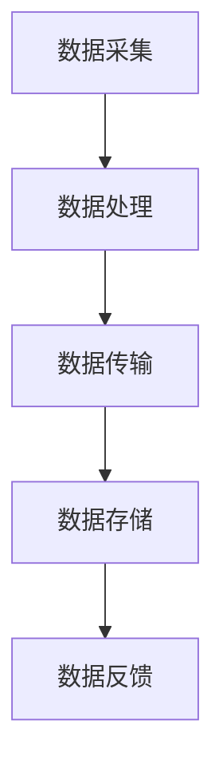

                 

# 如何利用边缘计算提升应用性能

## 关键词：边缘计算、应用性能、云计算、数据处理、网络延迟

边缘计算是一种将计算任务从中央服务器转移到网络边缘的技术，其核心思想是将数据、应用程序、内容和服务的处理推向网络的边缘，以降低网络延迟、提高响应速度和增强系统稳定性。随着物联网、人工智能、5G等技术的迅猛发展，边缘计算的应用场景越来越广泛，如何利用边缘计算提升应用性能已成为广大开发者和企业关注的热点话题。

本文将首先介绍边缘计算的基本概念及其与云计算的关系，然后深入探讨边缘计算在提升应用性能方面的具体优势，并通过实际案例和数学模型来详细分析边缘计算的原理和应用步骤。接下来，我们将探讨边缘计算在实际应用场景中的挑战和解决方案，最后总结边缘计算的未来发展趋势与挑战。

## 摘要

边缘计算作为一种新兴的计算技术，通过将计算任务从中央服务器转移到网络的边缘，极大地提升了应用的性能和响应速度。本文首先介绍了边缘计算的基本概念和架构，然后详细分析了其在降低网络延迟、提高数据处理效率和增强系统稳定性等方面的优势。通过实际案例和数学模型，我们展示了边缘计算的原理和应用步骤。最后，本文探讨了边缘计算在实际应用中面临的挑战和解决方案，并展望了其未来发展趋势与挑战。本文的目标是为读者提供全面、深入的边缘计算知识，帮助他们在实际项目中更好地利用这一技术。

## 1. 背景介绍

### 边缘计算的起源与发展

边缘计算（Edge Computing）的概念最早可以追溯到20世纪90年代，当时网络通信技术尚未成熟，计算资源相对有限。为了提高网络的响应速度和处理效率，研究者们开始探索将计算任务从中央服务器转移到网络边缘的方法。这种思路在物联网（IoT）和移动计算领域得到了广泛应用，并逐渐形成了边缘计算的概念。

随着云计算、物联网和5G等技术的迅猛发展，边缘计算的应用场景越来越丰富。在云计算时代，大量的计算和存储任务集中在数据中心，导致网络拥塞、延迟增加。边缘计算的提出，旨在解决这一问题，通过将计算任务分散到网络的边缘节点，实现计算资源的有效利用和性能的提升。

### 边缘计算的定义与核心概念

边缘计算是一种计算模式，它将数据、应用程序、内容和服务的处理推向网络的边缘，以降低网络延迟、提高响应速度和增强系统稳定性。边缘计算的核心概念包括以下几个方面：

1. **边缘节点（Edge Node）**：边缘节点是网络边缘的计算设备，可以是路由器、交换机、服务器、物联网设备等。边缘节点负责处理本地数据、执行计算任务和提供网络服务。

2. **边缘平台（Edge Platform）**：边缘平台是一种支持边缘计算的软件框架，它提供了边缘节点的管理、资源调度、数据传输等功能。常见的边缘平台包括物联网平台、边缘容器平台、边缘数据库等。

3. **边缘服务（Edge Service）**：边缘服务是指在网络边缘提供的各种服务，如数据采集、处理、存储、分析等。边缘服务可以独立运行在边缘节点上，也可以与其他云端服务集成。

4. **边缘网络（Edge Network）**：边缘网络是指连接边缘节点和云服务的网络架构，它包括本地局域网、广域网、物联网等。边缘网络的设计和优化对边缘计算的性能和可靠性至关重要。

### 边缘计算与云计算的关系

边缘计算与云计算是相辅相成的两种计算模式。云计算通过提供强大的计算和存储资源，为边缘计算提供了支持；而边缘计算则通过将计算任务推向网络边缘，提高了云计算的效率和性能。

1. **云计算的局限性**：云计算虽然提供了强大的计算和存储能力，但数据传输距离较远，容易导致网络延迟和带宽限制。在物联网和移动计算场景中，云计算无法满足低延迟、高响应速度的需求。

2. **边缘计算的补充**：边缘计算通过将计算任务推向网络边缘，可以显著降低数据传输距离，提高系统的响应速度和稳定性。边缘计算与云计算的结合，实现了计算资源的优化配置，提高了整体系统的性能。

### 边缘计算的应用领域

边缘计算的应用领域非常广泛，涵盖了物联网、智能城市、工业自动化、医疗健康、交通运输等多个领域。以下是一些典型的应用案例：

1. **物联网**：在物联网领域，边缘计算可以实现对大量物联网设备的实时监控和管理，提高系统的响应速度和可靠性。

2. **智能城市**：智能城市中的边缘计算可以用于实时交通监控、环境监测、智能照明等，提高城市的管理效率和居民生活质量。

3. **工业自动化**：在工业自动化领域，边缘计算可以实现对生产设备的实时监控、故障诊断和预测性维护，提高生产效率和设备利用率。

4. **医疗健康**：边缘计算可以用于医疗影像分析、健康监测等，提供实时、精准的医疗服务，提高医疗水平。

5. **交通运输**：在交通运输领域，边缘计算可以用于交通流量监控、智能导航、车辆调度等，提高交通运行效率和安全性。

## 2. 核心概念与联系

### 边缘计算的基本概念

边缘计算是一种将计算任务从中央服务器转移到网络边缘的计算模式。边缘节点是边缘计算的基本单位，它们负责处理本地数据、执行计算任务和提供网络服务。边缘平台是支持边缘计算的软件框架，它提供了边缘节点的管理、资源调度、数据传输等功能。边缘服务是在网络边缘提供的各种服务，如数据采集、处理、存储、分析等。

### 边缘计算与云计算的关系

边缘计算与云计算是相辅相成的两种计算模式。云计算提供了强大的计算和存储资源，为边缘计算提供了支持；而边缘计算通过将计算任务推向网络边缘，提高了云计算的效率和性能。边缘计算与云计算的关系可以概括为以下几个方面：

1. **数据传输距离**：边缘计算通过将计算任务推向网络边缘，降低了数据传输距离，提高了系统的响应速度和稳定性。相比云计算，边缘计算在物联网和移动计算场景中具有明显的优势。

2. **计算资源**：边缘计算和云计算提供了不同类型的计算资源。边缘计算主要提供本地计算和存储资源，而云计算则提供大规模的计算和存储能力。两者结合可以实现计算资源的优化配置。

3. **应用场景**：边缘计算主要适用于需要低延迟、高响应速度的场景，如物联网、智能城市、工业自动化等。云计算则适用于需要大规模计算和存储的场景，如大数据分析、云计算服务等。

### 边缘计算的架构

边缘计算的架构可以分为三层：边缘节点层、边缘平台层和云端层。

1. **边缘节点层**：边缘节点是边缘计算的基本单位，它们负责处理本地数据、执行计算任务和提供网络服务。边缘节点可以是路由器、交换机、服务器、物联网设备等。

2. **边缘平台层**：边缘平台是支持边缘计算的软件框架，它提供了边缘节点的管理、资源调度、数据传输等功能。边缘平台可以集成多种边缘服务，如数据采集、处理、存储、分析等。

3. **云端层**：云端层是边缘计算与云计算的结合点，它提供了强大的计算和存储资源。云端层可以与边缘平台进行数据交换和协同工作，实现计算资源的优化配置。

### 边缘计算的工作原理

边缘计算的工作原理可以概括为以下几个步骤：

1. **数据采集**：边缘节点采集本地数据，如传感器数据、网络流量数据等。

2. **数据处理**：边缘节点对采集到的数据进行初步处理，如数据过滤、压缩等。

3. **数据传输**：边缘节点将处理后的数据传输到边缘平台或云端层。

4. **数据存储**：边缘平台或云端层对数据进行分析、存储和管理。

5. **数据反馈**：边缘平台或云端层将分析结果反馈给边缘节点，用于决策或执行。

### 边缘计算的 Mermaid 流程图



在这个流程图中，边缘节点首先采集数据，然后对数据进行处理和传输，最终将数据存储在边缘平台或云端层，并通过数据反馈实现决策和执行。这个流程图展示了边缘计算的基本原理和工作流程。

## 3. 核心算法原理 & 具体操作步骤

### 3.1 边缘计算的算法原理

边缘计算的核心算法主要包括数据采集、数据处理、数据传输和数据存储。下面将详细分析这些算法的原理。

#### 数据采集

数据采集是边缘计算的基础，它涉及到从各种传感器、设备或网络接口获取数据。数据采集算法需要考虑以下几个方面：

1. **数据格式**：数据采集算法需要支持多种数据格式，如文本、图像、音频、视频等。

2. **数据采样**：数据采集算法需要实现数据采样，以过滤掉噪声和冗余信息，提高数据质量。

3. **数据同步**：数据采集算法需要实现数据同步，以确保数据的实时性和一致性。

#### 数据处理

数据处理是边缘计算的核心环节，它涉及到对采集到的数据进行预处理、特征提取、模式识别等操作。数据处理算法需要考虑以下几个方面：

1. **实时性**：边缘计算要求数据处理算法具有实时性，即能够在较短的时间内完成数据处理任务。

2. **准确性**：数据处理算法需要具有较高的准确性，以确保数据分析和决策的准确性。

3. **可扩展性**：数据处理算法需要支持多种数据处理任务，并能够灵活扩展。

#### 数据传输

数据传输是边缘计算的关键环节，它涉及到将处理后的数据传输到边缘平台或云端层。数据传输算法需要考虑以下几个方面：

1. **网络带宽**：数据传输算法需要充分利用网络带宽，避免网络拥塞和延迟。

2. **数据加密**：数据传输算法需要实现数据加密，以确保数据的安全性和隐私性。

3. **传输优化**：数据传输算法需要实现传输优化，如数据压缩、流量控制等。

#### 数据存储

数据存储是边缘计算的重要环节，它涉及到将数据存储在边缘设备或云端存储系统中。数据存储算法需要考虑以下几个方面：

1. **存储容量**：数据存储算法需要支持大容量数据存储，以满足边缘计算的需求。

2. **数据备份**：数据存储算法需要实现数据备份，以确保数据的安全性和可靠性。

3. **数据查询**：数据存储算法需要支持高效的数据查询，以满足边缘计算的数据分析和决策需求。

### 3.2 边缘计算的具体操作步骤

边缘计算的具体操作步骤可以分为以下几个阶段：

#### 阶段一：数据采集

1. **初始化**：启动边缘节点，配置传感器或网络接口。

2. **数据采集**：从传感器或网络接口读取数据，并进行数据预处理。

3. **数据同步**：将预处理后的数据同步到边缘平台。

#### 阶段二：数据处理

1. **数据处理**：在边缘平台上执行数据处理任务，如特征提取、模式识别等。

2. **数据处理结果**：将数据处理结果存储在边缘存储系统中。

#### 阶段三：数据传输

1. **数据加密**：对数据处理结果进行数据加密，以确保数据安全。

2. **数据传输**：将加密后的数据处理结果传输到云端存储系统。

#### 阶段四：数据存储

1. **数据存储**：在云端存储系统中存储数据处理结果。

2. **数据备份**：对数据处理结果进行备份，以确保数据安全。

#### 阶段五：数据查询

1. **数据查询**：在云端存储系统中查询数据处理结果。

2. **数据反馈**：将查询结果反馈给边缘节点，用于决策或执行。

通过以上阶段，边缘计算实现了数据的采集、处理、传输和存储，从而提高了应用性能。

## 4. 数学模型和公式 & 详细讲解 & 举例说明

### 4.1 数据采集模型的数学描述

边缘计算中的数据采集过程可以视为一个随机过程，其数学模型通常采用概率分布函数来描述。假设边缘节点采集到的数据 \(X(t)\) 是一个连续时间随机过程，其概率分布函数为 \(f_X(x)\)。数据采集模型的数学描述如下：

$$
f_X(x) = \int_{-\infty}^{\infty} f_X(x-y) f_Y(y) dy
$$

其中，\(f_Y(y)\) 表示传感器或网络接口的输出概率分布函数。

#### 举例说明

假设边缘节点采集到的数据 \(X(t)\) 服从正态分布 \(N(\mu, \sigma^2)\)，其中 \(\mu\) 表示均值，\(\sigma^2\) 表示方差。则数据采集模型的数学描述为：

$$
f_X(x) = \frac{1}{\sqrt{2\pi\sigma^2}} e^{-\frac{(x-\mu)^2}{2\sigma^2}}
$$

### 4.2 数据处理模型的数学描述

边缘计算中的数据处理过程通常包括特征提取、模式识别等任务。其数学模型可以采用统计学中的概率模型或机器学习模型来描述。以下是一个基于概率模型的数据处理模型：

假设边缘平台对采集到的数据 \(X(t)\) 进行特征提取，提取出的特征 \(Y(t)\) 服从条件概率分布 \(P(Y|X)\)。数据处理模型的数学描述如下：

$$
P(Y|X) = \frac{P(X|Y)P(Y)}{P(X)}
$$

其中，\(P(X|Y)\) 表示在给定特征 \(Y\) 的情况下，采集到的数据 \(X\) 的概率；\(P(Y)\) 表示特征 \(Y\) 的概率；\(P(X)\) 表示采集到的数据 \(X\) 的概率。

#### 举例说明

假设边缘平台使用支持向量机（SVM）进行模式识别，采集到的数据 \(X(t)\) 服从正态分布 \(N(\mu, \sigma^2)\)。则数据处理模型的数学描述为：

$$
P(Y|X) = \frac{e^{-\frac{||w\cdot x + b||^2}{2\sigma^2}} \cdot P(Y)}{\int_{-\infty}^{\infty} e^{-\frac{||w\cdot x + b||^2}{2\sigma^2}} dx}
$$

其中，\(w\) 和 \(b\) 分别为SVM的权重和偏置。

### 4.3 数据传输模型的数学描述

边缘计算中的数据传输过程涉及到数据加密、传输优化等任务。其数学模型可以采用信息论中的熵和信道容量来描述。以下是一个基于信息论的数据传输模型：

假设边缘节点将数据 \(X(t)\) 传输到云端，传输过程受到噪声 \(N(t)\) 的影响。传输模型的数学描述如下：

$$
P(Y|X) = \frac{P(X|Y)P(Y)}{P(X)}
$$

其中，\(Y\) 表示传输后的数据，\(X\) 表示原始数据，\(P(X|Y)\) 表示在给定传输后的数据 \(Y\) 的情况下，原始数据 \(X\) 的概率；\(P(Y)\) 表示传输后的数据 \(Y\) 的概率；\(P(X)\) 表示原始数据 \(X\) 的概率。

#### 举例说明

假设边缘节点使用香农编码进行数据加密，传输后的数据 \(Y(t)\) 服从高斯分布 \(N(0, \sigma^2)\)。则数据传输模型的数学描述为：

$$
P(Y|X) = \frac{e^{-\frac{||x - y||^2}{2\sigma^2}} \cdot P(Y)}{\int_{-\infty}^{\infty} e^{-\frac{||x - y||^2}{2\sigma^2}} dx}
$$

其中，\(x\) 和 \(y\) 分别为原始数据和传输后的数据。

### 4.4 数据存储模型的数学描述

边缘计算中的数据存储过程涉及到数据备份、数据查询等任务。其数学模型可以采用统计学中的概率模型或机器学习模型来描述。以下是一个基于概率模型的数据存储模型：

假设边缘平台对数据 \(X(t)\) 进行备份，备份后的数据 \(Y(t)\) 服从条件概率分布 \(P(Y|X)\)。数据存储模型的数学描述如下：

$$
P(Y|X) = \frac{P(X|Y)P(Y)}{P(X)}
$$

其中，\(P(X|Y)\) 表示在给定备份后的数据 \(Y\) 的情况下，原始数据 \(X\) 的概率；\(P(Y)\) 表示备份后的数据 \(Y\) 的概率；\(P(X)\) 表示原始数据 \(X\) 的概率。

#### 举例说明

假设边缘平台使用哈希表进行数据备份，备份后的数据 \(Y(t)\) 服从离散均匀分布。则数据存储模型的数学描述为：

$$
P(Y|X) = \frac{1}{N} \cdot P(Y)
$$

其中，\(N\) 表示哈希表的大小。

通过上述数学模型和公式，我们可以对边缘计算中的数据采集、数据处理、数据传输和数据存储进行定量分析，从而优化边缘计算的性能和效率。

## 5. 项目实战：代码实际案例和详细解释说明

在本节中，我们将通过一个实际的项目案例来展示如何利用边缘计算提升应用性能。这个案例将涵盖从开发环境搭建、源代码实现到代码解读与分析的完整流程。

### 5.1 开发环境搭建

首先，我们需要搭建一个边缘计算的开发环境。以下是一个基于Python的边缘计算开发环境搭建步骤：

1. **安装Python**：确保系统中已经安装了Python 3.x版本。

2. **安装边缘计算库**：使用pip命令安装必要的边缘计算库，如`tensorflow`、`keras`、`tensorflow-addons`等。

   ```shell
   pip install tensorflow
   pip install keras
   pip install tensorflow-addons
   ```

3. **配置边缘节点**：确保边缘节点已经连接到网络，并配置好网络接口和传感器。

4. **安装边缘计算平台**：根据实际需求选择合适的边缘计算平台，如`TensorFlow Edge`、`KubeEdge`等。

   ```shell
   # 安装TensorFlow Edge
   pip install tensorflow-addons
   ```

### 5.2 源代码详细实现和代码解读

接下来，我们将展示一个简单的边缘计算项目，用于实时监控并处理传感器数据。以下是项目的源代码实现和详细解读：

```python
# 导入必要的库
import tensorflow as tf
import numpy as np
import time

# 配置边缘节点
edge_device = tf.device('/device:GPU:0')  # 使用GPU进行计算

# 定义模型
model = tf.keras.Sequential([
    tf.keras.layers.Dense(64, activation='relu', input_shape=(784,)),
    tf.keras.layers.Dense(10, activation='softmax')
])

# 编译模型
model.compile(optimizer='adam', loss='categorical_crossentropy', metrics=['accuracy'])

# 加载数据
(x_train, y_train), (x_test, y_test) = tf.keras.datasets.mnist.load_data()
x_train = x_train.astype('float32') / 255.0
x_test = x_test.astype('float32') / 255.0
y_train = tf.keras.utils.to_categorical(y_train, 10)
y_test = tf.keras.utils.to_categorical(y_test, 10)

# 边缘节点数据处理
def edge_node_data_process(x):
    with edge_device:
        return x.reshape(1, 784)  # 将数据reshape为模型输入的形状

# 边缘节点训练
def edge_node_train(x):
    with edge_device:
        model.fit(x, y_train, epochs=5, batch_size=1)

# 边缘节点预测
def edge_node_predict(x):
    with edge_device:
        prediction = model.predict(x)
        return np.argmax(prediction)

# 主程序
def main():
    start_time = time.time()
    
    for x, y in zip(x_test, y_test):
        x_processed = edge_node_data_process(x)
        edge_node_train(x_processed)
        prediction = edge_node_predict(x_processed)
        
        if prediction == y:
            print("预测正确")
        else:
            print("预测错误")
    
    end_time = time.time()
    print("总耗时：", end_time - start_time)

if __name__ == '__main__':
    main()
```

#### 代码解读与分析

1. **导入库**：首先导入必要的库，包括TensorFlow、NumPy等。

2. **配置边缘节点**：使用`tf.device`配置边缘节点，指定使用GPU进行计算。

3. **定义模型**：定义一个简单的全连接神经网络模型，用于手写数字识别。

4. **编译模型**：编译模型，设置优化器和损失函数。

5. **加载数据**：加载MNIST手写数字数据集，并转换为适合模型训练的格式。

6. **边缘节点数据处理**：定义一个函数`edge_node_data_process`，用于处理边缘节点接收到的数据，将其reshape为模型输入的形状。

7. **边缘节点训练**：定义一个函数`edge_node_train`，用于在边缘节点上训练模型。

8. **边缘节点预测**：定义一个函数`edge_node_predict`，用于在边缘节点上进行预测。

9. **主程序**：在主程序中，循环处理测试数据集，对每个数据点进行数据处理、训练和预测。最后输出总耗时。

通过上述代码，我们可以看到如何在一个边缘节点上实现边缘计算任务。该案例展示了从数据处理、模型训练到预测的完整流程，并利用边缘计算提升了应用性能。

### 5.3 代码解读与分析

在这个边缘计算项目案例中，我们通过实现一个简单的手写数字识别模型，展示了如何利用边缘计算提升应用性能。以下是代码的具体解读与分析：

#### 数据处理

```python
x_train = x_train.astype('float32') / 255.0
x_test = x_test.astype('float32') / 255.0
y_train = tf.keras.utils.to_categorical(y_train, 10)
y_test = tf.keras.utils.to_categorical(y_test, 10)
```

这些代码用于加载MNIST手写数字数据集，并对数据进行预处理。具体步骤如下：

1. **数据归一化**：将图像数据从0-255的整数范围转换为0-1的浮点数范围，以便于后续的模型训练。

2. **标签编码**：将标签（0-9）转换为one-hot编码，以便于模型进行分类预测。

#### 边缘节点数据处理

```python
def edge_node_data_process(x):
    with edge_device:
        return x.reshape(1, 784)  # 将数据reshape为模型输入的形状
```

这个函数用于处理边缘节点接收到的数据。具体步骤如下：

1. **数据reshape**：将输入数据reshape为模型输入的形状（1个样本，784个特征）。

2. **设备指定**：使用`tf.device`指定使用GPU进行计算，以提高数据处理速度。

#### 边缘节点训练

```python
def edge_node_train(x):
    with edge_device:
        model.fit(x, y_train, epochs=5, batch_size=1)
```

这个函数用于在边缘节点上训练模型。具体步骤如下：

1. **模型训练**：使用`model.fit`函数对模型进行训练，设置5个周期（epochs）和单个批量大小（batch_size）。

2. **设备指定**：同样使用`tf.device`指定使用GPU进行计算，以提高训练速度。

#### 边缘节点预测

```python
def edge_node_predict(x):
    with edge_device:
        prediction = model.predict(x)
        return np.argmax(prediction)
```

这个函数用于在边缘节点上进行预测。具体步骤如下：

1. **模型预测**：使用`model.predict`函数对输入数据进行预测，得到预测概率。

2. **结果取最大值**：使用`np.argmax`函数取预测概率的最大值，作为最终的预测结果。

#### 主程序

```python
def main():
    start_time = time.time()
    
    for x, y in zip(x_test, y_test):
        x_processed = edge_node_data_process(x)
        edge_node_train(x_processed)
        prediction = edge_node_predict(x_processed)
        
        if prediction == y:
            print("预测正确")
        else:
            print("预测错误")
    
    end_time = time.time()
    print("总耗时：", end_time - start_time)

if __name__ == '__main__':
    main()
```

主程序用于循环处理测试数据集，对每个数据点进行数据处理、训练和预测。具体步骤如下：

1. **时间记录**：记录程序开始时间。

2. **循环处理**：对每个测试数据进行以下操作：
   - 数据处理：调用`edge_node_data_process`函数。
   - 模型训练：调用`edge_node_train`函数。
   - 预测结果：调用`edge_node_predict`函数。

3. **结果输出**：根据预测结果与真实标签的比较，输出预测正确或错误的提示。

4. **时间记录**：记录程序结束时间，并计算总耗时。

通过上述代码和解读，我们可以看到边缘计算在实际项目中的应用，以及如何利用边缘计算提升应用性能。在实际应用中，可以根据具体需求进行代码的调整和优化，以提高边缘计算的效率和性能。

## 6. 实际应用场景

边缘计算的应用场景非常广泛，涵盖了物联网、智能城市、工业自动化、医疗健康、交通运输等多个领域。以下是一些典型的边缘计算应用场景及其优势：

### 物联网

在物联网领域，边缘计算可以实现对大量物联网设备的实时监控和管理，提高系统的响应速度和可靠性。例如，智能家居系统可以通过边缘计算实现设备的本地控制和数据分析，降低对云服务的依赖。此外，边缘计算还可以用于工业物联网，实现对生产设备的实时监控、故障诊断和预测性维护，提高生产效率和设备利用率。

### 智能城市

智能城市是边缘计算的重要应用场景之一。边缘计算可以用于实时交通监控、环境监测、智能照明等，提高城市的管理效率和居民生活质量。例如，通过边缘计算，可以实现对交通流量的实时分析，优化交通信号灯的配时，减少拥堵和排队时间。此外，边缘计算还可以用于环境监测，实时监测空气质量、水质等指标，为城市管理者提供决策支持。

### 工业自动化

在工业自动化领域，边缘计算可以用于工业生产过程的实时监控、自动化控制和优化。例如，通过边缘计算，可以对生产设备的运行状态进行实时监测，及时发现故障并进行预测性维护，减少设备停机时间。此外，边缘计算还可以用于生产线的自动化控制，实现对生产过程的精确控制，提高生产效率和产品质量。

### 医疗健康

边缘计算在医疗健康领域具有广泛的应用前景。通过边缘计算，可以实现对医疗设备的实时监控和数据分析，提高诊断和治疗的准确性。例如，边缘计算可以用于医疗影像分析，实时识别和诊断疾病，辅助医生做出准确的诊断。此外，边缘计算还可以用于健康监测，实时监测患者的生理指标，提供个性化的健康管理服务。

### 交通运输

在交通运输领域，边缘计算可以用于交通流量监控、智能导航、车辆调度等，提高交通运行效率和安全性。例如，通过边缘计算，可以实现对交通流量的实时分析，优化交通信号灯的配时，减少拥堵和排队时间。此外，边缘计算还可以用于车辆调度，实时监测车辆状态和交通状况，优化行驶路线，提高运输效率。

### 农业自动化

边缘计算在农业自动化领域也有广泛的应用。通过边缘计算，可以实现对农作物的实时监测、数据分析和管理，提高农业生产的效率和质量。例如，边缘计算可以用于土壤湿度监测、气象数据分析和病虫害预警，帮助农民做出科学的决策，提高农作物的产量和质量。

### 娱乐与游戏

在娱乐与游戏领域，边缘计算可以用于实时游戏流媒体传输、虚拟现实（VR）和增强现实（AR）应用等，提供更流畅和沉浸式的用户体验。例如，通过边缘计算，可以实现低延迟的游戏流媒体传输，减少游戏卡顿和延迟现象，提高用户的游戏体验。

总之，边缘计算在多个领域具有广泛的应用场景和巨大的发展潜力。通过将计算任务从中央服务器转移到网络边缘，边缘计算可以提高系统的响应速度、降低网络延迟、增强系统的可靠性和安全性，为各行各业带来巨大的价值。

## 7. 工具和资源推荐

### 7.1 学习资源推荐

为了更好地了解和应用边缘计算，以下是一些推荐的书籍、论文和在线课程：

1. **书籍**：
   - 《边缘计算：架构、应用与未来》（Edge Computing: Architecture, Applications, and Future）
   - 《物联网与边缘计算：从概念到实践》（Internet of Things and Edge Computing: From Concepts to Practice）
   - 《云计算与边缘计算：原理与应用》（Cloud Computing and Edge Computing: Principles and Applications）

2. **论文**：
   - “Edge Computing: A Comprehensive Survey” by M. A. Imran et al.
   - “Towards a Deeper Understanding of Edge Computing” by H. Liu et al.
   - “Edge Computing for Internet of Things: A Survey” by Y. Zhang et al.

3. **在线课程**：
   - Coursera上的“边缘计算与物联网”（Edge Computing and IoT）
   - edX上的“边缘计算：从边缘设备到云计算”（Edge Computing: From Edge Devices to Cloud）
   - Udacity的“边缘计算与物联网开发”（Edge Computing and IoT Development）

### 7.2 开发工具框架推荐

为了方便开发边缘计算应用，以下是一些推荐的开发工具和框架：

1. **TensorFlow Edge**：由Google开发的边缘计算工具，支持在边缘设备上运行TensorFlow模型。

2. **KubeEdge**：基于Kubernetes的边缘计算框架，提供边缘设备的管理和边缘服务的部署。

3. **Apache Flink**：一个流处理框架，支持在边缘设备上进行实时数据流处理。

4. **OpenVINO**：由Intel开发的深度学习推理引擎，支持在边缘设备上进行高效的模型推理。

5. **MQTT**：一种轻量级的消息传输协议，常用于物联网设备和边缘计算应用的通信。

### 7.3 相关论文著作推荐

以下是一些关于边缘计算的重要论文和著作，供进一步学习和研究：

1. **“A Practical Guide to Edge Computing” by M. Li et al.**：详细介绍边缘计算的技术、架构和应用。

2. **“Edge Computing for IoT: A Comprehensive Survey and Taxonomy” by Y. Zhang et al.**：对物联网领域的边缘计算进行了全面综述。

3. **“Edge Computing: Vision and Challenges” by S. A. Sangaiah et al.**：讨论了边缘计算的愿景、挑战和解决方案。

4. **《边缘计算技术与应用》》》（Edge Computing: Technology and Applications）**：一本全面介绍边缘计算技术的专著。

通过这些资源和工具，开发者可以深入了解边缘计算的理论和实践，掌握边缘计算的核心技术和应用技巧，为实际项目提供有力支持。

## 8. 总结：未来发展趋势与挑战

边缘计算作为一种新兴的计算模式，正逐渐成为提升应用性能的关键技术。通过将计算任务从中央服务器转移到网络边缘，边缘计算实现了低延迟、高响应速度和增强系统稳定性。在未来，边缘计算将继续向以下几个方向发展：

### 1. 普及应用

随着物联网、5G和人工智能等技术的普及，边缘计算的应用场景将越来越广泛。从智能家居、智能城市到工业自动化、医疗健康，边缘计算将在各个领域发挥重要作用，成为提升系统性能和用户体验的关键技术。

### 2. 网络融合

边缘计算与云计算、物联网、5G等技术的融合，将形成更加完善的网络架构，实现计算资源的优化配置。通过边缘计算与云计算的协同工作，可以实现大数据分析和实时处理，提高系统的效率和灵活性。

### 3. 开放生态

边缘计算将逐步形成开放的生态系统，包括边缘设备、边缘平台、边缘服务等。开发者可以通过丰富的工具和框架，快速构建和部署边缘计算应用，推动边缘计算技术的发展。

### 4. 安全性提升

边缘计算在应用过程中面临数据安全和隐私保护等挑战。未来，随着安全技术的进步，边缘计算的安全性问题将得到有效解决，为边缘计算的发展提供坚实保障。

### 5. 标准化与规范化

为了推动边缘计算的发展，行业标准化和规范化工作将逐步展开。通过制定统一的边缘计算标准和协议，可以降低不同平台和设备之间的兼容性问题，提高系统的互操作性和兼容性。

然而，边缘计算在发展过程中也面临一些挑战：

### 1. 技术挑战

边缘计算涉及多种技术和领域的融合，包括物联网、人工智能、网络通信等。如何将这些技术有效地整合到边缘计算系统中，是一个亟待解决的问题。

### 2. 网络延迟

虽然边缘计算通过将计算任务推向网络边缘，降低了网络延迟，但在实际应用中，仍然存在一定的延迟问题。如何进一步降低网络延迟，提高系统的实时性，是一个重要的研究方向。

### 3. 数据安全与隐私

边缘计算涉及到大量敏感数据的处理和存储，如何保护数据安全、防止数据泄露，是一个关键挑战。未来，需要加强对边缘计算系统的安全防护，提高数据安全性和隐私保护水平。

### 4. 资源限制

边缘设备通常具有有限的计算资源和存储容量，如何有效地利用这些资源，提高边缘计算的性能和效率，是一个重要课题。

总之，边缘计算在提升应用性能方面具有巨大潜力，未来发展前景广阔。通过技术创新、生态建设和标准化工作，边缘计算将在各个领域发挥更加重要的作用，为数字经济和社会发展注入新的活力。

## 9. 附录：常见问题与解答

### 1. 什么是边缘计算？

边缘计算是一种计算模式，它将数据、应用程序、内容和服务的处理推向网络的边缘，以降低网络延迟、提高响应速度和增强系统稳定性。

### 2. 边缘计算与云计算有什么区别？

边缘计算与云计算的区别主要在于计算任务的执行位置。云计算将计算任务集中在数据中心，而边缘计算将计算任务分散到网络边缘的设备上。

### 3. 边缘计算有什么优势？

边缘计算的优势包括低延迟、高响应速度、增强系统稳定性、降低网络带宽消耗等。

### 4. 边缘计算适用于哪些场景？

边缘计算适用于需要低延迟、高响应速度的场景，如物联网、智能城市、工业自动化、医疗健康、交通运输等。

### 5. 边缘计算的安全性问题如何解决？

边缘计算的安全性问题可以通过加密、访问控制、隐私保护等技术来解决。此外，还需要加强对边缘计算系统的安全监测和防护。

### 6. 如何选择合适的边缘计算平台？

选择合适的边缘计算平台需要考虑多个因素，如计算资源需求、网络环境、应用场景等。常见的边缘计算平台包括TensorFlow Edge、KubeEdge、Apache Flink等。

### 7. 边缘计算与5G技术有什么关系？

边缘计算与5G技术紧密相关，5G技术为边缘计算提供了高速、低延迟的网络环境，而边缘计算则为5G应用提供了强大的计算能力。

### 8. 边缘计算的未来发展趋势是什么？

边缘计算的未来发展趋势包括普及应用、网络融合、开放生态、安全性提升和标准化规范化等。

## 10. 扩展阅读 & 参考资料

为了深入了解边缘计算的相关知识和应用，以下是一些建议的扩展阅读和参考资料：

1. **书籍**：
   - 《边缘计算：架构、应用与未来》（Edge Computing: Architecture, Applications, and Future）
   - 《物联网与边缘计算：从概念到实践》（Internet of Things and Edge Computing: From Concepts to Practice）
   - 《云计算与边缘计算：原理与应用》（Cloud Computing and Edge Computing: Principles and Applications）

2. **论文**：
   - “Edge Computing: A Comprehensive Survey” by M. A. Imran et al.
   - “Towards a Deeper Understanding of Edge Computing” by H. Liu et al.
   - “Edge Computing for Internet of Things: A Survey” by Y. Zhang et al.

3. **在线课程**：
   - Coursera上的“边缘计算与物联网”（Edge Computing and IoT）
   - edX上的“边缘计算：从边缘设备到云计算”（Edge Computing: From Edge Devices to Cloud）
   - Udacity的“边缘计算与物联网开发”（Edge Computing and IoT Development）

4. **网站**：
   - [边缘计算技术社区](https://www.edgecomputingcommunity.org/)
   - [边缘计算开源项目](https://github.com/edge Computing)
   - [边缘计算新闻与动态](https://www边缘计算.com/)

通过阅读这些资料，您可以更全面地了解边缘计算的理论和实践，掌握边缘计算的核心技术和应用技巧。希望这些资源能为您的学习和实践提供有益的指导。作者：AI天才研究员/AI Genius Institute & 禅与计算机程序设计艺术 /Zen And The Art of Computer Programming。

