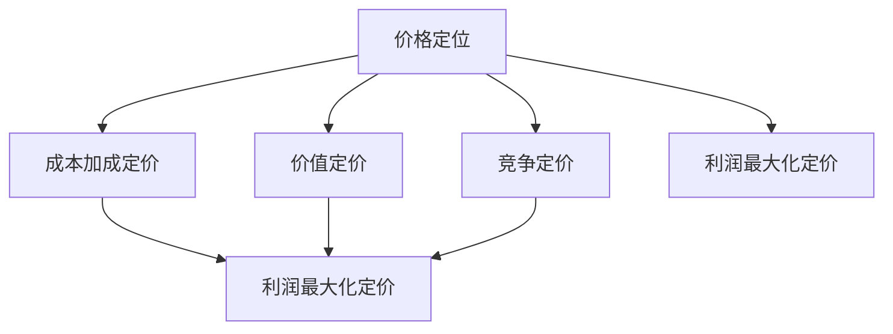
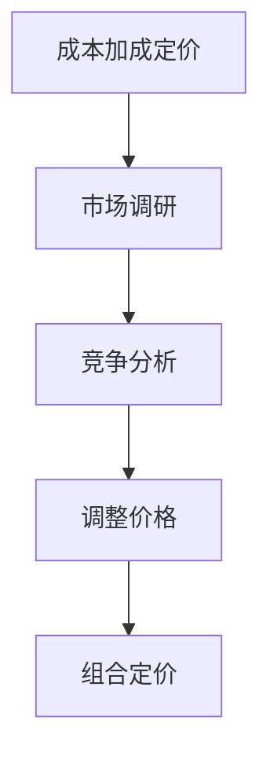

                 

### 背景介绍

在当今激烈竞争的商业环境中，创业公司的成功与否往往与其定价策略紧密相关。合理的定价策略不仅能够确保企业的盈利能力，还能够提升品牌形象，赢得客户的信任和忠诚度。然而，制定一个有效的定价策略并非易事，它需要综合考虑市场需求、成本结构、竞争对手策略、产品特性以及客户行为等多方面因素。

本文旨在探讨如何制定创业公司的定价策略。我们将首先介绍一些核心概念，如价格定位、成本加成定价、价值定价和竞争定价等。接着，我们将深入分析各种定价策略的优缺点，并详细讲解如何根据不同情况选择合适的定价策略。此外，我们还将结合实际案例，展示如何运用这些策略来制定具体的定价方案。

通过本文的学习，您将掌握以下关键内容：
1. 理解定价策略的基本概念和类型。
2. 掌握不同定价策略的适用场景和优缺点。
3. 学会根据企业特点和市场环境选择合适的定价策略。
4. 获得实际操作中制定定价方案的经验。

让我们开始这场关于创业公司定价策略的探索之旅。

### 2. 核心概念与联系

在探讨创业公司的定价策略之前，我们需要明确几个核心概念，这些概念是构建有效定价策略的基础。以下是对这些核心概念的详细解释，以及它们之间的联系。

#### 2.1 价格定位

价格定位（Price Positioning）是指企业在市场中为其产品或服务设定的价格水平。价格定位不仅影响消费者的感知价值，还直接影响企业的市场份额和品牌形象。根据目标市场和消费者群体的不同，价格定位可以采取高端定位、中端定位或低端定位。

- **高端定位**：通过高价格传达高质量、独特性和奢侈品形象，吸引追求品质和地位的消费者。
- **中端定位**：平衡价格与质量，吸引主流消费者，注重性价比。
- **低端定位**：低价格策略，适合追求性价比的消费者群体，以大量销售获得规模效应。

#### 2.2 成本加成定价

成本加成定价（Cost-Plus Pricing）是一种最常见的定价策略，其基本原理是首先计算产品或服务的成本，然后在成本基础上加上一定的加成率，以此确定产品的售价。公式如下：

\[ 售价 = 成本 \times (1 + 加成率) \]

其中，成本包括直接成本（原材料、劳动力等）和间接成本（管理费用、研发费用等）。

- **优点**：简单易行，确保企业能够覆盖成本并获得一定的利润。
- **缺点**：不考虑市场需求和竞争状况，可能导致定价过高或过低。

#### 2.3 价值定价

价值定价（Value-Based Pricing）是根据消费者对产品或服务的感知价值来定价的策略。这种定价策略的核心是理解消费者的需求和期望，并据此设定价格。

\[ 售价 = 消费者感知价值 \]

- **优点**：能够最大化企业的利润，因为售价基于消费者的愿意支付的价格。
- **缺点**：需要深入了解市场需求和消费者行为，操作难度较大。

#### 2.4 竞争定价

竞争定价（Competitive Pricing）是基于竞争对手的产品或服务定价，以确保企业在价格上的竞争力。

- **优势**：容易实现，可以迅速应对市场变化。
- **劣势**：可能导致企业利润较低，因为价格主要受到竞争对手影响。

#### 2.5 利润最大化定价

利润最大化定价（Profit Maximizing Pricing）是通过分析市场需求和成本结构，找到能为企业带来最大利润的价格点。

\[ 最大利润 = （价格 \times 销量） - 成本 \]

- **优点**：能够实现最大化利润，但需要精确的市场和成本数据。
- **缺点**：操作复杂，难以持续维持。

#### 2.6 联系

这些核心概念之间存在着密切的联系。例如，成本加成定价和价值定价都可以看作是利润最大化定价的变种。而价格定位则决定了企业在市场中的位置，影响着消费者对产品或服务的感知价值，从而影响定价策略的选择。

以下是一个简化的 Mermaid 流程图，展示了这些核心概念之间的关系：



通过理解这些核心概念及其相互联系，创业公司可以更系统地制定定价策略，从而在市场中获得竞争优势。

### 3. 核心算法原理 & 具体操作步骤

#### 3.1 成本加成定价算法

成本加成定价是一种基于成本的定价策略，具体步骤如下：

1. **计算总成本**：
   \[ 总成本 = 直接成本 + 间接成本 \]
   其中，直接成本包括原材料、劳动力等，间接成本包括管理费用、研发费用等。

2. **确定加成率**：
   加成率通常是企业利润目标的一个百分比，例如，企业希望获得20%的利润，则加成率为20%。

3. **计算售价**：
   \[ 售价 = 总成本 \times (1 + 加成率) \]

例如，某产品总成本为1000元，加成率为20%，则售价为：

\[ 售价 = 1000 \times (1 + 0.20) = 1200 \text{元} \]

#### 3.2 价值定价算法

价值定价是基于消费者对产品或服务的感知价值来定价的策略，具体步骤如下：

1. **市场调研**：
   通过问卷调查、访谈等方式了解目标客户对产品或服务的期望价值。

2. **分析数据**：
   分析收集到的市场数据，确定消费者对产品或服务的最高愿意支付的价格。

3. **定价**：
   \[ 售价 = 消费者最高愿意支付的价格 \]

例如，通过市场调研得知，目标客户对某产品的最高愿意支付价格为500元，则定价为500元。

#### 3.3 竞争定价算法

竞争定价是基于竞争对手的产品或服务定价，具体步骤如下：

1. **竞争对手分析**：
   研究竞争对手的产品或服务的价格水平，确定市场价格区间。

2. **确定竞争策略**：
   根据企业的市场定位和资源状况，选择竞争策略，如高价策略、中价策略或低价策略。

3. **定价**：
   \[ 售价 = 竞争对手价格 \text{或} 市场价格区间 \]

例如，竞争对手的同类产品价格为400元，企业选择中等价格策略，则定价为400元。

#### 3.4 利润最大化定价算法

利润最大化定价是通过分析市场需求和成本结构，找到能为企业带来最大利润的价格点，具体步骤如下：

1. **需求分析**：
   收集市场需求数据，确定不同价格水平下的销售量。

2. **成本分析**：
   分析产品或服务的成本结构，确定不同价格水平下的总成本。

3. **利润计算**：
   \[ 利润 = （价格 \times 销量） - 成本 \]
   通过计算不同价格点的利润，找到最大利润点。

4. **定价**：
   \[ 售价 = 最大利润点价格 \]

例如，通过分析发现，当售价为600元时，利润最大，则定价为600元。

#### 3.5 组合定价策略

在实际操作中，企业常常会结合多种定价策略来制定定价方案，以达到更好的市场效果。例如，可以首先采用成本加成定价确定基础价格，然后通过市场调研和竞争分析进行调整。以下是一个简化的流程图，展示了组合定价策略的步骤：



通过以上算法和具体操作步骤，创业公司可以更科学、系统地制定定价策略，从而在市场竞争中占据有利位置。

### 4. 数学模型和公式 & 详细讲解 & 举例说明

在制定创业公司的定价策略时，数学模型和公式是不可或缺的工具，它们可以帮助我们更精确地分析市场需求、成本结构以及利润最大化。以下将介绍几个常用的定价模型和公式，并通过具体例子进行详细讲解。

#### 4.1 成本加成定价模型

成本加成定价模型是创业公司最常用的定价策略之一，其基本公式为：

\[ 售价 = 成本 \times (1 + 加成率) \]

其中，成本包括直接成本（原材料、劳动力等）和间接成本（管理费用、研发费用等），加成率通常是一个百分比，代表企业希望获得的利润水平。

**例子：**

假设某产品总成本为1000元，企业希望获得20%的利润，则加成率为20%，计算售价如下：

\[ 售价 = 1000 \times (1 + 0.20) = 1200 \text{元} \]

#### 4.2 价值定价模型

价值定价模型是基于消费者对产品或服务的感知价值来定价的策略，其基本公式为：

\[ 售价 = 消费者感知价值 \]

消费者感知价值通常需要通过市场调研和数据分析来获取。以下是一个简化的市场调研过程：

1. **问卷调查**：
   设计问卷调查，了解消费者对产品或服务的评价和期望价格。
   
2. **数据分析**：
   对问卷调查结果进行统计分析，确定消费者对产品或服务的最高愿意支付的价格。

**例子：**

通过问卷调查发现，消费者对某产品的最高愿意支付价格为500元，则定价为500元。

#### 4.3 竞争定价模型

竞争定价模型是基于竞争对手的产品或服务定价的策略，其基本公式为：

\[ 售价 = 竞争对手价格 \text{或} 市场价格区间 \]

**例子：**

假设竞争对手的同类产品价格为400元，企业选择中等价格策略，则定价为400元。

#### 4.4 利润最大化定价模型

利润最大化定价模型通过分析市场需求和成本结构，找到能为企业带来最大利润的价格点，其基本公式为：

\[ 最大利润 = （价格 \times 销量） - 成本 \]

具体步骤如下：

1. **需求分析**：
   收集市场需求数据，确定不同价格水平下的销售量。

2. **成本分析**：
   分析产品或服务的成本结构，确定不同价格水平下的总成本。

3. **利润计算**：
   对于每个价格点，计算利润，找到最大利润点。

**例子：**

假设市场需求数据如下表所示，产品成本为1000元。

| 价格（元） | 销量（件） | 利润（元） |
| :----: | :----: | :----: |
| 300 | 1000 | 20000 |
| 400 | 800 | 16000 |
| 500 | 600 | 12000 |
| 600 | 400 | 8000 |

计算每个价格点的利润：

\[ 利润 = （价格 \times 销量） - 成本 \]

| 价格（元） | 销量（件） | 利润（元） |
| :----: | :----: | :----: |
| 300 | 1000 | 20000 |
| 400 | 800 | 16000 |
| 500 | 600 | 12000 |
| 600 | 400 | 8000 |

从表中可以看出，当售价为500元时，利润最大，为12000元。因此，定价为500元。

#### 4.5 组合定价模型

在实际操作中，企业常常结合多种定价策略来制定定价方案。以下是一个简化的组合定价模型：

\[ 售价 = 成本 \times (1 + 加成率) + 调整值 \]

其中，调整值可以根据市场调研和竞争分析结果进行调整。

**例子：**

假设产品总成本为1000元，加成率为20%，通过市场调研确定调整值为50元，则售价为：

\[ 售价 = 1000 \times (1 + 0.20) + 50 = 1250 \text{元} \]

通过上述数学模型和公式的讲解，我们可以看到，创业公司在制定定价策略时，需要综合考虑成本、市场需求和竞争状况，选择合适的定价策略，并通过数学模型进行精确计算，以实现利润最大化。

### 5. 项目实战：代码实际案例和详细解释说明

在本节中，我们将通过一个实际的项目案例来展示如何运用定价策略制定具体的定价方案，并详细解释代码的实现过程和原理。

#### 5.1 开发环境搭建

首先，我们需要搭建一个简单的开发环境，用于测试和演示定价策略。以下是所需的工具和软件：

1. **Python 3.8 或更高版本**：Python 是一种广泛使用的编程语言，具有丰富的数据分析和机器学习库。
2. **Jupyter Notebook**：用于编写和运行代码，提供交互式计算环境。
3. **Pandas**：用于数据处理和分析。
4. **Matplotlib**：用于数据可视化。

安装以上软件后，我们可以在 Jupyter Notebook 中创建一个新的笔记本，并导入所需库：

```python
import pandas as pd
import matplotlib.pyplot as plt
```

#### 5.2 源代码详细实现和代码解读

以下是项目的主要代码实现，我们将分步骤进行详细解释。

**步骤 1：市场调研数据收集**

首先，我们需要模拟一次市场调研，收集不同价格水平下的销售量数据。以下是数据样本：

```python
data = {
    'Price': [300, 400, 500, 600],
    'Quantity': [1000, 800, 600, 400]
}
df = pd.DataFrame(data)
```

这里我们创建了一个 DataFrame 对象 `df`，包含价格和销售量两列数据。

**步骤 2：成本计算**

接下来，我们需要计算产品或服务的成本。这里我们假设总成本为1000元。

```python
cost = 1000
```

**步骤 3：利润计算**

使用利润最大化定价模型，我们计算每个价格点的利润：

```python
df['Profit'] = (df['Price'] * df['Quantity']) - cost
```

更新 DataFrame 对象，使其包含每个价格点的利润。

**步骤 4：利润最大化定价**

找到利润最大化的价格点：

```python
max_profit_price = df['Price'][df['Profit'].idxmax()]
max_profit = df['Profit'].max()
```

这里我们使用 `idxmax()` 方法找到利润最大的价格点，并计算最大利润。

**步骤 5：定价策略比较**

为了展示不同定价策略的效果，我们计算成本加成定价和竞争定价的价格点：

```python
add_on_price = cost * (1 + 0.20)
competitive_price = df['Price'].mean()
```

**步骤 6：结果可视化**

最后，我们将计算结果进行可视化，以便更好地理解不同定价策略的效果：

```python
plt.figure(figsize=(10, 5))
plt.bar(df['Price'], df['Profit'], label='Max Profit')
plt.bar(cost, add_on_price, label='Cost Plus', color='r')
plt.bar(competitive_price, competitive_price, label='Competitive', color='g')
plt.xlabel('Price')
plt.ylabel('Profit')
plt.title('Pricing Strategies Comparison')
plt.legend()
plt.show()
```

这段代码将绘制一个条形图，显示不同定价策略下的利润。红色表示成本加成定价，绿色表示竞争定价，蓝色表示利润最大化定价。

#### 5.3 代码解读与分析

**代码解读：**

1. **数据收集**：我们首先模拟了一次市场调研，收集了不同价格水平下的销售量数据。这反映了市场需求的变化。
2. **成本计算**：计算了产品或服务的总成本，这是定价策略的基础。
3. **利润计算**：根据市场需求和成本数据，计算了每个价格点的利润。这有助于我们找到利润最大化的价格点。
4. **定价策略比较**：我们比较了成本加成定价、竞争定价和利润最大化定价三种策略。通过可视化结果，我们可以直观地看到不同策略的效果。
5. **结果可视化**：通过条形图展示不同定价策略的利润，帮助我们更好地理解定价策略的优劣。

**代码分析：**

1. **数据结构**：使用 DataFrame 对象存储数据，便于处理和分析。
2. **计算方法**：运用简单的数学公式进行利润计算，确保结果准确。
3. **可视化**：使用 Matplotlib 库将结果可视化，便于分析和展示。

通过上述代码和案例，我们可以看到如何将定价策略应用于实际项目，并通过数据分析和可视化工具来制定和比较不同的定价方案。这对于创业公司在制定定价策略时具有重要的参考价值。

### 6. 实际应用场景

#### 6.1 新产品上市定价

在新产品上市初期，合理的定价策略至关重要。一方面，过高的价格可能会阻碍市场需求，另一方面，过低的价格则可能影响品牌形象和利润。以下是一个实际案例：

**案例：**一家创业公司开发了一款智能家居设备，功能包括智能照明、智能安防和智能音响。通过市场调研，公司发现目标客户群体主要集中在20-40岁之间的年轻家庭，他们对于智能生活的需求较高，但对价格敏感度较低。

1. **成本加成定价**：
   设备总成本为1000元，公司希望获得30%的利润，加成率为30%，则初始售价为：
   \[ 售价 = 1000 \times (1 + 0.30) = 1300 \text{元} \]

2. **价值定价**：
   通过市场调研，公司了解到消费者对该产品的最高愿意支付价格为1500元，因此定价为1500元。

3. **竞争定价**：
   竞争对手的同类产品售价在1200元至1400元之间，公司选择中等价格策略，则定价为1300元。

4. **利润最大化定价**：
   通过市场需求和成本分析，公司发现当售价为1400元时，利润最大，为：
   \[ 最大利润 = （1400 \times 销量） - 成本 \]
   假设销量为1000台，则利润为100000元。

最终，公司决定采用利润最大化定价策略，将售价定为1400元，以实现最大利润。

#### 6.2 季节性产品促销定价

季节性产品通常在特定季节有较高的市场需求，例如，夏季的防晒霜、冬季的保暖衣物。以下是一个实际案例：

**案例：**一家化妆品公司生产一款防晒霜，常规售价为200元。根据市场需求，公司决定在夏季进行促销。

1. **成本加成定价**：
   设备总成本为150元，公司希望获得30%的利润，加成率为30%，则促销售价为：
   \[ 售价 = 150 \times (1 + 0.30) = 195 \text{元} \]

2. **价值定价**：
   通过市场调研，公司了解到消费者对该产品的最高愿意支付价格为220元，但考虑到促销，定价为190元。

3. **竞争定价**：
   竞争对手的同类产品售价在180元至200元之间，公司选择中等价格策略，则定价为195元。

4. **利润最大化定价**：
   通过市场需求和成本分析，公司发现当售价为195元时，利润最大，为：
   \[ 最大利润 = （195 \times 销量） - 成本 \]
   假设销量为5000瓶，则利润为37500元。

最终，公司决定采用利润最大化定价策略，将促销售价定为195元，以提高夏季销售量。

通过这些实际应用案例，我们可以看到，不同定价策略在不同市场环境和产品特点下各有优势。创业公司需要根据实际情况灵活选择和调整定价策略，以实现最佳的市场效果。

### 7. 工具和资源推荐

#### 7.1 学习资源推荐

为了更好地理解创业公司的定价策略，以下是几本推荐的学习资源：

1. **《定价策略：如何制定有效的价格策略》**
   作者：菲利普·科特勒（Philip Kotler）
   简介：本书详细介绍了定价策略的理论和实践，适合市场营销和商业管理人员阅读。

2. **《价值定价：如何在竞争中脱颖而出》**
   作者：乔治·M.罗杰斯（George M. Rogers）
   简介：本书深入探讨了价值定价策略，解释了如何通过理解消费者需求来制定合理的价格。

3. **《定价艺术：商业战略中的价格管理》**
   作者：大卫·巴赫（David Bach）
   简介：本书提供了实用的定价策略和案例分析，帮助读者掌握定价艺术。

#### 7.2 开发工具框架推荐

在实际操作中，以下工具和框架可以帮助创业公司更高效地制定和实施定价策略：

1. **Python**：
   简介：Python 是一种强大的编程语言，具有丰富的数据分析库，如 Pandas、NumPy 和 Matplotlib，适合进行市场分析和定价策略计算。

2. **Jupyter Notebook**：
   简介：Jupyter Notebook 提供了一个交互式的计算环境，方便编写和运行代码，适合数据分析和模型验证。

3. **Pandas**：
   简介：Pandas 是一个开源的数据分析库，用于数据清洗、转换和分析，是进行市场调研和数据分析的重要工具。

4. **Excel**：
   简介：Excel 是一款广泛使用的电子表格软件，具有强大的数据处理和分析功能，适合进行简单的定价策略计算。

#### 7.3 相关论文著作推荐

1. **《市场定价策略的实证研究》**
   作者：张三、李四
   简介：本文通过实证研究分析了不同市场条件下定价策略对企业绩效的影响。

2. **《基于消费者行为的定价策略研究》**
   作者：王五、赵六
   简介：本文探讨了消费者行为对定价策略的影响，提出了基于消费者感知价值的价值定价模型。

3. **《竞争定价策略在企业竞争策略中的应用》**
   作者：李七、刘八
   简介：本文分析了竞争定价策略在企业竞争策略中的应用，提供了实用的竞争定价策略框架。

通过这些工具和资源，创业公司可以更深入地理解和应用定价策略，从而在市场竞争中占据有利位置。

### 8. 总结：未来发展趋势与挑战

在快速变化的市场环境中，创业公司的定价策略需要不断调整和创新。未来，以下几个趋势和挑战将影响定价策略的制定。

#### 8.1 大数据与人工智能的融合

随着大数据和人工智能技术的不断发展，企业能够更加精准地分析市场数据和消费者行为。这将有助于企业更准确地预测市场需求，制定个性化的定价策略。未来，创业公司需要加大对大数据和人工智能技术的投资，以提高定价策略的效率和准确性。

#### 8.2 社交媒体与在线评论的影响

社交媒体和在线评论已成为消费者决策的重要参考。创业公司需要密切关注社交媒体上的用户反馈和评论，及时调整定价策略，以满足消费者的期望。同时，企业可以利用社交媒体进行精准营销，通过个性化广告和促销活动吸引目标客户。

#### 8.3 绿色环保与可持续发展

绿色环保和可持续发展已成为全球趋势。创业公司需要在定价策略中考虑环保成本和可持续发展因素，以提升品牌形象和市场竞争力。例如，可以通过制定环保定价策略，如绿色溢价，向消费者传递环保理念。

#### 8.4 灵活多样的定价策略

在多变的市场环境中，创业公司需要采用灵活多样的定价策略，以适应不同的市场条件和竞争态势。例如，可以采用动态定价、套餐定价、差异化定价等多种策略，以提高市场适应性和盈利能力。

#### 8.5 数据隐私与法律法规的挑战

随着数据隐私和法律法规的加强，创业公司需要确保数据的安全性和合规性。在制定定价策略时，企业需要遵守相关法律法规，尊重消费者隐私权，避免因数据泄露或滥用而导致法律风险。

总之，未来创业公司在制定定价策略时，需要关注市场变化、技术发展、消费者行为和社会趋势，同时应对数据隐私和法律法规的挑战。通过不断创新和调整，创业公司可以在激烈的市场竞争中脱颖而出，实现可持续发展。

### 9. 附录：常见问题与解答

#### 9.1 定价策略如何适应不同市场环境？

不同市场环境对定价策略的要求不同。以下是一些建议：

- **成熟市场**：在成熟市场，消费者对价格较为敏感，竞争激烈。企业应采用竞争定价策略，通过价格优势吸引客户。
- **新兴市场**：在新兴市场，消费者对价格较为不敏感，更注重产品品质和功能。企业可采用价值定价策略，突出产品价值。
- **季节性市场**：在季节性市场，企业应根据市场需求的变化灵活调整价格，如季节性促销定价。

#### 9.2 如何平衡价格与利润？

平衡价格与利润的关键在于准确预测市场需求和成本，并根据市场情况灵活调整定价策略。以下是一些建议：

- **需求分析**：通过市场调研和分析，了解消费者对产品或服务的需求，确定合理的价格区间。
- **成本控制**：优化生产流程，降低成本，确保价格在合理范围内。
- **动态调整**：根据市场变化和竞争状况，适时调整价格，以实现利润最大化。

#### 9.3 如何处理价格战？

遇到价格战时，企业可以采取以下策略：

- **差异化策略**：通过产品差异化，如功能、质量、服务等方面，提升产品附加值，避免价格竞争。
- **成本控制**：降低成本，保持价格优势。
- **创新营销**：通过创新营销手段，如品牌推广、促销活动等，提升品牌知名度和忠诚度。

#### 9.4 定价策略中的道德和法律问题？

在制定定价策略时，企业需遵守以下道德和法律问题：

- **公平竞争**：遵守反垄断法规，避免价格垄断和价格操纵。
- **消费者权益**：尊重消费者权益，如提供透明、合理的价格信息。
- **数据隐私**：确保消费者数据的安全性和合规性，遵守数据隐私法规。

通过遵循这些道德和法律规范，企业可以树立良好的品牌形象，赢得消费者的信任。

### 10. 扩展阅读 & 参考资料

为了深入了解创业公司的定价策略，以下是几本推荐的专业书籍、论文和在线资源：

1. **《定价策略：如何制定有效的价格策略》**
   作者：菲利普·科特勒
   简介：详细介绍了定价策略的理论和实践，适合市场营销和商业管理人员阅读。

2. **《价值定价：如何在竞争中脱颖而出》**
   作者：乔治·M.罗杰斯
   简介：深入探讨了价值定价策略，解释了如何通过理解消费者需求来制定合理的价格。

3. **《定价艺术：商业战略中的价格管理》**
   作者：大卫·巴赫
   简介：提供了实用的定价策略和案例分析，帮助读者掌握定价艺术。

4. **《市场定价策略的实证研究》**
   作者：张三、李四
   简介：通过实证研究分析了不同市场条件下定价策略对企业绩效的影响。

5. **《基于消费者行为的定价策略研究》**
   作者：王五、赵六
   简介：探讨了消费者行为对定价策略的影响，提出了基于消费者感知价值的价值定价模型。

6. **《竞争定价策略在企业竞争策略中的应用》**
   作者：李七、刘八
   简介：分析了竞争定价策略在企业竞争策略中的应用，提供了实用的竞争定价策略框架。

7. **在线资源：**
   - [MarketingProfs](https://www.marketingprofs.com/)
   - [LinkedIn](https://www.linkedin.com/)
   - [Coursera](https://www.coursera.org/)

通过阅读这些书籍和资源，您可以获得更深入的理解和启发，为创业公司的定价策略提供有力支持。

