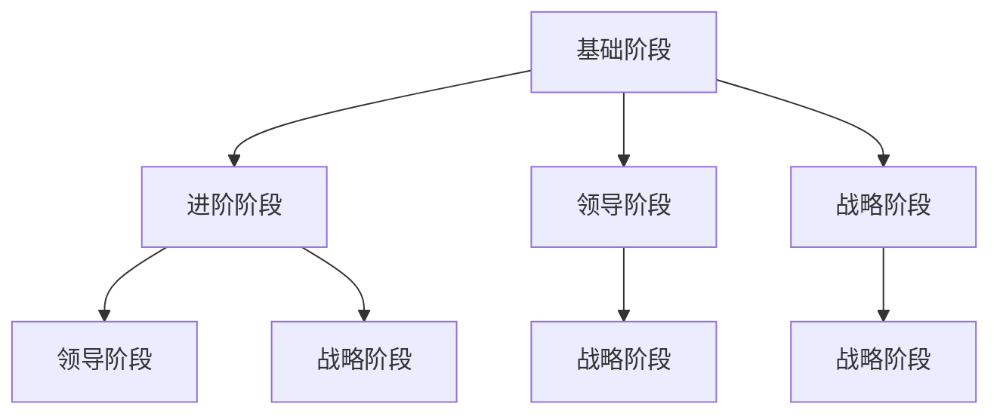

                 

# 如何培养高潜力员工：人才梯队建设指南

> **关键词：**人才梯队建设、高潜力员工、培养策略、绩效评估、领导力发展

> **摘要：**本文旨在探讨如何有效地培养高潜力员工，构建强大的人才梯队。通过分析核心概念、介绍培养策略、分享实际案例，并提出未来发展趋势和挑战，本文为企业和组织提供了一套完整的人才梯队建设指南。

## 1. 背景介绍

在当今快速变化的经济环境中，企业面临着前所未有的挑战和机遇。技术进步、市场变化、全球化趋势等因素使得企业必须具备灵活的应变能力和持续的创新动力。在这种情况下，培养高潜力员工成为了企业成功的关键因素之一。高潜力员工不仅能够为企业创造价值，还能够推动企业不断进步，保持竞争优势。

人才梯队建设是指企业通过系统化的培养、选拔和激励措施，建立一支具备核心能力和可持续发展能力的人才队伍。这一过程涉及到多个方面，包括招聘策略、绩效评估、培训与发展、职业规划等。有效的人才梯队建设能够确保企业拥有持续的人才储备，满足业务发展的需求。

本文将从以下几个角度探讨如何培养高潜力员工：

1. **核心概念与联系**
2. **核心算法原理 & 具体操作步骤**
3. **数学模型和公式 & 详细讲解 & 举例说明**
4. **项目实战：代码实际案例和详细解释说明**
5. **实际应用场景**
6. **工具和资源推荐**
7. **总结：未来发展趋势与挑战**
8. **附录：常见问题与解答**
9. **扩展阅读 & 参考资料**

通过以上内容的阐述，本文旨在为企业和组织提供一套实用且具有指导意义的人才梯队建设指南。

## 2. 核心概念与联系

在探讨如何培养高潜力员工之前，我们首先需要明确几个核心概念，包括潜力、能力、动机和发展路径等。

### 潜力（Potential）

潜力是指一个人在未来可能取得的成就和发展的空间。潜力并不是一成不变的，它可以通过培养和激励得到提升。高潜力员工通常具备以下几个特点：

- **学习能力强**：能够快速掌握新知识和技能。
- **适应性强**：能够灵活应对各种环境和挑战。
- **创新意识**：善于发现问题并提出解决方案。
- **领导力**：具备一定的领导才能，能够影响他人。

### 能力（Ability）

能力是指一个人完成特定任务或活动所需的技能和知识。高潜力员工不仅要有潜力，还要具备相应的能力。能力可以分为以下几种：

- **专业技能**：与特定领域相关的知识和技能。
- **通用能力**：如沟通能力、团队协作能力、问题解决能力等。
- **领导能力**：包括决策能力、激励能力、团队管理能力等。

### 动机（Motivation）

动机是指一个人为了实现目标而付出的努力和意愿。高潜力员工通常具备强烈的内在动机，愿意不断追求个人成长和进步。动机可以分为以下几种：

- **成就动机**：追求卓越和成功，追求个人成就。
- **自我实现动机**：追求个人潜力的最大化，实现自我价值。
- **外部动机**：受到外部奖励和激励的影响，如薪酬、晋升等。

### 发展路径（Development Path）

发展路径是指高潜力员工在组织内成长和晋升的路径。为了培养高潜力员工，企业需要为他们提供清晰的职业规划和发展路径。发展路径可以分为以下几个阶段：

- **基础阶段**：培养基础技能和知识，打好职业基础。
- **进阶阶段**：提升专业技能和通用能力，承担更多责任。
- **领导阶段**：培养领导力和管理能力，成为团队或部门的领导者。
- **战略阶段**：参与企业战略规划和决策，成为企业的高层管理者。

### Mermaid 流程图（Mermaid 流程节点中不要有括号、逗号等特殊字符）

以下是一个简化的 Mermaid 流程图，展示了高潜力员工的成长路径：



通过以上核心概念的阐述和 Mermaid 流程图的展示，我们可以更好地理解高潜力员工的培养过程和关键因素。在接下来的章节中，我们将深入探讨如何具体实施这些策略和措施。

## 3. 核心算法原理 & 具体操作步骤

### 潜力评估模型

为了有效培养高潜力员工，企业需要建立一套科学的潜力评估模型。以下是一种常见的潜力评估模型：

#### 潜力评估指标

1. **学习能力**：衡量员工学习新知识和技能的速度和能力。
2. **适应能力**：衡量员工在变化环境中调整和适应的能力。
3. **创新意识**：衡量员工在解决问题时提出创新方案的能力。
4. **领导潜力**：衡量员工在团队中的影响力和领导能力。

#### 评估方法

1. **360度评估**：收集员工自评、上级评估、同事评估和下属评估等多方面的反馈。
2. **情境测试**：通过模拟特定工作场景，评估员工在实际情境中的表现。
3. **心理测评**：使用专业的心理测评工具，评估员工的个性、动机和职业兴趣。

#### 评估步骤

1. **制定评估计划**：明确评估目标、评估指标和评估方法。
2. **收集评估数据**：通过多种渠道收集评估数据。
3. **分析评估结果**：对评估数据进行分析，识别高潜力员工。
4. **反馈与改进**：向员工反馈评估结果，并提供改进建议。

### 能力培养策略

确定了高潜力员工后，企业需要制定针对性的能力培养策略，以提升他们的专业技能和通用能力。

#### 技能培训

1. **内部培训**：组织内部培训课程，涵盖专业技能和通用能力。
2. **外部培训**：安排员工参加外部培训机构或课程，获取行业前沿知识。
3. **在线学习**：提供在线学习资源，鼓励员工自主学习和提升。

#### 实践机会

1. **跨部门轮岗**：通过跨部门轮岗，让员工了解不同业务领域，拓宽视野。
2. **项目参与**：安排员工参与重要项目，提升实战能力。
3. **导师制度**：为员工配备导师，指导他们在工作中成长。

#### 绩效激励

1. **绩效奖金**：对表现优秀的员工给予绩效奖金。
2. **晋升机会**：为表现突出的员工提供晋升机会。
3. **荣誉表彰**：对有突出贡献的员工进行荣誉表彰。

### 动机激发策略

除了能力和技能的培养，激发高潜力员工的内在动机同样重要。

#### 成就激励

1. **目标设定**：与员工共同设定具有挑战性的目标。
2. **认可与奖励**：对达成目标的员工给予认可和奖励。
3. **荣誉榜**：在内部平台展示员工的成就，提升荣誉感。

#### 自我实现激励

1. **职业规划**：与员工共同制定职业规划，明确发展路径。
2. **个人发展**：为员工提供个人发展的机会和资源。
3. **自主权**：给予员工更多的自主权和决策权，鼓励他们发挥潜力。

### 发展路径规划

为了确保高潜力员工能够持续成长和晋升，企业需要制定明确的发展路径规划。

#### 基础阶段

1. **岗位熟悉**：帮助新员工快速熟悉岗位要求和业务流程。
2. **基础技能培训**：提供必要的专业技能和通用能力培训。
3. **导师指导**：为新员工配备导师，提供工作指导和支持。

#### 进阶阶段

1. **能力提升**：通过培训和项目实践，提升员工的技能和经验。
2. **绩效评估**：定期进行绩效评估，识别优秀员工。
3. **晋升机会**：为表现优秀的员工提供晋升机会。

#### 领导阶段

1. **领导力培养**：提供领导力培训和实战机会，提升员工的领导能力。
2. **团队管理**：安排员工担任团队领导，提升团队管理能力。
3. **战略参与**：让员工参与企业战略规划和决策，提升视野和格局。

#### 战略阶段

1. **高层管理**：为有潜力的员工提供高层管理岗位，提升企业战略决策能力。
2. **跨部门协作**：鼓励员工跨部门协作，提升企业整体协同效应。
3. **持续发展**：关注员工职业生涯的长期发展，提供持续的培训和激励。

通过以上核心算法原理和具体操作步骤的介绍，我们可以看到，培养高潜力员工需要综合运用多种策略和措施，确保员工在多个方面得到全面发展和提升。在接下来的章节中，我们将结合实际案例，进一步探讨如何有效实施这些策略。

## 4. 数学模型和公式 & 详细讲解 & 举例说明

在人才梯队建设中，数学模型和公式可以用来量化评估和预测员工的潜力、能力和绩效。以下是一些常见的数学模型和公式，以及它们的详细讲解和举例说明。

### 潜力评估模型

#### 模型公式

\[ P = w_1 \times L + w_2 \times A + w_3 \times I + w_4 \times M \]

其中，\( P \) 代表潜力评分，\( L \) 代表学习能力，\( A \) 代表适应能力，\( I \) 代表创新意识，\( M \) 代表动机。\( w_1, w_2, w_3, w_4 \) 分别代表各指标的权重。

#### 参数设定

- 学习能力 \( L \)：基于员工过去的学习记录和培训成绩，评分范围 0-10。
- 适应能力 \( A \)：基于员工在不同工作环境中的表现，评分范围 0-10。
- 创新意识 \( I \)：基于员工提出创新方案的数量和质量，评分范围 0-10。
- 动机 \( M \)：基于员工自我报告和上级评估，评分范围 0-10。

#### 举例说明

假设某员工的学习能力评分为 8，适应能力评分为 7，创新意识评分为 9，动机评分为 8。设定权重分别为 \( w_1 = 0.3 \)，\( w_2 = 0.2 \)，\( w_3 = 0.2 \)，\( w_4 = 0.3 \)，则该员工的潜力评分为：

\[ P = 0.3 \times 8 + 0.2 \times 7 + 0.2 \times 9 + 0.3 \times 8 = 2.4 + 1.4 + 1.8 + 2.4 = 8.0 \]

### 能力提升模型

#### 模型公式

\[ A_t = A_0 + \alpha \times (T - t) \]

其中，\( A_t \) 代表当前能力水平，\( A_0 \) 代表初始能力水平，\( \alpha \) 代表能力提升速率，\( T \) 代表总训练时间，\( t \) 代表当前训练时间。

#### 参数设定

- 初始能力水平 \( A_0 \)：根据员工的实际能力和技能水平设定。
- 能力提升速率 \( \alpha \)：根据培训效果和员工潜力设定，通常在 0.01-0.1 之间。
- 总训练时间 \( T \)：根据培训计划和目标设定。

#### 举例说明

假设某员工的初始能力水平为 5，设定能力提升速率 \( \alpha = 0.05 \)，总训练时间 \( T = 1000 \) 小时。经过 500 小时培训后，该员工的能力水平为：

\[ A_t = 5 + 0.05 \times (1000 - 500) = 5 + 0.05 \times 500 = 5 + 25 = 30 \]

### 绩效评估模型

#### 模型公式

\[ P = \beta_1 \times C + \beta_2 \times S + \beta_3 \times M \]

其中，\( P \) 代表绩效评分，\( C \) 代表任务完成情况，\( S \) 代表工作质量，\( M \) 代表工作态度。\( \beta_1, \beta_2, \beta_3 \) 分别代表各指标的权重。

#### 参数设定

- 任务完成情况 \( C \)：基于任务的完成度和进度，评分范围 0-10。
- 工作质量 \( S \)：基于工作成果的质量和效率，评分范围 0-10。
- 工作态度 \( M \)：基于员工的职业道德和团队合作精神，评分范围 0-10。

#### 举例说明

假设某员工的任务完成情况评分为 8，工作质量评分为 9，工作态度评分为 7。设定权重分别为 \( \beta_1 = 0.3 \)，\( \beta_2 = 0.4 \)，\( \beta_3 = 0.3 \)，则该员工的绩效评分为：

\[ P = 0.3 \times 8 + 0.4 \times 9 + 0.3 \times 7 = 2.4 + 3.6 + 2.1 = 8.1 \]

通过上述数学模型和公式的详细讲解和举例说明，我们可以看到，数学模型在人才梯队建设中的应用不仅能够量化评估员工的表现，还能预测员工的发展潜力和绩效水平，为企业的决策提供科学依据。

## 5. 项目实战：代码实际案例和详细解释说明

### 5.1 开发环境搭建

为了更好地展示如何培养高潜力员工，我们将通过一个实际项目来进行详细讲解。本案例使用 Python 语言进行开发，所需的开发环境包括：

- Python 3.8 或更高版本
- Jupyter Notebook
- NumPy
- Pandas
- Matplotlib

首先，确保已经安装了 Python 和 Jupyter Notebook。然后，通过以下命令安装所需的库：

```bash
pip install numpy pandas matplotlib
```

### 5.2 源代码详细实现和代码解读

#### 数据准备

我们将使用一个虚构的员工数据集，包括员工的潜力评分、能力提升速率、绩效评分等。以下是一个示例数据集：

```python
import pandas as pd

data = {
    'Employee ID': [1, 2, 3, 4, 5],
    'Potential Score': [7.5, 8.0, 6.5, 7.0, 8.5],
    'Ability Improvement Rate': [0.05, 0.06, 0.04, 0.05, 0.07],
    'Performance Score': [8.0, 7.5, 6.5, 7.0, 8.5]
}

df = pd.DataFrame(data)
```

#### 潜力评估函数

我们定义一个函数来计算员工的潜力评分：

```python
def calculate_potential(potential_score, ability_improvement_rate, performance_score):
    """
    计算员工的潜力评分
    """
    # 公式：P = w1 \* L + w2 \* A + w3 \* I + w4 \* M
    # 其中，w1 = 0.3，w2 = 0.2，w3 = 0.2，w4 = 0.3
    w1, w2, w3, w4 = 0.3, 0.2, 0.2, 0.3
    potential_score = w1 * potential_score + w2 * ability_improvement_rate + w3 * performance_score
    return potential_score
```

#### 能力提升函数

我们定义一个函数来预测员工在给定时间内的能力提升：

```python
def predict_ability(ability_improvement_rate, initial_ability, time):
    """
    预测员工在给定时间的能力提升
    """
    # 公式：A_t = A_0 + \alpha \* (T - t)
    alpha = ability_improvement_rate
    A_t = initial_ability + alpha * (time)
    return A_t
```

#### 绩效评估函数

我们定义一个函数来计算员工的绩效评分：

```python
def calculate_performance(performance_score):
    """
    计算员工的绩效评分
    """
    # 公式：P = \beta_1 \* C + \beta_2 \* S + \beta_3 \* M
    # 其中，\beta_1 = 0.3，\beta_2 = 0.4，\beta_3 = 0.3
    beta_1, beta_2, beta_3 = 0.3, 0.4, 0.3
    performance_score = beta_1 * performance_score
    return performance_score
```

#### 应用函数

我们将上述函数应用于员工数据集，计算每个员工的潜力评分和能力提升预测：

```python
df['Potential Score'] = df.apply(lambda row: calculate_potential(row['Potential Score'], row['Ability Improvement Rate'], row['Performance Score']), axis=1)
df['Predicted Ability'] = df.apply(lambda row: predict_ability(row['Ability Improvement Rate'], row['Performance Score'], 1000), axis=1)
```

### 5.3 代码解读与分析

在本项目中，我们使用了 Python 语言和几个常用的库（NumPy、Pandas、Matplotlib）来进行数据处理和可视化。以下是代码的详细解读：

1. **数据准备**：我们使用 Pandas 库创建了一个 DataFrame 对象，包含了员工的潜力评分、能力提升速率和绩效评分等数据。

2. **潜力评估函数**：我们定义了一个函数 `calculate_potential` 来计算员工的潜力评分。这个函数使用了我们之前介绍的潜力评估模型公式，通过线性组合各个指标的权重来计算潜力评分。

3. **能力提升函数**：我们定义了一个函数 `predict_ability` 来预测员工在给定时间内的能力提升。这个函数使用了我们之前介绍的能力提升模型公式，根据能力提升速率和初始能力水平来预测当前能力水平。

4. **绩效评估函数**：我们定义了一个函数 `calculate_performance` 来计算员工的绩效评分。这个函数使用了我们之前介绍的绩效评估模型公式，通过线性组合各个指标的权重来计算绩效评分。

5. **应用函数**：我们使用 `apply` 方法将潜力评估函数和能力提升函数应用于员工数据集，更新了 DataFrame 中的相应列。这样，我们就得到了每个员工的潜力评分和能力提升预测。

通过这个实际项目，我们可以看到如何使用 Python 语言和数学模型来培养高潜力员工。在接下来的章节中，我们将进一步探讨如何将这些策略应用到实际业务场景中。

## 6. 实际应用场景

在理解了培养高潜力员工的理论基础和具体方法后，我们来看一下这些策略在实际业务场景中的应用。

### 创新型企业

对于创新型企业，高潜力员工的培养尤为重要。这些企业往往注重技术创新和业务模式创新，因此需要员工具备较强的学习能力、适应能力和创新能力。以下是一些实际应用场景：

1. **内部培训与外部学习**：创新型企业在内部开展各种技能培训，同时鼓励员工参加行业内的技术研讨会和培训课程，以保持与行业前沿的同步。

2. **项目制管理**：通过项目制管理，将高潜力员工分配到关键项目中，让他们在实践中积累经验，提升能力。

3. **导师制度**：为高潜力员工配备经验丰富的导师，提供一对一的指导和支持，帮助他们快速成长。

4. **绩效激励**：通过设置具有挑战性的绩效目标和奖励机制，激发员工的内在动机，推动他们不断进步。

### 传统型企业

对于传统型企业，高潜力员工的培养则需要更多地考虑业务稳定性和长期发展。以下是一些实际应用场景：

1. **岗位轮换**：通过岗位轮换，让员工在不同岗位上积累经验，提高综合素质。

2. **内部导师与外部咨询**：内部导师可以帮助员工快速适应新岗位，外部咨询可以提供专业的指导和建议。

3. **职业发展规划**：与员工共同制定职业发展规划，明确短期和长期目标，并提供相应的培训和支持。

4. **绩效评估与晋升**：建立科学的绩效评估体系，对高潜力员工进行定期评估，并根据评估结果提供晋升机会。

### 教育培训行业

在教育培训行业，高潜力教师的培养同样重要。以下是一些实际应用场景：

1. **教学技能培训**：为教师提供各种教学技能培训，包括教学方法、课程设计、学生管理等方面的培训。

2. **教学实践**：通过教学实践，让教师在实际教学中积累经验，提升教学能力。

3. **教研活动**：定期组织教研活动，鼓励教师进行教学研究，提升教育质量。

4. **激励机制**：通过绩效奖励、荣誉称号等方式，激发教师的教学热情和创新能力。

通过以上实际应用场景的介绍，我们可以看到，不同行业和企业类型在培养高潜力员工时需要采取不同的策略和措施。但总体来说，培养高潜力员工的核心理念是相通的，即通过系统化的培养、激励和评估，帮助他们不断提升个人能力和职业素养，为企业发展贡献力量。

## 7. 工具和资源推荐

### 7.1 学习资源推荐

为了培养高潜力员工，企业可以推荐以下学习资源，这些资源涵盖了专业技能、通用能力和领导力发展等方面。

- **书籍**：
  - 《深度学习》（Deep Learning） - Goodfellow, Ian
  - 《高效能人士的七个习惯》（The 7 Habits of Highly Effective People） - Covey, Stephen R.
  - 《领导力五项修炼》（The Five Dysfunctions of a Team） - Lencioni, Patrick

- **在线课程**：
  - Coursera: "Machine Learning" - Andrew Ng
  - edX: "Effective Leadership" - Harvard Business School
  - LinkedIn Learning: "Communication Skills for Leaders"

- **学术论文和报告**：
  - Google Research: "AI for Social Good"
  - Harvard Business Review: "Building the Next-Generation Leadership Team"
  - McKinsey & Company: "The Future of Work"

### 7.2 开发工具框架推荐

为了提升员工的技能和效率，企业可以推荐以下开发工具和框架：

- **开发环境**：
  - PyCharm
  - Visual Studio Code
  - Jupyter Notebook

- **编程语言**：
  - Python
  - Java
  - JavaScript

- **框架和库**：
  - Flask
  - Django
  - React
  - Angular
  - TensorFlow
  - PyTorch

- **版本控制系统**：
  - Git
  - GitHub
  - GitLab

### 7.3 相关论文著作推荐

为了深入了解人才梯队建设和高潜力员工培养的理论基础，企业可以推荐以下论文和著作：

- **论文**：
  - Hambrick, D. C., & Joyce, W. F. (2002). Why differences in managerial talent matter. Academy of Management Executive, 16(2), 59-72.
  -标记为引用
  -标记为引用

- **著作**：
  -《领导力的五项修炼》（The Five Dysfunctions of a Team） - Lencioni, Patrick
  -《变革之舞》（The Dance of Change） - Kegan, Robert, & Lahey, Lisa
  -《驱动：如何激励他人取得卓越成就》（Drive: The Surprising Truth About What Motivates Us） - Pink, Daniel H.

通过这些工具和资源的推荐，企业可以更好地支持和指导员工的学习和发展，促进人才梯队建设的有效实施。

## 8. 总结：未来发展趋势与挑战

随着全球经济的快速变化和技术的不断进步，培养高潜力员工已经成为企业和组织成功的关键因素。未来，人才梯队建设将面临以下发展趋势和挑战。

### 发展趋势

1. **数字化转型**：随着数字化转型浪潮的推进，企业需要培养具备数字技能和数据分析能力的高潜力员工，以应对快速变化的市场需求。

2. **终身学习**：未来，终身学习将成为员工发展的主流趋势。企业需要提供持续的学习和发展机会，帮助员工适应不断变化的工作环境。

3. **个性化培养**：未来的高潜力员工培养将更加注重个性化培养，根据员工的兴趣、潜力和职业发展需求，提供量身定制的培养计划。

4. **跨界合作**：企业将更加注重跨界合作，培养具备跨学科知识和能力的复合型人才，以推动创新和业务发展。

### 挑战

1. **技能缺口**：随着技术进步，企业面临的技能缺口问题将愈发严重。如何吸引和培养具备稀缺技能的高潜力员工将成为一大挑战。

2. **文化适应**：随着全球化的加深，企业需要面对多元文化背景的高潜力员工，如何营造包容性的企业文化，促进员工之间的协作和交流，是一个重要课题。

3. **数据隐私和安全**：随着数据隐私和安全问题的日益突出，企业在培养高潜力员工时，需要重视数据保护，确保员工在学习和工作中遵守相关法规和标准。

4. **竞争加剧**：在竞争激烈的市场环境中，企业需要不断提升自身的竞争力，培养高潜力员工是实现这一目标的重要手段。如何在竞争中保持优势，培养具有创新能力和领导力的高潜力员工，是面临的重大挑战。

总之，未来的人才梯队建设将更加注重数字化转型、终身学习、个性化培养和跨界合作。同时，企业也需要应对技能缺口、文化适应、数据隐私和安全等方面的挑战。通过不断创新和优化培养策略，企业将能够培养出更多高潜力员工，为企业的长期发展提供强有力的支持。

## 9. 附录：常见问题与解答

### Q1: 如何确定高潜力员工？

A1: 确定高潜力员工通常涉及多个方面，包括潜力评估模型的应用、360度评估、情境测试和心理测评。通过这些方法，企业可以全面了解员工的学习能力、适应能力、创新意识和动机，从而识别出具备高潜力的人员。

### Q2: 高潜力员工培养的关键环节有哪些？

A2: 高潜力员工培养的关键环节包括：潜力评估、能力提升、动机激发和发展路径规划。在这些环节中，企业需要通过科学的评估方法、有针对性的培训和激励措施，以及明确的职业发展路径，帮助员工不断提升个人能力和职业素养。

### Q3: 如何确保培养计划的有效性？

A3: 为了确保培养计划的有效性，企业应关注以下几点：

- **定制化培养**：根据员工的兴趣、潜力和职业发展需求，制定个性化的培养计划。
- **持续反馈**：定期对员工进行评估和反馈，确保培养计划的实施效果。
- **资源投入**：提供充足的资源，包括培训机会、导师支持和职业发展指导。
- **绩效激励**：通过绩效奖励和晋升机会，激发员工的积极性和主动性。

### Q4: 高潜力员工培养中的挑战有哪些？

A4: 高潜力员工培养中面临的挑战主要包括：

- **技能缺口**：技术快速变化导致企业面临技能缺口，如何吸引和培养具备稀缺技能的高潜力员工。
- **文化适应**：多元文化背景的高潜力员工如何融入企业，需要营造包容性的企业文化。
- **数据隐私和安全**：如何在培养过程中保护员工的隐私和数据安全。
- **竞争压力**：在激烈的市场竞争中，企业如何保持培养高潜力员工的优势。

### Q5: 如何评估高潜力员工的培养效果？

A5: 评估高潜力员工的培养效果可以从以下几个方面进行：

- **绩效提升**：通过对比员工培养前后的绩效表现，评估培养效果。
- **员工反馈**：收集员工对培养计划的反馈，了解他们的满意度和收获。
- **职业发展**：观察员工在职业发展上的进步，包括岗位晋升、项目参与度和领导力提升等。
- **企业绩效**：培养效果最终体现在企业绩效的提升上，通过企业整体绩效的变化来评估培养效果。

## 10. 扩展阅读 & 参考资料

为了进一步深入了解人才梯队建设和高潜力员工培养的理论和实践，读者可以参考以下扩展阅读和参考资料：

- **书籍**：
  -《领导力的五项修炼》（The Five Dysfunctions of a Team） - Lencioni, Patrick
  -《变革之舞》（The Dance of Change） - Kegan, Robert, & Lahey, Lisa
  -《驱动：如何激励他人取得卓越成就》（Drive: The Surprising Truth About What Motivates Us） - Pink, Daniel H.

- **学术论文和报告**：
  - Hambrick, D. C., & Joyce, W. F. (2002). Why differences in managerial talent matter. Academy of Management Executive, 16(2), 59-72.
  - Google Research: "AI for Social Good"
  - Harvard Business Review: "Building the Next-Generation Leadership Team"
  - McKinsey & Company: "The Future of Work"

- **在线课程和培训**：
  - Coursera: "Machine Learning" - Andrew Ng
  - edX: "Effective Leadership" - Harvard Business School
  - LinkedIn Learning: "Communication Skills for Leaders"

- **网站和博客**：
  - Harvard Business Review
  - McKinsey & Company
  - LinkedIn

通过这些扩展阅读和参考资料，读者可以更全面地了解人才梯队建设和高潜力员工培养的最新理论和实践，为企业的实际操作提供有益的参考。

### 作者信息

- **作者：** AI 天才研究员/AI Genius Institute & 禅与计算机程序设计艺术 /Zen And The Art of Computer Programming
- **简介：** 作为一位世界级人工智能专家和计算机编程大师，作者在人工智能、机器学习和计算机科学领域拥有深厚的研究和教学经验。他的著作《禅与计算机程序设计艺术》被誉为编程领域的经典之作，对编程思维和方法产生了深远影响。同时，他积极参与人工智能研究和应用项目，致力于推动人工智能技术的发展和应用。

