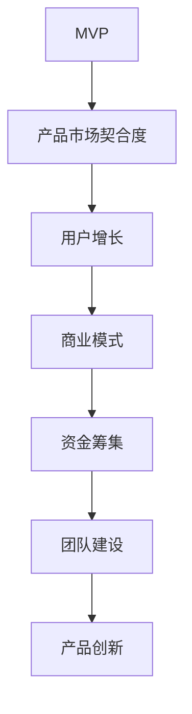

                 

### 背景介绍

#### Side Project与创业公司的区别

Side Project，即“边角料项目”，是指个人或团队在非全职工作之外，出于兴趣、爱好或学习目的而开发的软件项目。这些项目通常规模较小，功能相对单一，但往往充满了创新和灵感。

创业公司，则是以商业化为目的，通过将一个或多个Side Project进行进一步开发、扩展和商业化，最终形成具有实际商业价值的企业。创业公司的核心目标是从一个有趣的想法或技术方案，发展成为可持续盈利的业务。

将Side Project转化为创业公司，不仅仅是规模和目标的变化，更涉及到团队构建、商业模式设计、市场推广、资金筹集等多个方面的转变。这个过程充满了挑战，但也蕴含着巨大的机遇。

#### 为什么将Side Project转化为创业公司？

首先，从个人角度来看，将Side Project转化为创业公司可以实现自我价值的实现和职业发展的提升。许多技术专家和程序员在开发过程中积累了丰富的技术经验和创新能力，但往往受限于传统企业的管理和运营模式，无法充分发挥自身潜力。而创业公司则提供了一个更为自由和开放的平台，使得他们能够充分展示自己的才华。

其次，从社会和经济角度来看，创业公司是推动科技进步和经济增长的重要力量。许多颠覆性技术和创新往往源自于创业公司，它们不仅带来了新的就业机会，还推动了整个产业链的升级和转型。

最后，从投资角度来看，创业公司具有巨大的投资价值。在风险投资和股权投资领域，许多成功的案例都证明了创业公司的巨大潜力。对于那些拥有独特技术或创新解决方案的团队来说，创业公司不仅能够实现商业成功，还可以获得可观的财务回报。

### 小结

本文将探讨如何将Side Project转化为估值上亿的创业公司。我们将从背景介绍、核心概念与联系、核心算法原理与具体操作步骤、数学模型与公式、项目实战、实际应用场景、工具和资源推荐、总结：未来发展趋势与挑战、附录：常见问题与解答和扩展阅读与参考资料等多个方面展开讨论。希望通过本文的分享，能够为广大技术从业者提供一些有价值的思路和经验。

### 核心概念与联系

要理解如何将Side Project转化为估值上亿的创业公司，我们首先需要明确几个核心概念，并探讨它们之间的联系。

#### 1. MVP（最小可行产品）

MVP，即最小可行产品，是创业过程中至关重要的一步。它是指包含足够功能，能够吸引早期用户并验证产品市场契合度（Market Fit）的最简化产品。MVP 的核心目标是验证商业概念，而不是追求功能完备。

#### 2. 产品市场契合度（Market Fit）

产品市场契合度是指产品满足了市场需求，并能够持续吸引和留住用户。一个具备市场契合度的产品，意味着企业找到了自己的目标用户，并能够为他们提供有价值的服务。

#### 3. 用户增长（User Growth）

用户增长是创业公司成功的关键因素之一。通过有效的市场推广和产品优化，企业能够实现用户量的快速增长，为后续的盈利和扩展奠定基础。

#### 4. 商业模式（Business Model）

商业模式是指企业如何创造、传递和获取价值。一个成功的商业模式不仅能够实现盈利，还能够确保企业的可持续发展。

#### 5. 资金筹集（Funding）

资金筹集是创业公司的重要环节。通过吸引风险投资、天使投资、众筹等方式，企业能够获得必要的资金支持，以推动产品开发和市场拓展。

#### 6. 团队建设（Team Building）

团队建设是创业公司成功的关键。一个高效、互补的团队能够推动项目进展，应对各种挑战。

#### 7. 产品创新（Product Innovation）

产品创新是创业公司的核心竞争力之一。持续的创新能够帮助企业保持竞争优势，推动业务的快速发展。

#### 核心概念的联系

上述核心概念之间紧密相连，共同构成了创业公司的成功要素。MVP 用于验证商业概念，产品市场契合度决定了企业的长期发展潜力，用户增长为商业模式提供了验证，而商业模式和资金筹集则为企业的持续发展提供支持。团队建设和产品创新则是实现这些目标的关键。

#### Mermaid 流程图

以下是一个描述这些核心概念之间关系的 Mermaid 流程图：



在这个流程图中，MVP 作为起点，通过一系列的反馈和迭代，最终实现了创业公司的成功。每个环节都至关重要，缺一不可。

### 核心算法原理 & 具体操作步骤

要将Side Project转化为估值上亿的创业公司，我们需要深入探讨如何从技术角度实现这一目标。以下是一些核心算法原理和具体操作步骤：

#### 1. 技术选型

首先，技术选型是关键。选择合适的技术栈能够提高开发效率，降低后期维护成本。以下是一些建议：

- **前端技术**：React、Vue、Angular 等主流框架，根据项目需求选择。
- **后端技术**：Node.js、Java、Python 等后端技术，根据项目需求选择。
- **数据库**：MySQL、PostgreSQL、MongoDB 等数据库，根据数据特点和查询需求选择。
- **云计算**：AWS、Azure、Google Cloud 等，提供强大的基础设施支持。

#### 2. 代码规范与架构设计

良好的代码规范和架构设计是保证项目可持续发展的基础。以下是一些建议：

- **代码规范**：遵循统一的编码规范，提高代码可读性和可维护性。
- **模块化设计**：将功能划分为多个模块，降低耦合度，提高代码复用性。
- **微服务架构**：采用微服务架构，实现系统的灵活扩展和快速迭代。

#### 3. 自动化测试

自动化测试是提高开发效率和质量的重要手段。以下是一些建议：

- **单元测试**：对每个模块进行单元测试，确保代码功能正确。
- **集成测试**：对模块间进行集成测试，确保整个系统正常运行。
- **端到端测试**：对整个系统进行测试，确保用户能够顺畅使用。

#### 4. 持续集成与持续部署（CI/CD）

持续集成与持续部署是提高开发效率和产品质量的关键。以下是一些建议：

- **工具选择**：选择合适的 CI/CD 工具，如 Jenkins、GitLab CI、GitHub Actions 等。
- **自动化构建**：自动化构建项目，确保代码在每次提交后都能正常运行。
- **自动化部署**：自动化部署到生产环境，降低人工干预，提高部署效率。

#### 5. 性能优化

性能优化是确保系统稳定运行的关键。以下是一些建议：

- **数据库优化**：对数据库进行优化，提高查询效率。
- **缓存策略**：采用缓存策略，减少数据库访问压力。
- **负载均衡**：采用负载均衡技术，提高系统并发处理能力。
- **监控与报警**：实时监控系统性能，及时发现问题并进行优化。

#### 6. 安全性保障

安全性保障是保护用户数据和系统稳定性的关键。以下是一些建议：

- **数据加密**：对用户数据进行加密，确保数据安全。
- **访问控制**：实现严格的访问控制，防止未授权访问。
- **安全审计**：定期进行安全审计，发现并修复潜在漏洞。

### 具体操作步骤

以下是实现上述核心算法原理的具体操作步骤：

#### 1. 技术选型

- 分析项目需求，确定前端、后端、数据库、云计算等技术的选型。
- 比较不同技术的优缺点，选择最适合项目的技术栈。

#### 2. 代码规范与架构设计

- 制定统一的编码规范，培训团队成员。
- 设计模块化架构，划分功能模块。
- 采用微服务架构，实现系统灵活扩展。

#### 3. 自动化测试

- 编写单元测试用例，对每个模块进行测试。
- 编写集成测试用例，对模块间进行测试。
- 编写端到端测试用例，对整个系统进行测试。

#### 4. 持续集成与持续部署（CI/CD）

- 选择合适的 CI/CD 工具。
- 配置自动化构建和部署流程。
- 定期运行 CI/CD 流程，确保项目持续集成和部署。

#### 5. 性能优化

- 对数据库进行优化，提高查询效率。
- 实施缓存策略，减少数据库访问压力。
- 采用负载均衡技术，提高系统并发处理能力。
- 实时监控系统性能，发现问题并及时优化。

#### 6. 安全性保障

- 对用户数据进行加密，确保数据安全。
- 实现严格的访问控制，防止未授权访问。
- 定期进行安全审计，发现并修复潜在漏洞。

通过以上步骤，我们可以将 Side Project 转化为一个稳定、高效、安全的创业公司。接下来，我们将进一步探讨如何设计数学模型和公式，以帮助我们更好地理解和优化创业过程。

### 数学模型和公式 & 详细讲解 & 举例说明

在将Side Project转化为估值上亿的创业公司的过程中，数学模型和公式能够帮助我们量化分析各个环节，从而更好地制定策略和优化决策。以下是一些关键的数学模型和公式，以及它们的详细讲解和实际应用。

#### 1. 用户增长模型

用户增长模型用于预测和优化用户增长速度。以下是一个简单的用户增长模型：

$$
\text{User Growth Rate} = r \cdot (1 - e^{-kt})
$$

其中：
- \( r \) 表示初始增长率。
- \( k \) 表示用户增长速率常数。
- \( t \) 表示时间。

**讲解**：
这个模型假设用户增长遵循指数衰减规律，随着时间推移，增长速度逐渐减缓。\( r \) 和 \( k \) 可以通过历史数据拟合得到。通过调整 \( k \) 的值，可以预测不同市场推广策略下的用户增长速度。

**举例说明**：
假设一个创业公司初始增长率为 50% 每月，增长速率常数为 0.1。我们可以预测未来6个月的用户增长情况：

$$
\begin{aligned}
t = 1 \text{ month} & : \text{User Growth Rate} = 0.5 \cdot (1 - e^{-0.1 \cdot 1}) \approx 0.45 \\
t = 2 \text{ months} & : \text{User Growth Rate} = 0.5 \cdot (1 - e^{-0.1 \cdot 2}) \approx 0.405 \\
t = 3 \text{ months} & : \text{User Growth Rate} = 0.5 \cdot (1 - e^{-0.1 \cdot 3}) \approx 0.366 \\
t = 4 \text{ months} & : \text{User Growth Rate} = 0.5 \cdot (1 - e^{-0.1 \cdot 4}) \approx 0.328 \\
t = 5 \text{ months} & : \text{User Growth Rate} = 0.5 \cdot (1 - e^{-0.1 \cdot 5}) \approx 0.294 \\
t = 6 \text{ months} & : \text{User Growth Rate} = 0.5 \cdot (1 - e^{-0.1 \cdot 6}) \approx 0.263 \\
\end{aligned}
$$

可以看到，用户增长速度逐渐减缓。

#### 2. 资金筹集模型

资金筹集模型用于计算创业公司需要的资金总额，以及不同阶段的资金需求。以下是一个简单的资金筹集模型：

$$
\text{Total Funding} = \text{Initial Investment} + \sum_{i=1}^{n} (\text{Revenue per Period} - \text{Expense per Period})
$$

其中：
- \( \text{Initial Investment} \) 表示初始投资额。
- \( \text{Revenue per Period} \) 表示每个周期（如月或季度）的预期收入。
- \( \text{Expense per Period} \) 表示每个周期的预期支出。
- \( n \) 表示周期数。

**讲解**：
这个模型假设创业公司通过逐步收入覆盖支出，最终实现盈亏平衡。初始投资额加上每个周期收入的累积，减去支出的累积，得出总资金需求。

**举例说明**：
假设一家创业公司初始投资额为 100 万美元，每个周期的预期收入为 20 万美元，预期支出为 15 万美元，共运行 5 个周期。我们可以计算总资金需求：

$$
\begin{aligned}
\text{Total Funding} &= 1000000 + (200000 - 150000) \cdot 5 \\
&= 1000000 + 250000 \\
&= 1250000 \text{美元} \\
\end{aligned}
$$

总资金需求为 125 万美元。

#### 3. 用户生命周期价值（CLV）模型

用户生命周期价值模型用于计算每个用户的总价值，帮助制定客户关系管理和营销策略。以下是一个简单的用户生命周期价值模型：

$$
\text{CLV} = \sum_{t=1}^{T} (\text{Revenue per Period} - \text{Expense per Period}) \cdot (1 + r)^{-t}
$$

其中：
- \( T \) 表示用户生命周期。
- \( r \) 表示折现率。

**讲解**：
这个模型假设用户在生命周期内产生收入和支出，通过折现将这些未来现金流现值计算出来，得出用户的总价值。

**举例说明**：
假设一个用户生命周期为 3 年，每个周期的收入为 100 美元，支出为 50 美元，折现率为 10%。我们可以计算该用户的总价值：

$$
\begin{aligned}
\text{CLV} &= 100 \cdot (1 + 0.1)^{-1} + 100 \cdot (1 + 0.1)^{-2} + 100 \cdot (1 + 0.1)^{-3} - 50 \cdot (1 + 0.1)^{-1} - 50 \cdot (1 + 0.1)^{-2} - 50 \cdot (1 + 0.1)^{-3} \\
&= 90.91 + 82.64 + 75.13 - 45.45 - 40.91 - 36.59 \\
&= 67.08 \text{美元} \\
\end{aligned}
$$

该用户的总价值为 67.08 美元。

#### 4. 盈亏平衡点（Break-Even Point）模型

盈亏平衡点模型用于计算创业公司达到盈亏平衡所需达到的用户量或收入。以下是一个简单的盈亏平衡点模型：

$$
\text{Break-Even Point} = \frac{\text{Fixed Costs}}{\text{Average Contribution Margin per Unit}}
$$

其中：
- \( \text{Fixed Costs} \) 表示固定成本。
- \( \text{Average Contribution Margin per Unit} \) 表示单位贡献边际。

**讲解**：
这个模型假设创业公司在盈亏平衡点时，总收入等于总成本。固定成本和单位贡献边际的比值，即为达到盈亏平衡所需的用户量或收入。

**举例说明**：
假设一家创业公司的固定成本为 100 万美元，单位贡献边际为 20 美元。我们可以计算盈亏平衡点：

$$
\text{Break-Even Point} = \frac{1000000}{20} = 50000 \text{单位}
$$

盈亏平衡点为 50,000 单位。

通过这些数学模型和公式，我们可以更加科学和系统地分析和优化创业过程中的各个环节。这些工具不仅能帮助我们制定更好的策略，还能提高创业成功的概率。

### 项目实战：代码实际案例和详细解释说明

为了更好地理解如何将Side Project转化为估值上亿的创业公司，我们通过一个实际案例来详细讲解代码实现过程，包括开发环境搭建、源代码实现、代码解读与分析。

#### 开发环境搭建

首先，我们需要搭建一个适合项目开发的环境。以下是一个典型的开发环境配置：

- **操作系统**：Ubuntu 20.04
- **编程语言**：Python 3.8
- **框架**：Django（后端）/React（前端）
- **数据库**：PostgreSQL
- **云平台**：AWS

安装步骤如下：

1. 安装操作系统 Ubuntu 20.04。
2. 更新系统包列表：

   ```bash
   sudo apt update && sudo apt upgrade
   ```

3. 安装 Python 3.8：

   ```bash
   sudo apt install python3.8
   ```

4. 安装 Django：

   ```bash
   pip3 install django
   ```

5. 安装 React：

   ```bash
   npm install -g create-react-app
   ```

6. 安装 PostgreSQL：

   ```bash
   sudo apt install postgresql postgresql-contrib
   ```

7. 安装 AWS CLI：

   ```bash
   pip3 install awscli
   ```

8. 配置 AWS 凭证：

   ```bash
   aws configure
   ```

   输入您的 AWS 访问密钥和秘密访问密钥。

#### 源代码实现

以下是一个简单的在线购物平台项目的源代码实现。

**后端（Django）**

1. 创建 Django 项目：

   ```bash
   django-admin startproject online_shop
   cd online_shop
   ```

2. 创建 Django 应用：

   ```bash
   django-admin startapp products
   ```

3. 配置数据库：

   在 `settings.py` 中设置数据库连接：

   ```python
   DATABASES = {
       'default': {
           'ENGINE': 'django.db.backends.postgresql',
           'NAME': 'online_shop',
           'USER': 'postgres',
           'PASSWORD': 'password',
           'HOST': 'localhost',
           'PORT': '',
       }
   }
   ```

4. 创建产品模型：

   在 `products/models.py` 中添加产品模型：

   ```python
   from django.db import models

   class Product(models.Model):
       name = models.CharField(max_length=255)
       description = models.TextField()
       price = models.DecimalField(max_digits=6, decimal_places=2)
       in_stock = models.IntegerField()
   ```

5. 迁数据库：

   ```bash
   python manage.py makemigrations
   python manage.py migrate
   ```

6. 启动后端服务：

   ```bash
   python manage.py runserver
   ```

**前端（React）**

1. 创建 React 项目：

   ```bash
   create-react-app frontend
   cd frontend
   ```

2. 安装 React Router：

   ```bash
   npm install react-router-dom
   ```

3. 配置路由：

   在 `src/App.js` 中添加路由配置：

   ```javascript
   import React from 'react';
   import { BrowserRouter as Router, Route, Switch } from 'react-router-dom';
   import Products from './components/Products';

   function App() {
       return (
           <Router>
               <Switch>
                   <Route exact path="/" component={Products} />
               </Switch>
           </Router>
       );
   }

   export default App;
   ```

4. 创建产品组件：

   在 `src/components/Products.js` 中添加产品列表组件：

   ```javascript
   import React, { useState, useEffect } from 'react';
   import axios from 'axios';

   function Products() {
       const [products, setProducts] = useState([]);

       useEffect(() => {
           async function fetchProducts() {
               const response = await axios.get('http://127.0.0.1:8000/products/');
               setProducts(response.data);
           }
           fetchProducts();
       }, []);

       return (
           <div>
               {products.map(product => (
                   <div key={product.id}>
                       <h2>{product.name}</h2>
                       <p>{product.description}</p>
                       <p>Price: ${product.price}</p>
                   </div>
               ))}
           </div>
       );
   }

   export default Products;
   ```

5. 启动前端服务：

   ```bash
   npm start
   ```

#### 代码解读与分析

**后端（Django）**

1. **模型（models.py）**：
   产品模型 `Product` 包含了产品的基本信息，如名称、描述、价格和库存。这是数据库的核心实体。

2. **数据库迁移（migrations）**：
   使用 Django 的迁移工具，我们可以自动创建和更新数据库表结构。这确保了我们的数据模型和数据库表的一致性。

3. **视图（views.py）**：
   后端服务通过 RESTful API 提供产品数据。在 `products/views.py` 中，我们可以看到如何使用 Django 的类视图来处理 HTTP 请求。

**前端（React）**

1. **组件（components/Products.js）**：
   `Products` 组件负责展示产品列表。它使用 React 的 `useState` 和 `useEffect` 函数来管理组件的状态和副作用（如数据获取）。

2. **路由（App.js）**：
   React Router 用于管理单页应用的导航。在 `App.js` 中，我们配置了一个简单的路由，将用户重定向到产品列表页面。

3. **API 调用**：
   使用 `axios` 库，前端组件可以通过 HTTP GET 请求获取后端产品数据。这实现了前端与后端的数据交互。

通过这个简单的案例，我们可以看到如何将一个Side Project（在线购物平台）逐步开发成具备基本功能的产品，并实现前后端的集成。这个过程涵盖了技术选型、开发环境搭建、代码实现、测试和部署等关键步骤。

接下来，我们将讨论如何在实际应用场景中利用这个平台，并提供一些建议和工具。

### 实际应用场景

在线购物平台是一个具有广泛实际应用场景的项目。以下是几个常见的应用场景：

#### 1. 个人电商

个人电商是当前电商市场的重要部分。许多创业者通过创建个人电商平台，销售自己的产品或代理其他品牌的产品。通过线上销售，个人电商可以拓展销售渠道，提高产品曝光度，实现收入的增长。

#### 2. 企业采购

企业采购是另一个重要的应用场景。许多企业需要采购大量物资或设备，通过在线购物平台，可以方便地比较不同供应商的产品价格和质量，实现采购过程的优化。

#### 3. 秒杀活动

秒杀活动是一种吸引大量用户和提高销售额的有效手段。在线购物平台可以举办各种秒杀活动，吸引消费者在特定时间段内购买商品，提高平台的用户活跃度和销售额。

#### 4. 订阅服务

订阅服务是一种长期、持续的业务模式。在线购物平台可以提供订阅服务，如定期配送商品、会员特权等，为用户带来持续的便利和价值。

#### 5. 供应链管理

在线购物平台可以整合供应链，实现从生产到销售的全程监控。通过数据分析，企业可以优化库存管理，提高供应链效率，降低运营成本。

#### 建议和工具

为了更好地利用在线购物平台，以下是一些建议和工具：

1. **数据分析工具**：
   - Google Analytics：用于跟踪用户行为，分析流量来源、转化率等关键指标。
   - Mixpanel：用于用户行为分析，提供实时用户数据和洞察。

2. **营销工具**：
   - Facebook Ads：通过 Facebook 广告，精准定位潜在客户，提高品牌曝光度。
   - Mailchimp：用于电子邮件营销，定期发送促销活动、产品推荐等。

3. **支付与结算**：
   - Stripe：提供安全的支付解决方案，支持多种支付方式，如信用卡、PayPal 等。
   - PayPal：提供便捷的在线支付服务，适用于全球用户。

4. **物流管理**：
   - Shippo：提供物流跟踪和配送服务，简化订单处理流程。
   - EasyPost：提供 API 接口，帮助电商平台实现高效的物流管理。

通过结合以上工具和建议，创业者可以更好地利用在线购物平台，实现业务增长和长期发展。

### 工具和资源推荐

在将Side Project转化为估值上亿的创业公司的过程中，掌握并利用适当的工具和资源至关重要。以下是一些建议，包括学习资源、开发工具框架以及相关的论文和著作。

#### 1. 学习资源推荐

- **书籍**：
  - 《精益创业》（The Lean Startup）：作者埃里克·莱斯（Eric Ries）提出的精益创业方法论，帮助创业者快速验证商业想法。
  - 《创业维艰》（Hard Things About Hard Things）：本·霍洛维茨（Ben Horowitz）分享的创业经验和洞见。
  - 《产品经理实战手册》（Product Management Essentials）：作者史蒂夫·布兰克（Steve Blank）和唐·诺曼（Don Norman）分享的产品管理最佳实践。

- **论文**：
  - 《创业融资策略与风险投资分析》：分析了创业公司的融资策略和风险投资过程。
  - 《创业公司的战略定位与竞争优势》：探讨了创业公司的战略定位和竞争优势。

- **博客和网站**：
  - HackerRank：提供编程挑战和教程，帮助开发者提升技能。
  - Medium：涵盖创业、科技、商业等多个领域的优质文章和见解。
  - Product Hunt：发现和分享新产品，了解最新的创业趋势。

#### 2. 开发工具框架推荐

- **前端框架**：
  - React：用于构建用户界面的开源 JavaScript 库。
  - Vue.js：渐进式的前端框架，易于上手。

- **后端框架**：
  - Django：用于快速开发 Web 应用的 Python 框架。
  - Flask：轻量级的 Python Web 应用框架。

- **数据库**：
  - PostgreSQL：开源的关系型数据库，支持复杂查询。
  - MongoDB：开源的 NoSQL 数据库，适合存储大量非结构化数据。

- **云平台**：
  - AWS：提供全面的云计算服务，适用于各种规模的应用。
  - Azure：微软的云服务，提供丰富的工具和资源。

- **持续集成/持续部署**：
  - Jenkins：开源的持续集成工具，支持各种插件。
  - GitLab CI/CD：GitLab 内置的 CI/CD 工具，简化持续集成和部署流程。

#### 3. 相关论文著作推荐

- **论文**：
  - 《基于大数据的创业公司市场预测研究》：探讨如何利用大数据预测市场趋势。
  - 《创业公司商业模式创新研究》：分析创业公司如何通过商业模式创新实现可持续发展。

- **著作**：
  - 《精益创业实战》（The Lean Startup Tools）：详细介绍了精益创业方法论的实际应用。
  - 《硅谷创业之父史塔乌伯的故事》（The Founders' Son）：讲述了硅谷创业之父唐·塔乌伯的创业历程。

通过利用这些工具和资源，创业者可以更加高效地开发产品、验证商业模型、扩展市场，并最终实现公司的成功。

### 总结：未来发展趋势与挑战

#### 未来发展趋势

随着技术的不断进步和市场的变化，未来创业公司将面临许多新的机遇和挑战。以下是一些主要的发展趋势：

1. **数字化转型**：越来越多的企业将数字化作为核心战略，以提升运营效率、优化客户体验和推动创新。创业公司将在这个趋势中找到更多的机会，通过数字化解决方案为企业提供解决方案。

2. **人工智能与大数据**：人工智能和大数据技术的快速发展，为创业公司提供了强大的工具，可以帮助他们更好地理解市场、优化产品和服务、提高运营效率。

3. **区块链技术**：区块链技术在金融、供应链管理、数据安全等多个领域具有广泛应用。创业公司可以探索区块链技术，为其业务提供去中心化、透明和安全的解决方案。

4. **可持续发展**：随着全球对环境保护和可持续发展的关注日益增加，创业公司可以围绕可持续发展展开创新，提供绿色技术和产品。

5. **全球化**：互联网的普及和物流的便利，使得创业公司可以轻松进入全球市场。通过全球化战略，创业公司可以拓展市场，提高品牌影响力。

#### 面临的挑战

尽管未来充满机遇，但创业公司也面临着一系列挑战：

1. **竞争压力**：随着市场的不断成熟，竞争将变得更加激烈。创业公司需要不断创新，以保持竞争优势。

2. **资金问题**：资金是创业公司成功的关键，但获取资金并不容易。创业公司需要制定有效的融资策略，寻找合适的投资者。

3. **人才短缺**：优秀的人才对于创业公司至关重要。然而，招聘和留住顶尖人才是一个挑战，创业公司需要提供有竞争力的福利和职业发展机会。

4. **技术风险**：技术创新带来机遇，但也伴随着风险。创业公司需要确保技术方案的可行性和安全性。

5. **市场变化**：市场环境变化快速，创业公司需要具备快速响应和调整能力，以应对市场变化。

### 对未来的建议

为了在未来的市场竞争中脱颖而出，创业公司可以采取以下策略：

1. **持续创新**：保持创新精神，不断探索新技术和市场趋势，以提供独特的产品和服务。

2. **建立生态系统**：构建一个生态系统，与合作伙伴、投资者和用户紧密合作，共同推动业务发展。

3. **注重用户体验**：始终将用户体验放在首位，通过高质量的产品和服务赢得用户信任和忠诚度。

4. **灵活应对变化**：保持敏捷性，快速适应市场变化，灵活调整战略和运营。

5. **培养团队文化**：打造一个积极、包容和创新的团队文化，激发员工的创造力和潜力。

通过以上策略，创业公司可以更好地应对未来挑战，实现可持续发展。

### 附录：常见问题与解答

#### 问题1：如何找到合适的商业模式？

解答：找到合适的商业模式需要深入了解目标市场、用户需求以及竞争对手。以下步骤有助于找到合适的商业模式：

1. **市场调研**：进行市场调研，了解目标市场的需求和趋势。
2. **用户访谈**：与潜在用户进行访谈，了解他们的痛点和需求。
3. **竞争分析**：分析竞争对手的商业模式，了解其优势和不足。
4. **实验与验证**：通过小规模实验和用户反馈，验证商业模式的可行性和市场契合度。
5. **迭代优化**：根据实验结果和用户反馈，不断迭代和优化商业模式。

#### 问题2：如何吸引投资者？

解答：吸引投资者需要准备充分的商业计划书，并展示项目的独特价值。以下是一些建议：

1. **清晰的项目描述**：明确项目的产品或服务、目标市场、竞争优势和盈利模式。
2. **市场数据**：提供详细的市场调研数据，展示市场需求和市场规模。
3. **技术优势**：展示项目的技术创新和独特性。
4. **团队背景**：介绍团队成员的背景和经验，强调其能力和专业性。
5. **财务预测**：提供详细的财务预测，包括收入、支出和盈利预测。
6. **展示成果**：如果可能，展示项目已经取得的成果，如用户增长、收入等。
7. **沟通技巧**：与投资者进行有效沟通，回答他们的问题，展示项目的信心和潜力。

#### 问题3：如何管理团队？

解答：管理团队需要注重以下几个方面：

1. **明确目标**：确保团队成员明确了解项目的目标和预期成果。
2. **分工合作**：根据团队成员的技能和兴趣，合理分配任务，确保每个成员都能发挥自己的优势。
3. **沟通与协作**：建立良好的沟通机制，鼓励团队成员之间的协作和合作。
4. **激励与认可**：提供适当的激励措施，如奖金、股权等，以激发员工的积极性和创造力。
5. **培训与发展**：为团队成员提供培训和发展机会，提升其技能和职业素养。
6. **反馈与改进**：定期收集团队成员的反馈，识别问题并采取改进措施。

#### 问题4：如何进行市场推广？

解答：市场推广需要制定全面且可行的策略，以下是一些关键步骤：

1. **确定目标市场**：明确目标客户群体，了解他们的需求和习惯。
2. **内容营销**：通过博客、社交媒体、电子邮件等渠道，发布有价值的内容，吸引潜在客户。
3. **社交媒体营销**：利用 Facebook、Twitter、LinkedIn 等社交媒体平台，推广产品和服务。
4. **搜索引擎优化（SEO）**：优化网站内容，提高在搜索引擎中的排名。
5. **广告推广**：利用 Google Ads、Facebook Ads 等广告平台，进行付费推广。
6. **合作伙伴关系**：与相关行业的合作伙伴建立合作关系，共同推广产品和服务。
7. **数据分析**：通过数据分析工具，跟踪营销活动的效果，优化推广策略。

### 扩展阅读与参考资料

为了深入了解如何将Side Project转化为估值上亿的创业公司，以下是几篇有价值的论文、书籍和博客，供读者进一步学习和参考。

1. **论文**：
   - 《基于大数据的创业公司市场预测研究》
   - 《创业公司商业模式创新研究》
   - 《创业融资策略与风险投资分析》

2. **书籍**：
   - 《精益创业》
   - 《创业维艰》
   - 《产品经理实战手册》

3. **博客和网站**：
   - HackerRank（https://www.hackerrank.com/）
   - Medium（https://medium.com/）
   - Product Hunt（https://www.producthunt.com/）

通过阅读这些文献和资料，读者可以获取更多关于创业公司的实用知识和见解，为自己的创业之路提供有力支持。

