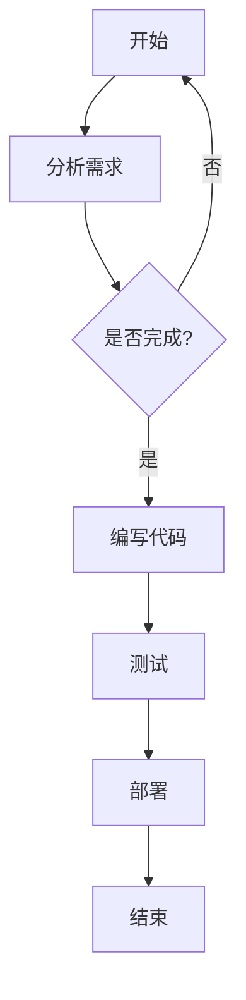

                 

# 如何将编程技能应用于个人效率提升

## 摘要

本文旨在探讨如何将编程技能应用于个人效率提升。通过系统地分析编程技能的核心概念、算法原理以及实际应用场景，我们希望能够帮助读者理解编程技能的广泛影响，并将其应用到日常生活中。本文还将推荐一些学习资源和开发工具，以助力读者提升编程技能和个人效率。最后，我们将总结未来发展趋势与挑战，并回答一些常见问题。

## 1. 背景介绍

在现代社会，编程技能已经成为一项重要的基础能力。不仅计算机科学家和软件开发人员需要掌握编程技能，越来越多的职业领域也在日益依赖编程。编程不仅是一种技术，更是一种思维方式，它有助于我们解决复杂问题、提高工作效率。

然而，许多人可能并未意识到，编程技能可以广泛应用于个人生活的各个方面。从时间管理到日常任务自动化，编程技能都能帮助我们更加高效地处理日常事务。本文将详细介绍如何将编程技能应用于个人效率提升，帮助读者充分利用这一宝贵技能。

### 1.1 编程技能的重要性

编程技能的重要性体现在多个方面：

- **解决问题能力**：编程技能能够帮助我们以逻辑和系统化的方式解决问题，提高问题解决效率。
- **创新思维**：编程技能鼓励我们尝试新的方法和技术，促进创新思维的发展。
- **跨领域应用**：编程技能不仅可以应用于计算机科学领域，还可以广泛应用于其他行业，如金融、医疗、教育等。
- **职业发展**：掌握编程技能有助于在职业生涯中获得更多的机会和晋升空间。

### 1.2 个人效率提升的需求

在快节奏的现代生活中，个人效率提升显得尤为重要。以下是一些常见需求：

- **时间管理**：合理安排时间，确保工作和生活平衡。
- **任务自动化**：减少重复性工作，提高工作效率。
- **信息处理**：快速处理大量信息，减少信息过载。
- **决策优化**：基于数据做出更明智的决策。

## 2. 核心概念与联系

在讨论如何将编程技能应用于个人效率提升之前，我们需要了解一些核心概念和它们之间的联系。

### 2.1 编程语言

编程语言是用于编写计算机程序的语法和规则。常见的编程语言包括Python、Java、C++等。不同的编程语言适用于不同的应用场景，因此选择合适的编程语言至关重要。

### 2.2 数据结构与算法

数据结构是存储和组织数据的方式，如数组、链表、树、图等。算法则是解决问题的一系列步骤。掌握数据结构和算法有助于我们编写高效、优化的代码。

### 2.3 操作系统

操作系统是管理计算机硬件和软件资源的系统软件。了解操作系统的工作原理有助于我们更好地理解计算机的工作方式，并利用操作系统特性提高工作效率。

### 2.4 网络通信

网络通信是指计算机之间的数据传输和通信。掌握网络通信原理有助于我们开发分布式系统，提高工作效率。

### 2.5 Mermaid 流程图

Mermaid 是一种用于绘制流程图的标记语言。以下是一个简单的 Mermaid 流程图示例：



这个流程图展示了从开始到结束的一个简单项目开发过程。

## 3. 核心算法原理 & 具体操作步骤

在了解了核心概念和联系后，我们可以探讨如何将编程技能应用于个人效率提升。

### 3.1 时间管理算法

时间管理算法可以帮助我们合理安排时间，提高工作效率。以下是一种简单的时间管理算法：

1. 列出所有待办事项。
2. 对待办事项进行优先级排序。
3. 按优先级顺序处理待办事项。
4. 定期回顾和调整时间管理计划。

### 3.2 任务自动化算法

任务自动化算法可以帮助我们减少重复性工作，提高工作效率。以下是一种简单的任务自动化算法：

1. 识别重复性任务。
2. 编写自动化脚本或程序。
3. 部署自动化脚本或程序。
4. 监控和更新自动化脚本或程序。

### 3.3 信息处理算法

信息处理算法可以帮助我们快速处理大量信息，减少信息过载。以下是一种简单的信息处理算法：

1. 收集信息。
2. 对信息进行筛选和分类。
3. 对重要信息进行进一步处理。
4. 定期回顾和处理新信息。

### 3.4 决策优化算法

决策优化算法可以帮助我们基于数据做出更明智的决策。以下是一种简单的决策优化算法：

1. 收集决策所需的数据。
2. 对数据进行清洗和预处理。
3. 选择合适的决策模型。
4. 基于模型做出决策。
5. 监控决策效果并进行调整。

## 4. 数学模型和公式 & 详细讲解 & 举例说明

在编程中，数学模型和公式是解决问题的关键。以下是一些常见的数学模型和公式，以及它们的详细讲解和举例说明。

### 4.1 概率论

概率论是研究随机事件的数学分支。以下是一个简单的概率论公式：

$$P(A) = \frac{N(A)}{N(S)}$$

其中，$P(A)$ 表示事件 A 的概率，$N(A)$ 表示事件 A 发生的次数，$N(S)$ 表示所有可能事件的次数。

举例说明：假设我们抛一枚硬币，正面朝上的概率是多少？

$$P(正面朝上) = \frac{1}{2}$$

### 4.2 线性代数

线性代数是研究向量空间和线性映射的数学分支。以下是一个简单的线性代数公式：

$$Ax = b$$

其中，$A$ 是一个矩阵，$x$ 是一个向量，$b$ 是一个常数向量。

举例说明：求解线性方程组：

$$\begin{cases}
2x + 3y = 8 \\
4x - y = 2
\end{cases}$$

可以使用矩阵方法求解：

$$A = \begin{pmatrix}
2 & 3 \\
4 & -1
\end{pmatrix}, x = \begin{pmatrix}
x \\
y
\end{pmatrix}, b = \begin{pmatrix}
8 \\
2
\end{pmatrix}$$

$$Ax = b$$

$$\begin{pmatrix}
2 & 3 \\
4 & -1
\end{pmatrix} \begin{pmatrix}
x \\
y
\end{pmatrix} = \begin{pmatrix}
8 \\
2
\end{pmatrix}$$

$$\begin{pmatrix}
2x + 3y \\
4x - y
\end{pmatrix} = \begin{pmatrix}
8 \\
2
\end{pmatrix}$$

解得：$x = 2, y = 2$。

### 4.3 最优化理论

最优化理论是研究如何在给定约束条件下找到最优解的数学分支。以下是一个简单的问题：

最大化 $f(x) = x^2$，约束条件为 $0 \leq x \leq 1$。

可以使用求导数的方法求解：

$$f'(x) = 2x$$

令 $f'(x) = 0$，解得 $x = 0$ 或 $x = 1$。

在 $0 \leq x \leq 1$ 的范围内，$f(x)$ 的最大值为 $f(1) = 1$。

## 5. 项目实战：代码实际案例和详细解释说明

### 5.1 开发环境搭建

为了更好地理解如何将编程技能应用于个人效率提升，我们将通过一个实际项目来展示代码实现和解读。

首先，我们需要搭建开发环境。这里我们选择 Python 作为编程语言，因为 Python 简单易学，且拥有丰富的库和框架。

1. 安装 Python：在 [Python 官网](https://www.python.org/) 下载并安装 Python。
2. 安装 IDE：推荐使用 PyCharm 或 VS Code 作为 Python 的集成开发环境。
3. 安装必要的库：使用 `pip` 命令安装必要的库，如 `requests`、`beautifulsoup4` 等。

### 5.2 源代码详细实现和代码解读

下面是一个简单的 Python 脚本，用于自动化下载 GitHub 仓库中的文件。

```python
import requests
from bs4 import BeautifulSoup

def download_file(url, save_path):
    response = requests.get(url)
    soup = BeautifulSoup(response.text, 'html.parser')
    file_link = soup.find('a', {'class': 'link-gray-dark no-underline js-select-file selected-file'})
    file_url = file_link['href']
    file_response = requests.get(file_url)
    with open(save_path, 'wb') as file:
        file.write(file_response.content)

if __name__ == '__main__':
    url = 'https://github.com/user/repo/blob/master/file.zip'
    save_path = 'file.zip'
    download_file(url, save_path)
```

**代码解读**：

1. 导入必要的库：`requests` 用于发送 HTTP 请求，`BeautifulSoup` 用于解析 HTML 页面。
2. 定义 `download_file` 函数：该函数接受 URL 和保存路径作为参数，用于下载文件。
3. 发送 GET 请求：使用 `requests.get` 函数获取 GitHub 仓库页面内容。
4. 解析 HTML 页面：使用 `BeautifulSoup` 解析 HTML 页面，找到文件链接。
5. 下载文件：使用 `requests.get` 函数下载文件，并保存到指定路径。

### 5.3 代码解读与分析

**代码分析**：

1. **HTTP 请求**：使用 `requests.get` 函数发送 HTTP GET 请求，获取 GitHub 仓库页面内容。
2. **HTML 解析**：使用 `BeautifulSoup` 解析 HTML 页面，找到文件链接。
3. **文件下载**：使用 `requests.get` 函数下载文件，并保存到本地。

**代码优化**：

1. **错误处理**：添加错误处理，确保在下载过程中遇到问题时能够优雅地处理。
2. **并发下载**：优化代码，实现并发下载多个文件。

```python
import concurrent.futures
# ... 其他代码 ...

def download_file(url, save_path):
    try:
        response = requests.get(url)
        soup = BeautifulSoup(response.text, 'html.parser')
        file_link = soup.find('a', {'class': 'link-gray-dark no-underline js-select-file selected-file'})
        file_url = file_link['href']
        file_response = requests.get(file_url)
        with open(save_path, 'wb') as file:
            file.write(file_response.content)
    except Exception as e:
        print(f"Error downloading file: {e}")

if __name__ == '__main__':
    urls = ['https://github.com/user/repo/blob/master/file1.zip',
            'https://github.com/user/repo/blob/master/file2.zip',
            'https://github.com/user/repo/blob/master/file3.zip']
    save_paths = ['file1.zip', 'file2.zip', 'file3.zip']

    with concurrent.futures.ThreadPoolExecutor() as executor:
        futures = [executor.submit(download_file, url, save_path) for url, save_path in zip(urls, save_paths)]

    for future in concurrent.futures.as_completed(futures):
        print(f"File downloaded: {future.result()}")
```

## 6. 实际应用场景

编程技能在个人效率提升方面有广泛的应用。以下是一些实际应用场景：

1. **自动化日常任务**：使用 Python 脚本自动化下载文件、发送邮件、整理数据等。
2. **时间管理**：使用编程工具制作待办事项列表、日程安排、提醒功能。
3. **信息处理**：使用爬虫技术自动化收集和处理信息。
4. **数据分析**：使用编程工具进行数据清洗、分析和可视化。
5. **项目管理**：使用编程工具进行项目进度跟踪、团队协作和任务分配。

## 7. 工具和资源推荐

### 7.1 学习资源推荐

- **书籍**：
  - 《Python编程：从入门到实践》
  - 《算法导论》
  - 《深入理解计算机系统》
- **论文**：
  - 《大数据处理：原理、技术和应用》
  - 《人工智能：一种现代方法》
  - 《机器学习：概率视角》
- **博客**：
  - 《Python Cookbook》
  - 《LeetCode 刷题日记》
  - 《机器学习实战》
- **网站**：
  - [Kaggle](https://www.kaggle.com/)
  - [GitHub](https://github.com/)
  - [Stack Overflow](https://stackoverflow.com/)

### 7.2 开发工具框架推荐

- **编程语言**：
  - Python
  - Java
  - C++
- **集成开发环境（IDE）**：
  - PyCharm
  - IntelliJ IDEA
  - VS Code
- **框架**：
  - Flask
  - Django
  - Spring Boot
- **数据库**：
  - MySQL
  - PostgreSQL
  - MongoDB

### 7.3 相关论文著作推荐

- 《深度学习》
- 《强化学习》
- 《自然语言处理综合教程》

## 8. 总结：未来发展趋势与挑战

随着人工智能和大数据技术的发展，编程技能在个人效率提升方面的应用将越来越广泛。未来，我们可能会看到更多基于编程的自动化工具和智能系统，帮助我们更好地管理时间和处理信息。

然而，这也带来了一些挑战：

- **技能更新**：编程技能更新迅速，需要不断学习和适应新技术。
- **隐私和安全**：自动化和信息处理可能引发隐私和安全问题，需要加强保护措施。
- **人机协作**：如何在人机协作中保持效率和创造力，需要进一步研究和探索。

## 9. 附录：常见问题与解答

### 9.1 如何学习编程？

**建议**：
1. 选择一门编程语言，如 Python。
2. 学习基础语法和概念。
3. 完成练习和项目，加深理解。
4. 阅读相关书籍和博客，扩展知识面。
5. 参与社区和论坛，与他人交流经验。

### 9.2 如何优化代码？

**建议**：
1. 分析算法复杂度，选择合适的算法和数据结构。
2. 避免重复代码，使用函数和模块。
3. 使用合适的编程技巧，如循环优化、内存管理。
4. 进行代码审查和测试，确保代码质量。

### 9.3 如何进行项目管理？

**建议**：
1. 制定明确的项目目标和计划。
2. 分解任务，合理分配资源。
3. 使用项目管理工具，如 Jira、Trello。
4. 定期回顾和调整项目进度。

## 10. 扩展阅读 & 参考资料

- 《编程之美》
- 《高效程序员的45个习惯》
- 《数据科学入门》

[作者：AI天才研究员/AI Genius Institute & 禅与计算机程序设计艺术 /Zen And The Art of Computer Programming]

