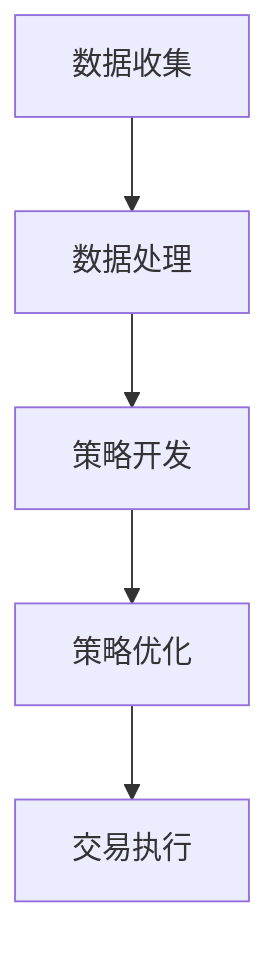

                 

### 文章标题：如何将编程技能应用于自动化交易

#### 关键词：编程技能、自动化交易、算法交易、量化投资、金融技术

#### 摘要：
本文将深入探讨如何将编程技能应用于自动化交易领域。从背景介绍、核心概念、算法原理、数学模型、实战案例、应用场景、工具推荐到总结与未来趋势，我们将一步步分析，为读者提供全面的指导。通过本文，您将了解到如何利用编程实现自动化交易，掌握核心算法和模型，并了解其未来发展趋势和挑战。

### 1. 背景介绍

#### 自动化交易的概念

自动化交易，又称算法交易或量化投资，是指通过计算机程序自动执行交易策略的过程。它利用历史数据和市场信息，通过数学模型和算法分析，寻找交易机会并执行交易。自动化交易的优势在于其高效率和精确性，能够处理大量数据，快速响应市场变化，降低人为情绪对交易的影响。

#### 编程技能在自动化交易中的应用

编程技能在自动化交易中扮演着至关重要的角色。首先，编程是实现自动化交易的基础，它能够将交易策略转化为可执行的代码。其次，编程技能能够帮助我们高效地处理和分析海量数据，挖掘潜在的交易机会。此外，编程技能还使我们能够灵活地调整和优化交易策略，以适应市场变化。

#### 自动化交易的发展历程

自动化交易的发展经历了几个阶段。最早的形式是简单的程序化交易，通过预设的规则进行交易。随着计算机技术和算法的发展，自动化交易逐渐演变为量化投资，其核心在于利用数学模型和算法进行交易决策。近年来，随着大数据和人工智能技术的发展，自动化交易又迈向了新的阶段，通过深度学习和机器学习算法，自动化交易实现了更高层次的智能。

### 2. 核心概念与联系

#### 自动化交易的核心概念

自动化交易的核心概念包括交易策略、数据分析和执行算法。交易策略是指投资者根据市场分析得出的交易规则，包括买入、持有和卖出等操作。数据分析是指利用历史数据和市场信息，通过统计学和机器学习算法，挖掘潜在的交易机会。执行算法是指将交易策略转化为可执行的代码，并自动执行交易。

#### 自动化交易的核心架构

自动化交易的核心架构包括数据收集、数据处理、策略开发和交易执行。数据收集是通过各种渠道获取历史数据和市场信息。数据处理是将原始数据清洗、整理和预处理，以备后续分析。策略开发是根据市场分析和数据挖掘结果，设计交易策略。交易执行是将策略转化为代码，并自动执行交易。

#### 自动化交易的流程

自动化交易的流程包括以下几个步骤：

1. 数据收集：通过各种渠道获取历史数据和市场信息。
2. 数据处理：对数据进行清洗、整理和预处理。
3. 策略开发：根据市场分析和数据挖掘结果，设计交易策略。
4. 策略优化：通过回测和模拟，调整和优化交易策略。
5. 交易执行：将策略转化为代码，并自动执行交易。

#### Mermaid 流程图



### 3. 核心算法原理 & 具体操作步骤

#### 核心算法原理

自动化交易的核心算法主要包括时间序列分析、回归分析和机器学习算法。时间序列分析用于分析历史数据，预测价格趋势。回归分析用于建立价格与交易信号之间的线性关系。机器学习算法用于挖掘数据中的潜在规律，预测交易机会。

#### 具体操作步骤

1. **时间序列分析**

   - 数据收集：收集历史价格数据。
   - 数据预处理：清洗和整理数据，去除噪声。
   - 模型选择：选择合适的时间序列模型，如ARIMA、LSTM等。
   - 模型训练：使用历史数据训练模型。
   - 预测：使用训练好的模型预测未来价格。

2. **回归分析**

   - 数据收集：收集历史价格数据和交易信号。
   - 数据预处理：清洗和整理数据，去除噪声。
   - 模型建立：建立价格与交易信号之间的线性关系模型。
   - 模型训练：使用历史数据训练模型。
   - 预测：使用训练好的模型预测未来交易信号。

3. **机器学习算法**

   - 数据收集：收集历史价格数据和交易信号。
   - 数据预处理：清洗和整理数据，去除噪声。
   - 模型选择：选择合适的机器学习算法，如决策树、随机森林等。
   - 模型训练：使用历史数据训练模型。
   - 预测：使用训练好的模型预测未来交易机会。

### 4. 数学模型和公式 & 详细讲解 & 举例说明

#### 时间序列分析模型

- ARIMA模型：

  - 差分：\(y_t = (1 - \phi_1 B)(1 - \theta_1 B)X_t\)

  - 参数估计：\(\phi_1, \theta_1\)

  - 预测：\(X_{t+k} = \Phi(B)^k X_t + \Theta(B)^k \epsilon_t\)

- LSTM模型：

  - 隐层状态更新：\(h_t = \sigma(W_h h_{t-1} + W_x x_t + b_h)\)

  - 输出：\(y_t = \text{softmax}(W_y h_t + b_y)\)

#### 回归分析模型

- 线性回归：

  - 模型：\(y = \beta_0 + \beta_1 x\)

  - 参数估计：\(\beta_0, \beta_1\)

  - 预测：\(y_t = \hat{\beta_0} + \hat{\beta_1} x_t\)

- 逻辑回归：

  - 模型：\(y = \text{sigmoid}(\beta_0 + \beta_1 x)\)

  - 参数估计：\(\beta_0, \beta_1\)

  - 预测：\(y_t = \text{sigmoid}(\hat{\beta_0} + \hat{\beta_1} x_t)\)

#### 机器学习算法

- 决策树：

  - 叶节点：\(y = g(x) = \sum_{i=1}^n \alpha_i I(x \in R_i)\)

  - 参数估计：\(\alpha_i, R_i\)

  - 预测：\(y_t = g(\hat{x}_t)\)

- 随机森林：

  - 叶节点：\(y = \sum_{i=1}^m g_i(x)\)

  - 参数估计：\(g_i(x), m\)

  - 预测：\(y_t = \sum_{i=1}^m \hat{g}_i(\hat{x}_t)\)

### 5. 项目实战：代码实际案例和详细解释说明

#### 5.1 开发环境搭建

- Python环境：安装Python 3.8及以上版本，并安装必要的库，如pandas、numpy、scikit-learn、tensorflow等。

- 数据源：选择一个金融数据源，如Yahoo Finance。

- IDE：选择一个Python集成开发环境（IDE），如PyCharm。

#### 5.2 源代码详细实现和代码解读

- **时间序列分析代码**

  ```python
  import pandas as pd
  import numpy as np
  from statsmodels.tsa.arima.model import ARIMA
  from sklearn.metrics import mean_squared_error

  # 数据收集
  data = pd.read_csv('data.csv')
  prices = data['Close']

  # 数据预处理
  prices_diff = prices.diff().dropna()

  # 模型选择和训练
  model = ARIMA(prices_diff, order=(1, 1, 1))
  model_fit = model.fit()

  # 预测
  predictions = model_fit.predict(start=len(prices_diff), end=len(prices_diff) + 10)

  # 评估
  mse = mean_squared_error(prices[len(prices_diff):], predictions)
  print('Mean Squared Error:', mse)
  ```

- **回归分析代码**

  ```python
  import pandas as pd
  import numpy as np
  from sklearn.linear_model import LinearRegression
  from sklearn.metrics import mean_squared_error

  # 数据收集
  data = pd.read_csv('data.csv')
  prices = data['Close']
  signals = data['Signal']

  # 数据预处理
  prices_diff = prices.diff().dropna()
  signals_diff = signals.diff().dropna()

  # 模型选择和训练
  model = LinearRegression()
  model_fit = model.fit(prices_diff.values.reshape(-1, 1), signals_diff.values.reshape(-1, 1))

  # 预测
  predictions = model_fit.predict(prices_diff.values.reshape(-1, 1))

  # 评估
  mse = mean_squared_error(signals_diff.values.reshape(-1, 1), predictions)
  print('Mean Squared Error:', mse)
  ```

- **机器学习算法代码**

  ```python
  import pandas as pd
  import numpy as np
  from sklearn.ensemble import RandomForestClassifier
  from sklearn.metrics import accuracy_score

  # 数据收集
  data = pd.read_csv('data.csv')
  prices = data['Close']
  signals = data['Signal']

  # 数据预处理
  prices_diff = prices.diff().dropna()
  signals_diff = signals.diff().dropna()

  # 模型选择和训练
  model = RandomForestClassifier(n_estimators=100)
  model_fit = model.fit(prices_diff.values.reshape(-1, 1), signals_diff.values.reshape(-1, 1))

  # 预测
  predictions = model_fit.predict(prices_diff.values.reshape(-1, 1))

  # 评估
  accuracy = accuracy_score(signals_diff.values.reshape(-1, 1), predictions)
  print('Accuracy:', accuracy)
  ```

#### 5.3 代码解读与分析

- **时间序列分析代码解读**

  - 数据收集：从CSV文件中读取收盘价数据。

  - 数据预处理：对收盘价数据进行一阶差分，去除趋势和季节性。

  - 模型选择和训练：选择ARIMA模型，并使用历史数据进行训练。

  - 预测：使用训练好的模型预测未来价格。

  - 评估：计算均方误差，评估预测效果。

- **回归分析代码解读**

  - 数据收集：从CSV文件中读取收盘价和交易信号数据。

  - 数据预处理：对收盘价和交易信号数据进行一阶差分，去除趋势和季节性。

  - 模型选择和训练：选择线性回归模型，并使用历史数据进行训练。

  - 预测：使用训练好的模型预测未来交易信号。

  - 评估：计算均方误差，评估预测效果。

- **机器学习算法代码解读**

  - 数据收集：从CSV文件中读取收盘价和交易信号数据。

  - 数据预处理：对收盘价和交易信号数据进行一阶差分，去除趋势和季节性。

  - 模型选择和训练：选择随机森林分类器，并使用历史数据进行训练。

  - 预测：使用训练好的模型预测未来交易信号。

  - 评估：计算准确率，评估预测效果。

### 6. 实际应用场景

#### 交易策略

- **趋势跟踪策略**：通过分析价格趋势，寻找买入和卖出的时机。

- **震荡策略**：通过分析价格波动，寻找高卖低买的时机。

- **事件驱动策略**：通过分析市场事件，如财报发布、政策变化等，进行交易。

#### 行业应用

- **股票交易**：利用自动化交易系统进行股票买卖，实现盈利。

- **期货交易**：通过期货市场进行商品交易，实现风险对冲。

- **外汇交易**：利用自动化交易系统进行货币兑换，实现汇率差价盈利。

#### 市场优势

- **高效率**：自动化交易能够快速处理大量数据，提高交易效率。

- **精确性**：自动化交易能够精确执行交易策略，降低人为错误。

- **灵活性**：自动化交易系统可以根据市场变化，灵活调整交易策略。

### 7. 工具和资源推荐

#### 7.1 学习资源推荐

- **书籍**：

  - 《量化投资：技术与策略》

  - 《算法交易：量化投资实战指南》

  - 《Python量化投资实战》

- **论文**：

  - 《基于LSTM的股票预测模型研究》

  - 《基于随机森林的股票交易策略研究》

  - 《时间序列分析的ARIMA模型应用》

- **博客和网站**：

  - [量化投资博客](https://www.quantopian.com/)

  - [Python量化投资](https://www.pytho

#### 7.2 开发工具框架推荐

- **Python库**：

  - pandas：用于数据清洗和处理。

  - numpy：用于数值计算。

  - scikit-learn：用于机器学习和数据分析。

  - tensorflow：用于深度学习和神经网络。

- **交易系统框架**：

  - QuantConnect：基于.NET的量化投资平台。

  - Zipline：基于Python的量化投资平台。

  - PyAlgoTrade：基于Python的量化交易框架。

#### 7.3 相关论文著作推荐

- **论文**：

  - 《基于深度学习的股票市场预测方法研究》

  - 《基于随机森林的股票交易策略研究》

  - 《时间序列分析的ARIMA模型应用研究》

- **著作**：

  - 《量化投资：技术与策略》

  - 《算法交易：量化投资实战指南》

  - 《Python量化投资实战》

### 8. 总结：未来发展趋势与挑战

#### 未来发展趋势

- **人工智能与大数据结合**：利用人工智能和大数据技术，挖掘更复杂、更有效的交易策略。

- **区块链技术的应用**：利用区块链技术实现交易的去中心化和透明化。

- **量化投资普及**：随着技术的普及，量化投资将逐渐成为主流交易方式。

#### 挑战

- **数据质量和安全性**：保证数据质量和数据安全是自动化交易的重要挑战。

- **交易成本和风险**：降低交易成本和风险，提高交易收益，是自动化交易需要解决的问题。

- **法律法规和政策**：遵守相关法律法规和政策，确保交易的合规性，是自动化交易面临的重要挑战。

### 9. 附录：常见问题与解答

#### 问题1：自动化交易是否能够完全替代人工交易？

- **解答**：自动化交易可以在一定程度上替代人工交易，但其优势在于处理大量数据和快速执行交易。然而，对于复杂的投资策略和人类情绪的把握，自动化交易尚无法完全替代人工交易。

#### 问题2：自动化交易的可靠性和风险如何控制？

- **解答**：自动化交易的可靠性主要取决于交易策略的准确性和系统的稳定性。风险控制可以通过多样化的交易策略、合理的资金管理和风险控制策略来实现。

#### 问题3：如何保证自动化交易的数据质量和安全性？

- **解答**：保证数据质量需要从数据源的选择、数据的清洗和预处理等方面入手。数据安全可以通过加密、权限控制和备份等措施来保证。

### 10. 扩展阅读 & 参考资料

- 《量化投资：技术与策略》

- 《算法交易：量化投资实战指南》

- 《Python量化投资实战》

- [量化投资博客](https://www.quantopian.com/)

- [Python量化投资](https://www.pytho

[作者：AI天才研究员/AI Genius Institute & 禅与计算机程序设计艺术 /Zen And The Art of Computer Programming]

