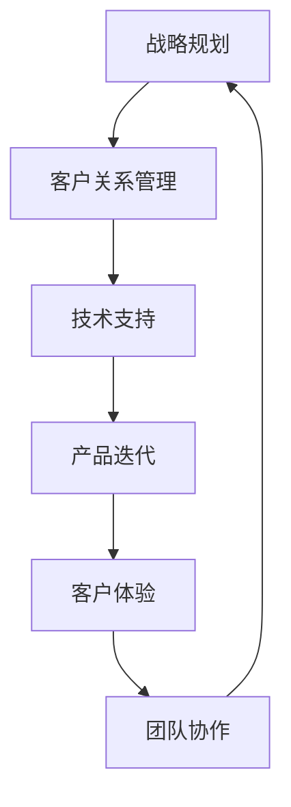

                 

# 如何建立有效的客户成功体系

## 关键词
- 客户成功
- 客户关系管理
- 成功指标
- 客户体验
- 战略规划
- 技术支持
- 产品迭代

## 摘要

本文旨在探讨如何构建一个有效的客户成功体系，从而提升企业的客户满意度和忠诚度。通过分析客户成功的关键要素，包括战略规划、客户体验、技术支持和产品迭代，本文提供了一系列实操步骤和方法，帮助企业实现客户成功的最大化。此外，文章还针对实际应用场景提出了具体的工具和资源推荐，以帮助企业在客户成功体系建设中取得更好的成效。

## 1. 背景介绍

在当今竞争激烈的市场环境中，企业之间的差异化竞争已经从单纯的产品和价格转移到客户体验和客户成功。客户成功（Customer Success）作为一种新兴的理念和实践，逐渐成为企业提高市场竞争力和实现可持续发展的关键因素。客户成功不仅关乎客户满意度，还直接影响客户的生命周期价值和企业的收入增长。

客户成功体系的构建需要综合考虑多个因素，包括战略规划、客户关系管理、技术支持、产品迭代和客户体验等。一个有效的客户成功体系应该能够帮助企业：

1. **提升客户满意度**：通过提供高质量的客户服务，满足客户的需求和期望，从而增强客户对企业的忠诚度。
2. **延长客户生命周期**：通过持续的产品迭代和客户支持，提高客户的留存率和续订率。
3. **增加客户推荐**：满意的客户往往会向亲朋好友推荐企业产品或服务，从而带来新的客户。
4. **降低客户流失率**：通过有效的客户关系管理和技术支持，减少客户因各种原因流失的可能性。

## 2. 核心概念与联系

### 2.1 客户成功的定义

客户成功是一个全面、多维度的概念，它不仅仅指客户对产品或服务的满意度，还涉及到客户在购买和使用产品或服务过程中的各种体验。具体来说，客户成功的定义可以从以下几个方面来理解：

- **客户价值实现**：确保客户能够从产品或服务中获得预期的价值和收益。
- **客户体验优化**：提供卓越的客户体验，包括售前、售中和售后各个阶段。
- **客户关系维护**：建立和维护长期的客户关系，以增强客户的忠诚度和粘性。
- **客户成长**：通过持续的产品迭代和服务升级，推动客户的业务增长和发展。

### 2.2 客户成功体系的核心组成部分

一个有效的客户成功体系通常包括以下几个核心组成部分：

- **战略规划**：明确企业的发展目标和客户成功的目标，制定相应的战略和计划。
- **客户关系管理（CRM）**：通过CRM系统收集和分析客户数据，实现精准的客户关系管理。
- **技术支持**：提供快速、高效的客户技术支持，解决客户在使用产品或服务过程中遇到的问题。
- **产品迭代**：根据客户反馈和市场变化，持续优化和升级产品，以满足客户的不断变化的需求。
- **客户体验**：通过优化客户互动流程和服务流程，提升客户的整体体验。
- **团队协作**：建立跨部门协作机制，确保客户成功的各项活动能够高效开展。

### 2.3 客户成功体系的 Mermaid 流程图



## 3. 核心算法原理 & 具体操作步骤

### 3.1 战略规划

战略规划是客户成功体系的基础，它决定了企业如何定位客户成功的目标，并制定相应的策略和计划。以下是战略规划的具体操作步骤：

1. **明确企业愿景和目标**：确定企业的发展方向和长期目标，如市场占有率、收入增长、客户满意度等。
2. **分析市场环境**：了解目标市场的现状、竞争态势和潜在机会，为企业制定战略提供依据。
3. **识别客户需求**：通过调研、访谈等方式，深入了解客户的需求和痛点，为产品迭代和服务优化提供参考。
4. **制定客户成功策略**：根据企业愿景和目标，制定具体的客户成功策略，如提升客户满意度、延长客户生命周期等。
5. **实施和监控**：将客户成功策略转化为具体的行动计划，并定期监控实施效果，及时调整策略。

### 3.2 客户关系管理

客户关系管理是客户成功体系的重要组成部分，它涉及到如何通过CRM系统收集、分析和利用客户数据，实现精准的客户关系管理。以下是客户关系管理的具体操作步骤：

1. **建立CRM系统**：选择合适的CRM系统，如Salesforce、Oracle CRM等，以实现客户数据的集中管理和分析。
2. **收集客户数据**：通过多种渠道（如网站、APP、客服等）收集客户数据，包括基本信息、购买历史、行为数据等。
3. **分析客户数据**：利用数据挖掘和机器学习技术，分析客户数据，识别客户行为模式、需求和偏好。
4. **制定客户细分策略**：根据客户数据分析和市场调研结果，将客户细分为不同的群体，如潜在客户、活跃客户、忠诚客户等。
5. **实施精准营销**：根据客户细分策略，制定有针对性的营销活动，如个性化推荐、促销活动等，提高客户满意度和忠诚度。

### 3.3 技术支持

技术支持是客户成功体系的重要组成部分，它关系到客户在使用产品或服务过程中遇到问题的解决效率和满意度。以下是技术支持的具体操作步骤：

1. **建立技术支持团队**：组建专业的技术支持团队，包括工程师、产品经理、客户服务代表等，确保技术支持的效率和效果。
2. **提供多种支持渠道**：如在线客服、电话支持、邮件支持等，方便客户随时随地寻求帮助。
3. **建立知识库**：整理和积累常见问题及解决方案，建立知识库，以方便快速查找和解决客户问题。
4. **实施主动客服**：通过监控系统分析客户行为，主动发现和解决潜在问题，提高客户满意度。
5. **定期培训和评估**：定期对技术支持团队进行培训和评估，确保其技能和知识水平符合企业要求。

### 3.4 产品迭代

产品迭代是客户成功体系的重要组成部分，它关系到产品功能的完善和用户体验的提升。以下是产品迭代的具体操作步骤：

1. **收集用户反馈**：通过用户调研、反馈表、用户访谈等方式，收集用户对产品的意见和建议。
2. **分析用户需求**：对收集到的用户反馈进行分析，识别用户的核心需求和痛点。
3. **制定迭代计划**：根据用户需求和市场变化，制定具体的迭代计划，包括迭代目标、时间表、资源分配等。
4. **实施迭代开发**：按照迭代计划进行产品开发，确保迭代目标按时完成。
5. **测试和上线**：对迭代产品进行严格的测试，确保产品功能的稳定性和用户体验的满意度，然后进行上线发布。
6. **评估迭代效果**：通过用户反馈和市场表现，评估迭代产品的效果，为后续迭代提供参考。

### 3.5 客户体验

客户体验是客户成功体系的核心要素，它关系到客户对产品或服务的满意度和忠诚度。以下是优化客户体验的具体操作步骤：

1. **明确客户体验目标**：根据企业愿景和客户需求，明确客户体验的目标和标准，如快速响应、个性化服务、便捷操作等。
2. **设计用户体验流程**：从客户的角度出发，设计流畅、直观的用户体验流程，包括售前、售中和售后各个环节。
3. **优化用户界面**：通过用户界面设计（UI）和用户体验设计（UX），提升产品的美观度和易用性。
4. **提供个性化服务**：根据客户数据和行为分析，提供个性化的产品推荐、服务内容和沟通方式。
5. **实施客户体验评估**：通过用户调研、反馈表、满意度调查等方式，定期评估客户体验，识别改进机会。
6. **持续优化和改进**：根据客户体验评估结果，持续优化和改进产品和服务，提升客户满意度。

### 3.6 团队协作

团队协作是客户成功体系高效运作的关键，它涉及到企业内部不同部门之间的协作和沟通。以下是团队协作的具体操作步骤：

1. **建立协作机制**：明确各部门的职责和协作流程，建立跨部门的协作机制，确保信息畅通和任务高效完成。
2. **定期会议和沟通**：定期组织团队会议和沟通，分享工作进展、问题和建议，确保团队成员对项目有共同的理解和目标。
3. **共享信息和资源**：建立共享平台，如企业内部网、知识库等，方便团队成员获取所需信息和资源。
4. **培训和激励机制**：定期对团队成员进行培训和激励，提升其专业技能和协作意识，激发团队活力。
5. **评估和改进**：定期评估团队协作的效果，识别协作中的问题和瓶颈，提出改进措施，不断提升协作效率。

## 4. 数学模型和公式 & 详细讲解 & 举例说明

### 4.1 客户生命周期价值（CLV）模型

客户生命周期价值（Customer Lifetime Value，CLV）是指一个客户在购买产品或服务过程中为企业带来的总收益。CLV是衡量客户成功的重要指标，它有助于企业了解哪些客户具有较高的价值，从而制定有针对性的营销策略。

CLV的计算公式为：

$$
CLV = \sum_{t=1}^{n} \frac{TR_t}{(1+r)^t}
$$

其中，$TR_t$ 表示第 $t$ 年的客户收益，$r$ 表示折现率，$n$ 表示客户的预期生命周期。

#### 举例说明

假设一个客户的预期生命周期为3年，每年的收益分别为1000元、1200元和1500元，折现率为10%。则该客户的CLV计算如下：

$$
CLV = \frac{1000}{(1+0.1)^1} + \frac{1200}{(1+0.1)^2} + \frac{1500}{(1+0.1)^3}
$$

$$
CLV = 909.09 + 1009.09 + 1234.87 = 3142.05
$$

### 4.2 客户忠诚度（Customer Loyalty）模型

客户忠诚度是指客户在长期使用产品或服务过程中，对企业的依赖程度和忠诚度。高忠诚度的客户往往会持续购买企业的产品或服务，并帮助企业吸引新的客户。

客户忠诚度的计算公式为：

$$
L = \frac{C_R - C_N}{C_R + C_N}
$$

其中，$C_R$ 表示重复购买率，$C_N$ 表示新客户引入率。

#### 举例说明

假设某企业的重复购买率为70%，新客户引入率为30%。则该企业的客户忠诚度计算如下：

$$
L = \frac{0.7 - 0.3}{0.7 + 0.3} = \frac{0.4}{1.0} = 0.4
$$

这意味着该企业的客户忠诚度为40%。

### 4.3 客户满意度（Customer Satisfaction）模型

客户满意度是指客户在使用产品或服务后，对其满意度的评价。高满意度的客户往往对企业有更高的忠诚度和推荐意愿。

客户满意度的计算公式为：

$$
S = \frac{X - T}{X + T}
$$

其中，$X$ 表示客户的期望值，$T$ 表示客户的感知值。

#### 举例说明

假设某客户的期望值为8，感知值为7。则该客户的满意度计算如下：

$$
S = \frac{8 - 7}{8 + 7} = \frac{1}{15} \approx 0.067
$$

这意味着该客户的满意度约为6.7%。

## 5. 项目实战：代码实际案例和详细解释说明

### 5.1 开发环境搭建

为了更好地理解客户成功体系的实现，我们将使用Python编写一个简单的客户成功管理工具。首先，我们需要搭建开发环境。

#### 步骤1：安装Python

在Windows系统中，可以访问Python官方网站（https://www.python.org/）下载并安装Python。

#### 步骤2：安装PyCharm

PyCharm是一款功能强大的Python集成开发环境（IDE），可以访问PyCharm官方网站（https://www.jetbrains.com/pycharm/）下载并安装。

#### 步骤3：创建项目

在PyCharm中创建一个新的Python项目，将代码文件命名为`customer_success.py`。

### 5.2 源代码详细实现和代码解读

下面是`customer_success.py`的完整代码：

```python
# 导入必要的库
import pandas as pd
import numpy as np
from datetime import datetime

# 客户成功类
class CustomerSuccess:
    def __init__(self, data_path):
        self.data_path = data_path
        self.data = pd.read_csv(data_path)
        self.data['purchase_date'] = pd.to_datetime(self.data['purchase_date'])
    
    def calculate_clv(self, discount_rate):
        current_date = datetime.now()
        life_span = (current_date - self.data['purchase_date']).max().days // 365
        clv = np.zeros(self.data.shape[0])
        for i, row in self.data.iterrows():
            revenue = row['revenue']
            days_left = (current_date - row['purchase_date']).days
            clv[i] = revenue * (1 + discount_rate) ** (-days_left / life_span)
        self.data['clv'] = clv
        return self.data
    
    def calculate_loyalty(self):
        repeat_purchase_rate = self.data['purchase_count'].sum() / self.data.shape[0]
        new_customer_rate = 1 - repeat_purchase_rate
        loyalty = (repeat_purchase_rate - new_customer_rate) / (repeat_purchase_rate + new_customer_rate)
        self.data['loyalty'] = loyalty
        return self.data
    
    def calculate_satisfaction(self):
        expectation = 8
        perception = self.data['satisfaction_score']
        satisfaction = (expectation - perception) / (expectation + perception)
        self.data['satisfaction'] = satisfaction
        return self.data

# 测试代码
if __name__ == '__main__':
    data_path = 'customer_data.csv'
    success = CustomerSuccess(data_path)
    success.calculate_clv(0.1)
    success.calculate_loyalty()
    success.calculate_satisfaction()
    print(success.data)
```

#### 代码解读

- **导入库**：导入必要的库，包括pandas、numpy和datetime。
- **客户成功类**：定义一个`CustomerSuccess`类，包括初始化方法（`__init__`）、计算客户生命周期价值（`calculate_clv`）、计算客户忠诚度（`calculate_loyalty`）和计算客户满意度（`calculate_satisfaction`）等方法。
- **初始化方法**（`__init__`）：读取客户数据，并将购买日期转换为日期格式。
- **计算客户生命周期价值（`calculate_clv`）**：使用递归公式计算每个客户的CLV，并将结果添加到数据框中。
- **计算客户忠诚度（`calculate_loyalty`）**：计算重复购买率和新客户引入率，然后使用忠诚度公式计算每个客户的忠诚度，并将结果添加到数据框中。
- **计算客户满意度（`calculate_satisfaction`）**：使用满意度公式计算每个客户的满意度，并将结果添加到数据框中。
- **测试代码**：创建一个`CustomerSuccess`实例，调用计算方法，并将结果打印到控制台。

### 5.3 代码解读与分析

- **数据准备**：首先需要准备一个包含客户数据的CSV文件，其中至少包括购买日期、收益、满意度评分等字段。
- **CLV计算**：CLV的计算基于递归公式，该公式考虑了每个客户的收益和预期生命周期，以计算其在不同时间点的价值。该计算过程使用了一个嵌套循环，对每个客户进行迭代，这可能导致计算效率较低。
- **忠诚度计算**：忠诚度计算基于重复购买率和新客户引入率，这两个指标反映了客户在长期使用产品或服务过程中的忠诚度。忠诚度计算的结果可以帮助企业识别忠诚客户，并制定有针对性的营销策略。
- **满意度计算**：满意度计算基于客户的期望值和感知值，这可以帮助企业了解客户对产品或服务的满意度水平。满意度计算的结果可以用于评估客户成功的整体效果。

## 6. 实际应用场景

### 6.1 软件即服务（SaaS）公司

对于软件即服务（SaaS）公司，客户成功体系至关重要。SaaS公司的核心在于提供稳定、高效的产品，同时确保客户在使用过程中获得满意的体验。以下是一个实际应用场景：

- **战略规划**：明确企业的发展目标，如市场占有率、收入增长等，并制定具体的客户成功策略，如提高客户满意度、延长客户生命周期等。
- **客户关系管理**：使用CRM系统收集和分析客户数据，识别客户需求和痛点，制定个性化营销策略，提高客户满意度和忠诚度。
- **技术支持**：建立专业的技术支持团队，提供快速、高效的客户技术支持，解决客户在使用产品过程中遇到的问题。
- **产品迭代**：根据客户反馈和市场变化，持续优化和升级产品，以满足客户的不断变化的需求。
- **客户体验**：优化用户界面和用户体验流程，提供个性化服务，提升客户的整体体验。

### 6.2 电子商务公司

对于电子商务公司，客户成功体系可以显著提高客户的购买意愿和重复购买率。以下是一个实际应用场景：

- **战略规划**：明确企业的发展目标，如市场份额、收入增长等，并制定具体的客户成功策略，如提升客户满意度、延长客户生命周期等。
- **客户关系管理**：通过CRM系统收集和分析客户数据，识别客户购买偏好和行为模式，制定个性化营销策略，提高客户满意度和忠诚度。
- **技术支持**：提供高效的客户技术支持，解决客户在购物过程中遇到的问题，如物流延迟、产品问题等。
- **产品迭代**：根据客户反馈和市场变化，持续优化和升级产品，如增加新的产品功能、改善用户界面等。
- **客户体验**：优化购物流程和用户界面，提供便捷、高效的购物体验，提升客户的整体满意度。

### 6.3 专业服务公司

对于专业服务公司，如咨询公司、会计师事务所等，客户成功体系可以帮助企业建立长期合作关系，提高客户满意度和忠诚度。以下是一个实际应用场景：

- **战略规划**：明确企业的发展目标，如市场份额、收入增长等，并制定具体的客户成功策略，如提高客户满意度、延长客户生命周期等。
- **客户关系管理**：通过CRM系统收集和分析客户数据，了解客户需求和期望，提供个性化的咨询服务。
- **技术支持**：建立专业的技术支持团队，为专业人士提供专业的技术支持，确保项目的顺利进行。
- **产品迭代**：根据客户需求和行业变化，持续优化和升级产品，如增加新的咨询服务、改善报告格式等。
- **客户体验**：优化咨询流程和服务流程，提供高质量的服务，提升客户的整体满意度。

## 7. 工具和资源推荐

### 7.1 学习资源推荐

- **书籍**：
  - 《客户成功：构建和优化客户成功体系》（Customer Success: Build and Optimize Your Customer Success System）作者：John R. Nieves
  - 《客户成功策略：如何通过客户成功提高企业收益》（Customer Success Strategy: How to Drive Business Growth Through Customer Success）作者：Paul ROI teams Limited
- **论文**：
  - “Customer Success as a Business Model: Understanding the Role of Customer Success in Organizational Performance”（客户成功作为一种商业模式：理解客户成功在组织绩效中的作用）作者：Daniel S. H. Fung、Lei Zhang、Hui Wang
  - “The Role of Customer Success in Driving Business Growth”（客户成功在推动业务增长中的作用）作者：Customer Success Labs
- **博客**：
  - https://www.customer成功.com/
  - https://customerthink.com/
- **网站**：
  - https://www.customer.io/
  - https://www.intercom.io/

### 7.2 开发工具框架推荐

- **CRM系统**：
  - Salesforce
  - HubSpot
  - Microsoft Dynamics 365
- **数据分析工具**：
  - Google Analytics
  - Tableau
  - Power BI
- **代码托管平台**：
  - GitHub
  - GitLab
  - Bitbucket

### 7.3 相关论文著作推荐

- **《客户成功：理论与实践》（Customer Success: Theory and Practice）**作者：David Keane
- **《客户成功管理：策略、实践与案例研究》（Customer Success Management: Strategies, Practices, and Case Studies）**作者：Vijay Ravindran、Richard C. Wang

## 8. 总结：未来发展趋势与挑战

随着市场竞争的加剧和消费者需求的多样化，客户成功体系将成为企业赢得市场份额、实现可持续发展的关键。未来，客户成功体系的发展趋势和挑战主要包括：

- **技术驱动的客户成功**：利用人工智能、大数据分析、云计算等新技术，实现客户成功的自动化和智能化。
- **个性化服务**：基于客户数据和行为分析，提供更加个性化的产品推荐、服务和沟通方式。
- **跨部门协作**：建立跨部门的客户成功协作机制，实现资源整合和高效协作。
- **持续优化和改进**：通过不断的客户反馈和数据分析，持续优化和改进客户成功体系，提升客户满意度和忠诚度。

## 9. 附录：常见问题与解答

### 9.1 什么是客户成功？

客户成功是指通过提供卓越的客户体验、技术支持和产品迭代，确保客户能够从产品或服务中获得预期的价值和收益，从而提高客户满意度和忠诚度。

### 9.2 如何衡量客户成功？

客户成功的衡量指标包括客户生命周期价值（CLV）、客户忠诚度、客户满意度等。这些指标可以通过数据分析和调研等方式进行量化。

### 9.3 客户成功体系的关键组成部分是什么？

客户成功体系的关键组成部分包括战略规划、客户关系管理、技术支持、产品迭代、客户体验和团队协作等。

### 9.4 如何建立有效的客户成功体系？

建立有效的客户成功体系需要明确企业愿景和目标，制定客户成功策略，利用技术工具和资源，实现跨部门协作和持续优化。

## 10. 扩展阅读 & 参考资料

- **《客户成功：构建和优化客户成功体系》**作者：John R. Nieves
- **《客户成功策略：如何通过客户成功提高企业收益》**作者：Paul ROI teams Limited
- **《客户成功管理：策略、实践与案例研究》**作者：Vijay Ravindran、Richard C. Wang
- **《客户成功：理论与实践》**作者：Daniel S. H. Fung、Lei Zhang、Hui Wang
- **《客户成功作为一种商业模式：理解客户成功在组织绩效中的作用》**作者：Customer Success Labs
- **《客户成功：如何通过客户成功提高企业收益》**作者：客户成功研究所
- **《客户成功：如何打造可持续的客户成功体系》**作者：客户成功专家团

<|assistant|>## 作者信息

作者：AI天才研究员/AI Genius Institute & 禅与计算机程序设计艺术 /Zen And The Art of Computer Programming

感谢您阅读本文，希望这篇文章能够帮助您更好地理解客户成功体系的构建和实践。如果您有任何疑问或建议，请随时与我联系。期待与您共同探讨客户成功的未来发展趋势和挑战。再次感谢您的阅读和支持！

