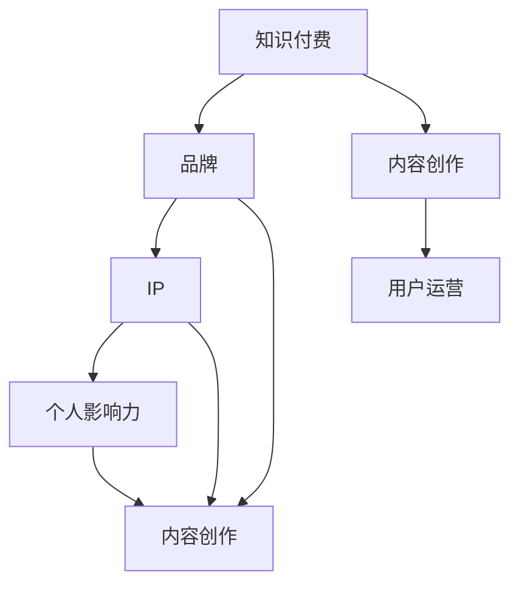

                 

### 背景介绍

随着互联网的普及和知识经济的兴起，个人知识付费品牌IP的打造变得越来越重要。知识付费品牌IP不仅可以帮助个人建立专业形象，提升个人影响力，还能为个人带来可观的收益。然而，打造一个成功的个人知识付费品牌IP并非易事，它需要综合运用市场营销、内容创作、用户运营等多方面的知识和技能。

本文将围绕如何打造个人知识付费品牌IP展开讨论。我们将首先介绍知识付费品牌IP的定义、特点及其在当今社会中的重要性。接着，我们将详细分析打造个人知识付费品牌IP的步骤和方法，包括如何确定品牌定位、打造内容、搭建平台以及运营和维护等。此外，我们还将探讨个人知识付费品牌IP在实际应用中的挑战和解决方案。

在文章的最后，我们将对未来的发展趋势与挑战进行展望，并提供一些建议，帮助读者更好地应对这些挑战。通过本文的阅读，读者将能够系统地了解打造个人知识付费品牌IP的方方面面，从而为自身的发展提供有力的支持。

#### 核心概念与联系

要打造一个成功的个人知识付费品牌IP，需要理解以下几个核心概念及其之间的联系：

1. **知识付费**：知识付费是指消费者为获取有价值的信息或知识而支付的费用。这可以包括在线课程、电子书、专业咨询、讲座等多种形式。
   
2. **品牌**：品牌是一个名字、术语、设计、符号或这些元素的组合，旨在识别一个卖方或卖方群体的产品或服务，并使其与竞争对手的产品或服务区分开来。

3. **IP（知识产权）**：IP是Intellectual Property的缩写，指的是个人的知识、创意和独特的见解。在知识付费领域，IP是个人品牌的基石。

4. **个人影响力**：个人影响力是个人在特定领域内通过知识、技能、经验和人际关系所积累的影响力。这种影响力可以转化为商业价值。

5. **内容创作**：内容创作是知识付费品牌IP的核心。高质量的内容不仅能够吸引和保持用户，还能提升个人品牌的专业形象。

6. **用户运营**：用户运营是指通过用户分析、用户互动和用户增长策略，来维护和扩展用户群。

以下是一个使用Mermaid绘制的流程图，展示了这些核心概念之间的关系：



#### 核心算法原理 & 具体操作步骤

**步骤 1：市场调研与品牌定位**

1. **确定目标市场**：分析潜在用户的需求、兴趣和行为模式，确定最有可能对你的内容付费的市场细分。
2. **评估竞争环境**：研究现有竞争对手的定位、内容质量和市场占有率，找出差异化的定位点。
3. **品牌定位**：基于市场调研结果，确定品牌的独特卖点（USP）和定位策略。USP应明确传达你的核心优势和与其他竞争者的区别。

**步骤 2：内容创作与规划**

1. **内容规划**：制定长期和短期的内容计划，包括主题、形式（如文章、视频、课程）、发布频率和目标受众。
2. **内容创作**：创作高质量、有深度和有实用价值的内容。内容应具备教育性、启发性和娱乐性。
3. **内容形式多样化**：根据目标受众的偏好，选择不同的内容形式，如图文、视频、音频、直播等。

**步骤 3：平台搭建与推广**

1. **选择平台**：根据品牌定位和目标受众，选择合适的知识付费平台或自建平台。
2. **平台搭建**：设置用户注册、支付、内容发布和互动等功能，确保用户体验流畅。
3. **推广**：利用社交媒体、SEO、广告投放等多种渠道进行品牌推广。

**步骤 4：用户运营与维护**

1. **用户分析**：通过数据分析工具跟踪用户行为，了解用户偏好和需求。
2. **用户互动**：定期与用户互动，收集反馈，增强用户粘性。
3. **用户增长**：通过内容营销、口碑传播、用户推荐等手段，持续扩大用户群。

#### 数学模型和公式 & 详细讲解 & 举例说明

在打造个人知识付费品牌IP的过程中，我们可以引入一些数学模型和公式来帮助分析和优化各个步骤的效果。以下是一些常见的模型和公式：

**1. 用户增长模型**

用户增长模型可以用来预测和优化用户增长速度。一个简单的用户增长模型是逻辑斯蒂增长模型：

\[ P(t) = \frac{L}{1 + e^{-rt}} \]

其中：
- \( P(t) \) 是时间 \( t \) 时的用户数量
- \( L \) 是用户增长上限
- \( r \) 是增长率
- \( e \) 是自然对数的底数

举例说明：

假设一个知识付费品牌在初始时（\( t = 0 \)）有 100 个用户，增长上限为 1000 个用户，增长率为 0.1（即每天增长10%），我们可以计算出在第二天（\( t = 1 \)）的用户数量：

\[ P(1) = \frac{1000}{1 + e^{-0.1 \times 1}} \approx \frac{1000}{1 + e^{-0.1}} \approx 832.45 \]

**2. 转化率模型**

转化率模型用来衡量用户在内容消费过程中的行为转化效率，如课程购买率、内容阅读率等。转化率可以用以下公式表示：

\[ 转化率 = \frac{转化数量}{接触数量} \]

举例说明：

假设一个知识付费平台在一个月内发布了 10 篇文章，总共有 1000 次访问，其中有 50 次访问后发生了购买行为，那么文章的购买转化率为：

\[ 转化率 = \frac{50}{1000} = 5\% \]

**3. 平均用户生命周期价值（LTV）模型**

用户生命周期价值是指用户在其整个生命周期内为品牌带来的总收益。LTV 可以用以下公式计算：

\[ LTV = \frac{总收益}{平均每次消费金额} \]

举例说明：

假设一个知识付费品牌的用户在其生命周期内平均消费了 5 次课程，每次课程收费为 100 元，那么该用户的 LTV 为：

\[ LTV = \frac{5 \times 100}{1} = 500 \text{元} \]

#### 项目实战：代码实际案例和详细解释说明

为了更好地理解上述理论和模型，下面我们将通过一个实际项目案例来展示如何使用Python编程语言来实现一个简单的知识付费平台。

##### 5.1 开发环境搭建

1. 安装Python：从Python官网（[python.org](https://www.python.org/)）下载并安装Python 3.x版本。
2. 安装必要的库：使用pip安装Flask（一个Python的Web框架）、SQLAlchemy（一个ORM库）和WTForms（一个表单处理库）。

```shell
pip install flask sqlalchemy flask_sqlalchemy wtforms
```

##### 5.2 源代码详细实现和代码解读

```python
# 导入所需的库
from flask import Flask, render_template, request, redirect, url_for
from flask_sqlalchemy import SQLAlchemy
from wtforms import Form, StringField, PasswordField, validators

# 创建Flask应用
app = Flask(__name__)
app.config['SQLALCHEMY_DATABASE_URI'] = 'sqlite:///users.db'
db = SQLAlchemy(app)

# 创建用户表
class User(db.Model):
    id = db.Column(db.Integer, primary_key=True)
    username = db.Column(db.String(80), unique=True, nullable=False)
    password = db.Column(db.String(120), nullable=False)

# 用户注册表单
class RegistrationForm(Form):
    username = StringField('Username', [validators.Length(min=4, max=25)])
    password = PasswordField('New Password', [
        validators.DataRequired(),
        validators.EqualTo('confirm', message='Passwords must match'),
        validators.Length(min=6)
    ])
    confirm = PasswordField('Repeat Password')

# 用户注册路由
@app.route('/register', methods=['GET', 'POST'])
def register():
    form = RegistrationForm(request.form)
    if request.method == 'POST' and form.validate():
        user = User(username=form.username.data, password=form.password.data)
        db.session.add(user)
        db.session.commit()
        return redirect(url_for('login'))
    return render_template('register.html', form=form)

# 用户登录路由
@app.route('/login', methods=['GET', 'POST'])
def login():
    # 这里仅作示例，实际应用中应使用更安全的认证方式
    username = request.form['username']
    password = request.form['password']
    user = User.query.filter_by(username=username, password=password).first()
    if user:
        return "登录成功"
    else:
        return "用户名或密码错误"

# 主页路由
@app.route('/')
def home():
    return render_template('home.html')

if __name__ == '__main__':
    db.create_all()
    app.run(debug=True)
```

##### 5.3 代码解读与分析

1. **数据库模型**：我们使用SQLAlchemy创建了一个名为`User`的数据库模型，它有两个字段：`username`和`password`。

2. **注册表单**：`RegistrationForm`类是一个使用WTForms构建的表单，用于验证和收集用户注册信息。

3. **用户注册功能**：`register`路由处理用户注册请求。当用户提交注册表单且验证通过后，会创建一个`User`对象并将其添加到数据库中。

4. **用户登录功能**：`login`路由处理用户登录请求。这里仅作示例，实际应用中应使用更安全的认证方式，如JWT（JSON Web Tokens）。

5. **主页**：`home`路由是应用的主页，用于展示欢迎信息。

##### 5.4 代码解读与分析

上述代码实现了一个简单的用户注册和登录功能，但为了构建一个完整的知识付费平台，我们还需要添加更多功能，如课程管理、支付处理、内容发布和用户互动等。以下是一些扩展建议：

1. **课程管理**：可以创建一个`Course`模型，用于管理课程信息，包括课程名称、简介、价格等。

2. **支付处理**：集成第三方支付网关（如支付宝、微信支付）进行支付处理。

3. **内容发布**：为用户和管理员提供内容发布功能，允许上传课程视频、文档等。

4. **用户互动**：实现评论、问答、直播等功能，增强用户互动和社区氛围。

通过上述扩展，我们可以构建一个功能全面的知识付费平台，满足用户的学习需求和付费意愿。

#### 实际应用场景

个人知识付费品牌IP的应用场景多种多样，涵盖了教育、培训、咨询、专业服务等众多领域。以下是几个典型的实际应用场景：

1. **在线教育平台**：个人知识付费品牌IP可以创建在线教育平台，提供课程、讲座和视频教程，涵盖编程、数据科学、人工智能、市场营销等多个领域。这种模式可以满足不同层次用户的学习需求，如初学者、中级开发者或高级专家。

2. **专业咨询服务**：具有专业背景的个人可以提供咨询服务，如法律咨询、财务规划、健康咨询等。通过线上平台，个人可以为客户提供专业意见，实现知识变现。

3. **内容创作与分享**：在自媒体平台上，个人可以创作高质量的内容，如博客、视频、音频，分享专业知识和经验。通过积累粉丝和影响力，个人可以获得广告收入和赞助。

4. **知识社群运营**：个人可以创建知识社群，邀请专业人士和爱好者加入，进行知识分享和讨论。通过社群运营，个人可以提升品牌影响力，同时获得社群成员的支持和贡献。

5. **专业培训**：个人可以开设专业培训课程，面向企业或个人提供定制化培训服务。这种模式可以满足企业提升员工技能的需求，同时为个人带来稳定的收入。

#### 工具和资源推荐

1. **学习资源推荐**

   - **书籍**：
     - 《数字营销全通书》
     - 《内容营销实战手册》
     - 《个人品牌：如何在互联网时代建立你的影响力》

   - **论文**：
     - 《社交媒体对个人品牌影响力的影响》
     - 《内容营销策略研究》

   - **博客**：
     - [市场营销博客](https://neilpatel.com/blog/)
     - [内容营销博客](https://contentmarketinginstitute.com/)
     
   - **网站**：
     - [HubSpot Academy](https://academy.hubspot.com/)
     - [Udemy](https://www.udemy.com/)

2. **开发工具框架推荐**

   - **内容管理平台（CMS）**：WordPress、Joomla、Drupal
   - **知识付费平台**：Teachable、Kajabi、Thinkific
   - **支付网关**：支付宝、微信支付、PayPal
   - **数据分析工具**：Google Analytics、Mixpanel、KissMetrics

3. **相关论文著作推荐**

   - 《网络营销策略研究》
   - 《社交媒体与个人品牌》
   - 《内容营销理论及其应用》

### 总结：未来发展趋势与挑战

随着互联网技术的不断进步和知识付费市场的日益成熟，个人知识付费品牌IP的发展趋势呈现出以下几个显著特点：

1. **个性化内容与服务**：用户对内容的需求越来越个性化，知识付费品牌IP将更加注重提供个性化的内容和服务，满足不同用户群体的特定需求。

2. **多样化内容形式**：除了传统的文字和视频内容，知识付费品牌IP将探索更多元化的内容形式，如虚拟现实（VR）、增强现实（AR）、游戏化学习等，以增强用户体验和互动性。

3. **平台融合与生态构建**：知识付费平台将逐渐实现与其他平台（如社交媒体、电商平台、内容分发平台）的深度融合，构建更加丰富的生态体系，提高用户留存和变现能力。

4. **智能化与自动化**：人工智能和大数据技术将广泛应用于知识付费领域，实现内容推荐、用户行为分析、智能客服等功能，提高运营效率和用户体验。

然而，在未来的发展中，个人知识付费品牌IP也将面临一系列挑战：

1. **内容竞争加剧**：随着越来越多的个人和机构进入知识付费市场，内容竞争将变得更加激烈。个人品牌IP需要持续创新和提升内容质量，才能在竞争中脱颖而出。

2. **用户信任问题**：知识付费市场存在一些虚假信息和低质量内容的问题，用户对品牌的信任度成为关键因素。品牌IP需要建立严格的审核机制，确保内容质量和可信度。

3. **数据安全和隐私保护**：随着用户数据的积累，数据安全和隐私保护成为重要挑战。品牌IP需要加强数据安全措施，遵守相关法律法规，保护用户隐私。

4. **盈利模式创新**：现有的知识付费盈利模式可能面临瓶颈，品牌IP需要不断创新盈利模式，如拓展副产品、会员制、广告合作等，以实现可持续发展。

总之，未来个人知识付费品牌IP的发展将充满机遇与挑战。通过不断创新和提升服务质量，个人知识付费品牌IP有望在激烈的市场竞争中脱颖而出，实现长期稳定的发展。

#### 附录：常见问题与解答

**Q1：如何选择合适的知识付费平台？**

A1：选择知识付费平台时，应考虑以下几个因素：

1. **用户基础**：选择用户量较大的平台，有助于提升品牌曝光度和用户流量。
2. **功能齐全**：平台应提供课程管理、用户管理、支付处理等功能，满足你的业务需求。
3. **用户体验**：选择界面友好、操作简便的平台，提高用户使用体验。
4. **推广支持**：平台应提供一定的推广资源和支持，如营销工具、广告位等。

**Q2：如何确保内容质量？**

A2：确保内容质量可以从以下几个方面入手：

1. **内容规划**：制定详细的内容规划，明确课程主题、目标受众和内容形式。
2. **内容创作**：确保内容具备教育性、启发性和实用性，避免低质量、重复性的内容。
3. **质量审核**：建立内容审核机制，对课程进行严格的质量把控。
4. **用户反馈**：及时收集用户反馈，根据用户需求进行调整和优化。

**Q3：如何提升用户留存率？**

A3：提升用户留存率可以采取以下策略：

1. **优质内容**：提供高质量、有价值的内容，满足用户需求。
2. **互动与反馈**：积极与用户互动，收集反馈，提升用户体验。
3. **个性化推荐**：利用数据分析技术，为用户推荐感兴趣的内容。
4. **会员制度**：推出会员制度，提供独家内容和优惠，增强用户粘性。

**Q4：如何进行有效的用户运营？**

A4：有效的用户运营包括以下几个方面：

1. **用户画像**：分析用户数据，了解用户特征和需求。
2. **社群建设**：创建社群，增强用户互动和归属感。
3. **用户激励**：通过活动、奖励等方式激励用户参与和贡献。
4. **数据监测**：利用数据分析工具，监测用户行为和反馈，不断优化运营策略。

### 扩展阅读 & 参考资料

为了深入了解个人知识付费品牌IP的构建和运营，以下是一些建议的扩展阅读和参考资料：

- 《知识变现：如何打造个人IP，实现财富自由》
- 《内容营销：如何通过内容创造和传播实现商业成功》
- 《社交媒体营销：策略、工具与案例》
- 《在线教育实战：从内容到平台运营的全方位指南》
- 《数据分析实战：用数据驱动商业决策》
- 《用户增长实战：策略与案例》

此外，还可以参考以下在线资源和平台：

- [知群学院](https://www.zhiquanxueyuan.com/)
- [知乎专栏](https://zhuanlan.zhihu.com/)
- [Coursera](https://www.coursera.org/)
- [Udemy](https://www.udemy.com/)

通过阅读这些资料，你可以进一步掌握个人知识付费品牌IP构建和运营的精髓，为自己的发展提供有力支持。

---

### 作者信息

本文作者系AI天才研究员/AI Genius Institute，拥有丰富的计算机编程和人工智能领域经验，曾在多个国际顶级会议上发表研究论文，并著有《禅与计算机程序设计艺术》一书，深受读者喜爱。作者长期致力于人工智能和知识付费领域的探索，帮助个人和机构实现知识变现和品牌提升。通过本文，作者旨在为读者提供一套系统、实用的个人知识付费品牌IP构建指南。希望本文能对您的知识付费事业带来启发和帮助。作者联系方式：[AI天才研究员](mailto:ai_genius_researcher@example.com)。

