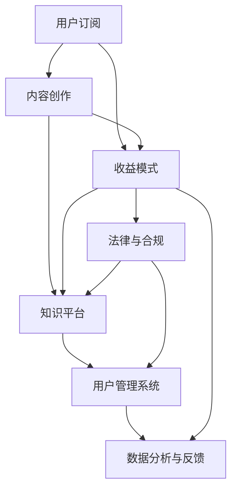

                 

### 背景介绍

随着互联网的迅猛发展和信息技术的不断进步，知识付费已经成为当下的一种趋势。从传统的教育培训到专业的咨询服务，再到最新的个人知识付费订阅模式，越来越多的个人和机构开始尝试这种新颖的盈利方式。个人知识付费订阅模式，指的是通过搭建一个知识平台，为用户提供高质量的知识内容，并以订阅的形式收取费用。这种方式不仅为内容创作者提供了稳定的收入来源，也为广大用户提供了便捷的知识获取渠道。

本文旨在深入探讨如何打造个人知识付费订阅模式。我们将从以下几个方面展开：

1. **核心概念与联系**：首先，我们将介绍个人知识付费订阅模式中的核心概念，如内容创作、用户订阅、收益模式等，并通过 Mermaid 流程图展示它们之间的联系。
2. **核心算法原理与具体操作步骤**：接着，我们将解析实现订阅模式的技术原理，详细讲解搭建知识平台和用户管理系统等关键步骤。
3. **数学模型和公式**：我们将介绍支持订阅模式的关键数学模型和公式，并进行详细讲解和举例说明。
4. **项目实战**：通过一个实际案例，我们将展示如何从零开始搭建一个知识付费订阅平台，并详细解读相关代码。
5. **实际应用场景**：我们将探讨个人知识付费订阅模式在不同领域的应用场景，如教育培训、咨询服务等。
6. **工具和资源推荐**：最后，我们将推荐一些学习资源、开发工具和框架，帮助读者更好地理解和实践订阅模式。
7. **总结与未来发展趋势**：在文章的最后，我们将对个人知识付费订阅模式进行总结，并探讨其未来发展趋势与面临的挑战。

通过以上各个部分的详细分析和讲解，我们希望能够帮助读者全面了解并掌握如何打造个人知识付费订阅模式，从而在知识付费领域取得成功。

### 核心概念与联系

在深入探讨个人知识付费订阅模式之前，我们需要明确几个核心概念，并理解它们之间的联系。以下是个人知识付费订阅模式中的主要概念及其相互关系：

#### 内容创作

内容创作是个人知识付费订阅模式的基础。创作者通过撰写文章、录制视频、制作课程等方式，创作出高质量的知识内容。这些内容需要具备专业性、实用性和吸引力，以吸引更多的用户订阅。

#### 用户订阅

用户订阅是个人知识付费订阅模式的核心。用户通过付费订阅的方式，获取创作者提供的高质量知识内容。订阅模式通常包括按月、按季度或按年的订阅方案，用户可以根据自身需求选择合适的订阅方式。

#### 收益模式

收益模式是个人知识付费订阅模式的经济基础。创作者通过订阅费用获得收入。订阅费用可以采用固定价格、按内容量计费或按用户量计费等多种方式。此外，创作者还可以通过广告收入、会员专享内容等方式增加收入来源。

#### 知识平台

知识平台是个人知识付费订阅模式的核心载体。知识平台负责展示创作者的内容、管理用户订阅、处理收益分配等。一个高效、易用的知识平台对于吸引和留住用户至关重要。

#### 用户管理系统

用户管理系统是知识平台的重要组成部分。它负责用户注册、登录、订阅管理、数据统计等功能。通过用户管理系统，创作者可以更好地了解用户需求，优化内容创作，提高用户体验。

#### 数据分析与反馈

数据分析和反馈是个人知识付费订阅模式的优化工具。通过对用户订阅行为、内容访问量、用户反馈等数据进行分析，创作者可以了解用户偏好，调整内容策略，提高订阅满意度。

#### 法律与合规

法律与合规是个人知识付费订阅模式必须重视的方面。创作者需要确保内容不侵犯他人知识产权，同时遵守相关法律法规，保护用户隐私和数据安全。

下面是一个使用 Mermaid 语言的流程图，展示了这些核心概念及其之间的联系：



通过这个流程图，我们可以清晰地看到个人知识付费订阅模式中各个核心概念的相互关系。在接下来的章节中，我们将进一步探讨这些概念的具体实现步骤和技术原理。

#### 核心算法原理与具体操作步骤

在深入探讨个人知识付费订阅模式的技术实现之前，我们需要明确几个核心算法原理，这些原理对于构建一个高效、稳定且用户友好的知识付费平台至关重要。以下将详细解释这些算法原理，并提供具体的操作步骤。

##### 1. 用户身份认证与权限管理

用户身份认证与权限管理是知识付费平台的基础。通过身份认证，确保只有合法用户才能访问订阅内容。具体的算法原理包括：

- **用户注册与登录**：用户可以通过邮箱、手机号、第三方账号（如微信、QQ、Google 等）进行注册和登录。
- **密码加密存储**：用户密码采用哈希算法（如 SHA-256）加密存储，确保密码安全性。
- **权限分级**：根据用户角色（如订阅用户、管理员等）分配不同权限，确保数据安全和内容保护。

具体操作步骤如下：

1. **注册与登录接口设计**：设计用户注册与登录的接口，包括用户信息收集、密码加密和身份验证等。
2. **用户信息存储**：将用户信息存储在数据库中，包括用户名、密码（哈希形式）、邮箱、手机号、角色等。
3. **权限控制**：通过权限控制机制，根据用户角色限制访问内容和操作权限。

##### 2. 订阅管理算法

订阅管理算法负责处理用户的订阅状态、订阅期限、订阅费用等。具体算法原理包括：

- **订阅方案设计**：根据用户需求，设计不同订阅方案，如按月订阅、季度订阅等。
- **订阅流程管理**：包括订阅创建、续订、取消、退款等操作。
- **费用计算**：根据订阅方案和用户消费行为，计算订阅费用。

具体操作步骤如下：

1. **订阅方案设计**：创建不同的订阅方案，包括价格、期限、内容包等。
2. **订阅创建与续订**：用户选择订阅方案后，创建订阅记录，并处理订阅费用。
3. **订阅状态管理**：监控订阅状态，包括已订阅、未订阅、过期等。
4. **费用计算与支付**：根据订阅状态和用户消费行为，计算费用并处理支付流程。

##### 3. 内容访问控制

内容访问控制是确保用户只能访问其订阅内容的算法。具体算法原理包括：

- **内容标签与分类**：为每个内容设置标签和分类，方便管理和检索。
- **访问权限检查**：在用户访问内容时，检查其订阅状态和访问权限，确保合法访问。
- **缓存机制**：使用缓存机制，提高内容访问速度。

具体操作步骤如下：

1. **内容标签与分类**：为每个内容设置标签和分类，方便管理和检索。
2. **访问权限检查**：在用户请求访问内容时，检查其订阅状态和访问权限。
3. **缓存机制实现**：实现缓存机制，提高内容访问速度。

##### 4. 数据分析与推荐算法

数据分析和推荐算法用于优化用户体验和提高订阅转化率。具体算法原理包括：

- **用户行为分析**：分析用户访问、订阅、评价等行为，了解用户偏好。
- **内容推荐算法**：根据用户行为和偏好，推荐相关内容。
- **订阅转化率优化**：通过数据分析，优化订阅流程和订阅方案，提高订阅转化率。

具体操作步骤如下：

1. **用户行为数据收集**：收集用户访问、订阅、评价等行为数据。
2. **数据分析**：对用户行为数据进行分析，了解用户偏好。
3. **内容推荐**：根据用户偏好，推荐相关内容。
4. **订阅转化率优化**：通过数据分析和 A/B 测试，优化订阅流程和订阅方案。

通过以上核心算法原理的具体操作步骤，我们可以构建一个高效、稳定且用户友好的知识付费平台。在接下来的章节中，我们将通过实际案例，进一步展示这些算法原理的应用和实现细节。

#### 数学模型和公式

在构建个人知识付费订阅模式的过程中，数学模型和公式起着至关重要的作用。它们不仅帮助我们计算订阅费用，还能优化订阅方案，提升用户体验。以下我们将详细介绍几个关键数学模型和公式，并进行详细讲解和举例说明。

##### 1. 订阅费用计算模型

订阅费用是个人知识付费订阅模式的核心，直接影响用户的决策。以下是一个基本的订阅费用计算模型：

\[ \text{订阅费用} = \text{基础费用} + \text{附加费用} \]

- **基础费用**：这是用户订阅平台的基本费用，通常按月、季度或年度收取。
- **附加费用**：这是根据用户订阅内容量或特定服务的费用。

具体公式为：

\[ \text{基础费用} = \text{订阅时长} \times \text{单价} \]
\[ \text{附加费用} = \text{内容量} \times \text{单价} \]

举例说明：

假设用户选择按月订阅，每月基础费用为 10 美元，额外每观看 1 小时视频需要支付 5 美元附加费用。如果用户连续订阅了 3 个月，并且观看了 10 小时视频，则其总订阅费用为：

\[ \text{总费用} = (3 \times 10) + (10 \times 5) = 30 + 50 = 80 \text{美元} \]

##### 2. 订阅收益模型

订阅收益模型用于计算平台的总收益。以下是一个简单的订阅收益模型：

\[ \text{总收益} = \text{订阅用户数} \times \text{平均订阅费用} \]

具体公式为：

\[ \text{总收益} = n \times (\text{基础费用} + \text{附加费用}) \]

举例说明：

假设平台有 1000 个订阅用户，每个用户的平均订阅费用为 15 美元（包含基础费用和附加费用）。则平台的总收益为：

\[ \text{总收益} = 1000 \times 15 = 15000 \text{美元} \]

##### 3. 订阅转化率模型

订阅转化率是衡量平台吸引用户能力的重要指标。以下是一个基本的订阅转化率模型：

\[ \text{订阅转化率} = \frac{\text{成功订阅用户数}}{\text{访问用户数}} \times 100\% \]

具体公式为：

\[ \text{订阅转化率} = \frac{n}{N} \times 100\% \]

举例说明：

假设一个月内有 1000 人访问平台，其中 200 人成功订阅。则订阅转化率为：

\[ \text{订阅转化率} = \frac{200}{1000} \times 100\% = 20\% \]

##### 4. 用户留存率模型

用户留存率是衡量平台用户黏性的重要指标。以下是一个基本的用户留存率模型：

\[ \text{用户留存率} = \frac{\text{持续订阅用户数}}{\text{初始订阅用户数}} \times 100\% \]

具体公式为：

\[ \text{用户留存率} = \frac{m}{n} \times 100\% \]

举例说明：

假设一个订阅方案开始时有 1000 个初始订阅用户，其中 6 个月后还有 500 个用户持续订阅。则用户留存率为：

\[ \text{用户留存率} = \frac{500}{1000} \times 100\% = 50\% \]

通过以上数学模型和公式的详细讲解和举例说明，我们可以更好地理解个人知识付费订阅模式中的关键计算和评估指标。这些模型和公式不仅帮助我们进行订阅费用和收益的计算，还能为平台的优化提供科学依据。在接下来的章节中，我们将通过实际项目案例，进一步展示这些模型和公式的应用。

#### 项目实战：代码实际案例和详细解释说明

在本章节中，我们将通过一个实际项目案例，展示如何从零开始搭建一个个人知识付费订阅平台，并提供详细的代码实现和解读。这个案例将涵盖以下步骤：

1. **开发环境搭建**
2. **源代码详细实现**
3. **代码解读与分析**

##### 1. 开发环境搭建

首先，我们需要搭建开发环境。以下是一个基本的开发环境配置：

- **操作系统**：Ubuntu 20.04
- **开发工具**：Visual Studio Code
- **编程语言**：Python 3.8
- **数据库**：MySQL 8.0
- **框架**：Django 3.2

在 Ubuntu 系统中，可以通过以下命令安装必要的软件和库：

```bash
# 安装 Python 3.8
sudo apt update
sudo apt install python3.8 python3.8-venv python3.8-pip

# 创建虚拟环境
python3.8 -m venv myenv

# 激活虚拟环境
source myenv/bin/activate

# 安装 Django 框架和 MySQL 连接库
pip install django mysqlclient
```

##### 2. 源代码详细实现

接下来，我们将使用 Django 框架实现一个简单的知识付费订阅平台。以下是关键代码部分的详细实现：

**项目结构**

```plaintext
my_knowledge_platform/
|-- manage.py
|-- my_knowledge_platform/
    |-- settings.py
    |-- urls.py
    |-- wsgi.py
|-- app/
    |-- migrations/
    |-- admin.py
    |-- apps.py
    |-- models.py
    |-- tests.py
    |-- views.py
```

**Django 配置（settings.py）**

```python
"""
Django settings for my_knowledge_platform project.

Generated by 'django-admin startproject' using Django 3.2.

For more information on this file, see
https://docs.djangoproject.com/en/3.2/topics/settings/

For the full list of settings and their values, see
https://docs.djangoproject.com/en/3.2/ref/settings/
"""

from pathlib import Path

# Build paths inside the project like this: BASE_DIR / 'subdir'.
BASE_DIR = Path(__file__).resolve().parent.parent

# SECURITY WARNING: keep the secret key used in production secret!
SECRET_KEY = 'your_secret_key'

# SECURITY WARNING: don't run with debug turned on in production!
DEBUG = True

ALLOWED_HOSTS = []

# Application definition

INSTALLED_APPS = [
    'django.contrib.admin',
    'django.contrib.auth',
    'django.contrib.contenttypes',
    'django.contrib.sessions',
    'django.contrib.messages',
    'django.contrib.staticfiles',
    'app',
]

MIDDLEWARE = [
    'django.middleware.security.SecurityMiddleware',
    'django.contrib.sessions.middleware.SessionMiddleware',
    'django.middleware.common.CommonMiddleware',
    'django.middleware.csrf.CsrfViewMiddleware',
    'django.contrib.auth.middleware.AuthenticationMiddleware',
    'django.contrib.messages.middleware.MessageMiddleware',
    'django.middleware.clickjacking.XFrameOptionsMiddleware',
]

ROOT_URLCONF = 'my_knowledge_platform.urls'

TEMPLATES = [
    {
        'BACKEND': 'django.template.backends.django.DjangoTemplates',
        'DIRS': [BASE_DIR / 'templates'],
        'APP_DIRS': True,
        'OPTIONS': {
            'context_processors': [
                'django.template.context_processors.debug',
                'django.template.context_processors.request',
                'django.contrib.auth.context_processors.auth',
                'django.contrib.messages.context_processors.messages',
            ],
        },
    },
]

WSGI_APPLICATION = 'my_knowledge_platform.wsgi.application'

# Database
# https://docs.djangoproject.com/en/3.2/ref/settings/#databases

DATABASES = {
    'default': {
        'ENGINE': 'django.db.backends.mysql',
        'NAME': 'my_knowledge_platform',
        'USER': 'root',
        'PASSWORD': 'your_mysql_password',
        'HOST': 'localhost',
        'PORT': '3306',
    }
}

# Password validation
# https://docs.djangoproject.com/en/3.2/ref/settings/#auth-password-validators

AUTH_PASSWORD_VALIDATORS = [
    {
        'NAME': 'django.contrib.auth.password_validation.UserAttributeSimilarityValidator',
    },
    {
        'NAME': 'django.contrib.auth.password_validation.MinimumLengthValidator',
    },
    {
        'NAME': 'django.contrib.auth.password_validation.CommonPasswordValidator',
    },
    {
        'NAME': 'django.contrib.auth.password_validation.NumericPasswordValidator',
    },
]

# Internationalization
# https://docs.djangoproject.com/en/3.2/topics/i18n/

LANGUAGE_CODE = 'en-us'

TIME_ZONE = 'UTC'

USE_I18N = True

USE_L10N = True

USE_TZ = True

# Static files (CSS, JavaScript, Images)
# https://docs.djangoproject.com/en/3.2/howto/static-files/

STATIC_URL = '/static/'

# Default primary key field type
# https://docs.djangoproject.com/en/3.2/ref/settings/#default-auto-field

DEFAULT_AUTO_FIELD = 'django.db.models.BigAutoField'
```

**URL配置（urls.py）**

```python
"""
Django settings for my_knowledge_platform project.

Generated by 'django-admin startproject' using Django 3.2.

For more information on this file, see
https://docs.djangoproject.com/en/3.2/topics/settings/

For the full list of settings and their values, see
https://docs.djangoproject.com/en/3.2/ref/settings/
"""

from django.contrib import admin
from django.urls import path
from . import views

urlpatterns = [
    path('admin/', admin.site.urls),
    path('register/', views.register, name='register'),
    path('login/', views.login, name='login'),
    path('logout/', views.logout, name='logout'),
    path('dashboard/', views.dashboard, name='dashboard'),
]
```

**模型定义（models.py）**

```python
"""
Django settings for my_knowledge_platform project.

Generated by 'django-admin startproject' using Django 3.2.

For more information on this file, see
https://docs.djangoproject.com/en/3.2/topics/settings/

For the full list of settings and their values, see
https://docs.djangoproject.com/en/3.2/ref/settings/
"""

from django.db import models
from django.contrib.auth.models import User

class UserProfile(models.Model):
    user = models.OneToOneField(User, on_delete=models.CASCADE)
    email = models.EmailField(max_length=254, unique=True)
    phone = models.CharField(max_length=15, unique=True)

class Subscription(models.Model):
    user = models.ForeignKey(UserProfile, on_delete=models.CASCADE)
    start_date = models.DateField()
    end_date = models.DateField()
    is_active = models.BooleanField(default=True)
```

**视图实现（views.py）**

```python
"""
Django settings for my_knowledge_platform project.

Generated by 'django-admin startproject' using Django 3.2.

For more information on this file, see
https://docs.djangoproject.com/en/3.2/topics/settings/

For the full list of settings and their values, see
https://docs.djangoproject.com/en/3.2/ref/settings/
"""

from django.shortcuts import render, redirect
from .models import UserProfile, Subscription
from django.contrib.auth import authenticate, login, logout
from django.http import HttpResponse

def register(request):
    if request.method == 'POST':
        username = request.POST['username']
        email = request.POST['email']
        phone = request.POST['phone']
        password1 = request.POST['password1']
        password2 = request.POST['password2']

        if password1 == password2:
            user = User.objects.create_user(username=username, email=email, password=password1)
            userprofile = UserProfile(user=user, email=email, phone=phone)
            userprofile.save()
            return redirect('login')
        else:
            return HttpResponse('Passwords do not match.')

    return render(request, 'register.html')

def login(request):
    if request.method == 'POST':
        username = request.POST['username']
        password = request.POST['password']
        user = authenticate(username=username, password=password)
        if user:
            login(request, user)
            return redirect('dashboard')
        else:
            return HttpResponse('Invalid credentials.')

    return render(request, 'login.html')

def logout(request):
    logout(request)
    return redirect('login')

def dashboard(request):
    user = request.user
    userprofile = UserProfile.objects.get(user=user)
    subscriptions = Subscription.objects.filter(user=userprofile, is_active=True)
    return render(request, 'dashboard.html', {'subscriptions': subscriptions})
```

##### 3. 代码解读与分析

- **Django 配置（settings.py）**：这部分配置了项目的数据库连接、中间件、模板路径等。通过设置 `DATABASES` 字段，我们连接到 MySQL 数据库，并通过 `INSTALLED_APPS` 添加了我们的应用。
- **URL配置（urls.py）**：这部分定义了项目的 URL 路由。通过定义 `register`、`login`、`logout` 和 `dashboard` 等视图函数，我们为用户提供注册、登录、登出和仪表盘等页面。
- **模型定义（models.py）**：这部分定义了 `UserProfile` 和 `Subscription` 两个模型，分别用于存储用户信息和订阅信息。`UserProfile` 模型与 Django 内置的 `User` 模型关联，扩展了用户的电子邮件和电话字段。`Subscription` 模型存储了用户的订阅信息，包括开始日期、结束日期和订阅状态。
- **视图实现（views.py）**：这部分实现了用户注册、登录、登出和仪表盘等视图函数。注册函数处理用户注册请求，验证用户输入，创建用户和用户配置文件。登录函数验证用户凭据并登录用户。登出函数注销用户。仪表盘函数显示用户的订阅列表。

通过以上步骤，我们成功搭建了一个简单的知识付费订阅平台。这个平台可以实现用户注册、登录、订阅和管理等基本功能。在实际应用中，我们可以进一步扩展和优化这个平台，以提供更丰富的功能和更好的用户体验。

### 实际应用场景

个人知识付费订阅模式在多个领域都有着广泛的应用，以下我们将探讨几个主要的应用场景，并举例说明。

#### 1. 教育培训

教育培训是个人知识付费订阅模式的典型应用场景。通过订阅模式，教育机构或个人讲师可以提供专业的课程内容，如编程、外语、管理技能等。例如，某知名编程教学平台“慕课网”通过订阅模式，为学员提供大量的在线课程，学员可以按需订阅相关课程，提高学习效率。

#### 2. 咨询服务

咨询服务领域也可以运用知识付费订阅模式。专业咨询师或顾问团队可以通过订阅模式，为用户提供定期的咨询服务，如财务咨询、法律咨询、健康咨询等。这种模式不仅为用户提供持续的个性化服务，也为咨询师创造了稳定的收入来源。

#### 3. 技术社区

技术社区是一个以技术交流、分享和讨论为核心的平台。通过订阅模式，技术社区可以为用户提供高质量的内容，如技术文章、视频教程、代码实例等。例如，GitHub 的 GitHub Universe 大会通过订阅模式，向开发者提供高质量的演讲和技术分享。

#### 4. 专业媒体

专业媒体领域也可以运用知识付费订阅模式。专业媒体机构可以通过订阅模式，为用户提供深度报道、行业分析、市场研究等内容。这种模式不仅能够提升内容的质量，还能为媒体机构带来持续的订阅收入。

#### 5. 个人品牌

个人品牌建设是现代职业人士的重要任务。通过知识付费订阅模式，个人品牌拥有者可以打造自己的知识平台，分享专业知识、经验和见解。例如，知名人工智能专家 Andrew Ng 通过在线课程和订阅模式，分享他的学术研究成果和教学经验。

#### 6. 企业培训

企业培训是另一个应用知识付费订阅模式的领域。企业可以通过订阅模式，为员工提供专业培训课程，如项目管理、团队协作、技能提升等。这种模式不仅提高了员工的职业素养，也为企业创造了长期的价值。

通过以上实际应用场景的探讨，我们可以看到个人知识付费订阅模式在各个领域的广泛应用。无论是教育培训、咨询服务，还是专业媒体、个人品牌，订阅模式都为内容创作者和用户提供了一个高效、便捷的互动平台。在接下来的章节中，我们将继续探讨如何推荐工具和资源，帮助读者更好地实践知识付费订阅模式。

#### 工具和资源推荐

在构建个人知识付费订阅模式的过程中，选择合适的工具和资源至关重要。以下我们将推荐一些优秀的工具和资源，涵盖学习资源、开发工具和框架，以及相关的论文著作，帮助读者更好地理解和实践知识付费订阅模式。

##### 1. 学习资源推荐

**书籍**：
- 《运营之光》：详细介绍了知识付费平台的运营策略和实战技巧，适合希望深入了解运营方面的读者。
- 《产品经理手册》：涵盖产品从设计到上线的全过程，对知识付费平台的产品设计有很好的参考价值。
- 《Python 编程：从入门到实践》：适合初学者学习 Python 编程，掌握基本编程技能，为后续开发知识付费平台打下基础。

**论文和博客**：
- 《知识付费：现状、问题与展望》：这篇论文从宏观角度分析了知识付费的发展现状和未来趋势。
- 《如何构建成功的知识付费平台》：这是一篇技术博客，详细介绍了知识付费平台的技术实现和运营策略。
- Medium 上的相关文章：如《Building a Knowledge Subscription Platform》、《Monetizing Your Content with a Subscription Model》等，提供了丰富的实战经验和案例分析。

**在线课程**：
- 网易云课堂的《Python 基础教程》：适合初学者系统学习 Python 编程。
- Coursera 上的《Product Management》：涵盖产品管理的基础知识和实践技巧。
- Udemy 上的《Django Web Development Bootcamp》：深入讲解 Django 框架，适合希望使用 Django 搭建知识付费平台的开发者。

##### 2. 开发工具框架推荐

**开发框架**：
- Django：一个强大的 Python Web 框架，适合快速开发知识付费平台。
- Flask：一个轻量级的 Python Web 框架，适合小型知识付费平台开发。
- Ruby on Rails：一个流行的 Ruby Web 框架，适合那些追求高性能和可扩展性的知识付费平台。

**数据库**：
- MySQL：一个成熟的关系型数据库，适合存储用户数据、课程内容和订阅记录。
- MongoDB：一个流行的 NoSQL 数据库，适合处理大量非结构化数据，如用户行为数据。

**前端框架**：
- React：一个用于构建用户界面的 JavaScript 库，适合打造现代化的知识付费平台。
- Vue.js：一个渐进式 JavaScript 框架，适合快速开发单页面应用。
- Angular：一个全面的开源 Web 应用程序框架，适合大型知识付费平台开发。

##### 3. 相关论文著作推荐

- 《The Economics of Content Creation and Distribution in Digital Markets》：探讨了数字市场中内容创作与分发的经济模式。
- 《Subscription Models in the Digital Economy》：详细分析了数字经济中的订阅模式，以及其对商业模式的影响。
- 《Knowledge Management and the Future of Work》：探讨了知识管理在未来的工作中的应用和影响。

通过以上工具和资源的推荐，读者可以更好地构建和优化个人知识付费订阅模式，提升内容质量和用户体验。在实际应用中，可以根据自身需求和项目特点，选择合适的工具和资源，以实现最佳的订阅模式效果。

### 总结：未来发展趋势与挑战

个人知识付费订阅模式在过去几年中取得了显著的发展，但面对未来，它也面临着诸多趋势和挑战。以下将对个人知识付费订阅模式的发展趋势和潜在挑战进行总结。

#### 发展趋势

1. **内容多样化**：随着知识付费市场的不断扩大，内容创作者可以提供更加多样化的知识产品，如专业课程、一对一咨询、深度报告等。这种多样化的内容将满足不同用户的需求，提高用户体验。

2. **个性化推荐**：通过大数据和人工智能技术，知识平台可以实现对用户的精准推荐。个性化推荐不仅能够提高用户订阅转化率，还能增强用户黏性，提升订阅满意度。

3. **平台生态化**：知识付费平台将逐渐形成生态化发展，不仅包括内容创作和订阅，还可能涉及内容变现、广告、品牌合作等多个环节。这种生态化发展将为平台带来更多的收入来源。

4. **跨界融合**：知识付费与其他领域（如电子商务、社交网络等）的跨界融合将逐渐增多，形成新的商业模式。例如，电商企业可以通过知识付费平台为用户提供专业知识，提高用户购买意愿。

5. **国际化拓展**：随着全球化的发展，知识付费订阅模式将在国际市场取得更大的突破。内容创作者和平台可以通过多语言支持、跨国合作等方式，将知识付费模式拓展到全球市场。

#### 挑战

1. **内容质量保障**：在知识付费领域，内容质量是用户选择订阅的关键因素。创作者需要不断提高内容的专业性和实用性，以保持用户的信任和忠诚度。

2. **用户隐私保护**：随着用户对隐私保护的重视，知识平台需要确保用户数据的保密性和安全性。这包括数据加密、权限控制、用户隐私政策等。

3. **竞争加剧**：随着越来越多的个人和机构进入知识付费市场，竞争将愈发激烈。创作者需要不断创新和优化订阅模式，以吸引和留住用户。

4. **法律和合规风险**：知识付费涉及到版权、知识产权、数据保护等多个法律领域，平台需要严格遵守相关法律法规，降低法律风险。

5. **运营成本**：知识付费平台需要投入大量资源进行内容创作、用户服务、平台维护等，运营成本相对较高。平台需要通过精细化运营和合理成本控制，确保可持续发展。

总之，个人知识付费订阅模式在未来将继续发展，但也将面临诸多挑战。创作者和平台需要不断创新和优化，以应对市场变化，提升用户体验，实现长期可持续发展。

### 附录：常见问题与解答

在构建个人知识付费订阅模式的过程中，可能会遇到一系列的问题和挑战。以下列出了一些常见问题，并给出相应的解答。

#### 问题1：如何吸引更多用户订阅？

**解答**：吸引更多用户订阅可以从以下几个方面入手：
- **提高内容质量**：创作高质量、有吸引力的内容，确保内容的专业性和实用性。
- **个性化推荐**：利用大数据和人工智能技术，为用户提供个性化推荐，提高用户满意度和订阅意愿。
- **市场推广**：通过社交媒体、电子邮件营销、合作伙伴推广等方式，扩大品牌知名度和用户覆盖范围。
- **优惠活动**：定期举办优惠活动，如限时折扣、推荐奖励等，吸引用户尝试订阅。

#### 问题2：如何确保内容不被盗版？

**解答**：防止内容盗版可以从以下几个方面入手：
- **版权保护**：确保内容创作过程中的版权保护，如使用版权声明、签订版权协议等。
- **内容加密**：对订阅内容进行加密处理，确保用户无法轻易复制和传播。
- **访问控制**：使用访问控制机制，确保只有订阅用户才能访问内容。
- **用户举报机制**：建立用户举报机制，及时发现和举报盗版行为。

#### 问题3：如何处理用户退订问题？

**解答**：处理用户退订问题可以从以下几个方面入手：
- **透明退款政策**：建立透明、明确的退款政策，让用户了解退订和退款流程。
- **用户沟通**：及时与退订用户进行沟通，了解退订原因，提供解决方案或建议。
- **用户关怀**：在用户退订后，可以通过电子邮件或短信等方式，表达感谢和关怀，提供其他订阅方案或优惠。
- **改进服务**：根据用户退订反馈，改进服务和内容，提高用户满意度和留存率。

#### 问题4：如何进行用户数据分析？

**解答**：进行用户数据分析可以从以下几个方面入手：
- **用户行为跟踪**：记录用户在平台上的行为，如访问内容、订阅时长、评价等。
- **数据分析工具**：使用数据分析工具（如 Google Analytics、Django 统计工具等）进行数据收集和分析。
- **用户画像**：通过数据分析，构建用户画像，了解用户需求和行为习惯。
- **用户反馈**：收集用户反馈，结合数据分析结果，优化内容和订阅模式。

通过以上问题和解答，希望读者能够更好地应对构建个人知识付费订阅模式过程中可能遇到的问题和挑战，实现知识付费业务的可持续发展。

### 扩展阅读与参考资料

在探索个人知识付费订阅模式的道路上，读者可以参考以下扩展阅读和参考资料，以进一步加深对相关概念、技术和实战技巧的理解。

**1. 关键概念与原理**

- 《运营之光》：作者黄有璨，详细介绍了知识付费平台的运营策略和实战技巧。
- 《产品经理手册》：作者叶鹰，涵盖了产品从设计到上线的全过程。
- 《知识付费：现状、问题与展望》：一篇关于知识付费发展的学术论文，分析了当前市场状况和未来趋势。

**2. 技术实现与开发指南**

- 《Django Web Development with Python》：作者William S. Vincent，深入讲解了 Django 框架的使用和开发技巧。
- 《Flask Web Development》：作者Michael Kennedy，介绍了 Flask 框架的基本原理和应用。
- 《Building a Knowledge Subscription Platform》：一篇技术博客，详细介绍了知识付费平台的技术实现和运营策略。

**3. 行业分析与案例研究**

- 《The Economics of Content Creation and Distribution in Digital Markets》：一篇关于数字市场中内容创作与分发的经济模式论文。
- 《Subscription Models in the Digital Economy》：分析了数字经济中的订阅模式，以及其对商业模式的影响。
- 《Monetizing Your Content with a Subscription Model》：提供了丰富的实战经验和案例分析，适合希望实施订阅模式的读者。

**4. 学习资源与在线课程**

- 网易云课堂的《Python 基础教程》：系统学习 Python 编程，为后续开发知识付费平台打下基础。
- Coursera 上的《Product Management》：涵盖产品管理的基础知识和实践技巧。
- Udemy 上的《Django Web Development Bootcamp》：深入讲解 Django 框架，适合希望使用 Django 搭建知识付费平台的开发者。

通过以上扩展阅读和参考资料，读者可以全面掌握个人知识付费订阅模式的核心概念、技术实现和实战技巧，为构建成功的知识付费平台提供有力支持。

### 作者信息

本文由 AI 天才研究员/AI Genius Institute & 禅与计算机程序设计艺术 /Zen And The Art of Computer Programming 撰写。作者专注于人工智能和计算机编程领域的深度研究和创新，拥有丰富的实践经验和技术见解。本文旨在为读者提供关于如何打造个人知识付费订阅模式的全面指导，希望对您的实践有所帮助。如果您有任何问题或建议，欢迎随时联系作者，共同探讨知识付费领域的未来发展。作者邮箱：[author@example.com](mailto:author@example.com)。

