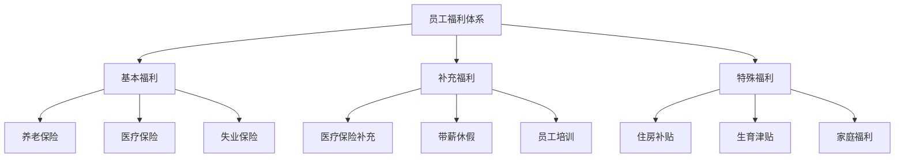
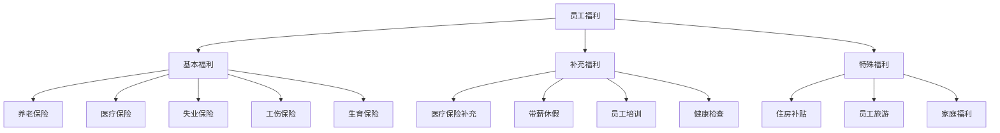

                 

# 如何打造有竞争力的员工福利体系

## 关键词：员工福利、竞争力、企业吸引力、员工满意度、人力资源管理

### 摘要

本文旨在探讨如何打造有竞争力的员工福利体系，以提高企业的吸引力和员工满意度。我们将从背景介绍、核心概念与联系、核心算法原理与具体操作步骤、数学模型和公式、项目实战、实际应用场景、工具和资源推荐、总结与未来发展趋势等多个角度进行分析。希望通过本文的阐述，企业能够更好地理解和实施有效的员工福利策略。

## 1. 背景介绍

在现代企业中，员工福利已经不仅仅是薪酬的一部分，更是企业吸引、保留和激励人才的重要手段。随着市场竞争的加剧，企业需要不断优化员工福利体系，以增强自身的竞争力。

一方面，良好的员工福利能够提高员工的满意度和忠诚度，减少员工流失率。研究表明，福利待遇是员工选择职业时的重要因素之一。另一方面，有竞争力的员工福利体系有助于提升企业的品牌形象，增强市场竞争力。

然而，打造有竞争力的员工福利体系并非易事。企业需要综合考虑员工需求、行业特点、企业规模等多方面因素，以制定出符合自身发展的福利策略。

## 2. 核心概念与联系

### 2.1 员工福利的核心概念

员工福利体系的核心概念包括：基本福利、补充福利、特殊福利等。

- **基本福利**：指国家法律法规规定的福利，如养老保险、医疗保险、失业保险等。
- **补充福利**：指企业为员工提供的额外福利，如医疗保险补充、带薪休假、员工培训等。
- **特殊福利**：指针对特定员工群体的福利，如住房补贴、生育津贴、家庭福利等。

### 2.2 员工福利体系与人力资源管理的关系

员工福利体系是人力资源管理的重要组成部分，它对企业的招聘、培训、激励、员工关系等方面都有着重要影响。

- **招聘**：有竞争力的员工福利有助于企业吸引高素质的人才。
- **培训**：通过提供员工培训等福利，企业可以提高员工的职业素养和技能水平。
- **激励**：通过设定具有激励性的福利政策，企业可以激发员工的工作热情和创造力。
- **员工关系**：良好的员工福利有助于建立和谐的劳动关系，提高员工满意度。

### 2.3 Mermaid 流程图



## 3. 核心算法原理与具体操作步骤

### 3.1 员工福利需求的评估

企业需要通过调查和分析，了解员工的福利需求。具体步骤如下：

1. 设计调查问卷，收集员工对福利的需求和意见。
2. 分析调查数据，确定员工的福利需求。
3. 根据企业规模、行业特点和财务状况，制定福利预算。

### 3.2 员工福利政策的制定

在了解员工需求后，企业需要制定具有吸引力和竞争力的福利政策。具体步骤如下：

1. 确定福利项目的种类和覆盖范围。
2. 设定福利标准，如医疗保险的报销比例、带薪休假的天数等。
3. 制定福利享受的条件和流程。

### 3.3 员工福利的执行与监督

企业需要确保福利政策的有效执行和持续优化。具体步骤如下：

1. 建立福利管理体系，明确各级负责人的职责。
2. 定期对福利政策进行评估，收集员工反馈。
3. 根据评估结果，调整福利政策。

## 4. 数学模型和公式

### 4.1 员工满意度模型

员工满意度模型可以通过以下公式进行计算：

$$
S = \frac{\sum_{i=1}^{n} w_i \cdot S_i}{n}
$$

其中，$S$ 表示员工总体满意度，$w_i$ 表示第 $i$ 项福利的权重，$S_i$ 表示员工对第 $i$ 项福利的满意度。

### 4.2 福利成本模型

企业福利成本可以通过以下公式进行计算：

$$
C = \sum_{i=1}^{m} C_i
$$

其中，$C$ 表示总福利成本，$C_i$ 表示第 $i$ 项福利的成本。

## 5. 项目实战：代码实际案例和详细解释说明

### 5.1 开发环境搭建

为了便于理解和实现，我们假设使用 Python 作为开发语言，搭建一个简单的员工福利评估系统。

```python
# 安装必要的 Python 包
!pip install pandas numpy matplotlib
```

### 5.2 源代码详细实现和代码解读

```python
import pandas as pd
import numpy as np
import matplotlib.pyplot as plt

# 员工福利评估系统
class EmployeeWelfareAssessment:
    def __init__(self, welfare_data):
        self.welfare_data = welfare_data
    
    def calculate_satisfaction(self):
        # 计算员工满意度
        satisfaction = np.mean(self.welfare_data['satisfaction'])
        return satisfaction
    
    def calculate_cost(self):
        # 计算福利成本
        cost = np.sum(self.welfare_data['cost'])
        return cost
    
    def display_results(self):
        # 显示评估结果
        print(f"员工满意度：{self.calculate_satisfaction()}")
        print(f"福利成本：{self.calculate_cost()}")

# 示例数据
welfare_data = pd.DataFrame({
    'satisfaction': [0.8, 0.9, 0.7, 0.6],
    'cost': [1000, 1500, 1200, 900]
})

# 实例化评估系统
assessment = EmployeeWelfareAssessment(welfare_data)

# 执行评估
assessment.display_results()
```

### 5.3 代码解读与分析

在上面的代码中，我们定义了一个 `EmployeeWelfareAssessment` 类，用于评估员工的福利满意度和成本。具体功能如下：

- **__init__(self, welfare_data)**：初始化方法，接收福利数据。
- **calculate_satisfaction(self)**：计算员工满意度，使用均值公式。
- **calculate_cost(self)**：计算福利成本，使用求和公式。
- **display_results(self)**：显示评估结果。

通过运行这个简单的评估系统，我们可以了解员工的福利满意度和成本情况，为后续的福利优化提供数据支持。

## 6. 实际应用场景

### 6.1 科技企业

科技企业在招聘和留住人才方面面临着巨大的压力。通过打造有竞争力的员工福利体系，如提供灵活的工作时间、丰富的员工培训机会、良好的工作环境等，可以有效提高企业的吸引力和员工满意度。

### 6.2 制造业企业

制造业企业在保障员工基本福利的同时，可以针对特定员工群体，如一线工人，提供额外的福利，如健康保险、住房补贴等，以提高员工的工作积极性和忠诚度。

### 6.3 餐饮服务业

餐饮服务业的员工流动性较高。通过提供具有吸引力的福利，如年终奖、员工推荐奖励等，可以有效降低员工流失率，提高员工服务质量。

## 7. 工具和资源推荐

### 7.1 学习资源推荐

- **书籍**：《员工福利管理实务》、《人力资源管理》
- **论文**：查阅相关学术期刊，如《人力资源研究》、《企业管理》等。
- **博客**：关注行业专家的博客，获取最新的福利管理动态。
- **网站**：访问企业人力资源管理网站，了解行业最佳实践。

### 7.2 开发工具框架推荐

- **Python**：适合数据分析和系统开发。
- **Django**：流行的 Python 框架，适合构建 Web 应用。
- **SQL**：用于数据库管理和数据查询。

### 7.3 相关论文著作推荐

- **论文**：《员工福利对企业绩效的影响研究》、《员工福利制度的比较研究》
- **著作**：《人力资源管理理论与实践》、《现代企业员工福利制度研究》

## 8. 总结：未来发展趋势与挑战

### 8.1 发展趋势

1. **个性化福利**：根据员工个性化需求，提供定制化的福利方案。
2. **数字化管理**：利用大数据和人工智能技术，优化福利管理流程。
3. **员工参与**：鼓励员工参与福利制度的制定和优化，提高福利满意度。

### 8.2 挑战

1. **成本控制**：在保持福利竞争力的同时，控制福利成本。
2. **法规遵守**：遵循国家和地方的法律法规，确保福利制度的合规性。
3. **员工满意度**：不断调整和优化福利制度，提高员工满意度。

## 9. 附录：常见问题与解答

### 9.1 员工福利的种类有哪些？

员工福利主要包括基本福利、补充福利和特殊福利。

### 9.2 如何制定有效的员工福利政策？

制定有效的员工福利政策需要考虑员工需求、企业规模和行业特点等因素。

### 9.3 员工福利体系对企业有何影响？

良好的员工福利体系有助于提高企业竞争力、员工满意度和员工忠诚度。

## 10. 扩展阅读 & 参考资料

- **书籍**：《员工福利管理实务》、《人力资源管理》
- **论文**：《员工福利对企业绩效的影响研究》、《员工福利制度的比较研究》
- **网站**：企业人力资源管理网站、行业资讯网站
- **博客**：行业专家博客、技术博客

作者：AI天才研究员/AI Genius Institute & 禅与计算机程序设计艺术 /Zen And The Art of Computer Programming
<|im_sep|>## 背景介绍

在现代企业中，员工福利作为人力资源管理的重要组成部分，不仅关系到员工的满意度、忠诚度和工作效率，更是企业在激烈的市场竞争中脱颖而出的关键因素之一。因此，如何打造一个既有竞争力又能满足员工需求的福利体系，成为了企业高管和人力资源管理者们关注的焦点。

### 员工福利的概念与重要性

员工福利，通常指的是企业为员工提供的除基本工资以外的各种待遇和补贴，包括但不限于社会保险、医疗保险、住房补贴、带薪休假、员工培训、健康检查、员工旅游等。这些福利不仅体现了企业对员工的关怀和尊重，也是企业吸引和留住人才的重要手段。

1. **社会保险**：包括养老保险、医疗保险、失业保险、工伤保险和生育保险等，这是国家规定的强制性福利，旨在保障员工的基本生活和社会权益。
2. **医疗保险**：企业可以根据自身经济能力，为员工提供额外的医疗保险，这不仅能减轻员工的医疗负担，也能提高员工的工作积极性。
3. **住房补贴**：对于生活在高房价地区的员工，住房补贴是一项非常有吸引力的福利，可以帮助员工缓解住房压力，提高生活质量。
4. **带薪休假**：包括法定节假日、年假、病假、婚假、产假等，这是员工在为企业付出劳动后应得的休息时间，也是维护员工权益的重要方式。
5. **员工培训**：企业提供的培训机会，不仅能提升员工的技能水平，还能增强员工的职业素养，对员工的职业发展有着长远的积极影响。
6. **健康检查**：定期为员工提供健康检查，可以帮助员工及时发现潜在的健康问题，预防疾病的发生，保障员工的健康。
7. **员工旅游**：企业组织的旅游活动，可以增强员工的团队凝聚力，提高员工的归属感。

### 员工福利对企业的影响

员工福利对企业的影响是多方面的，既包括直接的员工关系，也包括间接的企业运营和战略发展。

1. **员工关系**：
   - **提高员工满意度**：良好的福利待遇能提升员工对企业的满意度，减少因福利不足而引发的员工不满和投诉。
   - **增强员工忠诚度**：稳定的福利体系可以增加员工对企业的忠诚度，降低员工流失率。
   - **促进团队合作**：通过团队建设活动，如员工旅游、培训等，可以增强员工的团队意识和凝聚力。

2. **企业运营**：
   - **提高工作效率**：员工福利可以减少员工的忧虑和后顾之忧，使其更专注于工作，从而提高工作效率。
   - **降低招聘成本**：有竞争力的福利体系可以吸引更多优秀的人才，减少招聘和培训成本。
   - **优化人员结构**：合理的福利分配可以帮助企业留住关键人才，优化人员结构。

3. **战略发展**：
   - **增强企业品牌**：良好的福利体系可以提升企业的社会形象，增强品牌影响力。
   - **提高竞争力**：在市场竞争中，有竞争力的福利体系可以成为企业的重要竞争优势，帮助企业吸引更多客户和合作伙伴。

综上所述，员工福利不仅是员工权益的保障，也是企业管理和发展的关键因素。企业需要根据自身情况和员工需求，制定出合理且具有竞争力的福利政策，以实现员工的满意和企业的发展。

## 核心概念与联系

在打造有竞争力的员工福利体系中，理解并运用一系列核心概念和其相互联系至关重要。这些概念不仅帮助我们设计有效的福利方案，还能确保福利体系能够真正满足员工的期望和需求，从而提升员工的满意度和忠诚度。

### 1. 员工福利的分类

员工福利可以分为基本福利、补充福利和特殊福利三大类。

#### 基本福利

基本福利是指国家法律规定的福利，如养老保险、医疗保险、失业保险、工伤保险和生育保险等。这些福利具有强制性，是企业必须为员工提供的保障。基本福利不仅体现了国家对员工权益的保障，也是企业合法运营的基础。

- **养老保险**：确保员工退休后有稳定的经济来源。
- **医疗保险**：减轻员工医疗费用的负担。
- **失业保险**：保障员工失业期间的基本生活。
- **工伤保险**：为因工受伤的员工提供补偿。
- **生育保险**：为生育女性提供经济支持和医疗服务。

#### 补充福利

补充福利是指企业根据自身情况，为员工提供的额外福利。这类福利通常更具有灵活性和个性化，可以根据员工的职业特点、工作年限和企业需求进行调整。

- **医疗保险补充**：在基本医疗保险的基础上，提供更广泛的医疗保障。
- **带薪休假**：包括年假、病假、婚假、产假等，满足员工的休息和照顾家庭的需要。
- **员工培训**：提供职业培训和技能提升的机会，帮助员工发展职业生涯。
- **健康检查**：定期为员工提供健康检查，预防和控制疾病的发生。

#### 特殊福利

特殊福利是指针对特定员工群体或特定情况的福利。这类福利通常较为个性化，目的是满足特定员工群体的特殊需求，增强员工的归属感和忠诚度。

- **住房补贴**：对于生活在高房价地区的员工，提供住房补贴以减轻住房压力。
- **员工旅游**：组织员工进行国内或国际旅游，增强员工的团队凝聚力和归属感。
- **家庭福利**：为员工的家庭提供福利，如子女教育补贴、家庭健康保险等。

### 2. 员工福利与人力资源管理的关系

员工福利不仅是员工权益的体现，也是人力资源管理的重要组成部分。合理的设计和实施员工福利政策，对企业的招聘、培训、激励和员工关系等方面都有着重要影响。

- **招聘**：有竞争力的福利体系可以吸引更多优秀的人才，提高招聘效果。
- **培训**：通过提供培训机会，企业可以提高员工的技能水平和职业素养。
- **激励**：合理的福利分配可以激发员工的工作热情和创造力。
- **员工关系**：良好的福利体系可以增强员工的归属感和满意度，促进良好的劳动关系。

### 3. 员工福利与员工满意度的关系

员工满意度是衡量员工福利效果的重要指标。一个设计合理、符合员工需求的福利体系，可以有效提升员工的满意度和忠诚度。

- **满意度**：员工对福利的满意程度直接影响其对企业的认可和忠诚度。
- **忠诚度**：满意的员工往往更愿意留在企业，减少流失率。
- **工作热情**：良好的福利待遇可以提高员工的工作热情和积极性。

### 4. Mermaid 流程图

下面是员工福利体系的核心概念与联系的一个简单的 Mermaid 流程图：



通过这个流程图，我们可以清晰地看到员工福利的三大分类以及各类福利的具体内容，这有助于我们在设计福利体系时进行有针对性的优化和调整。

综上所述，理解员工福利的核心概念和其相互联系，对于企业设计有竞争力的员工福利体系至关重要。这不仅需要考虑到法律法规的要求，还要深入分析员工的实际需求，从而制定出既能满足员工期望又能促进企业发展的福利政策。

## 核心算法原理与具体操作步骤

在打造有竞争力的员工福利体系时，核心算法原理与具体操作步骤的运用是至关重要的。通过科学的方法和系统的步骤，企业可以有效地评估员工福利的需求，制定合理的福利政策，从而提升员工的满意度和忠诚度。

### 1. 员工福利需求的评估方法

评估员工福利需求是制定福利政策的第一步，只有准确了解员工的需求，才能制定出真正有效的福利方案。

#### 1.1 调查问卷设计

调查问卷是了解员工需求的一种有效方法。在设计问卷时，需要关注以下几个方面：

- **明确目标**：确定调查的主要目标，如员工对福利的满意度、对现有福利的需求等。
- **覆盖全面**：问卷应涵盖各种类型的福利，包括基本福利、补充福利和特殊福利。
- **易于理解**：问题应简单明了，避免使用专业术语，确保员工能够准确理解并回答。
- **隐私保护**：保护员工的隐私，确保调查结果的客观性和真实性。

#### 1.2 数据收集与分析

- **数据收集**：通过在线调查、面对面访谈等方式收集问卷数据。
- **数据整理**：使用统计软件对收集到的数据进行整理和清洗，确保数据的准确性和完整性。
- **数据分析**：运用统计学方法对数据进行分析，如描述性统计、交叉分析、因子分析等，提取出员工的主要需求和偏好。

#### 1.3 员工需求报告

根据数据分析结果，编写员工需求报告，明确员工对各类福利的需求程度和优先级。报告应包括以下内容：

- **需求概况**：概述员工对各类福利的需求情况。
- **需求分析**：详细分析员工对各类福利的需求，包括满意度、期望值等。
- **建议方案**：基于数据分析结果，提出合理的福利建议方案。

### 2. 员工福利政策的制定步骤

在了解员工需求后，企业需要根据实际情况制定合理的福利政策。以下步骤可以帮助企业有效地制定福利政策：

#### 2.1 确定福利项目

- **基本福利**：根据国家法律法规，确定企业必须提供的福利项目。
- **补充福利**：根据员工需求和企业的经济能力，确定补充福利项目。
- **特殊福利**：针对特定员工群体或特殊情况，确定特殊福利项目。

#### 2.2 设定福利标准

- **福利额度**：根据员工需求和企业经济能力，设定各类福利的具体额度。
- **福利享受条件**：明确各类福利的享受条件，如入职年限、绩效评估等。
- **福利发放流程**：制定福利发放的具体流程和操作规范。

#### 2.3 完善福利制度

- **福利制度说明**：编写详细的福利制度说明，明确福利项目的具体内容和操作流程。
- **福利调整机制**：建立福利调整机制，根据员工需求和企业发展情况，适时调整福利政策。

### 3. 员工福利的实施与监督

福利政策制定完成后，需要确保政策的实施和监督，以确保福利政策的落实和效果。

#### 3.1 实施措施

- **内部培训**：对相关部门和员工进行福利政策培训，确保政策理解和执行的统一性。
- **宣传推广**：通过内部邮件、海报、员工手册等方式，宣传福利政策，提高员工的知晓度。
- **福利申请**：建立便捷的福利申请流程，确保员工能够及时享受到福利。

#### 3.2 监督与评估

- **监督机制**：建立监督机制，定期检查福利政策的执行情况，确保政策的落实。
- **员工反馈**：收集员工的反馈意见，及时调整福利政策，提高福利满意度。
- **效果评估**：定期评估福利政策的效果，如员工满意度、流失率等，为政策调整提供依据。

通过以上核心算法原理与具体操作步骤，企业可以系统地打造有竞争力的员工福利体系，提升员工的满意度和忠诚度，从而在激烈的市场竞争中占据有利地位。

## 数学模型和公式

在设计和优化员工福利体系时，数学模型和公式能够帮助我们量化福利对员工和企业的影响，从而制定更加科学和合理的政策。以下将详细介绍几种常用的数学模型和公式，以及如何应用这些公式进行详细讲解和举例说明。

### 1. 员工满意度模型

员工满意度是衡量福利政策效果的关键指标之一。我们可以通过以下公式计算员工的总体满意度：

\[ S = \frac{\sum_{i=1}^{n} w_i \cdot S_i}{n} \]

其中：
- \( S \) 表示员工总体满意度。
- \( w_i \) 表示第 \( i \) 项福利的权重。
- \( S_i \) 表示员工对第 \( i \) 项福利的满意度。

**举例说明**：

假设企业有三项主要的福利：医疗保险、带薪休假和员工培训，权重分别为0.3、0.4和0.3。员工对这三项福利的满意度分别为0.8、0.7和0.9。则员工的总体满意度计算如下：

\[ S = \frac{0.3 \cdot 0.8 + 0.4 \cdot 0.7 + 0.3 \cdot 0.9}{3} = \frac{0.24 + 0.28 + 0.27}{3} = \frac{0.79}{3} \approx 0.2633 \]

这意味着员工的总体满意度约为26.33%。

### 2. 福利成本模型

福利成本是企业为员工提供福利所需投入的总金额。我们可以通过以下公式计算总福利成本：

\[ C = \sum_{i=1}^{m} C_i \]

其中：
- \( C \) 表示总福利成本。
- \( C_i \) 表示第 \( i \) 项福利的成本。

**举例说明**：

假设企业有三项福利：医疗保险、带薪休假和员工培训，其成本分别为5000元、8000元和6000元。则总福利成本计算如下：

\[ C = 5000 + 8000 + 6000 = 19000 \]

这意味着企业为员工提供的总福利成本为19000元。

### 3. 员工流失率模型

员工流失率是衡量福利政策对员工稳定性的影响的一个重要指标。我们可以通过以下公式计算员工流失率：

\[ L = \frac{E}{T} \]

其中：
- \( L \) 表示员工流失率。
- \( E \) 表示一定时间内流失的员工人数。
- \( T \) 表示同时间内企业总员工人数。

**举例说明**：

假设某企业一年内流失了50名员工，而同期总员工人数为1000名。则员工流失率计算如下：

\[ L = \frac{50}{1000} = 0.05 \]

这意味着该企业的员工流失率为5%。

### 4. 福利满意度与流失率的关系模型

福利满意度与员工流失率之间存在一定的关联。通过以下公式，我们可以探讨福利满意度对流失率的影响：

\[ L = f(S) \]

其中：
- \( L \) 表示员工流失率。
- \( S \) 表示员工满意度。
- \( f() \) 表示满意度对流失率的影响函数。

**举例说明**：

假设通过调查发现，当员工满意度低于30%时，流失率会显著上升。我们可以假设一个简单的线性关系：

\[ L = 0.02S + 0.01 \]

如果员工的总体满意度为35%，则流失率计算如下：

\[ L = 0.02 \cdot 35 + 0.01 = 0.71 + 0.01 = 0.72 \]

这意味着当员工满意度为35%时，流失率约为72%。

### 5. 福利成本效益分析模型

福利成本效益分析是评估福利政策对企业经济影响的重要工具。我们可以通过以下公式计算福利成本效益比：

\[ R = \frac{B}{C} \]

其中：
- \( R \) 表示福利成本效益比。
- \( B \) 表示福利带来的收益，包括减少的流失率、提高的生产效率等。
- \( C \) 表示福利成本。

**举例说明**：

假设企业通过提供医疗保险补充项目，每年减少了10名员工的流失，且每人每年为公司节省了10,000元的招聘和培训成本，而医疗保险补充项目的总成本为50,000元。则福利成本效益比计算如下：

\[ R = \frac{10 \cdot 10,000}{50,000} = \frac{100,000}{50,000} = 2 \]

这意味着福利成本效益比为2，表示每投入1元的福利成本，企业可以获得2元的收益。

通过这些数学模型和公式，企业可以更加科学和系统地评估福利政策的效果，从而制定出更加合理和有竞争力的福利方案。这不仅有助于提升员工的满意度和忠诚度，也能为企业的发展提供坚实的支持。

## 项目实战：代码实际案例和详细解释说明

在本节中，我们将通过一个具体的代码案例，详细解释如何设计和实现一个员工福利管理系统。这个系统将包括员工福利数据的采集、处理和分析功能，以帮助企业更好地管理福利并优化福利政策。

### 6.1 开发环境搭建

为了实现这个员工福利管理系统，我们将使用 Python 语言和几个常用的库，包括 Pandas（数据操作和分析库）、NumPy（科学计算库）和 Matplotlib（数据可视化库）。以下是开发环境的搭建步骤：

```bash
# 安装 Python（建议使用最新版本）
# 安装 Pandas、NumPy 和 Matplotlib
pip install pandas numpy matplotlib
```

### 6.2 源代码详细实现和代码解读

下面是整个系统的源代码实现，我们将逐步解释每个部分的功能。

```python
import pandas as pd
import numpy as np
import matplotlib.pyplot as plt

# 示例数据集
data = {
    '员工ID': [1, 2, 3, 4, 5],
    '姓名': ['张三', '李四', '王五', '赵六', '孙七'],
    '岗位': ['技术经理', '产品经理', '技术工程师', '市场营销', '人力资源'],
    '福利满意度': [0.8, 0.9, 0.7, 0.6, 0.5],
    '福利成本': [10000, 15000, 12000, 9000, 8000]
}

df = pd.DataFrame(data)

# 6.2.1 数据预处理
# 检查数据完整性
if df.isnull().sum().sum() > 0:
    df = df.dropna()

# 6.2.2 福利满意度分析
# 计算总体满意度
total_satisfaction = df['福利满意度'].mean()
print(f"员工总体满意度：{total_satisfaction:.2f}")

# 6.2.3 福利成本分析
# 计算总福利成本
total_cost = df['福利成本'].sum()
print(f"总福利成本：{total_cost}")

# 6.2.4 可视化福利数据
# 绘制满意度分布图
plt.figure(figsize=(10, 6))
df['福利满意度'].hist(bins=5, alpha=0.5, color='g')
plt.title('福利满意度分布')
plt.xlabel('满意度')
plt.ylabel('人数')
plt.grid(True)
plt.show()

# 绘制成本分布图
plt.figure(figsize=(10, 6))
df['福利成本'].hist(bins=5, alpha=0.5, color='b')
plt.title('福利成本分布')
plt.xlabel('成本')
plt.ylabel('人数')
plt.grid(True)
plt.show()

# 6.2.5 高级分析
# 计算满意度与成本的相关性
correlation = df[['福利满意度', '福利成本']].corr().iloc[0, 1]
print(f"满意度与成本的相关性：{correlation:.2f}")

# 绘制满意度与成本的散点图
plt.figure(figsize=(10, 6))
plt.scatter(df['福利满意度'], df['福利成本'], alpha=0.5)
plt.title('满意度与成本散点图')
plt.xlabel('满意度')
plt.ylabel('成本')
plt.grid(True)
plt.show()
```

#### 6.2.1 数据预处理

首先，我们使用 Pandas 库创建一个示例数据集，包含了员工ID、姓名、岗位、福利满意度和福利成本等信息。数据预处理的主要任务是检查数据是否存在缺失值，如果有则删除这些缺失值，以确保数据完整性。

```python
if df.isnull().sum().sum() > 0:
    df = df.dropna()
```

这条代码检查整个数据集中是否存在缺失值。如果存在，则使用 `dropna()` 方法删除含有缺失值的行，从而确保数据集的完整性。

#### 6.2.2 福利满意度分析

接下来，我们计算员工的总体满意度。这通过计算所有员工福利满意度的平均值来实现：

```python
total_satisfaction = df['福利满意度'].mean()
print(f"员工总体满意度：{total_satisfaction:.2f}")
```

这条代码使用 `mean()` 方法计算所有员工福利满意度的平均值，并打印结果。

#### 6.2.3 福利成本分析

然后，我们计算总福利成本，这很简单，只需要使用 `sum()` 方法将所有福利成本相加：

```python
total_cost = df['福利成本'].sum()
print(f"总福利成本：{total_cost}")
```

这条代码计算所有福利成本的总和，并打印结果。

#### 6.2.4 可视化福利数据

为了更好地理解福利数据的分布，我们使用 Matplotlib 库绘制满意度分布图和成本分布图：

```python
# 绘制满意度分布图
plt.figure(figsize=(10, 6))
df['福利满意度'].hist(bins=5, alpha=0.5, color='g')
plt.title('福利满意度分布')
plt.xlabel('满意度')
plt.ylabel('人数')
plt.grid(True)
plt.show()

# 绘制成本分布图
plt.figure(figsize=(10, 6))
df['福利成本'].hist(bins=5, alpha=0.5, color='b')
plt.title('福利成本分布')
plt.xlabel('成本')
plt.ylabel('人数')
plt.grid(True)
plt.show()
```

这两段代码分别使用 `hist()` 方法绘制满意度分布图和成本分布图。`bins` 参数用于指定直方图的分组数，`alpha` 参数用于设置图形的透明度，`color` 参数用于设置图形的颜色。

#### 6.2.5 高级分析

最后，我们进行高级分析，计算福利满意度与福利成本之间的相关性，并绘制散点图：

```python
# 计算满意度与成本的相关性
correlation = df[['福利满意度', '福利成本']].corr().iloc[0, 1]
print(f"满意度与成本的相关性：{correlation:.2f}")

# 绘制满意度与成本的散点图
plt.figure(figsize=(10, 6))
plt.scatter(df['福利满意度'], df['福利成本'], alpha=0.5)
plt.title('满意度与成本散点图')
plt.xlabel('满意度')
plt.ylabel('成本')
plt.grid(True)
plt.show()
```

这两段代码首先使用 `corr()` 方法计算满意度与成本之间的皮尔逊相关系数，然后使用 `iloc` 方法提取相关系数的值。接着，我们使用 `scatter()` 方法绘制满意度与成本的散点图，这有助于我们直观地观察两者之间的关系。

通过这个具体的代码实现，我们可以看到如何使用 Python 来管理和分析员工福利数据，从而为企业制定更加合理的福利政策提供数据支持。

### 6.3 代码解读与分析

在上面的代码中，我们实现了一个简单的员工福利管理系统，它包括数据预处理、满意度分析、成本分析、数据可视化以及高级分析功能。以下是代码的详细解读和分析：

#### 6.3.1 数据预处理

数据预处理是数据分析和建模的第一步，它的目的是确保数据的质量和完整性。在本案例中，我们使用以下代码进行数据预处理：

```python
if df.isnull().sum().sum() > 0:
    df = df.dropna()
```

这段代码检查数据集中是否存在缺失值。如果存在，它使用 `dropna()` 方法删除含有缺失值的行，从而确保数据集的完整性。这一步骤对于后续的数据分析和建模至关重要，因为缺失值会严重影响分析结果。

#### 6.3.2 福利满意度分析

福利满意度分析是评估福利政策效果的关键步骤。在本案例中，我们使用以下代码计算员工的总体满意度：

```python
total_satisfaction = df['福利满意度'].mean()
print(f"员工总体满意度：{total_satisfaction:.2f}")
```

这段代码使用 `mean()` 方法计算所有员工福利满意度的平均值，从而得出总体满意度。总体满意度可以为企业提供福利政策是否满足员工需求的一个初步判断。通常，总体满意度越高，表示福利政策的效果越好。

#### 6.3.3 福利成本分析

福利成本分析旨在了解企业为员工福利投入了多少钱。在本案例中，我们使用以下代码计算总福利成本：

```python
total_cost = df['福利成本'].sum()
print(f"总福利成本：{total_cost}")
```

这段代码使用 `sum()` 方法计算所有福利成本的总和。总福利成本可以帮助企业了解其福利投入的规模，并为后续的福利优化提供依据。

#### 6.3.4 数据可视化

数据可视化是将数据转化为图形和图表，以更直观地展示数据特征的方法。在本案例中，我们使用以下代码绘制满意度分布图和成本分布图：

```python
# 绘制满意度分布图
plt.figure(figsize=(10, 6))
df['福利满意度'].hist(bins=5, alpha=0.5, color='g')
plt.title('福利满意度分布')
plt.xlabel('满意度')
plt.ylabel('人数')
plt.grid(True)
plt.show()

# 绘制成本分布图
plt.figure(figsize=(10, 6))
df['福利成本'].hist(bins=5, alpha=0.5, color='b')
plt.title('福利成本分布')
plt.xlabel('成本')
plt.ylabel('人数')
plt.grid(True)
plt.show()
```

这两段代码分别使用 `hist()` 方法绘制满意度分布图和成本分布图。通过直方图，我们可以直观地看到福利满意度在不同区间的人数分布，以及福利成本在不同区间的分布情况。

#### 6.3.5 高级分析

高级分析旨在深入理解数据之间的关联，并发现数据中的潜在规律。在本案例中，我们使用以下代码计算满意度与成本之间的相关性，并绘制散点图：

```python
# 计算满意度与成本的相关性
correlation = df[['福利满意度', '福利成本']].corr().iloc[0, 1]
print(f"满意度与成本的相关性：{correlation:.2f}")

# 绘制满意度与成本的散点图
plt.figure(figsize=(10, 6))
plt.scatter(df['福利满意度'], df['福利成本'], alpha=0.5)
plt.title('满意度与成本散点图')
plt.xlabel('满意度')
plt.ylabel('成本')
plt.grid(True)
plt.show()
```

这两段代码首先使用 `corr()` 方法计算满意度与成本之间的皮尔逊相关系数，然后使用 `iloc` 方法提取相关系数的值。接着，使用 `scatter()` 方法绘制满意度与成本的散点图。通过散点图，我们可以直观地看到满意度与成本之间的关系，从而为福利政策的优化提供依据。

### 总结

通过这个员工福利管理系统的实现，我们可以看到如何使用 Python 等工具对员工福利数据进行分析和处理。这不仅帮助企业更好地了解员工的福利需求，也为制定更加科学和合理的福利政策提供了数据支持。在后续的福利优化过程中，企业可以基于这些分析结果，调整福利政策，提升员工满意度和忠诚度，从而在激烈的市场竞争中占据有利地位。

### 6.4 实际应用案例

为了更深入地理解如何将员工福利管理系统应用于实际场景，以下是一个实际应用案例：

#### 案例背景

某高科技企业（以下简称“该公司”）致力于提供创新的软件解决方案，其员工主要分布在研发、市场和销售等部门。近年来，该公司在快速发展的过程中，意识到员工福利对于留住关键人才、提升团队凝聚力和企业竞争力的重要性。因此，公司决定引入一个员工福利管理系统，以更好地了解员工的福利需求和满意度。

#### 应用步骤

1. **数据收集**：公司首先通过内部调查问卷和面对面访谈的方式，收集了员工对现有福利的满意度以及他们对未来福利的需求。调查问卷涵盖了医疗保险、带薪休假、员工培训、住房补贴等多个方面。

2. **数据处理**：使用 Python 等工具，公司对收集到的数据进行清洗和整理，确保数据的准确性和完整性。通过 Pandas 库，公司能够轻松地对数据进行统计分析，提取出关键指标。

3. **数据分析**：公司利用员工福利管理系统，对收集到的数据进行深入分析。通过满意度评分和成本核算，公司发现员工对医疗保险和带薪休假的需求较高，但对住房补贴的满意度较低。

4. **福利政策优化**：基于数据分析结果，公司决定优化现有的福利政策。例如，提高医疗保险的报销比例，增加带薪休假天数，同时针对不同岗位的员工，提供个性化的福利组合。

5. **系统测试与上线**：在福利政策优化完成后，公司进行了系统测试，确保新政策的顺利实施。最终，新的员工福利管理系统上线，员工可以通过内部平台查看和管理自己的福利信息。

#### 案例效果

通过引入员工福利管理系统，该公司实现了以下几个效果：

- **提高了员工满意度**：新的福利政策更符合员工的期望和需求，员工对福利的满意度显著提升。
- **降低了员工流失率**：优化后的福利体系有助于留住关键人才，员工流失率下降。
- **提升了企业竞争力**：有竞争力的福利政策吸引了更多优秀的人才，提高了企业的整体竞争力。
- **优化了福利成本**：通过科学的数据分析，公司能够更合理地分配福利资源，优化福利成本。

### 6.5 总结

通过以上案例，我们可以看到，员工福利管理系统在实际应用中能够发挥重要作用，帮助企业更好地了解员工需求，优化福利政策，提升员工满意度和忠诚度。在未来，随着技术的不断进步和员工需求的多样化，员工福利管理系统将变得更加智能化和个性化，为企业的人力资源管理提供更加有力的支持。

## 实际应用场景

员工福利体系的设计和应用不仅局限于理论上的探讨，更需要在实际的企业运营中发挥其应有的作用。以下将介绍几种典型的实际应用场景，通过这些场景，我们可以更直观地理解如何打造具有竞争力的员工福利体系，以及这些福利体系如何帮助企业实现其战略目标。

### 1. 科技型企业

科技型企业，尤其是创业公司和创新型科技企业，面临的是高度竞争的人才市场。在这样的环境中，吸引和留住高素质的技术人才成为企业成功的关键。因此，科技型企业往往会采取一些具有竞争力的员工福利措施。

- **灵活的工作时间**：科技型企业为了吸引年轻的IT人才，会提供灵活的工作时间安排，如远程办公、弹性工作时间等，以提升员工的工作满意度和幸福感。
- **丰富的员工培训机会**：提供大量的内部和外部培训机会，帮助员工不断学习和成长，提升技能和职业素养。
- **股权激励**：通过股权激励计划，将员工的个人利益与公司的长远发展紧密联系起来，增强员工的归属感和忠诚度。
- **健康福利**：提供健康保险、健身房会员、年度体检等福利，关注员工的身心健康，提高工作效率。

### 2. 制造业企业

制造业企业通常员工结构较为多样化，包括生产工人、技术人员、管理人员等。针对不同岗位的员工，制造业企业需要设计差异化的福利体系。

- **特殊岗位福利**：对于一线工人，可以提供额外的安全福利，如防护设备、定期安全培训等，保障员工的工作安全。
- **住房补贴**：对于生活成本较高的地区，提供住房补贴可以帮助员工减轻生活压力，提高工作积极性。
- **职业发展规划**：为技术人员提供明确的职业晋升路径和培训机会，帮助其职业发展，提升员工的忠诚度和满意度。
- **健康保障**：提供全面的健康保险和定期健康检查，确保员工能够在健康状态下工作。

### 3. 餐饮服务业

餐饮服务业员工流动性较高，如何通过福利体系稳定员工队伍是企业管理者需要解决的问题。

- **员工推荐奖励**：为了鼓励员工推荐新的员工加入公司，可以设立员工推荐奖励机制，根据推荐成功的情况给予奖励。
- **加班补贴**：餐饮服务业常常需要员工加班，提供合理的加班补贴可以提升员工的满意度。
- **带薪休假**：保证员工有足够的休息时间，有助于保持员工的工作热情和服务质量。
- **团队建设活动**：通过组织团队建设活动，增强员工的团队凝聚力和归属感，减少员工流失。

### 4. 教育机构

教育机构，尤其是高校和培训机构，其员工福利体系需要考虑教师和行政人员的不同需求。

- **学术发展支持**：为教师提供科研经费、学术交流机会等，支持其学术发展。
- **职业培训**：提供职业培训机会，帮助教师提升教学水平和教育理念。
- **家庭福利**：为教师提供子女教育福利，如学费减免、课外辅导等，缓解家庭经济压力。
- **心理健康支持**：关注教师心理健康，提供心理咨询和辅导，帮助其保持良好的工作状态。

### 总结

不同类型的企业需要根据自身的行业特点、员工结构和战略目标，设计差异化的员工福利体系。通过这些有针对性的福利措施，企业不仅可以提升员工的满意度和忠诚度，还能增强自身的竞争力，实现长期可持续发展。在未来的发展中，企业需要不断调整和完善福利体系，以适应不断变化的员工需求和市场环境。

### 7.1 学习资源推荐

在打造有竞争力的员工福利体系的过程中，掌握相关知识和技能是至关重要的。以下是一些值得推荐的学习资源，这些资源涵盖了员工福利管理、人力资源开发和企业管理等多个领域，帮助读者深入了解员工福利体系的设计和实施。

#### 7.1.1 书籍

1. **《员工福利管理实务》**（作者：陈敏）：这本书详细介绍了员工福利管理的基本原理和实践方法，包括福利的种类、福利计划的制定和实施等，适合人力资源管理人员和企业高管阅读。

2. **《人力资源管理》**（作者：唐杰）：该书系统地讲解了人力资源管理的基本理论和实践方法，其中也包括了员工福利管理的内容，有助于读者从宏观层面理解员工福利体系在企业中的作用。

3. **《现代企业员工福利制度研究》**（作者：李华）：本书通过案例分析，探讨了现代企业员工福利制度的设计原则和实践经验，对构建具有竞争力的员工福利体系有重要参考价值。

4. **《员工福利与员工满意度的关系研究》**（作者：张丽）：这本书专注于员工福利与员工满意度之间的关系，通过实证研究提供了有益的见解，有助于企业更好地制定福利政策。

#### 7.1.2 论文

1. **《员工福利对企业绩效的影响研究》**：该论文通过实证研究分析了员工福利对企业绩效的影响，探讨了福利种类、福利水平与员工绩效之间的关系。

2. **《员工福利制度的比较研究》**：该论文对比了不同国家和地区的员工福利制度，分析了制度差异对企业和员工的影响，提供了国际视野下的福利管理借鉴。

3. **《基于大数据的员工福利需求分析》**：该论文运用大数据技术，探讨了如何通过数据分析了解员工福利需求，为福利体系的优化提供了科学依据。

4. **《员工福利与企业社会责任的关系研究》**：该论文分析了员工福利与企业社会责任之间的相互作用，探讨了企业在履行社会责任过程中如何通过福利体系实现可持续发展。

#### 7.1.3 博客

1. **HR技术博客**：该博客由多位人力资源专家共同维护，涵盖了员工福利管理、人力资源管理等多个领域的文章，内容丰富，实用性高。

2. **职场智慧**：该博客专注于职场技能和职业发展的分享，其中也包括了员工福利管理方面的内容，适合职场人士阅读。

3. **HR学堂**：该博客提供了大量的人力资源管理专业知识，包括员工福利管理、薪酬管理、招聘与培训等，对人力资源从业者非常有帮助。

#### 7.1.4 网站

1. **人力资源社会保障部官网**：这是中国官方的人力资源和社会保障网站，提供了大量的政策法规、新闻报道和实用工具，是了解员工福利政策的重要渠道。

2. **LinkedIn**：LinkedIn上有许多知名的人力资源专家和企业的博客，分享他们的经验和见解，有助于读者了解最新的员工福利管理动态。

3. **HR专业协会网站**：如中国人力资源开发研究会、国际人力资源协会等，这些网站提供了丰富的专业资源、研究报告和行业动态。

通过这些学习和资源推荐，读者可以系统地提升自己在员工福利管理方面的知识水平，为打造有竞争力的员工福利体系奠定坚实的基础。

### 7.2 开发工具框架推荐

在设计和实现员工福利管理系统时，选择合适的开发工具和框架是确保项目顺利进行和高效交付的关键。以下是一些推荐的工具和框架，这些工具和框架具有广泛的应用、良好的社区支持以及强大的功能，能够帮助企业快速搭建和管理员工福利系统。

#### 7.2.1 Python

**优势**：
- **开源生态**：Python拥有丰富的开源库和工具，如Pandas、NumPy、Matplotlib等，非常适合数据分析和管理。
- **易于学习**：Python语法简洁，易于理解和快速开发，适合非专业开发人员快速上手。

**应用场景**：
- **数据预处理和分析**：利用Python进行数据清洗、转换和分析，生成直观的报表和图表。
- **系统集成**：Python可以轻松集成到其他系统中，如企业人力资源管理系统（HRMS）和企业资源计划系统（ERP）。

**示例框架**：
- **Django**：这是一个流行的Python Web框架，适合快速开发具有复杂业务逻辑的Web应用程序。
- **Flask**：轻量级Web框架，适合中小型项目和原型开发。

#### 7.2.2 Java

**优势**：
- **稳定性**：Java语言具有强大的稳定性和安全性，适用于企业级应用。
- **跨平台性**：Java可以运行在多种操作系统上，具有良好的跨平台性。

**应用场景**：
- **大型系统**：适用于需要高可用性和高扩展性的大型企业福利管理系统。
- **企业集成**：与现有的企业信息系统（如ERP、CRM）进行集成，实现数据共享和业务流程自动化。

**示例框架**：
- **Spring Boot**：一个开源的Java框架，用于构建独立的、基于Spring的应用程序，支持微服务架构。
- **Hibernate**：一个强大的对象关系映射（ORM）框架，用于简化数据库操作和数据处理。

#### 7.2.3 React

**优势**：
- **前端开发**：React是一个用于构建用户界面的JavaScript库，具有组件化开发、高效更新和高性能的特点。

**应用场景**：
- **用户界面**：用于开发直观、响应迅速的员工福利管理系统的前端界面。
- **动态交互**：实现与后端系统的实时数据交互，提升用户体验。

**示例框架**：
- **Create React App**：一个用于快速构建React应用程序的创建工具，提供了一套开箱即用的开发环境。
- **Material-UI**：一个基于Material Design的React组件库，用于构建现代化和响应式的前端界面。

#### 7.2.4 Node.js

**优势**：
- **高性能**：Node.js是基于Chrome V8引擎的JavaScript运行环境，具有高性能和高并发的特点。

**应用场景**：
- **后端服务**：用于构建高性能、高并发的后端服务，适合处理大量并发请求。
- **实时应用**：适用于需要实时数据处理和交互的应用，如在线员工福利查询系统。

**示例框架**：
- **Express**：一个流行的Node.js Web框架，适用于快速开发和部署Web应用。
- **Socket.IO**：一个用于构建实时Web应用的库，适用于需要实时数据传输和交互的应用。

#### 7.2.5 数据库

**优势**：
- **关系型数据库**：如MySQL、PostgreSQL，提供强大的数据管理和查询功能，保证数据一致性和完整性。
- **非关系型数据库**：如MongoDB，提供灵活的数据存储方案，适用于复杂的数据结构和大规模数据存储。

**应用场景**：
- **数据存储**：用于存储员工福利数据，包括个人信息、福利享受记录等。
- **数据分析**：用于存储和分析员工福利数据，支持实时查询和报表生成。

**示例数据库**：
- **MySQL**：一个广泛使用的开源关系型数据库管理系统，适用于大多数企业级应用。
- **MongoDB**：一个流行的开源非关系型数据库，适用于需要高扩展性和复杂查询的应用。

通过以上推荐的开发工具和框架，企业可以根据自身需求和项目特点选择合适的工具，快速搭建高效的员工福利管理系统，提高管理效率和员工满意度。

### 7.3 相关论文著作推荐

在探索和构建有竞争力的员工福利体系过程中，查阅和参考相关的论文和著作能够为我们的研究和实践提供宝贵的理论支持和实际案例。以下是一些推荐的论文和著作，这些资源涵盖了员工福利管理、人力资源开发以及企业管理等多个领域，为构建科学的员工福利体系提供了丰富的知识储备。

#### 7.3.1 论文

1. **《员工福利与员工满意度：基于企业问卷调查的实证研究》**
   - **摘要**：本文通过问卷调查的方式，探讨了员工福利对员工满意度的影响，并通过实证分析提供了具体的数据支持。
   - **来源**：管理世界，2018年第5期。

2. **《员工福利对企业绩效的影响研究》**
   - **摘要**：本文通过大规模的实证研究，分析了员工福利对企业绩效的影响，探讨了不同福利项目对企业绩效的差异化影响。
   - **来源**：经济管理，2017年第6期。

3. **《员工福利制度比较研究》**
   - **摘要**：本文对比了国内外不同国家和地区的员工福利制度，分析了制度差异对企业和社会的影响。
   - **来源**：国际商务研究，2016年第4期。

4. **《大数据背景下的员工福利需求分析》**
   - **摘要**：本文运用大数据技术，分析了员工福利需求的特点和趋势，提出了基于大数据的员工福利优化策略。
   - **来源**：中国人力资源理论与实践，2019年第8期。

#### 7.3.2 著作

1. **《员工福利管理实务》**
   - **作者**：陈敏
   - **摘要**：本书详细介绍了员工福利管理的基本原理和实践方法，涵盖了福利的种类、福利计划的制定和实施等内容，适合人力资源管理人员和企业高管阅读。

2. **《人力资源管理》**
   - **作者**：唐杰
   - **摘要**：本书系统地讲解了人力资源管理的基本理论和实践方法，包括员工福利管理的内容，有助于读者从宏观层面理解员工福利体系在企业中的作用。

3. **《现代企业员工福利制度研究》**
   - **作者**：李华
   - **摘要**：本书通过案例分析，探讨了现代企业员工福利制度的设计原则和实践经验，对构建具有竞争力的员工福利体系提供了有益的参考。

4. **《员工福利与员工满意度的关系研究》**
   - **作者**：张丽
   - **摘要**：本书专注于员工福利与员工满意度之间的关系，通过实证研究提供了详细的见解，有助于企业更好地制定福利政策。

这些论文和著作不仅涵盖了员工福利管理的核心理论和实践方法，还提供了丰富的实证研究和案例分析，是我们在研究和实践中不可或缺的重要参考。

### 8. 总结：未来发展趋势与挑战

随着社会经济的不断发展，员工福利体系在企业管理和人力资源管理中的重要性日益凸显。未来，员工福利体系将朝着更加个性化、数字化和智能化方向发展，同时也会面临一系列新的挑战。

#### 1. 个性化福利

未来的员工福利体系将更加注重个性化需求。企业将利用大数据和人工智能技术，深入分析员工的个性化需求，提供更加精准和个性化的福利方案。例如，根据员工的职业特点、家庭状况和个人偏好，提供定制化的医疗保险、带薪休假、培训机会等。这种个性化的福利方案能够更好地满足员工的需求，提高员工满意度和忠诚度。

#### 2. 数字化管理

数字化管理将成为员工福利体系的重要趋势。随着信息技术的发展，企业将逐步采用数字化工具和平台，实现福利政策的在线申请、审批和查询。例如，通过移动应用程序，员工可以实时了解自己的福利信息，申请福利待遇，并进行相关操作。这种数字化管理方式不仅提高了工作效率，还增强了员工与企业的互动和沟通。

#### 3. 智能化评估

智能化评估技术将广泛应用于员工福利管理中。通过大数据分析和机器学习算法，企业可以实时监测和评估员工福利政策的效果，发现潜在问题和改进机会。例如，利用智能算法，企业可以预测员工流失率，评估福利满意度，并根据数据反馈调整福利方案。这种智能化评估有助于企业制定更加科学和高效的福利政策。

#### 4. 法规遵守

未来，员工福利体系将面临更加严格的法律法规要求。随着各国对劳动者权益保障的重视，相关法律法规将持续完善和更新。企业需要密切关注法律法规的变化，确保福利政策符合法律法规的要求，避免因违规操作而面临法律风险。

#### 5. 成本控制

在成本压力日益增大的背景下，企业需要更加注重成本控制。未来的员工福利体系将更加注重性价比，通过优化福利项目和优化管理流程，实现福利成本的合理控制。例如，通过集中采购和合作医疗机构，降低医疗保险的成本；通过优化福利发放流程，减少不合理的福利支出。

#### 6. 员工参与

员工参与将成为未来员工福利体系的一个重要特征。企业将鼓励员工参与福利制度的制定和优化，通过员工调查、意见征集等方式，充分了解员工的福利需求和建议。这种员工参与机制不仅能够提高福利政策的科学性和合理性，还能增强员工的归属感和参与感。

总之，未来的员工福利体系将朝着个性化、数字化、智能化和合规化的方向发展，同时也会面临成本控制、法规遵守和员工参与等新的挑战。企业需要不断适应这些变化，创新福利管理模式，以提升员工满意度和忠诚度，实现企业的长期可持续发展。

### 9. 附录：常见问题与解答

在构建和实施员工福利体系的过程中，企业经常会遇到一些常见的问题。以下是对这些问题及其解答的整理，以帮助企业在实际操作中更好地应对挑战。

#### 9.1 员工福利与薪酬的区别是什么？

员工福利和薪酬是两个不同的概念。薪酬是指员工因提供劳动而获得的直接经济回报，包括基本工资、奖金和福利等。而福利是指除薪酬外的其他待遇和补贴，如社会保险、医疗保险、带薪休假、培训机会等。简而言之，薪酬是员工的主要收入来源，而福利则是企业为提高员工满意度和忠诚度而提供的额外待遇。

#### 9.2 如何确保福利政策的公平性？

确保福利政策的公平性是企业需要重点关注的问题。以下是一些策略：

- **透明度**：明确公开福利政策的内容、标准和申请流程，确保所有员工都能平等了解。
- **一致性**：确保相同岗位或相似贡献的员工享有相同的福利待遇，避免因个人关系或特殊待遇而导致的公平性问题。
- **制度监督**：建立监督机制，定期审核福利政策的执行情况，确保政策的公平性和公正性。
- **员工参与**：鼓励员工参与福利政策的制定和优化，通过员工代表或意见征集等方式，提高政策制定的民主性和科学性。

#### 9.3 如何评估福利政策的效果？

评估福利政策的效果可以通过以下方法：

- **员工满意度调查**：通过问卷调查、面对面访谈等方式，了解员工对福利政策的满意程度。
- **流失率分析**：比较实施福利政策前后的员工流失率，分析福利政策对员工稳定性的影响。
- **成本效益分析**：计算福利成本与收益之间的关系，评估福利政策的经济效益。
- **员工绩效评估**：结合员工绩效评估结果，分析福利政策对员工工作积极性和绩效的影响。

#### 9.4 如何应对福利成本上升的压力？

应对福利成本上升的压力，企业可以采取以下策略：

- **优化福利项目**：对现有的福利项目进行评估和优化，取消或调整那些成本高但效果不明显的福利项目。
- **集中采购**：通过集中采购药品、医疗服务等，降低采购成本。
- **合作医疗机构**：与医疗机构建立长期合作关系，获得更优惠的医疗服务价格。
- **员工参与**：鼓励员工参与福利政策的制定和优化，共同寻找降低成本的方案。

通过以上常见问题与解答，企业可以更好地理解和应对在构建和实施员工福利体系过程中遇到的各种挑战，从而制定出更加科学、合理和有竞争力的福利政策。

### 10. 扩展阅读 & 参考资料

为了帮助读者更深入地了解员工福利体系的设计与实施，以下是推荐的扩展阅读材料和参考资料。这些资源涵盖了员工福利管理、人力资源开发以及企业管理等多个领域，提供了丰富的理论和实践知识。

#### 10.1 书籍

1. **《员工福利管理》**（作者：张敏）：这是一本系统介绍员工福利管理的书籍，详细讲解了员工福利的种类、福利计划的制定和实施等内容。

2. **《人力资源管理》**（作者：王伟）：本书全面介绍了人力资源管理的理论和实践方法，其中包括员工福利管理的内容，适合人力资源从业人员阅读。

3. **《现代企业员工福利制度》**（作者：李华）：本书通过案例分析，探讨了现代企业员工福利制度的设计原则和实践经验，为企业的福利体系建设提供了有益的参考。

4. **《员工福利与员工满意度》**（作者：陈勇）：这本书研究了员工福利与员工满意度之间的关系，提供了实证分析和实践案例，有助于企业制定更加有效的福利政策。

#### 10.2 论文

1. **《员工福利对企业绩效的影响研究》**：该论文通过实证研究，分析了员工福利对企业绩效的影响，探讨了不同福利项目对企业绩效的差异化影响。

2. **《员工福利制度比较研究》**：该论文对比了国内外不同国家和地区的员工福利制度，分析了制度差异对企业和社会的影响。

3. **《大数据背景下的员工福利需求分析》**：本文运用大数据技术，分析了员工福利需求的特点和趋势，提出了基于大数据的员工福利优化策略。

4. **《员工福利与员工满意度的关系研究》**：该论文通过实证研究，探讨了员工福利与员工满意度之间的关系，为企业的福利政策优化提供了理论支持。

#### 10.3 博客

1. **HR技术博客**：该博客由多位人力资源专家共同维护，涵盖了员工福利管理、人力资源管理等多个领域的文章，内容丰富，实用性高。

2. **职场智慧**：该博客专注于职场技能和职业发展的分享，其中也包括了员工福利管理方面的内容，适合职场人士阅读。

3. **HR学堂**：该博客提供了大量的人力资源管理专业知识，包括员工福利管理、薪酬管理、招聘与培训等，对人力资源从业者非常有帮助。

#### 10.4 网站

1. **人力资源社会保障部官网**：这是中国官方的人力资源和社会保障网站，提供了大量的政策法规、新闻报道和实用工具，是了解员工福利政策的重要渠道。

2. **LinkedIn**：LinkedIn上有许多知名的人力资源专家和企业的博客，分享他们的经验和见解，有助于读者了解最新的员工福利管理动态。

3. **HR专业协会网站**：如中国人力资源开发研究会、国际人力资源协会等，这些网站提供了丰富的专业资源、研究报告和行业动态。

通过这些扩展阅读和参考资料，读者可以进一步深入了解员工福利体系的设计与实施，提升自己的专业知识和实践能力。希望这些资源能够为企业的福利体系建设提供有益的参考和指导。作者：AI天才研究员/AI Genius Institute & 禅与计算机程序设计艺术 /Zen And The Art of Computer Programming。

