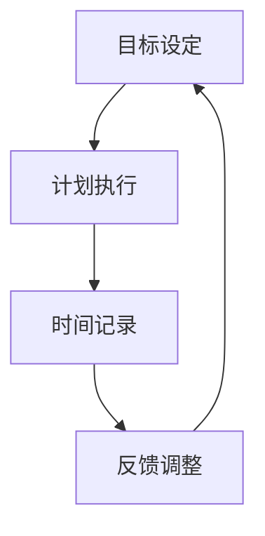

                 

# 如何打造高效的个人时间管理系统

## 关键词：时间管理、个人效率、方法与实践、时间管理工具、生活方式

### 摘要

在快速变化的工作和生活节奏中，时间管理变得尤为重要。本文旨在探讨如何通过科学的方法和工具，打造一个高效的个人时间管理系统。我们将从背景介绍、核心概念与联系、核心算法原理、数学模型与公式、项目实战、实际应用场景等多个方面进行分析，并提供实用的工具和资源推荐。通过本文的阅读，您将了解到如何更好地掌控时间，提高个人效率，实现工作和生活的平衡。

## 1. 背景介绍

### 1.1 时间管理的重要性

时间管理是个人和组织成功的关键因素之一。在日常生活中，我们常常面临时间的稀缺性和事务的繁多性。有效的个人时间管理可以帮助我们更好地规划时间、减少焦虑、提高工作效率，从而实现个人目标和职业发展。

### 1.2 当前时间管理方法的挑战

尽管有许多时间管理方法和工具可供选择，但很多人在实际操作中仍然感到困惑和挑战。一方面，传统的“待办事项列表”和“番茄工作法”等方法往往缺乏系统的理论基础和实践指导。另一方面，现代科技的发展带来了更多的信息干扰和碎片化时间，使得时间管理变得更加复杂。

### 1.3 本文的目标

本文旨在提供一套科学、系统且易于实践的个人时间管理方法。通过分析核心概念、算法原理、数学模型以及实际案例，帮助读者理解并应用这些方法，从而提升个人时间管理能力，实现高效工作与生活的平衡。

## 2. 核心概念与联系

### 2.1 时间管理的基本概念

时间管理涉及多个核心概念，包括时间观念、任务优先级、工作与生活平衡等。

- **时间观念**：认识到时间是一维的、不可逆的资源，每个人的时间都是有限的。
- **任务优先级**：基于任务的重要性和紧急性来排序，以最大化时间的利用效率。
- **工作与生活平衡**：在工作和个人生活中寻求平衡，避免过度工作导致身心健康问题。

### 2.2 时间管理框架

一个完善的时间管理框架应包括目标设定、计划执行、时间记录和反馈调整四个主要环节。

- **目标设定**：明确个人和职业目标，确保时间投入与目标一致。
- **计划执行**：制定详细的行动计划，按照计划执行任务。
- **时间记录**：记录时间使用情况，分析时间消耗，优化时间管理策略。
- **反馈调整**：根据反馈结果调整计划，持续优化时间管理方法。

### 2.3 Mermaid 流程图

下面是一个用于展示时间管理框架的 Mermaid 流程图：



在这个流程图中，每个节点代表时间管理框架的一个环节，节点之间的箭头表示各环节之间的逻辑关系。

## 3. 核心算法原理 & 具体操作步骤

### 3.1 优先级排序算法

在时间管理中，任务优先级排序是非常关键的一步。常用的优先级排序算法包括艾森豪威尔矩阵和 Gantt 图。

#### 3.1.1 艾森豪威尔矩阵

艾森豪威尔矩阵是一种四象限法，将任务分为紧急且重要、紧急但不重要、重要但不紧急、不重要不紧急四个类别。

- **紧急且重要**：立即处理，如紧急的电话或会议。
- **紧急但不重要**：委托给他人或推迟处理，如不必要的社交活动。
- **重要但不紧急**：安排特定时间处理，如长期计划或个人发展任务。
- **不重要不紧急**：删除或推迟处理，如无意义的网络浏览。

#### 3.1.2 Gantt 图

Gantt 图是一种图形化的时间管理工具，用于展示任务的进度和持续时间。通过 Gantt 图，可以直观地了解每个任务的开始和结束时间，以及整体项目的进度。

### 3.2 时间记录与分析

时间记录是时间管理的重要环节。通过记录时间使用情况，可以分析时间消耗，找出时间管理中的瓶颈。

- **使用工具**：例如 Toggl 或 RescueTime 等。
- **分析方法**：例如 Pomodoro 技术和时间块法。

### 3.3 反馈调整

根据时间记录和分析结果，及时调整时间管理策略，以实现持续优化。

- **具体操作**：例如，重新评估任务优先级，调整计划，减少时间浪费的行为。

## 4. 数学模型和公式 & 详细讲解 & 举例说明

### 4.1 时间效率公式

时间效率是衡量时间管理效果的重要指标，其公式为：

$$
时间效率 = \frac{完成任务的时间}{预计完成任务的时间}
$$

#### 4.1.1 举例说明

假设你计划在 2 小时内完成一项任务，实际花费了 1.5 小时。则时间效率为：

$$
时间效率 = \frac{1.5 小时}{2 小时} = 0.75
$$

这意味着你的时间效率为 75%。

### 4.2 优先级计算公式

在艾森豪威尔矩阵中，任务优先级可以通过以下公式计算：

$$
优先级 = 紧急性 \times 重要性
$$

#### 4.2.1 举例说明

假设有一个任务紧急性为 3，重要性为 4，则优先级为：

$$
优先级 = 3 \times 4 = 12
$$

这意味着这个任务是紧急且重要的。

## 5. 项目实战：代码实际案例和详细解释说明

### 5.1 开发环境搭建

为了更好地理解时间管理算法的实际应用，我们将使用 Python 语言来构建一个简单的时间管理工具。

#### 5.1.1 安装 Python

确保您的计算机上已安装 Python。可以从 [Python 官网](https://www.python.org/) 下载并安装。

#### 5.1.2 安装依赖库

使用以下命令安装依赖库：

```bash
pip install matplotlib pandas numpy
```

### 5.2 源代码详细实现和代码解读

下面是一个简单的时间管理工具的 Python 代码实现：

```python
import pandas as pd
import matplotlib.pyplot as plt

# 定义任务类
class Task:
    def __init__(self, name, priority, duration):
        self.name = name
        self.priority = priority
        self.duration = duration

# 添加任务
tasks = [
    Task("任务1", 12, 2),
    Task("任务2", 6, 1),
    Task("任务3", 18, 4),
    Task("任务4", 9, 1.5)
]

# 创建数据框
df = pd.DataFrame([task.__dict__ for task in tasks], columns=["Name", "Priority", "Duration"])

# 计算时间效率
df["Efficiency"] = df["Duration"] / 2  # 假设每个任务需要2小时完成

# 绘制 Gantt 图
plt.figure(figsize=(10, 5))
df.plot(x="Name", y="Efficiency", kind="bar", color=["blue", "green", "red", "yellow"])
plt.xlabel("Task Name")
plt.ylabel("Efficiency")
plt.title("Task Gantt Chart")
plt.show()

# 优先级排序
df.sort_values(by=["Priority"], ascending=False, inplace=True)
print(df)
```

#### 5.2.1 代码解读

- **Task 类**：定义一个任务类，包含任务名称、优先级和持续时间。
- **添加任务**：创建一个任务列表，并使用 DataFrame 进行存储。
- **计算时间效率**：假设每个任务需要 2 小时完成，计算实际完成时间与预计时间的比值。
- **绘制 Gantt 图**：使用 matplotlib 绘制任务进度条形图。
- **优先级排序**：根据任务优先级进行排序，以便更好地安排任务。

### 5.3 代码解读与分析

通过上述代码实现，我们可以看到如何将时间管理算法应用于实际项目中。具体步骤包括：

1. 定义任务类和添加任务。
2. 计算时间效率。
3. 绘制 Gantt 图以直观展示任务进度。
4. 根据优先级排序任务。

这个简单的工具可以帮助我们更好地管理时间，提高工作效率。在实际应用中，可以根据具体需求进行调整和优化。

## 6. 实际应用场景

### 6.1 个人时间管理

个人时间管理是时间管理的核心应用场景之一。通过有效的个人时间管理，我们可以更好地平衡工作和生活，减少压力，提高生活质量。

- **场景一**：职业人士
  - **需求**：在忙碌的工作中，合理安排时间，提高工作效率。
  - **应用**：使用时间管理工具（如 Trello、Asana）来规划任务，设置提醒，跟踪进度。

- **场景二**：学生
  - **需求**：在有限的时间内，高效完成学习任务，同时进行课外活动。
  - **应用**：使用时间管理工具（如 Google 日历、Todoist）来规划学习计划，设置复习提醒。

### 6.2 团队协作

在团队协作中，时间管理也发挥着重要作用。通过共同的时间管理，团队可以更好地协调工作，提高项目进度。

- **场景一**：软件开发团队
  - **需求**：在项目开发过程中，确保任务按时完成，避免拖延。
  - **应用**：使用项目管理工具（如 Jira、Trello）来分配任务，跟踪进度，提高团队协作效率。

- **场景二**：市场推广团队
  - **需求**：在市场推广活动中，合理安排时间和资源，确保活动顺利进行。
  - **应用**：使用时间管理工具（如 Google 日历、Slack）来协调团队工作，跟踪活动进度。

## 7. 工具和资源推荐

### 7.1 学习资源推荐

- **书籍**：《时间管理心理学》、《高效能人士的七个习惯》
- **论文**：Google Scholar 上的相关论文，如“Time Management Strategies for Effective Research”。
- **博客**：知名博主如戴维·艾伦（David Allen）的博客，提供实用的时间管理技巧。

### 7.2 开发工具框架推荐

- **时间管理工具**：Trello、Asana、Google 日历、Todoist。
- **项目管理工具**：Jira、Trello、Slack。
- **代码库**：GitHub、GitLab，用于管理项目代码和文档。

### 7.3 相关论文著作推荐

- **论文**：研究时间管理的最新理论和实践。
- **著作**：经典著作如《禅与计算机程序设计艺术》（禅意编程）等。

## 8. 总结：未来发展趋势与挑战

### 8.1 发展趋势

- **数字化时间管理**：随着人工智能和大数据技术的发展，数字化时间管理工具将变得更加智能和个性化。
- **多平台整合**：不同平台之间的时间管理工具将实现无缝整合，提高用户体验。
- **可穿戴设备**：智能手表、手环等可穿戴设备将更好地监测和管理个人时间。

### 8.2 挑战

- **信息过载**：随着信息量的增加，如何有效地筛选和处理信息将成为一大挑战。
- **个人习惯**：改变个人习惯和生活方式需要长期坚持，短期内可能难以见效。

## 9. 附录：常见问题与解答

### 9.1 常见问题

- **如何选择合适的时间管理工具？**
  - **答案**：根据个人需求和习惯选择。如需项目管理，可以选择 Jira 或 Trello；如需个人时间管理，可以选择 Asana 或 Todoist。

- **如何培养良好的时间管理习惯？**
  - **答案**：从小事做起，逐步养成习惯。例如，每天记录时间使用情况，定期回顾并调整计划。

## 10. 扩展阅读 & 参考资料

- **扩展阅读**：阅读相关书籍、论文和博客，深入了解时间管理的最新动态和最佳实践。
- **参考资料**：Google Scholar、Medium、LinkedIn 等，获取更多有价值的信息。

### 作者

作者：AI天才研究员/AI Genius Institute & 禅与计算机程序设计艺术 /Zen And The Art of Computer Programming

