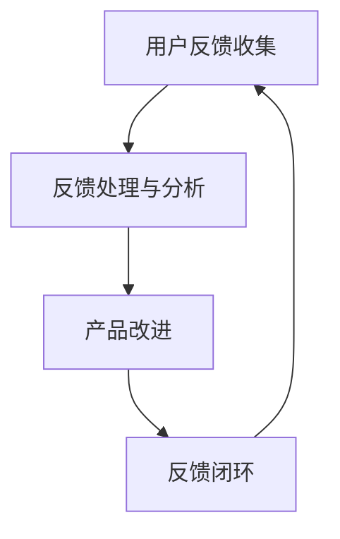

                 

# 如何打造高效的产品反馈闭环

## 摘要

本文将探讨如何构建一个高效的产品反馈闭环，从而帮助企业不断优化产品，提升用户满意度。文章将从背景介绍、核心概念与联系、核心算法原理与操作步骤、数学模型与公式、项目实战、实际应用场景、工具和资源推荐以及未来发展趋势与挑战等方面，全面解析产品反馈闭环的建设与实施。

## 目录

1. 背景介绍
2. 核心概念与联系
3. 核心算法原理与具体操作步骤
4. 数学模型和公式与详细讲解与举例说明
5. 项目实战：代码实际案例和详细解释说明
   5.1 开发环境搭建
   5.2 源代码详细实现和代码解读
   5.3 代码解读与分析
6. 实际应用场景
7. 工具和资源推荐
   7.1 学习资源推荐
   7.2 开发工具框架推荐
   7.3 相关论文著作推荐
8. 总结：未来发展趋势与挑战
9. 附录：常见问题与解答
10. 扩展阅读与参考资料

## 1. 背景介绍

随着互联网技术的飞速发展，市场竞争愈发激烈，企业需要不断推出满足用户需求的产品。而产品反馈闭环作为一种有效的质量管理手段，可以帮助企业及时获取用户反馈，持续优化产品，提高用户满意度。一个高效的产品反馈闭环包括以下几个关键环节：

- 用户反馈收集：通过问卷调查、用户访谈、用户行为数据等渠道，收集用户对产品的反馈信息。
- 反馈处理与分析：对收集到的用户反馈进行分类、筛选、整理和分析，识别出产品中的问题。
- 产品改进：根据分析结果，针对性地进行产品改进，优化用户体验。
- 反馈闭环：将改进后的产品反馈给用户，并跟踪用户的反馈，形成闭环。

本文将围绕以上环节，探讨如何构建一个高效的产品反馈闭环。

## 2. 核心概念与联系

### 2.1 产品反馈闭环的概念

产品反馈闭环是指企业通过收集用户反馈，对产品进行持续优化，以提高用户满意度的过程。它包括以下几个核心概念：

- 用户反馈：用户对产品使用过程中的感受、建议、意见等信息的统称。
- 反馈收集：通过问卷调查、用户访谈、用户行为数据等手段，获取用户反馈信息。
- 反馈处理：对收集到的用户反馈进行分类、筛选、整理和分析，识别出产品中的问题。
- 产品改进：根据反馈处理结果，针对性地进行产品改进，优化用户体验。
- 反馈闭环：将改进后的产品反馈给用户，并跟踪用户的反馈，形成闭环。

### 2.2 核心概念的联系

- 用户反馈收集和反馈处理：这两个环节是产品反馈闭环的基础。只有收集到真实的用户反馈，并对其进行有效处理，才能为产品改进提供有价值的参考。
- 产品改进和反馈闭环：产品改进是根据反馈处理结果进行的，而反馈闭环则是为了确保产品改进的有效性和可持续性。

### 2.3 Mermaid 流程图



## 3. 核心算法原理与具体操作步骤

### 3.1 用户反馈收集

用户反馈收集是构建高效产品反馈闭环的第一步。以下是一些常用的用户反馈收集方法：

- 问卷调查：通过在线问卷、电子邮件等方式，收集用户对产品的意见和反馈。
- 用户访谈：通过面对面访谈、电话访谈等方式，深入了解用户对产品的使用体验和需求。
- 用户行为数据：通过数据分析工具，收集用户在产品使用过程中的行为数据，如访问路径、页面停留时间等。

### 3.2 反馈处理与分析

- 反馈分类：将收集到的用户反馈按照主题、类型等进行分类，以便于后续分析。
- 反馈筛选：对分类后的反馈进行筛选，去除无效或重复的反馈。
- 反馈整理：将筛选后的反馈整理成报告或表格，便于团队共同讨论和分析。

### 3.3 产品改进

- 问题识别：通过反馈分析，识别出产品中存在的问题和不足。
- 改进方案：针对识别出的问题，制定相应的改进方案，如功能优化、界面调整等。
- 实施改进：按照改进方案，对产品进行具体修改和优化。

### 3.4 反馈闭环

- 改进后的产品：将改进后的产品发布给用户，并收集用户对新版本的反馈。
- 反馈跟踪：对收集到的反馈进行分类、筛选、整理和分析，形成新的反馈闭环。

## 4. 数学模型和公式与详细讲解与举例说明

### 4.1 用户满意度模型

用户满意度模型用于衡量用户对产品的满意度。一个常用的用户满意度模型是**Net Promoter Score (NPS)**，其计算公式如下：

$$
NPS = \frac{\text{推荐者数量} - \text{贬损者数量}}{\text{总样本数}} \times 100\%
$$

其中，推荐者数量是指愿意向他人推荐产品的人数，贬损者数量是指不愿意向他人推荐产品的人数。

### 4.2 举例说明

假设在一个问卷调查中，共有100名用户参与了NPS评分，其中40名用户给出了9-10分的高分，表示愿意向他人推荐产品；30名用户给出了1-6分，表示不太满意；30名用户给出了7-8分，表示一般。则该产品的NPS计算如下：

$$
NPS = \frac{40 - 30}{100} \times 100\% = 10\%
$$

这意味着有10%的用户对该产品持高度满意态度，愿意向他人推荐。

### 4.3 用户满意度提升策略

基于用户满意度模型，企业可以采取以下策略提升用户满意度：

- 提升推荐者数量：通过改进产品功能和用户体验，增加用户愿意向他人推荐产品的比例。
- 降低贬损者数量：针对用户反馈中提到的问题，制定针对性的改进措施，减少用户对产品的负面评价。

## 5. 项目实战：代码实际案例和详细解释说明

### 5.1 开发环境搭建

在本项目中，我们将使用Python编程语言进行开发。以下是搭建Python开发环境的基本步骤：

1. 安装Python：从Python官网（https://www.python.org/downloads/）下载并安装Python。
2. 安装必要的库：使用pip命令安装常用的库，如pandas、numpy、matplotlib等。

### 5.2 源代码详细实现和代码解读

以下是一个简单的用户反馈收集和分析的Python代码示例：

```python
import pandas as pd

# 5.2.1 用户反馈收集
def collect_feedback():
    feedback = []
    while True:
        question = input("请输入您的反馈（输入'结束'结束输入）：")
        if question == "结束":
            break
        feedback.append(question)
    return feedback

# 5.2.2 反馈处理与分析
def process_feedback(feedback):
    processed_feedback = []
    for item in feedback:
        if "功能" in item:
            processed_feedback.append("功能反馈")
        elif "界面" in item:
            processed_feedback.append("界面反馈")
        else:
            processed_feedback.append("其他反馈")
    return processed_feedback

# 5.2.3 用户满意度模型计算
def calculate_nps(feedback):
    promoters = 0
    detractors = 0
    for item in feedback:
        if "功能反馈" in item:
            if item.startswith("很好"):
                promoters += 1
            elif item.startswith("很差"):
                detractors += 1
        elif "界面反馈" in item:
            if item.startswith("很好"):
                promoters += 1
            elif item.startswith("很差"):
                detractors += 1
    nps = (promoters - detractors) / len(feedback) * 100
    return nps

# 主程序
if __name__ == "__main__":
    feedback = collect_feedback()
    processed_feedback = process_feedback(feedback)
    nps = calculate_nps(processed_feedback)
    print("用户反馈处理结果：", processed_feedback)
    print("用户满意度（NPS）：", nps)
```

### 5.3 代码解读与分析

- **5.3.1 用户反馈收集**：通过循环输入，用户可以随时输入反馈信息，输入“结束”时结束输入。
- **5.3.2 反馈处理与分析**：根据输入的反馈内容，对反馈进行分类，如功能反馈、界面反馈和其他反馈。
- **5.3.3 用户满意度模型计算**：基于分类后的反馈，计算NPS，以衡量用户满意度。

## 6. 实际应用场景

### 6.1 企业内部产品改进

企业内部的产品团队可以通过构建产品反馈闭环，及时了解用户需求和问题，针对性地进行产品改进，提高产品竞争力。

### 6.2 产品迭代优化

在产品迭代过程中，通过收集用户反馈，评估用户对现有功能的满意度，为下一版本的产品规划提供依据。

### 6.3 市场调研

通过产品反馈闭环，企业可以深入了解用户对产品的看法，为市场调研提供有力支持。

## 7. 工具和资源推荐

### 7.1 学习资源推荐

- 《用户体验要素》（作者：杰瑞·奇普·罗斯）
- 《数据驱动产品管理》（作者：贝恩德·霍尔特）
- 《增长黑客》（作者：范·瓦伦·卡瓦纳、康马·巴赫切）

### 7.2 开发工具框架推荐

- Python：用于数据分析和自动化任务。
- Flask：用于构建Web应用程序。
- Django：用于快速开发Web应用程序。

### 7.3 相关论文著作推荐

- 《产品创新与设计方法论》（作者：黄沛）
- 《基于大数据的用户行为分析》（作者：吴晨）

## 8. 总结：未来发展趋势与挑战

随着人工智能和大数据技术的不断发展，产品反馈闭环的建设将变得更加智能化和自动化。未来，企业需要关注以下几个方面：

- 智能化反馈收集：利用自然语言处理技术，自动识别用户反馈中的关键信息。
- 自动化分析：利用机器学习算法，对用户反馈进行自动化分析，提高反馈处理效率。
- 持续优化：通过持续优化产品反馈闭环，实现产品与用户需求的动态匹配。

同时，企业也将面临以下挑战：

- 用户隐私保护：在收集用户反馈时，如何保护用户隐私，是未来需要重点关注的问题。
- 数据质量：用户反馈的质量直接影响产品改进的效果，因此，如何提高数据质量是关键。

## 9. 附录：常见问题与解答

### 9.1 什么 是产品反馈闭环？

产品反馈闭环是指企业通过收集用户反馈，对产品进行持续优化，以提高用户满意度的过程。

### 9.2 如何收集用户反馈？

用户反馈可以通过问卷调查、用户访谈、用户行为数据等渠道收集。

### 9.3 用户满意度模型有哪些？

常见的用户满意度模型有Net Promoter Score (NPS)、Customer Satisfaction Score (CSAT)等。

## 10. 扩展阅读与参考资料

- 《产品经理手册》（作者：兰迪·扎克曼）
- 《大数据应用实践》（作者：张波）
- 《人工智能产品管理》（作者：玛吉·佩特罗）

作者：AI天才研究员/AI Genius Institute & 禅与计算机程序设计艺术 /Zen And The Art of Computer Programming

