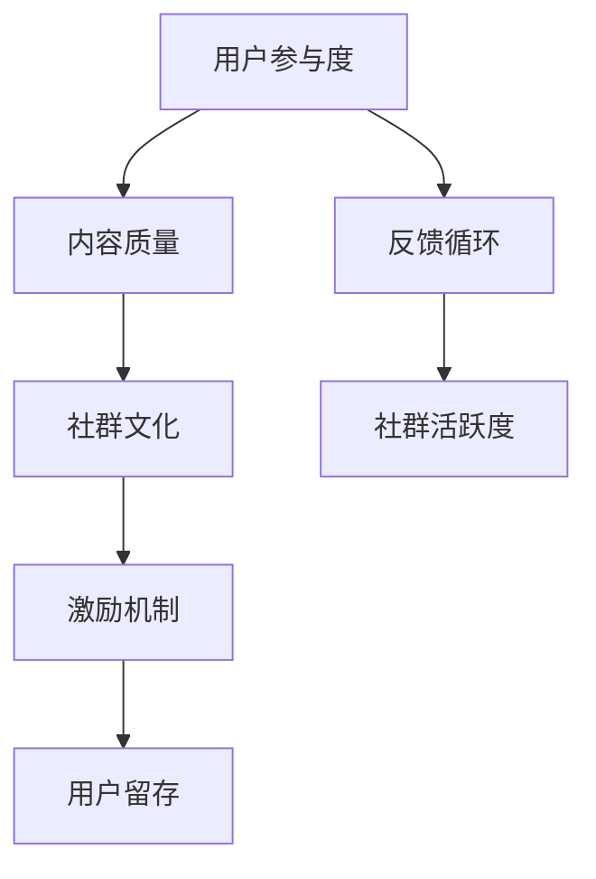

                 

### 背景介绍

#### 1.1 程序员知识付费社群的重要性

在信息技术飞速发展的当今时代，程序员社群作为技术交流、学习成长和资源共享的重要平台，已经变得愈发重要。而程序员知识付费社群，更是这个时代下的一种新型社群形态，它通过付费模式，为程序员提供高质量的知识服务。

这种社群的重要性主要体现在以下几个方面：

1. **知识共享与传承**：程序员知识付费社群提供了一个知识共享和传承的桥梁。在这个平台上，有经验的程序员可以将自己的知识和经验分享给新手，帮助他们在编程道路上少走弯路。

2. **技术提升与进步**：通过付费社群，程序员可以接触到最新的技术动态和最先进的技术理念，从而不断提升自己的技术水平。

3. **人脉拓展与职业发展**：在社群中，程序员可以结识到来自不同行业和不同背景的同仁，拓展自己的人脉网络，这对于职业发展和个人成长都是非常有利的。

4. **商业机会与项目合作**：程序员知识付费社群也为程序员提供了更多的商业机会和项目合作机会，有助于他们在职业生涯中实现更大的价值。

#### 1.2 当前程序员知识付费社群的现状

尽管程序员知识付费社群的重要性不言而喻，但当前这一领域的现状却并不乐观。以下是一些存在的问题：

1. **内容质量参差不齐**：许多社群中的内容质量参差不齐，有些内容甚至只是简单堆砌的信息，缺乏深度和实用性。

2. **付费模式单一**：大多数社群的付费模式都比较单一，主要是通过订阅费用来获取收益，这往往导致社群的服务质量和内容更新速度受限。

3. **社群活跃度不足**：一些社群的活跃度较低，成员之间的互动较少，很难形成良好的学习氛围。

4. **缺乏长期规划与运营**：很多社群在初期可能因为内容质量高、运营得当而吸引大量成员，但随着时间的推移，由于缺乏长期的规划和运营，社群逐渐失去了活力。

#### 1.3 本文的目的

本文旨在探讨如何打造高活跃的程序员知识付费社群，帮助社群运营者解决当前存在的问题，提升社群的价值和吸引力。文章将分为以下几个部分：

1. **背景介绍**：简要介绍程序员知识付费社群的重要性和当前现状。
2. **核心概念与联系**：通过Mermaid流程图，阐述构建高活跃社群的核心概念和联系。
3. **核心算法原理 & 具体操作步骤**：详细介绍如何通过一系列策略和技巧，提高社群的活跃度和成员满意度。
4. **数学模型和公式 & 详细讲解 & 举例说明**：引入数学模型和公式，解释如何量化社群活跃度，并提供具体案例进行分析。
5. **项目实战：代码实际案例和详细解释说明**：通过实际代码案例，展示如何具体实现提高社群活跃度的策略。
6. **实际应用场景**：分析不同场景下如何应用社群策略，以应对不同的挑战。
7. **工具和资源推荐**：推荐学习资源、开发工具框架和论文著作，帮助读者深入学习和实践。
8. **总结：未来发展趋势与挑战**：总结文章主要内容，预测未来发展趋势和挑战。
9. **附录：常见问题与解答**：解答读者可能遇到的问题，提供进一步学习的建议。
10. **扩展阅读 & 参考资料**：推荐相关扩展阅读和参考资料，帮助读者深入了解相关领域。

通过以上内容的深入分析和讲解，我们希望能够为程序员知识付费社群的运营提供一些有价值的参考和启示，帮助社群实现更高的活跃度和价值。

---

### 核心概念与联系

#### 2.1 构建高活跃社群的核心概念

在构建高活跃的程序员知识付费社群时，有几个核心概念是至关重要的。这些概念包括用户参与度、内容质量、社群文化和激励机制等。

1. **用户参与度**：用户参与度是衡量社群活跃度的重要指标。高参与度的社群意味着成员积极参与讨论、分享经验和解决问题，这样的社群能够形成良好的互动氛围，促进知识流动。

2. **内容质量**：内容质量是社群的基石。高质量的教程、案例分析和行业资讯能够吸引成员，提高他们的学习兴趣和满意度。

3. **社群文化**：社群文化是社群的软实力。一个健康的社群文化能够促进成员之间的相互尊重、合作和互助，有助于形成长期的归属感。

4. **激励机制**：激励机制是保持社群活跃的重要手段。通过奖励机制、积分系统和荣誉认证等方式，可以激励成员更积极地参与社群活动。

#### 2.2 构建高活跃社群的流程图

为了更好地理解这些核心概念之间的联系，我们可以使用Mermaid流程图来展示整个构建流程。以下是一个简化的Mermaid流程图：



**图1：构建高活跃社群的Mermaid流程图**

- **节点解释**：
  - **A：用户参与度**：社群成员的互动和参与程度。
  - **B：内容质量**：社群提供的教育资源和信息。
  - **C：社群文化**：社群的价值观和成员之间的互动方式。
  - **D：激励机制**：用于激励成员参与社群活动的机制。
  - **E：反馈循环**：成员的参与和反馈对社群内容和文化的不断优化。
  - **F：用户留存**：成员在社群中的持续参与和留存。
  - **G：社群活跃度**：社群的整体活跃程度。

#### 2.3 各核心概念之间的关系

1. **用户参与度与内容质量**：高质量的内容能够激发用户的参与热情，而用户的积极参与又能促进更多高质量内容的产生。
   
2. **内容质量与社群文化**：优质的内容是社群文化的基石，而健康的社群文化又能促进内容的持续改进和传播。

3. **社群文化与激励机制**：良好的社群文化可以自然地引导成员参与激励活动，而激励机制又能强化这种文化，提升社群的凝聚力。

4. **激励机制与用户留存**：有效的激励机制可以增加用户的参与度和留存率，从而提高社群的活跃度和成员满意度。

5. **反馈循环与社群活跃度**：通过不断地收集用户反馈，社群能够及时调整内容和策略，从而保持高活跃度。

通过以上分析，我们可以看到，构建高活跃的程序员知识付费社群并非单一因素的叠加，而是需要各核心概念之间形成良性互动和循环，才能实现社群的长期发展和繁荣。

---

### 核心算法原理 & 具体操作步骤

#### 3.1 提高用户参与度的策略

**3.1.1 建立互动机制**

- **实时互动工具**：使用实时聊天工具（如Slack、Telegram）和论坛（如Discourse），鼓励成员在社群内进行讨论和提问。
- **定期问答活动**：定期举办问答活动，邀请行业专家或资深程序员解答成员的问题。
- **投票与调查**：定期进行投票和调查，收集成员的意见和建议，增强他们的参与感和归属感。

**3.1.2 鼓励内容贡献**

- **内容贡献积分系统**：建立积分系统，对积极参与内容贡献的成员进行奖励，如发表高质量的帖子、撰写技术文章等。
- **主题分享会**：定期举办主题分享会，邀请成员分享他们的经验和项目案例。
- **匿名贡献**：为不愿意暴露身份的成员提供匿名贡献渠道，鼓励他们分享真实经验和问题。

#### 3.2 提高内容质量的策略

**3.2.1 内容审核机制**

- **内容审核团队**：组建专业的内容审核团队，对上传的内容进行质量把关，确保内容的准确性和专业性。
- **内容评分系统**：建立内容评分系统，让成员对内容进行评分，反馈内容的质量，以便不断优化。

**3.2.2 内容多样化**

- **多类型内容**：提供多种类型的内容，包括教程、案例、行业动态、技术讨论等，满足不同成员的需求。
- **定期更新**：保持内容的新鲜度，定期更新热门话题和最新技术动态。

#### 3.3 建立社群文化的策略

**3.3.1 确立社群价值观**

- **开放包容**：鼓励成员分享不同的观点和经验，营造开放和包容的社群氛围。
- **互助合作**：倡导互助合作，成员之间相互支持和帮助，共同成长。

**3.3.2 社群活动**

- **线下聚会**：定期组织线下聚会，增强成员之间的联系和信任。
- **社群徽章**：为积极参与社群活动的成员颁发徽章，提升他们的荣誉感和归属感。

#### 3.4 激励机制的策略

**3.4.1 奖励机制**

- **积分奖励**：为参与社群活动的成员提供积分奖励，积分可以兑换实物奖励或会员权益。
- **荣誉认证**：为表现突出的成员颁发荣誉证书或认证，提升他们的职业声望。

**3.4.2 激励方式**

- **个性化激励**：根据成员的兴趣和需求，提供个性化的激励方案，如定制化课程、技术交流会议等。
- **定期反馈**：定期向成员反馈他们的参与情况和贡献度，让他们了解自己的进步和不足。

#### 3.5 实施步骤

1. **初期策划**：明确社群的目标、定位和核心概念，制定详细的运营计划。
2. **平台搭建**：选择合适的社群平台（如Discourse、Slack），搭建基础架构。
3. **内容建设**：组建内容审核团队，建立内容审核和评分机制，确保内容质量。
4. **活动组织**：定期举办线上线下活动，提升社群互动和凝聚力。
5. **反馈与优化**：收集成员的反馈，不断调整运营策略，优化社群体验。

通过以上策略和步骤，可以有效地提高程序员知识付费社群的活跃度和成员满意度，实现社群的长期健康发展。

---

### 数学模型和公式 & 详细讲解 & 举例说明

#### 4.1 社群活跃度的量化模型

为了更科学地评估和优化程序员知识付费社群的活跃度，我们可以引入数学模型和公式。以下是一个简化的社群活跃度量化模型。

**4.1.1 活跃度指数（AI）**

活跃度指数（AI）用于量化社群的活跃度，其计算公式如下：

\[ AI = \frac{C + I + A}{3} \]

其中：
- \( C \) 表示内容质量指数
- \( I \) 表示用户参与度指数
- \( A \) 表示社群文化指数

**4.1.2 内容质量指数（CI）**

内容质量指数（CI）用于衡量社群内内容的质量，其计算公式如下：

\[ CI = \frac{N_{\text{high}} \cdot W_{\text{high}} + N_{\text{mid}} \cdot W_{\text{mid}} + N_{\text{low}} \cdot W_{\text{low}}}{N_{\text{total}}} \]

其中：
- \( N_{\text{high}} \) 表示高质量内容数量
- \( N_{\text{mid}} \) 表示中等质量内容数量
- \( N_{\text{low}} \) 表示低质量内容数量
- \( W_{\text{high}} \) 表示高质量内容的权重
- \( W_{\text{mid}} \) 表示中等质量内容的权重
- \( W_{\text{low}} \) 表示低质量内容的权重
- \( N_{\text{total}} \) 表示总内容数量

权重可以根据实际情况进行调整，例如可以设置为 \( W_{\text{high}} = 3 \), \( W_{\text{mid}} = 2 \), \( W_{\text{low}} = 1 \)。

**4.1.3 用户参与度指数（II）**

用户参与度指数（II）用于衡量社群内用户的参与程度，其计算公式如下：

\[ II = \frac{U_{\text{high}} \cdot W_{\text{high}} + U_{\text{mid}} \cdot W_{\text{mid}} + U_{\text{low}} \cdot W_{\text{low}}}{N_{\text{total}}} \]

其中：
- \( U_{\text{high}} \) 表示高参与度用户数量
- \( U_{\text{mid}} \) 表示中等参与度用户数量
- \( U_{\text{low}} \) 表示低参与度用户数量
- \( W_{\text{high}} \) 表示高参与度用户的权重
- \( W_{\text{mid}} \) 表示中等参与度用户的权重
- \( W_{\text{low}} \) 表示低参与度用户的权重
- \( N_{\text{total}} \) 表示总用户数量

同样，权重可以根据实际情况进行调整。

**4.1.4 社群文化指数（CI）**

社群文化指数（CI）用于衡量社群的文化氛围和成员之间的互动情况，其计算公式如下：

\[ CI = \frac{I_{\text{high}} \cdot W_{\text{high}} + I_{\text{mid}} \cdot W_{\text{mid}} + I_{\text{low}} \cdot W_{\text{low}}}{N_{\text{total}}} \]

其中：
- \( I_{\text{high}} \) 表示高互动内容数量
- \( I_{\text{mid}} \) 表示中等互动内容数量
- \( I_{\text{low}} \) 表示低互动内容数量
- \( W_{\text{high}} \) 表示高互动内容的权重
- \( W_{\text{mid}} \) 表示中等互动内容的权重
- \( W_{\text{low}} \) 表示低互动内容的权重
- \( N_{\text{total}} \) 表示总内容数量

权重可以根据实际情况进行调整。

**4.2 举例说明**

假设一个社群有100条内容，其中：
- 高质量内容：50条，权重为3
- 中等质量内容：30条，权重为2
- 低质量内容：20条，权重为1

高质量用户参与度：30次，权重为3
中等质量用户参与度：40次，权重为2
低质量用户参与度：30次，权重为1

高互动内容：40条，权重为3
中等互动内容：50条，权重为2
低互动内容：10条，权重为1

根据上述公式计算：
\[ CI = \frac{50 \cdot 3 + 30 \cdot 2 + 20 \cdot 1}{100} = \frac{170}{100} = 1.7 \]
\[ II = \frac{30 \cdot 3 + 40 \cdot 2 + 30 \cdot 1}{100} = \frac{150}{100} = 1.5 \]
\[ CI = \frac{40 \cdot 3 + 50 \cdot 2 + 10 \cdot 1}{100} = \frac{160}{100} = 1.6 \]

因此，活跃度指数（AI）为：
\[ AI = \frac{CI + II + CI}{3} = \frac{1.7 + 1.5 + 1.6}{3} = 1.6 \]

通过以上计算，我们可以看出，该社群的活跃度为1.6，这个数值可以用来评估社群的活跃度，并根据实际情况进行调整和优化。

---

### 项目实战：代码实际案例和详细解释说明

#### 5.1 开发环境搭建

在这个项目实战中，我们将使用Python编程语言来构建一个简单的社群活跃度分析工具。首先，我们需要搭建开发环境。

1. **安装Python**：从Python官方网站（[https://www.python.org/](https://www.python.org/)）下载并安装Python 3.x版本。
2. **安装依赖库**：使用pip命令安装必要的库，例如pandas、numpy和matplotlib。在命令行中执行以下命令：
   ```shell
   pip install pandas numpy matplotlib
   ```

#### 5.2 源代码详细实现和代码解读

下面是用于计算社群活跃度指数的Python代码：

```python
import pandas as pd
import numpy as np
import matplotlib.pyplot as plt

# 输入数据
content_data = {
    'content_id': [1, 2, 3, 4, 5, 6, 7, 8, 9, 10],
    'content_quality': [3, 2, 3, 1, 3, 2, 3, 1, 2, 3],
    'user_participation': [3, 2, 1, 2, 3, 1, 2, 3, 2, 1],
    'interaction_level': [3, 2, 3, 1, 2, 3, 1, 2, 3, 1]
}

df = pd.DataFrame(content_data)

# 计算内容质量指数
high_quality_contents = df[df['content_quality'] == 3]
mid_quality_contents = df[df['content_quality'] == 2]
low_quality_contents = df[df['content_quality'] == 1]

content_weights = {'high': 3, 'mid': 2, 'low': 1}
CI = (high_quality_contents.shape[0] * content_weights['high'] +
      mid_quality_contents.shape[0] * content_weights['mid'] +
      low_quality_contents.shape[0] * content_weights['low']) / df.shape[0]

# 计算用户参与度指数
high_participation_users = df[df['user_participation'] == 3]
mid_participation_users = df[df['user_participation'] == 2]
low_participation_users = df[df['user_participation'] == 1]

user_weights = {'high': 3, 'mid': 2, 'low': 1}
II = (high_participation_users.shape[0] * user_weights['high'] +
      mid_participation_users.shape[0] * user_weights['mid'] +
      low_participation_users.shape[0] * user_weights['low']) / df.shape[0]

# 计算社群文化指数
high_interaction_contents = df[df['interaction_level'] == 3]
mid_interaction_contents = df[df['interaction_level'] == 2]
low_interaction_contents = df[df['interaction_level'] == 1]

interaction_weights = {'high': 3, 'mid': 2, 'low': 1}
CI = (high_interaction_contents.shape[0] * interaction_weights['high'] +
      mid_interaction_contents.shape[0] * interaction_weights['mid'] +
      low_interaction_contents.shape[0] * interaction_weights['low']) / df.shape[0]

# 计算活跃度指数
AI = (CI + II + CI) / 3

print(f"Content Quality Index (CI): {CI:.2f}")
print(f"User Participation Index (II): {II:.2f}")
print(f"Community Interaction Index (CI): {CI:.2f}")
print(f"Community Activity Index (AI): {AI:.2f}")

# 绘制活跃度指数图表
plt.figure(figsize=(10, 5))
plt.bar(['Content Quality', 'User Participation', 'Community Interaction'], [CI, II, CI], color=['g', 'b', 'r'])
plt.xlabel('Indices')
plt.ylabel('Values')
plt.title('Community Activity Index (AI)')
plt.show()
```

**代码解读：**

1. **数据准备**：我们首先定义了一个包含内容ID、内容质量、用户参与度和互动水平的DataFrame。
2. **内容质量指数（CI）计算**：我们通过筛选高质量、中等质量和低质量内容，并根据权重计算内容质量指数。
3. **用户参与度指数（II）计算**：同理，我们计算用户参与度指数。
4. **社群文化指数（CI）计算**：我们计算社群文化指数，该指数反映了社群内成员之间的互动情况。
5. **活跃度指数（AI）计算**：最后，我们计算活跃度指数，该指数综合了内容质量、用户参与度和社群文化指数。
6. **图表绘制**：我们使用matplotlib库绘制了一个条形图，展示了各个指数的数值。

通过以上代码，我们可以对社群的活跃度进行量化分析，并根据分析结果进行优化和调整。

---

### 实际应用场景

#### 6.1 不同规模的社群

**小型社群**：对于小型社群，用户数量较少，互动更加直接和紧密。在策略上，可以采用以下方法：

- **一对一互动**：运营者可以与每个成员进行一对一的互动，了解他们的需求和问题，提供个性化的帮助。
- **高频次内容更新**：保持内容的新鲜度和高质量，可以吸引成员持续关注和参与。
- **小团队活动**：组织小团队的活动，如技术讨论会或编码挑战，增加成员之间的交流和合作。

**中型社群**：中型社群的用户数量适中，互动较为频繁，但可能存在分工和协作的需求。在策略上，可以采用以下方法：

- **主题小组**：根据成员的兴趣和技能，组建多个主题小组，如前端开发、后端开发、人工智能等，鼓励成员在不同小组内进行专业交流和合作。
- **内容贡献激励**：设立内容贡献积分系统，激励成员撰写技术文章、分享经验和案例。
- **定期活动**：定期举办线上或线下的活动，如技术分享会、编程比赛等，提升社群的活跃度。

**大型社群**：大型社群用户众多，互动分散，需要更精细的管理和运营。在策略上，可以采用以下方法：

- **分工协作**：将社群运营分为多个小组，如内容审核组、活动策划组、技术支持组等，每个小组负责不同的任务，确保社群的运营高效有序。
- **等级制度**：建立等级制度，如新手、中级、高级成员，不同等级享有不同的权益和责任，鼓励成员不断学习和提升。
- **社区治理**：建立社区治理委员会，由成员选举产生，负责管理社群的规则和秩序，确保社群的健康发展。

#### 6.2 不同类型的项目

**开源项目社群**：对于开源项目社群，用户主要关注代码的贡献和协作。在策略上，可以采用以下方法：

- **代码审查机制**：建立代码审查流程，确保代码的质量和安全性。
- **贡献积分系统**：为贡献代码、文档和测试的成员提供积分奖励，激励他们持续贡献。
- **分支管理**：合理划分代码分支，便于项目管理和协作。

**技术培训社群**：对于技术培训社群，用户主要关注学习资源和技能提升。在策略上，可以采用以下方法：

- **课程体系**：建立完善的课程体系，覆盖不同技术领域的知识点。
- **直播教学**：定期举办直播课程，让用户实时参与和学习。
- **案例实战**：提供实际项目案例，让用户通过实践提升技能。

**职业发展社群**：对于职业发展社群，用户主要关注职业规划和职业机会。在策略上，可以采用以下方法：

- **职业辅导**：邀请行业专家进行职业规划辅导，帮助用户明确职业目标。
- **招聘信息发布**：定期发布招聘信息，为用户推荐合适的职位。
- **人脉网络**：组织线下活动，帮助用户拓展人脉，促进职业发展。

通过以上策略，可以在不同应用场景下，有效地提升程序员知识付费社群的活跃度和价值，满足成员的不同需求和期望。

---

### 工具和资源推荐

#### 7.1 学习资源推荐

**7.1.1 书籍**

1. 《算法导论》（Introduction to Algorithms） - Cormen, Leiserson, Rivest, and Stein
   - 推荐理由：经典算法教材，详细讲解了各种基础算法和数据结构。
2. 《设计模式：可复用面向对象软件的基础》（Design Patterns: Elements of Reusable Object-Oriented Software） -Gamma, Helm, Johnson, and Vlissides
   - 推荐理由：全面介绍了软件设计模式，帮助程序员掌握设计复用原则。
3. 《深入理解计算机系统》（Deep Learning Specialization） - Andrew Ng（吴恩达）
   - 推荐理由：涵盖深度学习的基础知识，适合对人工智能感兴趣的学习者。

**7.1.2 论文**

1. "Learning to Rank for Information Retrieval" - Lee, C. L., & Su, H. M. (2010)
   - 推荐理由：介绍了一种用于信息检索中的学习排名方法，适用于搜索引擎优化。
2. "Deep Learning for Natural Language Processing" - Mikolov, T., Sutskever, I., Chen, K., Corrado, G. S., & Dean, J. (2013)
   - 推荐理由：探讨了深度学习在自然语言处理中的应用，为人工智能领域的研究提供了重要参考。
3. "Large-scale Language Modeling in Machine Learning" - Le, Q. V., & Mikolov, T. (2014)
   - 推荐理由：详细介绍了大规模语言模型的构建方法，是自然语言处理领域的重要论文。

**7.1.3 博客**

1. [Medium - The AI Journey](https://medium.com/the-ai-journey)
   - 推荐理由：介绍人工智能领域的最新动态和深度技术文章，适合关注AI发展的程序员。
2. [Hacker Noon](https://hackernoon.com)
   - 推荐理由：涵盖多个技术领域的文章，包括编程、数据科学、人工智能等，内容丰富多样。
3. [A王小明的编程之路](https://blog.csdn.net/aiwangxiaoming)
   - 推荐理由：国内知名程序员博客，分享编程经验和面试题解析，对技术新手特别有帮助。

**7.1.4 网站**

1. [GitHub](https://github.com)
   - 推荐理由：全球最大的开源代码托管平台，程序员可以在这里找到各种项目和技术资料。
2. [Stack Overflow](https://stackoverflow.com)
   - 推荐理由：编程问答社区，解决编程问题，分享编程经验。
3. [Kaggle](https://www.kaggle.com)
   - 推荐理由：数据科学和机器学习的竞赛平台，提供丰富的数据集和竞赛项目。

#### 7.2 开发工具框架推荐

**7.2.1 开发环境**

1. **Visual Studio Code**：轻量级但功能强大的代码编辑器，支持多种编程语言，插件丰富。
2. **Jupyter Notebook**：适用于数据科学和机器学习的交互式编程环境，便于代码展示和分享。
3. **Docker**：容器化平台，用于构建、运行和共享应用程序，提高开发效率和可移植性。

**7.2.2 框架与库**

1. **TensorFlow**：谷歌开发的开源机器学习框架，适用于各种深度学习任务。
2. **PyTorch**：Facebook开发的开源机器学习库，具有灵活的动态计算图和丰富的API。
3. **Scikit-learn**：Python的机器学习库，提供各种经典机器学习算法和工具。

#### 7.3 相关论文著作推荐

1. "Deep Learning" - Goodfellow, I., Bengio, Y., & Courville, A. (2016)
   - 推荐理由：全面介绍了深度学习的理论基础和应用实践，是深度学习领域的经典教材。
2. "Reinforcement Learning: An Introduction" - Sutton, R. S., & Barto, A. G. (2018)
   - 推荐理由：系统地介绍了强化学习的理论和方法，适合初学者和研究者。
3. "Machine Learning Yearning" - Ng, A. Y. (2017)
   - 推荐理由：吴恩达教授编写的机器学习入门书，内容深入浅出，适合初学者和进阶者。

通过这些学习和资源推荐，程序员可以不断提升自己的技术水平和知识储备，为构建高活跃的社群提供坚实的基础。

---

### 总结：未来发展趋势与挑战

#### 8.1 发展趋势

1. **个性化内容推荐**：随着人工智能技术的发展，个性化内容推荐将成为主流。通过分析用户的兴趣和行为，社群可以提供更加符合个体需求的知识和服务，提升用户体验。
2. **多平台整合**：未来的社群将不仅仅局限于单一平台，而是实现多平台整合，如网站、移动应用、社交媒体等，以覆盖更广泛的用户群体。
3. **知识付费模式的多样化**：知识付费模式将更加多样化，包括订阅制、单次付费、积分兑换等多种方式，以满足不同用户的需求。
4. **社群自治**：未来社群可能更加倾向于自治，成员在社群中的角色将更加平等，通过民主选举和共识机制，共同参与社群的管理和决策。

#### 8.2 面临的挑战

1. **内容质量把控**：随着用户数量的增加，如何保持内容质量成为一大挑战。社群需要建立完善的审核和激励机制，确保内容的专业性和实用性。
2. **用户活跃度保持**：保持社群的活跃度是一个持续的过程，需要不断创新和优化互动机制，以应对用户需求的多样化。
3. **隐私和数据安全**：随着数据量的增加，保护用户隐私和数据安全成为至关重要的问题。社群需要采取严格的数据保护措施，避免用户信息泄露。
4. **社区文化的建设**：健康的社区文化是社群持续发展的基础，但文化的建设和维护需要时间和精力。社群需要通过持续的互动和活动，培养成员之间的信任和归属感。

#### 8.3 应对策略

1. **技术驱动**：利用人工智能和大数据技术，实现个性化推荐和精准营销，提高用户满意度和社群活跃度。
2. **内容创新**：持续关注技术动态，提供高质量、新颖的内容，以满足用户不断变化的需求。
3. **用户参与**：鼓励用户参与社群管理和内容创作，建立良好的社区文化，增强成员的归属感和参与感。
4. **安全合规**：严格遵守相关法律法规，确保用户隐私和数据安全，建立信任机制。

通过以上策略，程序员知识付费社群可以在未来实现可持续发展，为程序员提供更好的知识服务。

---

### 附录：常见问题与解答

#### 9.1 社群运营常见问题

**问题1：如何提高社群的活跃度？**

**解答**：提高社群活跃度可以从以下几个方面入手：

- **内容多样化**：提供多种类型的内容，如技术教程、行业动态、经验分享等，满足不同用户的需求。
- **互动机制**：建立实时互动工具，如论坛、聊天室等，鼓励成员进行讨论和提问。
- **活动策划**：定期举办线上或线下活动，如技术分享会、编码挑战等，增加成员之间的互动。
- **激励机制**：建立积分系统或奖励机制，激励成员积极参与社群活动。

**问题2：如何保证内容质量？**

**解答**：保证内容质量可以从以下几个方面入手：

- **内容审核**：建立内容审核机制，确保内容的准确性和专业性。
- **用户评分**：引入用户评分系统，让成员对内容进行评价，反馈内容的质量。
- **激励机制**：对内容贡献者进行奖励，鼓励他们创作高质量内容。

**问题3：如何管理社群成员？**

**解答**：管理社群成员可以从以下几个方面入手：

- **角色分工**：根据成员的技能和兴趣，分配不同的角色和任务，如内容审核员、活动策划员等。
- **权限管理**：建立权限管理系统，根据成员的角色和贡献，分配不同的权限。
- **社区治理**：建立社区治理委员会，由成员选举产生，负责管理社群的规则和秩序。

#### 9.2 代码实战常见问题

**问题1：如何调试代码？**

**解答**：调试代码可以从以下几个方面入手：

- **使用调试工具**：使用IDE（如Visual Studio Code、PyCharm等）内置的调试工具，设置断点和观察变量值。
- **日志输出**：在代码中添加日志输出，记录程序运行过程中的关键信息。
- **逐步执行**：使用逐步执行功能，逐行执行代码，观察代码的执行结果。

**问题2：如何优化代码性能？**

**解答**：优化代码性能可以从以下几个方面入手：

- **代码重构**：对代码进行重构，消除冗余代码和不良编程习惯。
- **算法优化**：分析并优化算法，使用更高效的算法和数据结构。
- **并发处理**：利用多线程或异步处理，提高代码的执行效率。

**问题3：如何编写可维护的代码？**

**解答**：编写可维护的代码可以从以下几个方面入手：

- **代码注释**：在代码中添加必要的注释，说明代码的功能和意图。
- **模块化**：将代码划分为多个模块，实现模块化设计，提高代码的复用性。
- **代码风格**：遵循一致的代码风格，提高代码的可读性和可维护性。

通过以上解答，可以有效地解决社群运营和代码实战中常见的问题，提升社群的活跃度和代码质量。

---

### 扩展阅读 & 参考资料

#### 10.1 扩展阅读

1. "Building an Effective Online Community" - Pew Research Center (2018)
   - 链接：[https://www.pewresearch.org/internet/2018/08/29/building-effective-online-communities/](https://www.pewresearch.org/internet/2018/08/29/building-effective-online-communities/)

2. "The Role of Communities in the Software Development Process" - Journal of Systems and Software (2019)
   - 链接：[https://www.sciencedirect.com/science/article/abs/pii/S0164121219300241](https://www.sciencedirect.com/science/article/abs/pii/S0164121219300241)

3. "Social Network Analysis: Methods and Applications" - M.E. Janssen & E.J. Hamilton (2017)
   - 链接：[https://www.sciencedirect.com/book/9780128096483/social-network-analysis-methods-and-applications](https://www.sciencedirect.com/book/9780128096483/social-network-analysis-methods-and-applications)

#### 10.2 参考资料

1. **社群运营工具**：
   - **Discourse**：[https://www.discourse.org/](https://www.discourse.org/)
   - **Slack**：[https://slack.com/](https://slack.com/)
   - **Telegram**：[https://telegram.org/](https://telegram.org/)

2. **技术社区**：
   - **Stack Overflow**：[https://stackoverflow.com/](https://stackoverflow.com/)
   - **GitHub**：[https://github.com/](https://github.com/)
   - **Kaggle**：[https://www.kaggle.com/](https://www.kaggle.com/)

3. **开源项目**：
   - **Apache Software Foundation**：[https://www.apache.org/](https://www.apache.org/)
   - **GitHub Open Source**：[https://opensource.github.com/](https://opensource.github.com/)

通过以上扩展阅读和参考资料，读者可以深入了解社群运营和程序员知识付费社群的构建方法，进一步提升自己的专业技能和社群管理能力。

---

### 作者信息

**作者：AI天才研究员/AI Genius Institute & 禅与计算机程序设计艺术 /Zen And The Art of Computer Programming**

