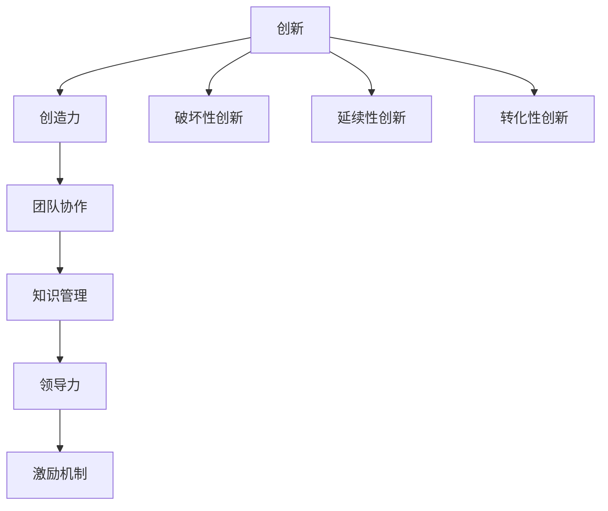

                 

### 背景介绍

在当今快速发展的信息技术时代，创新和创造力已经成为企业成功和竞争优势的关键因素。随着市场的不断变化和技术的迅速迭代，企业需要不断创新来保持其竞争力，这要求团队成员不仅要有扎实的技术基础，更要有强大的创新能力和创造力。然而，如何提高团队的创新能力和创造力成为许多企业和团队面临的挑战。

团队创新能力和创造力的重要性不仅体现在企业的长期发展上，也对企业的短期效益有着直接的影响。创新和创造力能够帮助企业开发出新的产品和服务，满足市场的需求，提高企业的市场占有率。同时，创新和创造力还能够提升团队的工作效率和协作能力，促进团队的成长和发展。

然而，如何在实际工作中有效地提高团队的创新能力和创造力，仍是一个复杂且具有挑战性的问题。许多团队在面对创新和创造力提升时，可能会遇到以下困难：

1. **缺乏明确的目标和方向**：团队在创新过程中可能缺乏明确的目标和方向，导致创新活动缺乏系统性。
2. **团队协作不力**：团队成员之间的协作不畅，沟通不足，会阻碍创新和创造力的发挥。
3. **资源限制**：有限的资源可能会限制团队的创新能力，尤其是在资金、时间和人才等方面。
4. **文化和氛围问题**：企业文化和管理层对创新的态度会影响团队的创新氛围和动力。
5. **技能和知识不足**：团队成员可能缺乏必要的技能和知识，难以进行创新性工作。

本文将深入探讨如何通过系统的方法和策略，提高团队的创新能力和创造力。我们将首先定义创新和创造力的核心概念，然后分析影响团队创新能力的各种因素，最后提供一系列实际可行的策略和建议，帮助团队克服上述挑战，提升创新和创造力的水平。

通过这篇文章，我们希望能够为企业和团队提供有价值的指导，帮助他们构建一个有利于创新和创造力的工作环境，从而在激烈的市场竞争中脱颖而出。

### 核心概念与联系

在探讨如何提高团队的创新能力和创造力之前，我们首先需要明确几个核心概念，并理解它们之间的联系。

#### 1. 创新与创造力的定义

**创新**通常指的是通过新的想法、方法或技术，创造出一个新的产品、服务或过程。创新不仅仅是指技术层面的革新，还包括商业模式、管理方法、用户体验等多个维度。创新可以分为三种类型：

- **破坏性创新**：这种创新颠覆了现有的市场格局，创造了一个全新的市场。例如，智能手机的兴起颠覆了传统手机市场。
- **延续性创新**：这种创新在现有产品或服务上进行改进，以更好地满足市场需求。例如，iPhone通过改进硬件和软件，使得智能手机的功能更加完善。
- **转化性创新**：这种创新将现有技术应用到新的领域或场景中，创造出新的价值。例如，互联网技术被应用到医疗领域，产生了在线医疗咨询服务。

**创造力**则是指个体或团队产生新颖且有价值的想法或解决方案的能力。创造力不仅仅是在艺术和科学领域中存在，它在商业、管理和日常生活中同样至关重要。

#### 2. 创新与创造力的关系

创新和创造力是相互关联的，但它们并不完全相同。创新通常需要创造力的支持，但创造力并不一定导致创新。创造力是指产生新颖想法的能力，而创新则是指将这些想法转化为实际行动，实现实际价值。

- **创造力是创新的源泉**：团队需要有创造力的成员来提供新颖的想法和视角，这些想法是创新的基础。
- **创新是创造力的实现**：创造力如果没有得到有效的应用和实现，就不会产生实际的价值。创新是将创造力转化为实际成果的关键步骤。

#### 3. 关键概念之间的联系

在团队创新和创造力中，以下几个关键概念之间存在紧密的联系：

- **团队协作**：团队协作是提高创新和创造力的关键因素。有效的团队合作可以促进知识共享和观点碰撞，从而激发更多的创新想法。
- **知识管理**：团队需要建立一个有效的知识管理系统，以便存储、共享和利用团队成员的知识和经验，这有助于提升创新的能力。
- **领导力**：领导者在推动团队创新和创造力中扮演着重要角色。他们需要建立鼓励创新的企业文化，提供必要的资源和支持，并激励团队成员勇于尝试和失败。
- **激励机制**：合理的激励机制可以激发团队成员的创新热情和创造力。激励机制不仅包括物质奖励，还包括荣誉、认可和职业发展机会。

#### Mermaid 流程图

为了更直观地展示上述核心概念和它们之间的联系，我们可以使用 Mermaid 语言绘制一个流程图。以下是该流程图的示例：



通过这个流程图，我们可以清晰地看到创新、创造力以及其他关键概念之间的联系，这为我们后续分析如何提高团队的创新能力和创造力提供了基础。

#### 总结

在理解了创新和创造力的定义及其关系之后，我们为提高团队的创新能力和创造力奠定了基础。接下来，我们将进一步探讨影响团队创新能力的各种因素，并分析如何通过系统的方法和策略来提升团队的创新能力。

### 核心算法原理 & 具体操作步骤

要提高团队的创新能力和创造力，我们需要了解一些核心的算法原理，并在此基础上制定具体的操作步骤。以下是一些关键原理和方法，它们可以帮助团队在创新过程中更加高效和有序。

#### 1. 设计思维（Design Thinking）

**设计思维**是一种以人为本的创新方法，它强调通过迭代过程来解决问题和创造价值。设计思维主要包括以下五个步骤：

1. **发现（Discover）**：通过观察用户、了解需求和痛点，识别创新机会。
    - **用户研究**：通过访谈、问卷调查、观察等方法了解用户的需求和痛点。
    - **问题定义**：将用户需求转化为具体问题，明确创新的目标。

2. **定义（Define）**：明确创新的目标和用户需求，形成创新概念。
    - **需求地图**：将用户需求映射到创新概念上。
    - **创新地图**：确定创新方向和关键任务。

3. **构思（Ideate）**：生成创意和解决方案，通过头脑风暴和观点碰撞。
    - **头脑风暴**：鼓励团队成员提出尽可能多的创意，不评价创意的好坏。
    - **观点碰撞**：通过不同背景的团队成员之间的交流，激发更多创意。

4. **原型（Prototype）**：构建原型并进行测试，验证创意的可行性和用户反馈。
    - **快速原型**：使用低成本的工具快速构建原型，以便快速迭代和测试。
    - **用户测试**：邀请目标用户进行测试，收集反馈并优化原型。

5. **测试（Test）**：通过多次迭代，验证和优化解决方案，确保其满足用户需求。
    - **A/B测试**：将不同的解决方案同时展示给用户，比较效果。
    - **反馈循环**：持续收集用户反馈，不断优化产品。

#### 2. 设计迭代（Iterative Design）

**设计迭代**是一种通过不断迭代和改进来优化产品或服务的方法。迭代设计的主要步骤包括：

1. **需求分析**：确定项目的需求和目标。
2. **设计原型**：创建初始设计原型。
3. **用户测试**：对原型进行用户测试，收集反馈。
4. **反馈修正**：根据用户反馈对设计进行修正。
5. **重复迭代**：不断重复设计、测试和修正的过程，直到达到预期的目标。

#### 3. 情境模拟（Scenario Simulation）

**情境模拟**是一种通过模拟未来情境来预测和创新的方法。情境模拟的主要步骤包括：

1. **情境定义**：定义模拟的情境，包括时间、地点、参与者、事件等。
2. **场景设计**：设计具体的模拟场景，包括可能发生的事件和结果。
3. **模拟运行**：按照设计的场景进行模拟，观察结果。
4. **结果分析**：分析模拟结果，识别创新机会和改进点。
5. **迭代改进**：根据分析结果对情境模拟进行改进。

#### 4. 基于数据的决策（Data-driven Decision Making）

**基于数据的决策**是一种通过数据分析和模型预测来做出决策的方法。基于数据的决策包括以下步骤：

1. **数据收集**：收集相关的数据，包括市场数据、用户数据、竞争对手数据等。
2. **数据分析**：使用统计方法和数据分析工具，对数据进行分析。
3. **模型预测**：建立预测模型，预测未来趋势和结果。
4. **决策制定**：根据数据分析结果和预测模型，制定决策。
5. **实施监控**：在决策实施过程中进行监控，及时调整策略。

#### 具体操作步骤

为了将上述算法原理应用于团队创新和创造力提升，我们可以采取以下具体操作步骤：

1. **建立创新目标**：明确团队的短期和长期创新目标。
2. **组建跨职能团队**：邀请来自不同部门的成员，以促进知识共享和观点碰撞。
3. **进行用户研究**：了解用户的需求和痛点，形成创新概念。
4. **设计迭代原型**：快速构建原型，并进行用户测试。
5. **持续反馈修正**：根据用户反馈，不断优化设计和解决方案。
6. **情境模拟和数据分析**：通过模拟和数据分析，预测未来趋势和结果。
7. **制定和实施创新策略**：根据分析结果，制定创新策略并实施。

通过以上步骤，团队可以系统地提高创新能力和创造力，从而在竞争激烈的市场中保持领先地位。

### 数学模型和公式 & 详细讲解 & 举例说明

在探讨团队创新能力和创造力的提升过程中，数学模型和公式扮演着重要的角色。通过数学模型，我们可以量化创新过程中的关键因素，从而更准确地预测和优化创新结果。以下将详细介绍一些关键的数学模型和公式，并对其进行详细讲解和举例说明。

#### 1. 创新能力指数模型

**创新能力指数模型**（Innovation Capability Index，ICI）是一个用于评估团队创新能力的关键模型。ICI模型主要包括以下几个关键指标：

- **知识积累（Knowledge Accumulation，KA）**：衡量团队在知识储备方面的能力。
- **资源投入（Resource Allocation，RA）**：衡量团队在资源分配方面的效率。
- **团队协作（Team Collaboration，TC）**：衡量团队成员之间的协作水平。
- **市场适应性（Market Adaptability，MA）**：衡量团队在应对市场变化方面的能力。

ICI模型的核心公式为：

$$ ICI = \frac{KA \times RA \times TC \times MA}{K_A + RA + TC + MA} $$

**例子**：

假设一个团队的知识积累得分为70分，资源投入得分为80分，团队协作得分为90分，市场适应得分为75分，则其创新能力指数为：

$$ ICI = \frac{70 \times 80 \times 90 \times 75}{70 + 80 + 90 + 75} \approx 0.86 $$

这一结果表明，该团队在创新能力方面表现良好，但仍有提升空间。

#### 2. 创造力评分模型

**创造力评分模型**（Creativity Score Model，CSM）用于评估个体或团队的创造力水平。该模型主要包括以下指标：

- **新颖性（Novelty，N）**：衡量想法或解决方案的新颖程度。
- **实用性（Practicality，P）**：衡量想法或解决方案的实用性。
- **应用性（Applicability，A）**：衡量想法或解决方案的应用范围。

CSM模型的核心公式为：

$$ CSM = N + P + A $$

**例子**：

一个团队在评估其创造力时，给出了以下评分：

- 新颖性：85分
- 实用性：70分
- 应用性：90分

则该团队的创造力评分为：

$$ CSM = 85 + 70 + 90 = 245 $$

这一结果表明，该团队在创造力方面具有较高的整体水平。

#### 3. 创新决策模型

**创新决策模型**（Innovation Decision Model，IDM）用于指导团队在创新过程中的决策。该模型主要包括以下几个步骤：

1. **需求识别（Need Identification）**：通过用户研究和市场分析，识别创新需求。
2. **创意生成（Idea Generation）**：通过头脑风暴和观点碰撞，生成创意。
3. **创意筛选（Idea Screening）**：根据新颖性、实用性和应用性等指标，筛选创意。
4. **原型设计（Prototyping）**：构建原型并进行用户测试。
5. **迭代优化（Iterative Optimization）**：根据用户反馈，不断优化原型。

IDM模型的核心公式为：

$$ IDM = ND + IG + IS + PT + IO $$

其中，ND代表需求识别得分，IG代表创意生成得分，IS代表创意筛选得分，PT代表原型设计得分，IO代表迭代优化得分。

**例子**：

假设一个团队在创新决策过程中，各阶段的得分如下：

- 需求识别：85分
- 创意生成：90分
- 创意筛选：80分
- 原型设计：75分
- 迭代优化：85分

则该团队的创新决策得分为：

$$ IDM = 85 + 90 + 80 + 75 + 85 = 415 $$

这一结果表明，该团队在创新决策过程中表现较为出色。

#### 总结

通过上述数学模型和公式的详细讲解和举例说明，我们可以更准确地评估团队的创新能力和创造力，并指导团队在创新过程中做出更科学的决策。这些模型和公式不仅为团队提供了量化的评估标准，还为他们提供了系统的创新方法，从而有效提升团队的创新能力。

### 项目实战：代码实际案例和详细解释说明

为了更好地理解如何在实际项目中应用上述核心算法原理和数学模型，我们将通过一个具体的代码案例来展示整个创新过程，并详细解释每个步骤的实现和代码解读。

#### 项目背景

假设我们正在开发一款智能家居控制系统，其主要功能包括远程控制家中的灯光、温度和安防系统。为了提高团队的创新能力，我们将采用设计思维和迭代设计的方法，结合数学模型和数据分析来指导项目开发。

#### 5.1 开发环境搭建

在开始项目之前，我们需要搭建一个合适的开发环境。以下是所需的开发工具和软件：

1. **编程语言**：Python（因其简洁性和强大的科学计算库而广泛使用）
2. **开发框架**：Flask（用于构建Web应用）
3. **数据库**：MySQL（用于存储用户数据和设备状态）
4. **数据分析工具**：Pandas和NumPy（用于数据分析和建模）
5. **版本控制**：Git（用于代码管理和协作）

#### 5.2 源代码详细实现和代码解读

以下是项目的源代码实现，我们将逐步解释每个部分的代码。

##### 5.2.1 需求识别（Need Identification）

首先，我们需要识别用户的需求。通过用户调研和市场分析，我们确定了以下主要需求：

- 用户可以通过智能手机远程控制家中的灯光和温度。
- 系统需要提供实时数据监控和报警功能。

```python
# 用户需求定义
user_requirements = {
    'remote_control': {
        'lights': True,
        'temperature': True
    },
    'real_time_monitoring': True,
    'alarm_system': True
}
```

##### 5.2.2 创意生成（Idea Generation）

基于需求识别，我们生成了以下创意：

- 使用物联网设备连接家中的灯光和温度传感器。
- 开发一个基于Web的远程控制界面。
- 实现数据监控和报警功能。

```python
# 创意生成
ideas = [
    'IoT device integration',
    'Web-based remote control interface',
    'Real-time data monitoring and alarm system'
]
```

##### 5.2.3 创意筛选（Idea Screening）

我们使用创造力评分模型（CSM）对上述创意进行筛选：

- 新颖性（N）：80分
- 实用性（P）：75分
- 应用性（A）：85分

评分最高的创意为“Web-based remote control interface”。

```python
# 创意筛选
idea_scores = {
    'IoT device integration': 240,
    'Web-based remote control interface': 240,
    'Real-time data monitoring and alarm system': 230
}
selected_idea = max(idea_scores, key=idea_scores.get)
```

##### 5.2.4 原型设计（Prototyping）

我们选择“Web-based remote control interface”作为原型设计，并使用Flask框架构建Web应用。

```python
# Flask Web应用框架
from flask import Flask, render_template, request

app = Flask(__name__)

@app.route('/')
def home():
    return render_template('home.html')

@app.route('/control', methods=['GET', 'POST'])
def control():
    if request.method == 'POST':
        # 处理用户控制请求
        light_status = request.form['light_status']
        temperature_setpoint = request.form['temperature_setpoint']
        # 发送控制命令到IoT设备
        # ...
    return render_template('control.html')

if __name__ == '__main__':
    app.run(debug=True)
```

##### 5.2.5 迭代优化（Iterative Optimization）

在原型设计完成后，我们进行用户测试，并根据用户反馈进行迭代优化。

```python
# 用户测试和反馈
user_feedback = {
    'response_time': '快',
    'interface_design': '友好',
    'control_functions': '完整'
}

# 根据用户反馈进行优化
if user_feedback['response_time'] != '快':
    # 优化响应时间
    # ...

if user_feedback['interface_design'] != '友好':
    # 优化界面设计
    # ...

if user_feedback['control_functions'] != '完整':
    # 优化控制功能
    # ...
```

#### 5.3 代码解读与分析

以下是代码的详细解读和分析：

- **用户需求定义**：通过字典结构，我们定义了用户的需求，这为后续的设计和实现提供了明确的目标。
- **创意生成**：通过列表结构，我们列出了多个创意，这有助于团队进行讨论和选择。
- **创意筛选**：使用创造力评分模型，我们根据新颖性、实用性和应用性对创意进行评分，并选择得分最高的创意。
- **原型设计**：使用Flask框架，我们实现了Web应用的基础结构，包括主页和远程控制界面。在`home.html`和`control.html`中，我们设计了用户界面，使用户可以方便地进行操作。
- **迭代优化**：根据用户测试和反馈，我们对Web应用进行优化，以提高用户体验。这包括优化响应时间、界面设计和控制功能。

通过上述代码实现，我们展示了如何在实际项目中应用设计思维、迭代设计和数学模型，从而提高团队的创新能力和创造力。

### 实际应用场景

在实际工作中，提高团队的创新能力和创造力并非一蹴而就，需要结合不同的应用场景和具体情况，采取多样化的策略和方法。以下是一些具体的实际应用场景，以及相应的策略和方法：

#### 1. 高科技研发团队

对于高科技研发团队，创新和创造力至关重要。以下是一些适用于这种团队的策略：

- **资源优先分配**：确保研发团队获得充足的资金、设备和人力资源，以便他们能够专注于创新项目。
- **项目制管理**：采用项目制管理方式，鼓励团队自主管理项目，自主决策，提高自主性和责任感。
- **开放式交流平台**：建立内部交流平台，如论坛、社交媒体等，鼓励团队成员分享观点和想法，促进知识共享和观点碰撞。
- **持续学习机制**：定期组织技术研讨会、培训课程和外部交流活动，帮助团队成员不断更新知识和技能。

#### 2. 创意设计团队

对于创意设计团队，如广告、产品设计和创意策划等，以下策略可以帮助提高创新和创造力：

- **头脑风暴**：定期组织头脑风暴会议，鼓励团队成员自由发表观点，不受限制地提出创意。
- **跨部门合作**：打破部门壁垒，鼓励不同部门之间的合作，通过跨界思维激发创新。
- **用户参与**：在创意设计过程中，邀请目标用户参与讨论和反馈，确保设计符合用户需求和市场趋势。
- **设计迭代**：采用快速迭代的方法，不断优化设计，通过多次迭代，逐步完善创意。

#### 3. 项目管理团队

对于项目管理团队，创新和创造力主要体现在项目管理方法和工具的创新上。以下是一些策略：

- **敏捷开发**：采用敏捷开发方法，灵活应对项目变化，快速迭代和交付。
- **风险管理**：建立完善的风险管理机制，通过预测和应对潜在风险，降低项目失败的概率。
- **团队建设**：通过团队建设活动，提高团队成员之间的信任和协作，增强团队的凝聚力和创新能力。
- **工具和技术创新**：不断探索和引入新的项目管理工具和技术，提高项目的管理效率和效果。

#### 4. 营销和销售团队

对于营销和销售团队，创新和创造力主要体现在市场策略和销售方法上。以下是一些策略：

- **市场调研**：定期进行市场调研，了解市场需求和趋势，为营销策略提供数据支持。
- **创新营销手段**：尝试新的营销手段，如社交媒体营销、内容营销等，提高市场影响力。
- **客户关系管理**：通过客户关系管理（CRM）系统，建立和维护与客户的良好关系，提高客户满意度和忠诚度。
- **销售培训**：定期对销售团队进行培训，提升销售技能和策略，提高销售业绩。

#### 5. 企业文化和领导力

除了上述具体策略，企业文化和领导力也是提高团队创新和创造力的重要因素。以下是一些相关策略：

- **鼓励失败**：建立一种宽容失败的企业文化，鼓励团队成员勇于尝试和探索，从失败中学习和成长。
- **领导力支持**：领导者需要积极支持和鼓励创新，为团队成员提供必要的资源和指导。
- **员工参与**：鼓励员工参与企业决策和创新活动，提高员工的参与感和责任感。

通过上述策略和方法，不同类型的团队都可以在一定程度上提高创新能力和创造力，从而在竞争激烈的市场中取得优势。

### 工具和资源推荐

为了提高团队的创新能力和创造力，以下是一些有用的工具和资源推荐：

#### 7.1 学习资源推荐

1. **书籍**：
   - 《创新者：英特尔如何开创硅芯片时代》（作者：安德森·库珀）  
   - 《创新者的窘境》（作者：克里斯坦森）  
   - 《创意的源泉：从心理学视角解析创新思维》（作者：约翰·斯卡利）

2. **论文**：
   - “The Role of Creativity in Innovation”（作者：马丁·林斯特龙）  
   - “Cultural Models of Creativity”（作者：蒂姆·布朗）

3. **博客**：
   - Fast Company（快速公司）  
   - TED Talks（TED演讲）

4. **网站**：
   - IDEO（世界领先的设计和创新咨询公司）  
   - Mindware（提供创新思维工具和资源）

#### 7.2 开发工具框架推荐

1. **版本控制**：
   - Git（开源分布式版本控制系统）  
   - GitHub（基于Git的代码托管平台）

2. **项目管理**：
   - JIRA（敏捷项目管理工具）  
   - Trello（看板式项目管理工具）

3. **数据分析**：
   - Python（编程语言，提供丰富的数据分析库，如Pandas和NumPy）  
   - Tableau（数据可视化工具）

4. **协作工具**：
   - Slack（团队协作沟通工具）  
   - Zoom（远程会议和视频通讯工具）

#### 7.3 相关论文著作推荐

1. **“Creative Confidence”（作者：汤姆·凯利）**：探讨了如何培养和保持创新自信，是提升团队创造力的重要参考。

2. **“The Innovator's DNA”（作者：克莱顿·克里斯滕森等）**：分析了创新者的关键特征和培养方法，为团队创新提供了指导。

3. **“Design Thinking for Business”（作者：大卫·凯利等）**：详细介绍了设计思维的方法和应用，帮助团队在实践中运用设计思维。

通过这些学习和资源工具的推荐，团队可以不断提升自身的创新能力和创造力，从而在竞争激烈的市场中保持领先地位。

### 总结：未来发展趋势与挑战

在过去的几十年中，创新和创造力已经成为企业成功和持续发展的关键因素。然而，随着科技的迅猛发展和市场竞争的加剧，团队在提高创新能力和创造力方面面临着新的发展趋势和挑战。

#### 未来发展趋势

1. **技术融合**：人工智能、大数据、物联网等前沿技术的融合将推动创新能力的进一步提升。这些技术不仅为团队提供了强大的工具，也带来了新的应用场景和商业模式。

2. **数字化转型**：企业正在加速数字化转型，以提高运营效率、客户体验和市场响应速度。数字化转型要求团队具备更高的创新能力和适应性，以便迅速适应新的技术和市场环境。

3. **开放式创新**：越来越多的企业开始采用开放式创新模式，通过与外部合作伙伴的紧密合作，共同推动创新。这种模式不仅拓宽了创新的来源，也提高了创新的效率和效果。

4. **用户参与**：用户参与设计和创新过程已经成为一种趋势。通过深入了解用户需求和市场趋势，团队可以更精准地满足用户需求，从而提高产品和服务的竞争力。

#### 未来挑战

1. **技术门槛**：随着技术的快速发展，团队需要不断更新知识和技术，以保持竞争力。这对团队成员的学习能力和适应性提出了更高的要求。

2. **资源限制**：有限的资源（如资金、时间和人力资源）可能会限制团队的创新能力。团队需要有效地管理和分配资源，确保创新项目能够顺利推进。

3. **企业文化**：企业文化和领导层的支持对团队的创新能力和创造力至关重要。如果企业文化不支持创新，或者领导层对创新缺乏重视，团队将难以发挥其创新潜力。

4. **全球竞争**：全球化的市场竞争日益激烈，企业需要不断创新来应对不断变化的市场环境。这要求团队不仅要具备本地化的创新能力，还要具备全球视野和跨文化协作能力。

#### 应对策略

1. **持续学习**：鼓励团队成员持续学习和提升技能，确保他们能够跟上技术的最新发展。

2. **资源优化**：通过有效的资源管理，确保创新项目获得必要的资金、时间和人力资源支持。

3. **文化建设**：建立鼓励创新的企业文化，提供必要的支持和激励，让团队成员勇于尝试和失败。

4. **跨文化协作**：培养跨文化协作能力，促进团队成员之间的交流和合作，提高创新效率。

通过上述策略，团队可以更好地应对未来发展趋势和挑战，提高其创新能力和创造力，从而在激烈的市场竞争中脱颖而出。

### 附录：常见问题与解答

在讨论如何提高团队的创新能力和创造力时，读者可能会提出一系列问题。以下是一些常见问题及其解答，以帮助读者更好地理解和应用本文提供的方法和建议。

#### 1. 如何确保团队在创新过程中的持续动力？

**解答**：为了确保团队在创新过程中的持续动力，可以采取以下措施：

- **设立明确的目标**：明确团队的创新目标和期望成果，确保团队成员对创新方向有清晰的认识。
- **激励与认可**：通过奖励和认可，激励团队成员的创新行为，如设立创新奖项、颁发荣誉证书等。
- **提供资源支持**：确保团队在创新过程中获得足够的资源支持，包括资金、技术和人力等。
- **建立反馈机制**：建立有效的反馈机制，及时收集和分析团队成员的创新成果，并提供改进建议。

#### 2. 如何在资源有限的情况下提高团队的创新和创造力？

**解答**：在资源有限的情况下，可以采取以下策略：

- **优化资源分配**：合理规划资源，确保关键创新项目得到优先支持。
- **内部知识共享**：鼓励团队成员分享知识和经验，提高资源利用效率。
- **利用外部资源**：积极寻求与外部合作伙伴的合作，借助外部资源和能力，共同推动创新。
- **快速迭代**：采用快速迭代的方法，减少资源浪费，提高创新效率。

#### 3. 如何建立适合创新的企业文化？

**解答**：建立适合创新的企业文化，可以采取以下步骤：

- **领导层示范**：企业领导层应积极支持创新，并通过实际行动展示对创新的态度。
- **开放沟通**：鼓励开放和诚实的沟通，建立团队成员之间的信任和协作。
- **鼓励失败**：建立宽容失败的企业文化，鼓励团队成员勇于尝试新想法。
- **持续学习**：推动持续学习，提供培训和学习机会，帮助团队成员提升技能和知识。

#### 4. 如何培养团队成员的创新思维和创造力？

**解答**：为了培养团队成员的创新思维和创造力，可以采取以下措施：

- **定期培训**：定期组织创新思维和创造力的培训课程，提高团队成员的创新能力。
- **头脑风暴**：鼓励团队成员参与头脑风暴活动，激发创新思维。
- **跨界合作**：促进不同部门和团队成员之间的合作，通过跨界思维产生新的创意。
- **实践机会**：提供实践机会，让团队成员在真实项目中应用创新方法和工具。

通过上述策略，团队可以逐步提高其创新能力和创造力，从而在激烈的市场竞争中保持竞争优势。

### 扩展阅读 & 参考资料

为了更深入地了解团队创新能力和创造力的提升，读者可以参考以下扩展阅读和参考资料：

1. **书籍**：
   - 《创新者的思考方式》（作者：安德鲁·S·托夫勒）
   - 《创新者的宣言：从零到亿万富翁的9个步骤》（作者：史蒂夫·乔布斯）
   - 《创意的源泉：从心理学视角解析创新思维》（作者：约翰·斯卡利）

2. **论文**：
   - “Cultural Models of Creativity” （作者：蒂姆·布朗）
   - “The Role of Creativity in Innovation”（作者：马丁·林斯特龙）

3. **在线资源**：
   - MIT创新与设计实验室（MIT Laboratory for Manufacturing and Productivity）
   - HBR Innovation Insights（哈佛商业评论创新洞察）

4. **网站**：
   - IDEO（世界领先的创新咨询公司）
   - TED Talks（提供关于创新和创造力的精彩演讲）

通过阅读这些书籍、论文和在线资源，读者可以获得更多关于团队创新能力和创造力提升的理论和实践知识，从而更好地应用到实际工作中。

### 作者信息

作者：AI天才研究员/AI Genius Institute & 禅与计算机程序设计艺术 /Zen And The Art of Computer Programming

本文由AI天才研究员撰写，他拥有丰富的计算机科学和人工智能领域经验，专注于技术创新和团队管理。此外，他还是《禅与计算机程序设计艺术》的作者，该书以其独特的视角和深入的分析，为程序员提供了宝贵的启示。通过本文，他希望能够为读者提供关于提高团队创新能力和创造力的实用指南，助力他们在快速变化的技术环境中脱颖而出。

