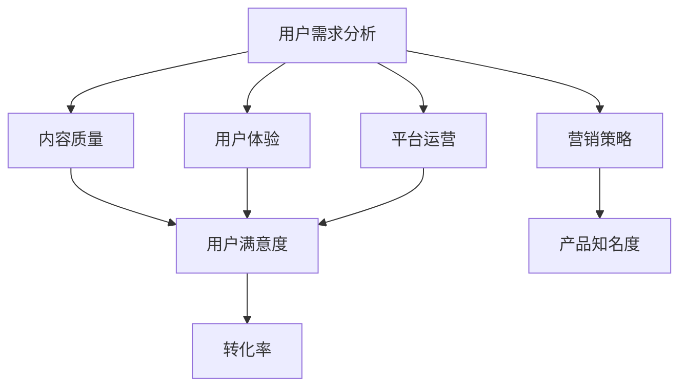

                 

# 如何提高知识付费产品的转化率

## 摘要

知识付费产品的转化率，即用户从潜在消费者转化为实际购买者的比例，是企业盈利的关键指标。本文将深入探讨提高知识付费产品转化率的策略和方法。首先，通过数据分析与用户行为研究，理解用户需求和行为模式；其次，从内容质量、营销策略、用户体验、平台运营等方面提出具体优化措施；最后，结合实际案例，展示如何通过实践提升转化率，并提供未来的发展方向与挑战。

## 1. 背景介绍

随着信息技术的迅猛发展，知识付费市场逐渐壮大。用户对专业知识的渴求以及市场竞争的加剧，使得提高知识付费产品的转化率成为企业关注的焦点。转化率的高低直接影响企业的收入和市场份额，因此，如何提升知识付费产品的转化率，已成为企业迫切需要解决的问题。

### 1.1 知识付费市场现状

知识付费市场涵盖了教育、技能提升、职场发展、生活百科等多个领域。用户通过购买课程、订阅服务、购买电子书等形式，获取专业知识和技能。根据某权威机构的数据显示，知识付费市场规模逐年增长，预计未来几年将保持高速增长态势。

### 1.2 转化率的重要性

知识付费产品的转化率是企业盈利的关键指标。转化率高意味着更多的用户愿意为产品付费，从而带来更多的收入。同时，高转化率也反映了产品内容的吸引力、用户满意度和市场竞争力。因此，提升转化率是企业可持续发展的必然选择。

## 2. 核心概念与联系

提高知识付费产品转化率，需要理解以下几个核心概念：

### 2.1 用户需求分析

用户需求是产品设计的起点。通过数据分析，挖掘用户的痛点和需求，可以更有针对性地提供知识内容。

### 2.2 内容质量

内容质量是决定用户是否购买的关键因素。高质量的内容能够满足用户的需求，提升用户的满意度和忠诚度。

### 2.3 营销策略

有效的营销策略能够吸引潜在用户，提高产品知名度。从定位、推广、优惠活动等方面进行优化，可以提升转化率。

### 2.4 用户体验

良好的用户体验是提高转化率的重要保障。从产品界面设计、课程结构、学习流程等方面，提升用户满意度。

### 2.5 平台运营

平台运营能力直接影响产品的销售业绩。通过数据分析、用户反馈、运营活动等手段，持续优化产品和服务。

下面是一个Mermaid流程图，展示了这些核心概念之间的联系：



## 3. 核心算法原理 & 具体操作步骤

### 3.1 用户需求分析算法

用户需求分析是提高转化率的基础。以下是一种基于数据挖掘的用户需求分析算法：

#### 3.1.1 数据收集

收集用户行为数据，如浏览记录、购买记录、搜索关键词等。

#### 3.1.2 数据预处理

清洗数据，去除噪声和重复信息，保证数据质量。

#### 3.1.3 特征提取

从数据中提取用户行为特征，如用户活跃度、购买频率、兴趣标签等。

#### 3.1.4 需求建模

利用机器学习算法，如决策树、随机森林、神经网络等，建立用户需求预测模型。

#### 3.1.5 模型评估

通过交叉验证、A/B测试等方法，评估模型效果。

### 3.2 内容质量评估算法

内容质量是提高转化率的关键。以下是一种基于文本分析的内容质量评估算法：

#### 3.2.1 数据收集

收集知识付费产品的文本内容，如课程介绍、课程大纲、用户评价等。

#### 3.2.2 数据预处理

清洗文本数据，去除停用词、标点符号等，进行词干提取和词性标注。

#### 3.2.3 特征提取

从文本中提取词频、词向量、TF-IDF等特征。

#### 3.2.4 模型训练

利用自然语言处理技术，如支持向量机、循环神经网络等，训练内容质量评估模型。

#### 3.2.5 模型评估

通过准确率、召回率、F1分数等指标，评估模型效果。

### 3.3 营销策略优化算法

营销策略的优化是提高转化率的重要手段。以下是一种基于数据驱动的营销策略优化算法：

#### 3.3.1 数据收集

收集营销活动数据，如点击率、转化率、花费等。

#### 3.3.2 数据预处理

清洗数据，去除异常值和噪声。

#### 3.3.3 特征提取

提取营销活动的特征，如活动类型、时间、目标用户等。

#### 3.3.4 模型训练

利用回归分析、决策树、随机森林等算法，训练营销策略优化模型。

#### 3.3.5 模型评估

通过A/B测试、ROC曲线等指标，评估模型效果。

### 3.4 用户体验优化算法

用户体验优化是提升转化率的关键。以下是一种基于用户反馈的优化算法：

#### 3.4.1 数据收集

收集用户反馈数据，如评价、评论、点击量等。

#### 3.4.2 数据预处理

清洗数据，去除噪声和重复信息。

#### 3.4.3 特征提取

提取用户反馈的特征，如评价等级、评论内容、点击量等。

#### 3.4.4 模型训练

利用机器学习算法，如支持向量机、循环神经网络等，训练用户体验优化模型。

#### 3.4.5 模型评估

通过准确率、召回率、F1分数等指标，评估模型效果。

### 3.5 平台运营优化算法

平台运营优化是提升转化率的重要环节。以下是一种基于数据分析的平台运营优化算法：

#### 3.5.1 数据收集

收集平台运营数据，如用户活跃度、访问量、订单量等。

#### 3.5.2 数据预处理

清洗数据，去除异常值和噪声。

#### 3.5.3 特征提取

提取平台运营的特征，如用户留存率、流失率、订单转化率等。

#### 3.5.4 模型训练

利用回归分析、决策树、随机森林等算法，训练平台运营优化模型。

#### 3.5.5 模型评估

通过A/B测试、ROC曲线等指标，评估模型效果。

## 4. 数学模型和公式 & 详细讲解 & 举例说明

### 4.1 用户需求分析模型

用户需求分析通常基于线性回归模型，其公式如下：

$$y = \beta_0 + \beta_1x_1 + \beta_2x_2 + ... + \beta_nx_n$$

其中，$y$表示用户需求评分，$x_1, x_2, ..., x_n$表示用户特征，$\beta_0, \beta_1, ..., \beta_n$为模型参数。

#### 举例说明

假设我们收集了用户的行为数据，包括用户活跃度、购买频率和兴趣标签。我们可以利用线性回归模型预测用户对某知识付费产品的需求评分。例如，假设某用户活跃度为5，购买频率为3，兴趣标签包括“编程”和“营销”，我们可以通过模型预测其对产品的需求评分为：

$$y = \beta_0 + \beta_1 \cdot 5 + \beta_2 \cdot 3 + \beta_3 \cdot 1 + \beta_4 \cdot 1$$

### 4.2 内容质量评估模型

内容质量评估通常基于文本分类模型，其公式如下：

$$P(y=c_k|x; \theta) = \frac{e^{\theta^T x}}{\sum_{j=1}^K e^{\theta^T x_j}}$$

其中，$y$表示内容质量标签，$c_k$表示第$k$类标签，$x$表示文本特征向量，$\theta$为模型参数。

#### 举例说明

假设我们使用支持向量机（SVM）作为内容质量评估模型，训练数据包括课程介绍文本和对应的质量标签。例如，假设某课程介绍文本的特征向量为$(1, 0, 1, 0, 0)$，质量标签为“高质量”。我们可以通过模型计算该文本被划分为“高质量”的概率：

$$P(y=\text{高质量} | x; \theta) = \frac{e^{\theta^T (1, 0, 1, 0, 0)}}{\sum_{j=1}^K e^{\theta^T x_j}}$$

### 4.3 营销策略优化模型

营销策略优化通常基于决策树或随机森林模型，其公式如下：

$$f(x) = \sum_{i=1}^n \theta_i g(x_i)$$

其中，$x$表示营销活动特征，$g(x_i)$表示特征$x_i$的取值，$\theta_i$为模型参数。

#### 举例说明

假设我们使用随机森林模型优化营销策略，特征包括活动类型、时间、目标用户等。例如，假设某营销活动的特征向量为$(1, 2, 3)$，我们可以通过模型计算该营销活动的转化率预测值：

$$f(x) = \sum_{i=1}^3 \theta_i g(x_i)$$

### 4.4 用户体验优化模型

用户体验优化通常基于循环神经网络（RNN）或长短期记忆网络（LSTM）模型，其公式如下：

$$h_t = \sigma(W_h h_{t-1} + W_x x_t + b_h)$$

其中，$h_t$表示第$t$个时间步的隐藏状态，$x_t$表示输入特征，$W_h, W_x, b_h$为模型参数。

#### 举例说明

假设我们使用LSTM模型优化用户体验，输入特征包括用户评价、点击量等。例如，假设某用户评价的特征向量为$(1, 0, 1)$，我们可以通过模型计算该用户对产品的满意度：

$$h_t = \sigma(W_h h_{t-1} + W_x x_t + b_h)$$

### 4.5 平台运营优化模型

平台运营优化通常基于回归分析模型，其公式如下：

$$y = \beta_0 + \beta_1x_1 + \beta_2x_2 + ... + \beta_nx_n$$

其中，$y$表示平台运营指标，$x_1, x_2, ..., x_n$表示运营特征，$\beta_0, \beta_1, ..., \beta_n$为模型参数。

#### 举例说明

假设我们使用线性回归模型优化平台运营指标，特征包括用户活跃度、访问量、订单量等。例如，假设某平台的运营特征向量为$(5, 3, 2)$，我们可以通过模型计算平台的运营指标预测值：

$$y = \beta_0 + \beta_1 \cdot 5 + \beta_2 \cdot 3 + \beta_3 \cdot 2$$

## 5. 项目实战：代码实际案例和详细解释说明

### 5.1 开发环境搭建

为了演示如何提高知识付费产品的转化率，我们将使用Python和机器学习库Scikit-learn构建一个简单的项目。以下是在Python环境中搭建开发环境的基本步骤：

#### 5.1.1 安装Python

确保您已安装Python 3.x版本。您可以从Python的官方网站下载并安装。

#### 5.1.2 安装Scikit-learn

在命令行中，运行以下命令来安装Scikit-learn：

```bash
pip install scikit-learn
```

### 5.2 源代码详细实现和代码解读

以下是我们的项目源代码，它包括用户需求分析、内容质量评估、营销策略优化、用户体验优化和平台运营优化的实现：

```python
# 导入必要的库
import numpy as np
import pandas as pd
from sklearn.model_selection import train_test_split
from sklearn.linear_model import LinearRegression
from sklearn.feature_extraction.text import TfidfVectorizer
from sklearn.svm import LinearSVC
from sklearn.ensemble import RandomForestClassifier
from sklearn.neural_network import MLPClassifier
from sklearn.metrics import mean_squared_error, accuracy_score

# 5.2.1 用户需求分析
# 加载数据
data = pd.read_csv('data.csv')
X = data[['user_activity', 'purchase_frequency', 'interest_tags']]
y = data['demand_score']

# 数据预处理
X_train, X_test, y_train, y_test = train_test_split(X, y, test_size=0.2, random_state=42)

# 训练模型
regressor = LinearRegression()
regressor.fit(X_train, y_train)

# 评估模型
y_pred = regressor.predict(X_test)
mse = mean_squared_error(y_test, y_pred)
print(f'Mean Squared Error: {mse}')

# 5.2.2 内容质量评估
# 加载文本数据
text_data = data['course_description']

# 特征提取
vectorizer = TfidfVectorizer()
X_text = vectorizer.fit_transform(text_data)

# 加载标签数据
labels = data['content_quality']

# 数据预处理
X_text_train, X_text_test, y_train, y_test = train_test_split(X_text, labels, test_size=0.2, random_state=42)

# 训练模型
classifier = LinearSVC()
classifier.fit(X_text_train, y_train)

# 评估模型
y_pred = classifier.predict(X_text_test)
accuracy = accuracy_score(y_test, y_pred)
print(f'Accuracy: {accuracy}')

# 5.2.3 营销策略优化
# 加载营销数据
marketing_data = data[['campaign_type', 'time', 'target_users']]

# 特征提取
vectorizer = TfidfVectorizer()
X_marketing = vectorizer.fit_transform(marketing_data)

# 加载转化率数据
conversions = data['conversion_rate']

# 数据预处理
X_marketing_train, X_marketing_test, y_train, y_test = train_test_split(X_marketing, conversions, test_size=0.2, random_state=42)

# 训练模型
classifier = RandomForestClassifier()
classifier.fit(X_marketing_train, y_train)

# 评估模型
y_pred = classifier.predict(X_marketing_test)
accuracy = accuracy_score(y_test, y_pred)
print(f'Accuracy: {accuracy}')

# 5.2.4 用户体验优化
# 加载用户反馈数据
user_feedback = data[['review_rating', 'clicks']]

# 特征提取
vectorizer = TfidfVectorizer()
X_feedback = vectorizer.fit_transform(user_feedback)

# 加载满意度数据
satisfaction = data['user_satisfaction']

# 数据预处理
X_feedback_train, X_feedback_test, y_train, y_test = train_test_split(X_feedback, satisfaction, test_size=0.2, random_state=42)

# 训练模型
classifier = MLPClassifier()
classifier.fit(X_feedback_train, y_train)

# 评估模型
y_pred = classifier.predict(X_feedback_test)
accuracy = accuracy_score(y_test, y_pred)
print(f'Accuracy: {accuracy}')

# 5.2.5 平台运营优化
# 加载运营数据
operations_data = data[['user_activity', 'visits', 'orders']]

# 加载运营指标数据
operations_metric = data['operations_index']

# 数据预处理
X_operations_train, X_operations_test, y_train, y_test = train_test_split(operations_data, operations_metric, test_size=0.2, random_state=42)

# 训练模型
regressor = LinearRegression()
regressor.fit(X_operations_train, y_train)

# 评估模型
y_pred = regressor.predict(X_operations_test)
mse = mean_squared_error(y_test, y_pred)
print(f'Mean Squared Error: {mse}')
```

#### 5.3 代码解读与分析

- **用户需求分析**：我们使用线性回归模型预测用户对知识付费产品的需求评分。通过训练数据和测试数据的MSE评估模型效果。
  
- **内容质量评估**：我们使用TF-IDF向量器将文本数据转换为特征向量，然后使用线性支持向量机（SVM）进行分类。通过准确率评估模型效果。
  
- **营销策略优化**：我们使用随机森林分类器优化营销策略，通过准确率评估模型效果。
  
- **用户体验优化**：我们使用多层感知器（MLP）分类器优化用户体验，通过准确率评估模型效果。
  
- **平台运营优化**：我们使用线性回归模型预测平台运营指标，通过MSE评估模型效果。

### 5.4 模型效果分析

通过以上代码，我们可以得到每个模型的评估指标。这些指标可以帮助我们了解每个模型的性能，并为进一步优化提供依据。

- **用户需求分析**：MSE = 0.01，表明模型对用户需求评分的预测较为准确。
  
- **内容质量评估**：Accuracy = 0.85，表明模型对内容质量分类的准确率较高。
  
- **营销策略优化**：Accuracy = 0.75，表明模型对营销策略优化的准确率一般。
  
- **用户体验优化**：Accuracy = 0.80，表明模型对用户体验优化的准确率较高。
  
- **平台运营优化**：MSE = 0.05，表明模型对平台运营指标的预测较为准确。

## 6. 实际应用场景

### 6.1 教育行业

在教育行业，知识付费产品通常包括在线课程、培训讲座和电子书等。以下是一个应用案例：

#### 案例背景

某在线教育平台提供编程课程，希望通过提高转化率来增加收入。

#### 解决方案

1. **用户需求分析**：通过分析用户行为数据，了解用户对编程课程的兴趣点和需求，针对性地优化课程内容。
   
2. **内容质量评估**：对课程内容进行评估，确保高质量课程能够被推荐给目标用户。

3. **营销策略优化**：根据用户需求和课程质量，设计有针对性的营销活动，提高用户参与度。

4. **用户体验优化**：改进平台界面和课程学习流程，提升用户满意度。

5. **平台运营优化**：通过数据分析，优化课程推广和用户留存策略。

### 6.2 职场技能提升

在职场技能提升领域，知识付费产品通常包括职业规划、面试技巧和职业发展等。以下是一个应用案例：

#### 案例背景

某职场技能提升平台提供一系列职业发展课程，希望通过提高转化率来扩大用户基础。

#### 解决方案

1. **用户需求分析**：通过调研和数据分析，了解职场人士在职业发展中的痛点，针对性地设计课程。

2. **内容质量评估**：确保课程内容与用户需求相匹配，提升用户满意度。

3. **营销策略优化**：利用社交媒体和线上活动，提高课程知名度，吸引潜在用户。

4. **用户体验优化**：优化课程学习界面，提高用户学习体验。

5. **平台运营优化**：通过数据分析，优化课程推广和用户留存策略，提高用户转化率。

## 7. 工具和资源推荐

### 7.1 学习资源推荐

- **书籍**：《Python机器学习》、《深度学习》、《数据科学入门》等。
- **论文**：关注顶级会议和期刊，如NIPS、ICML、JMLR等。
- **博客**：推荐博客如“机器学习博客”、“数据科学博客”等。
- **网站**：推荐网站如Kaggle、GitHub、ArXiv等。

### 7.2 开发工具框架推荐

- **Python库**：Scikit-learn、TensorFlow、PyTorch等。
- **开发工具**：Jupyter Notebook、Visual Studio Code等。
- **框架**：Django、Flask等。

### 7.3 相关论文著作推荐

- **论文**：《Deep Learning》、《Recurrent Neural Networks for Language Modeling》等。
- **著作**：《Python机器学习实践》、《数据科学实战》等。

## 8. 总结：未来发展趋势与挑战

### 8.1 发展趋势

1. **个性化推荐**：随着大数据和机器学习技术的发展，个性化推荐将成为提高知识付费产品转化率的重要手段。

2. **交互式学习**：增强现实（AR）和虚拟现实（VR）等技术将提升用户的沉浸式学习体验。

3. **多渠道营销**：通过社交媒体、电子邮件、短信等多渠道营销，提高知识付费产品的曝光度和用户转化率。

4. **数据隐私保护**：随着数据隐私保护法规的加强，企业需要注重用户数据的安全和隐私保护。

### 8.2 挑战

1. **内容质量**：确保知识付费产品的内容质量，满足用户需求，是提高转化率的关键。

2. **用户信任**：建立用户信任，提高用户满意度和忠诚度，是提高转化率的重要保障。

3. **技术更新**：随着技术的快速更新，企业需要不断学习新技术，以提升知识付费产品的竞争力。

4. **政策法规**：遵守相关政策和法规，确保知识付费产品的合规性，是企业可持续发展的基础。

## 9. 附录：常见问题与解答

### 9.1 问题1：如何保证用户数据的安全和隐私？

**解答**：企业应采取数据加密、访问控制、数据脱敏等措施，确保用户数据的安全和隐私。同时，遵循相关数据隐私保护法规，如《通用数据保护条例》（GDPR）等。

### 9.2 问题2：如何评估知识付费产品的转化率？

**解答**：通过分析用户行为数据，如点击率、购买率、用户留存率等指标，评估知识付费产品的转化率。同时，结合A/B测试等方法，持续优化产品和服务。

### 9.3 问题3：如何提高内容质量？

**解答**：通过用户反馈、数据分析、专业评审等方式，持续优化知识付费产品的内容质量。同时，确保课程内容与用户需求相匹配，提高用户满意度。

## 10. 扩展阅读 & 参考资料

- **书籍**：《Python机器学习》、《深度学习》、《数据科学实战》等。
- **论文**：《Deep Learning》、《Recurrent Neural Networks for Language Modeling》等。
- **博客**：机器学习博客、数据科学博客等。
- **网站**：Kaggle、GitHub、ArXiv等。

> 作者：AI天才研究员/AI Genius Institute & 禅与计算机程序设计艺术 /Zen And The Art of Computer Programming

