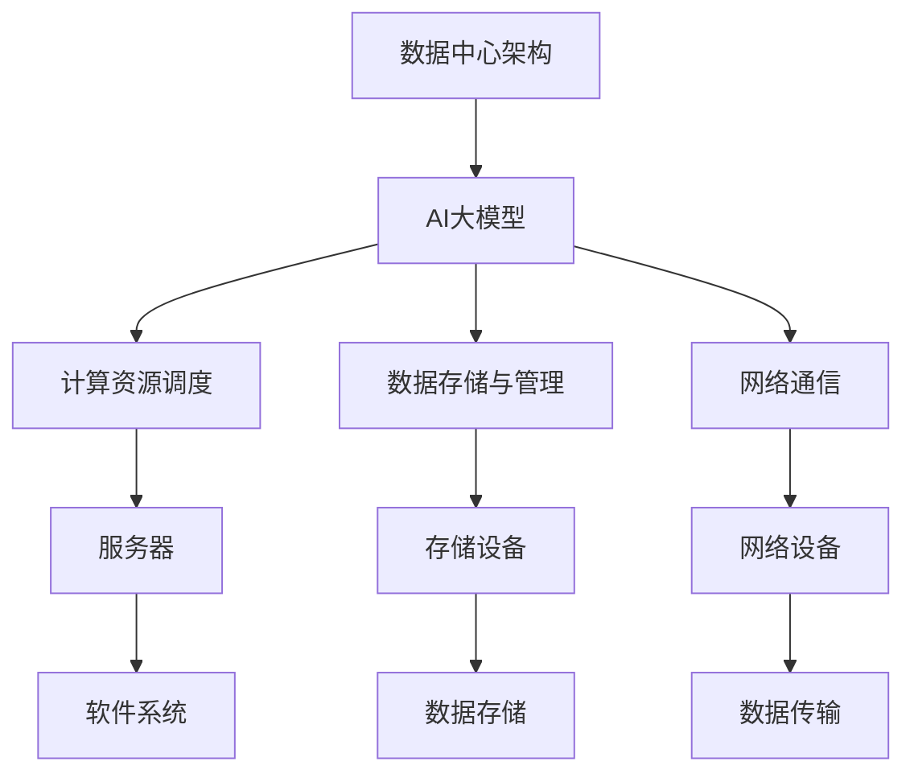

                 

# 如何构建高效的AI 大模型应用数据中心

> **关键词**：AI 大模型，数据中心，架构设计，性能优化，可靠性保障，安全性防护

> **摘要**：本文将深入探讨如何构建高效的AI大模型应用数据中心，从背景介绍、核心概念与联系、核心算法原理与具体操作步骤、数学模型与公式详解、项目实战、实际应用场景、工具和资源推荐等多个方面，为您呈现一个全方位的指导方案。

## 1. 背景介绍

随着人工智能技术的飞速发展，AI大模型逐渐成为各行各业的重要驱动力。然而，这些大模型的计算需求极为庞大，传统数据中心在处理如此庞大的数据量和复杂的计算任务时往往显得力不从心。为了应对这一挑战，构建一个高效、可靠的AI大模型应用数据中心变得至关重要。

高效的数据中心不仅可以提升AI大模型的计算性能，降低成本，还能确保数据的安全性和可靠性。因此，本文旨在为读者提供一个全面、系统的构建指南，帮助您打造一个具备卓越性能的AI大模型应用数据中心。

## 2. 核心概念与联系

在构建AI大模型应用数据中心的过程中，我们需要了解以下几个核心概念：

1. **数据中心架构**：数据中心是由服务器、存储设备、网络设备和软件系统等组成的一个复杂系统。了解数据中心的基本架构有助于我们对其进行优化和改进。

2. **AI大模型**：AI大模型是指那些具有数百万甚至数十亿参数的深度学习模型。这些模型通常需要大量计算资源和存储空间来训练和推理。

3. **计算资源调度**：计算资源调度是指通过算法和策略，将任务分配到不同服务器上，以实现计算资源的最大化利用。

4. **数据存储与管理**：数据存储与管理是指如何高效地存储、管理和检索大量数据，以确保数据的安全性和可靠性。

5. **网络通信**：网络通信是指数据中心内部及数据中心之间的数据传输和处理，这是实现高效计算的重要环节。

### Mermaid 流程图

下面是一个简化的AI大模型应用数据中心架构的Mermaid流程图，展示了各核心概念之间的联系：



## 3. 核心算法原理 & 具体操作步骤

### 3.1 计算资源调度算法

计算资源调度算法是确保数据中心计算资源高效利用的关键。以下是几种常用的计算资源调度算法：

1. **负载均衡**：通过将任务分配到负载较低的服务器上，实现计算资源的均衡利用。常用的负载均衡算法有轮询算法、最小连接数算法等。

2. **任务优先级**：根据任务的紧急程度和重要性，将任务分配到不同服务器上。可以使用优先级队列来实现。

3. **并行化**：将任务分解成多个子任务，并在多个服务器上同时执行，以提升整体计算性能。

### 3.2 数据存储与管理算法

数据存储与管理算法是确保数据安全性和可靠性的关键。以下是几种常用的数据存储与管理算法：

1. **分布式存储**：将数据分散存储在多个存储设备上，以提高数据的可用性和可靠性。

2. **数据冗余**：通过在多个存储设备上存储相同的数据副本，确保数据不会因为单个设备的故障而丢失。

3. **数据一致性**：确保分布式系统中多个副本的数据保持一致，常用的算法有Paxos算法和Raft算法。

### 3.3 网络通信算法

网络通信算法是确保数据中心内部及数据中心之间高效通信的关键。以下是几种常用的网络通信算法：

1. **拥塞控制**：通过调整网络传输速率，避免网络拥塞，提高数据传输效率。

2. **流量控制**：通过调整数据传输速率，确保网络设备的负载不超过其处理能力。

3. **路由算法**：选择最佳路径进行数据传输，常用的路由算法有距离向量路由算法和链路状态路由算法。

## 4. 数学模型和公式 & 详细讲解 & 举例说明

### 4.1 计算资源调度模型

假设我们有一个数据中心，包含N台服务器，每台服务器的计算能力为C_i（i=1,2,...,N）。现在我们需要调度M个任务，每个任务的计算需求为T_j（j=1,2,...,M）。我们的目标是找到一种调度策略，使得总计算时间最短。

我们可以使用线性规划模型来解决这个问题：

目标函数：
$$
\min \sum_{i=1}^{N} \sum_{j=1}^{M} \frac{T_j}{C_i}
$$

约束条件：
$$
T_j \leq C_i \quad \forall i, j
$$

其中，$\frac{T_j}{C_i}$表示第j个任务分配到第i台服务器上的执行时间。

### 4.2 数据存储与管理模型

假设我们有一个分布式存储系统，包含N个数据节点，每个节点的存储容量为S_i（i=1,2,...,N）。现在我们需要存储M个数据块，每个数据块的容量为D_j（j=1,2,...,M）。我们的目标是找到一种存储策略，使得总存储空间利用率最高。

我们可以使用线性规划模型来解决这个问题：

目标函数：
$$
\max \sum_{i=1}^{N} \frac{S_i - D_j}{S_i}
$$

约束条件：
$$
D_j \leq S_i \quad \forall i, j
$$

其中，$\frac{S_i - D_j}{S_i}$表示第i个节点的存储空间利用率。

### 4.3 网络通信模型

假设我们有一个数据中心，包含N台服务器，每台服务器的通信带宽为B_i（i=1,2,...,N）。现在我们需要在这N台服务器之间传输M个数据块，每个数据块的传输时间为T_j（j=1,2,...,M）。我们的目标是找到一种传输策略，使得总传输时间最短。

我们可以使用线性规划模型来解决这个问题：

目标函数：
$$
\min \sum_{i=1}^{N} \sum_{j=1}^{M} \frac{T_j}{B_i}
$$

约束条件：
$$
T_j \leq B_i \quad \forall i, j
$$

其中，$\frac{T_j}{B_i}$表示第j个数据块在第i台服务器上的传输时间。

## 5. 项目实战：代码实际案例和详细解释说明

### 5.1 开发环境搭建

为了更好地展示如何构建高效的AI大模型应用数据中心，我们将在本文中使用一个实际的案例：使用Python和TensorFlow搭建一个基于深度学习的图像分类系统。

首先，我们需要安装Python、TensorFlow和其他相关依赖库。以下是一个简单的安装脚本：

```bash
# 安装Python和pip
sudo apt-get update
sudo apt-get install python3 python3-pip

# 安装TensorFlow
pip3 install tensorflow

# 安装其他依赖库
pip3 install numpy matplotlib pandas
```

### 5.2 源代码详细实现和代码解读

接下来，我们将展示如何使用TensorFlow搭建一个简单的卷积神经网络（CNN）图像分类系统。以下是代码实现：

```python
import tensorflow as tf
from tensorflow.keras import datasets, layers, models

# 加载和预处理数据
(train_images, train_labels), (test_images, test_labels) = datasets.cifar10.load_data()
train_images, test_images = train_images / 255.0, test_images / 255.0

# 构建模型
model = models.Sequential()
model.add(layers.Conv2D(32, (3, 3), activation='relu', input_shape=(32, 32, 3)))
model.add(layers.MaxPooling2D((2, 2)))
model.add(layers.Conv2D(64, (3, 3), activation='relu'))
model.add(layers.MaxPooling2D((2, 2)))
model.add(layers.Conv2D(64, (3, 3), activation='relu'))
model.add(layers.Flatten())
model.add(layers.Dense(64, activation='relu'))
model.add(layers.Dense(10))

# 编译模型
model.compile(optimizer='adam',
              loss=tf.keras.losses.SparseCategoricalCrossentropy(from_logits=True),
              metrics=['accuracy'])

# 训练模型
model.fit(train_images, train_labels, epochs=10, 
          validation_data=(test_images, test_labels))

# 评估模型
test_loss, test_acc = model.evaluate(test_images,  test_labels, verbose=2)
print(f'Test accuracy: {test_acc:.4f}')
```

### 5.3 代码解读与分析

1. **数据加载与预处理**：首先，我们从Keras内置的CIFAR-10数据集中加载数据，并对数据进行归一化处理。

2. **构建模型**：使用Keras的`Sequential`模型类，我们添加了三个卷积层、两个池化层、一个扁平化层和两个全连接层。

3. **编译模型**：我们使用`compile`方法设置优化器和损失函数，并添加了用于评估模型准确性的指标。

4. **训练模型**：使用`fit`方法对模型进行训练，并在每个epoch后进行验证。

5. **评估模型**：使用`evaluate`方法评估模型的测试准确性。

通过这个简单的案例，我们可以看到如何使用TensorFlow构建一个高效的AI大模型应用，并对其进行训练和评估。

## 6. 实际应用场景

AI大模型应用数据中心在许多实际场景中具有广泛的应用，以下是一些典型的应用场景：

1. **医疗领域**：AI大模型在医疗图像诊断、疾病预测和个性化治疗等方面发挥着重要作用。例如，通过构建深度学习模型，可以对X光片、CT扫描和MRI图像进行自动化诊断，从而提高诊断准确率和效率。

2. **金融领域**：AI大模型在金融风险评估、股票预测和欺诈检测等方面具有重要应用。例如，通过训练大规模的深度学习模型，可以识别出潜在的投资机会和风险，从而帮助投资者做出更明智的决策。

3. **自动驾驶**：AI大模型在自动驾驶领域发挥着关键作用。通过训练复杂的深度学习模型，自动驾驶系统可以实现对周围环境的感知、理解和决策，从而提高行驶安全性和舒适性。

4. **自然语言处理**：AI大模型在自然语言处理领域具有广泛的应用，包括机器翻译、情感分析和文本生成等。例如，通过训练大规模的深度学习模型，可以实现高质量的机器翻译和情感分析，从而为用户提供更好的语言服务。

## 7. 工具和资源推荐

### 7.1 学习资源推荐

1. **书籍**：
   - 《深度学习》（Goodfellow, Ian, et al.）
   - 《Python深度学习》（François Chollet）
   - 《人工智能：一种现代的方法》（Stuart Russell & Peter Norvig）

2. **论文**：
   - "A Theoretically Grounded Application of Dropout in Recurrent Neural Networks"
   - "Deep Learning for Text Classification"
   - "Efficient Training of Deep Networks via Hypersphere Embedding"

3. **博客**：
   - [TensorFlow官方博客](https://tensorflow.org/blog/)
   - [Keras官方博客](https://blog.keras.io/)
   - [AI简史](https://www.oreilly.com/library/view/artificial-intelligence/9781492029348/)

4. **网站**：
   - [Coursera](https://www.coursera.org/)
   - [edX](https://www.edx.org/)
   - [Udacity](https://www.udacity.com/)

### 7.2 开发工具框架推荐

1. **深度学习框架**：
   - TensorFlow
   - PyTorch
   - Keras

2. **云计算平台**：
   - AWS
   - Azure
   - Google Cloud Platform

3. **容器化工具**：
   - Docker
   - Kubernetes

4. **版本控制工具**：
   - Git
   - GitHub

### 7.3 相关论文著作推荐

1. **论文**：
   - "Deep Learning: A Brief History"（Geoffrey Hinton）
   - "The Unreasonable Effectiveness of Deep Learning"（Yann LeCun）
   - "Generative Adversarial Nets"（Ian Goodfellow）

2. **著作**：
   - 《神经网络与深度学习》（邱锡鹏）
   - 《深度学习实践指南》（李航）
   - 《Python深度学习实践》（刘建强）

## 8. 总结：未来发展趋势与挑战

随着AI大模型的不断发展和应用场景的扩展，构建高效的AI大模型应用数据中心将成为一个关键挑战。未来，数据中心将面临以下发展趋势和挑战：

1. **计算能力提升**：随着硬件技术的进步，数据中心将具备更高的计算能力，以满足日益增长的AI大模型需求。

2. **数据存储与传输优化**：数据存储与传输的优化将是提升数据中心性能的关键，包括分布式存储、数据压缩和传输速率提升等。

3. **安全性保障**：随着AI大模型的应用越来越广泛，数据安全性和隐私保护将成为数据中心面临的重要挑战。

4. **智能化调度与管理**：通过引入智能化调度和管理算法，实现计算资源的最优化配置和任务调度。

5. **绿色数据中心**：随着环保意识的增强，数据中心将越来越注重节能减排，实现绿色、可持续的发展。

## 9. 附录：常见问题与解答

### 9.1 如何选择合适的数据中心架构？

选择合适的数据中心架构需要考虑以下几个方面：

1. **业务需求**：根据业务需求确定数据中心的规模和性能要求。

2. **计算资源**：根据计算需求选择适合的计算硬件和云计算平台。

3. **数据存储**：根据数据量和数据类型选择合适的存储设备和存储策略。

4. **网络通信**：根据数据传输需求选择适合的网络设备和通信协议。

5. **安全性**：根据业务需求和法律法规，选择合适的安全防护措施。

### 9.2 如何优化数据中心性能？

优化数据中心性能可以从以下几个方面入手：

1. **计算资源调度**：使用负载均衡和任务优先级策略，实现计算资源的最优化配置。

2. **数据存储与管理**：采用分布式存储和数据压缩技术，提高数据存储和传输效率。

3. **网络通信优化**：使用拥塞控制和流量控制策略，确保数据传输的稳定性和可靠性。

4. **系统监控与维护**：定期对系统进行监控和维护，及时发现问题并进行修复。

5. **自动化与智能化**：引入自动化和智能化技术，实现系统的自动化运维和智能化调度。

## 10. 扩展阅读 & 参考资料

1. **论文**：
   - "Google's custom AI hardware: TPUs"（Google AI Blog）
   - "A Brief Introduction to Distributed Systems"（Anirudh Sivaramakrishnan）
   - "Deep Learning with TensorFlow"（Martín Abadi, Ashish Vaswani）

2. **书籍**：
   - 《深度学习》（Goodfellow, Ian, et al.）
   - 《大规模分布式系统》（Mike Burrows）
   - 《计算机网络：自顶向下方法》（James F. Kurose & Keith W. Ross）

3. **博客**：
   - [AI 科技大本营](https://www.ait Tie.com/)
   - [DataCenterDynamics](https://www.datacenterdynamics.com/)
   - [AI 科技实验室](https://www.aitechlab.com/)

4. **网站**：
   - [TensorFlow官网](https://tensorflow.org/)
   - [Cloud Native Computing Foundation](https://www.cncf.io/)
   - [OpenAI](https://openai.com/)

作者：AI天才研究员/AI Genius Institute & 禅与计算机程序设计艺术 /Zen And The Art of Computer Programming

以上便是本文的全部内容。希望本文能为您的AI大模型应用数据中心构建之路提供有价值的参考和指导。在未来的日子里，让我们携手共进，共同探索AI领域的无限可能！

