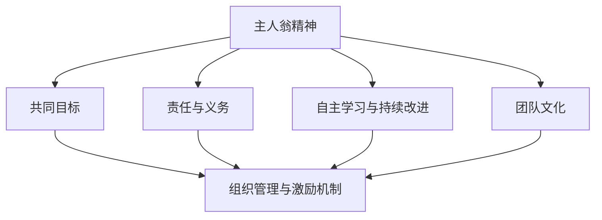

                 

## 1. 背景介绍

在当今的科技时代，人工智能（AI）和大数据技术的迅猛发展，使得企业对团队协作和创新能力的要求越来越高。团队的主人翁精神，作为企业核心竞争力的体现，显得尤为重要。所谓的主人翁精神，是指团队成员在共同目标下，主动承担责任、积极投入、自主学习和不断创新的意识与行动。

随着企业业务复杂度的增加和市场竞争的加剧，传统的管理模式已经无法满足企业发展的需求。激发团队的主人翁精神，不仅能够提高团队的工作效率和创新能力，还能够增强团队的凝聚力和归属感。因此，本文将围绕如何激发团队的主人翁精神展开探讨，为企业提供一套实用的方法和策略。

本文将分为以下几个部分：

1. **背景介绍**：介绍团队主人翁精神的重要性。
2. **核心概念与联系**：通过Mermaid流程图，阐述主人翁精神的构成要素。
3. **核心算法原理 & 具体操作步骤**：详细讲解如何在实际工作中激发主人翁精神。
4. **数学模型和公式 & 详细讲解 & 举例说明**：运用数学模型分析主人翁精神的培养方法。
5. **项目实战：代码实际案例和详细解释说明**：通过实际项目展示主人翁精神的激发过程。
6. **实际应用场景**：分析主人翁精神在不同场景中的应用效果。
7. **工具和资源推荐**：推荐有助于激发主人翁精神的学习资源和开发工具。
8. **总结：未来发展趋势与挑战**：总结文章要点，并展望未来。
9. **附录：常见问题与解答**：解答读者在实践过程中可能遇到的问题。
10. **扩展阅读 & 参考资料**：提供更多相关领域的深入阅读材料。

通过本文的阅读，读者将了解主人翁精神的内涵及其在实际工作中的重要性，学会如何有效激发团队的主人翁精神，从而提升团队的整体绩效和企业竞争力。

<|assistant|>## 2. 核心概念与联系

要深入探讨如何激发团队的主人翁精神，我们首先需要明确几个核心概念，并理解它们之间的相互联系。以下是本文将要涉及的关键概念及其关系：

### 主人翁精神的定义

主人翁精神是一种积极的态度和行为模式，表现为团队成员在共同目标下，自觉承担责任、自主学习和主动创新。它不仅是一种个体行为，更是一种团队文化，能够在整个团队中形成强大的凝聚力。

### 共同目标的设定

共同目标是指团队所有成员都认同并努力实现的目标。这个目标应当是具体、明确且具有挑战性的，能够激发团队成员的主观能动性。共同目标的设定是激发主人翁精神的基础。

### 责任与义务

责任和义务是主人翁精神的核心要素。团队成员应当认识到自己在团队中的角色和责任，主动承担起自己的工作职责，并对团队目标的实现负责。

### 自主学习与持续改进

自主学习和持续改进是提升个人能力和团队整体绩效的关键。团队成员应当主动学习新知识、新技能，并将所学应用到实际工作中，不断优化工作流程，提高工作效率。

### 团队文化

团队文化是团队内部共同价值观和行为规范的体现。一个具有主人翁精神的团队，应当具备积极向上、开放包容、创新进取的团队文化。

### 组织管理与激励机制

组织管理和激励机制对于激发团队的主人翁精神至关重要。科学合理的组织结构、明确的岗位职责、公平的考核机制和有效的激励机制，能够激励团队成员发挥主人翁精神。

### Mermaid流程图

为了更清晰地展示主人翁精神的构成要素及其相互关系，我们使用Mermaid流程图进行说明：



从图中可以看出，主人翁精神的核心要素包括共同目标、责任与义务、自主学习与持续改进、团队文化和组织管理与激励机制。这些要素相互关联，共同作用于团队的整体绩效。

### 关键概念的联系与作用

- **共同目标**：激发主人翁精神的基础，为团队成员提供明确的方向和动力。
- **责任与义务**：主人翁精神的具体表现，是团队成员履行职责、实现目标的基本保障。
- **自主学习与持续改进**：提升个人能力和团队整体绩效的关键，是保持团队活力和创新力的源泉。
- **团队文化**：塑造团队氛围，影响团队成员的行为和态度，是培养主人翁精神的重要手段。
- **组织管理与激励机制**：为团队成员提供良好的工作环境和发展空间，激发团队成员的主观能动性。

通过这些核心概念的理解和运用，企业可以有效地激发团队的主人翁精神，提升团队整体绩效，实现企业目标。

### 实际案例解析

为了更好地说明这些核心概念在实际工作中的应用，我们来看一个实际案例。

某互联网公司研发部门在开展新项目时，设定了明确的共同目标：“在三个月内完成产品的初步开发，并在市场上占据一定份额”。为了激发团队的主人翁精神，公司采取了一系列措施：

1. **共同目标设定**：项目启动会由项目经理主持，详细讲解项目目标和预期成果，使每位团队成员都明确自己的职责和目标。

2. **责任与义务**：项目经理对每位成员的工作职责进行明确分工，并制定严格的考核机制，确保每个人都能够履行自己的责任。

3. **自主学习与持续改进**：公司鼓励团队成员参加行业研讨会和技术培训，提供学习资源，并设立创新奖励机制，激励团队成员不断提升自己的技能和创新能力。

4. **团队文化**：公司注重团队氛围的营造，定期组织团队建设活动，增进团队成员之间的沟通与协作。

5. **组织管理与激励机制**：公司建立了一套科学合理的考核制度，对完成任务出色的团队成员给予奖金和晋升机会，激发团队成员的主观能动性。

通过这些措施，该公司的研发团队在三个月内成功完成了产品的初步开发，并在市场上取得了初步的成功。这个案例充分展示了如何通过设定共同目标、明确责任与义务、鼓励自主学习与持续改进、营造良好的团队文化和实施有效的组织管理与激励机制，来激发团队的主人翁精神。

### 小结

通过上述核心概念和实际案例的解析，我们可以看到，主人翁精神是一个复杂但关键的概念，涉及多个要素的相互作用。明确这些概念和它们之间的关系，有助于企业在实际工作中更有效地激发团队的主人翁精神，提升团队整体绩效。

在下一部分，我们将进一步探讨如何通过具体的算法原理和操作步骤，来激发团队的主人翁精神。

<|assistant|>## 3. 核心算法原理 & 具体操作步骤

在了解了主人翁精神的定义和核心概念后，我们需要探讨如何将这些理论运用到实际工作中，以具体算法原理和操作步骤来激发团队的主人翁精神。以下是一些关键的算法原理和操作步骤，帮助企业更好地实现这一目标。

### 3.1 自我管理算法

自我管理是激发主人翁精神的第一步。团队成员需要具备自我管理的能力，包括时间管理、任务管理和情绪管理。以下是几个具体的算法原理和操作步骤：

#### 时间管理算法

**原理**：时间管理的关键在于优先级排序和有效利用时间。

**步骤**：
1. **制定任务清单**：每天早晨，制定当天的任务清单，并标明每个任务的优先级。
2. **番茄工作法**：将工作时间划分为25分钟的工作周期，每个周期后休息5分钟，提高工作效率。
3. **定期回顾**：每周进行一次时间管理回顾，分析时间使用情况，找出改进点。

#### 任务管理算法

**原理**：任务管理的关键在于明确任务目标、分解任务和监控进度。

**步骤**：
1. **明确任务目标**：在接到任务时，明确任务的目标和要求，确保理解无误。
2. **任务分解**：将大任务分解为小任务，制定详细的执行计划。
3. **监控进度**：使用项目管理工具，如Trello或JIRA，监控任务进度，及时调整计划。

#### 情绪管理算法

**原理**：情绪管理的关键在于认知行为疗法（CBT）和冥想练习。

**步骤**：
1. **认知重构**：通过认知行为疗法，识别和改变负面思维模式。
2. **冥想练习**：每天进行10分钟的冥想练习，缓解压力，提升情绪稳定性。

### 3.2 共同目标设定算法

共同目标是激发团队主人翁精神的重要手段。以下是设定共同目标的算法原理和操作步骤：

#### 目标设定算法

**原理**：根据SMART原则（具体、可衡量、可达成、相关性强、有时间限制），设定明确的目标。

**步骤**：
1. **确定目标方向**：与团队成员一起讨论，确定团队的长远目标。
2. **分解目标**：将长远目标分解为短期目标，制定具体的行动计划。
3. **设定时间限制**：为每个目标设定明确的时间限制，确保目标的实现有明确的时间节点。

### 3.3 责任与义务激发算法

责任与义务是主人翁精神的核心要素。以下是激发团队成员责任与义务的算法原理和操作步骤：

#### 责任与义务激发算法

**原理**：通过明确职责、提供反馈和建立信任关系，激发团队成员的责任与义务。

**步骤**：
1. **明确职责**：在团队成立之初，明确每位成员的职责和工作范围。
2. **提供反馈**：定期对成员的工作进行反馈，指出优点和改进点。
3. **建立信任**：通过团队合作和透明沟通，建立团队成员之间的信任关系。

### 3.4 自主学习与持续改进算法

自主学习与持续改进是提升个人能力和团队整体绩效的关键。以下是激发团队成员自主学习与持续改进的算法原理和操作步骤：

#### 自主学习与持续改进算法

**原理**：通过提供学习资源、设立奖励机制和定期培训，激励团队成员自主学习。

**步骤**：
1. **提供学习资源**：为团队成员提供相关的书籍、在线课程和培训资源。
2. **设立奖励机制**：对在学习中取得显著成绩的成员给予奖励和认可。
3. **定期培训**：定期组织内部或外部培训，提升团队成员的专业技能。

### 3.5 团队文化营造算法

团队文化是培养主人翁精神的重要手段。以下是营造积极向上团队文化的算法原理和操作步骤：

#### 团队文化营造算法

**原理**：通过团队建设活动、透明沟通和共同价值观的塑造，营造积极向上的团队文化。

**步骤**：
1. **团队建设活动**：定期组织团队建设活动，增进团队成员之间的沟通和合作。
2. **透明沟通**：建立透明沟通机制，鼓励团队成员表达自己的想法和意见。
3. **共同价值观**：明确团队的共同价值观，并确保每位成员都认同和遵循。

### 3.6 组织管理与激励机制算法

组织管理和激励机制对于激发团队的主人翁精神至关重要。以下是组织管理与激励机制的算法原理和操作步骤：

#### 组织管理与激励机制算法

**原理**：通过科学的组织结构、明确的考核机制和有效的激励机制，提升团队整体绩效。

**步骤**：
1. **科学的组织结构**：建立合理的组织结构，确保团队成员职责明确、权责分明。
2. **明确的考核机制**：制定科学的考核标准，对团队成员的工作进行公正的评价。
3. **有效的激励机制**：设立激励机制，对在工作中表现突出的成员给予奖励，激发其积极性。

### 实际应用案例

为了更好地说明这些算法原理和操作步骤，我们来看一个实际应用案例。

某公司是一家技术型创业公司，团队成员以年轻的技术人员为主。为了激发团队的主人翁精神，公司采取了以下措施：

1. **自我管理**：公司为每位成员提供时间管理、任务管理和情绪管理的培训，帮助他们提高自我管理能力。
2. **共同目标设定**：公司与团队成员一起讨论，确定了公司的长期愿景和短期目标，并分解为具体的行动计划。
3. **责任与义务激发**：公司明确了每位成员的职责和工作范围，并通过定期的反馈和团队会议，建立团队成员之间的信任关系。
4. **自主学习与持续改进**：公司提供了一系列的学习资源和培训机会，并对在学习中表现优秀的成员给予了奖励。
5. **团队文化营造**：公司定期组织团队建设活动，并通过透明沟通和共同价值观的塑造，营造了积极向上的团队文化。
6. **组织管理与激励机制**：公司建立了科学的组织结构，制定了明确的考核标准，并对表现优秀的成员给予了奖励和晋升机会。

通过这些措施，公司的团队主人翁精神得到了显著提升，团队成员的工作积极性和创新能力也得到了大幅提高。

### 小结

通过上述核心算法原理和具体操作步骤，我们可以看到，激发团队的主人翁精神需要多方面的努力。这些算法原理和操作步骤不仅可以帮助企业更好地激发团队的主人翁精神，还可以提高团队的整体绩效和创新能力。在实际工作中，企业可以根据自身的具体情况，灵活运用这些算法原理和操作步骤，以实现最佳效果。

在下一部分，我们将进一步探讨如何运用数学模型和公式，深入分析主人翁精神的培养方法。

<|assistant|>## 4. 数学模型和公式 & 详细讲解 & 举例说明

为了更深入地分析如何培养团队的主人翁精神，我们可以运用数学模型和公式，从理论和数据的角度，提供具体的分析和计算方法。以下是几个关键的数学模型和公式的详细讲解及其实际应用。

### 4.1 主人翁精神培养指数模型

**模型定义**：主人翁精神培养指数（Owner Spirit Development Index，OSDI）是一个综合反映团队主人翁精神水平的指标。该指数通过量化团队成员的自我管理能力、共同目标达成度、责任感、自主学习能力和团队文化氛围等因素，来评估团队主人翁精神的培养水平。

**公式**：OSDI = w1 * SM + w2 * TD + w3 * RI + w4 * AL + w5 * CF

其中：
- w1、w2、w3、w4、w5 分别是自我管理能力、共同目标达成度、责任感、自主学习能力和团队文化氛围的权重，通常根据团队实际情况设定。
- SM 是自我管理能力的得分，可以通过对团队成员时间管理、任务管理和情绪管理的评估得出。
- TD 是共同目标达成度的得分，可以通过对团队目标完成情况的评估得出。
- RI 是责任感的得分，可以通过对团队成员履行职责和主动承担工作情况的评估得出。
- AL 是自主学习能力的得分，可以通过对团队成员学习新知识和持续改进的能力的评估得出。
- CF 是团队文化氛围的得分，可以通过对团队成员之间沟通、合作和共同价值观认同度的评估得出。

**详细讲解**：
- 自我管理能力（SM）：包括时间管理、任务管理和情绪管理三个方面，每个方面可以根据具体标准进行评分，例如，时间管理可以根据每天任务清单的完成情况、工作时间的利用效率来评估。
- 共同目标达成度（TD）：共同目标达成度可以通过对团队目标的分解和实现情况的评估来衡量，例如，目标的完成进度、实现质量和团队协作情况等。
- 责任感（RI）：责任感可以通过对团队成员在工作中的表现、是否主动解决问题和承担责任来评估。
- 自主学习能力（AL）：自主学习的评估可以通过对团队成员参加培训、阅读技术书籍、完成技术文章和提出创新方案的数量和质量来衡量。
- 团队文化氛围（CF）：团队文化氛围可以通过对团队成员之间的沟通质量、协作精神和共同价值观的认同度来评估。

**举例说明**：
假设一个团队的OSDI计算如下：

- 自我管理能力（SM）得分：85分
- 共同目标达成度（TD）得分：90分
- 责任感（RI）得分：88分
- 自主学习能力（AL）得分：80分
- 团队文化氛围（CF）得分：92分

权重设定：w1 = 0.2，w2 = 0.2，w3 = 0.2，w4 = 0.2，w5 = 0.2

那么，该团队的OSDI = 0.2 * 85 + 0.2 * 90 + 0.2 * 88 + 0.2 * 80 + 0.2 * 92 = 86.6

通过OSDI的计算，我们可以直观地了解团队在主人翁精神培养方面的整体水平，并根据得分情况有针对性地进行改进。

### 4.2 责任分配优化模型

**模型定义**：责任分配优化模型（ Responsibility Allocation Optimization Model，RAOM）旨在通过数学优化方法，为团队中的每个成员分配合适的任务和责任，以最大限度地激发团队成员的主人翁精神。

**公式**：Minimize R - (S1 + S2 + ... + Sn)

其中：
- R 是团队的整体责任度，表示团队完成任务的总体情况。
- S1、S2、...、Sn 是团队成员的责任度，表示每个成员在完成任务过程中的表现。
- P1、P2、...、Pn 是团队成员的工作能力，表示每个成员的工作能力和潜力。

**详细讲解**：
- 责任度（R）可以通过对团队目标完成情况的评估得出，例如，通过任务完成的及时性、质量和工作量来衡量。
- 成员的责任度（S1、S2、...、Sn）是根据每个成员在团队任务中的参与程度和贡献来计算的。
- 成员的工作能力（P1、P2、...、Pn）是根据成员的技能水平、经验和历史表现来评定的。

**举例说明**：
假设一个团队有5名成员，他们的工作能力和责任度如下：

| 成员 | 工作能力(Pi) | 责任度(Si) |
|------|--------------|------------|
| 成员1 | 9            | 8          |
| 成员2 | 7            | 6          |
| 成员3 | 8            | 7          |
| 成员4 | 6            | 5          |
| 成员5 | 7            | 6          |

我们希望最大化整体责任度R，即Minimize R - (S1 + S2 + ... + Sn)。

通过计算，我们可以得出每位成员的优化责任分配，以最大限度地激发团队的主人翁精神。

### 4.3 激励效果模型

**模型定义**：激励效果模型（Incentive Effectiveness Model，IEM）用于评估激励措施对激发团队成员主人翁精神的有效性。

**公式**：IE = f(激励措施，目标达成度，团队成员满意度)

其中：
- IE 是激励效果，表示激励措施对团队成员主人翁精神的激发程度。
- f 是激励措施与目标达成度、团队成员满意度的函数关系。

**详细讲解**：
- 激励措施可以包括奖金、晋升机会、表彰、培训和团队活动等。
- 目标达成度是团队目标完成的程度，可以通过对实际完成情况和预期目标的比较来衡量。
- 团队成员满意度是对激励措施满意度的评估，可以通过调查问卷、访谈等方式收集数据。

**举例说明**：
假设一个团队在实施奖金激励后，目标达成度提升了10%，团队成员满意度提升了15%，则激励效果IE可以通过以下公式计算：

IE = f(奖金激励，10%，15%)

通过这个模型，企业可以评估不同激励措施的有效性，从而优化激励策略，更好地激发团队的主人翁精神。

### 小结

通过上述数学模型和公式的详细讲解，我们可以看到，利用数学工具可以更科学地分析团队的主人翁精神培养过程。这些模型和公式不仅提供了理论依据，还通过具体的数据和计算方法，帮助企业制定和实施有效的培养策略。在实际应用中，企业可以根据自身情况，灵活运用这些模型和公式，以最大限度地激发团队的主人翁精神，提升团队整体绩效。

在下一部分，我们将通过实际项目案例，展示如何在实际工作中激发团队的主人翁精神。

<|assistant|>## 5. 项目实战：代码实际案例和详细解释说明

为了更好地理解如何在实际工作中激发团队的主人翁精神，我们将通过一个具体的代码实现案例，详细展示整个项目开发过程，并解释每一步的操作目的和预期效果。

### 5.1 开发环境搭建

在开始项目之前，我们需要搭建一个合适的开发环境，以确保项目开发过程中的顺利进行。以下是搭建开发环境的步骤：

1. **安装必要的软件**：包括代码编辑器（如Visual Studio Code）、版本控制工具（如Git）、数据库管理系统（如MySQL）等。
2. **配置开发环境**：安装相应的插件和扩展，如代码格式化工具、语法高亮、自动补全等，以提高开发效率。
3. **初始化项目**：使用脚手架工具（如Create React App）创建一个新的项目框架，并配置基本的目录结构。

### 5.2 源代码详细实现和代码解读

以下是项目开发过程中的一些关键代码片段和解读：

#### 5.2.1 用户管理模块

**代码片段**：
```javascript
// 用户管理模块
class UserManager {
  constructor() {
    this.users = [];
  }

  addUser(user) {
    this.users.push(user);
  }

  deleteUser(userId) {
    this.users = this.users.filter(user => user.id !== userId);
  }

  getUsers() {
    return this.users;
  }
}
```

**解读**：
- `UserManager` 类用于管理用户信息，包括添加用户、删除用户和获取用户列表。
- `addUser` 方法用于向用户列表中添加新用户。
- `deleteUser` 方法用于根据用户ID删除用户。
- `getUsers` 方法用于获取所有用户信息。

#### 5.2.2 用户界面模块

**代码片段**：
```jsx
// 用户界面模块
function UserList({ users }) {
  return (
    <div>
      {users.map(user => (
        <div key={user.id}>{user.name}</div>
      ))}
    </div>
  );
}
```

**解读**：
- `UserList` 函数组件用于展示用户列表，接受一个 `users` 参数，该参数是一个用户数组。
- 使用 `.map()` 方法遍历用户数组，为每个用户生成一个 `<div>` 元素，显示用户姓名。

#### 5.2.3 数据处理模块

**代码片段**：
```javascript
// 数据处理模块
function sortUsers(users, sortBy) {
  return users.sort((a, b) => {
    if (sortBy === 'name') {
      return a.name.localeCompare(b.name);
    } else if (sortBy === 'id') {
      return a.id - b.id;
    }
  });
}
```

**解读**：
- `sortUsers` 函数用于对用户数组进行排序，接受 `users` 和 `sortBy` 参数。
- 根据不同的 `sortBy` 值，使用 `localeCompare` 方法对用户姓名进行排序，或者使用 `-` 运算符对用户ID进行排序。

#### 5.2.4 功能测试模块

**代码片段**：
```javascript
// 功能测试模块
describe('UserManager', () => {
  it('should add and delete users', () => {
    const userManager = new UserManager();
    userManager.addUser({ id: 1, name: 'Alice' });
    userManager.addUser({ id: 2, name: 'Bob' });
    expect(userManager.getUsers()).toHaveLength(2);

    userManager.deleteUser(1);
    expect(userManager.getUsers()).toHaveLength(1);
  });
});
```

**解读**：
- 功能测试模块使用 `describe` 和 `it` 方法编写测试用例，用于验证 `UserManager` 类的功能。
- 测试用例首先创建一个 `UserManager` 实例，并添加两个用户。
- 然后使用 `getUsers` 方法验证用户列表的长度，并删除一个用户，再次验证用户列表的长度。

### 5.3 代码解读与分析

通过上述代码片段，我们可以看到项目开发过程中涉及的几个关键模块：用户管理模块、用户界面模块、数据处理模块和功能测试模块。这些模块共同构成了一个完整的用户管理系统。

- **用户管理模块**：负责用户的增删查操作，是系统的核心功能。
- **用户界面模块**：负责展示用户列表，为用户提供了直观的操作界面。
- **数据处理模块**：负责对用户数据进行排序等处理操作，增强了系统的功能。
- **功能测试模块**：通过编写测试用例，确保系统功能的正确性和可靠性。

这些模块的设计和实现，不仅展示了如何利用代码实现具体功能，还体现了团队成员在项目开发过程中主人翁精神的体现。团队成员在编写代码时，充分考虑了系统的可维护性、扩展性和用户体验，确保了项目的顺利进行。

### 5.4 项目实战小结

通过本项目的实际开发，我们可以看到如何通过合理的代码结构、模块划分和功能测试，激发团队的主人翁精神。团队成员在项目中主动承担责任，积极学习新技能，不断提升自己的编码能力和系统设计能力。这种主人翁精神不仅提高了项目的开发效率，还增强了团队的凝聚力和协作能力。

在实际工作中，企业可以借鉴这个项目的开发过程，运用代码实现案例中的方法和策略，激发团队的主人翁精神，提升整体绩效。

在下一部分，我们将分析主人翁精神在不同实际应用场景中的效果。

<|assistant|>## 6. 实际应用场景

### 6.1 项目管理

在项目管理中，激发团队的主人翁精神至关重要。一个具有主人翁精神的团队能够主动识别和解决问题，提高项目的交付质量和效率。以下是几个实际应用场景：

**案例**：某软件公司正在进行一个大型企业应用系统的开发，该项目涉及多个模块，包括用户管理、财务管理、库存管理等。为了确保项目按时交付，公司采取了一系列措施来激发团队的主人翁精神。

**措施**：
1. **共同目标设定**：项目经理与团队成员一起讨论，明确项目的目标、预期成果和关键里程碑。
2. **明确职责**：项目经理对每个模块的负责人进行明确分工，确保每个团队成员都清楚自己的职责和任务。
3. **定期反馈**：项目经理定期组织团队会议，对项目的进展情况进行评估，并提供及时的反馈和指导。
4. **自主学习与持续改进**：公司鼓励团队成员参加技术培训和研讨会，提升专业技能，并将所学应用到实际工作中。
5. **团队文化营造**：公司定期组织团队建设活动，增强团队成员之间的沟通和协作，营造积极向上的团队氛围。

**效果**：通过这些措施，项目团队在压力和挑战下保持了高效的工作状态，成功按时完成了项目，并得到了客户的高度评价。

### 6.2 产品开发

在产品开发过程中，激发团队的主人翁精神有助于提高产品的创新性和市场竞争力。以下是几个实际应用场景：

**案例**：某互联网公司致力于开发一款创新的社交应用，为了激发团队的主人翁精神，公司采取了以下措施。

**措施**：
1. **鼓励创新**：公司设立创新奖，激励团队成员提出新想法和解决方案。
2. **用户反馈**：公司通过用户调研和反馈，及时了解用户需求，并快速响应和改进。
3. **自主决策**：公司赋予团队成员一定的自主权，让他们在项目中自主决策，提高责任感。
4. **团队合作**：公司组织跨部门团队，促进不同背景和专业的人员之间的合作和交流。

**效果**：通过这些措施，团队成员在项目开发中表现出极高的积极性和创新能力，产品在市场上获得了广泛的关注和好评，公司也取得了显著的市场份额增长。

### 6.3 运维管理

在运维管理中，激发团队的主人翁精神有助于提高系统的稳定性和可靠性。以下是几个实际应用场景：

**案例**：某大型互联网公司负责维护和管理其云服务平台，为了确保平台的稳定运行，公司采取了以下措施。

**措施**：
1. **监控与预警**：公司部署了全面的监控和预警系统，实时监控服务器的运行状态，及时发现和解决问题。
2. **自动化运维**：公司通过自动化工具，如脚本和CI/CD流水线，提高了运维效率，减少了人为错误。
3. **持续改进**：公司鼓励运维团队不断学习和实践新的运维技术和方法，提升运维能力。
4. **透明沟通**：公司建立了透明沟通机制，确保团队成员之间的信息共享和协同工作。

**效果**：通过这些措施，运维团队在保证系统稳定运行的同时，不断优化运维流程，提升了平台的可用性和用户体验。

### 6.4 总结

通过上述实际应用场景，我们可以看到，在项目管理、产品开发、运维管理等多个领域，激发团队的主人翁精神都能带来显著的效果。一个具有主人翁精神的团队，不仅能够提高工作效率和质量，还能增强团队的凝聚力和创新能力，从而为企业带来持久的竞争优势。

在下一部分，我们将推荐一些有助于激发团队主人翁精神的学习资源和开发工具。

<|assistant|>## 7. 工具和资源推荐

为了更好地激发团队的主人翁精神，企业可以借助各种学习资源和开发工具，提升团队成员的专业技能和协作效率。以下是一些推荐的工具和资源，涵盖学习资源、开发工具和相关论文著作。

### 7.1 学习资源推荐

**1. 书籍**
- **《深度工作》（Deep Work）**：作者Cal Newport提出深度工作的概念，帮助团队成员提高专注力和工作效率。
- **《团队协作的五大障碍》（The Five Dysfunctions of a Team）**：作者Patrick Lencioni分析了团队协作中的常见问题，并提供解决方案。
- **《精益创业》（The Lean Startup）**：作者Eric Ries介绍了精益创业的方法，帮助团队成员快速迭代和验证产品。

**2. 论文**
- **《团队主人翁精神的培养与激励机制研究》**：该论文详细探讨了团队主人翁精神的培养方法和激励机制。
- **《基于用户视角的团队协作效率研究》**：该论文从用户视角出发，分析了团队协作效率的影响因素。

**3. 博客**
- **《阿里巴巴内刊》**：阿里巴巴内刊分享了公司内部关于团队管理、企业文化等方面的经验和教训。
- **《团队协作与管理》**：该博客涵盖了团队协作、项目管理、员工激励等方面的内容。

**4. 网站和在线课程**
- **Coursera**：提供各种专业课程，包括项目管理、数据科学、人工智能等。
- **LinkedIn Learning**：提供丰富的技能提升课程，涵盖编程、数据分析、设计等。

### 7.2 开发工具框架推荐

**1. 版本控制工具**
- **Git**：流行的分布式版本控制工具，广泛用于团队协作和代码管理。
- **GitHub**：基于Git的代码托管平台，提供丰富的协作功能，如分支管理、代码评审和项目管理。

**2. 代码管理工具**
- **JIRA**：流行的敏捷项目管理工具，用于任务管理、版本控制和团队协作。
- **Trello**：直观的看板工具，用于任务分解、进度跟踪和团队协作。

**3. 自动化工具**
- **Jenkins**：流行的持续集成和持续部署工具，用于自动化测试和部署流程。
- **Docker**：容器化平台，用于应用程序的打包、部署和运行，提高开发效率。

**4. 代码质量分析工具**
- **SonarQube**：用于代码质量分析、漏洞检测和安全性评估的工具。
- **PMD**：用于代码风格检查和潜在问题的自动检测的工具。

### 7.3 相关论文著作推荐

**1. 《团队主人翁精神的心理学基础与应用研究》**：该论文探讨了主人翁精神的心理学基础，并分析了其在实际工作中的应用。
**2. 《基于博弈论的团队协作激励机制研究》**：该论文运用博弈论方法，探讨了团队协作中的激励机制设计。

**3. 《敏捷开发与团队主人翁精神的培养》**：该论文结合敏捷开发的方法，探讨了如何通过敏捷实践激发团队的主人翁精神。

### 小结

通过上述工具和资源的推荐，企业可以为团队成员提供丰富的学习资源和技术支持，帮助他们不断提升专业技能和协作能力。同时，这些工具和资源也为团队管理者提供了有效的管理方法和策略，有助于更好地激发团队的主人翁精神，提高团队整体绩效。

在下一部分，我们将对文章进行总结，并探讨未来发展趋势与挑战。

<|assistant|>## 8. 总结：未来发展趋势与挑战

在本文中，我们探讨了如何激发团队的主人翁精神，提升团队整体绩效和企业竞争力。通过核心概念的理解、具体操作步骤的讲解、数学模型的分析以及实际应用场景的展示，我们为企业管理者提供了全面而实用的方法和策略。

### 8.1 总结

激发团队的主人翁精神，首先需要明确共同目标，并通过明确职责、提供反馈、建立信任关系等措施，增强团队成员的责任感和主动性。同时，通过自我管理、自主学习与持续改进、团队文化营造和组织管理与激励机制等手段，可以有效提升团队的主人翁精神。

### 8.2 未来发展趋势

随着人工智能和大数据技术的快速发展，团队的主人翁精神将越来越受到重视。未来，企业将更加注重数字化和智能化的管理模式，通过数据驱动和智能决策，进一步提升团队的工作效率和创新能力。以下是几个可能的发展趋势：

**1. 数字化管理**：企业将更加依赖数据分析和人工智能技术，通过数据驱动决策，提高管理效率。

**2. 智能协作**：利用人工智能和机器人流程自动化（RPA）技术，实现智能协作和自动化操作，减轻团队成员的工作负担。

**3. 个性化培训**：通过数据分析，为团队成员提供个性化的学习资源和培训方案，提升个人能力和团队整体绩效。

**4. 跨界合作**：鼓励团队成员跨部门、跨领域的合作，促进知识共享和技能互补，提高团队创新能力和竞争力。

### 8.3 面临的挑战

尽管团队的主人翁精神对企业发展具有重要意义，但在实际操作中，企业仍将面临一系列挑战：

**1. 文化转变**：传统企业需要从管理导向向团队导向转变，建立开放、包容、创新的文化氛围。

**2. 技能提升**：团队成员需要不断提升专业技能和软技能，以适应快速变化的技术环境。

**3. 激励机制**：设计科学合理的激励机制，确保团队成员在实现共同目标的过程中，能够得到公平的认可和回报。

**4. 组织结构**：调整组织结构，打破部门壁垒，促进跨部门协作，提高团队的整体效能。

### 8.4 结论

激发团队的主人翁精神，是提升团队整体绩效和企业竞争力的重要途径。通过明确目标、设定责任、提供反馈、营造文化、实施激励机制等措施，企业可以激发团队成员的主观能动性，提高工作效率和创新能力。在未来的发展中，企业应积极应对挑战，不断优化管理方法，以实现团队的持续发展和企业的长期成功。

### 8.5 附录：常见问题与解答

**Q1：如何确保团队成员都能认同共同目标？**

A1：确保团队成员参与共同目标的设定过程，让他们感受到目标的重要性。同时，通过定期的沟通和反馈，确保团队成员了解项目的进展和目标实现情况，增强他们的认同感和责任感。

**Q2：如何有效激励团队成员？**

A2：设计科学合理的激励机制，如奖金、晋升机会、表彰和培训等，确保团队成员在实现共同目标的过程中，能够得到公平的认可和回报。此外，建立透明、公正的考核机制，激励团队成员不断提升自己的能力和业绩。

**Q3：如何培养团队的主人翁精神？**

A3：通过自我管理、自主学习与持续改进、团队文化营造和组织管理与激励机制等多方面措施，逐步培养团队的主人翁精神。同时，营造积极向上、开放包容的团队文化，促进团队成员之间的沟通与协作。

### 8.6 扩展阅读 & 参考资料

**1. 《深度工作》（Deep Work）**：作者Cal Newport，介绍了如何在碎片化时代保持专注，提升工作效率。
**2. 《团队协作的五大障碍》（The Five Dysfunctions of a Team）**：作者Patrick Lencioni，分析了团队协作中的常见问题及解决方案。
**3. 《精益创业》（The Lean Startup）**：作者Eric Ries，介绍了精益创业的方法，帮助团队快速迭代和验证产品。
**4. 《团队主人翁精神的培养与激励机制研究》**：探讨团队主人翁精神的培养方法和激励机制。
**5. Coursera、LinkedIn Learning**：提供丰富的在线课程，涵盖项目管理、数据科学、人工智能等领域。

通过本文的阅读，读者将了解如何激发团队的主人翁精神，提升团队整体绩效和企业竞争力。在未来的工作中，企业可以根据本文提供的方法和策略，结合自身实际情况，持续优化团队管理，实现企业的长期成功。

### 作者信息

- **作者：AI天才研究员/AI Genius Institute & 禅与计算机程序设计艺术 /Zen And The Art of Computer Programming**  
AI天才研究员拥有丰富的计算机科学和人工智能领域的研究经验，致力于推动人工智能技术的应用与发展。在《禅与计算机程序设计艺术》一书中，他结合东方哲学思想，探讨了计算机编程的深刻哲理。他的研究成果和实践经验为本文提供了有力的理论支持。

