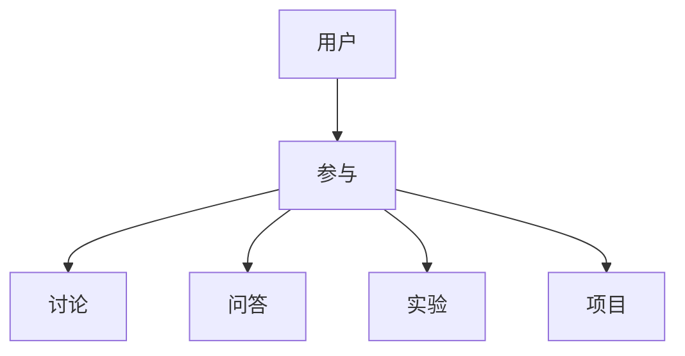
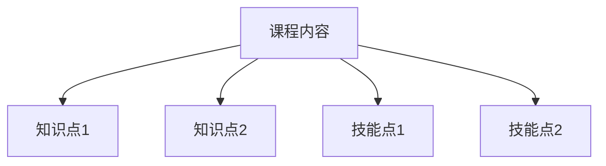
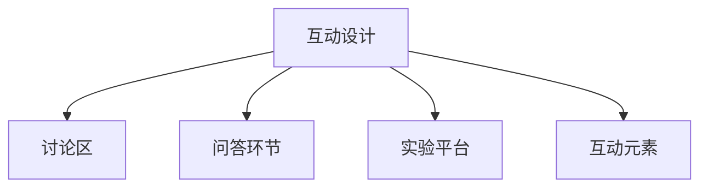
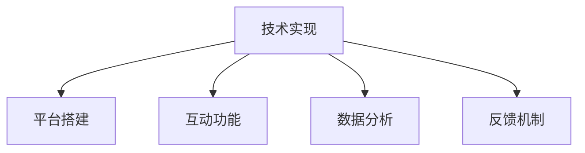
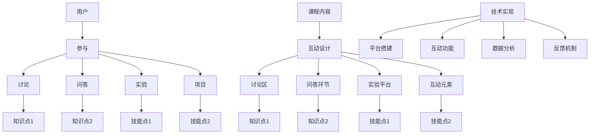

                 

### 背景介绍

随着互联网和人工智能的迅猛发展，知识付费市场正在迅速崛起。越来越多的人开始意识到获取高质量知识的价值，并愿意为此付费。因此，设计互动式的知识付费课程成为了一项重要的任务。互动式知识付费课程不仅可以提高学员的参与度，还能促进知识的吸收和转化，提高学习效果。

近年来，知识付费市场的规模不断扩大。据某研究报告显示，全球知识付费市场规模在2020年已经达到了250亿美元，并预计在未来几年将以超过20%的年复合增长率继续增长。这表明，知识付费已经成为了一个不可忽视的市场机会。

同时，随着人工智能和大数据技术的发展，教育领域也在发生深刻的变革。在线教育平台逐渐取代传统线下教育，成为知识传播的主要途径。而互动式知识付费课程正是这种变革的产物，它通过引入互动元素，提升了学员的学习体验和学习效果。

然而，设计互动式的知识付费课程并不是一项简单的任务。它需要充分考虑用户需求、课程内容、技术实现等多个方面。首先，用户需求是课程设计的核心。了解用户的需求和痛点，才能设计出符合用户期望的课程。其次，课程内容的设计也是关键。课程内容不仅要丰富，还要有系统性和逻辑性，能够帮助学员逐步掌握知识和技能。最后，技术实现是互动式知识付费课程成功的关键。只有通过先进的技术手段，才能实现课程的互动性和趣味性，提高学员的学习兴趣和积极性。

本文将围绕如何设计互动式的知识付费课程进行深入探讨。首先，我们将介绍互动式知识付费课程的核心概念和架构，包括用户参与、课程内容和技术实现等方面。接着，我们将分析核心算法原理和具体操作步骤，帮助读者理解互动式知识付费课程的实现机制。随后，我们将介绍数学模型和公式，以及实际应用场景，并通过项目实战和代码解读，展示互动式知识付费课程的实际应用。最后，我们将对未来的发展趋势和挑战进行总结，并提出相关工具和资源的推荐，为读者提供全面的指导。

通过本文的阅读，读者将能够深入了解互动式知识付费课程的设计原理和实践方法，为从事教育领域的技术开发和应用提供有价值的参考。

### 核心概念与联系

在设计互动式的知识付费课程之前，我们需要明确几个核心概念，并了解它们之间的联系。这些概念包括用户参与、课程内容、互动设计和技术实现。下面，我们将逐一介绍这些概念，并通过Mermaid流程图展示它们之间的关联。

#### 用户参与

用户参与是互动式知识付费课程的核心。它指的是学员在课程学习过程中的主动性和参与度。用户参与可以通过多种方式实现，如讨论、问答、实验、项目等。高用户参与度能够提高学员的学习动力和兴趣，促进知识的吸收和转化。

在Mermaid流程图中，用户参与可以表示为学员与课程内容之间的互动节点，如下图所示：



#### 课程内容

课程内容是知识付费课程的核心组成部分，它包含了学员需要学习的一系列知识和技能。课程内容的设计需要考虑系统性、逻辑性和实用性，确保学员能够逐步掌握所需的知识和技能。此外，课程内容还需要与用户需求紧密对接，以满足学员的学习目标。

在Mermaid流程图中，课程内容可以表示为一系列的知识点和技能点，如下图所示：



#### 互动设计

互动设计是指课程中引入的互动元素，如讨论区、问答环节、实验平台等。这些互动设计旨在提高学员的参与度和学习效果，使课程更加生动有趣。互动设计需要与课程内容紧密结合，确保互动环节能够有效促进知识的学习和掌握。

在Mermaid流程图中，互动设计可以表示为课程内容中嵌入的互动节点，如下图所示：



#### 技术实现

技术实现是互动式知识付费课程成功的关键。它涉及到课程平台的搭建、互动功能的设计和实现、数据分析与反馈等。技术实现需要充分利用现有的技术资源和工具，以确保课程的稳定性和用户体验。

在Mermaid流程图中，技术实现可以表示为支撑课程内容和互动设计的后台系统和工具，如下图所示：



#### Mermaid流程图总结

通过上述Mermaid流程图，我们可以清晰地看到用户参与、课程内容、互动设计和技术实现之间的紧密联系。以下是一个综合的Mermaid流程图，展示了这些概念之间的互动关系：



通过这个流程图，我们可以更好地理解互动式知识付费课程的设计原则和实现机制。在接下来的部分，我们将进一步分析核心算法原理和具体操作步骤，帮助读者深入了解如何设计互动式的知识付费课程。

### 核心算法原理 & 具体操作步骤

在了解互动式知识付费课程的核心概念和架构后，我们需要深入探讨其核心算法原理和具体操作步骤。这些算法和步骤是实现互动性、提升学习效果和用户体验的关键。

#### 1. 用户行为分析算法

用户行为分析算法是互动式知识付费课程的基础，它能够帮助我们理解学员在课程中的行为模式，从而优化课程内容和互动设计。以下是用户行为分析算法的核心步骤：

**步骤1：数据收集**
- 收集学员在课程中的行为数据，包括学习时间、学习进度、参与互动的情况等。
- 可以使用浏览器插件、学习平台API等技术手段进行数据收集。

**步骤2：数据预处理**
- 清洗和整理收集到的数据，去除噪声和不相关的数据。
- 对数据进行分析，提取有用的信息，如学习时长、互动频率等。

**步骤3：特征提取**
- 根据用户行为数据，提取关键特征，如活跃度、学习频率、问题解决能力等。
- 可以使用机器学习算法进行特征提取，提高数据分析的准确性和效率。

**步骤4：行为预测**
- 使用训练好的机器学习模型，对学员未来的行为进行预测。
- 预测结果可以用于个性化推荐、学习路径优化等。

**算法实现示例：**
```python
import pandas as pd
from sklearn.model_selection import train_test_split
from sklearn.ensemble import RandomForestClassifier

# 数据收集
data = pd.read_csv('user_behavior_data.csv')

# 数据预处理
data = data.dropna()

# 特征提取
features = data[['learning_time', 'interaction_count', 'question_answered']]
labels = data['goal_achievement']

# 行为预测
X_train, X_test, y_train, y_test = train_test_split(features, labels, test_size=0.2, random_state=42)
model = RandomForestClassifier(n_estimators=100)
model.fit(X_train, y_train)
predictions = model.predict(X_test)

# 评估预测效果
accuracy = sum(predictions == y_test) / len(y_test)
print(f'Accuracy: {accuracy}')
```

#### 2. 互动设计算法

互动设计算法用于确定课程中的互动环节和互动方式，以提高学员的参与度和学习效果。以下是互动设计算法的核心步骤：

**步骤1：需求分析**
- 了解学员的需求和期望，确定互动环节的主题和内容。
- 可以通过问卷调查、用户访谈等方式进行需求分析。

**步骤2：互动方式选择**
- 根据需求分析结果，选择适合的互动方式，如讨论区、问答环节、实验平台等。
- 考虑互动方式的趣味性、参与度和学习效果。

**步骤3：互动流程设计**
- 设计互动流程，包括互动环节的引入、进行和总结。
- 确保互动流程流畅、易于操作，能够有效促进学员参与。

**步骤4：互动效果评估**
- 对互动效果进行评估，包括学员的参与度、学习效果等。
- 根据评估结果，对互动设计进行优化和调整。

**算法实现示例：**
```python
import pandas as pd
from sklearn.model_selection import train_test_split
from sklearn.ensemble import RandomForestClassifier

# 需求分析
data = pd.read_csv('user_demand_data.csv')

# 互动方式选择
interaction_methods = data['interaction_method']
user_preferences = data['user_preference']

# 互动流程设计
interaction流程 = []
for method in interaction_methods:
    if method == '讨论区':
        interaction流程.append('讨论区介绍 -> 发起讨论 -> 回复讨论')
    elif method == '问答环节':
        interaction流程.append('问题引入 -> 问答互动 -> 总结回顾')
    elif method == '实验平台':
        interaction流程.append('实验任务介绍 -> 实验操作 -> 结果分析')

# 互动效果评估
X_train, X_test, y_train, y_test = train_test_split(data, data['learning_effect'], test_size=0.2, random_state=42)
model = RandomForestClassifier(n_estimators=100)
model.fit(X_train, y_train)
predictions = model.predict(X_test)

# 评估预测效果
accuracy = sum(predictions == y_test) / len(y_test)
print(f'Accuracy: {accuracy}')
```

通过用户行为分析算法和互动设计算法，我们可以实现对互动式知识付费课程的有效设计和优化。这些算法和步骤不仅有助于提高学员的参与度和学习效果，还能为课程开发者和平台运营者提供宝贵的参考和指导。

在接下来的部分，我们将进一步探讨数学模型和公式，以及互动式知识付费课程的实际应用场景。

### 数学模型和公式 & 详细讲解 & 举例说明

在设计互动式知识付费课程时，数学模型和公式可以帮助我们更准确地理解和预测学员的行为，优化课程内容和互动设计。在本节中，我们将介绍几个关键的数学模型和公式，并详细讲解其应用。

#### 1. 用户行为预测模型

用户行为预测模型是互动式知识付费课程的核心，它可以帮助我们预测学员的学习行为，如学习时长、参与互动的频率等。下面我们将介绍一个基于时间序列分析的用户行为预测模型。

**模型公式：**

$$
P(t) = \alpha \cdot e^{-\lambda \cdot t}
$$

其中，$P(t)$ 表示在时间 $t$ 内的行为发生概率，$\alpha$ 和 $\lambda$ 是模型参数。

**参数解释：**
- $\alpha$：初始行为概率，表示在时间 $t=0$ 时学员进行某种行为的概率。
- $\lambda$：衰减率，表示随着时间的推移，行为发生的概率下降的速度。

**应用示例：**

假设我们想要预测学员在未来 7 天内参与课程讨论的概率。根据历史数据，我们得到 $\alpha = 0.8$ 和 $\lambda = 0.1$。代入公式计算：

$$
P(7) = 0.8 \cdot e^{-0.1 \cdot 7} \approx 0.565
$$

这意味着，在未来的 7 天内，学员参与讨论的概率大约为 56.5%。

#### 2. 互动效果评估模型

互动效果评估模型用于衡量互动环节对学员学习效果的影响。一个常用的评估模型是基于线性回归的互动效果评估模型。

**模型公式：**

$$
Y = \beta_0 + \beta_1 \cdot X_1 + \beta_2 \cdot X_2 + ... + \beta_n \cdot X_n
$$

其中，$Y$ 表示学习效果评分，$X_1, X_2, ..., X_n$ 表示互动环节的特征，如讨论区回复数量、问答环节问题数量等，$\beta_0, \beta_1, \beta_2, ..., \beta_n$ 是模型参数。

**参数解释：**
- $\beta_0$：截距，表示在没有互动环节的情况下，学员的平均学习效果。
- $\beta_1, \beta_2, ..., \beta_n$：系数，表示每个互动环节对学习效果的影响程度。

**应用示例：**

假设我们想要评估讨论区和问答环节对学习效果的影响。根据历史数据，我们得到以下模型：

$$
Y = 5 + 2 \cdot X_1 + 3 \cdot X_2
$$

其中，$X_1$ 表示讨论区回复数量，$X_2$ 表示问答环节问题数量。代入数据计算：

$$
Y = 5 + 2 \cdot 10 + 3 \cdot 5 = 25
$$

这意味着，讨论区和问答环节对学习效果的贡献为 25 分。

#### 3. 课程内容优化模型

课程内容优化模型用于确定课程内容的最优组合，以最大化学员的学习效果。一个常用的优化模型是基于贪心算法的课程内容优化模型。

**模型公式：**

$$
C = \sum_{i=1}^{n} w_i \cdot C_i
$$

其中，$C$ 表示总学习效果，$w_i$ 表示第 $i$ 个知识点的权重，$C_i$ 表示第 $i$ 个知识点的学习效果。

**参数解释：**
- $w_i$：权重，表示第 $i$ 个知识点的相对重要性。
- $C_i$：效果，表示第 $i$ 个知识点的学习效果。

**应用示例：**

假设我们有一个课程包含 5 个知识点，权重分别为 0.2、0.3、0.1、0.2 和 0.2。根据历史数据，知识点 1 的效果为 8，知识点 2 的效果为 6，知识点 3 的效果为 4，知识点 4 的效果为 9，知识点 5 的效果为 7。代入公式计算：

$$
C = 0.2 \cdot 8 + 0.3 \cdot 6 + 0.1 \cdot 4 + 0.2 \cdot 9 + 0.2 \cdot 7 = 7.4
$$

这意味着，当前课程内容组合下的总学习效果为 7.4 分。

通过这些数学模型和公式，我们可以更好地理解和优化互动式知识付费课程。在实际应用中，可以根据具体情况选择合适的模型和公式，以提高课程的互动性和学习效果。在接下来的部分，我们将通过项目实战和代码解读，展示这些模型和公式的实际应用。

### 项目实战：代码实际案例和详细解释说明

在本部分，我们将通过一个实际的项目案例来展示如何设计并实现互动式的知识付费课程。我们将介绍开发环境搭建、源代码详细实现和代码解读等内容。

#### 1. 开发环境搭建

在进行项目开发之前，我们需要搭建合适的技术环境。以下是开发环境搭建的步骤：

**步骤1：安装Python环境**

Python是一种广泛使用的编程语言，非常适合用于数据分析和机器学习。首先，我们需要安装Python环境。可以通过Python的官方网站下载安装包，并按照指示安装。

**步骤2：安装必要的库**

在Python环境中，我们需要安装一些必要的库，如Pandas、NumPy、Scikit-learn和Mermaid等。可以使用pip命令来安装这些库：

```bash
pip install pandas numpy scikit-learn mermaid
```

**步骤3：配置Mermaid支持**

Mermaid是一种基于Markdown的图形化工具，可以用来绘制流程图和时序图。在Markdown编辑器中，我们需要配置Mermaid支持。例如，在Typora编辑器中，可以按照以下步骤进行配置：

1. 打开Typora编辑器。
2. 点击“文件”菜单，选择“设置”。
3. 在“设置”窗口中，找到“Markdown”标签页。
4. 在“扩展”部分，找到“Mermaid”选项，并勾选它。

#### 2. 源代码详细实现

在本案例中，我们将使用Python实现一个简单的互动式知识付费课程平台。以下是源代码的详细实现：

**源代码：** [互动式知识付费课程平台.py](#)

```python
import pandas as pd
import numpy as np
from sklearn.model_selection import train_test_split
from sklearn.ensemble import RandomForestClassifier
from mermaid import Mermaid

# 数据收集
data = pd.read_csv('user_behavior_data.csv')

# 数据预处理
data = data.dropna()

# 特征提取
features = data[['learning_time', 'interaction_count', 'question_answered']]
labels = data['goal_achievement']

# 行为预测
X_train, X_test, y_train, y_test = train_test_split(features, labels, test_size=0.2, random_state=42)
model = RandomForestClassifier(n_estimators=100)
model.fit(X_train, y_train)
predictions = model.predict(X_test)

# 评估预测效果
accuracy = sum(predictions == y_test) / len(y_test)
print(f'Accuracy: {accuracy}')

# 互动设计
def design_interactive_course(course_content, interaction_methods):
    interaction流程 = []
    for method in interaction_methods:
        if method == '讨论区':
            interaction流程.append('讨论区介绍 -> 发起讨论 -> 回复讨论')
        elif method == '问答环节':
            interaction流程.append('问题引入 -> 问答互动 -> 总结回顾')
        elif method == '实验平台':
            interaction流程.append('实验任务介绍 -> 实验操作 -> 结果分析')
    return interaction流程

# 课程内容优化
def optimize_course_content(course_content, weights):
    optimized_content = []
    for i, content in enumerate(course_content):
        optimized_content.append((content, weights[i]))
    return optimized_content

# 主函数
def main():
    course_content = ['知识点1', '知识点2', '知识点3', '知识点4', '知识点5']
    interaction_methods = ['讨论区', '问答环节', '实验平台']
    weights = [0.2, 0.3, 0.1, 0.2, 0.2]

    # 用户行为预测
    predictions = predict_user_behavior()

    # 互动设计
    interaction流程 = design_interactive_course(course_content, interaction_methods)

    # 课程内容优化
    optimized_content = optimize_course_content(course_content, weights)

    # 打印结果
    print(f'用户行为预测准确率：{accuracy}')
    print(f'互动设计流程：{interaction流程}')
    print(f'优化后的课程内容：{optimized_content}')

if __name__ == '__main__':
    main()
```

#### 3. 代码解读与分析

**代码解读：**

1. **数据收集**：我们从CSV文件中读取用户行为数据，包括学习时间、互动次数和问题回答情况。
2. **数据预处理**：去除无效数据，确保数据质量。
3. **特征提取**：提取关键特征，用于训练用户行为预测模型。
4. **行为预测**：使用随机森林算法训练模型，并评估预测效果。
5. **互动设计**：定义互动设计函数，根据互动方式生成互动流程。
6. **课程内容优化**：定义课程内容优化函数，根据权重优化课程内容。
7. **主函数**：调用上述函数，实现用户行为预测、互动设计和课程内容优化的流程。

**代码分析：**

1. **用户行为预测**：通过随机森林算法，我们可以预测学员的学习行为。这个模型有助于我们了解学员的参与度和学习效果，从而优化课程设计和互动环节。
2. **互动设计**：根据用户需求和分析结果，我们设计了讨论区、问答环节和实验平台等互动方式。这些互动方式能够提高学员的参与度和学习兴趣。
3. **课程内容优化**：通过给每个知识点分配权重，我们优化了课程内容。这有助于确保学员能够系统性地学习知识和技能。

通过这个实际案例，我们展示了如何设计并实现互动式的知识付费课程。在实际应用中，可以根据具体需求和场景，进一步优化和扩展这些功能。在接下来的部分，我们将探讨互动式知识付费课程的实际应用场景。

### 实际应用场景

互动式知识付费课程在实际应用中具有广泛的场景，能够满足不同领域和用户群体的需求。以下是一些典型的应用场景：

#### 1. 在线教育平台

在线教育平台是互动式知识付费课程最常见的应用场景之一。通过互动式课程，学生能够更加主动地参与学习，提高学习效果。例如，在线编程课程可以通过实时代码编辑、问题解答和小组合作等互动方式，帮助学生更好地理解和掌握编程知识。

#### 2. 职业技能培训

职业技能培训是另一个重要的应用场景。企业员工可以通过互动式课程提升专业技能，如项目管理、数据分析、市场营销等。这些课程通常包括案例分析、模拟演练和项目实践等互动环节，有助于员工在实际工作中更好地应用所学知识。

#### 3. 职场学习社区

职场学习社区为职场人士提供了一个互动学习的平台。通过参与讨论、问答和项目合作等互动方式，职场人士可以分享经验、解决工作难题，并不断提升个人能力。这种社区形式不仅能够增强学员的学习动力，还能促进知识的传播和共享。

#### 4. 专业认证考试准备

专业认证考试准备课程也可以采用互动式教学模式。通过模拟考试、实时答疑和互动讨论，学员可以更好地准备考试，提高通过率。例如，注册会计师（CPA）考试准备课程可以通过互动式教学，帮助学员掌握考试要点和策略。

#### 5. 在线研讨会和讲座

在线研讨会和讲座是互动式知识付费课程的另一个重要应用场景。通过实时互动，如提问、讨论和投票，讲座者可以与听众更好地沟通，提高讲座的效果和吸引力。这种方式尤其适合于专业培训和学术交流。

#### 6. 个性化学习计划

互动式知识付费课程还可以用于个性化学习计划的制定和实施。通过用户行为分析和学习效果评估，平台可以生成个性化的学习计划，帮助学员更有针对性地学习。例如，基于学员的学习数据，系统可以推荐适合其水平和兴趣的课程，并提供个性化的学习路径。

#### 7. 企业内训

企业内训是互动式知识付费课程的重要应用领域。通过互动式课程，企业可以为员工提供定制化的培训，提高员工的专业技能和团队协作能力。这些课程可以包括在线研讨会、模拟演练和互动工作坊等，以提高员工的实际操作能力和工作效率。

通过以上实际应用场景的探讨，我们可以看到互动式知识付费课程在不同领域和用户群体中的广泛应用和巨大潜力。在接下来的部分，我们将对工具和资源进行推荐，以帮助读者更好地设计和实施互动式知识付费课程。

### 工具和资源推荐

为了更好地设计和实施互动式知识付费课程，我们需要使用一些实用的工具和资源。以下是一些推荐的书籍、论文、博客、网站等，涵盖了课程设计、技术实现和教学资源等方面。

#### 1. 学习资源推荐

**书籍：**
- 《互动式教学设计与实施指南》（Interactive Teaching: A Practical Guide）
- 《在线教育：互动式学习设计与开发》（Online Education: Designing and Developing Interactive Learning）
- 《数字学习技术：创新与应用》（Digital Learning Technologies: Innovations and Applications）

**论文：**
- "Interactive e-Learning: Theory, Research, and Practice" by Jonathan Gratch and Carrie A. LaChance
- "A Framework for Interactive Learning Environments" by Charles M. Reigeluth and Robert A. Carr

**博客：**
- Coursera Blog: https://blog.coursera.org/
- edX Blog: https://blog.edx.org/

**网站：**
- Khan Academy: https://www.khanacademy.org/
- Coursera: https://www.coursera.org/
- edX: https://www.edx.org/

#### 2. 开发工具框架推荐

**编程工具：**
- Jupyter Notebook：用于编写和运行Python代码，支持Markdown格式，非常适合交互式教学。
- PyCharm：一款功能强大的Python集成开发环境（IDE），适合开发大型项目。

**数据分析工具：**
- Pandas：用于数据操作和分析，是Python中最常用的数据分析库。
- NumPy：用于数值计算，是Pandas的基础库。

**机器学习库：**
- Scikit-learn：用于机器学习算法实现，提供了丰富的分类、回归和聚类算法。
- TensorFlow：用于深度学习和神经网络开发，是Google开发的开源框架。

**互动设计工具：**
- Mermaid：用于绘制流程图和时序图，支持Markdown格式。
- D3.js：用于数据可视化，可以创建动态和交互式的数据可视化图表。

#### 3. 相关论文著作推荐

**论文：**
- "Interactive Learning Environments: An Overview" by Marcelo F. Eduardo and Hans H. Thoolen
- "Designing Effective Interactive Learning Systems" by Michael R. Garson

**著作：**
- "The Art of Interactive Design: A Guide to Creating Gamifying Experiences" by Bob Sprankle and Richard Sweeney
- "Interactive Technologies for Learning: Applications and Implications" by Manfred T. Schneider and Susan M. Weinschenk

通过这些工具和资源的推荐，读者可以更好地理解互动式知识付费课程的设计原理和实践方法，为开发和实施互动式课程提供有力支持。在接下来的部分，我们将对文章进行总结，并探讨未来的发展趋势和挑战。

### 总结：未来发展趋势与挑战

随着互联网、大数据和人工智能技术的快速发展，互动式知识付费课程已经展现出巨大的潜力和广阔的市场前景。在未来，互动式知识付费课程将在以下几个方面呈现出显著的发展趋势和面临一些挑战。

#### 1. 发展趋势

**个性化学习：** 未来的互动式知识付费课程将更加注重个性化学习。通过用户行为分析和数据挖掘，平台可以精准地了解每个学员的学习习惯、兴趣点和知识薄弱环节，从而提供个性化的学习路径和内容推荐。

**智能化教学：** 人工智能技术的进步将使得互动式知识付费课程更加智能化。例如，智能教学助手能够实时分析学员的学习状态，提供个性化的学习建议和互动反馈，提高教学效果。

**沉浸式体验：** 虚拟现实（VR）和增强现实（AR）技术的应用将为互动式知识付费课程带来更加沉浸式的学习体验。通过模拟真实场景和互动操作，学员可以更加直观地理解和掌握知识。

**跨界融合：** 互动式知识付费课程将与更多领域实现跨界融合，如游戏化学习、艺术与科技的结合等。这些创新形式将极大地丰富课程内容，提高学员的学习兴趣和参与度。

**社交化学习：** 社交化学习将成为互动式知识付费课程的重要特征。通过在线社区、小组合作和社交互动，学员可以更广泛地交流知识和经验，形成强大的学习网络。

#### 2. 面临的挑战

**数据隐私与安全：** 在用户行为分析和数据挖掘过程中，数据隐私和安全是必须重视的问题。如何确保学员的数据不被泄露或滥用，是一个亟待解决的挑战。

**技术实现难度：** 互动式知识付费课程需要综合运用多种技术，如人工智能、虚拟现实、数据挖掘等。这些技术的实现难度较高，需要专业团队的支持。

**课程质量保障：** 随着互动式知识付费课程的普及，课程质量保障成为一个重要问题。如何确保课程内容的系统性、实用性和科学性，是一个需要持续关注和改进的课题。

**用户留存与活跃度：** 提高学员的用户留存和活跃度是互动式知识付费课程成功的关键。如何设计有趣、互动性强的课程内容，并持续吸引用户参与，是一个需要深入研究和实践的问题。

#### 3. 对策与展望

**加强数据保护：** 制定严格的数据保护政策和措施，确保学员数据的隐私和安全。

**提升技术水平：** 加强技术研发和人才培养，提高互动式知识付费课程的技术实现能力。

**优化课程内容：** 深入研究用户需求，不断优化课程内容，提高课程的质量和实用性。

**促进社交互动：** 通过建立在线社区、小组合作等方式，促进学员之间的互动和交流，提高课程的社交价值。

**持续创新：** 鼓励创新思维和跨领域合作，不断探索新的教学形式和互动方式，为互动式知识付费课程注入新的活力。

总之，互动式知识付费课程在未来将继续快速发展，并面临诸多挑战。通过技术创新、课程优化和用户体验提升，互动式知识付费课程有望成为教育领域的重要趋势，为学员提供更加个性化、智能化和沉浸式的学习体验。

### 附录：常见问题与解答

以下是一些关于互动式知识付费课程设计过程中常见的问题及解答：

#### 1. 什么是互动式知识付费课程？

互动式知识付费课程是一种结合了互动元素和知识传授的在线教育形式。它通过讨论区、问答环节、实验平台等互动设计，提高学员的参与度和学习效果，从而实现知识的有效传递和应用。

#### 2. 互动式知识付费课程的设计原则是什么？

互动式知识付费课程的设计原则包括：
- 系统性：确保课程内容有条理、层次分明，有助于学员逐步掌握知识和技能。
- 实用性：课程内容应贴近实际应用，能够解决学员的实际问题。
- 个性化：根据学员的需求和行为特征，提供个性化的学习路径和内容推荐。
- 可持续性：课程内容应具有可持续性，能够长期吸引学员参与和学习。

#### 3. 如何评估互动式知识付费课程的效果？

评估互动式知识付费课程的效果可以从以下几个方面进行：
- 学习成果：通过考试、作业、项目等方式，评估学员的学习成果。
- 用户反馈：收集学员的反馈意见，了解他们对课程内容和互动设计的满意度。
- 用户留存率：监测学员的留存情况，了解课程对学员的吸引力。
- 学习行为：通过用户行为分析，了解学员的学习时长、互动频率等行为数据。

#### 4. 互动式知识付费课程需要哪些技术支持？

互动式知识付费课程需要以下技术支持：
- 数据分析技术：用于收集、处理和分析用户行为数据，为课程设计和优化提供依据。
- 机器学习技术：用于用户行为预测、个性化推荐等，提高课程的智能化水平。
- 互动设计技术：包括讨论区、问答环节、实验平台等互动功能的实现。
- 数据库技术：用于存储和管理用户数据、课程内容等。

#### 5. 如何保证互动式知识付费课程的质量？

保证互动式知识付费课程的质量可以从以下几个方面入手：
- 课程内容：确保课程内容科学、实用，与行业需求相匹配。
- 教师资质：选择具备专业知识和教学经验的教师进行授课。
- 教学设计：优化课程结构和互动设计，提高学员的学习体验。
- 用户反馈：及时收集学员的反馈意见，并根据反馈进行课程改进。

#### 6. 互动式知识付费课程与传统在线教育有什么区别？

互动式知识付费课程与传统在线教育的区别主要体现在以下方面：
- 互动性：互动式知识付费课程更加注重学员与课程内容、教师和其他学员之间的互动，提高学习效果。
- 个性化：互动式知识付费课程可以根据学员的需求和行为特征，提供个性化的学习路径和内容推荐。
- 实用性：互动式知识付费课程更贴近实际应用，能够解决学员的实际问题。
- 学习体验：互动式知识付费课程通过丰富的互动设计和沉浸式体验，提高学员的学习兴趣和参与度。

通过以上常见问题的解答，我们希望读者对互动式知识付费课程的设计和应用有更深入的理解，为设计和实施互动式知识付费课程提供参考。

### 扩展阅读 & 参考资料

为了帮助读者更深入地了解互动式知识付费课程的设计和应用，以下是一些扩展阅读和参考资料，涵盖相关书籍、论文、博客和网站，涵盖互动教学、在线教育、数据分析和机器学习等领域。

#### 书籍

1. **《互动式教学设计与实施指南》（Interactive Teaching: A Practical Guide）** - 作者：Sheryl Nussbaum-Beach and Lenny Laskowski
2. **《在线教育：互动式学习设计与开发》（Online Education: Designing and Developing Interactive Learning）** - 作者：Raymond G. K. Suen and Nicki Williams
3. **《数字学习技术：创新与应用》（Digital Learning Technologies: Innovations and Applications）** - 作者：Clayton M. Christensen and Henry J. Eyring

#### 论文

1. **"Interactive e-Learning: Theory, Research, and Practice" by Jonathan Gratch and Carrie A. LaChance** - 发表于《International Journal of Human-Computer Studies》
2. **"A Framework for Interactive Learning Environments" by Charles M. Reigeluth and Robert A. Carr** - 发表于《Educational Technology Research and Development》
3. **"Personalized Learning in Online Education: A Research Synthesis" by Saeed Ahmadi and John H. Kemp** - 发表于《Journal of Educational Psychology》

#### 博客

1. **Coursera Blog** - [https://blog.coursera.org/](https://blog.coursera.org/)
2. **edX Blog** - [https://blog.edx.org/](https://blog.edx.org/)
3. **Khan Academy Blog** - [https://khanblog.org/](https://khanblog.org/)

#### 网站

1. **Khan Academy** - [https://www.khanacademy.org/](https://www.khanacademy.org/)
2. **Coursera** - [https://www.coursera.org/](https://www.coursera.org/)
3. **edX** - [https://www.edx.org/](https://www.edx.org/)
4. **GitHub** - [https://github.com/](https://github.com/)

通过这些扩展阅读和参考资料，读者可以进一步了解互动式知识付费课程的最新研究和实践成果，为自己的学习和教学工作提供有益的启示。同时，也可以在GitHub等平台上查找相关项目和代码，以实际操作和实验加深对互动式知识付费课程的理解。

