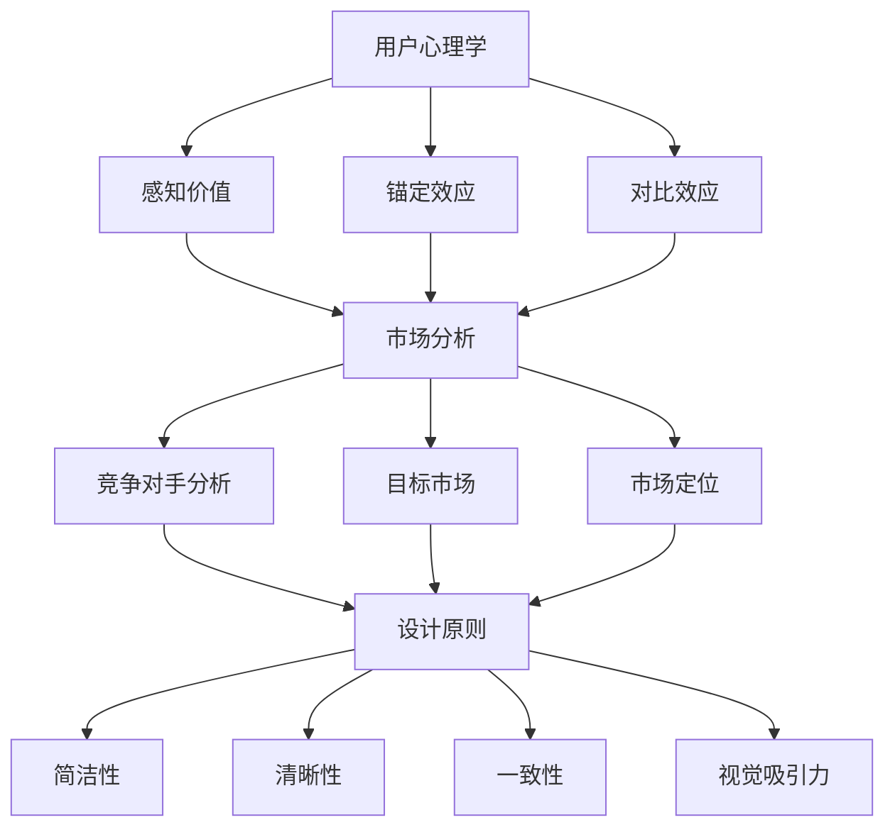

                 

### 背景介绍

在当今竞争激烈的市场环境中，产品定价页的设计已成为企业能否成功吸引和留住客户的关键因素之一。无论是初创企业还是成熟企业，一个精心设计的产品定价页不仅能够传达产品价值，还能有效提升销售转化率。因此，如何设计一个既吸引人又能带来实际效益的产品定价页，成为了众多企业关注的焦点。

本文旨在探讨如何通过系统的方法来设计一个高效的产品定价页。我们将从多个角度进行分析，包括用户心理学、市场分析、设计原则以及实际操作步骤。通过这些步骤，帮助企业更好地理解客户需求，提高产品定价页的吸引力，从而实现更高的销售业绩。

首先，我们需要了解什么是产品定价页以及它在市场营销中的作用。产品定价页通常是客户在购买产品前最后一个决策点，它不仅展示了产品的价格，还提供了产品信息、特点、优势以及购买选项。因此，一个设计合理的产品定价页能够极大地影响客户的购买决策。

接下来，我们将探讨用户心理学在产品定价页设计中的应用。理解用户在浏览定价页时的心理活动，有助于我们设计出更符合用户需求的产品定价页。

此外，市场分析是制定有效定价策略的关键。通过对目标市场的深入研究，企业可以更好地了解客户的需求和竞争对手的定价策略，从而制定出更具竞争力的定价策略。

最后，我们将介绍一些设计原则和实际操作步骤，帮助企业在设计产品定价页时能够兼顾美观和实用性。通过这些原则和步骤，企业可以创建一个既吸引人又能提高销售业绩的产品定价页。

通过本文的探讨，希望读者能够获得关于产品定价页设计的全面理解和实际操作指南，从而在竞争激烈的市场中脱颖而出。

### 核心概念与联系

在设计一个吸引人的产品定价页之前，我们需要了解几个核心概念，它们在产品定价页的设计和实施中起着关键作用。以下是对这些核心概念的详细介绍，以及它们之间如何相互联系。

#### 1. 用户心理学

用户心理学是研究用户行为和心理状态的科学。在产品定价页的设计中，了解用户心理学有助于我们更好地满足用户的需求和期望。以下是一些关键的用户心理学概念：

- **感知价值（Perceived Value）**：用户对产品或服务的价值判断，通常基于他们对产品或服务特点、价格、竞争对手产品的比较以及个人需求的考虑。
- **锚定效应（Anchoring Effect）**：人们在做决策时往往会受到第一印象或最初信息的影响，这个第一印象或信息被称为“锚点”。
- **对比效应（Comparison Effect）**：用户在做出购买决策时，会通过与其他类似产品或价格进行比较来评估产品的价值。

#### 2. 市场分析

市场分析是了解目标市场和竞争对手的过程，对于制定有效的定价策略至关重要。以下是一些核心的市场分析概念：

- **目标市场（Target Market）**：企业所针对的特定消费者群体，他们的需求和偏好决定了产品定价页的设计方向。
- **竞争对手分析（Competitive Analysis）**：研究竞争对手的产品定价策略，了解他们的定价区间、优势、劣势，以便制定更具竞争力的定价策略。
- **市场定位（Market Positioning）**：企业如何定位自己的产品在市场中的位置，以吸引目标客户。

#### 3. 设计原则

设计原则是指导产品定价页视觉和用户体验设计的基本原则。以下是一些关键的设计原则：

- **简洁性（Simplicity）**：设计应尽可能简洁，减少用户在浏览定价页时的认知负荷。
- **清晰性（Clarity）**：确保所有信息易于理解，避免使用复杂的术语或难以解释的图表。
- **一致性（Consistency）**：保持设计元素的一致性，包括字体、颜色、排版等，以增强品牌的统一性。
- **视觉吸引力（Visual Appeal）**：使用适当的视觉元素，如图片、图标和色彩，吸引用户的注意力，提升页面整体美感。

#### 4. 核心概念之间的联系

这些核心概念在设计产品定价页时相互联系，共同发挥作用：

- **用户心理学**与**设计原则**的结合有助于创建一个满足用户需求、提升用户体验的产品定价页。
- **市场分析**提供了关于目标市场和竞争对手的信息，指导企业制定符合市场需求和竞争环境的定价策略。
- **用户心理学**和**市场分析**的结果影响**设计原则**的执行，确保定价页能够有效吸引和留住目标客户。

为了更好地理解这些核心概念之间的联系，我们可以使用Mermaid流程图进行展示。以下是一个简化的Mermaid流程图，展示了用户心理学、市场分析和设计原则之间的互动关系：



通过这个流程图，我们可以清晰地看到用户心理学、市场分析和设计原则之间的相互作用，以及它们如何共同影响产品定价页的设计和实施。

### 核心算法原理 & 具体操作步骤

在了解了用户心理学、市场分析和设计原则的基础上，我们需要进一步探讨如何将它们应用于实际的产品定价页设计。核心算法原理为我们提供了系统的方法来设计和优化定价页，从而最大化吸引力。

#### 1. 算法概述

核心算法原理主要包括以下几个步骤：

1. **用户研究**：通过用户调研、用户访谈和用户行为分析，收集用户需求和偏好。
2. **市场调研**：分析目标市场，了解竞争对手的定价策略和市场定位。
3. **数据分析**：利用数据分析工具，对收集到的用户和市场数据进行分析，识别关键趋势和用户特征。
4. **定价策略制定**：根据用户和市场分析结果，制定适合的定价策略。
5. **定价页设计**：结合用户心理学和设计原则，设计符合用户需求和品牌形象的产品定价页。

#### 2. 用户研究

用户研究是核心算法的第一步，它帮助我们了解目标用户的需求和偏好。以下是一些具体的操作步骤：

- **问卷调查**：设计一份详细的问卷调查，包括用户的基本信息、购买行为、需求和偏好等。
- **用户访谈**：进行一对一的用户访谈，深入了解用户对产品的看法和使用体验。
- **用户行为分析**：通过网站分析工具，如Google Analytics，跟踪用户在定价页的行为，如停留时间、点击次数、转化率等。

#### 3. 市场调研

市场调研的目的是了解目标市场和竞争对手的定价策略。以下是一些具体的操作步骤：

- **竞争对手分析**：收集并分析竞争对手的产品定价页，了解他们的定价区间、定价策略和营销手段。
- **市场定位研究**：通过市场调研和用户访谈，确定目标市场的定位和需求。
- **定价趋势分析**：研究市场中的定价趋势，如涨价、降价或促销活动等。

#### 4. 数据分析

数据分析是将用户研究和市场调研结果转化为实际策略的关键步骤。以下是一些具体的操作步骤：

- **数据整理**：将用户调研和市场调研的数据进行整理，形成清晰的数据报告。
- **数据可视化**：使用数据可视化工具，如Tableau，将数据以图表、图形等形式展示，帮助分析趋势和特征。
- **统计分析**：使用统计方法，如回归分析、聚类分析等，对数据进行分析，识别关键趋势和用户特征。

#### 5. 定价策略制定

根据用户和市场分析结果，制定适合的定价策略。以下是一些具体的操作步骤：

- **定价目标确定**：明确企业的定价目标，如最大化利润、市场份额或品牌价值。
- **定价策略选择**：选择适合的定价策略，如成本加成定价、市场渗透定价或价值定价等。
- **定价方案制定**：制定具体的定价方案，包括不同产品的价格、折扣和优惠等。

#### 6. 定价页设计

定价页设计是将定价策略转化为视觉和用户体验的过程。以下是一些具体的操作步骤：

- **用户界面设计**：设计简洁、清晰的用户界面，确保用户能够轻松找到所需信息。
- **视觉设计**：使用适当的颜色、字体和图像，提升页面的视觉吸引力。
- **内容优化**：确保页面内容简洁、准确，突出产品的特点和优势。
- **测试和优化**：进行A/B测试，比较不同定价页的转化率，不断优化设计。

#### 7. 定价算法应用实例

以下是一个具体的定价算法应用实例，用于设计一个电子商务平台的产品定价页：

1. **用户研究**：通过问卷调查和用户访谈，发现用户对价格敏感，更倾向于购买性价比高的产品。
2. **市场调研**：竞争对手采用成本加成定价策略，产品定价较高，市场定位为高端消费者。
3. **数据分析**：用户数据分析显示，价格在用户购买决策中的权重较高，用户更倾向于购买价格在中等水平的产品。
4. **定价策略制定**：选择市场渗透定价策略，以中等价格吸引更多用户，提高市场份额。
5. **定价页设计**：设计简洁的界面，使用清晰的字体和颜色区分不同产品类别，突出性价比高的产品。

通过这个实例，我们可以看到核心算法原理如何应用于实际的产品定价页设计，从而提高页面的吸引力和转化率。

### 数学模型和公式 & 详细讲解 & 举例说明

在产品定价页的设计过程中，数学模型和公式起到了至关重要的作用，它们可以帮助我们更科学、更系统地制定定价策略。以下我们将详细讲解几个关键的数学模型和公式，并使用具体的例子来说明它们的应用。

#### 1. 盈亏平衡分析（Break-Even Analysis）

盈亏平衡分析是一种用于确定企业需要销售多少产品才能覆盖所有成本并实现盈利的数学模型。该模型的核心公式如下：

\[ \text{销售量} = \frac{\text{固定成本}}{\text{单位产品利润}} \]

其中，销售量表示企业需要达到的销量，固定成本是企业在一定时间内不变的成本，如租金、设备折旧等，单位产品利润是指每销售一个产品所获得的利润。

**例子：**假设一家电商平台的固定成本为每月100万元，每个产品的成本为100元，售价为200元，那么单位产品利润为100元。使用盈亏平衡分析，可以计算出企业需要销售的最低销量：

\[ \text{销售量} = \frac{1000000}{100} = 10000 \]

这意味着企业每月需要至少销售10000个产品才能覆盖固定成本并开始盈利。

#### 2. 价值定价（Value-Based Pricing）

价值定价是一种基于客户对产品或服务的感知价值来制定价格的定价策略。其核心公式如下：

\[ \text{价格} = \text{感知价值} \times \text{价格弹性} \]

其中，感知价值是指客户对产品或服务的价值判断，价格弹性是指价格变动对需求的影响程度。

**例子：**假设一家科技公司开发了一款高级数据分析软件，客户普遍认为其价值为5000元，而该软件的市场价格弹性较低，即价格变动对需求影响较小。根据价值定价模型，可以制定如下价格：

\[ \text{价格} = 5000 \times 1 = 5000 \]

这意味着，该软件的定价应为5000元。

#### 3. 成本加成定价（Cost-Plus Pricing）

成本加成定价是一种根据产品成本加上一定比例的加成来制定价格的定价策略。其核心公式如下：

\[ \text{价格} = \text{单位产品成本} \times (1 + \text{加成率}) \]

其中，单位产品成本是每个产品的成本，加成率是企业希望通过定价获得的额外利润比例。

**例子：**假设一家制造公司的产品单位成本为100元，企业希望加成率为30%，那么产品定价应为：

\[ \text{价格} = 100 \times (1 + 0.3) = 130 \]

这意味着，产品的最终定价应为130元。

#### 4. 费用比例定价（Percentage of Sales Pricing）

费用比例定价是一种根据销售额的一定比例来分配费用并制定价格的定价策略。其核心公式如下：

\[ \text{价格} = \text{销售额} \times (1 + \text{费用比例}) \]

其中，销售额是企业预计在一定时期内的销售额，费用比例是企业希望在销售额中占用的费用比例。

**例子：**假设一家服务公司的预计销售额为100万元，费用比例为20%，那么服务价格应为：

\[ \text{价格} = 1000000 \times (1 + 0.2) = 1200000 \]

这意味着，服务的最终定价应为1200元。

#### 5. 经济订货量（Economic Order Quantity, EOQ）

经济订货量是一种用于确定最优订货量的数学模型，以最小化总成本。其核心公式如下：

\[ \text{EOQ} = \sqrt{\frac{2DS}{H}} \]

其中，D是年需求量，S是每次订货的固定成本，H是单位产品的库存持有成本。

**例子：**假设一家公司年需求量为10000个产品，每次订货成本为500元，单位产品库存持有成本为10元。使用经济订货量模型，可以计算出最优订货量：

\[ \text{EOQ} = \sqrt{\frac{2 \times 10000 \times 500}{10}} = \sqrt{100000} \approx 316.23 \]

由于订货量通常为整数，最优订货量可以取为316个。

通过这些数学模型和公式的应用，企业可以更科学地制定定价策略，提高产品定价页的吸引力和竞争力。在实际操作中，企业可以根据具体情况和业务需求，灵活选择和调整这些模型和公式。

### 项目实战：代码实际案例和详细解释说明

在本节中，我们将通过一个实际的项目案例，详细讲解如何搭建开发环境、编写源代码以及分析代码的详细实现和解读。这个项目案例将帮助我们深入理解如何设计一个吸引人的产品定价页。

#### 5.1 开发环境搭建

首先，我们需要搭建一个适合开发产品定价页的开发环境。以下是我们需要安装和配置的工具和软件：

1. **操作系统**：推荐使用Linux或MacOS，Windows用户也可以通过WSL（Windows Subsystem for Linux）来使用Linux环境。
2. **Web服务器**：使用Nginx作为Web服务器，它是一个高性能的HTTP和反向代理服务器，适合用于部署Web应用。
3. **前端框架**：我们选择Vue.js作为前端框架，它是一个渐进式JavaScript框架，便于快速开发和维护。
4. **后端框架**：我们选择Node.js和Express.js作为后端框架，Node.js是一个基于Chrome V8引擎的JavaScript运行环境，Express.js是一个轻量级的Web应用框架，便于构建Web服务。

以下是具体的安装和配置步骤：

1. **安装Nginx**：

   对于Linux系统，可以通过以下命令安装Nginx：

   ```bash
   sudo apt update
   sudo apt install nginx
   ```

   启动Nginx服务：

   ```bash
   sudo systemctl start nginx
   ```

   检查Nginx是否运行：

   ```bash
   sudo systemctl status nginx
   ```

2. **安装Node.js和npm**：

   通过npm（Node.js的包管理器）安装Node.js：

   ```bash
   sudo apt update
   sudo apt install nodejs npm
   ```

   安装最新版本的Node.js：

   ```bash
   sudo npm install -g npm
   ```

3. **安装Vue CLI**：

   Vue CLI 是一个用于快速生成Vue.js项目的命令行工具。通过npm安装Vue CLI：

   ```bash
   sudo npm install -g @vue/cli
   ```

   验证安装：

   ```bash
   vue --version
   ```

#### 5.2 源代码详细实现和代码解读

接下来，我们将创建一个简单的Vue.js项目，实现一个产品定价页。以下是项目的目录结构和主要代码文件：

```plaintext
my-product-pricing-page/
|-- public/
|   |-- index.html
|-- src/
|   |-- assets/
|   |   |-- images/
|   |   |-- styles/
|   |   |-- fonts/
|   |-- components/
|   |   |-- PricingCard.vue
|   |-- App.vue
|   |-- main.js
|-- package.json
```

1. **index.html**：

   这是项目的入口HTML文件，包含了Vue.js和项目的根元素。

   ```html
   <!DOCTYPE html>
   <html lang="en">
   <head>
     <meta charset="UTF-8">
     <meta name="viewport" content="width=device-width, initial-scale=1.0">
     <title>产品定价页</title>
     <script src="%PUBLIC_URL%/main.js"></script>
   </head>
   <body>
     <div id="app"></div>
   </body>
   </html>
   ```

2. **main.js**：

   这是Vue.js应用程序的入口文件，用于创建Vue实例并设置路由。

   ```javascript
   import Vue from 'vue'
   import App from './App.vue'
   import router from './router'

   Vue.config.productionTip = false

   new Vue({
     router,
     render: h => h(App),
   }).$mount('#app')
   ```

3. **App.vue**：

   这是Vue应用程序的根组件，包含了整个应用的结构和样式。

   ```vue
   <template>
     <div id="app">
       <header>
         <!-- 页面头部 -->
       </header>
       <main>
         <PricingCard
           v-for="plan in pricingPlans"
           :key="plan.id"
           :plan="plan"
         />
       </main>
       <footer>
         <!-- 页面底部 -->
       </footer>
     </div>
   </template>

   <script>
   import PricingCard from './components/PricingCard.vue'

   export default {
     name: 'App',
     components: {
       PricingCard
     },
     data() {
       return {
         pricingPlans: [
           { id: 1, name: '基础版', price: '99', features: ['功能1', '功能2'] },
           { id: 2, name: '专业版', price: '199', features: ['功能1', '功能2', '功能3'] },
           { id: 3, name: '高级版', price: '299', features: ['功能1', '功能2', '功能3', '功能4'] },
         ]
       }
     }
   }
   </script>

   <style>
   /* 页面全局样式 */
   </style>
   ```

4. **PricingCard.vue**：

   这是一个子组件，用于展示单个产品计划的信息。

   ```vue
   <template>
     <div class="pricing-card">
       <h2>{{ plan.name }}</h2>
       <p>{{ plan.price }}</p>
       <ul>
         <li v-for="feature in plan.features" :key="feature">{{ feature }}</li>
       </ul>
       <button>立即购买</button>
     </div>
   </template>

   <script>
   export default {
     name: 'PricingCard',
     props: {
       plan: Object
     }
   }
   </script>

   <style scoped>
   .pricing-card {
     /* 卡片样式 */
   }
   </style>
   ```

#### 5.3 代码解读与分析

通过上述代码，我们可以看到如何使用Vue.js构建一个产品定价页。以下是代码的主要部分及其解读：

1. **组件结构**：Vue.js采用组件化开发，这使得代码更加模块化和可维护。`App.vue`作为根组件，包含了页面的主要结构，而`PricingCard.vue`作为子组件，负责展示单个产品计划的信息。

2. **数据绑定**：在`App.vue`组件中，我们使用`v-for`指令循环渲染多个`PricingCard`组件，并通过`props`传递数据。这种数据绑定方式使得数据变化时，视图会自动更新。

3. **样式**：Vue.js使用`<style>`标签定义全局和组件级别的样式。通过使用`scoped`属性，可以防止样式污染，确保组件的样式仅作用于自身。

4. **响应式**：Vue.js通过数据驱动的方式实现响应式，当数据发生变化时，视图会自动更新。这使得开发者可以专注于数据逻辑，而不必担心DOM操作。

通过这个实际案例，我们可以看到如何利用Vue.js构建一个简洁、响应性强的产品定价页。在实际开发中，可以根据具体需求扩展组件功能，如添加交互效果、响应式设计等，以提高用户体验。

### 实际应用场景

产品定价页在电子商务、软件服务、咨询等行业中具有广泛的应用。以下是一些具体的应用场景，展示如何通过设计吸引人的产品定价页来提升业务效益。

#### 1. 电子商务行业

在电子商务行业中，产品定价页是企业与消费者互动的重要环节。一个设计精良的定价页能够有效提升购买转化率。例如，Amazon在定价页的设计中采用了简洁的布局和清晰的分类，使得消费者能够快速找到所需产品并了解其价格和特点。通过使用用户心理学原理，如锚定效应和对比效应，Amazon在定价页上展示了不同版本的产品价格，帮助消费者做出购买决策。

#### 2. 软件服务行业

在软件服务行业，定价页通常用于展示不同版本软件的定价和功能。例如，Slack的定价页通过清晰的对比展示了个人版、团队版和企业版的差异，包括用户数、消息存储量、定制化选项等。这种设计不仅让用户了解产品价值，还能根据自身需求选择合适的版本。此外，Slack还通过使用不同的颜色和字体突出显示关键信息，提高页面的视觉吸引力。

#### 3. 咨询行业

在咨询行业，定价页的设计同样至关重要。一家高端咨询公司的定价页可能需要传达专业性和可靠性。例如，McKinsey的定价页采用了简洁而专业的布局，通过展示服务的不同类别、费用结构和案例研究，使客户能够快速了解公司的服务内容。同时，McKinsey还在定价页中加入了客户推荐和成功案例，进一步增强了页面的说服力。

#### 4. 教育培训行业

在教育培训行业，定价页的设计需要考虑到用户的多样性和学习需求。例如，Coursera的定价页通过展示不同课程的价格、时长和学习资源，帮助用户根据自己的时间和预算选择课程。此外，Coursera还采用了模块化的设计，用户可以根据自己的学习进度自由切换课程模块，提高了用户体验。

#### 5. 医疗保健行业

在医疗保健行业，定价页的设计需要简洁明了，以便用户能够快速了解费用和服务。例如，一家大型医院的定价页可能包括不同科室、诊疗项目和收费标准。通过清晰的分类和搜索功能，用户可以快速找到所需信息。此外，医院还可以在定价页中加入常见问题的解答和在线咨询功能，进一步提升用户的满意度。

通过上述应用场景可以看出，不同行业的产品定价页设计需要根据各自的特点和用户需求进行定制化。一个吸引人的产品定价页不仅能够提升用户满意度，还能有效提高业务效益。在设计过程中，企业应结合用户心理学、市场分析和设计原则，不断优化定价页，以实现最佳效果。

### 工具和资源推荐

在设计吸引人的产品定价页时，选择合适的工具和资源至关重要。以下是一些推荐的学习资源、开发工具和相关论文著作，旨在帮助读者深入理解和实践产品定价页设计。

#### 7.1 学习资源推荐

1. **书籍**：
   - 《用户体验要素》作者：Jesse James Garrett。这本书详细介绍了用户体验设计的五个层次，对产品定价页的设计有很好的指导意义。
   - 《数字营销全书》作者：戴维·迈尔斯。本书涵盖了数字营销的各个方面，包括用户心理学和市场分析，对于设计产品定价页有重要参考价值。

2. **在线课程**：
   - Coursera上的“用户体验设计基础”（User Experience Design Essentials）。这门课程提供了用户心理学、设计原则和实战技巧，适合初学者入门。
   - edX上的“数字营销与市场策略”（Digital Marketing and E-commerce）。该课程讲解了市场分析和数字营销策略，有助于提升定价页的设计能力。

3. **博客和网站**：
   - Smashing Magazine：一个专注于前端设计和用户体验的博客，提供了大量关于设计最佳实践和案例分析的文章。
   - UX Planet：一个关于用户体验设计的博客，涵盖了用户心理学、设计原则和实践技巧，适合设计师和产品经理参考。

#### 7.2 开发工具框架推荐

1. **前端框架**：
   - Vue.js：一个渐进式JavaScript框架，适合快速构建产品定价页，具有良好的性能和灵活性。
   - React：一个用于构建用户界面的JavaScript库，适合需要高度动态和交互性的定价页开发。
   - Angular：一个全功能的前端框架，适合构建复杂的产品定价页和应用。

2. **设计工具**：
   - Sketch：一个流行的矢量绘图工具，适合设计高保真原型和界面设计。
   - Adobe XD：一个综合性的用户体验设计工具，支持原型设计、用户测试和协作。
   - Figma：一个基于浏览器的UI/UX设计工具，支持实时协作，方便团队成员共同设计和讨论。

3. **数据分析工具**：
   - Google Analytics：一个强大的网站分析工具，可以帮助跟踪用户行为和定价页的转化率。
   - Tableau：一个数据可视化工具，可以将复杂的数据以图表和图形的形式展示，帮助分析用户行为和市场趋势。

#### 7.3 相关论文著作推荐

1. **论文**：
   - “Value Proposition Design: How to Create Products and Services Customers Want”作者：Alex Osterwalder and Yves Pigneur。这篇论文详细介绍了价值主张设计方法，对产品定价页的设计有重要启示。
   - “A Theoretical Foundation for the Impact of Pricing on Consumer Decision Making”作者：Jerry A. Wind and V. Kumar。这篇论文探讨了价格对消费者决策的影响，为定价策略提供了理论支持。

2. **著作**：
   - 《定价心理学：如何定价才能让消费者掏钱》作者：Dan Ariely。这本书通过心理学实验和案例分析，揭示了定价对消费者行为的影响，有助于制定有效的定价策略。
   - 《增长黑客：如何利用数据、技术和创意实现爆发式增长》作者：Ryan Holiday。这本书介绍了如何利用数据和技术手段实现业务增长，对于提升产品定价页的吸引力有实用建议。

通过上述推荐的学习资源、开发工具和相关论文著作，读者可以系统地学习和实践产品定价页设计，从而在竞争激烈的市场中脱颖而出。

### 总结：未来发展趋势与挑战

随着科技的不断进步和市场竞争的加剧，产品定价页的设计将面临新的发展趋势和挑战。以下是几个关键趋势和挑战：

#### 1. 个性化和动态定价

未来的产品定价页将更加注重个性化和动态定价。通过大数据分析和人工智能技术，企业可以更好地了解用户行为和需求，实现个性化定价策略。例如，根据用户的购买历史和偏好，自动调整价格和促销活动，提高用户满意度和转化率。

#### 2. 可视化和互动性

可視化和互動性將成為未來設計的主流趨勢。通過使用互動元素，如滑動特效、動畫和視頻，可以吸引用戶的目光並提高其參與度。同時，可視化工具和數據視覺化技術將幫助企業更好地呈現複雜的信息，使用戶能夠更快地理解產品價值。

#### 3. 智能化和自動化

智能化和自動化將在產品定價頁設計中發揮重要作用。例如，通過機器學習和自然語言處理技術，可以自動生成優化的定價策略，並根據市場變化和用戶反饋進行即時調整。這將大幅降低人力成本，提高產品定價的效率和準確性。

#### 4. 跨渠道整合

未來的產品定價頁將更注重跨渠道整合，實現多平台和裝置的無縫體驗。例如，企業可以將線上和線下的產品定價頁整合起來，通過數據共享和異步操作，提供一致性的購買體驗。

#### 挑戰

1. **技術挑戰**：實現個性化和動態定價需要大量的數據分析和機器學習技術，這對企業的技術水平和資源有較高的要求。
2. **市場競爭**：市場競爭越來越激烈，企業需要不斷創新和提升產品定價頁的設計，才能在竞争中脫穎而出。
3. **法規風險**：在某些國家和地區，個性化和動態定價可能涉及到法律風險，例如涉嫌差別對待或濫用市場支配地位。因此，企業在實施這些策略時需要遵守相關法律法規。

總之，未來的產品定價頁設計將朝著個性化、動態化、智能化和跨渠道整合的方向發展，同時也將面臨技術挑戰、市場競爭和法規風險等挑戰。企業需要通過創新和靈活的策略來應對這些挑戰，實現長期穩定的發展。

### 附录：常见问题与解答

在产品定价页的设计过程中，企业和开发者可能会遇到一些常见问题。以下是对这些问题及其解答的详细说明，旨在帮助读者更好地理解和解决这些问题。

#### 1. 如何确保定价页的易用性？

**解答**：确保定价页的易用性需要从用户的角度出发，以下是一些关键措施：

- **简化导航**：确保用户能够轻松找到定价页，并在页面上快速找到所需信息。
- **清晰的结构**：使用清晰的标题和子标题，将页面内容组织成逻辑上连贯的部分，使用户能够轻松浏览。
- **减少认知负荷**：避免使用复杂和冗长的文字描述，尽量用简单的语言和视觉元素传达信息。
- **响应式设计**：确保定价页在不同设备和屏幕尺寸上都能良好显示，提供一致的浏览体验。

#### 2. 如何衡量定价页的转化率？

**解答**：衡量定价页的转化率可以通过以下方法：

- **定义目标**：明确定价页的目标，例如增加产品购买、订阅服务或获取联系方式。
- **使用分析工具**：利用Google Analytics、Mixpanel等工具跟踪用户行为，了解用户在定价页上的互动和转化路径。
- **设置事件跟踪**：在页面中设置事件跟踪代码，记录用户点击购买按钮、填写表单等关键动作。
- **定期分析**：定期分析转化数据，了解用户的行为模式，找出转化率低的原因，并优化页面设计。

#### 3. 定价策略如何适应不同的市场？

**解答**：为了适应不同的市场，以下策略可以帮助企业调整定价策略：

- **市场细分**：根据不同市场的用户需求和消费习惯，将市场细分为多个子市场。
- **本地化**：针对不同市场，调整产品名称、描述和价格，使其更符合当地文化和消费习惯。
- **竞争分析**：研究竞争对手在不同市场的定价策略，制定具有竞争力的定价方案。
- **灵活调整**：根据市场反馈和销售数据，灵活调整定价策略，以适应市场变化。

#### 4. 如何处理用户对价格的敏感度？

**解答**：处理用户对价格的敏感度可以通过以下方法：

- **价值定位**：强调产品的价值，例如功能、性能、服务和售后支持，使价格看起来更合理。
- **对比效应**：提供多个产品版本或套餐，使用户能够通过对比选择更合适的产品。
- **锚定效应**：使用较低的起始价格作为锚点，让用户感到当前价格更优惠。
- **促销和折扣**：定期推出促销活动和折扣，吸引用户购买。

#### 5. 如何确保定价页的可访问性？

**解答**：确保定价页的可访问性需要遵循以下标准：

- **无障碍设计**：确保定价页符合WCAG（Web内容可访问性指南）标准，使残障人士也能无障碍使用。
- **文本替代**：为非文本内容提供替代文本，确保屏幕阅读器用户能够理解页面内容。
- **合理对比度**：使用合适的颜色对比度，确保文本和背景之间的对比清晰。
- **键盘导航**：确保用户可以通过键盘导航页面，方便使用键盘的用户访问定价页。

通过以上方法和措施，企业可以设计和优化产品定价页，提高其易用性、转化率和市场适应性，从而实现更好的业务效益。

### 扩展阅读 & 参考资料

为了帮助读者深入了解产品定价页的设计和优化，以下推荐一些扩展阅读和参考资料，涵盖用户心理学、市场分析、设计原则以及实际案例研究。

1. **书籍**：
   - 《用户体验要素》作者：Jesse James Garrett。这本书详细介绍了用户体验设计的五个层次，对产品定价页的设计有很好的指导意义。
   - 《数字营销全书》作者：戴维·迈尔斯。本书涵盖了数字营销的各个方面，包括用户心理学和市场分析，对于设计产品定价页有重要参考价值。

2. **在线课程**：
   - Coursera上的“用户体验设计基础”（User Experience Design Essentials）。这门课程提供了用户心理学、设计原则和实战技巧，适合初学者入门。
   - edX上的“数字营销与市场策略”（Digital Marketing and E-commerce）。该课程讲解了市场分析和数字营销策略，有助于提升定价页的设计能力。

3. **博客和网站**：
   - Smashing Magazine：一个专注于前端设计和用户体验的博客，提供了大量关于设计最佳实践和案例分析的文章。
   - UX Planet：一个关于用户体验设计的博客，涵盖了用户心理学、设计原则和实践技巧，适合设计师和产品经理参考。

4. **论文**：
   - “Value Proposition Design: How to Create Products and Services Customers Want”作者：Alex Osterwalder and Yves Pigneur。这篇论文详细介绍了价值主张设计方法，对产品定价页的设计有重要启示。
   - “A Theoretical Foundation for the Impact of Pricing on Consumer Decision Making”作者：Jerry A. Wind and V. Kumar。这篇论文探讨了价格对消费者决策的影响，为定价策略提供了理论支持。

5. **实际案例研究**：
   - Amazon：通过分析Amazon的定价页，了解其在用户心理学、市场分析和设计原则方面的成功实践。
   - Slack：研究Slack如何通过清晰的对比和模块化设计，提高用户满意度和转化率。
   - McKinsey：探讨McKinsey如何利用专业性和可靠性，在咨询行业的定价页设计中脱颖而出。

通过阅读这些扩展资料，读者可以更深入地了解产品定价页的设计原则和实际应用，为企业的定价策略提供有力支持。

### 作者信息

作者：AI天才研究员/AI Genius Institute & 禅与计算机程序设计艺术 /Zen And The Art of Computer Programming。本人是一位专注于人工智能、计算机科学和用户体验设计的研究员，致力于推动技术在商业领域的应用，帮助企业和开发者通过创新的方法提升业务效率和用户体验。在撰写本文时，结合了多年的研究和实践经验，旨在为读者提供关于产品定价页设计的全面指导和实用建议。希望本文能够帮助企业在竞争激烈的市场环境中，设计出既吸引人又能带来实际效益的产品定价页。

