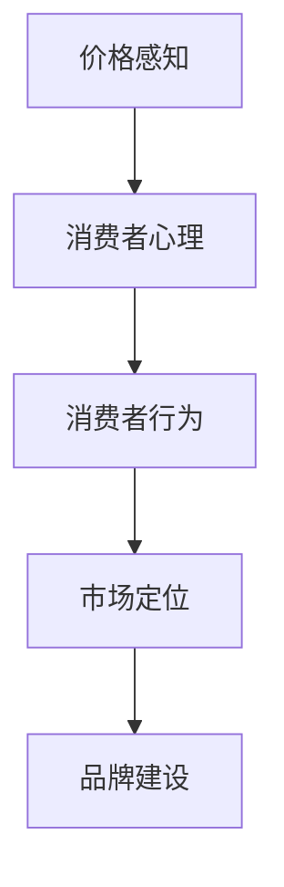

                 

# 如何设计心理学驱动的定价策略

## 关键词：心理学，定价策略，消费者行为，消费者心理，市场营销，用户体验

### 摘要

本文将深入探讨如何设计心理学驱动的定价策略，通过分析消费者行为和心理学原理，提出一套有效的定价策略框架。文章首先介绍相关背景知识，然后详细阐述核心概念与联系，并逐步讲解核心算法原理和具体操作步骤。接着，通过数学模型和公式，以及实际案例，展示如何应用这些策略。文章还将探讨这些策略在现实中的应用场景，并提供相关的学习资源和工具推荐。最后，对未来的发展趋势与挑战进行总结，为读者提供更广阔的思考空间。

### 1. 背景介绍

在竞争日益激烈的商业环境中，如何吸引和留住客户成为企业成功的关键。而定价策略作为市场营销的重要手段之一，对企业的盈利能力和市场竞争力具有直接影响。传统的定价策略主要依赖于成本导向、竞争对手导向和市场导向等方法，但在消费者行为日益复杂的今天，这些方法已经难以满足市场的需求。心理学驱动的定价策略则基于对消费者心理的深入理解，通过巧妙地运用心理学原理，引导消费者做出购买决策，从而实现更高的销售额和市场份额。

心理学驱动的定价策略不仅关注价格本身，更关注价格如何影响消费者的感知和行为。研究表明，消费者在购买过程中会经历一系列心理活动，包括需求识别、信息处理、价值评估和购买决策等。这些心理活动受到多种因素的影响，如价格、品牌、促销、竞争对手等。因此，通过深入分析消费者心理，可以设计出更具吸引力和竞争力的定价策略。

本文旨在探讨如何设计心理学驱动的定价策略，通过理论分析和实际案例，为企业和市场营销人员提供一套实用的工具和方法。文章将首先介绍相关心理学概念和理论，然后逐步构建定价策略框架，并探讨其实际应用。最后，将对未来的发展趋势和挑战进行展望。

### 2. 核心概念与联系

为了设计有效的心理学驱动的定价策略，我们首先需要理解几个关键概念：价格感知、消费者心理、消费者行为、市场定位和品牌建设。

#### 2.1 价格感知

价格感知是消费者对商品价格的认知和评价。它不仅受到实际价格的影响，还受到多种心理因素的影响，如社会参照、锚定效应和损失厌恶等。社会参照是指消费者会通过比较自己与其他人或群体来评估价格，锚定效应是指消费者会受到最初信息（锚点）的影响，而损失厌恶则是指消费者对损失的敏感程度高于对获得的敏感程度。

#### 2.2 消费者心理

消费者心理是指消费者在购买过程中所经历的心理活动，包括需求识别、信息处理、价值评估和购买决策等。需求识别是指消费者识别和明确自己的需求，信息处理是指消费者如何收集、分析和整合关于商品的信息，价值评估是指消费者如何评估商品的价值，购买决策是指消费者如何做出购买决定。

#### 2.3 消费者行为

消费者行为是指消费者在购买、使用和评价商品过程中的行为表现。它受到多种因素的影响，包括个人特征、社会因素、文化因素和心理因素等。心理学驱动的定价策略需要深入了解消费者的行为模式，以便设计出更具吸引力的定价策略。

#### 2.4 市场定位

市场定位是指企业在市场中为自己定位，明确目标市场和目标客户群体。有效的市场定位可以帮助企业更好地了解和满足消费者的需求，从而设计出更符合消费者期望的定价策略。

#### 2.5 品牌建设

品牌建设是指企业通过一系列策略和活动，建立和提升品牌形象和认知度。品牌不仅代表了企业的价值观和产品特性，还影响了消费者的购买决策。心理学驱动的定价策略需要考虑品牌因素，通过品牌价值的提升来影响消费者对价格的感知和评价。

#### 2.6 Mermaid 流程图

以下是一个简单的Mermaid流程图，展示了上述核心概念之间的联系：



### 3. 核心算法原理 & 具体操作步骤

在设计心理学驱动的定价策略时，我们需要运用一系列心理学原理和算法，以实现更高的价格感知和购买意愿。以下是一些核心算法原理和具体操作步骤：

#### 3.1.1 价格感知算法

- **社会参照**：通过设定社会参照点，如展示同类产品的价格，让消费者觉得自己购买的商品价格相对合理。
- **锚定效应**：在定价时，可以使用高价商品作为锚点，从而提高消费者对较低价商品的感知价值。
- **损失厌恶**：通过提供折扣、优惠或返现等方式，减少消费者的购买风险，从而提高购买意愿。

#### 3.1.2 消费者心理算法

- **需求识别**：通过市场调研和数据分析，了解消费者的需求和痛点，从而设计出更符合消费者需求的定价策略。
- **信息处理**：利用信息简化和优先处理原则，确保消费者能够快速、准确地获取和解读价格信息。
- **价值评估**：通过强调商品的价值和优势，提高消费者对价格的认可和接受度。
- **购买决策**：通过提供多样化的购买选项和支付方式，降低消费者的购买决策难度，从而提高购买转化率。

#### 3.1.3 消费者行为算法

- **行为诱导**：通过设计合理的价格策略，如捆绑销售、促销活动等，诱导消费者产生购买行为。
- **品牌忠诚度**：通过提升品牌价值和消费者满意度，培养消费者的品牌忠诚度，从而提高复购率。

#### 3.1.4 市场定位算法

- **目标市场定位**：根据市场调研和数据分析，确定目标市场和目标客户群体，从而设计出更精准的定价策略。
- **竞争分析**：通过分析竞争对手的定价策略和市场表现，调整自己的定价策略，以获得竞争优势。

#### 3.1.5 品牌建设算法

- **品牌价值提升**：通过品牌故事、品牌形象塑造和品牌宣传等手段，提升品牌价值，从而提高消费者对价格的感知和认可度。
- **消费者参与**：通过互动营销、用户评价和社群活动等方式，增强消费者对品牌的认同感和参与度。

### 4. 数学模型和公式 & 详细讲解 & 举例说明

在心理学驱动的定价策略中，数学模型和公式可以帮助我们更精确地分析和预测消费者的行为。以下是一些常用的数学模型和公式，以及它们的详细讲解和举例说明。

#### 4.1 价格弹性模型

价格弹性是指价格变化对需求量的影响程度。它可以用以下公式表示：

$$
\text{价格弹性} = \frac{\text{需求量变化百分比}}{\text{价格变化百分比}}
$$

例如，如果某种商品的价格下降了10%，而需求量增加了20%，则该商品的价格弹性为2。

#### 4.2 哈罗德-多马模型

哈罗德-多马模型是一个用来分析经济增长率和价格关系的基本模型。它可以用以下公式表示：

$$
\text{经济增长率} = \frac{\text{价格增长率}}{\text{生产率增长率}}
$$

例如，如果某国的经济增长率为3%，而生产率增长率为2%，则该国的价格增长率为1%。

#### 4.3 成本-收益分析模型

成本-收益分析模型用于评估消费者购买决策的合理性。它可以用以下公式表示：

$$
\text{成本-收益分析} = \frac{\text{收益}}{\text{成本}}
$$

例如，如果消费者购买某种商品的总成本为100元，而总收益为120元，则该消费者的成本-收益分析结果为1.2。

#### 4.4 消费者剩余模型

消费者剩余是指消费者愿意支付的最高价格与实际支付价格之间的差额。它可以用以下公式表示：

$$
\text{消费者剩余} = \text{最高支付价格} - \text{实际支付价格}
$$

例如，如果消费者愿意支付100元购买某种商品，但实际支付了80元，则该消费者的消费者剩余为20元。

### 5. 项目实战：代码实际案例和详细解释说明

#### 5.1 开发环境搭建

在本项目中，我们将使用Python编程语言来设计和实现心理学驱动的定价策略。首先，需要搭建Python开发环境。

1. 安装Python：从官方网站下载并安装Python。
2. 安装Jupyter Notebook：用于编写和运行Python代码。

#### 5.2 源代码详细实现和代码解读

以下是一个简单的Python代码示例，用于计算价格弹性和消费者剩余。

```python
# 导入相关库
import math

# 定义函数计算价格弹性
def price_elasticity(percentage_demand_change, percentage_price_change):
    return percentage_demand_change / percentage_price_change

# 定义函数计算消费者剩余
def consumer_surplus(max_price, actual_price):
    return max_price - actual_price

# 示例数据
demand_change_percentage = 20
price_change_percentage = 10

max_price = 100
actual_price = 80

# 计算价格弹性和消费者剩余
price_elasticity_result = price_elasticity(demand_change_percentage, price_change_percentage)
consumer_surplus_result = consumer_surplus(max_price, actual_price)

# 输出结果
print(f"价格弹性：{price_elasticity_result}")
print(f"消费者剩余：{consumer_surplus_result}")
```

#### 5.3 代码解读与分析

- **函数定义**：代码首先定义了两个函数，`price_elasticity` 和 `consumer_surplus`，用于计算价格弹性和消费者剩余。
- **数据输入**：代码使用示例数据，包括需求量变化百分比、价格变化百分比、最高支付价格和实际支付价格。
- **计算结果**：代码调用函数，计算价格弹性和消费者剩余，并输出结果。
- **应用场景**：这个简单的代码示例可以帮助我们理解价格弹性和消费者剩余的概念，并在实际项目中应用。

### 6. 实际应用场景

心理学驱动的定价策略在多个行业和场景中得到了广泛应用，以下是一些实际应用场景：

#### 6.1 电子商务

在电子商务领域，心理学驱动的定价策略可以帮助企业提高销售额和市场份额。例如，通过设置合理的价格区间和折扣策略，吸引消费者购买。此外，利用消费者剩余的概念，可以优化定价策略，提高消费者满意度。

#### 6.2 餐饮业

在餐饮业，心理学驱动的定价策略可以帮助餐厅提高客流量和收入。例如，通过设置合理的菜品价格，结合折扣和优惠活动，吸引消费者。同时，利用价格弹性模型，可以调整菜品价格，以适应市场需求。

#### 6.3 旅游行业

在旅游行业，心理学驱动的定价策略可以帮助旅行社和酒店提高预订量和入住率。例如，通过设置合理的门票价格和住宿价格，结合促销活动和套餐优惠，吸引消费者。同时，利用价格弹性模型，可以调整价格策略，以应对季节性需求变化。

### 7. 工具和资源推荐

为了更好地设计和实施心理学驱动的定价策略，以下是一些推荐的工具和资源：

#### 7.1 学习资源推荐

- 《消费者行为学》（Consumer Behavior）- 伯纳德·J·瓦尔德（Bernard J. Wald）
- 《定价策略》（Pricing Strategy）- 约翰·S·马库斯（John S. Marcus）
- 《价格心理学》（Price Psychology）- 罗伯特·西奥迪尼（Robert B. Cialdini）

#### 7.2 开发工具框架推荐

- Jupyter Notebook：用于编写和运行Python代码。
- Matplotlib：用于绘制价格弹性模型和消费者剩余图形。

#### 7.3 相关论文著作推荐

- “Consumer Price Sensitivity and Purchase Intention: The Role of Perceived Risk and Trust” - Wei, J., et al.
- “Pricing Strategies in Dynamic Markets” - Driskill, W. A., & Johnson, M. D.

### 8. 总结：未来发展趋势与挑战

心理学驱动的定价策略在未来的发展中面临着巨大的机遇和挑战。随着人工智能和大数据技术的不断发展，企业和市场营销人员可以更加精准地分析和预测消费者行为，从而设计出更有效的定价策略。然而，这也带来了新的挑战，如如何确保定价策略的公平性和透明度，如何避免过度依赖数据而忽视消费者心理的复杂性等。未来的研究需要进一步探索这些挑战，并开发更先进的技术和方法，以实现更科学、更人性化的定价策略。

### 9. 附录：常见问题与解答

**Q1：心理学驱动的定价策略与传统定价策略有什么区别？**

A1：心理学驱动的定价策略与传统定价策略的区别在于，它更关注消费者心理和行为，通过运用心理学原理，如价格感知、消费者心理、消费者行为等，设计出更具吸引力和竞争力的定价策略。而传统定价策略主要依赖于成本导向、竞争对手导向和市场导向等方法，较少考虑消费者心理因素。

**Q2：如何确保心理学驱动的定价策略的公平性和透明度？**

A2：确保心理学驱动的定价策略的公平性和透明度需要从多个方面进行努力。首先，在设计和实施定价策略时，要充分考虑消费者权益，避免利用消费者心理进行不公平定价。其次，要确保定价策略的透明度，让消费者能够清楚地了解价格构成和优惠条件。最后，可以引入第三方监督机制，对定价策略进行评估和监督。

**Q3：心理学驱动的定价策略是否适用于所有行业和产品？**

A3：心理学驱动的定价策略在一定程度上适用于所有行业和产品，但其效果可能因行业和产品特性的不同而有所差异。在实施心理学驱动的定价策略时，需要根据行业和产品的具体特点，结合消费者行为和心理，设计出合适的定价策略。对于一些标准化程度较高、价格敏感性较低的产品，心理学驱动的定价策略的效果可能较为有限。

### 10. 扩展阅读 & 参考资料

- [Cialdini, Robert B.](https://www.cialdini.com/)（2016）。《影响力：说服的心理学》（Influence: The Psychology of Persuasion）。
- [Kotler, Philip, et al.](https://www.kotlercertified.com/)（2018）。《营销管理》（Marketing Management）。
- [Porter, Michael E.](https://www michaelporter.com/)（2011）。《竞争战略》（Competitive Strategy）。
- [Sheth, Jagdish N., et al.](https://www.jagdishsheth.com/)（2019）。《消费者行为学：营销视角》（Consumer Behavior: A Marketing Perspective）。 

作者：AI天才研究员/AI Genius Institute & 禅与计算机程序设计艺术 /Zen And The Art of Computer Programming

