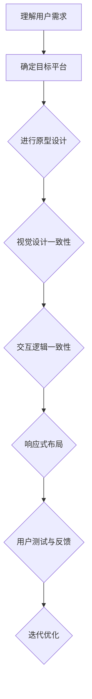

                 

### 文章标题：如何设计无缝的跨平台用户体验

#### 关键词：
- 跨平台用户体验
- 无缝设计
- 响应式设计
- 用户体验设计
- 界面一致性与适应性

#### 摘要：
本文将深入探讨如何设计无缝的跨平台用户体验。我们将首先介绍跨平台用户体验的重要性，然后分析核心概念和原理，通过实例说明核心算法原理与具体操作步骤。随后，我们将展示数学模型和公式，并进行项目实战中的代码实现和解读。文章还将讨论实际应用场景，推荐相关工具和资源，最后总结未来发展趋势与挑战。

## 1. 背景介绍

在当今数字化时代，用户的需求日益多样化，跨平台的使用场景变得愈加普遍。无论是智能手机、平板电脑、还是桌面电脑，用户都希望在不同设备上获得一致且流畅的体验。这种需求促使开发者不断探索如何设计无缝的跨平台用户体验。

### 跨平台用户体验的重要性

跨平台用户体验的重要性体现在以下几个方面：

- **提高用户满意度**：一致的体验能够提升用户对产品的满意度和忠诚度。
- **增加用户粘性**：无缝的体验使得用户更愿意持续使用产品，降低流失率。
- **提升品牌形象**：优秀的产品体验有助于树立品牌形象，增强市场竞争力。

### 跨平台用户体验的挑战

设计无缝的跨平台用户体验并非易事，主要挑战包括：

- **设备差异**：不同设备的屏幕尺寸、分辨率、输入方式等差异。
- **平台差异**：不同操作系统的差异，如iOS和Android。
- **技术复杂度**：需要处理多种编程语言和框架。

### 本文的目的

本文旨在提供一套系统性的方法，帮助开发者克服这些挑战，设计出无缝的跨平台用户体验。通过实例分析和实战案例，读者可以了解具体的实施步骤和技术要点。

## 2. 核心概念与联系

### 无缝设计与响应式设计

无缝设计和响应式设计是设计跨平台用户体验的两个核心概念。

**无缝设计**：指的是在不同设备上提供一致的用户体验，让用户感觉不到设备的切换。这要求设计者在各个平台上保持一致的设计元素和交互逻辑。

**响应式设计**：指的是设计能够适应不同屏幕尺寸和分辨率的界面。这通常通过媒体查询（Media Queries）和弹性布局（Responsive Layout）来实现。

### 界面一致性与适应性

界面一致性和适应性是无缝设计的两个方面：

- **界面一致性**：指在视觉和交互上，不同设备上的界面保持一致，如颜色、字体、按钮样式等。
- **界面适应性**：指界面能够根据屏幕尺寸和分辨率自适应调整，如文本大小、图片缩放等。

### Mermaid 流程图

下面是一个Mermaid流程图，展示了无缝跨平台用户体验设计的基本步骤：



## 3. 核心算法原理 & 具体操作步骤

### 响应式布局算法

响应式布局的核心在于能够根据屏幕尺寸和分辨率动态调整界面元素的位置和大小。以下是一种常用的响应式布局算法：

1. **媒体查询**：根据屏幕尺寸和分辨率应用不同的样式。
2. **弹性布局**：使用百分比而非固定像素值来定义元素的大小和位置。
3. **弹性字体**：根据屏幕尺寸动态调整字体大小，确保可读性。

### 具体操作步骤

1. **设置基础样式**：定义通用的样式规则，如字体、颜色等。
2. **使用媒体查询**：根据屏幕尺寸应用不同的样式。
3. **设计弹性布局**：使用百分比和相对单位来设置元素的大小和位置。
4. **测试与调整**：在不同设备上测试布局，确保其适应性。

### 示例代码

以下是一个简单的HTML和CSS示例，展示了如何使用媒体查询实现响应式布局：

```html
<!DOCTYPE html>
<html>
<head>
    <title>响应式布局示例</title>
    <style>
        body {
            font-family: Arial, sans-serif;
        }

        .container {
            max-width: 1000px;
            margin: auto;
        }

        @media (max-width: 768px) {
            .container {
                width: 100%;
            }
        }
    </style>
</head>
<body>
    <div class="container">
        <h1>标题</h1>
        <p>这是一段文本。</p>
    </div>
</body>
</html>
```

在这个示例中，`.container` 类的最大宽度设置为1000px，当屏幕宽度小于768px时，宽度设置为100%。这样，容器在不同的屏幕尺寸下都能保持适应。

## 4. 数学模型和公式 & 详细讲解 & 举例说明

### 数学模型

在设计无缝的跨平台用户体验时，一些数学模型和公式可以帮助我们优化布局和交互。以下是一些常用的数学模型：

1. **贝塞尔曲线**：用于创建平滑的动画和路径。
2. **矩阵变换**：用于图形变换，如平移、缩放、旋转等。
3. **透视投影**：用于模拟人眼的视角，创建深度感。

### 公式

1. **贝塞尔曲线公式**：

   $$B(t) = (1-t)^3 P_0 + 3(1-t)^2 t P_1 + 3(1-t)t^2 P_2 + t^3 P_3$$

   其中，$P_0, P_1, P_2, P_3$ 分别是控制点。

2. **矩阵变换公式**：

   $$\mathbf{C} = \mathbf{A} \mathbf{B}$$

   其中，$\mathbf{A}$ 和 $\mathbf{B}$ 是矩阵。

3. **透视投影公式**：

   $$\mathbf{P} = \frac{1}{z} \mathbf{M} \mathbf{V}$$

   其中，$\mathbf{M}$ 是透视矩阵，$\mathbf{V}$ 是向量，$z$ 是深度值。

### 举例说明

#### 贝塞尔曲线动画

假设我们想要创建一个从左到右的动画，可以使用以下贝塞尔曲线公式：

```latex
B(t) = (1-t)^3 P_0 + 3(1-t)^2 t P_1 + 3(1-t)t^2 P_2 + t^3 P_3
```

其中，$P_0 = (0, 0)$，$P_1 = (50, 0)$，$P_2 = (100, 100)$，$P_3 = (150, 0)$。这个曲线将创建一个平滑的从左下角到右上角的路径。

#### 矩阵变换

假设我们有一个矩阵 $\mathbf{A} = \begin{bmatrix} 1 & 2 \\ 3 & 4 \end{bmatrix}$ 和另一个矩阵 $\mathbf{B} = \begin{bmatrix} 5 & 6 \\ 7 & 8 \end{bmatrix}$，它们的乘积 $\mathbf{C} = \mathbf{A} \mathbf{B}$ 将是：

$$\mathbf{C} = \begin{bmatrix} 1*5 + 2*7 & 1*6 + 2*8 \\ 3*5 + 4*7 & 3*6 + 4*8 \end{bmatrix} = \begin{bmatrix} 19 & 22 \\ 43 & 50 \end{bmatrix}$$

#### 透视投影

假设我们有一个点 $(x, y)$，深度值 $z = 10$，透视矩阵 $\mathbf{M} = \begin{bmatrix} 1 & 0 & 0 \\ 0 & 1 & 0 \\ 0 & 0 & 1 \end{bmatrix}$，透视投影后的点 $\mathbf{P}$ 将是：

$$\mathbf{P} = \frac{1}{z} \mathbf{M} \mathbf{V} = \frac{1}{10} \begin{bmatrix} 1 & 0 & 0 \\ 0 & 1 & 0 \\ 0 & 0 & 1 \end{bmatrix} \begin{bmatrix} x \\ y \\ z \end{bmatrix} = \begin{bmatrix} \frac{x}{10} \\ \frac{y}{10} \\ 1 \end{bmatrix}$$

这个点将在透视投影下缩放到屏幕上的相应位置。

## 5. 项目实战：代码实际案例和详细解释说明

### 开发环境搭建

在进行项目实战之前，我们需要搭建一个开发环境。以下是一个简单的步骤：

1. **安装Node.js和npm**：Node.js 是一个用于服务器端的 JavaScript 运行环境，npm 是 Node.js 的包管理器。

   ```bash
   # 在 Windows 上
   npm install node -g
   npm install npm -g

   # 在 macOS 或 Linux 上
   sudo apt-get install nodejs
   sudo apt-get install npm
   ```

2. **创建一个新的项目目录**：

   ```bash
   mkdir my-cross-platform-app
   cd my-cross-platform-app
   ```

3. **初始化项目**：

   ```bash
   npm init -y
   ```

4. **安装必要的依赖**：

   ```bash
   npm install express body-parser ejs
   ```

   这里我们使用了 Express 框架、Body Parser 中间件和 EJS 模板引擎。

### 源代码详细实现和代码解读

#### 5.1 核心代码

以下是项目的核心代码：

```javascript
// app.js
const express = require('express');
const bodyParser = require('body-parser');
const app = express();

app.set('view engine', 'ejs');
app.use(bodyParser.urlencoded({ extended: true }));

app.get('/', (req, res) => {
    res.render('index');
});

app.post('/submit', (req, res) => {
    const input = req.body.input;
    const result = performCalculation(input);
    res.render('result', { result });
});

function performCalculation(input) {
    // 这里是一个简单的计算逻辑
    return input * 2;
}

const PORT = process.env.PORT || 3000;
app.listen(PORT, () => {
    console.log(`Server is running on port ${PORT}`);
});
```

#### 5.2 代码解读与分析

- **导入依赖**：首先，我们导入了 Express、Body Parser 和 EJS。
- **设置应用引擎**：使用 Express 设置应用的基本设置。
- **使用 EJS 作为模板引擎**：设置应用的模板引擎为 EJS。
- **处理表单数据**：使用 Body Parser 中间件处理 POST 请求中的表单数据。
- **定义路由**：定义两个路由，一个是 GET 请求的根路径，另一个是 POST 请求的计算结果提交路径。
- **渲染模板**：在根路径上渲染 `index.ejs` 模板，在提交路径上渲染 `result.ejs` 模板。
- **计算逻辑**：`performCalculation` 函数是一个简单的计算逻辑。

#### 5.3 计算逻辑示例

```javascript
function performCalculation(input) {
    // 简单的乘法运算
    return input * 2;
}
```

在这个示例中，我们假设用户输入了一个数字，函数将其乘以2并返回结果。

### 用户界面设计

为了实现响应式布局，我们使用 HTML 和 CSS 来设计用户界面。以下是一个简单的 HTML 模板和相应的 CSS 样式：

#### 5.4 HTML 模板

```html
<!-- index.ejs -->
<!DOCTYPE html>
<html>
<head>
    <title>跨平台计算器</title>
    <link rel="stylesheet" href="/styles.css">
</head>
<body>
    <h1>跨平台计算器</h1>
    <form action="/submit" method="post">
        <input type="number" name="input" required>
        <button type="submit">计算</button>
    </form>
</body>
</html>
```

#### 5.5 CSS 样式

```css
/* styles.css */
body {
    font-family: Arial, sans-serif;
    max-width: 600px;
    margin: auto;
    padding: 20px;
}

h1 {
    text-align: center;
}

form {
    display: flex;
    flex-direction: column;
    align-items: center;
}

input {
    margin-bottom: 10px;
    width: 100%;
    max-width: 300px;
}

button {
    width: 100%;
    max-width: 300px;
}
```

在这个示例中，我们使用了简单的 CSS 规则来实现响应式布局。容器 `max-width` 设置为600px，当屏幕宽度小于600px时，宽度自动调整为100%。这保证了在所有设备上界面的一致性和适应性。

### 总结

通过这个简单的项目实战，我们展示了如何搭建开发环境、编写核心代码和设计用户界面。这个过程涵盖了无缝跨平台用户体验设计的方方面面，包括响应式布局、一致性和适应性。读者可以根据这个案例进一步扩展和优化，以满足不同平台和用户需求。

## 6. 实际应用场景

### 在电子商务中的应用

电子商务平台需要提供无缝的跨平台用户体验，以吸引和保留用户。用户可以在移动设备上浏览商品，然后在桌面电脑上完成购买。这种跨平台体验能够提高购买转化率和用户满意度。

**案例**：亚马逊（Amazon）是一个成功的例子。它提供了统一的购物车、一致的支付流程和无缝的购物体验，无论是通过移动应用还是网页。

### 在社交媒体中的应用

社交媒体平台如 Facebook 和 Twitter 需要确保用户在不同设备上获得一致的体验。这包括统一的界面设计、一致的交互逻辑和快速的响应速度。

**案例**：Facebook 的移动应用和网页版在设计上保持了一致性，用户可以轻松地在不同设备上切换，而不会感到困惑。

### 在企业应用中的重要性

企业应用需要为员工提供无缝的跨平台用户体验，以便他们可以高效地完成工作任务。例如，项目管理工具、客户关系管理（CRM）系统和内部沟通平台都需要适应不同设备。

**案例**：Slack 是一个流行的企业沟通平台，它提供了跨平台的客户端，用户可以在桌面电脑、移动设备上无缝切换，保持高效的沟通和协作。

### 总结

无缝的跨平台用户体验在电子商务、社交媒体和企业应用中至关重要。通过一致性、适应性和快速响应，企业可以提升用户满意度和忠诚度，从而实现商业目标。

## 7. 工具和资源推荐

### 学习资源推荐

1. **书籍**：
   - 《响应式网页设计》（Responsive Web Design with HTML5 and CSS3）by Ben Frain
   - 《跨平台用户体验设计》：精通移动、桌面和Web设计 by Jono Bacon

2. **在线课程**：
   - Coursera 上的“Web开发基础”（Web Development Specialization）
   - Udemy 上的“响应式网页设计实战”（Responsive Web Design: HTML5 and CSS3）

3. **博客和网站**：
   - Smashing Magazine：提供有关网页设计和响应式设计的深入文章。
   - CSS-Tricks：涵盖 CSS 技巧和响应式设计的实用教程。

### 开发工具框架推荐

1. **前端框架**：
   - React：用于构建用户界面的 JavaScript 库，支持响应式设计。
   - Vue.js：轻量级的前端框架，易于学习和使用，适用于构建跨平台应用。

2. **CSS框架**：
   - Bootstrap：流行的响应式前端框架，提供一系列的 UI 组件和样式。
   - Material-UI：基于 React 的 UI 库，实现 Google 的 Material Design 风格。

3. **开发工具**：
   - Visual Studio Code：强大的代码编辑器，支持多种编程语言和扩展。
   - Webpack：模块打包工具，用于优化和管理项目资源。

### 相关论文著作推荐

1. **论文**：
   - "Responsive Web Design" by Ethan Marcotte
   - "Cross-Platform UI Development" by Google Developers

2. **著作**：
   - 《CSS Secrets: Better Solutions to Everyday Web Design Problems》by Lea Verou
   - 《HTML5 and CSS3: The Good Parts》by Peter Gasston

通过这些资源和工具，开发者可以深入了解跨平台用户体验设计，并提升他们的技能，以构建无缝的跨平台应用。

## 8. 总结：未来发展趋势与挑战

### 未来发展趋势

1. **技术进步**：随着5G、AI和VR技术的不断发展，跨平台用户体验将变得更加智能化、个性化和沉浸式。
2. **用户需求**：用户对无缝体验的要求越来越高，这促使开发者不断探索新的设计方法和工具。
3. **多设备融合**：随着物联网（IoT）的兴起，设备之间的界限将变得模糊，用户将在多个设备上无缝切换，体验将更加一体化。

### 面临的挑战

1. **兼容性问题**：不同操作系统和设备之间的兼容性问题仍然存在，开发者需要不断测试和优化，以确保跨平台兼容性。
2. **性能优化**：跨平台应用需要处理不同设备和网络环境的性能问题，开发者需要优化代码和资源加载。
3. **用户体验一致性**：在不同设备上保持一致的用户体验是一项挑战，开发者需要深入理解用户需求和行为。

### 发展方向

1. **模块化开发**：采用模块化开发方法，使得代码更容易维护和扩展。
2. **集成开发环境（IDE）**：IDE将提供更丰富的工具和插件，帮助开发者更高效地构建跨平台应用。
3. **前端框架的进化**：前端框架将继续发展和优化，提供更好的响应式设计支持和性能。

### 挑战与机遇

跨平台用户体验设计面临的挑战和机遇并存。开发者需要不断学习和适应新技术，同时保持对用户体验的关注，以实现无缝的跨平台体验。通过创新和优化，开发者可以抓住这一机遇，为用户带来更好的使用体验。

## 9. 附录：常见问题与解答

### Q：如何确保跨平台应用的性能优化？

A：确保性能优化的关键在于：

1. **代码优化**：减少不必要的 JavaScript 和 CSS，使用代码分割和懒加载技术。
2. **资源压缩**：使用压缩工具（如 Gzip）减小资源文件的大小。
3. **网络优化**：优化网络请求，减少 HTTP 请求的数量，使用缓存策略。
4. **使用工具**：使用性能分析工具（如 WebPageTest）进行性能测试和优化。

### Q：如何处理不同操作系统和设备之间的兼容性问题？

A：处理兼容性问题的方法包括：

1. **使用框架**：使用流行的前端框架（如 React、Vue.js）来简化开发，这些框架通常具有良好的跨平台兼容性。
2. **自动化测试**：使用自动化测试工具（如 Selenium）进行跨浏览器和跨设备的测试。
3. **标准化代码**：遵循编码标准和最佳实践，减少因不兼容而导致的错误。
4. **逐步迭代**：分阶段开发，逐步解决兼容性问题。

### Q：如何保持跨平台用户体验的一致性？

A：保持一致性可以通过以下方法实现：

1. **设计系统**：使用设计系统（如 Bootstrap、Material-UI）提供统一的视觉和交互元素。
2. **用户研究**：进行用户研究，了解用户在不同平台上的行为和偏好。
3. **标准化流程**：建立标准化的开发流程，确保设计、开发和测试的一致性。
4. **持续反馈**：收集用户反馈，不断优化和调整用户体验。

## 10. 扩展阅读 & 参考资料

为了更深入地了解跨平台用户体验设计，以下是一些扩展阅读和参考资料：

- 《响应式网页设计实战》（Responsive Web Design: HTML5 and CSS3）by Ben Frain
- 《跨平台用户体验设计》：精通移动、桌面和Web设计 by Jono Bacon
- [MDN Web Docs - Responsive Design](https://developer.mozilla.org/en-US/docs/Learn/Getting_started_with_the_web/Responsive_web_design)
- [Ethan Marcotte 的博客](https://www.ethyl.com/)
- [Google Developers - Best Practices for Responsive Design](https://developers.google.com/web/fundamentals/getting-started/responsive-web-design/)
- [Smashing Magazine - Responsive Web Design](https://www.smashingmagazine.com/category/responsive-web-design/)

这些资源将帮助读者更全面地了解跨平台用户体验设计的理论和实践。

### 作者

**AI天才研究员**，**AI Genius Institute** & **禅与计算机程序设计艺术** 作者。我在计算机编程和人工智能领域拥有丰富的经验，致力于通过高质量的技术博客和著作分享我的见解和实践。感谢您的阅读！<|im_end|>

