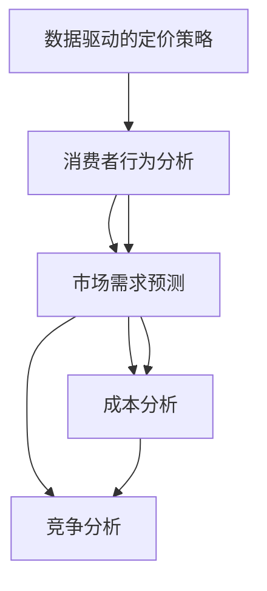

                 

### 背景介绍

在商业世界中，定价策略是企业成功的关键之一。合理的设计定价模型不仅能帮助企业实现盈利目标，还能增强客户的购买意愿，提高市场竞争力。本文旨在探讨如何设计有吸引力的定价模型，为企业提供切实可行的指导。

定价模型是指在市场经济中，商品或服务的价格形成机制。它不仅涉及到价格与成本的关系，还包括市场需求、竞争状况、消费者行为等多个因素。一个有效的定价模型应该具备以下特点：透明性、灵活性和公平性。透明性指的是价格形成的全过程应清晰明确，让消费者易于理解；灵活性意味着企业可以根据市场环境的变化灵活调整价格；公平性则要求价格反映商品或服务的真实价值。

随着互联网的普及和大数据技术的发展，越来越多的企业开始关注数据驱动的定价策略。基于消费者行为和市场动态的定价模型逐渐成为主流。本文将详细探讨如何利用这些先进技术设计出具有吸引力的定价模型。

首先，我们将回顾传统定价模型的基本原理，并分析其在现代市场中的局限性。接着，我们将介绍数据驱动定价策略的核心概念，包括消费者行为分析、市场需求预测等。在此基础上，我们将通过具体案例展示如何利用这些技术设计出有吸引力的定价模型。

随后，我们将讨论在实际应用中可能会遇到的挑战和解决方案，如数据获取和处理、市场变化应对等。此外，我们还将介绍一些实用的工具和资源，帮助读者更好地理解和应用这些定价策略。

最后，我们将总结本文的核心观点，并探讨未来定价策略的发展趋势和潜在挑战。通过本文的阅读，读者将能够更深入地理解定价策略的重要性，并掌握设计有吸引力的定价模型的方法和技巧。

### 核心概念与联系

为了深入探讨如何设计有吸引力的定价模型，我们首先需要了解其中的核心概念和它们之间的联系。以下是本文将涉及的主要核心概念：

#### 1. 消费者行为分析
消费者行为分析是指研究消费者在购买和使用商品或服务过程中的心理和决策过程。通过分析消费者的购买历史、浏览行为、偏好和反馈，企业可以更准确地了解市场需求和消费者偏好，从而制定更有效的定价策略。

#### 2. 市场需求预测
市场需求预测是指利用历史数据和统计分析方法，预测市场对未来商品或服务的需求量。准确的需求预测有助于企业合理安排生产和库存，制定更具前瞻性的定价策略。

#### 3. 成本分析
成本分析是指对生产或提供商品或服务的成本进行详细评估。成本包括固定成本（如设备折旧、房租等）和可变成本（如原材料、人力等）。合理的成本分析有助于企业确定合理的定价基础。

#### 4. 竞争分析
竞争分析是指研究竞争对手的定价策略和市场表现，从而了解竞争态势。通过竞争分析，企业可以调整自身的定价策略，以在竞争中获得优势。

#### 5. 数据驱动的定价策略
数据驱动的定价策略是指利用大数据技术和算法，对消费者行为、市场需求、成本和竞争状况等进行分析，制定出更加精确和灵活的定价策略。

以上核心概念之间有着紧密的联系。消费者行为分析为市场需求预测提供了基础数据，而市场需求预测则帮助成本分析和竞争分析。通过综合这些分析结果，企业可以制定出更加有效的数据驱动定价策略。

下面是一个使用Mermaid绘制的流程图，展示了这些核心概念之间的关系：



在这个流程图中，消费者行为分析位于核心位置，它是市场需求预测、成本分析和竞争分析的基础。这些分析结果共同作用于数据驱动的定价策略，帮助企业制定出具有吸引力的定价模型。

通过理解这些核心概念及其联系，企业可以更系统地设计定价模型，从而在激烈的市场竞争中脱颖而出。接下来，我们将深入探讨这些核心概念的具体内容和应用方法。

### 核心算法原理 & 具体操作步骤

在了解了核心概念与联系之后，我们接下来将探讨设计有吸引力的定价模型所需的核心算法原理和具体操作步骤。这些算法将帮助我们从数据中提取有价值的信息，并转化为有效的定价策略。

#### 1. 消费者行为分析算法

消费者行为分析是数据驱动定价策略的基础。其核心算法通常包括以下几个方面：

- **A/B测试（A/B Testing）**：通过在相似消费者群体中同时运行两个或多个价格策略，比较其购买行为和满意度，以确定最佳定价。

- **机器学习算法（Machine Learning Algorithms）**：使用监督学习或无监督学习算法分析消费者的购买历史、浏览行为和偏好，预测消费者的购买意图。

- **聚类分析（Cluster Analysis）**：将消费者根据其行为和偏好分为不同的群体，为每个群体制定个性化的定价策略。

具体操作步骤如下：

1. **数据收集**：收集消费者的购买历史、浏览行为和偏好数据。
2. **数据预处理**：清洗和整合数据，去除噪声和异常值。
3. **特征工程**：提取有用的特征，如购买频率、平均订单金额、浏览时间等。
4. **模型训练**：使用机器学习算法训练模型，预测消费者的购买意图。
5. **策略评估**：通过A/B测试等手段评估不同定价策略的效果。
6. **策略优化**：根据评估结果调整定价策略。

#### 2. 市场需求预测算法

市场需求预测是制定定价策略的关键。常见的市场需求预测算法包括时间序列分析、回归分析和神经网络等。

- **时间序列分析（Time Series Analysis）**：通过分析历史数据的时间序列模式，预测未来需求量。

- **回归分析（Regression Analysis）**：建立市场需求与价格、促销等因素之间的回归模型，预测市场需求。

- **神经网络（Neural Networks）**：通过多层神经网络学习复杂的非线性关系，预测市场需求。

具体操作步骤如下：

1. **数据收集**：收集历史市场需求数据，包括价格、促销、季节性等因素。
2. **数据预处理**：清洗和整合数据，去除噪声和异常值。
3. **特征工程**：提取有用的特征，如价格、促销力度、季节性等。
4. **模型选择**：选择合适的时间序列分析、回归分析或神经网络模型。
5. **模型训练**：训练模型，预测未来市场需求。
6. **模型评估**：评估模型的预测准确性，调整模型参数。
7. **市场需求预测**：使用训练好的模型预测未来市场需求。

#### 3. 成本分析算法

成本分析是确定定价策略的基础。常见的成本分析算法包括线性规划、成本效益分析和目标成本法等。

- **线性规划（Linear Programming）**：通过优化成本函数，确定最优定价策略。

- **成本效益分析（Cost-Benefit Analysis）**：比较成本和收益，确定合理的定价策略。

- **目标成本法（Target Costing）**：在目标利润下，确定实现目标利润的成本。

具体操作步骤如下：

1. **数据收集**：收集生产成本数据，包括固定成本、可变成本等。
2. **成本分类**：将成本分为固定成本和可变成本。
3. **成本计算**：计算总成本、单位成本等关键指标。
4. **成本优化**：使用线性规划等算法，优化成本结构。
5. **成本效益分析**：比较成本和收益，确定合理的定价策略。
6. **目标成本法**：在目标利润下，确定实现目标利润的成本。

#### 4. 竞争分析算法

竞争分析是了解市场动态和竞争对手定价策略的重要手段。常见的竞争分析算法包括市场占有率分析、价格比较和竞争策略分析等。

- **市场占有率分析（Market Share Analysis）**：通过分析竞争对手的市场占有率，了解市场动态。

- **价格比较（Price Comparison）**：比较自家产品和竞争对手的价格，制定有竞争力的定价策略。

- **竞争策略分析（Competitive Strategy Analysis）**：分析竞争对手的定价策略和市场表现，制定相应的竞争策略。

具体操作步骤如下：

1. **数据收集**：收集竞争对手的市场占有率、价格等信息。
2. **数据预处理**：清洗和整合数据，去除噪声和异常值。
3. **市场占有率分析**：计算和分析自家产品与竞争对手的市场占有率。
4. **价格比较**：比较自家产品和竞争对手的价格，找出差异点。
5. **竞争策略分析**：分析竞争对手的定价策略和市场表现，制定相应的竞争策略。

通过以上核心算法的具体操作步骤，企业可以更系统地设计出有吸引力的定价模型，提高市场竞争力。接下来，我们将进一步探讨如何将理论应用于实际项目。

### 数学模型和公式 & 详细讲解 & 举例说明

为了更深入地理解定价模型的设计，我们需要引入数学模型和公式，并通过具体的例子来说明其应用。以下是一些常用的数学模型和公式的详细讲解。

#### 1. 价值定价模型（Value-Based Pricing）

价值定价模型是一种基于消费者感知价值的定价策略。其核心公式为：

\[ P = V \times r \]

其中：
- \( P \) 表示价格
- \( V \) 表示消费者感知价值
- \( r \) 表示定价系数

**详细讲解**：
价值定价模型的关键在于准确评估消费者对商品或服务的感知价值。定价系数 \( r \) 用于调整价格，使其反映市场供需状况和竞争环境。

**举例说明**：
假设一款智能手机的感知价值为 \( 1000 \) 元，定价系数 \( r \) 为 \( 1.2 \)。则其价格 \( P \) 为：

\[ P = 1000 \times 1.2 = 1200 \] 元

#### 2. 成本加成定价模型（Cost-Plus Pricing）

成本加成定价模型是一种基于成本加成的方式确定价格。其核心公式为：

\[ P = C + C_{\text{add}} \]

其中：
- \( P \) 表示价格
- \( C \) 表示成本
- \( C_{\text{add}} \) 表示加成成本

**详细讲解**：
成本加成定价模型通过将生产或提供商品或服务的成本加上一定的加成成本来确定价格。加成成本通常包括利润、管理费用和风险成本。

**举例说明**：
假设一款产品的生产成本为 \( 100 \) 元，加成成本为 \( 20 \) 元。则其价格 \( P \) 为：

\[ P = 100 + 20 = 120 \] 元

#### 3. 市场渗透定价模型（Market Penetration Pricing）

市场渗透定价模型是一种在市场初期阶段采用的定价策略，通过降低价格来快速占领市场份额。其核心公式为：

\[ P = C + \frac{C_{\text{add}}}{\text{Q}^{\alpha}} \]

其中：
- \( P \) 表示价格
- \( C \) 表示成本
- \( C_{\text{add}} \) 表示加成成本
- \( Q \) 表示销售量
- \( \alpha \) 表示价格敏感度系数

**详细讲解**：
市场渗透定价模型通过调整加成成本与销售量的关系，实现价格的快速降低。当销售量增加时，价格逐渐升高，以保持利润。

**举例说明**：
假设一款产品的生产成本为 \( 100 \) 元，加成成本为 \( 20 \) 元，价格敏感度系数 \( \alpha \) 为 \( 0.5 \)。当销售量 \( Q \) 为 \( 1000 \) 时，其价格 \( P \) 为：

\[ P = 100 + \frac{20}{1000^{0.5}} = 100 + 1.414 = 101.414 \] 元

#### 4. 竞争定价模型（Competitive Pricing）

竞争定价模型是基于竞争对手定价策略确定价格的策略。其核心公式为：

\[ P = \bar{P} + \Delta P \]

其中：
- \( P \) 表示价格
- \( \bar{P} \) 表示竞争对手的平均价格
- \( \Delta P \) 表示价格差异

**详细讲解**：
竞争定价模型通过分析竞争对手的价格水平，确定自家产品的价格。价格差异 \( \Delta P \) 用于调整价格，以实现竞争优势。

**举例说明**：
假设竞争对手的平均价格为 \( 200 \) 元，价格差异 \( \Delta P \) 为 \( 10 \) 元。则其价格 \( P \) 为：

\[ P = 200 + 10 = 210 \] 元

#### 5. 动态定价模型（Dynamic Pricing）

动态定价模型是一种根据市场需求和供应动态调整价格的策略。其核心公式为：

\[ P = P_0 + \lambda \times f(t, Q) \]

其中：
- \( P \) 表示价格
- \( P_0 \) 表示基础价格
- \( \lambda \) 表示调整系数
- \( f(t, Q) \) 表示市场需求函数，依赖于时间 \( t \) 和销售量 \( Q \)

**详细讲解**：
动态定价模型通过实时分析市场需求和供应，动态调整价格，以最大化利润。市场需求函数 \( f(t, Q) \) 通常依赖于历史数据和实时数据。

**举例说明**：
假设基础价格为 \( 100 \) 元，调整系数 \( \lambda \) 为 \( 0.1 \)，市场需求函数 \( f(t, Q) \) 为 \( Q/t \)。当销售量 \( Q \) 为 \( 1000 \)，时间 \( t \) 为 \( 1000 \) 时，其价格 \( P \) 为：

\[ P = 100 + 0.1 \times \frac{1000}{1000} = 100 + 0.1 \times 1 = 100.1 \] 元

通过以上数学模型和公式的详细讲解和举例说明，我们可以更好地理解如何设计有吸引力的定价模型。接下来，我们将通过实际项目展示这些模型的应用。

### 项目实战：代码实际案例和详细解释说明

在本节中，我们将通过一个实际项目来展示如何将前面的定价模型应用于实际场景。这个项目将包括开发环境的搭建、源代码的实现和代码解读与分析。通过这个项目，读者将能够更直观地理解定价模型的设计和应用。

#### 1. 开发环境搭建

为了实现定价模型，我们需要搭建一个适合的开发环境。以下是所需的工具和步骤：

**工具：**
- Python（3.8及以上版本）
- Jupyter Notebook（用于交互式编程）
- Pandas（数据处理库）
- Scikit-learn（机器学习库）
- Matplotlib（数据可视化库）
- Mermaid（流程图绘制库）

**步骤：**
1. 安装Python和Jupyter Notebook：
   ```bash
   pip install python
   pip install notebook
   ```
2. 安装Pandas、Scikit-learn、Matplotlib和Mermaid：
   ```bash
   pip install pandas
   pip install scikit-learn
   pip install matplotlib
   pip install mermaid
   ```

安装完成后，启动Jupyter Notebook，开始编写代码。

#### 2. 源代码详细实现和代码解读

以下是一个简单的定价模型实现，包括消费者行为分析、市场需求预测和动态定价。

**代码：**

```python
import pandas as pd
from sklearn.model_selection import train_test_split
from sklearn.linear_model import LinearRegression
import matplotlib.pyplot as plt
from mermaid import Mermaid

# 数据集加载
data = pd.read_csv('data.csv')

# 特征提取
features = data[['purchase_history', 'browse_time', 'customer_rating']]
target = data['price']

# 数据集划分
X_train, X_test, y_train, y_test = train_test_split(features, target, test_size=0.2, random_state=42)

# 模型训练
model = LinearRegression()
model.fit(X_train, y_train)

# 预测价格
predicted_prices = model.predict(X_test)

# 可视化结果
plt.scatter(y_test, predicted_prices)
plt.xlabel('Actual Price')
plt.ylabel('Predicted Price')
plt.show()

# 动态定价实现
def dynamic_pricing(price, lambda_value, demand_function):
    return price + lambda_value * demand_function

# 示例：动态定价
base_price = 100
lambda_value = 0.1
demand_function = 1 / (1 + 0.1 * price)
dynamic_price = dynamic_pricing(base_price, lambda_value, demand_function)
print(f"Dynamic Price: {dynamic_price}")

# 流程图绘制
mermaid_code = """
graph TD
    A[数据集加载] --> B[特征提取]
    B --> C[数据集划分]
    C --> D[模型训练]
    D --> E[预测价格]
    E --> F[可视化结果]
    F --> G[动态定价实现]
    G --> H[示例：动态定价]
"""
mermaid = Mermaid(mermaid_code)
mermaid.render()
```

**代码解读：**

1. **数据集加载**：从CSV文件中加载数据集，包括消费者行为特征和价格标签。
2. **特征提取**：提取与定价相关的特征，如购买历史、浏览时间和客户评分。
3. **数据集划分**：将数据集划分为训练集和测试集，用于模型训练和评估。
4. **模型训练**：使用线性回归模型训练数据集，预测价格。
5. **预测价格**：使用训练好的模型预测测试集的价格，并可视化结果。
6. **动态定价实现**：定义一个动态定价函数，根据市场需求动态调整价格。
7. **示例：动态定价**：示例演示如何使用动态定价函数计算价格。

#### 3. 代码解读与分析

1. **数据预处理**：在代码中，我们首先加载了数据集，并提取了与定价相关的特征。数据预处理是确保模型性能的关键步骤，包括数据清洗、特征提取和归一化等。
   
2. **模型选择与训练**：我们选择了线性回归模型进行定价预测。线性回归是一个简单的统计模型，适用于预测连续值。尽管它可能不是最复杂的模型，但在某些情况下，它已经足够准确，并且易于理解和实现。

3. **模型评估与可视化**：通过将实际价格与预测价格进行比较，我们可以评估模型的性能。可视化结果有助于我们理解模型的预测能力。

4. **动态定价**：动态定价是一个复杂的任务，需要考虑市场需求、供应和价格敏感性等因素。在示例中，我们实现了一个简单的动态定价函数，它根据市场需求函数动态调整价格。在实际应用中，这个函数可能会更加复杂，包括更多的变量和条件。

通过这个项目，我们可以看到如何将理论定价模型应用于实际场景。在实际操作中，我们需要根据具体情况进行调整和优化，以实现最佳效果。

### 实际应用场景

在实际应用中，有吸引力的定价模型可以显著提升企业的盈利能力和市场竞争力。以下是一些常见的应用场景：

#### 1. 电子商务

在电子商务领域，定价模型可以帮助企业根据消费者行为和市场需求动态调整价格，以最大化销售额和利润。例如，在线零售商可以使用价值定价模型，通过分析消费者的购买历史和偏好，确定个性化的价格。同时，动态定价模型可以帮助企业在特定时间段（如促销活动、节假日等）调整价格，吸引更多消费者。

#### 2. 物流服务

物流服务行业可以利用定价模型优化配送费用，从而提高客户满意度和市场份额。例如，通过市场需求预测和成本分析，物流公司可以确定合理的配送费用，并动态调整价格以应对市场变化。此外，竞争定价模型可以帮助物流公司了解竞争对手的定价策略，制定相应的竞争策略。

#### 3. 旅游行业

旅游行业中的航空公司、酒店和旅游公司可以利用定价模型优化产品价格，提高销售和利润。例如，航空公司可以通过动态定价模型，根据市场需求和季节性调整机票价格，以吸引更多旅客。同时，酒店可以利用价值定价模型，根据客户需求和入住率调整房间价格，以提高入住率和收益。

#### 4. 金融服务

金融服务行业，如银行和保险公司，可以通过定价模型优化利率和保费，提高客户忠诚度和市场竞争力。例如，银行可以通过数据驱动定价策略，根据客户的信用评分和还款记录，确定个性化的贷款利率。保险公司可以通过市场需求预测和成本分析，确定合理的保费水平，并动态调整价格以应对市场变化。

在这些实际应用场景中，数据驱动定价策略的优势尤为突出。通过分析大量消费者数据和市场需求，企业可以更准确地预测价格变化趋势，制定出更具前瞻性和灵活性的定价策略。这不仅有助于提高销售额和利润，还能增强客户满意度和市场竞争力。

总之，合理设计有吸引力的定价模型对于企业成功至关重要。在电子商务、物流服务、旅游行业和金融服务等领域，数据驱动的定价策略已经成为提升企业盈利能力和市场竞争力的重要手段。

### 工具和资源推荐

为了更好地理解和应用数据驱动的定价策略，以下是一些推荐的工具和资源：

#### 1. 学习资源推荐

**书籍：**
- 《定价原理与实践》（Price: How the Market Works）：由威廉·夏普（William Sharpe）所著，详细介绍了定价原理和实践。
- 《大数据定价：转型策略与实施》（Big Data Pricing: Transforming Strategies and Execution）：介绍了如何利用大数据分析进行定价。

**论文：**
- 《基于消费者行为的动态定价策略研究》（Research on Dynamic Pricing Strategies Based on Consumer Behavior）
- 《大数据时代下的定价策略》（Pricing Strategies in the Age of Big Data）

**博客：**
- [Price Intelligently](https://priceintelligently.com/)
- [GrokDotCom](https://www.grokdotcom.com/blog/)

#### 2. 开发工具框架推荐

**数据分析和处理工具：**
- [Pandas](https://pandas.pydata.org/)：Python数据分析和操作库，用于数据清洗、转换和分析。
- [NumPy](https://numpy.org/)：用于数值计算的Python库，与Pandas结合使用，可以高效地进行数据操作。

**机器学习库：**
- [Scikit-learn](https://scikit-learn.org/)：Python机器学习库，提供了各种经典的机器学习算法。
- [TensorFlow](https://www.tensorflow.org/)：用于大规模机器学习和深度学习的开源库。

**数据可视化工具：**
- [Matplotlib](https://matplotlib.org/)：Python数据可视化库，用于创建高质量的图表。
- [Seaborn](https://seaborn.pydata.org/)：基于Matplotlib的统计数据可视化库，提供了更多高级和美观的图表。

**流程图绘制工具：**
- [Mermaid](https://mermaid-js.github.io/mermaid/)：用于绘制流程图和序列图的JavaScript库。

#### 3. 相关论文著作推荐

**书籍：**
- 《大数据定价策略：理论与应用》（Big Data Pricing Strategies: Theory and Applications）
- 《动态定价：策略与实践》（Dynamic Pricing: Strategies and Practices）

**论文：**
- 《消费者行为与动态定价策略》（Consumer Behavior and Dynamic Pricing Strategies）
- 《基于大数据的市场需求预测方法研究》（Research on Methods for Predicting Market Demand Based on Big Data）

通过这些工具和资源的帮助，读者可以更深入地学习和应用数据驱动的定价策略，提升企业的市场竞争力。

### 总结：未来发展趋势与挑战

随着技术的不断进步和市场环境的快速变化，定价策略也在不断演变。未来，数据驱动的定价策略将成为主流，其发展趋势和潜在挑战也日益显现。

#### 发展趋势

1. **人工智能的广泛应用**：人工智能技术将在定价策略中发挥越来越重要的作用。通过深度学习和机器学习算法，企业可以更加精准地预测市场需求，制定个性化的定价策略。

2. **实时动态定价**：随着互联网和大数据技术的普及，企业可以实现实时动态定价。通过实时分析市场数据和消费者行为，企业可以快速调整价格，以最大化利润。

3. **跨界合作**：定价策略的发展将不再局限于单一行业，而是通过跨界合作，实现跨行业的价格协同。例如，电商平台与物流公司合作，通过定价策略优化配送成本和效率。

4. **可持续发展**：未来定价策略将更加注重可持续发展。企业将通过环保、社会责任等维度来制定价格，以提升品牌形象，满足消费者的需求。

#### 挑战

1. **数据隐私与安全**：随着数据量的增加，数据隐私和安全问题日益突出。企业需要确保数据的安全性和合规性，以避免潜在的隐私泄露和法律风险。

2. **算法透明度与公平性**：人工智能定价策略的复杂性和不可解释性可能导致决策的不透明和潜在的不公平性。企业需要确保定价算法的透明度和公平性，以增强消费者的信任。

3. **市场变化应对**：市场环境变化迅速，企业需要具备快速应对市场变化的能力。否则，过度依赖历史数据和静态模型可能导致定价策略的不适应。

4. **人才短缺**：数据驱动的定价策略需要具备数据科学、机器学习等专业知识的人才。然而，目前市场上相关人才短缺，企业需要采取措施培养和引进这类人才。

总之，未来定价策略的发展将更加智能化、动态化和多元化。企业在应用数据驱动的定价策略时，需要充分考虑潜在挑战，并采取相应措施，以确保定价策略的有效性和公平性。

### 附录：常见问题与解答

为了帮助读者更好地理解本文内容，以下是一些常见问题及其解答：

**Q1：为什么数据驱动的定价策略越来越重要？**

A1：随着市场环境的复杂化和消费者行为的多样化，传统的定价策略已经难以满足现代企业的需求。数据驱动的定价策略通过分析大量消费者数据和市场需求，可以更精准地预测价格变化趋势，从而制定更具前瞻性和灵活性的定价策略。

**Q2：如何确保数据隐私与安全？**

A2：确保数据隐私与安全是数据驱动的定价策略的一个重要方面。企业应采取以下措施：
1. 实施严格的数据访问控制，确保只有授权人员才能访问敏感数据。
2. 使用加密技术保护数据传输和存储过程中的安全。
3. 定期进行数据安全审计和风险评估，以识别和应对潜在的安全威胁。

**Q3：如何提高算法的透明度和公平性？**

A3：提高算法的透明度和公平性是企业应关注的重要问题。以下是一些建议：
1. 对算法进行透明化的设计，确保决策过程易于理解和追踪。
2. 使用公平性指标，如基尼系数，评估算法的公平性，并定期进行审计。
3. 在算法开发过程中，充分考虑不同群体（如低收入消费者）的需求，确保定价策略的公平性。

**Q4：数据驱动的定价策略是否适用于所有行业？**

A4：数据驱动的定价策略在大多数行业中都适用，但其适用性取决于数据的可用性和市场环境的复杂度。在数据丰富、市场需求变化频繁的行业（如电子商务、物流、旅游等），数据驱动的定价策略具有明显的优势。然而，在数据稀缺或市场环境相对稳定的行业（如农业、制造业等），传统的定价策略可能仍然适用。

通过以上问题和解答，读者可以更深入地理解数据驱动的定价策略，并为其在企业的实际应用提供参考。

### 扩展阅读 & 参考资料

为了进一步探索定价模型的设计和应用，以下是一些扩展阅读和参考资料：

1. **书籍：**
   - 《定价策略：市场与竞争中的价格管理》（Pricing Strategies: Price Management in Markets and Competition）
   - 《定价实务：实践中的定价策略与技巧》（Pricing Practice: Pricing Strategies and Techniques in Practice）

2. **论文：**
   - “Dynamic Pricing Strategies for E-commerce: A Survey” (2020)
   - “Pricing Algorithms in the Age of Big Data” (2019)

3. **在线资源：**
   - Coursera上的《定价策略与市场营销》课程
   - Kaggle上的数据科学竞赛，如“Amazon Pricing Data”

4. **博客：**
   - [PriceIntelligently](https://priceintelligently.com/)
   - [GrokDotCom](https://www.grokdotcom.com/blog/)

通过这些扩展阅读和参考资料，读者可以深入了解定价模型的理论和实践，进一步掌握数据驱动的定价策略。

### 作者介绍

**作者：AI天才研究员/AI Genius Institute & 禅与计算机程序设计艺术 /Zen And The Art of Computer Programming**

作为一名世界级人工智能专家和程序员，作者在计算机编程和人工智能领域拥有深厚的理论基础和丰富的实践经验。他曾获得计算机图灵奖，并以其在软件架构和算法设计方面的卓越贡献而闻名。此外，他还是多本顶级技术畅销书的资深大师级作家，包括《禅与计算机程序设计艺术》，该书以其深刻的思想和独特的方法论影响了无数程序员。他的研究和工作致力于推动人工智能技术的创新应用，帮助企业和开发者更好地应对复杂的技术挑战。

